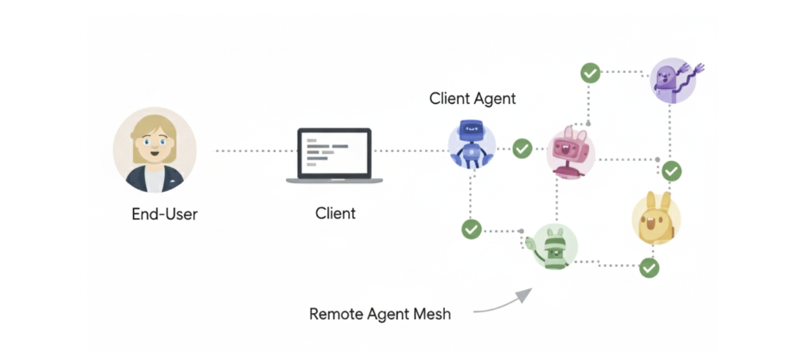

# Agent2Agent (A2A) Protocol

## What is A2A Protocol?

A2A Protocol stands for Agent-to-Agent Protocol.
It is a standardized communication protocol that allows autonomous AI agents to talk to, coordinate with, and delegate tasks to other agents in a secure, observable, and structured way—without human intervention.

**A2A = how agents collaborate with other agents**

## Why A2A Protocol exists
In agentic AI systems, a single agent is not enough for:

- Complex reasoning
- Long workflows
- Cross-domain actions
- Enterprise-grade automation

So we build multiple specialized agents (Planner, Executor, Validator, Security, etc.).

➡️ A2A Protocol defines how these agents interact.

## Simple analogy

| Human world      | Agentic AI world       |
| ---------------- | ---------------------- |
| Email / Slack    | A2A messages           |
| Meeting agenda   | Task contract          |
| Role handoff     | Agent delegation       |
| Status update    | Agent state sync       |
| Approval request | Human-in-the-loop gate |


## Core responsibilities of A2A Protocol

1️⃣ **Agent discovery**

Agents must know:

- Who exists
- What skills they have
- How to reach them

```
{
  "agent_id": "terraform_executor",
  "capabilities": ["iac", "aws", "terraform_apply"]
}
```

2️⃣ **Task delegation**

One agent assigns work to another.

```
{
  "from_agent": "planner",
  "to_agent": "executor",
  "task": "Create VPC and EC2 using Terraform",
  "constraints": {
    "region": "ap-south-1",
    "budget_limit": 50
  }
}
```

3️⃣ **Structured messaging**

Messages are **machine-readable**, not free text.

Typical message types:

- ```TASK_REQUEST```
- ```TASK_RESPONSE```
- ```STATUS_UPDATE```
- ```ERROR```
- ```APPROVAL_REQUIRED```

4️⃣ **State synchronization**

Agents share:

- Progress
- Intermediate results
- Failures
- Retries

```
{
  "agent": "executor",
  "state": "IN_PROGRESS",
  "step": "terraform plan"
}
```

5️⃣ **Trust, identity & security**

Enterprise systems require:

- Agent identity
- Authentication
- Authorization
- Policy enforcement

Example:

```
{
  "agent_id": "security_agent",
  "permission": "approve_prod_changes"
}
```

## Where A2A fits in Agentic Architecture

```
User
 ↓
Orchestrator / Planner
 ↓ (A2A Protocol)
+-------------------+
| Agent Network     |
|-------------------|
| Planner Agent     |
| Executor Agent    |
| Validator Agent   |
| Security Agent    |
| Learning Agent    |
+-------------------+
```

➡️ A2A is the glue between agents

## A2A vs Tools vs MCP (important distinction)

| Aspect         | Tools          | MCP                        | A2A                 |
| -------------- | -------------- | -------------------------- | ------------------- |
| Purpose        | Call functions | External capability access | Agent collaboration |
| Who calls      | Agent → Tool   | Agent → Server             | Agent → Agent       |
| Stateful       | ❌              | ⚠️                         | ✅                   |
| Long workflows | ❌              | ❌                          | ✅                   |
| Governance     | Minimal        | Medium                     | **High**            |


**✔ A2A is for multi-agent systems**
**✔ Tools/MCP are for capabilities**

## Detailed comparison table (important)

| Dimension          | Current Multi-Agent    | A2A-Based System            |
| ------------------ | ---------------------- | --------------------------- |
| Communication      | Function / graph edges | **Protocol messages**       |
| Control            | Central orchestrator   | **Distributed**             |
| Agent autonomy     | Low                    | **High**                    |
| Agent identity     | Implicit               | **Explicit**                |
| Agent discovery    | Hard-coded             | **Dynamic**                 |
| Delegation         | Static                 | **Dynamic & negotiated**    |
| Long-running tasks | Weak                   | **Native**                  |
| Failure handling   | Orchestrator retries   | **Agent-to-agent recovery** |
| Governance         | After-thought          | **Built-in**                |
| Human-in-loop      | Manual                 | **Protocol-level**          |
| Cross-org agents   | Almost impossible      | **Designed for it**         |

## Why use the A2A Protocol


**Interoperability**

Connect agents built on different platforms (LangGraph, CrewAI, Semantic Kernel, custom solutions) to create powerful, composite AI systems.


**Complex Workflows**

Enable agents to delegate sub-tasks, exchange information, and coordinate actions to solve complex problems that a single agent cannot.

**Secure & Opaque**

Agents interact without needing to share internal memory, tools, or proprietary logic, ensuring security and preserving intellectual property.

## How does A2A work with MCP?


**A2A** and **Model Context Protocol (MCP)** are complementary standards for building robust agentic applications:

- **Model Context Protocol (MCP):** Provides agent-to-tool communication. It's a complementary standard that standardizes how an agent connects to its tools, APIs, and resources to get information.

- **IBM ACP:** Incorporated into the A2A Protocol

- **Cisco agntcy:** A framework that provides components to the Internet of Agents with discovery, group communication, identity and observability and leverages A2A and MCP for agent communication and tool calling.

- **A2A:** Provides agent-to-agent communication. As a universal, decentralized standard, A2A acts as the public internet that allows ai agents—including those using MCP, or built with frameworks like agntcy—to interoperate, collaborate, and share their findings.

## What is A2A?
The A2A protocol is an open standard that enables seamless communication and collaboration between AI agents. It provides a common language for agents built using diverse frameworks and by different vendors, fostering interoperability and breaking down silos. Agents are autonomous problem-solvers that act independently within their environment. A2A allows agents from different developers, built on different frameworks, and owned by different organizations to unite and work together.

## Why Use the A2A Protocol
A2A addresses key challenges in AI agent collaboration. It provides a standardized approach for agents to interact. 

## Problems that A2A Solves
Consider a user request for an AI assistant to plan an international trip. This task involves orchestrating multiple specialized agents, such as:

- A flight booking agent
- A hotel reservation agent
- An agent for local tour recommendations
- A currency conversion agent

Without A2A, integrating these diverse agents presents several challenges:

- **Agent Exposure:** Developers often wrap agents as tools to expose them to other agents, similar to how tools are exposed in a Multi-agent Control Platform (Model Context Protocol). However, this approach is inefficient because agents are designed to negotiate directly. Wrapping agents as tools limits their capabilities. A2A allows agents to be exposed as they are, without requiring this wrapping.

- **Custom Integrations:** Each interaction requires custom, point-to-point solutions, creating significant engineering overhead.

- **Slow Innovation:** Bespoke development for each new integration slows innovation.

- **Scalability Issues:** Systems become difficult to scale and maintain as the number of agents and interactions grows.

- **Interoperability:** This approach limits interoperability, preventing the organic formation of complex AI ecosystems.

- **Security Gaps:** Ad hoc communication often lacks consistent security measures.


The A2A protocol addresses these challenges by establishing interoperability for AI agents to interact reliably and securely.

## A2A Example Scenario

**A User's Complex Request**

A user interacts with an AI assistant, giving it a complex prompt like "Plan an international trip."


**The Need for Collaboration**

The AI assistant receives the prompt and realizes it needs to call upon multiple specialized agents to fulfill the request. These agents include a Flight Booking Agent, a Hotel Reservation Agent, a Currency Conversion Agent, and a Local Tours Agent.


**The Interoperability Challenge**

**The core problem:** The agents are unable to work together because each has its own bespoke development and deployment.

The consequence of a lack of a standardized protocol is that these agents cannot collaborate with each other let alone discover what they can do. The individual agents (Flight, Hotel, Currency, and Tours) are isolated.

**The "With A2A" Solution**

The A2A Protocol provides standard methods and data structures for agents to communicate with one another, regardless of their underlying implementation, so the same agents can be used as an interconnected system, communicating seamlessly through the standardized protocol.

The AI assistant, now acting as an orchestrator, receives the cohesive information from all the A2A-enabled agents. It then presents a single, complete travel plan as a seamless response to the user's initial prompt.



## Core Benefits of A2A

Implementing the A2A protocol offers significant advantages across the AI ecosystem:

- **Secure collaboration:** Without a standard, it's difficult to ensure secure communication between agents. A2A uses HTTPS for secure communication and maintains opaque operations, so agents can't see the inner workings of other agents during collaboration.

- **Interoperability:** A2A breaks down silos between different AI agent ecosystems, enabling agents from various vendors and frameworks to work together seamlessly.

- **Agent autonomy:** A2A allows agents to retain their individual capabilities and act as autonomous entities while collaborating with other agents.

- **Reduced integration complexity:** The protocol standardizes agent communication, enabling teams to focus on the unique value their agents provide.

- **Support for LRO:** The protocol supports long-running operations (LRO) and streaming with Server-Sent Events (SSE) and asynchronous execution.


## Key Design Principles of A2A

A2A development follows principles that prioritize broad adoption, enterprise-grade capabilities, and future-proofing.

- **Simplicity:** A2A leverages existing standards like HTTP, JSON-RPC, and Server-Sent Events (SSE). This avoids reinventing core technologies and accelerates developer adoption.

- **Enterprise Readiness:** A2A addresses critical enterprise needs. It aligns with standard web practices for robust authentication, authorization, security, privacy, tracing, and monitoring.

- **Asynchronous:** A2A natively supports long-running tasks. It handles scenarios where agents or users might not remain continuously connected. It uses mechanisms like streaming and push notifications.

- **Modality Independent:** The protocol allows agents to communicate using a wide variety of content types. This enables rich and flexible interactions beyond plain text.

- **Opaque Execution:** Agents collaborate effectively without exposing their internal logic, memory, or proprietary tools. Interactions rely on declared capabilities and exchanged context. This preserves intellectual property and enhances security.

## Understanding the Agent Stack: A2A, MCP, Agent Frameworks and Models

A2A is situated within a broader agent stack, which includes:

- **A2A:** Standardizes communication among agents deployed in different organizations and developed using diverse frameworks.

- **MCP:** Connects models to data and external resources.

- **Frameworks (like ADK):** Provide toolkits for constructing agents.

- **Models:** Fundamental to an agent's reasoning, these can be any Large Language Model (LLM).


## A2A and MCP

In the broader ecosystem of AI communication, you might be familiar with protocols designed to facilitate interactions between agents, models, and tools. Notably, the Model Context Protocol (MCP) is an emerging standard focused on connecting Large Language Models (LLMs) with data and external resources.

The Agent2Agent (A2A) protocol is designed to standardize communication between AI agents, particularly those deployed in external systems. A2A is positioned to complement MCP, addressing a distinct yet related aspect of agent interaction.

- **MCP's Focus:** Reducing the complexity involved in connecting agents with tools and data. Tools are typically stateless and perform specific, predefined functions (e.g., a calculator, a database query).

- **A2A's Focus:** Enabling agents to collaborate within their native modalities, allowing them to communicate as agents (or as users) rather than being constrained to tool-like interactions. This enables complex, multi-turn interactions where agents reason, plan, and delegate tasks to other agents. For example, this facilitates multi-turn interactions, such as those involving negotiation or clarification when placing an order.


## A2A Request Lifecycle

The A2A request lifecycle is a sequence that details the four main steps a request follows: ```agent discovery```, ```authentication```, ```sendMessage API```, and ```sendMessageStream API```. The following diagram provides a deeper look into the operational flow, illustrating the interactions between the ```client```, ```A2A server```, and ```auth server```.


## Core Concepts and Components in A2A

A2A uses a set of core concepts that define how agents interact. Understand these core building blocks to develop or integrate with A2A-compliant systems.


## Core Actors in A2A Interactions

- **User:** The end user, which can be a human operator or an automated service. The user initiates a request or defines a goal that requires assistance from one or more AI agents.

- **A2A Client (Client Agent):** An application, service, or another AI agent that acts on behalf of the user. The client initiates communication using the A2A protocol.

- **A2A Server (Remote Agent):** An AI agent or an agentic system that exposes an HTTP endpoint implementing the A2A protocol. It receives requests from clients, processes tasks, and returns results or status updates. From the client's perspective, the remote agent operates as an opaque (black-box) system, meaning its internal workings, memory, or tools are not exposed.

## Fundamental Communication Elements

| Element     | Description                                                                                                                                 | Key Purpose                                                                                                     |
|-------------|---------------------------------------------------------------------------------------------------------------------------------------------|------------------------------------------------------------------------------------------------------------------|
| Agent Card  | A JSON metadata document describing an agent's identity, capabilities, endpoint, skills, and authentication requirements.                 | Enables clients to discover agents and understand how to interact with them securely and effectively.          |
| Task        | A stateful unit of work initiated by an agent, with a unique ID and a defined lifecycle.                                                  | Facilitates tracking of long-running operations and enables multi-turn interactions and collaboration.         |
| Message     | A single turn of communication between a client and an agent, containing content and a role (e.g., "user" or "agent").                   | Conveys instructions, context, questions, answers, or status updates that are not necessarily formal artifacts.|
| Part        | The fundamental content container (e.g., TextPart, FilePart, DataPart) used within Messages and Artifacts.                                | Provides flexibility for agents to exchange various content types within messages and artifacts.               |
| Artifact    | A tangible output generated by an agent during a task (e.g., a document, image, or structured data).                                      | Delivers the concrete results of an agent's work, ensuring structured and retrievable outputs.                  |


## Interaction Mechanisms

The A2A Protocol supports various interaction patterns to accommodate different needs for responsiveness and persistence. These mechanisms ensure that agents can exchange information efficiently and reliably, regardless of the task's complexity or duration:


- **Request/Response (Polling):** Clients send a request and the server responds. For long-running tasks, the client periodically polls the server for updates.

- **Streaming with Server-Sent Events (SSE):** Clients initiate a stream to receive real-time, incremental results or status updates from the server over an open HTTP connection.

- **Push Notifications:** For very long-running tasks or disconnected scenarios, the server can actively send asynchronous notifications to a client-provided webhook when significant task updates occur.


## Agent Cards

The Agent Card is a JSON document that serves as a digital business card for initial discovery and interaction setup. It provides essential metadata about an agent. Clients parse this information to determine if an agent is suitable for a given task, how to structure requests, and how to communicate securely. Key information includes identity, service endpoint (URL), A2A capabilities, authentication requirements, and a list of skills.

## Messages and Parts

A message represents a single turn of communication between a client and an agent. It includes a role ("user" or "agent") and a unique ```messageId```. It contains one or more Part objects, which are granular containers for the actual content. This design allows A2A to be modality independent.

- **TextPart:** Contains plain textual content.

- **FilePart:** Represents a file. It can be transmitted either inline (Base64 encoded) or through a URI. It includes metadata like "name" and "mimeType".

- **DataPart:** Carries structured JSON data. This is useful for forms, parameters, or any machine-readable information.

## Artifacts

An artifact represents a tangible output or a concrete result generated by a remote agent during task processing. Unlike general messages, artifacts are the actual deliverables. An artifact has a unique artifactId, a human-readable name, and consists of one or more part objects. Artifacts are closely tied to the task lifecycle and can be streamed incrementally to the client.

## Agent Response: Task or Message

The agent response can be a new ```Task``` (when the agent needs to perform a long-running operation) or a ```Message``` (when the agent can respond immediately).


## Other Important Concepts

| Aspect                     | Description                                                                                                                                                                                                 |
|---------------------------|-------------------------------------------------------------------------------------------------------------------------------------------------------------------------------------------------------------|
| **Context (`contextId`)**     | A server-generated identifier used to logically group multiple related Task objects, providing shared context across a series of interactions.                                                             |
| **Transport and Format**      | A2A communication occurs over HTTP(S), using JSON-RPC 2.0 as the payload format for all requests and responses.                                                                                            |
| **Authentication & Authorization** | A2A relies on standard web security practices. Authentication requirements are declared in the Agent Card, and credentials (e.g., OAuth tokens, API keys) are passed via HTTP headers, separate from A2A messages. |
| **Agent Discovery**           | The process by which clients locate Agent Cards to identify available A2A servers and understand their capabilities.                                                                                    |
| **Extensions**                | A2A allows agents to declare custom protocol extensions within their Agent Card, enabling extensibility beyond the core protocol.                                                                        |


## Agent Discovery in A2A

To collaborate using the Agent2Agent (A2A) protocol, AI agents need to first find each other and understand their capabilities. A2A standardizes agent self-descriptions through the Agent Card. However, discovery methods for these Agent Cards vary by environment and requirements. The Agent Card defines what an agent offers. Various strategies exist for a client agent to discover these cards. The choice of strategy depends on the deployment environment and security requirements.

## The Role of the Agent Card

The Agent Card is a JSON document that serves as a digital "business card" for an A2A Server (the remote agent). It is crucial for agent discovery and interaction. The key information included in an Agent Card is as follows:

- **Identity:** Includes `name`, `description`, and `provider information`.

- **Service Endpoint:** Specifies the `url` for the A2A service.

- **A2A Capabilities:** Lists supported features such as `streaming` or `pushNotifications`.

- **Authentication:** Details the required schemes (e.g., `"Bearer"`, `"OAuth2"`).

- **Skills:** Describes the agent's tasks using `AgentSkill` objects, including `id`, `name`, `description`, `inputModes`, `outputModes`, and `examples`.

Client agents use the Agent Card to determine an agent's suitability, structure requests, and ensure secure communication.


## Discovery Strategies

The following sections detail common strategies used by client agents to discover remote Agent Cards:

## 1. Well-Known URI
This approach is recommended for public agents or agents intended for broad discovery within a specific domain.

- **Mechanism:** A2A Servers make their Agent Card discoverable by hosting it at a standardized, `well-known` URI on their domain. The standard path is `https://{agent-server-domain}/.well-known/agent-card.json`, following the principles of `RFC 8615`.

**Process:** 
1. A client agent knows or programmatically discovers the domain of a potential A2A Server (e.g., `smart-thermostat.example.com`).

2. The client performs an HTTP GET request to `https://smart-thermostat.example.com/.well-known/agent-card.json`.

3. If the Agent Card exists and is accessible, the server returns it as a JSON response.

**Advantages:**

 - Ease of implementation
 - Adheres to standards
 - Facilitates automated discovery

**Considerations:**

 - Best suited for open or domain-controlled discovery scenarios.
 - Authentication is necessary at the endpoint serving the Agent Card if it contains sensitive details.


## 2. Curated Registries (Catalog-Based Discovery)

This approach is employed in enterprise environments or public marketplaces, where Agent Cards are often managed by a central registry. The curated registry acts as a central repository, allowing clients to query and discover agents based on criteria like "skills" or "tags".

- **Mechanism:** An intermediary service (the registry) maintains a collection of Agent Cards. Clients query this registry to find agents based on various criteria (e.g., skills offered, tags, provider name, capabilities).

- **Process:**

 1. A2A Servers publish their Agent Cards to the registry.
 2. Client agents query the registry's API, and search by criteria such as "specific skills".
 3. The registry returns matching Agent Cards or references.

- **Advantages:**

 - Centralized management and governance.
 - Capability-based discovery (e.g., by skill).
 - Support for access controls and trust frameworks.
 - Applicable in both private and public marketplaces.

- **Considerations:**

 - Requires deployment and maintenance of a registry service.
 - The current A2A specification does not prescribe a standard API for curated registries.

## 3. Direct Configuration / Private Discovery
This approach is used for tightly coupled systems, private agents, or development purposes, where clients are directly configured with Agent Card information or URLs.

- **Mechanism:** Client applications utilize hardcoded details, configuration files, environment variables, or proprietary APIs for discovery.

- **Process:** The process is specific to the application's deployment and configuration strategy.

- **Advantages:** This method is straightforward for establishing connections within known, static relationships.

- **Considerations:**

 - Inflexible for dynamic discovery scenarios.
 - Changes to Agent Card information necessitate client reconfiguration.
 - Proprietary API-based discovery also lacks standardization.


## Securing Agent Cards

Agent Cards include sensitive information, such as:

 - URLs for internal or restricted agents.
 - Descriptions of sensitive skills.

## Protection Mechanisms

To mitigate risks, the following protection mechanisms should be considered:

- **Authenticated Agent Cards:** We recommend the use of authenticated extended agent cards for sensitive information or for serving a more detailed version of the card.

- **Secure Endpoints:** Implement access controls on the HTTP endpoint serving the Agent Card (e.g., `/.well-known/agent-card.json` or registry API). The methods include:

  - Mutual TLS (mTLS)
  - Network restrictions (e.g., IP ranges)
  - HTTP Authentication (e.g., OAuth 2.0)

- **Registry Selective Disclosure:** Registries return different Agent Cards based on the client's identity and permissions.


Any Agent Card containing sensitive data must be protected with authentication and authorization mechanisms. The A2A specification strongly recommends the use of out-of-band dynamic credentials rather than embedding static secrets within the Agent Card.


## Enterprise Implementation of A2A

The Agent2Agent (A2A) protocol is designed with enterprise requirements at its core.

## 1.Transport Level Security (TLS)

Ensuring the confidentiality and integrity of data in transit is fundamental for any enterprise application.

 - **HTTPS Mandate:** All A2A communication in production environments must occur over HTTPS.
 - **Modern TLS Standards:** Implementations should use modern TLS versions.
 - **Server Identity Verification:** 2A clients should verify the A2A server's identity by validating its TLS certificate against trusted certificate authorities during the TLS handshake.


## 2.Authentication

A2A delegates authentication to standard web mechanisms. It primarily relies on HTTP headers and established standards like OAuth2 and OpenID Connect. Authentication requirements are advertised by the A2A server in its Agent Card.

 - **No Identity in Payload:**A2A protocol payloads, such as JSON-RPC messages, don't carry user or client identity information directly. 
 - **Agent Card Declaration:**The A2A server's Agent Card describes the authentication schemes it supports in its security field and aligns with those defined in the OpenAPI Specification for authentication. 
 - **Out-of-Band Credential Acquisition:**The A2A Client obtains the necessary credentials, such as OAuth 2.0 tokens or API keys, through processes external to the A2A protocol itself. 
 - **HTTP Header Transmission:**Credentials must be transmitted in standard HTTP headers as per the requirements of the chosen authentication scheme. Examples include `Authorization: Bearer <TOKEN> or API-Key: <KEY_VALUE>`.
 - **Server-Side Validation:** The A2A server must authenticate every incoming request using the credentials provided in the HTTP headers.
 - **In-Task Authentication (Secondary Credentials):**If an agent needs additional credentials to access a different system or service during a task (for example, to use a specific tool on the user's behalf), the A2A server indicates to the client that more information is needed. The client is then responsible for obtaining these secondary credentials through a process outside of the A2A protocol itself (for example, an OAuth flow) and providing them back to the A2A server to continue the task.


 ## 3.Authorization

 Once a client is authenticated, the A2A server is responsible for authorizing the request. Authorization logic is specific to the agent's implementation, the data it handles, and applicable enterprise policies.

  - **Granular Control:** Authorization should be applied based on the authenticated identity, which could represent an end user, a client application, or both.

  - **Skill-Based Authorization:** Access can be controlled on a per-skill basis, as advertised in the Agent Card. For example, specific OAuth scopes should grant an authenticated client access to invoke certain skills but not others.

  - **Data and Action-Level Authorization:** Agents that interact with backend systems, databases, or tools must enforce appropriate authorization before performing sensitive actions or accessing sensitive data through those underlying resources. The agent acts as a gatekeeper.

  - **Principle of Least Privilege:** Agents must grant only the necessary permissions required for a client or user to perform their intended operations through the A2A interface.


 ## 4.Data Privacy and Confidentiality

 Protecting sensitive data exchanged between agents is paramount, requiring strict adherence to privacy regulations and best practices.

  - **Sensitivity Awareness:** Implementers must be acutely aware of the sensitivity of data exchanged in Message and Artifact parts of A2A interactions. 

  - **Compliance:** Ensure compliance with relevant data privacy regulations such as GDPR, CCPA, and HIPAA, based on the domain and data involved.

  - **Data Minimization:** Avoid including or requesting unnecessarily sensitive information in A2A exchanges.

  - **Secure Handling:** Protect data both in transit, using TLS as mandated, and at rest if persisted by agents, according to enterprise data security policies and regulatory requirements.


## 5.Tracing, Observability, and Monitoring

A2A's reliance on HTTP allows for straightforward integration with standard enterprise tracing, logging, and monitoring tools, providing critical visibility into inter-agent workflows.

 - **Distributed Tracing:** A2A Clients and Servers should participate in distributed tracing systems. For example, use OpenTelemetry to propagate trace context, including trace IDs and span IDs, through standard HTTP headers, such as W3C Trace Context headers. This enables end-to-end visibility for debugging and performance analysis.

 - **Comprehensive Logging:** Log details on both client and server, including taskId, sessionId, correlation IDs, and trace context for troubleshooting and auditing.

 - **Metrics:** A2A servers should expose key operational metrics, such as request rates, error rates, task processing latency, and resource utilization, to enable performance monitoring, alerting, and capacity planning. 

 - **Auditing:** Audit significant events, such as task creation, critical state changes, and agent actions, especially when involving sensitive data or high-impact operations.


## 6.API Management and Governance

For A2A servers exposed externally, across organizational boundaries, or even within large enterprises, integration with API Management solutions is highly recommended, as this provides:

 - **Centralized Policy Enforcement:** Consistent application of security policies such as authentication and authorization, rate limiting, and quotas.

 - **Traffic Management:** Load balancing, routing, and mediation.

 - **Analytics and Reporting:** Insights into agent usage, performance, and trends.

 - **Developer Portals:** Facilitate discovery of A2A-enabled agents, provide documentation such as Agent Cards, and streamline onboarding for client developers.


## Life of a Task

In the Agent2Agent (A2A) Protocol, interactions can range from simple, stateless exchanges to complex, long-running processes. When an agent receives a message from a client, it can respond in one of two fundamental ways:

 - **Respond with a Stateless `Message`:** This type of response is typically used for immediate, self-contained interactions that conclude without requiring further state management.

 - **Initiate a Stateful `Task`:** If the response is a Task, the agent will process it through a defined lifecycle, communicating progress and requiring input as needed, until it reaches an interrupted state (e.g., input-required, auth-required) or a terminal state (e.g., completed, canceled, rejected, failed).


## Group Related Interactions

A `contextId` is a crucial identifier that logically groups multiple `Task` objects and independent `Message` objects, providing continuity across a series of interactions.

 - When a client sends a message for the first time, the agent responds with a new `contextId`. If a task is initiated, it will also have a `taskId`.

 - Clients can send subsequent messages and include the same `contextId` to indicate that they are continuing their previous interaction within the same context.

 - Clients optionally attach the `taskId` to a subsequent message to indicate that it continues that specific task.

The `contextId` enables collaboration towards a common goal or a shared contextual session across multiple, potentially concurrent tasks. Internally, an A2A agent (especially one using an LLM) uses the `contextId` to manage its internal conversational state or its LLM context.


## Agent Response: Message or Task

The choice between responding with a Message or a Task depends on the nature of the interaction and the agent's capabilities:

 - **Messages for Trivial Interactions:** Message objects are suitable for transactional interactions that don't require long-running processing or complex state management. An agent might use messages to negotiate the acceptance or scope of a task before committing to a Task object.

 - **Tasks for Stateful Interactions:** Once an agent maps the intent of an incoming message to a supported capability that requires substantial, trackable work over an extended period, the agent responds with a `Task` object.


Conceptually, agents operate at different levels of complexity:


- **Message-only Agents:** Always respond with `Message` objects. They typically don't manage complex state or long-running executions, and use `contextId` to tie messages together. These agents might directly wrap LLM invocations and simple tools.

- **Task-generating Agents:** Always respond with `Task` objects, even for responses, which are then modeled as completed tasks. Once a task is created, the agent will only return `Task` objects in response to messages sent, and once a task is complete, no more messages can be sent. This approach avoids deciding between Task versus `Message`, but creates completed task objects for even simple interactions.

- **Hybrid Agents:** Generate both `Message` and `Task` objects. These agents use messages to negotiate agent capability and the scope of work for a task, then send a `Task` object to track execution and manage states like `input-required` or error handling. Once a task is created, the agent will only return Task objects in response to messages sent, and once a task is complete, no more messages can be sent. A hybrid agent uses messages to negotiate the scope of a task, and then generate a task to track its execution.

## Task Refinements

Clients often need to send new requests based on task results or refine the outputs of previous tasks. This is modeled by starting another interaction using the same `contextId` as the original task. Clients further hint the agent by providing references to the original task using `referenceTaskIds` in the `Message` object. The agent then responds with either a new `Task` or a `Message`.

## Task Immutability

Once a task reaches a terminal state (completed, canceled, rejected, or failed), it cannot restart. Any subsequent interaction related to that task, such as a refinement, must initiate a new task within the same `contextId`. This principle offers several benefits:

 - **Task Immutability.** Clients reliably reference tasks and their associated state, artifacts, and messages, providing a clean mapping of inputs to outputs. This is valuable for orchestration and traceability.

 - **Clear Unit of Work.** Every new request, refinement, or follow-up becomes a distinct task. This simplifies bookkeeping, allows for granular tracking of an agent's work, and enables tracing each artifact to a specific unit of work.

 - **Easier Implementation.** This removes ambiguity for agent developers regarding whether to create a new task or restart an existing one.


## Parallel Follow-ups
A2A supports parallel work by enabling agents to create distinct, parallel tasks for each follow-up message sent within the same contextId. This allows clients to track individual tasks and create new dependent tasks as soon as a prerequisite task is complete.

For example:

 - Task 1: Book a flight to Helsinki.
 - Task 2: Based on Task 1, book a hotel.
 - Task 3: Based on Task 1, book a snowmobile activity.
 - Task 4: Based on Task 2, add a spa reservation to the hotel booking.


## Referencing Previous Artifacts
The serving agent infers the relevant artifact from a referenced task or from the `contextId`. As the domain expert, the serving agent is best suited to resolve ambiguity or identify missing information. If there is ambiguity, the agent asks the client for clarification by returning an `input-required` state. The client then specifies the artifact in its response, optionally populating artifact references (`artifactId`, `taskId`) in `Part` metadata.

## Tracking Artifact Mutation
Follow-up or refinement tasks often lead to the creation of new artifacts based on older ones. Tracking these mutations is important to ensure that only the most recent version of an artifact is used in subsequent interactions. This could be conceptualized as a version history, where each new artifact is linked to its predecessor.

However, the client is in the best position to manage this artifact linkage. The client determines what constitutes an acceptable result and has the ability to accept or reject new versions. Therefore, the serving agent shouldn't be responsible for tracking artifact mutations, and this linkage is not part of the A2A protocol specification. Clients should maintain this version history on their end and present the latest acceptable version to the user.

To facilitate client-side tracking, serving agents should use a consistent artifact-name when generating a refined version of an existing artifact.

When initiating follow-up or refinement tasks, the client should explicitly reference the specific artifact they intend to refine, ideally the "latest" version from their perspective. If the artifact reference is not provided, the serving agent can:

  - Attempt to infer the intended artifact based on the current contextId.
  - If there is ambiguity or insufficient context, the agent should respond with an input-required task state to request clarification from the client.

## Example Follow-up Scenario

The following example illustrates a typical task flow with a follow-up:

1. **Client sends a message to the agent:**

```
{
  "jsonrpc": "2.0",
  "id": "req-001",
  "method": "message.send",
  "params": {
    "message": {
      "role": "user",
      "parts": [
        {
          "text": "Generate an image of a sailboat on the ocean."
        }
      ],
      "messageId": "msg-user-001"
    }
  }
}
```

2. **Agent responds with a boat image (completed task):**

```
{
  "jsonrpc": "2.0",
  "id": "req-001",
  "result": {
    "id": "task-boat-gen-123",
    "contextId": "ctx-conversation-abc",
    "status": {
      "state": "completed"
    },
    "artifacts": [
      {
        "artifactId": "artifact-boat-v1-xyz",
        "name": "sailboat_image.png",
        "description": "A generated image of a sailboat on the ocean.",
        "parts": [
          {
            "file": {
              "name": "sailboat_image.png",
              "mediaType": "image/png",
              "fileWithBytes": "base64_encoded_png_data_of_a_sailboat"
            }
          }
        ]
      }
    ]
  }
}
```

3. Client asks to color the boat red. This refinement request refers to the previous `taskId` and uses the same `contextId`.

```
{
  "jsonrpc": "2.0",
  "id": "req-002",
  "method": "message.send",
  "params": {
    "message": {
      "role": "user",
      "messageId": "msg-user-002",
      "contextId": "ctx-conversation-abc",
      "referenceTaskIds": [
        "task-boat-gen-123"
      ],
      "parts": [
        {
          "text": "Please modify the sailboat to be red."
        }
      ]
    }
  }
}
```

4. Agent responds with a new image artifact (new task, same context, same artifact name): The agent creates a new task within the same `contextId`. The new boat image artifact retains the same name but has a new `artifactId`.


```
{
  "jsonrpc": "2.0",
  "id": "req-002",
  "result": {
    "id": "task-boat-color-456",
    "contextId": "ctx-conversation-abc",
    "status": {
      "state": "completed"
    },
    "artifacts": [
      {
        "artifactId": "artifact-boat-v2-red-pqr",
        "name": "sailboat_image.png",
        "description": "A generated image of a red sailboat on the ocean.",
        "parts": [
          {
            "file": {
              "name": "sailboat_image.png",
              "mediaType": "image/png",
              "fileWithBytes": "base64_encoded_png_data_of_a_RED_sailboat"
            }
          }
        ]
      }
    ]
  }
}
```

## Extensions in A2A

The Agent2Agent (A2A) protocol provides a strong foundation for inter-agent communication. However, specific domains or advanced use cases often require additional structure, custom data, or new interaction patterns beyond the generic methods. Extensions are A2A's powerful mechanism for layering new capabilities onto the base protocol.

Extensions allow for extending the A2A protocol with new data, requirements, RPC methods, and state machines. Agents declare their support for specific extensions in their Agent Card, and clients can then opt-in to the behavior offered by an extension as part of requests they make to the agent. Extensions are identified by a URI and defined by their own specification. Anyone is able to define, publish, and implement an extension.

The flexibility of extensions allows for customizing A2A without fragmenting the core standard, fostering innovation and domain-specific optimizations.


## Scope of Extensions

The exact set of possible ways to use extensions is intentionally broad, facilitating the ability to expand A2A beyond known use cases. However, some foreseeable applications include:


- **Data-only Extensions:** Exposing new, structured information in the Agent Card that doesn't impact the request-response flow. For example, an extension could add structured data about an agent's GDPR compliance.

- **Profile Extensions:** Overlaying additional structure and state change requirements on the core request-response messages. This type effectively acts as a profile on the core A2A protocol, narrowing the space of allowed values (for example, requiring all messages to use `DataParts` adhering to a specific schema). This can also include augmenting existing states in the task state machine by using metadata. For example, an extension could define a 'generating-image' sub-state when `TaskStatus.state` is 'working' and `TaskStatus.message.metadata["generating-image"]` is true.

- **Method Extensions (Extended Skills):** Adding entirely new RPC methods beyond the core set defined by the protocol. An Extended Skill refers to a capability or function an agent gains or exposes specifically through the implementation of an extension that defines new RPC methods. For example, a `task-history` extension might add a `tasks/search` RPC method to retrieve a list of previous tasks, effectively providing the agent with a new, extended skill.

- **State Machine Extensions:** Adding new states or transitions to the task state machine.

## List of Example Extensions

| Extension Name                         | Description                                                                                                                                                                   |
|---------------------------------------|-------------------------------------------------------------------------------------------------------------------------------------------------------------------------------|
| Secure Passport Extension             | Adds a trusted, contextual layer for immediate personalization and reduced overhead (v1).                                                                                    |
| Hello World / Timestamp Extension     | A simple extension demonstrating how to augment base A2A types by adding timestamps to the metadata field of Message and Artifact objects (v1).                                |
| Traceability Extension                | Provides traceability capabilities, including a Python implementation and basic usage examples, enabling end-to-end request tracking (v1).                                   |
| Agent Gateway Protocol (AGP) Extension| A core protocol layer or routing extension that introduces Autonomous Squads (ASq) and routes Intent payloads based on declared Capabilities, enhancing system scalability (v1).|


## Limitations

There are some changes to the protocol that extensions don't allow, primarily to prevent breaking core type validations:

 - **Changing the Definition of Core Data Structures:** For example, adding new fields or removing required fields to protocol-defined data structures). Extensions should place custom attributes in the metadata map present on core data structures.

 - **Adding New Values to Enum Types:** Extensions should use existing enum values and annotate additional semantic meaning in the metadata field.

## Extension Declaration

Agents declare their support for extensions in their Agent Card by including `AgentExtension` objects within their `AgentCapabilities` object.

The following is an example of an Agent Card with an extension:

```
{
  "name": "Magic 8-ball",
  "description": "An agent that can tell your future... maybe.",
  "version": "0.1.0",
  "url": "https://example.com/agents/eightball",
  "capabilities": {
    "streaming": true,
    "extensions": [
      {
        "uri": "https://example.com/ext/konami-code/v1",
        "description": "Provide cheat codes to unlock new fortunes",
        "required": false,
        "params": {
          "hints": [
            "When your sims need extra cash fast",
            "You might deny it, but we've seen the evidence of those cows."
          ]
        }
      }
    ]
  },
  "defaultInputModes": ["text/plain"],
  "defaultOutputModes": ["text/plain"],
  "skills": [
    {
      "id": "fortune",
      "name": "Fortune teller",
      "description": "Seek advice from the mystical magic 8-ball",
      "tags": ["mystical", "untrustworthy"]
    }
  ]
}
```


## Required Extensions

While extensions generally offer optional functionality, some agents may have stricter requirements. When an Agent Card declares an extension as required: true, it signals to clients that some aspect of the extension impacts how requests are structured or processed, and that the client must abide by it. Agents shouldn't mark data-only extensions as required. If a client does not request activation of a required extension, or fails to follow its protocol, the agent should reject the incoming request with an appropriate error.

## Extension Specification

The detailed behavior and structure of an extension are defined by its **specification**. While the exact format is not mandated, it should contain at at least:

  - The specific URI(s) that identify the extension.
  - The schema and meaning of objects specified in the `params` field of the `AgentExtension` object.
  - Schemas of any additional data structures communicated between client and agent.
  - Details of new request-response flows, additional endpoints, or any other logic required to implement the extension.

## Extension Dependencies

Extensions might depend on other extensions. This can be a required dependency (where the extension cannot function without the dependent) or an optional one (where additional functionality is enabled if another extension is present). Extension specifications should document these dependencies. It is the client's responsibility to activate an extension and all its required dependencies as listed in the extension's specification.

## Extension Activation

Extensions default to being inactive, providing a baseline experience for extension-unaware clients. Clients and agents perform negotiation to determine which extensions are active for a specific request.

1. **Client Request:** A client requests extension activation by including the A2A-Extensions header in the HTTP request to the agent. The value is a comma-separated list of extension URIs the client intends to activate.

2. **Agent Processing:** Agents are responsible for identifying supported extensions in the request and performing the activation. Any requested extensions not supported by the agent can be ignored.

3. **Response:** Once the agent has identified all activated extensions, the response SHOULD include the A2A-Extensions header, listing all extensions that were successfully activated for that request.


**Example request showing extension activation:**

```
POST /agents/eightball HTTP/1.1
Host: example.com
Content-Type: application/json
A2A-Extensions: https://example.com/ext/konami-code/v1
Content-Length: 519
{
  "jsonrpc": "2.0",
  "method": "message/send",
  "id": "1",
  "params": {
    "message": {
      "kind": "message",
      "messageId": "1",
      "role": "user",
      "parts": [{"kind": "text", "text": "Oh magic 8-ball, will it rain today?"}]
    },
    "metadata": {
      "https://example.com/ext/konami-code/v1/code": "motherlode"
    }
  }
}
```

**Corresponding response echoing activated extensions:**

```
HTTP/1.1 200 OK
Content-Type: application/json
A2A-Extensions: https://example.com/ext/konami-code/v1
Content-Length: 338
{
  "jsonrpc": "2.0",
  "id": "1",
  "result": {
    "kind": "message",
    "messageId": "2",
    "role": "agent",
    "parts": [{"kind": "text", "text": "That's a bingo!"}]
  }
}
```

## Implementation Considerations

While the A2A protocol defines the functionality of extensions, this section provides guidance on their implementation—best practices for authoring, versioning, and distributing extension implementations.

- **Versioning:** Extension specifications evolve. It is crucial to have a clear versioning strategy to ensure that clients and agents can negotiate compatible implementations.

 - **Recommendation:** Use the extension's URI as the primary version identifier, ideally including a version number (for example, https://example.com/ext/my-extension/v1).
 - **Breaking Changes:** A new URI MUST be used when introducing a breaking change to an extension's logic, data structures, or required parameters.
 - **Handling Mismatches:** If a client requests a version not supported by the agent, the agent SHOULD ignore the activation request for that extension; it MUST NOT fall back to a different version.

- **Discoverability and Publication:**

 - **Specification Hosting:** The extension specification document should be hosted at the extension's URI.
 - **Permanent Identifiers:** Authors are encouraged to use a permanent identifier service, such as w3id.org, for their extension URIs to prevent broken links.
 - **Community Registry (Future):** The A2A community might establish a central registry for discovering and browsing available extensions in the future.


- **Packaging and Reusability (A2A SDKs and Libraries):** To promote adoption, extension logic should be packaged into reusable libraries that can be integrated into existing A2A client and server applications.

 - An extension implementation should be distributed as a standard package for its language ecosystem (for example, a PyPI package for Python, an npm package for TypeScript/JavaScript).
 - The objective is to provide a streamlined integration experience for developers. A well-designed extension package should allow a developer to add it to their server with minimal code, for example:


```
import logging
import os

import click

from a2a.server.apps import A2AStarletteApplication
from a2a.server.request_handlers import DefaultRequestHandler
from a2a.server.tasks import InMemoryTaskStore
from a2a.types import AgentCapabilities, AgentCard, AgentSkill
from agent import ReimbursementAgent
from agent_executor import ReimbursementAgentExecutor
from dotenv import load_dotenv
from timestamp_ext import TimestampExtension


load_dotenv()

logging.basicConfig(level=logging.INFO)
logger = logging.getLogger(__name__)


class MissingAPIKeyError(Exception):
    """Exception for missing API key."""


@click.command()
@click.option('--host', default='localhost')
@click.option('--port', default=10002)
def main(host, port):
    try:
        # Check for API key only if Vertex AI is not configured
        if not os.getenv('GOOGLE_GENAI_USE_VERTEXAI') == 'TRUE':
            if not os.getenv('GEMINI_API_KEY'):
                raise MissingAPIKeyError(
                    'GEMINI_API_KEY environment variable not set and GOOGLE_GENAI_USE_VERTEXAI is not TRUE.'
                )

        hello_ext = TimestampExtension()
        capabilities = AgentCapabilities(
            streaming=True,
            extensions=[
                hello_ext.agent_extension(),
            ],
        )
        skill = AgentSkill(
            id='process_reimbursement',
            name='Process Reimbursement Tool',
            description='Helps with the reimbursement process for users given the amount and purpose of the reimbursement.',
            tags=['reimbursement'],
            examples=[
                'Can you reimburse me $20 for my lunch with the clients?'
            ],
        )
        agent_card = AgentCard(
            name='Reimbursement Agent',
            description='This agent handles the reimbursement process for the employees given the amount and purpose of the reimbursement.',
            url=f'http://{host}:{port}/',
            version='1.0.0',
            default_input_modes=ReimbursementAgent.SUPPORTED_CONTENT_TYPES,
            default_output_modes=ReimbursementAgent.SUPPORTED_CONTENT_TYPES,
            capabilities=capabilities,
            skills=[skill],
        )
        agent_executor = ReimbursementAgentExecutor()
        # Use the decorator version of the extension for highest ease of use.
        agent_executor = hello_ext.wrap_executor(agent_executor)
        request_handler = DefaultRequestHandler(
            agent_executor=agent_executor,
            task_store=InMemoryTaskStore(),
        )
        server = A2AStarletteApplication(
            agent_card=agent_card, http_handler=request_handler
        )
        import uvicorn

        uvicorn.run(server.build(), host=host, port=port)
    except MissingAPIKeyError as e:
        logger.error(f'Error: {e}')
        exit(1)
    except Exception as e:
        logger.error(f'An error occurred during server startup: {e}')
        exit(1)


if __name__ == '__main__':
    main()
```

This example showcases how A2A SDKs or libraries such as a2a.server in Python facilitate the implementation of A2A agents and extensions.


- **Security:** Extensions modify the core behavior of the A2A protocol, and therefore introduce new security considerations:

 - **Input Validation:** Any new data fields, parameters, or methods introduced by an extension MUST be rigorously validated. Treat all extension-related data from an external party as untrusted input.
 - **Scope of Required Extensions:** Be mindful when marking an extension as required: true in an Agent Card. This creates a hard dependency for all clients and should only be used for extensions fundamental to the agent's core function and security (for example, a message signing extension).
 - **Authentication and Authorization:** If an extension adds new methods, the implementation MUST ensure these methods are subject to the same authentication and authorization checks as the core A2A methods. An extension MUST NOT provide a way to bypass the agent's primary security controls.

## Streaming and Asynchronous Operations for Long-Running Tasks

The Agent2Agent (A2A) protocol is explicitly designed to handle tasks that might not complete immediately. Many AI-driven operations are often long-running, involve multiple steps, produce incremental results, or require human intervention. A2A provides mechanisms for managing such asynchronous interactions, ensuring that clients receive updates effectively, whether they remain continuously connected or operate in a more disconnected fashion.


## Streaming with Server-Sent Events (SSE)

For tasks that produce incremental results (like generating a long document or streaming media) or provide ongoing status updates, A2A supports real-time communication using Server-Sent Events (SSE). This approach is ideal when the client is able to maintain an active HTTP connection with the A2A Server.

The following key features detail how SSE streaming is implemented and managed within the A2A protocol:

- **Server Capability:** The A2A Server must indicate its support for streaming by setting `capabilities.streaming: true` in its Agent Card.
- **Initiating a Stream:** The client uses the message/stream RPC method to send an initial message (for example, a prompt or command) and simultaneously subscribe to updates for that task.

- **Server Response and Connection:** If the subscription is successful, the server responds with an HTTP 200 OK status and a Content-Type: text/event-stream. This HTTP connection remains open for the server to push events to the client.

- **Event Structure and Types:** The server sends events over this stream. Each event's data field contains a JSON-RPC 2.0 Response object, typically a SendStreamingMessageResponse. The result field of the SendStreamingMessageResponse contains:
   
    - **Task:** Represents the current state of the work.
    - **TaskStatusUpdateEvent:** Communicates changes in the task's lifecycle state (for example, from working to input-required or completed). It also provides intermediate messages from the agent.
    - **TaskArtifactUpdateEvent:** Delivers new or updated Artifacts generated by the task. This is used to stream large files or data structures in chunks, with fields like append and lastChunk to help reassemble.

- **Stream Termination:** The server signals the end of updates for a cycle by setting final: true in a TaskStatusUpdateEvent. This typically occurs when the task reaches a terminal state. After this, the server usually closes the SSE connection.

- **Resubscription:** If a client's SSE connection breaks prematurely while a task is still active, the client is able to attempt to reconnect to the stream using the tasks/resubscribe RPC method.

## When to Use Streaming

Streaming with SSE is best suited for:

  - Real-time progress monitoring of long-running tasks.
  - Receiving large results (artifacts) incrementally.
  - Interactive, conversational exchanges where immediate feedback or partial responses are beneficial.
  - Applications requiring low-latency updates from the agent.


## Protocol Specification References

Refer to the Protocol Specification for detailed structures:

  - message/stream
  - tasks/subscribe


## Push Notifications for Disconnected Scenarios

For very long-running tasks (for example, lasting minutes, hours, or even days) or when clients are unable to or prefer not to maintain persistent connections (like mobile clients or serverless functions), A2A supports asynchronous updates using push notifications. This allows the A2A Server to actively notify a client-provided webhook when a significant task update occurs.

The following key features detail how push notifications are implemented and managed within the A2A protocol:


  - **Server Capability:** The A2A Server must indicate its support for this feature by setting capabilities.pushNotifications: true in its Agent Card.
  - **Configuration:** The client provides a PushNotificationConfig to the server. This configuration is supplied:

     - Within the initial message/send or message/stream request, or
     - Separately, using the tasks/pushNotificationConfig/set RPC method for an existing task. The PushNotificationConfig includes a url (the HTTPS webhook URL), an optional token (for client-side validation), and optional authentication details (for the A2A Server to authenticate to the webhook).

 - **Notification Trigger:** The A2A Server decides when to send a push notification, typically when a task reaches a significant state change (for example, terminal state, input-required, or auth-required). 
 - **Notification Payload:** The A2A protocol defines the HTTP body payload as a StreamResponse object, matching the format used in streaming operations. The payload contains one of: task, message, statusUpdate, or artifactUpdate. See Push Notification Payload for detailed structure.
 - **Client Action:** Upon receiving a push notification (and successfully verifying its authenticity), the client typically uses the tasks/get RPC method with the taskId from the notification to retrieve the complete, updated Task object, including any new artifacts.


 ## When to Use Push Notifications

 Push notifications are ideal for:

   - Very long-running tasks that can take minutes, hours, or days to complete.
   - Clients that cannot or prefer not to maintain persistent connections, such as mobile applications or serverless functions.
   - Scenarios where clients only need to be notified of significant state changes rather than continuous updates.


# Push Notifications – Protocol Specification

## Protocol Specification References

Refer to the following protocol specifications for detailed structures:

- `tasks/pushNotificationConfig/set`
- `tasks/get`

---

## Client-Side Push Notification Service

The URL specified in `PushNotificationConfig.url` points to a **client-side Push Notification Service**.  
This service is responsible for receiving HTTP `POST` notifications from the A2A Server.

### Responsibilities
- Authenticate incoming notifications
- Validate notification relevance
- Relay notifications or their content to the appropriate client application logic or system

---

## Security Considerations for Push Notifications

Push notifications are **asynchronous and server-initiated**, making security a critical requirement.  
Both the **A2A Server** and the **Client Webhook Receiver** share responsibility for secure operation.

---

## A2A Server Security  
*(When sending notifications to client webhook)*

### Webhook URL Validation
A2A Servers **MUST NOT** blindly trust and send `POST` requests to arbitrary URLs provided by clients.

#### Risks
- Server-Side Request Forgery (SSRF)
- Distributed Denial of Service (DDoS) amplification

#### Mitigation Strategies
- Allowlisting trusted domains
- Ownership verification (e.g., challenge–response mechanisms)
- Network controls (e.g., egress firewalls)

---

### Authenticating to the Client's Webhook
The A2A Server **MUST authenticate itself** to the client's webhook URL according to the authentication schemes defined in `PushNotificationConfig.authentication`.

#### Common Authentication Schemes
- Bearer Tokens (OAuth 2.0)
- API Keys
- HMAC Signatures
- Mutual TLS (mTLS)

---

## Client Webhook Receiver Security  
*(When receiving notifications from A2A Server)*

### Authenticating the A2A Server
The webhook endpoint **MUST rigorously verify** that incoming requests originate from a legitimate A2A Server.

#### Verification Methods
- Validate JWT signatures using trusted public keys
- Verify HMAC signatures
- Validate API keys
- Validate `PushNotificationConfig.token` (if provided)

---

### Preventing Replay Attacks

#### Timestamps
- Notifications **SHOULD include a timestamp**
- Webhooks **SHOULD reject** notifications that are older than an acceptable threshold

#### Nonces / Unique Identifiers
- Use single-use identifiers (e.g., JWT `jti` claim or event IDs)
- Prevent duplicate or replayed notifications

---

### Secure Key Management and Rotation
- Implement secure key storage and management
- Rotate cryptographic keys regularly
- Use **JWKS (JSON Web Key Set)** for efficient asymmetric key rotation and validation

---

## Example Asymmetric Key Flow (JWT + JWKS)

### Client Configuration
- Client sets `PushNotificationConfig` with:
  - `authentication.schemes: ["Bearer"]`
  - Expected JWT `issuer` and/or `audience`

---

### A2A Server – Sending Notification
1. Generates a JWT signed with its private key
2. Includes standard claims:
   - `iss` (issuer)
   - `aud` (audience)
   - `iat` (issued at)
   - `exp` (expiration)
   - `jti` (JWT ID)
   - `taskId`
3. JWT header includes:
   - Signing algorithm
   - Key ID (`kid`)
4. Publishes public keys via a JWKS endpoint
5. Sends HTTP `POST` with JWT in the `Authorization` header

---

### Client Webhook – Receiving Notification
1. Extracts JWT from the `Authorization` header
2. Reads `kid` from JWT header
3. Fetches the corresponding public key from the A2A Server’s JWKS endpoint  
   *(Caching keys is recommended)*
4. Verifies the JWT signature
5. Validates claims:
   - `iss`, `aud`
   - `iat`, `exp`
   - `jti`
6. Validates `PushNotificationConfig.token` (if present)

---

## A2A and MCP: Detailed Comparison

# A2A vs MCP: Complementary Protocols for Agentic AI Systems

In AI agent development, two key protocol types emerge to facilitate interoperability:

- One connects **agents to tools and resources**
- The other enables **agent-to-agent collaboration**

The **Agent2Agent (A2A) Protocol** and the **Model Context Protocol (MCP)** address these distinct but highly complementary needs.

---

## Model Context Protocol (MCP)

The **Model Context Protocol (MCP)** defines how an AI agent interacts with and utilizes **individual tools and resources**, such as databases, APIs, or predefined functions.

### Capabilities
- Standardizes how AI models and agents connect to tools, APIs, and external resources
- Defines structured descriptions of tool capabilities (similar to LLM function calling)
- Passes inputs to tools and receives structured outputs
- Supports common use cases such as:
  - LLM calling an external API
  - Agent querying a database
  - Agent invoking predefined functions

---

## Agent2Agent Protocol (A2A)

The **Agent2Agent (A2A) Protocol** enables **independent agents to collaborate with one another** to achieve shared goals.

### Capabilities
- Standardizes peer-to-peer communication between autonomous AI agents
- Enables discovery, negotiation, and coordination between agents
- Supports shared task management, conversational context, and complex data exchange
- Supports use cases such as:
  - A customer service agent delegating work to a billing agent
  - A travel agent coordinating with flight, hotel, and activity agents

---

## Why Different Protocols?

Both MCP and A2A are essential for building advanced agentic systems, but they operate in **different interaction domains**.

### Tools and Resources (MCP Domain)

**Characteristics**
- Well-defined, structured inputs and outputs
- Often stateless
- Perform discrete, specific functions

**Examples**
- Calculator
- Database query API
- Weather lookup service

**Purpose**
- Agents use tools to gather information and perform well-scoped actions

---

### Agents (A2A Domain)

**Characteristics**
- Autonomous, reasoning-driven systems
- Maintain state across interactions
- Use multiple tools
- Engage in multi-turn dialogue
- Adapt to evolving or novel tasks

**Purpose**
- Agents collaborate with other agents to solve complex, end-to-end problems

---

## A2A ❤️ MCP: Complementary Protocols for Agentic Systems

In a typical agentic application:

- **A2A** is used for communication **between agents**
- **MCP** is used internally by each agent to interact with **its tools and resources**

### Conceptual Flow


Agents collaborate via **A2A**, while each agent independently uses **MCP** to access its tools.

---

## Example Scenario: Auto Repair Shop

Consider an auto repair shop staffed by autonomous AI agent "mechanics".

---

### Customer Interaction (User-to-Agent using A2A)

A customer communicates with the **Shop Manager agent**.

**Example**
"My car is making a rattling noise."


This interaction uses **A2A**.

---

### Multi-turn Diagnostics (Agent-to-Agent using A2A)

The Shop Manager engages in a diagnostic conversation.

**Examples**
- "Can you send a video of the noise?"
- "How long has the fluid been leaking?"

This multi-turn, contextual interaction uses **A2A**.

---

### Internal Tool Usage (Agent-to-Tool using MCP)

The assigned Mechanic agent uses MCP to interact with specialized tools.

**Examples**
```python
scan_vehicle_for_error_codes(vehicle_id="XYZ123")
get_repair_procedure(error_code="P0300", vehicle_make="Toyota", vehicle_model="Camry")
raise_platform(height_meters=2)
```

These are structured, tool-based interactions via MCP.

## Supplier Interaction (Agent-to-Agent using A2A)

The Mechanic agent contacts a Parts Supplier agent.

## example

```
"Do you have part #12345 in stock for a Toyota Camry 2018?"
```

**Example**

```
"Do you have part #12345 in stock for a Toyota Camry 2018?"
```
