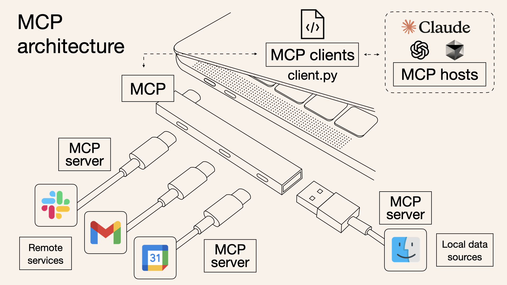

# Model Context Protocol (MCP)

The Model Context Protocol (MCP) is an open standard that enables large language models to interact dynamically with external tools, databases, and APIs through a standardized interface.

The world of artificial intelligence is constantly evolving and we wake up to new news almost every day. What we need to learn now is MCP (Model Context Protocol). Before moving on to what it is and its purpose, let’s look at what the protocol means.

To make things clearer, it’s neither a framework like LangChain nor a tool; it’s a protocol similar to HTTP for the web or SMTP for messaging.

A more relevant example could be LSP (Language Server Protocol), which standardizes adding support for programming languages across an ecosystem of development tools. Similarly, MCP standardizes the integration of additional context and tools into the ecosystem of AI applications.

It provides the universal rules that allow any client to communicate with any server, regardless of who built either component, creating a foundation for a diverse and interoperable AI ecosystem. Anthropic defines it as the USB-C port equivalent for agentic systems. It standardizes the connection between AI applications, LLMs, and external data sources (Databases, Gmail, Slack, etc.).

The Machines are the clients, the peripheral devices are tools, and the MCP is the Type-C port. So, it doesn’t matter who makes the device or peripherals; they work together seamlessly.



MCP defines how clients should communicate with servers and how servers should handle tools (APIs, Functions, etc.) and resources (read-only files like logs, db records, etc.)

# Why should you care about MCP?
## Benefits of Standardization

1. **Unified Integration:** A single protocol for connecting any LLM to any tool
2. **Reduced Development Time:** Standard patterns for resource access and tool execution
3. **Clear Separation of Concerns:** Data access (resources) and computation (tools) are cleanly separated
4. **Consistent Discovery:** Uniform mechanisms for finding available capabilities (tools, resources, prompts, roots, sampling)
5. **Cross-Platform Compatibility:** Tools built for one system work with others


## Is it revolutionary?
Short answer: No.

You can live without MCP. It is not revolutionary but brings standardization to the otherwise chaotic space of agentic development. If your application is MCP client-compliant, you can connect to any MCP client-compliant server. In an alternate world, as a client developer, you have to tailor the servers according to your needs, and others cannot build for your platform. The same is true for server developers.

For example, Inside Cursor, you can connect to any MCP server if they follow the protocols.

At this point, you will be more or less clear about the purpose of the MCP. Now, let’s understand MCP for crystal clear clarity.

# MCP Architecture
The Model Context Protocol has several key components that work together. Here’s a high-level diagram.


The complete MCP architecture consists of four parts

- **Host:** Coordinates the overall system and manages LLM interactions
- **Clients:** Connect hosts to servers with 1:1 relationships
- **Servers:** Provide specialized capabilities through tools, resources, and prompts
- **Base Protocol:** Defines how all these components communicate

In the above chart, the Client and Host are merged; we will keep them separate to clarify things. So, let’s go through each component and understand MCP from within.

# 1. Host
Hosts are the LLM applications that expect data from servers. Hosts can be an IDE, Chatbot, or any LLM application. They are responsible for

- Initializing and managing multiple clients.
- Client-server lifecycle management
- Handles user authorization decisions
- Manages context aggregation across clients

Examples are Claude Desktop, Cursor IDE, Windsurf IDE, etc.

# 2. Client
Each client has these key responsibilities:

- **Dedicated connections:** Each client maintains a one-to-one stateful connection with a single server. This focused relationship ensures clear communication boundaries and security isolation.
- **Message routing:** Clients handle all bidirectional communication, efficiently routing requests, responses, and notifications between the host and their connected server. We will see a small example of it in Cursor IDE with Linear and Slack.
- **Capability management:** Clients monitor what their connected server can do by maintaining information about available tools, resources (contextual data), and prompt templates.
- **Protocol negotiation:** During initialization, clients negotiate protocol versions and capabilities, ensuring compatibility between the host and server.
- **Subscription management:** Clients maintain subscriptions to server resources and handle notification events when those resources change.

# 3. Server
Servers are the fundamental building block that enriches LLMs with external data and context. The key server primitives include:

- **The tools** are executable functions that allow LLM to interact with external apps. Tools function similarly to functions in traditional LLM calls. A tool can be a POST request to API endpoints; for example, a tool defined as LIST_FILES with a directory name as a parameter will fetch the files in the directory and send them back to the client. The tools can also be API calls to external services like Gmail, Slack, Notion, etc.

- **Resources:** These are any. Text files, Log files, DB schema, File contents, and Git history. They provide additional context to the LLMs.

- **Prompt Templates:** Pre-defined templates or instructions that guide language model interactions.

Tools are model-controlled, while Reosuces and Prompts are user-controlled. The models can automatically discover and invoke tools based on a given context.

## Base Protocol

The protocol uses JSON-RPC 2.0 messages to establish communication

- **JSON-RPC** message format
- Stateful connections
- Server and client capability negotiation

## Features
Servers offer any of the following features to clients:

- **Resources:** Context and data, for the user or the AI model to use
- **Prompts:** Templated messages and workflows for users
- **Tools:** Functions for the AI model to execute

## Additional Utilities 

- Configuration
- Progress tracking
- Cancellation
- Error reporting
- Logging

## Security and Trust & Safety
The Model Context Protocol enables powerful capabilities through arbitrary data access and code execution paths. With this power comes important security and trust considerations that all implementors must carefully address.

## Key Principles

1. **User Consent and Control**
- Users must explicitly consent to and understand all data access and operations
- Users must retain control over what data is shared and what actions are taken
- Implementors should provide clear UIs for reviewing and authorizing activities

2. **Data Privacy**
- Hosts must obtain explicit user consent before exposing user data to servers
- Hosts must not transmit resource data elsewhere without user consent
- User data should be protected with appropriate access controls

3. **Tool Safety**
- Tools represent arbitrary code execution and must be treated with appropriate caution
- Hosts must obtain explicit user consent before invoking any tool
- Users should understand what each tool does before authorizing its use

4. **LLM Sampling Controls**
- Users must explicitly approve any LLM sampling requests
- Users should control:
    - Whether sampling occurs at all
    - The actual prompt that will be sent
    - What results the server can see
- The protocol intentionally limits server visibility into prompts

## Implementation Guidelines
While MCP itself cannot enforce these security principles at the protocol level, implementors **SHOULD:**

1. Build robust consent and authorization flows into their applications
2. Provide clear documentation of security implications
3. Implement appropriate access controls and data protections
4. Follow security best practices in their integrations
5. Consider privacy implications in their feature designs


## What is Protocol?

In the computer world, a protocol is a set of rules that determine how two systems will communicate with each other. Protocols regulate data transfer in computer networks, internet communication, and between software systems.


For example:

- **HTTP (Hypertext Transfer Protocol):** Allows websites to communicate with browsers.
- **TCP/IP (Transmission Control Protocol/Internet Protocol):** Defines how data packets on the internet will be routed.
- **JSON-RPC (Remote Procedure Call):** A protocol that allows data exchange in JSON format.


# What is Model Context Protocol (MCP)?
The Model Context Protocol (MCP) is an open protocol that enables large language models (LLMs) to integrate with external data sources and tools in a standardized way. Developed by Anthropic, this protocol makes it easy for AI models to work seamlessly with a variety of tools and data sources.

MCP can be likened to the USB-C port, which has become a global standard for device connections. Just as USB-C provides a common connection point between different devices, MCP enables AI systems to communicate with data and tools in a standard way.

# Why Use MCP?
MCP functions similarly to APIs, but has a wider potential for use. While traditional APIs require a separate implementation for each integration, a single integration with MCP provides access to many different data sources and tools.

MCP also provides two-way communication. In other words, an AI model can not only receive data, but also trigger certain actions.

# Architecture of MCP
MCP is based on a simple client-server architecture. An application can connect to multiple MCP servers at the same time. The structure consists of the following components:

1. **MCP Hosts:** Applications act as MCP hosts to access data or tools.

2. **MCP Clients:** Clients within the host establish one-to-one connections with MCP servers.

3. **MCP Servers:** Lightweight, provide specific functionality through MCP, and can connect to local or remote data sources.

4. **Local Data Sources:** Data that can be accessed by MCP servers, such as files and databases.

5. **Remote Services:** External Internet-based APIs that MCP servers can access.


## Connection Lifecycle

1. **Initialization**


- The client sends an initialize request to the server, containing its own protocol version and capabilities.

- The server responds with its own protocol version and capabilities.

- The client sends the initialized notification.

- The connection is established and the message exchange begins.

2. **Message Exchange**

- Once the connection is established, request and response messages can be sent between the client and the server, or one-way messages can be transmitted.

3. **Termination**

- The client or server can terminate the connection.


# Key Features of MCP

MCP uses the JSON-RPC 2.0 message format to communicate between the client and server. Some of the protocol’s prominent features are:

- **Resources:** Data and content presented to the user or AI model.

- **Prompts:** Predefined messages and workflows prepared for users.

- **Tools:** Functions that the AI ​​model can run.


# Hands On Project

In this project, we will create a structure that brings the latest news from a website.


In the document, they recommend using **uv package manager** instead of pip. So, you can open a terminal and download it to MacOs and Linux with the first command below. You can download it to Windows with the second command.

```
curl -LsSf https://astral.sh/uv/install.sh | sh

powershell -ExecutionPolicy ByPass -c "irm https://astral.sh/uv/install.ps1 | iex"
```

Don’t forget to restart your terminal after doing this.

Then we will create a directory for our project. To do this, open the terminal in the directory where you want to create the project and run the following commands.

- The first command creates a project file in the directory you are in.

(AGENTIC-AI-VENV) ganeshkinkargiri.@M7QJY5-A67EFC4A langgraph % uv init mcp-server-project
Adding `mcp-server-project` as member of workspace `/Users/ganeshkinkargiri./Desktop/LLM-FINE-TUNE/Agentic-AI`
Initialized project `mcp-server-project` at `/Users/ganeshkinkargiri./Desktop/LLM-FINE-TUNE/Agentic-AI/langgraph/mcp-server-project`
(AGENTIC-AI-VENV) ganeshkinkargiri.@M7QJY5-A67EFC4A langgraph % 

- The second command allows you to enter this file directory.
(AGENTIC-AI-VENV) ganeshkinkargiri.@M7QJY5-A67EFC4A langgraph % cd mcp-server-project 

Then we will create a virtual environment and install our packages. For this we use the uv package manager.


```
# cretae virtual env
uv venv

# activate for macos/linux
source .venv/bin/activate

# activate for windows
.venv\Scripts\activate

# install libraries 
uv add "mcp[cli]" httpx bs4 dotenv
```

```
(AGENTIC-AI-VENV) ganeshkinkargiri.@M7QJY5-A67EFC4A mcp-server-project % uv venv
Using CPython 3.10.15 interpreter at: /opt/homebrew/opt/python@3.10/bin/python3.10
Creating virtual environment at: .venv
Activate with: source .venv/bin/activate
(AGENTIC-AI-VENV) ganeshkinkargiri.@M7QJY5-A67EFC4A mcp-server-project % 
```

```
source .venv/bin/activate
(mcp-server-project) ganeshkinkargiri.@M7QJY5-A67EFC4A mcp-server-project % 
```

```
(mcp-server-project) ganeshkinkargiri.@M7QJY5-A67EFC4A mcp-server-project % /Users/ganeshkinkargiri./.local/bin/uv add "mcp[cli]" httpx bs4 dotenv 
warning: `VIRTUAL_ENV=.venv` does not match the project environment path `/Users/ganeshkinkargiri./Desktop/LLM-FINE-TUNE/Agentic-AI/.venv` and will be ignored; use `--active` to target the active environment instead
Using CPython 3.10.15 interpreter at: /opt/homebrew/opt/python@3.10/bin/python3.10
Creating virtual environment at: /Users/ganeshkinkargiri./Desktop/LLM-FINE-TUNE/Agentic-AI/.venv
Resolved 218 packages in 9.34s
Prepared 31 packages in 1.41s
Installed 31 packages in 22ms
 + annotated-types==0.7.0
 + anyio==4.9.0
 + beautifulsoup4==4.13.3
 + bs4==0.0.2
 + certifi==2025.1.31
 + click==8.1.8
 + dotenv==0.9.9
 + exceptiongroup==1.2.2
 + h11==0.14.0
 + httpcore==1.0.7
 + httpx==0.27.2
 + httpx-sse==0.4.0
 + idna==3.10
 + markdown-it-py==3.0.0
 + mcp==1.6.0
 + mdurl==0.1.2
 + pydantic==2.11.1
 + pydantic-core==2.33.0
 + pydantic-settings==2.8.1
 + pygments==2.19.1
 + python-dotenv==1.1.0
 + rich==13.9.4
 + shellingham==1.5.4
 + sniffio==1.3.1
 + soupsieve==2.6
 + sse-starlette==2.2.1
 + starlette==0.46.1
 + typer==0.15.2
 + typing-extensions==4.13.0
 + typing-inspection==0.4.0
 + uvicorn==0.34.0
(mcp-server-project) ganeshkinkargiri.@M7QJY5-A67EFC4A mcp-server-project % 
```

Now we need to open the folder we created in vscode. When we open it, we see that our file structure is ready on the left.

**main.py**

```
from mcp.server.fastmcp import FastMCP
from dotenv import load_dotenv
import httpx
import os
from bs4 import BeautifulSoup
import json

load_dotenv()

# initialize server
mcp = FastMCP("tech_news")

USER_AGENT = "news-app/1.0"

NEWS_SITES = {
    "arstechnica": "https://arstechnica.com"
}

async def fetch_news(url: str):
    """It pulls and summarizes the latest news from the specified news site."""
    async with httpx.AsyncClient() as client:
        try:
            response = await client.get(url, timeout=30.0)
            soup = BeautifulSoup(response.text, "html.parser")
            paragraphs = soup.find_all("p")
            text = " ".join([p.get_text() for p in paragraphs[:5]]) 
            return text
        except httpx.TimeoutException:
            return "Timeout error"

@mcp.tool()  
async def get_tech_news(source: str):
    """
    Fetches the latest news from a specific tech news source.

    Args:
    source: Name of the news source (for example, "arstechnica" or "techcrunch").

    Returns:
    A brief summary of the latest news.
    """
    if source not in NEWS_SITES:
        raise ValueError(f"Source {source} is not supported.")

    news_text = await fetch_news(NEWS_SITES[source])
    return news_text

if __name__ == "__main__":
    mcp.run(transport="stdio")
```

The code above allows the latest news to be retrieved from the given site. It works step by step as follows.

1. First, we make the necessary imports.

2. No API was used in this code, but if you use the API, you can use load_dotenv() to get your keys.

3. We initialize our server with FastMCP.

4. “news-app/1.0” is the application name we gave.

5. NEW_SITES contains the sites from which the news will be retrieved. You can add more sites here if you want.

6. The fetch_news() function retrieves the news from the specified sites.

7. The get_tech_news() function is our tool here. We specify that this is a tool by adding the @mcp.tool() decorator to the function. Having a docstring in this function is important for the model to understand how the tool works.

8. Our MCP Server is running with mcp.run(transport=”stdio”). But we will not run the server via vscode.

Claude desktop can directly run the MCP Server we prepared, so we will use Claude Desktop. You can download it from here: https://claude.ai/download.


Then we open the setting and enter the developer settings. From here we click on edit config.

**claude_desktop_config.json**

```
{
    "mcpServers": {
        "mcp-server-project": {
            "command": "/Users/ganeshkinkargiri./.local/bin/uv",
            "args": [
                "--directory",
                "/Users/ganeshkinkargiri./Desktop/LLM-FINE-TUNE/Agentic-AI/langgraph/mcp-server-project",
                "run",
                "main.py"
            ]
        }
    }
}
```

When we click on edit config, it opens a folder for us. From this folder, we play the claude_desktop_config.json file with a text editor. We will enter our server information here.

This file contains how our server will be run by claude. There are a few points to note:

1. **mcp-server-project** is the name of the project file we created. If you created it with a different name, you can change this.

2. You should add the path where the uv package manager is located to the command section. In this section, only “uv” is written in the document, but it did not work that way for me, so I gave the path. You can run the “which uv” command in the terminal to find the path.

3. You can also change the path in args to your own project path. To do this, you can run the “pwd” command in this directory in the terminal and get the full path.

4. You can save and close the file.


We have completed our server configurations, now we can try it on Claude desktop. When you open Claude desktop, if there is a problem, you can see error pop-ups on the top right. You need to click and examine the log files and solve the error. If you do not receive an error, you should see the hammer in the red square.


When you click on Hammer, it shows you the available MCP Tools as below.


[modelcontextprotocol](https://modelcontextprotocol.io/quickstart/server)


In the context of agentic AI, MCP, or Model Context Protocol, is an open standard that facilitates seamless communication and data exchange between AI agents and external systems, enabling them to access and utilize data and tools efficiently.


MCP addresses this challenge. It provides a universal, open standard for connecting AI systems with data sources, replacing fragmented integrations with a single protocol. The result is a simpler, more reliable way to give AI systems access to the data they need.

## Model Context Protocol
The Model Context Protocol is an open standard that enables developers to build secure, two-way connections between their data sources and AI-powered tools.

The architecture is straightforward: developers can either expose their data through MCP servers or build AI applications (MCP clients) that connect to these servers.

## Three major components of the Model Context Protocol for developers from anthropic

1. **The Model Context Protocol specification and SDKs**
2. **Local MCP server support in the Claude Desktop apps**
3. **An open-source repository of MCP servers**


Claude 3.5 Sonnet is adept at quickly building MCP server implementations, making it easy for organizations and individuals to rapidly connect their most important datasets with a range of AI-powered tools. To help developers start exploring, we’re sharing pre-built MCP servers for popular enterprise systems like Google Drive, Slack, GitHub, Git, Postgres, and Puppeteer.


## Reference Link

1. [modelcontextprotocol.io](https://spec.modelcontextprotocol.io/specification/2024-11-05/)
2. [Language Server Protocol](https://microsoft.github.io/language-server-protocol/)
3. [MCP-1](https://composio.dev/blog/what-is-model-context-protocol-mcp-explained/)
4. [MCP-2](https://medium.com/@tahirbalarabe2/what-is-model-context-protocol-mcp-architecture-overview-c75f20ba4498)
5. [MCP-3](https://aiagentslist.com/blog/what-is-an-mcp-server)
6. [MCP-github](https://github.com/modelcontextprotocol)
7. [MCP-4](https://modelcontextprotocol.io/introduction)


