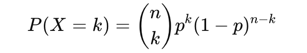
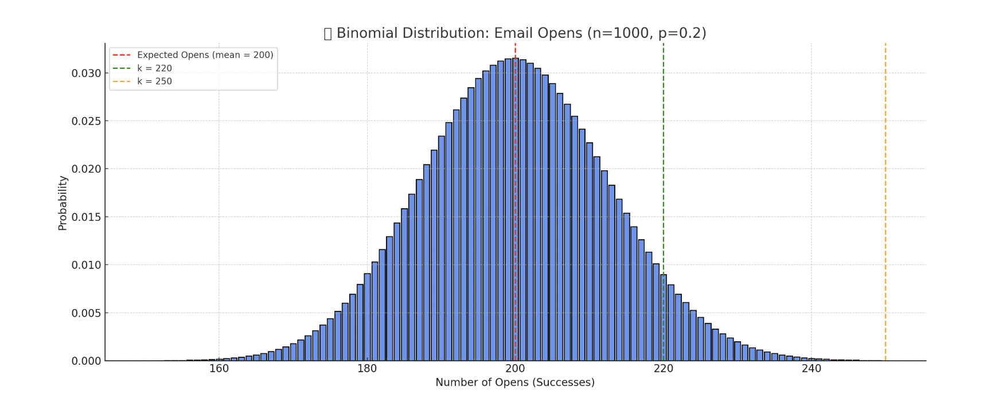
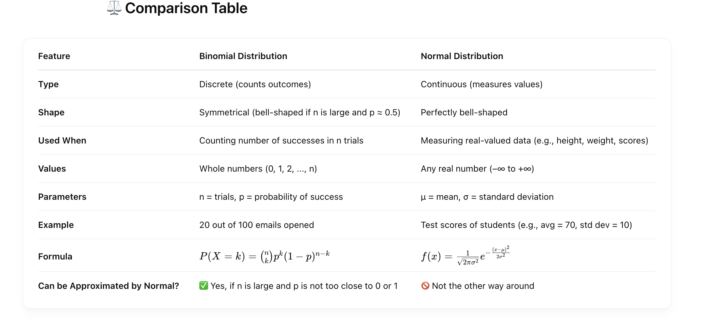
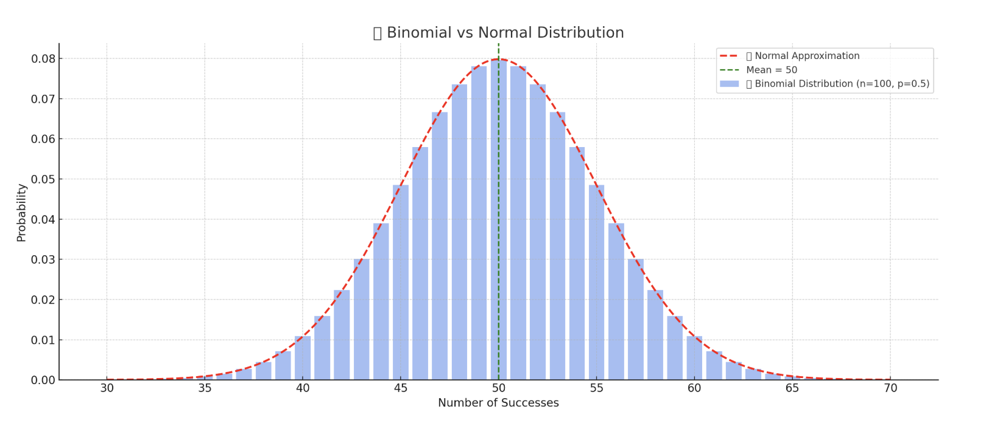
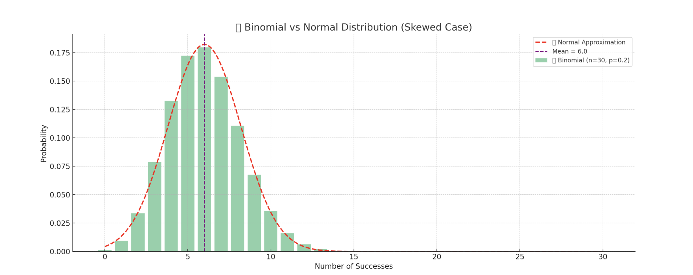
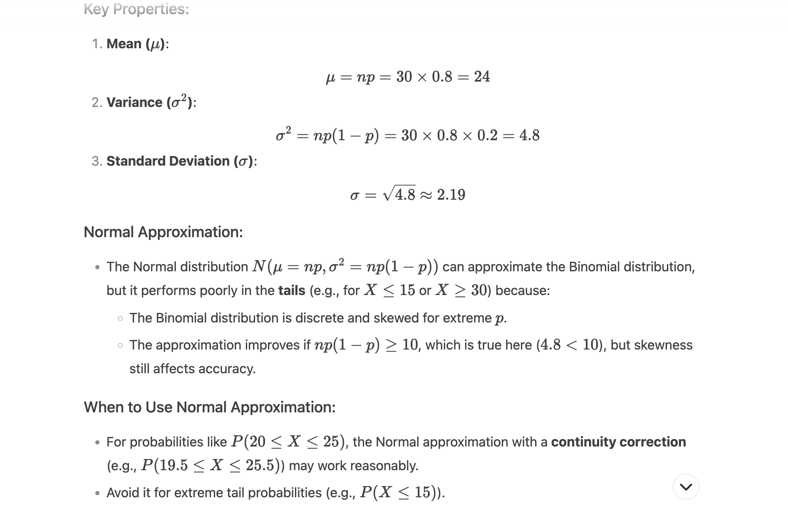
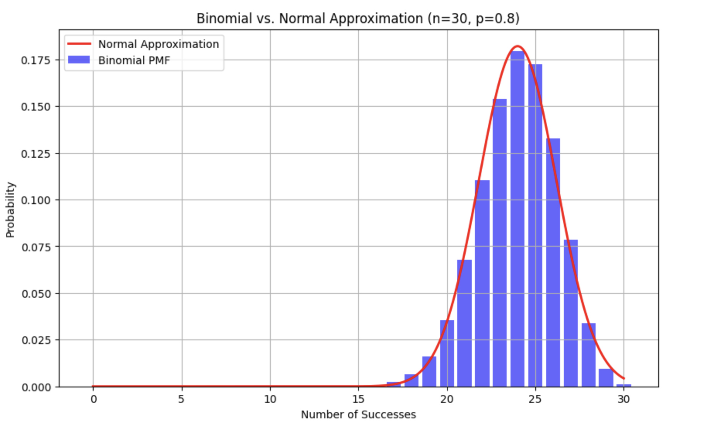

# 📦 What is Binomial Distribution?
A Binomial Distribution is a discrete probability distribution that models the number of successes in a fixed number of independent trials, each with the same probability of success.

It describes the outcome of binary scenarios, e.g. toss of a coin, it will either be head or tails.

It has three parameters:

**n** - number of trials.

**p** - probability of occurence of each trial (e.g. for toss of a coin 0.5 each).

**q or 1−p** - Probability of failure on a single trial

**X** - Random variable: number of successes in n trials

**P(X = k)** - Probability of getting exactly k successes


# 🧮 Binomial Formula:



   n 
- (k​) is the combination (n choose k)

    k
- p    : probability of k successes

        n-k
- (1 - p)    : probability of (n−k) failures

# ✅ Real-Time Example: Email Campaign Success
Scenario:
You’re a marketing manager sending emails to 1000 customers. Based on historical data, you know that 20% (p=0.2) of people open your email.

Let’s calculate and understand:
- What is the probability that **exactly 220** people open the email?
- What’s the **expected number** of opens?
- What’s the **standard deviation**?

# 🧮 Parameters:
- n = 1000 (emails sent)
- p = 0.2 (open rate)
- k = 220 (interested in exactly 220 opens)

# 📊 Real-Time Insights You Can Get:

```
Question	                                                Answer Type
How many people will likely open the email?	                Expected value = n × p = 200
How spread out will the results be?	                        Standard deviation = √(np(1−p)) ≈ 12.65
What’s the chance of getting 220 opens?	                    Use binomial PMF
What if I want at least 250 opens?	                        Use cumulative probability
```

# 🔧 Use in Business:

- **📈 A/B Testing:** Measure how many users click CTA button A vs. button B
- **💌 Email Campaigns:** Predict open/click rates
- **🎯 Conversion Analysis:** Predict success of lead conversions in sales funnels
- **🧪 Quality Control:** How many defective items in a batch of products




Here’s the **Binomial Distribution** plot for your email campaign:
    
- ✅ **Mean (Expected Opens) = 200** (red line)

- 📍 Highlighted ```k = 220``` (green line): you can see the probability of getting exactly 220 opens

- ⚠️ ```k = 250``` (orange line): very low probability — it's at the edge of the distribution

## 🔍 Interpretation:

- Most of your email open counts will hover around **200**, with some fluctuation.

- Getting **250+** opens is rare.

- You can use this to **forecast campaign performance**, set realistic KPIs, or run **A/B tests** confidently.

Want to calculate exact probability values like:

- 📊 P(X = 220) (exactly 220 opens)
- 📈 P(X ≥ 250) (at least 250 opens)

# Difference Between Normal and Binomial Distribution




# 📌 Real-World Examples

## 🔹 Binomial:
- Tossing a coin 10 times and counting heads.
- Counting how many customers clicked an ad (click or no-click).
- Number of defective items in a batch of 50.

## 🔹 Normal:
- Height of 10,000 people.
- Temperature over a year in a city.
- Blood pressure measurements.



Here's the visual comparison between the **Binomial Distribution** (blue bars) and its **Normal approximation** (red dashed curve):

- **Blue bars:** Exact probabilities from the **Binomial Distribution** (n = 100, p = 0.5)
- **Red dashed line: Normal Distribution** approximation using the same mean (50) and standard deviation

- As **n increases**, the **Binomial Distribution** starts looking more like a **Normal Distribution**

- This is why we often use the **Normal Approximation** when working with large n, especially for quick calculations




Here's the visual for the **skewed case**:

# 📊 Binomial (n=30, p=0.2) vs 🔔 Normal Approximation

## 🔍 Key Takeaways:

- The **Binomial Distribution** is **right-skewed** because the probability of success p = 0.2 is low.

- The **Normal Approximation (red dashed line)** doesn't match the binomial well — especially in the tails.

- This shows that **Normal Approximation is not reliable** when:
    - n is **small**
    - p is **far from 0.5**


## Binomial Distribution with p=0.8 and n=30

The Binomial Distribution with parameters n = 30 and p = 0.8 s indeed **left-skewed** because the probability of success is high.causing most outcomes to cluster toward the upper end (near np = 24 ).



```
import numpy as np
import matplotlib.pyplot as plt
from scipy.stats import binom, norm

n, p = 30, 0.8
x = np.arange(0, n+1)
mu = n * p
sigma = np.sqrt(n * p * (1 - p))

# Binomial PMF
binomial_pmf = binom.pmf(x, n, p)

# Normal PDF (for approximation)
x_cont = np.linspace(0, n, 1000)
normal_pdf = norm.pdf(x_cont, mu, sigma)

# Plot
plt.figure(figsize=(10, 6))
plt.bar(x, binomial_pmf, color='blue', alpha=0.6, label='Binomial PMF')
plt.plot(x_cont, normal_pdf, 'r-', lw=2, label='Normal Approximation')
plt.title(f'Binomial vs. Normal Approximation (n={n}, p={p})')
plt.xlabel('Number of Successes')
plt.ylabel('Probability')
plt.legend()
plt.grid(True)
plt.show()
```



**Output Interpretation:**
- The plot will show a left-skewed Binomial distribution with a peak near 24.
- The Normal curve will roughly match the center but deviate in the left tail (X < 20)

**Exact vs. Approximate Probabilities:**

For example, to compute P(X≤20):

- **Exact (Binomial):**
```
from scipy.stats import binom
print(binom.cdf(20, n=30, p=0.8))  # Output: ~0.061 (6.1%)
```

- **Normal Approximation (with continuity correction):**
```
from scipy.stats import norm
print(norm.cdf(20.5, loc=mu, scale=sigma))  # Output: ~0.085 (8.5%)
```

**The Normal approximation overestimates the tail probability due to skewness.**

