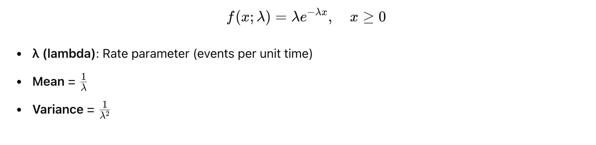
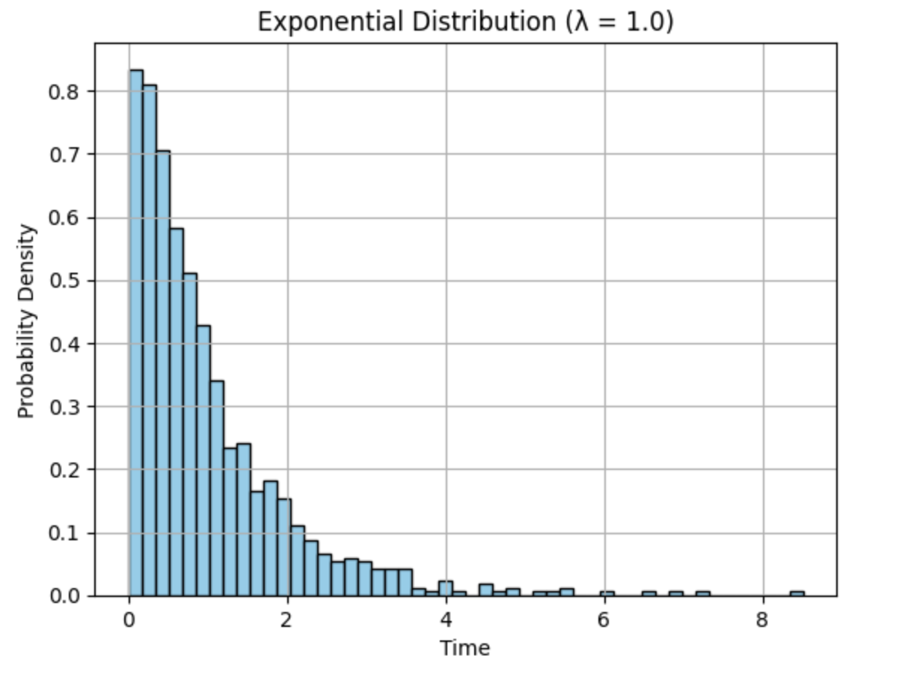

# ⚡ What is Exponential Distribution?
The Exponential Distribution models the time between events in a Poisson process — where events occur continuously and independently at a constant average rate.

# 🧮 Probability Density Function (PDF):


# 📦 Key Properties

```
| **Property**           | **Value**                    |
|------------------------|------------------------------|
| Domain                 | \( x \in [0, \infty) \)       |
| Mean                   | \( \frac{1}{\lambda} \)       |
| Memoryless Property    | ✅ Yes                        |
| Skewness               | Right-skewed                 |
| Related to             | Poisson Distribution         |

```

# 🧠 Real-Time Use Cases

1. 🕒 Server Downtime / Time Between Failures
Example: Time between system crashes or hardware failures.

If server crashes occur at a constant average rate, exponential distribution models the waiting time until the next crash.

2. 📞 Call Center / Customer Support
Time between incoming calls.

If calls arrive independently and at a constant average rate, exponential models the time until the next call.

3. 🧪 Medical / Survival Analysis
Time until a patient responds to a treatment.

Time until death or relapse in survival analysis.

4. 💡 Queueing Systems
Time between customers arriving at a queue (like supermarket, ATM, etc.)


Example

```
import numpy as np
import matplotlib.pyplot as plt

# Generate exponential data
data = np.random.exponential(scale=1.0, size=1000)

plt.hist(data, bins=50, density=True, color='skyblue', edgecolor='black')
plt.title("Exponential Distribution (λ = 1.0)")
plt.xlabel("Time")
plt.ylabel("Probability Density")
plt.grid(True)
plt.show()
```



