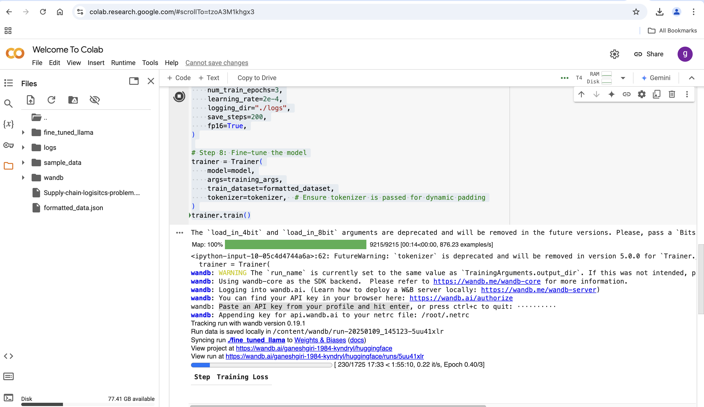
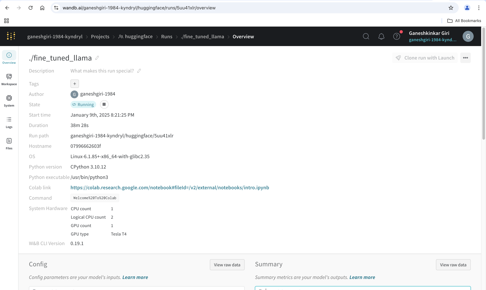
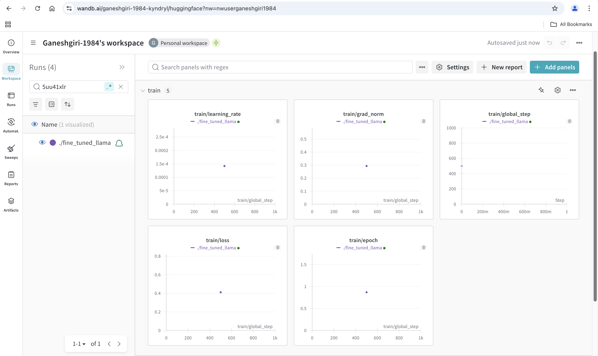
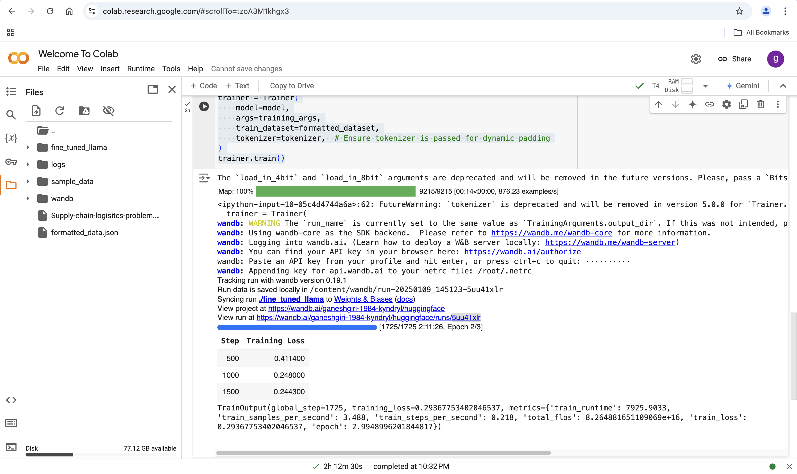

# Fine-tuning a LLaMA model

Fine-tuning a LLaMA model with a custom dataset involves several steps. Here’s a comprehensive guide tailored for your setup:

## Prerequisites

1. **System Requirements:**
- Sufficient GPU memory for training. For LLaMA 3.2 models (70B), multiple GPUs with high VRAM (e.g., A100s) are recommended.
- Ensure your Mac system is connected to a machine with suitable GPUs (or use cloud-based resources like AWS, GCP, or Azure).

2. **Installed Software:**
- Python environment (Anaconda installed).
- Required libraries: transformers, datasets, bitsandbytes, torch, peft (for LoRA-based fine-tuning), and others.
- Proper setup for LLaMA model files. Confirm the downloaded model path is correct.


## Prepare Your Dataset

- **Format:** The dataset should ideally be in JSON or text format. Common formats include:

1. **Supervised Fine-tuning:** { "instruction": "What is X?", "response": "X is Y." }
2. **Unsupervised Fine-tuning:** Plain text data (tokenized).


# Loging huggingface

```
from huggingface_hub import notebook_login

notebook_login()
```

## Convert custom data to proper format data.

```
import json

# Load the JSON data
with open("Supply-chain-logisitcs-problem.json", "r") as f:
    data = json.load(f)

# Define the template for instruction-response
formatted_data = []
for record in data:
    instruction = f"Provide details about Order ID {record['Order ID']}."
    response = ", ".join([f"{key}: {value}" for key, value in record.items()])
    formatted_data.append({"instruction": instruction, "response": response})

# Save the formatted data to a JSONL file
with open("formatted_data.json", "w") as f:
    for entry in formatted_data:
        f.write(json.dumps(entry) + "\n")
```

## Logging into wandb.ai.

- Learn how to deploy a W&B server locally: https://wandb.me/wandb-server
- You can find your API key in your browser here: https://wandb.ai/authorize


## Start training the custom data

```
import json
from datasets import Dataset, load_dataset
from peft import LoraConfig, get_peft_model
from transformers import AutoModelForCausalLM, AutoTokenizer, TrainingArguments, Trainer

# Step 1: Load dataset
dataset = load_dataset("json", data_files="formatted_data.json")["train"]  # Access the 'train' split

# Step 3: Load base model and tokenizer
model_name = "meta-llama/Llama-3.2-1B"  # Replace with your LLaMA model
model = AutoModelForCausalLM.from_pretrained(model_name, load_in_8bit=True, device_map="auto")
tokenizer = AutoTokenizer.from_pretrained(model_name)

# Ensure padding token is set
if tokenizer.pad_token is None:
    if tokenizer.eos_token is None:
        # If there's no eos_token, add a pad token manually
        tokenizer.add_special_tokens({'pad_token': '[PAD]'})
    else:
        # If eos_token exists, use it as pad_token
        tokenizer.pad_token = tokenizer.eos_token

# We also need to resize the embedding layer of the model to accommodate the new token.
model.resize_token_embeddings(len(tokenizer))

# Step 4: Preprocess the dataset for tokenization
def preprocess_data(example):
    # Corrected the key to access the instruction text
    inputs = tokenizer(example["instruction"], truncation=True, padding="max_length", max_length=512)
    labels = tokenizer(example["response"], truncation=True, padding="max_length", max_length=512)
    inputs["labels"] = labels["input_ids"]
    return inputs

# Now we map the dataset, using the dataset loaded from the json file
formatted_dataset = dataset.map(preprocess_data)


# Step 6: Setup LoRA configuration
lora_config = LoraConfig(
    task_type="CAUSAL_LM",
    r=16,
    lora_alpha=32,
    target_modules=["q_proj", "v_proj"],
    lora_dropout=0.1,
)
model = get_peft_model(model, lora_config)

# Step 7: Define training arguments
training_args = TrainingArguments(
    output_dir="./fine_tuned_llama",
    per_device_train_batch_size=1,
    gradient_accumulation_steps=16,
    num_train_epochs=3,
    learning_rate=2e-4,
    logging_dir="./logs",
    save_steps=200,
    fp16=True,
)

# Step 8: Fine-tune the model
trainer = Trainer(
    model=model,
    args=training_args,
    train_dataset=formatted_dataset,
    tokenizer=tokenizer,  # Ensure tokenizer is passed for dynamic padding
)
trainer.train()
```










## Download the folder
```
import shutil

# Replace 'fine_tuned_llama' with the folder name you want to download
shutil.make_archive('fine_tuned_llama', 'zip', 'fine_tuned_llama')

# Download the zipped file
from google.colab import files
files.download('fine_tuned_llama.zip')
```