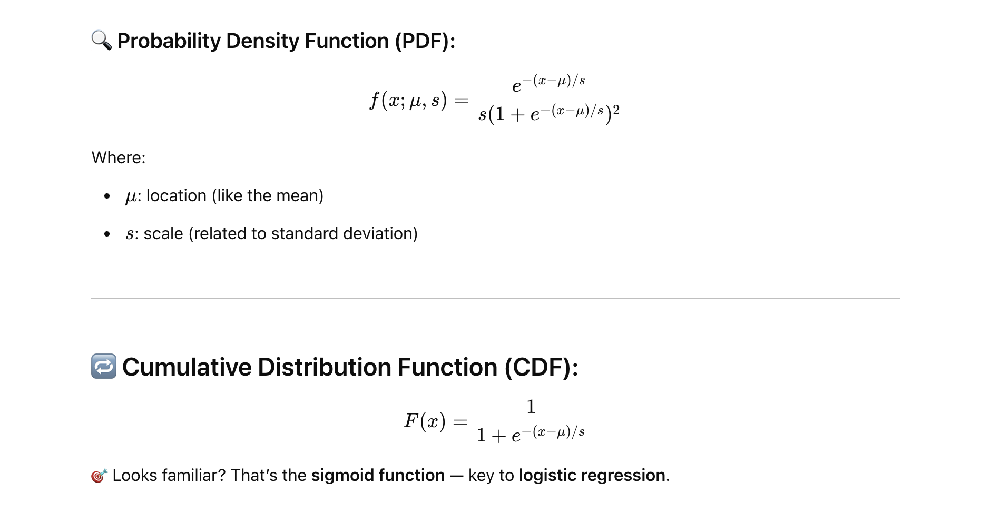
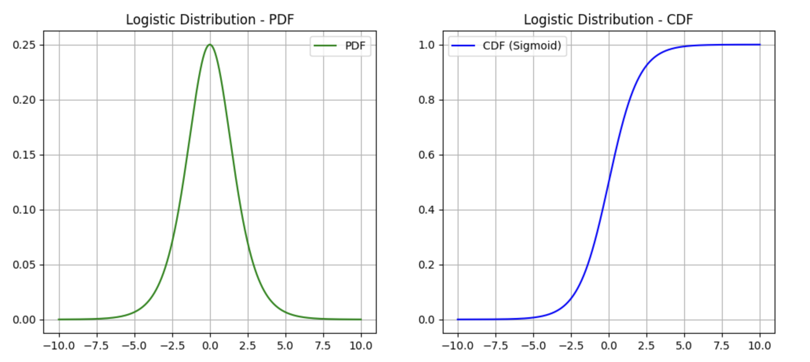

# 📐 What is the Logistic Distribution?
The Logistic Distribution is a continuous probability distribution used for modeling growth and for classification problems.

Its **shape is similar to the normal distribution** — symmetric, bell-shaped — but with **heavier tails.**




# ✅ Real-World Use Cases
1. Logistic Regression (Binary Classification)
    - 🎯 Models the probability that an output belongs to class 1 (vs class 0).
    - Uses the sigmoid function (i.e., logistic CDF) to squash any real-valued input to a value between 0 and 1.

**Example: Predicting whether an email is spam or not spam based on features like subject, sender, keywords, etc.**

2. Neural Networks
    - 🔁 Activation function like sigmoid uses the logistic distribution shape.
    - 🧠 Used to map any value into a bounded range [0, 1].

3. Growth Models
    - 📈 Population or disease spread modeling (e.g., COVID-19 curves).
    - Logistic distribution is used when the rate of growth is proportional to both current value and remaining capacity.

4. Marketing & Adoption Rates
    - 📊 Used in diffusion of innovation — how quickly people adopt new tech (like smartphones, electric cars).
    - Shows slow start → rapid growth → saturation.


Example

```
import numpy as np
import matplotlib.pyplot as plt
from scipy.stats import logistic

x = np.linspace(-10, 10, 1000)
pdf = logistic.pdf(x, loc=0, scale=1)
cdf = logistic.cdf(x, loc=0, scale=1)

plt.figure(figsize=(12,5))

plt.subplot(1,2,1)
plt.plot(x, pdf, label='PDF', color='green')
plt.title("Logistic Distribution - PDF")
plt.grid(True)
plt.legend()

plt.subplot(1,2,2)
plt.plot(x, cdf, label='CDF (Sigmoid)', color='blue')
plt.title("Logistic Distribution - CDF")
plt.grid(True)
plt.legend()

plt.show()

```



# 🔄 Logistic vs Normal Distribution

```
Feature	                    Normal	                                Logistic
PDF shape	                Bell-shaped	                            Bell-shaped
Tails	                    Light	                                Heavier
CDF	                        Error function	                        Sigmoid function
ML use case	                Less in classification	                Logistic regression, sigmoid

```

# Difference Between Logistic and Normal Distribution

| **Feature**              | **Normal Distribution**                         | **Logistic Distribution**                          |
|--------------------------|--------------------------------------------------|----------------------------------------------------|
| **Shape**                | Bell-shaped, symmetric                          | Bell-shaped, symmetric                             |
| **Tails**                | Lighter tails                                   | Heavier tails                                      |
| **Peak**                 | Sharper peak                                    | Flatter peak                                       |
| **PDF (Probability Function)** | Involves exponential and π              | Involves exponential only                          |
| **CDF**                  | Error function                                  | Sigmoid function                                   |
| **Common in**            | Natural phenomena, regression, hypothesis testing | Classification, logistic regression, neural nets |
| **Use in ML**            | Assumes continuous output                       | Used when output is a probability (0–1)            |
| **Analytical Simplicity**| Harder to compute CDF                           | Easier and faster (sigmoid)                        |

# 🧠 Real-World Use in AI/ML

| **Scenario**                          | **Best Fit Distribution** | **Why?**                                              |
|---------------------------------------|----------------------------|--------------------------------------------------------|
| Predicting exam scores, height        | Normal                     | Real-world values cluster around a mean               |
| Classifying emails (spam/not)         | Logistic                   | Probabilistic output between 0 and 1                  |
| Modeling neural network activations   | Logistic                   | Sigmoid is derived from logistic CDF                  |
| Forecasting disease spread            | Logistic                   | Used in logistic growth curves                        |

