# Data Cleaning

## What is Data Cleaning?
Data cleaning is a crucial step in the machine learning (ML) pipeline, as it involves identifying and removing any missing, duplicate, or irrelevant data. The goal of data cleaning is to ensure that the data is accurate, consistent, and free of errors, as incorrect or inconsistent data can negatively impact the performance of the ML model.

Professional data scientists usually invest a very large portion of their time in this step because of the belief that **“Better data beats fancier algorithms”**.

Data cleaning, also known as data cleansing or data preprocessing, is a crucial step in the data science pipeline that involves identifying and correcting or removing errors, inconsistencies, and inaccuracies in the data to improve its quality and usability. Data cleaning is essential because raw data is often noisy, incomplete, and inconsistent, which can negatively impact the accuracy and reliability of the insights derived from it.

## Steps to Perform Data Cleanliness
Performing data cleaning involves a systematic process to identify and rectify errors, inconsistencies, and inaccuracies in a dataset. The following are essential steps to perform data cleaning.

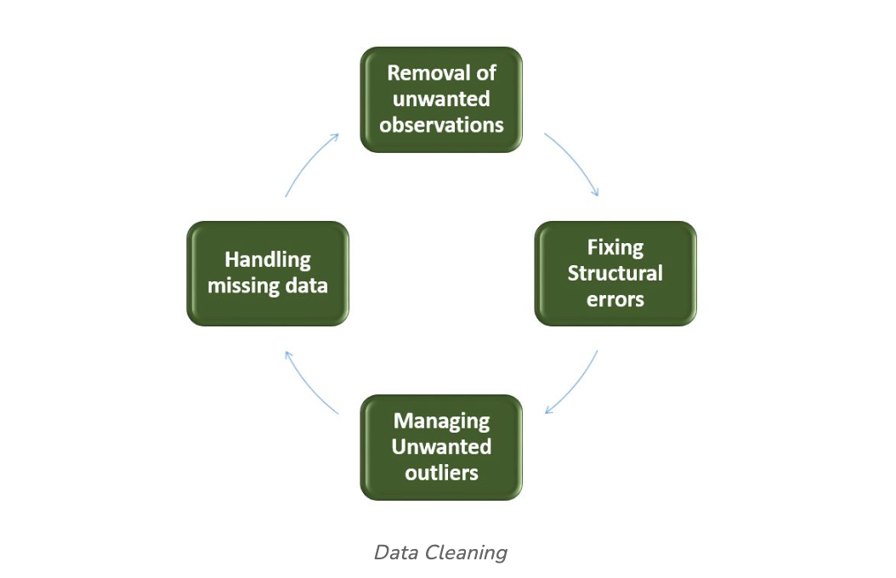

- **Removal of Unwanted Observations:** Identify and eliminate irrelevant or redundant observations from the dataset. The step involves scrutinizing data entries for duplicate records, irrelevant information, or data points that do not contribute meaningfully to the analysis. Removing unwanted observations streamlines the dataset, reducing noise and improving the overall quality.
- **Fixing Structure errors:** Address structural issues in the dataset, such as inconsistencies in data formats, naming conventions, or variable types. Standardize formats, correct naming discrepancies, and ensure uniformity in data representation. Fixing structure errors enhances data consistency and facilitates accurate analysis and interpretation.
- **Managing Unwanted outliers:** Identify and manage outliers, which are data points significantly deviating from the norm. Depending on the context, decide whether to remove outliers or transform them to minimize their impact on analysis. Managing outliers is crucial for obtaining more accurate and reliable insights from the data.
- **Handling Missing Data:** Devise strategies to handle missing data effectively. This may involve imputing missing values based on statistical methods, removing records with missing values, or employing advanced imputation techniques. Handling missing data ensures a more complete dataset, preventing biases and maintaining the integrity of analyses.

## How to Perform Data Cleanliness
Performing data cleansing involves a systematic approach to enhance the quality and reliability of a dataset. The process begins with a thorough understanding of the data, inspecting its structure and identifying issues such as missing values, duplicates, and outliers. Addressing missing data involves strategic decisions on imputation or removal, while duplicates are systematically eliminated to reduce redundancy. Managing outliers ensures that extreme values do not unduly influence analysis. Structural errors are corrected to standardize formats and variable types, promoting consistency.

Throughout the process, documentation of changes is crucial for transparency and reproducibility. Iterative validation and testing confirm the effectiveness of the data cleansing steps, ultimately resulting in a refined dataset ready for meaningful analysis and insights.

## Python Implementation for Database Cleaning
Let’s understand each step for Database Cleaning, using titanic dataset. Below are the necessary steps:

- Import the necessary libraries
- Load the dataset
- Check the data information using df.info()

```
import pandas as pd
import numpy as np

# Load the dataset
df = pd.read_csv('titanic.csv')
df.head()
```

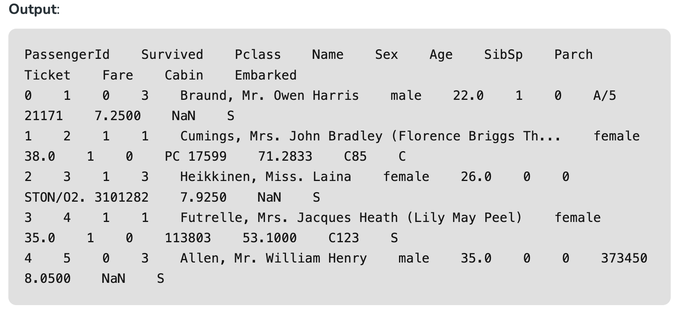

## Data Inspection and Exploration
Let’s first understand the data by inspecting its structure and identifying missing values, outliers, and inconsistencies and check the duplicate rows with below python code:

```
df.duplicated()
```

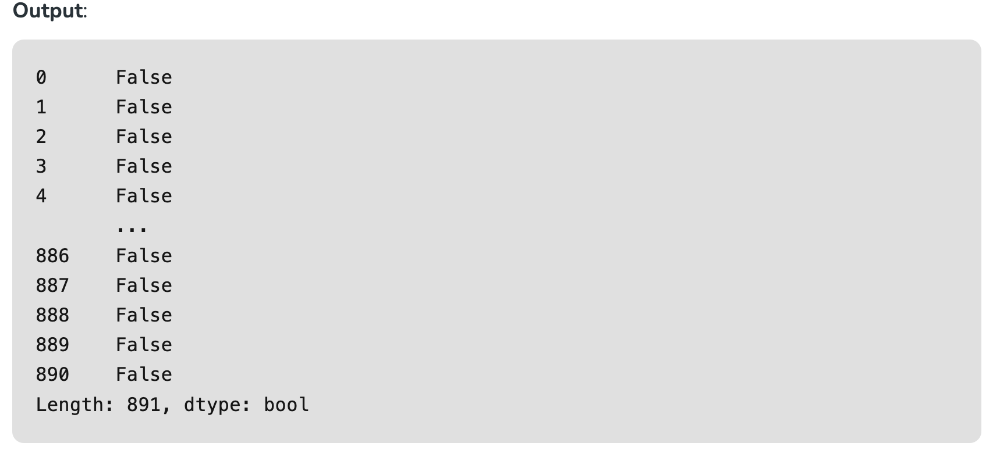

## Check the data information using df.info()

```
df.info()
```

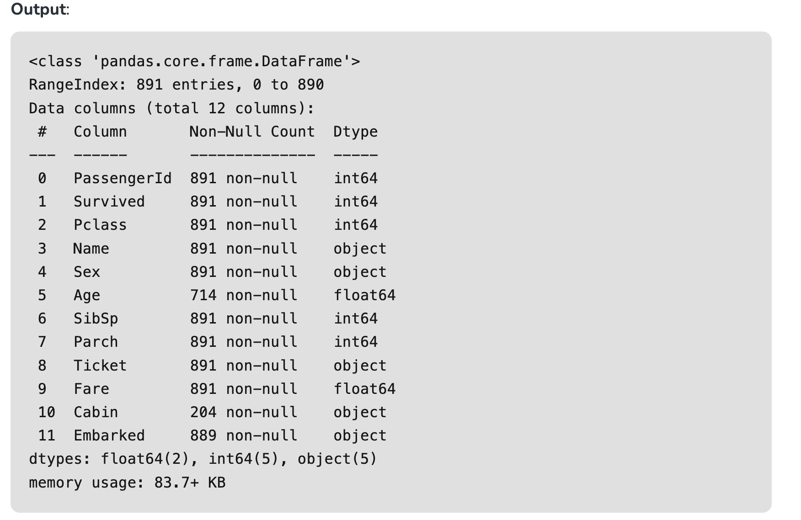

From the above data info, we can see that Age and Cabin have an **unequal number of counts**. And some of the columns are categorical and have data type objects and some are integer and float values.


## Check the Categorical and Numerical Columns.

```
# Categorical columns
cat_col = [col for col in df.columns if df[col].dtype == 'object']
print('Categorical columns :',cat_col)
# Numerical columns
num_col = [col for col in df.columns if df[col].dtype != 'object']
print('Numerical columns :',num_col)
```

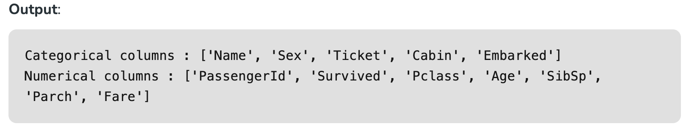

## Check the total number of Unique Values in the Categorical Columns

```
df[cat_col].nunique()
```


## Removal of all Above Unwanted Observations
This includes deleting duplicate/ redundant or irrelevant values from your dataset. Duplicate observations most frequently arise during data collection and Irrelevant observations are those that don’t actually fit the specific problem that you’re trying to solve.

- Redundant observations alter the efficiency to a great extent as the data repeats and may add towards the correct side or towards the incorrect side, thereby producing unfaithful results.
- Irrelevant observations are any type of data that is of no use to us and can be removed directly.

**Now we have to make a decision according to the subject of analysis, which factor is important for our discussion.**

As we know our machines don’t understand the text data. So, we have to either drop or convert the categorical column values into numerical types. Here we are dropping the Name columns because the Name will be always unique and it hasn’t a great influence on target variables. For the ticket, Let’s first print the 50 unique tickets.

```
df['Ticket'].unique()[:50]
```

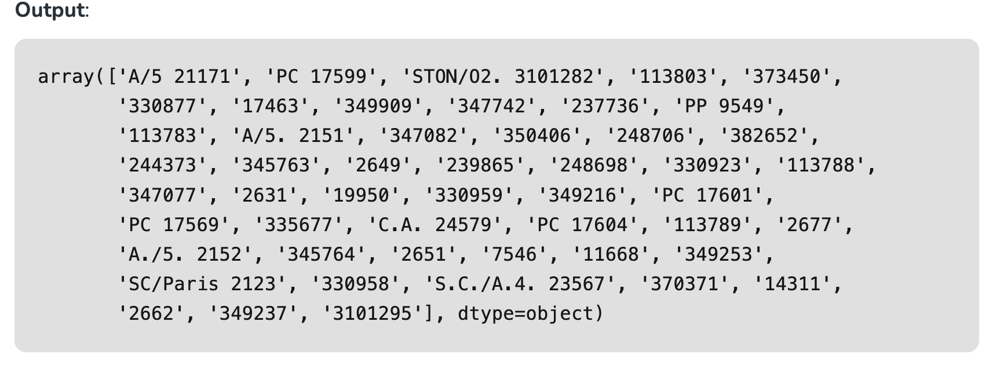

From the above tickets, we can observe that it is made of two like first values ‘A/5 21171’ is joint from of ‘A/5’ and  ‘21171’ this may influence our target variables. It will the case of **Feature Engineering**. where we derived new features from a column or a group of columns. In the current case, we are dropping the “Name” and “Ticket” columns.

## Drop Name and Ticket Columns

```
df1 = df.drop(columns=['Name','Ticket'])
df1.shape
```


## Handling Missing Data
Missing data is a common issue in real-world datasets, and it can occur due to various reasons such as human errors, system failures, or data collection issues. Various techniques can be used to handle missing data, such as imputation, deletion, or substitution.

Let’s check the % missing values columns-wise for each row using df.isnull() it checks whether the values are null or not and gives returns boolean values. and .sum() will sum the total number of null values rows and we divide it by the total number of rows present in the dataset then we multiply to get values in % i.e per 100 values how much values are null.

```
round((df1.isnull().sum()/df1.shape[0])*100,2)
```

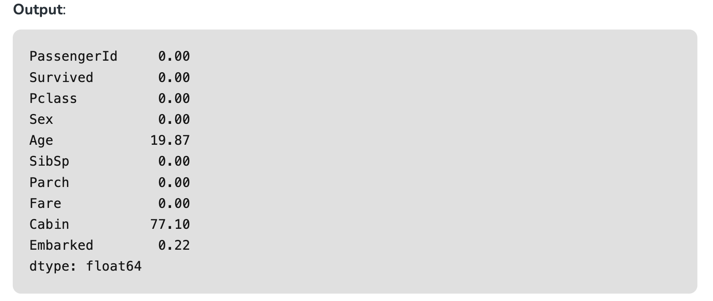

We cannot just ignore or remove the missing observation. They must be handled carefully as they can be an indication of something important. 

**The two most common ways to deal with missing data are:**

- **Dropping Observations with missing values.**
    - The fact that the value was missing may be informative in itself.
    - Plus, in the real world, you often need to make predictions on new data even if some of the features are missing!

As we can see from the above result that Cabin has 77% null values and Age has 19.87% and Embarked has 0.22% of null values.

So, it’s not a good idea to fill 77% of null values. So, we will drop the Cabin column. Embarked column has only 0.22% of null values so, we drop the null values rows of Embarked column.

```
df2 = df1.drop(columns='Cabin')
df2.dropna(subset=['Embarked'], axis=0, inplace=True)
df2.shape
```

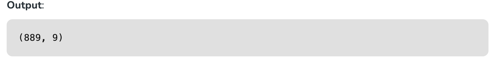

- **Imputing the missing values from past observations.**
    - Again, “missingness” is almost always informative in itself, and you should tell your algorithm if a value was missing.
    - Even if you build a model to impute your values, you’re not adding any real information. You’re just reinforcing the patterns already provided by other features.

We can use **Mean imputation** or **Median imputations** for the case.

**Note: **

- Mean imputation is suitable when the data is normally distributed and has no extreme outliers.
- Median imputation is preferable when the data contains outliers or is skewed.

```
# Mean imputation
df3 = df2.fillna(df2.Age.mean())
# Let's check the null values again
df3.isnull().sum()
```

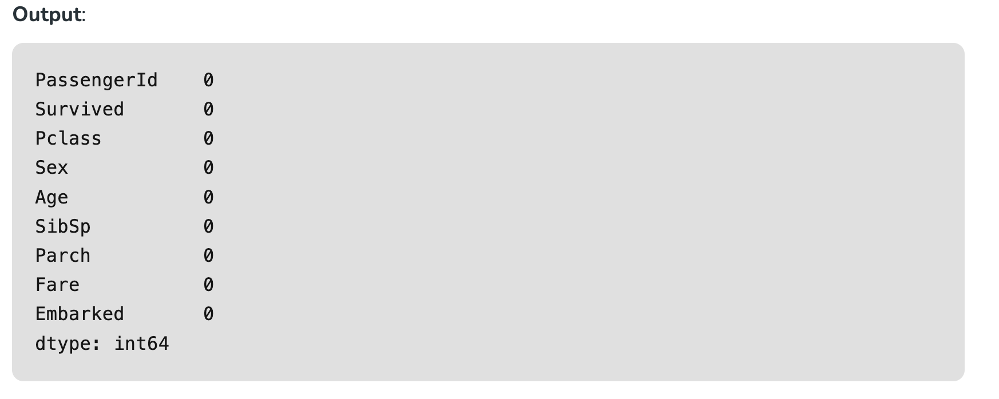

## Handling Outliers

Outliers are extreme values that deviate significantly from the majority of the data. They can negatively impact the analysis and model performance. Techniques such as clustering, interpolation, or transformation can be used to handle outliers.

To check the outliers, We generally use a box plot. A box plot, also referred to as a box-and-whisker plot, is a graphical representation of a dataset’s distribution. It shows a variable’s median, quartiles, and potential outliers. The line inside the box denotes the median, while the box itself denotes the interquartile range (IQR). The whiskers extend to the most extreme non-outlier values within 1.5 times the IQR. Individual points beyond the whiskers are considered potential outliers. A box plot offers an easy-to-understand overview of the range of the data and makes it possible to identify outliers or skewness in the distribution.

**Let’s plot the box plot for Age column data.**

```
import matplotlib.pyplot as plt

plt.boxplot(df3['Age'], vert=False)
plt.ylabel('Variable')
plt.xlabel('Age')
plt.title('Box Plot')
plt.show()
```

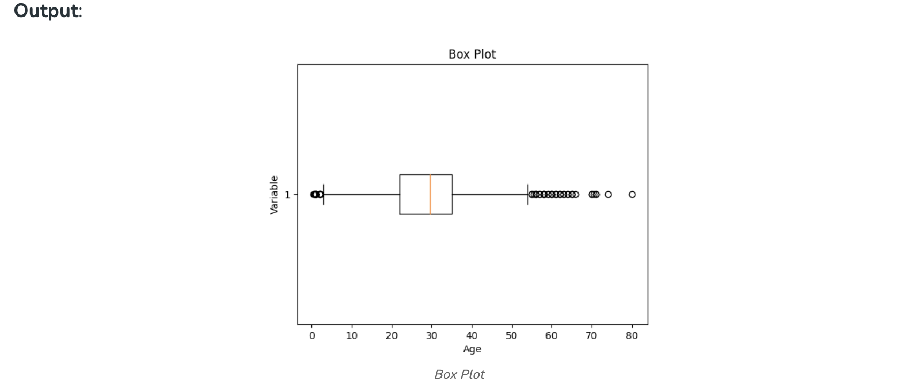


As we can see from the above Box and whisker plot, Our age dataset has outliers values. The values less than 5 and more than 55 are outliers.

```
# calculate summary statistics
mean = df3['Age'].mean()
std  = df3['Age'].std()

# Calculate the lower and upper bounds
lower_bound = mean - std*2
upper_bound = mean + std*2

print('Lower Bound :',lower_bound)
print('Upper Bound :',upper_bound)

# Drop the outliers
df4 = df3[(df3['Age'] >= lower_bound) 
                & (df3['Age'] <= upper_bound)]
```

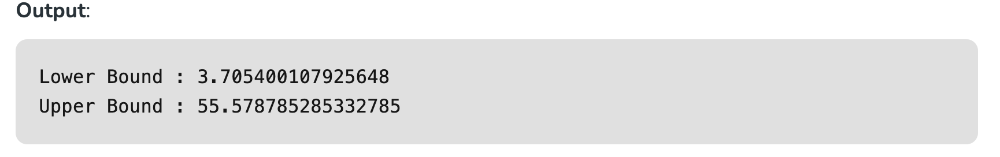

Similarly, we can remove the outliers of the remaining columns.

## Data Transformation 

Data transformation involves converting the data from one form to another to make it more suitable for analysis. Techniques such as normalization, scaling, or encoding can be used to transform the data.

**Data validation and verification**

Data validation and verification involve ensuring that the data is accurate and consistent by comparing it with external sources or expert knowledge. 

For the machine learning prediction, First, we separate independent and target features. Here we will consider only **‘Sex’ ‘Age’ ‘SibSp’, ‘Parch’ ‘Fare’ ‘Embarked’** only as the independent features and **Survived** as target variables. Because PassengerId will not affect the survival rate.

```
X = df3[['Pclass','Sex','Age', 'SibSp','Parch','Fare','Embarked']]
Y = df3['Survived']
```

**Data formatting**
Data formatting involves converting the data into a standard format or structure that can be easily processed by the algorithms or models used for analysis. Here we will discuss commonly used data formatting techniques i.e. Scaling and Normalization.

**Scaling**

    - Scaling involves transforming the values of features to a specific range. It maintains the shape of the original distribution while changing the scale.
    - Particularly useful when features have different scales, and certain algorithms are sensitive to the magnitude of the features.
    - Common scaling methods include Min-Max scaling and Standardization (Z-score scaling).

**Min-Max Scaling:** Min-Max scaling rescales the values to a specified range, typically between 0 and 1. It preserves the original distribution and ensures that the minimum value maps to 0 and the maximum value maps to 1.

```
from sklearn.preprocessing import MinMaxScaler

# initialising the MinMaxScaler
scaler = MinMaxScaler(feature_range=(0, 1))

# Numerical columns
num_col_ = [col for col in X.columns if X[col].dtype != 'object']
x1 = X
# learning the statistical parameters for each of the data and transforming
x1[num_col_] = scaler.fit_transform(x1[num_col_])
x1.head()
```

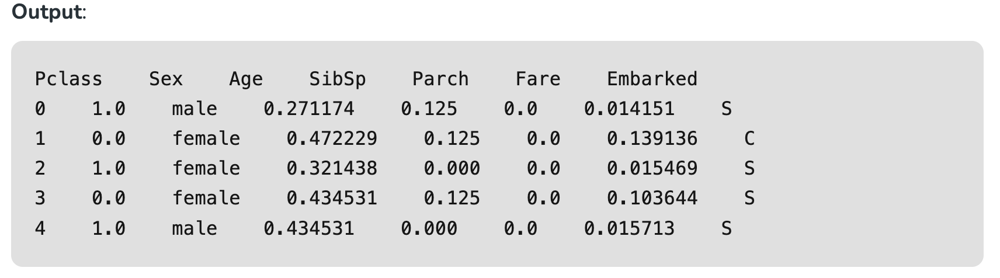

**Standardization (Z-score scaling):** Standardization transforms the values to have a mean of 0 and a standard deviation of 1. It centers the data around the mean and scales it based on the standard deviation. Standardization makes the data more suitable for algorithms that assume a Gaussian distribution or require features to have zero mean and unit variance.

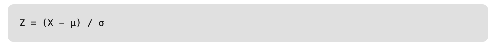

Where,

    - X = Data
    - μ = Mean value of X
    - σ = Standard deviation of X

## Data Cleansing Tools
Some data cleansing tools:

- OpenRefine
- Trifacta Wrangler 
- TIBCO Clarity
- Cloudingo
- IBM Infosphere Quality Stage

**Advantages of Data Cleaning in Machine Learning:**

- **Improved model performance:** Removal of errors, inconsistencies, and irrelevant data, helps the model to better learn from the data.
- **Increased accuracy:** Helps ensure that the data is accurate, consistent, and free of errors.
- **Better representation of the data:** Data cleaning allows the data to be transformed into a format that better represents the underlying relationships and patterns in the data.
- **Improved data quality:** Improve the quality of the data, making it more reliable and accurate.
- **Improved data security:** Helps to identify and remove sensitive or confidential information that could compromise data security.

**Disadvantages of Data Cleaning in Machine Learning:**

- **Time-consuming:** Time-Consuming task, especially for large and complex datasets.
- **Error-prone:** Data cleaning can be error-prone, as it involves transforming and cleaning the data, which can result in the loss of important information or the introduction of new errors.
- **Cost and resource-intensive:** Resource-intensive process that requires significant time, effort, and expertise. It can also require the use of specialized software tools, which can add to the cost and complexity of data cleaning.
- **Overfitting:** Data cleaning can inadvertently contribute to overfitting by removing too much data.