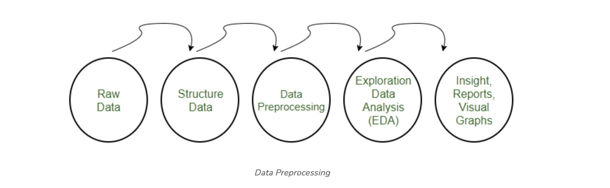
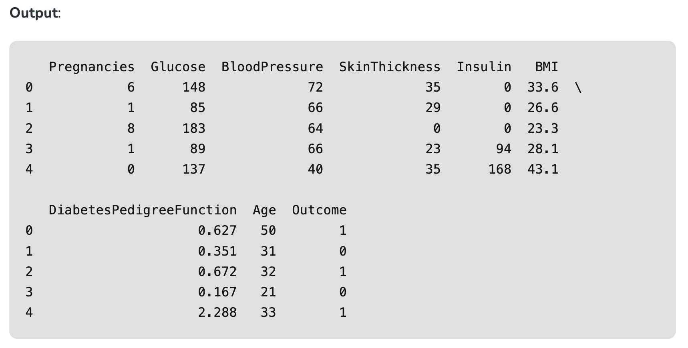
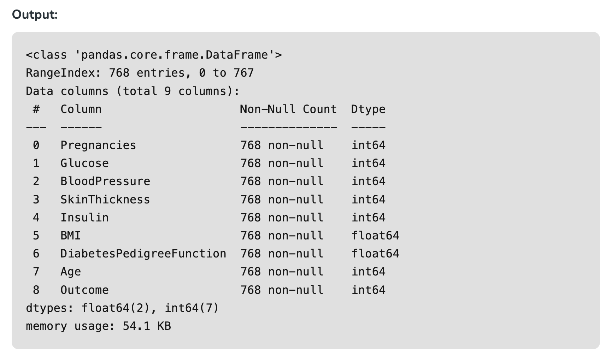
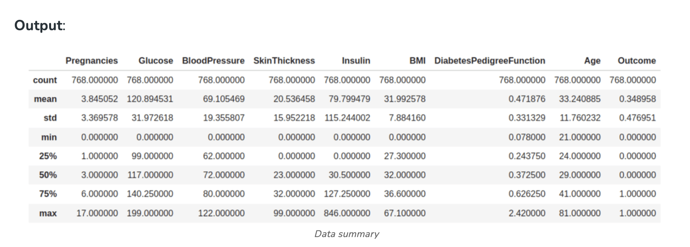
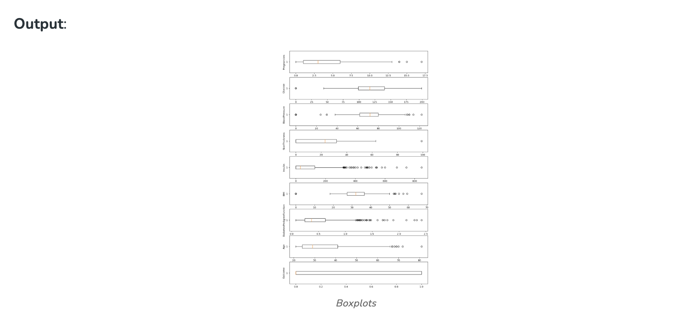
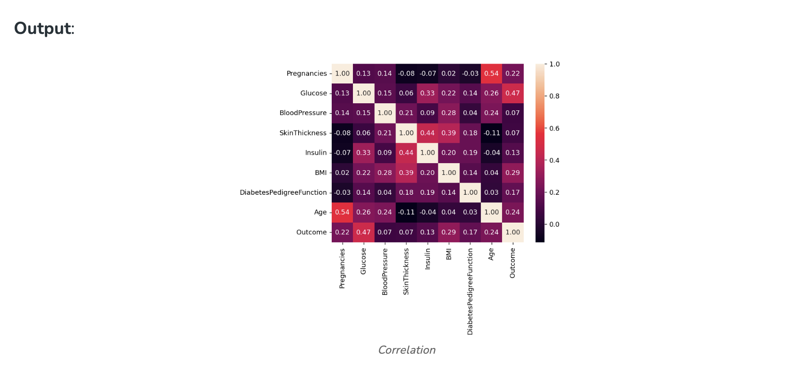
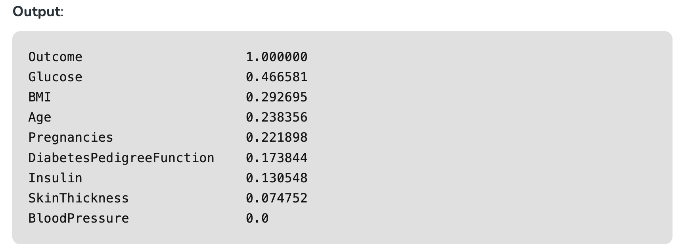
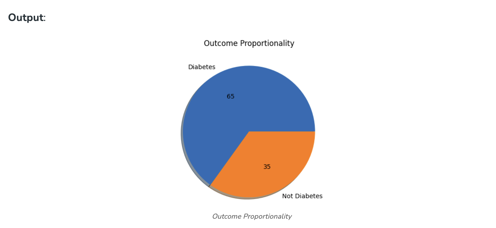
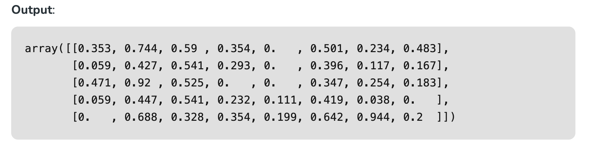
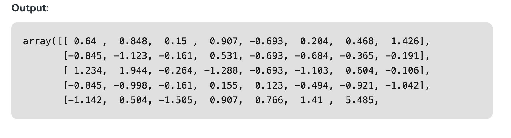

# Data Preprocessing in Python

## Data Preprocessing

Pre-processing refers to the transformations applied to our data before feeding it to the algorithm. Data preprocessing is a technique that is used to convert the raw data into a clean data set. In other words, whenever the data is gathered from different sources it is collected in raw format which is not feasible for the analysis.




## Need of Data Preprocessing 

- For achieving better results from the applied model in Machine Learning projects the format of the data has to be in a proper manner. Some specified Machine Learning model needs information in a specified format, for example, Random Forest algorithm does not support null values, therefore to execute random forest algorithm null values have to be managed from the original raw data set.
- Another aspect is that the data set should be formatted in such a way that more than one Machine Learning and Deep Learning algorithm are executed in one data set, and best out of them is chosen.

# Steps in Data Preprocessing

## Step 1: Import the necessary libraries

```
# importing libraries
import pandas as pd
import scipy
import numpy as np
from sklearn.preprocessing import MinMaxScaler
import seaborn as sns
import matplotlib.pyplot as plt
```

## Step 2: Load the dataset

Dataset link: [https://www.kaggle.com/datasets/uciml/pima-indians-diabetes-database]

```
# Load the dataset
df = pd.read_csv('Geeksforgeeks/Data/diabetes.csv')
print(df.head())
```



**Check the data info**

```
df.info()
```



As we can see from the above info that the our dataset has 9 columns and each columns has 768 values. There is no Null values in the dataset.

We can also check the null values using df.isnull()

```
df.isnull().sum()
```


## Step 3: Statistical Analysis

In statistical analysis, first, we use the df.describe() which will give a descriptive overview of the dataset.

```
df.describe()
```



The above table shows the count, mean, standard deviation, min, 25%, 50%, 75%, and max values for each column. When we carefully observe the table we will find that. Insulin, Pregnancies, BMI, BloodPressure columns has outliers. 

Let’s plot the boxplot for each column for easy understanding.


## Step 4: Check the outliers:

```
# Box Plots
fig, axs = plt.subplots(9,1,dpi=95, figsize=(7,17))
i = 0
for col in df.columns:
	axs[i].boxplot(df[col], vert=False)
	axs[i].set_ylabel(col)
	i+=1
plt.show()
```



from the above boxplot, we can clearly see that all most every column has some amounts of outliers.


**Drop the outliers**

```
# Identify the quartiles
q1, q3 = np.percentile(df['Insulin'], [25, 75])
# Calculate the interquartile range
iqr = q3 - q1
# Calculate the lower and upper bounds
lower_bound = q1 - (1.5 * iqr)
upper_bound = q3 + (1.5 * iqr)
# Drop the outliers
clean_data = df[(df['Insulin'] >= lower_bound) 
				& (df['Insulin'] <= upper_bound)]


# Identify the quartiles
q1, q3 = np.percentile(clean_data['Pregnancies'], [25, 75])
# Calculate the interquartile range
iqr = q3 - q1
# Calculate the lower and upper bounds
lower_bound = q1 - (1.5 * iqr)
upper_bound = q3 + (1.5 * iqr)
# Drop the outliers
clean_data = clean_data[(clean_data['Pregnancies'] >= lower_bound) 
						& (clean_data['Pregnancies'] <= upper_bound)]


# Identify the quartiles
q1, q3 = np.percentile(clean_data['Age'], [25, 75])
# Calculate the interquartile range
iqr = q3 - q1
# Calculate the lower and upper bounds
lower_bound = q1 - (1.5 * iqr)
upper_bound = q3 + (1.5 * iqr)
# Drop the outliers
clean_data = clean_data[(clean_data['Age'] >= lower_bound) 
						& (clean_data['Age'] <= upper_bound)]


# Identify the quartiles
q1, q3 = np.percentile(clean_data['Glucose'], [25, 75])
# Calculate the interquartile range
iqr = q3 - q1
# Calculate the lower and upper bounds
lower_bound = q1 - (1.5 * iqr)
upper_bound = q3 + (1.5 * iqr)
# Drop the outliers
clean_data = clean_data[(clean_data['Glucose'] >= lower_bound) 
						& (clean_data['Glucose'] <= upper_bound)]


# Identify the quartiles
q1, q3 = np.percentile(clean_data['BloodPressure'], [25, 75])
# Calculate the interquartile range
iqr = q3 - q1
# Calculate the lower and upper bounds
lower_bound = q1 - (0.75 * iqr)
upper_bound = q3 + (0.75 * iqr)
# Drop the outliers
clean_data = clean_data[(clean_data['BloodPressure'] >= lower_bound) 
						& (clean_data['BloodPressure'] <= upper_bound)]


# Identify the quartiles
q1, q3 = np.percentile(clean_data['BMI'], [25, 75])
# Calculate the interquartile range
iqr = q3 - q1
# Calculate the lower and upper bounds
lower_bound = q1 - (1.5 * iqr)
upper_bound = q3 + (1.5 * iqr)
# Drop the outliers
clean_data = clean_data[(clean_data['BMI'] >= lower_bound) 
						& (clean_data['BMI'] <= upper_bound)]


# Identify the quartiles
q1, q3 = np.percentile(clean_data['DiabetesPedigreeFunction'], [25, 75])
# Calculate the interquartile range
iqr = q3 - q1
# Calculate the lower and upper bounds
lower_bound = q1 - (1.5 * iqr)
upper_bound = q3 + (1.5 * iqr)

# Drop the outliers
clean_data = clean_data[(clean_data['DiabetesPedigreeFunction'] >= lower_bound) 
						& (clean_data['DiabetesPedigreeFunction'] <= upper_bound)]
```


## Step 5: Correlation

```
#correlation
corr = df.corr()

plt.figure(dpi=130)
sns.heatmap(df.corr(), annot=True, fmt= '.2f')
plt.show()
```



We can also camapare by single columns in descending order


```
corr['Outcome'].sort_values(ascending = False)
```




**Check Outcomes Proportionality**

```
plt.pie(df.Outcome.value_counts(), 
		labels= ['Diabetes', 'Not Diabetes'], 
		autopct='%.f', shadow=True)
plt.title('Outcome Proportionality')
plt.show()
```




## Step 6: Separate independent features and Target Variables

```
# separate array into input and output components
X = df.drop(columns =['Outcome'])
Y = df.Outcome
```

## Step 7: Normalization or Standardization

**Normalization**

- MinMaxScaler scales the data so that each feature is in the range [0, 1]. 
- It works well when the features have different scales and the algorithm being used is sensitive to the scale of the features, such as k-nearest neighbors or neural networks.
- Rescale your data using scikit-learn using the MinMaxScaler.

```
# initialising the MinMaxScaler
scaler = MinMaxScaler(feature_range=(0, 1))

# learning the statistical parameters for each of the data and transforming
rescaledX = scaler.fit_transform(X)
rescaledX[:5]
```



**Standardization**
- Standardization is a useful technique to transform attributes with a Gaussian distribution and differing means and standard deviations to a standard Gaussian distribution with a mean of 0 and a standard deviation of 1.
- We can standardize data using scikit-learn with the StandardScaler class.
- It works well when the features have a normal distribution or when the algorithm being used is not sensitive to the scale of the features

```
from sklearn.preprocessing import StandardScaler

scaler = StandardScaler().fit(X)
rescaledX = scaler.transform(X)
rescaledX[:5]
```



