# Feature Scaling

## What is Feature Scaling?
Feature Scaling is a technique to standardize the independent features present in the data in a fixed range. It is performed during the data pre-processing to handle highly varying magnitudes or values or units. If feature scaling is not done, then a machine learning algorithm tends to weigh greater values, higher and consider smaller values as the lower values, regardless of the unit of the values.

## Why use Feature Scaling?
In machine learning, feature scaling is employed for a number of purposes:

- Scaling guarantees that all features are on a comparable scale and have comparable ranges. This process is known as feature normalisation. This is significant because the magnitude of the features has an impact on many machine learning techniques. Larger scale features may dominate the learning process and have an excessive impact on the outcomes. You can avoid this problem and make sure that each feature contributes equally to the learning process by scaling the features.
- Algorithm performance improvement: When the features are scaled, several machine learning methods, including gradient descent-based algorithms, distance-based algorithms (such k-nearest neighbours), and support vector machines, perform better or converge more quickly. The algorithm’s performance can be enhanced by scaling the features, which can hasten the convergence of the algorithm to the ideal outcome.
- Preventing numerical instability: Numerical instability can be prevented by avoiding significant scale disparities between features. Examples include distance calculations or matrix operations, where having features with radically differing scales can result in numerical overflow or underflow problems. Stable computations are ensured and these issues are mitigated by scaling the features.
- Scaling features makes ensuring that each characteristic is given the same consideration during the learning process. Without scaling, bigger scale features could dominate the learning, producing skewed outcomes. This bias is removed through scaling, which also guarantees that each feature contributes fairly to model predictions.

## Absolute Maximum Scaling
This method of scaling requires two-step:

1. We should first select the maximum absolute value out of all the entries of a particular measure.
2. Then after this, we divide each entry of the column by this maximum value.

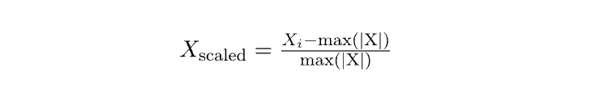

After performing the above-mentioned two steps we will observe that each entry of the column lies in the range of -1 to 1. But this method is not used that often the reason behind this is that it is too sensitive to the outliers. And while dealing with the real-world data presence of outliers is a very common thing. 

For the demonstration purpose, we will use the dataset which you can download from here. This dataset is a simpler version of the original house price prediction dataset having only two columns from the original dataset. The first five rows of the original data are shown below:

```
import pandas as pd
df = pd.read_csv('SampleFile.csv')
print(df.head())
```

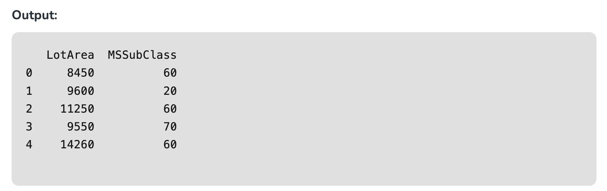

Now let’s apply the first method which is of the absolute maximum scaling. For this first, we are supposed to evaluate the absolute maximum values of the columns.

```
import numpy as np
max_vals = np.max(np.abs(df))
max_vals
```

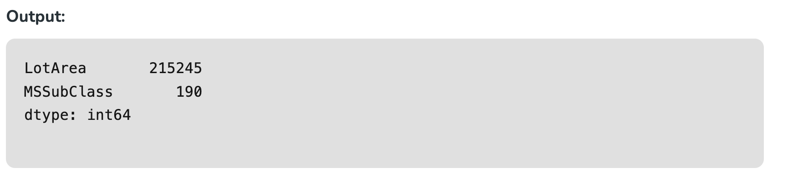

Now we are supposed to subtract these values from the data and then divide the results from the maximum values as well. 

```
print((df - max_vals) / max_vals)
```

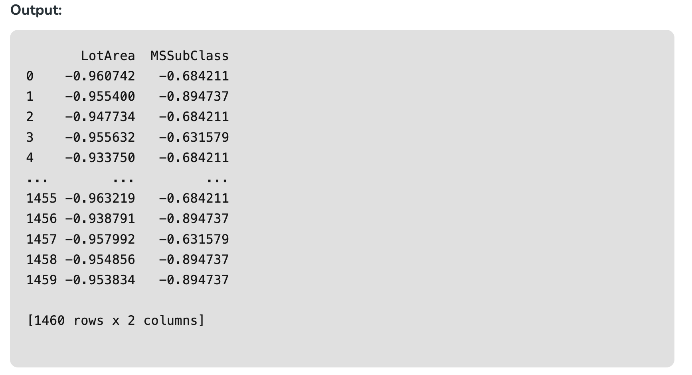

## Min-Max Scaling
This method of scaling requires below two-step:

1. First, we are supposed to find the minimum and the maximum value of the column.
2. Then we will subtract the minimum value from the entry and divide the result by the difference between the maximum and the minimum value.

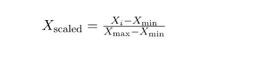

As we are using the maximum and the minimum value this method is also prone to outliers but the range in which the data will range after performing the above two steps is between 0 to 1.

```
from sklearn.preprocessing import MinMaxScaler

scaler = MinMaxScaler()
scaled_data = scaler.fit_transform(df)
scaled_df = pd.DataFrame(scaled_data, 
						columns=df.columns)
scaled_df.head()
```

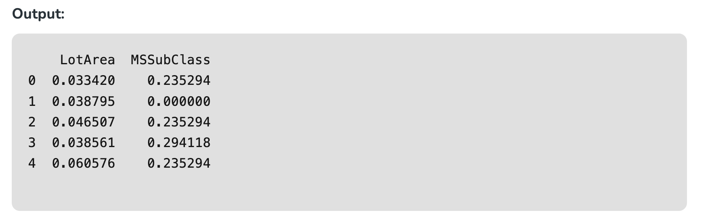

## Normalization
This method is more or less the same as the previous method but here instead of the minimum value, we subtract each entry by the mean value of the whole data and then divide the results by the difference between the minimum and the maximum value.

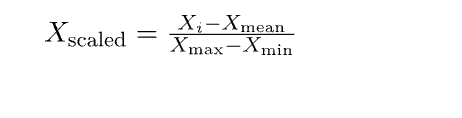

```
from sklearn.preprocessing import Normalizer

scaler = Normalizer()
scaled_data = scaler.fit_transform(df)
scaled_df = pd.DataFrame(scaled_data,
						columns=df.columns)
print(scaled_df.head())
```

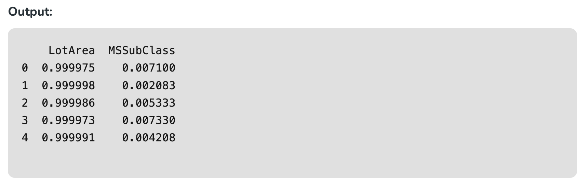

## Standardization
This method of scaling is basically based on the central tendencies and variance of the data. 

1. First, we should calculate the mean and standard deviation of the data we would like to normalize.
2. Then we are supposed to subtract the mean value from each entry and then divide the result by the standard deviation.

This helps us achieve a normal distribution(if it is already normal but skewed) of the data with a mean equal to zero and a standard deviation equal to 1.

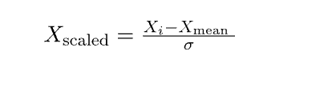

```
from sklearn.preprocessing import StandardScaler

scaler = StandardScaler()
scaled_data = scaler.fit_transform(df)
scaled_df = pd.DataFrame(scaled_data,
						columns=df.columns)
print(scaled_df.head())
```

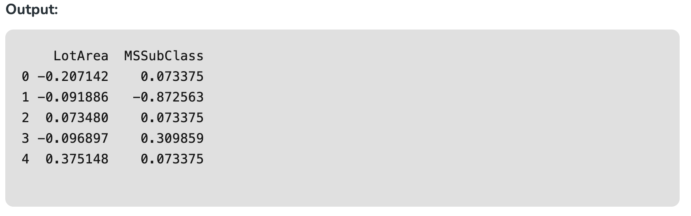

## Robust Scaling
In this method of scaling, we use two main statistical measures of the data.

- Median
- Inter-Quartile Range

After calculating these two values we are supposed to subtract the median from each entry and then divide the result by the interquartile range.

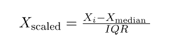

```
from sklearn.preprocessing import RobustScaler

scaler = RobustScaler()
scaled_data = scaler.fit_transform(df)
scaled_df = pd.DataFrame(scaled_data,
						columns=df.columns)
print(scaled_df.head())
```

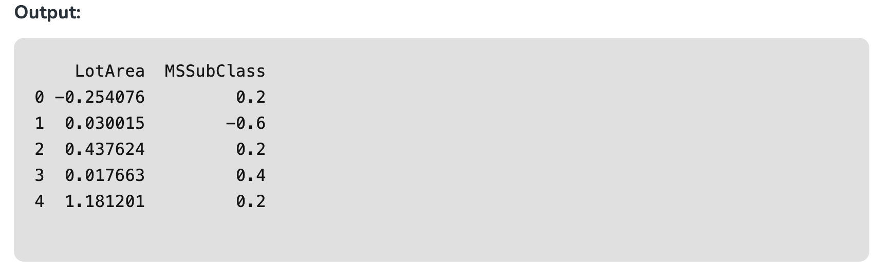

