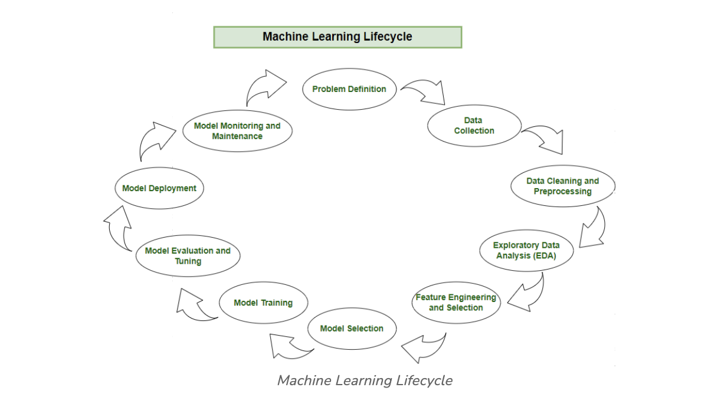

# ML workflow

## Machine Learning Lifecycle
The machine learning lifecycle is a process that guides the development and deployment of machine learning models in a structured way. It consists of various steps.

Each step plays a crucial role in ensuring the success and effectiveness of the machine learning solution. By following the machine learning lifecycle, organizations can solve complex problems systematically, leverage data-driven insights, and create scalable and sustainable machine learning solutions that deliver tangible value. The steps to be followed in the machine learning lifecycle are:

1. **Problem Definition**
2. **Data Collection**
3. **Data Cleaning and Preprocessing**
4. **Exploratory Data Analysis (EDA)**
5. **Feature Engineering and Selection**
6. **Model Selection**
7. **Model Training**
8. **Model Evaluation and Tuning**
9. **Model Deployment**
10. **Model Monitoring and Maintenance**

## Step 1: Problem Definition
Embarking on the machine learning journey involves a well-defined lifecycle, starting with the crucial step of problem definition. In this initial phase, stakeholders collaborate to identify the business problem at hand and frame it in a way that sets the stage for the entire process.

By framing the problem in a comprehensive manner, the team establishes a foundation for the entire machine learning lifecycle. Crucial elements, such as project objectives, desired outcomes, and the scope of the task, are carefully delineated during this stage.

Here are the basic features of problem definition:

- **Collaboration:** Work together with stakeholders to understand and define the business problem.
- **Clarity:** Clearly articulate the objectives, desired outcomes, and scope of the task.
- **Foundation:** Establish a solid foundation for the machine learning process by framing the problem comprehensively.

## Step 2: Data Collection
Following the precision of problem definition, the machine learning lifecycle progresses to the pivotal stage of data collection. This phase involves the systematic gathering of datasets that will serve as the raw material for model development. The quality and diversity of the data collected directly impact the robustness and generalizability of the machine learning model.

During data collection, practitioners must consider the relevance of the data to the defined problem, ensuring that the selected datasets encompass the necessary features and characteristics. Additionally, factors such as data volume, quality, and ethical considerations play a crucial role in shaping the foundation for subsequent phases of the machine learning lifecycle. A meticulous and well-organized approach to data collection lays the groundwork for effective model training, evaluation, and deployment, ensuring that the resulting model is both accurate and applicable to real-world scenarios.

Here are the basic features of Data Collection:

- **Relevance:** Collect data that is relevant to the defined problem and includes necessary features.
- **Quality:** Ensure data quality by considering factors like accuracy, completeness, and ethical considerations.
- **Quantity:** Gather sufficient data volume to train a robust machine learning model.
- **Diversity:** Include diverse datasets to capture a broad range of scenarios and patterns.

## Step 3: Data Cleaning and Preprocessing
With datasets in hand, the machine learning journey advances to the critical stages of data cleaning and preprocessing. Raw data, is often messy and unstructured. Data cleaning involves addressing issues such as missing values, outliers, and inconsistencies that could compromise the accuracy and reliability of the machine learning model.

Preprocessing takes this a step further by standardizing formats, scaling values, and encoding categorical variables, creating a consistent and well-organized dataset. The objective is to refine the raw data into a format that facilitates meaningful analysis during subsequent phases of the machine learning lifecycle. By investing time and effort in data cleaning and preprocessing, practitioners lay the foundation for robust model development, ensuring that the model is trained on high-quality, reliable data.

Here are the basic features of Data Cleaning and Preprocessing:

- **Data Cleaning:** Address issues such as missing values, outliers, and inconsistencies in the data.
- **Data Preprocessing:** Standardize formats, scale values, and encode categorical variables for consistency.
- **Data Quality:** Ensure that the data is well-organized and prepared for meaningful analysis.
- **Data Integrity:** Maintain the integrity of the dataset by cleaning and preprocessing it effectively.

## Step 4: Exploratory Data Analysis (EDA)
Now, focus turns to understanding the underlying patterns and characteristics of the collected data. Exploratory Data Analysis (EDA) emerges as a pivotal phase, where practitioners leverage various statistical and visual tools to gain insights into the dataset's structure.

During EDA, patterns, trends, and potential challenges are unearthed, providing valuable context for subsequent decisions in the machine learning process. Visualizations, summary statistics, and correlation analyses offer a comprehensive view of the data, guiding practitioners toward informed choices in feature engineering, model selection, and other critical aspects. EDA acts as a compass, directing the machine learning journey by revealing the intricacies of the data and informing the development of effective and accurate predictive models.

Here are the basic features of Exploratory Data Analysis:

- **Exploration:** Use statistical and visual tools to explore the structure and patterns in the data.
- **Patterns and Trends:** Identify underlying patterns, trends, and potential challenges within the dataset.
- **Insights:** Gain valuable insights to inform decisions in later stages of the machine learning process.
- **Decision Making:** Use exploratory data analysis to make informed decisions about feature engineering and model selection.

## Step 5: Feature Engineering and Selection
Feature engineering takes center stage as a transformative process that elevates raw data into meaningful predictors. Simultaneously, feature selection refines this pool of variables, identifying the most relevant ones to enhance model efficiency and effectiveness.

Feature engineering involves creating new features or transforming existing ones to better capture patterns and relationships within the data. This creative process requires domain expertise and a deep understanding of the problem at hand, ensuring that the engineered features contribute meaningfully to the predictive power of the model. On the other hand, feature selection focuses on identifying the subset of features that most significantly impact the model's performance. This dual approach seeks to strike a delicate balance, optimizing the feature set for predictive accuracy while minimizing computational complexity.

- **Feature Engineering:** Create new features or transform existing ones to better capture patterns and relationships.
- **Feature Selection:** Identify the subset of features that most significantly impact the model's performance.
- **Domain Expertise:** Leverage domain knowledge to engineer features that contribute meaningfully to predictive power.
- **Optimization:** Balance feature set for predictive accuracy while minimizing computational complexity.

## Step 6: Model Selection
Navigating the machine learning lifecycle requires the judicious selection of a model that aligns with the defined problem and the characteristics of the dataset. Model selection is a pivotal decision that determines the algorithmic framework guiding the predictive capabilities of the machine learning solution. The choice depends on the nature of the data, the complexity of the problem, and the desired outcomes.

Here are the basic features of Model Selection:

- **Alignment:** Select a model that aligns with the defined problem and characteristics of the dataset.
- **Complexity:** Consider the complexity of the problem and the nature of the data when choosing a model.
- **Decision Factors:** Evaluate factors like performance, interpretability, and scalability when selecting a model.
- **Experimentation:** Experiment with different models to find the best fit for the problem at hand.

## Step 7: Model Training
With the selected model in place, the machine learning lifecycle advances to the transformative phase of model training. This process involves exposing the model to historical data, allowing it to learn patterns, relationships, and dependencies within the dataset.

Model training is an iterative and dynamic journey, where the algorithm adjusts its parameters to minimize errors and enhance predictive accuracy. During this phase, the model fine-tunes its understanding of the data, optimizing its ability to make meaningful predictions. Rigorous validation processes ensure that the trained model generalizes well to new, unseen data, establishing a foundation for reliable predictions in real-world scenarios.

Here are the basic features of Model Training:

- **Training Data:** Expose the model to historical data to learn patterns, relationships, and dependencies.
- **Iterative Process:** Train the model iteratively, adjusting parameters to minimize errors and enhance accuracy.
- **Optimization:** Fine-tune the model's understanding of the data to optimize predictive capabilities.
- **Validation:** Rigorously validate the trained model to ensure generalization to new, unseen data.

## Step 8: Model Evaluation and Tuning
Model evaluation involves rigorous testing against validation datasets, employing metrics such as accuracy, precision, recall, and F1 score to gauge its effectiveness.

Evaluation is a critical checkpoint, providing insights into the model's strengths and weaknesses. If the model falls short of desired performance levels, practitioners initiate model tuning—a process that involves adjusting hyperparameters to enhance predictive accuracy. This iterative cycle of evaluation and tuning is crucial for achieving the desired level of model robustness and reliability.

Here are the basic features of Model Evaluation and Tuning:

- **Evaluation Metrics:** Use metrics like accuracy, precision, recall, and F1 score to evaluate model performance.
- **Strengths and Weaknesses:** Identify the strengths and weaknesses of the model through rigorous testing.
- **Iterative Improvement:** Initiate model tuning to adjust hyperparameters and enhance predictive accuracy.
- **Model Robustness:** Iterate through evaluation and tuning cycles to achieve desired levels of model robustness and reliability.

## Step 9: Model Deployment
Upon successful evaluation, the machine learning model transitions from development to real-world application through the deployment phase. Model deployment involves integrating the predictive solution into existing systems or processes, allowing stakeholders to leverage its insights for informed decision-making.

Model deployment marks the culmination of the machine learning lifecycle, transforming theoretical insights into practical solutions that drive tangible value for organizations.

Here are the basic features of Model Deployment:

- **Integration:** Integrate the trained model into existing systems or processes for real-world application.
- **Decision Making:** Use the model's predictions to inform decision-making and drive tangible value for organizations.
- **Practical Solutions:** Deploy the model to transform theoretical insights into practical solutions that address business needs.
- **Continuous Improvement:** Monitor model performance and make adjustments as necessary to maintain effectiveness over time.
