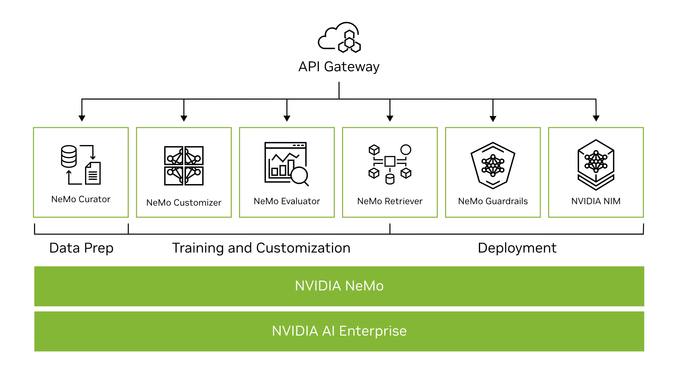

# NVIDIA NeMo (Generative AI)
Build, customize, and deploy generative AI.

[NVIDIA NeMo](https://www.nvidia.com/en-in/ai-data-science/products/nemo/)

[For Developers](https://docs.nvidia.com/nemo-framework/user-guide/latest/overview.html?ncid=no-ncid)

[Video](https://resources.nvidia.com/en-us-ai-large-language-models/watch-78?lx=Hh_Qnz&ncid=no-ncid)

## What Is NVIDIA NeMo?
- NVIDIA NeMo is an end-to-end platform for developing custom generative AI—including large language models (LLMs), multimodal, vision, and speech AI —anywhere. 

- Deliver enterprise-ready models with precise data curation, cutting-edge customization, retrieval-augmented generation (RAG), and accelerated performance.

- NeMo is a part of the NVIDIA AI Foundry, a platform and service for building custom generative AI models with enterprise data and domain-specific knowledge.

## Benefits of NVIDIA NeMo for Generative AI

1. **Flexible:** Train and deploy generative AI anywhere, across clouds, data centers, and the edge.
2. **Production Ready:** Deploy into production with a secure, optimized, full-stack solution that offers support, security, and API stability as part of NVIDIA AI Enterprise.
3. **Increased ROI:** Quickly train, customize, and deploy large language models (LLMs), vision, multimodal, and speech AI at scale, reducing time to solution and increasing ROI.
4. **Accelerated Performance:** Maximize throughput and minimize LLM training time with multi-node, multi-GPU training and inference.
5. **End-to-End Pipeline:** Experience the benefits of a complete solution for the LLM pipeline—from data processing and training to inference of generative AI models.

# Complete Solution for Building Enterprise-Ready LLMs

## The Features of NVIDIA NeMo

# Accelerate Data Curation - NeMo Curator
NVIDIA NeMo Curator is a GPU-accelerated data-curation tool that enables large-scale, high-quality datasets for pretraining LLMs.

[Read the Blog](https://developer.nvidia.com/blog/simplify-custom-generative-ai-development-with-nvidia-nemo-microservices/?ncid=no-ncid)
[Try Tutorial Notebooks](https://github.com/NVIDIA/NeMo-Curator/tree/main/tutorials)
[Apply for Early Access](https://developer.nvidia.com/nemo-microservices?ncid=no-ncid)

# Simplify Fine-Tuning - NeMo Customizer
NVIDIA NeMo Customizer is a high-performance, scalable microservice that simplifies fine-tuning and alignment of LLMs for domain-specific use cases, making it easier to adopt generative AI across industries.

[Read the Blog](https://developer.nvidia.com/blog/simplify-custom-generative-ai-development-with-nvidia-nemo-microservices/?ncid=no-ncid)
[Apply for Early Access](https://developer.nvidia.com/nemo-microservices?ncid=no-ncid)

# Evaluate Models - NeMo Evaluator
NVIDIA NeMo Evaluator provides automatic assessment of custom generative AI models across academic and custom benchmarks on any platform.

[Read the Blog](https://developer.nvidia.com/blog/simplify-custom-generative-ai-development-with-nvidia-nemo-microservices/?ncid=no-ncid)
[Apply for Early Access](https://developer.nvidia.com/nemo-microservices?ncid=no-ncid)

# Seamless Data Retrieval - NeMo Retriever
NVIDIA NeMo Retriever is a collection of generative AI microservices that enable organizations to seamlessly connect custom models to diverse business data and deliver highly accurate responses.

[Read the Blog on Developing Production-Grade Text Retrieval Pipelines for RAG](https://developer.nvidia.com/blog/develop-production-grade-text-retrieval-pipelines-for-rag-with-nvidia-nemo-retriever?ncid=no-ncid)
[Start Prototyping](https://build.nvidia.com/explore/retrieval?ncid=no-ncid)

# Generative AI Guardrails - NeMo Guardrails
NVIDIA NeMo Guardrails orchestrates dialog management, ensuring accuracy, appropriateness, and security in smart applications with LLMs. It safeguards organizations overseeing generative AI systems.

[Access on GitHub](https://github.com/NVIDIA/NeMo-Guardrails)

# Generative AI Inference - NVIDIA NIM
NVIDIA NIM, part of NVIDIA AI Enterprise, is a set of easy-to-use microservices designed for secure, reliable deployment of high-performance AI model inferencing across clouds, data centers, and workstations.

[Learn More](https://www.nvidia.com/en-in/ai/?ncid=no-ncid)
[Read the Blog](https://developer.nvidia.com/blog/nvidia-nim-offers-optimized-inference-microservices-for-deploying-ai-models-at-scale/?ncid=no-ncid)
[Start Prototyping](https://build.nvidia.com/explore/discover?ncid=no-ncid)

