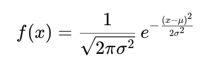
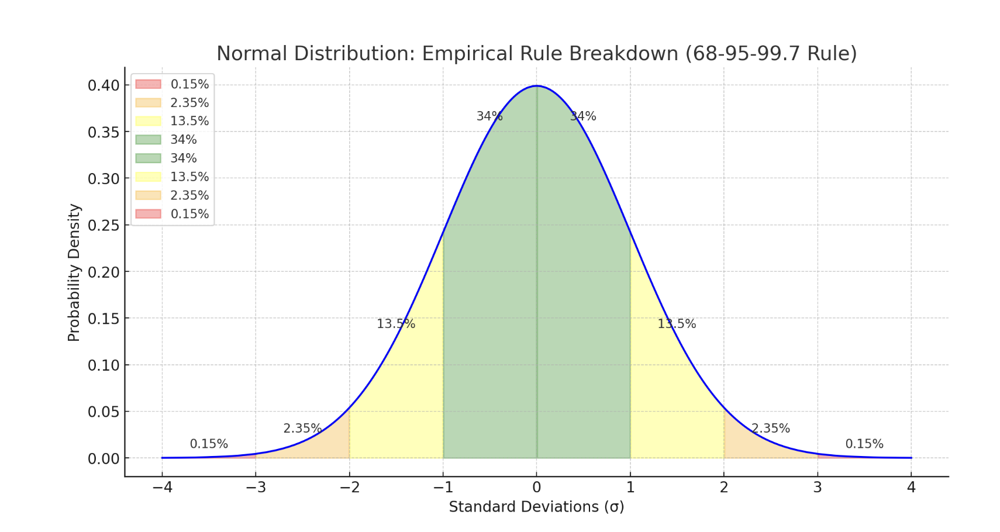
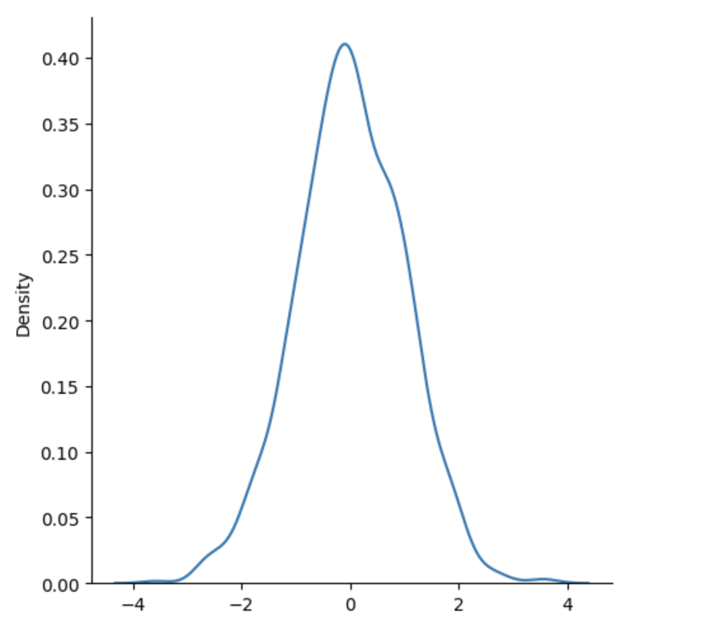

# Normal (Gaussian) Distribution

# Normal Distribution
The Normal Distribution is one of the most important distributions.

It is also called the Gaussian Distribution after the German mathematician Carl Friedrich Gauss.

The **Normal Distribution** is a **bell-shaped curve** that shows how values are distributed:

Use the **random.normal()** method to get a Normal Data Distribution.

- Most values are **around the mean**
- Fewer values are at the **extremes**

It's the most commonly used distribution in statistics and machine learning.

### 📊 Real-World Examples
- Heights of people
- Test scores
- Blood pressure readings
- Measurement errors

These all often follow a normal distribution.

### 🔢 Mathematical Definition
The probability density function (PDF) of a normal distribution:



Where:
- μ = mean (center of the distribution)
- σ = standard deviation (spread or width of the bell)
- e = Euler’s number (≈ 2.718)

### 📌 Key Properties

```
Property	                    Meaning
Symmetric	                    Centered at the mean
Bell-shaped	                    Smooth curve, peak at mean
Mean = Median = Mode	        All are the same in a perfect normal dist
Defined by two params	        Mean (μ), Std. Dev. (σ)
Area under curve = 1	        Total probability is 100%
```

### 📏 Empirical Rule (68-95-99.7)
The Empirical Rule tells us how data is spread around the mean (center) when the data is normally distributed.

Here’s what it means:

### ✅ 68% of data lies within ±1 standard deviation (σ)
- Range: from **-1 to +1**
- Example: If test scores are normally distributed with mean = 70 and std dev = 10.
    - then 68% of students scored between 60 and 80

### ✅ 95% of data lies within ±2 standard deviations (σ)
- Range: from **-2 to +2**
- So almost all data is within this range

### ✅ 99.7% of data lies within ±3 standard deviations (σ)
- Range: from **-3 to +3**
- Nearly all the data lives here

### 📈 Visualization Idea
```
     -3σ      -2σ      -1σ      0       +1σ     +2σ     +3σ
      |--------|--------|-------|--------|-------|--------|
      |   0.15%|  2.35% | 13.5% | 34%    |13.5%  | 2.35%  | 0.15% |
```

Add it all up:

- **34% + 34% = 68% within ±1σ**
- **13.5% + 34% + 34% + 13.5% = 95% within ±2σ**
- **Almost everything = 99.7% within ±3σ**

The Bell Curve is Symmetrical
So, if 68% of the data lies within ±1σ, that means:

- 34% is on the **left side** of the mean (between -1σ and 0)
- 34% is on the **right** side (between 0 and +1σ)

### 📊 Full Breakdown of Standard Normal Distribution

```
Range	    % of Total Data	                Notes
μ ± 1σ	    68%	                            From -1σ to +1σ (34% left, 34% right)
μ ± 2σ	    95%	                            From -2σ to +2σ → includes 68% + more
μ ± 3σ	    99.7%	                        Almost all data (everything within -3 to +3σ)
```

### 🧮 But what about what's outside those ranges?
Here’s the exact breakdown of the tails:

```
     < -3σ       -2σ to -3σ    -1σ to -2σ    -1σ to 0    0 to +1σ   +1σ to +2σ   +2σ to +3σ    > +3σ
     0.15%        2.35%         13.5%         34%         34%        13.5%        2.35%         0.15%

```

- **2.35%** of the data lies between **-2σ and -3σ**, and another **2.35%** between **+2σ and +3σ**
- **0.15%** lies beyond **-3σ** and another **0.15%** beyond **+3σ**

### 🧠 Quick Visual

```
       |<--0.15--|<--2.35--|<--13.5--|<--34--|--34-->|--13.5-->|--2.35-->|--0.15-->|
       -3σ       -2σ       -1σ       0       +1σ      +2σ       +3σ
```

- The **total area under the curve** is 100%
- **99.7%** is within **±3σ**
- The remaining **0.3%** (**0.15%** on each end) is extreme outlier data

**Note:** These values are extremely rare — and in machine learning or statistics, they may be considered **anomalies** or **noise**.



Here’s the visual breakdown of the normal distribution with each region clearly marked:

- The center green areas (±1σ) represent **68%**
- The yellow areas between ±1σ to ±2σ add up to **27%** (13.5% each side)
- The orange areas between ±2σ to ±3σ contribute **4.7%** (2.35% each side)
- The red tails beyond ±3σ are the extreme **0.3%** (0.15% on each end)

It has three parameters:

# 🎓 Example: Students' Test Scores
Imagine a standardized math test is given to 10,000 students.

**The scores are:**
- **Normally distributed**
- **Mean (μ)** = 70
- **Standard Deviation (σ)** = 10

### 🧠 What this means:
- Most students score around **70**
- Some score higher, some lower, in a symmetric bell shape

### 📊 Let’s apply the Empirical Rule:

```
Score Range	        Std Dev Range	        % of Students	            Count out of 10,000
60 to 80	        μ ± 1σ	                68%	                        6,800 students
50 to 90	        μ ± 2σ	                95%	                        9,500 students
40 to 100	        μ ± 3σ	                99.7%                       9,970 students
< 40 or > 100	    Outside ±3σ	            0.3%	                    ~30 students
```

```
Score Range	        Between Which σ	            % of Students	        Real Count (out of 10,000)
< 40	            Less than -3σ	            0.15%	                15 students
40–50	            -3σ to -2σ	                2.35%	                235 students
50–60	            -2σ to -1σ	                13.5%	                1,350 students
60–70	            -1σ to 0σ	                34%	                    3,400 students
70–80	            0σ to +1σ	                34%	                    3,400 students
80–90	            +1σ to +2σ	                13.5%	                1,350 students
90–100	            +2σ to +3σ	                2.35%	                235 students
> 100	            More than +3σ	            0.15%	                15 students
```

- **loc** - (Mean) where the peak of the bell exists.

- **scale** - (Standard Deviation) how flat the graph distribution should be.

- **size** - The shape of the returned array.


Example
Generate a random normal distribution of size 2x3:

```
from numpy import random

x = random.normal(size=(2, 3))

print(x)

Output:
[[ 1.08425956  0.21924346 -0.87622924]
 [-1.84470937 -0.02399501 -1.62717006]]

```

Example
Generate a random normal distribution of size 2x3 with mean at 1 and standard deviation of 2:

```
from numpy import random

x = random.normal(loc=1, scale=2, size=(2, 3))

print(x)

Output:
[[-1.1917958   1.32752796  1.04626068]
 [-1.74596895  1.31380769  1.01775866]]

```

## Visualization of Normal Distribution

Example

```
from numpy import random
import matplotlib.pyplot as plt
import seaborn as sns

sns.displot(random.normal(size=1000), kind="kde")

plt.show()
```
Output:


**Note:** The curve of a Normal Distribution is also known as the Bell Curve because of the bell-shaped curve.
