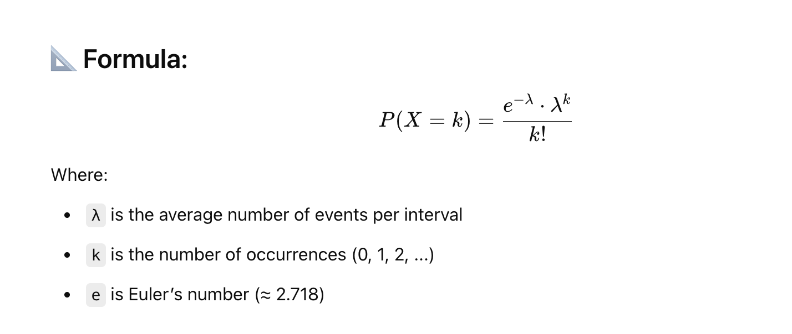
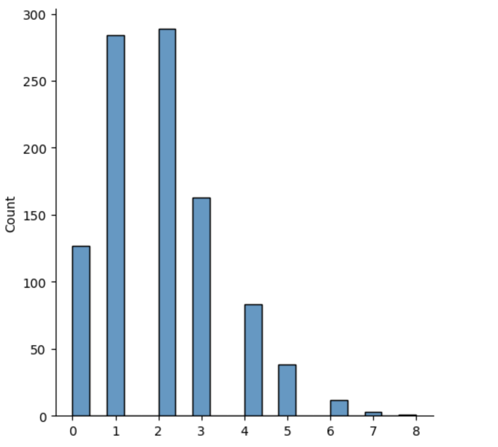
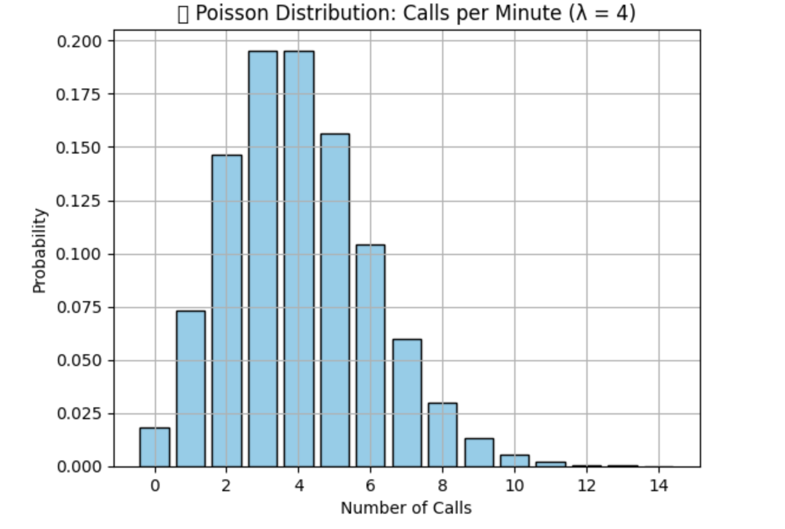

# 🔢 What is Poisson Distribution?
The **Poisson distribution** models the **number of times an event occurs in a fixed interval of time or space**, given that:

- Events happen **independently.**
- The **average rate (λ)** of events is **constant.**
- Two events can't occur **at exactly the same instant.**



# ✅ Real-Time Use Cases of Poisson Distribution

## 1. Website Traffic Modeling
- **📊 Use:** Estimate number of users visiting a site per minute
- **🎯 Goal:** Predict spikes and scale infrastructure (load balancer, autoscaling)
- **🧠 ML Use:** Traffic anomaly detection, feature for time-series models


## 2. Customer Support Tickets
- **📞 Use:** Number of support calls/emails per hour
- **🛠 Why:** Helps in agent workload prediction and staff planning
- **📈 ML Use:** Input feature for forecasting demand using XGBoost/Prophet

## 3. Bank Fraud Detection
- **💳 Use:** Track number of transactions per account in an hour/day
- **⚠️ Logic:** If a user makes 100 transactions in a short period (way above λ), flag it!
- **🤖 ML Use:** Anomaly detection, input to fraud scoring models

## 4. Industrial IoT Sensor Events
- **🏭 Use:** Number of machine faults per shift
- **🔧 Goal:** Predict future maintenance needs (predictive maintenance)
- **🧠 ML Use:** Poisson regression for count prediction models

## 5. Call Center / Telecom Networks
- **☎️ Use:** Incoming calls per second on telecom networks
- **🧠 ML Use:** Train models for resource allocation or latency prediction


## Visualization of Poisson Distribution

Example

```
from numpy import random
import matplotlib.pyplot as plt
import seaborn as sns

sns.displot(random.poisson(lam=2, size=1000))

plt.show()
```




Example

```
import numpy as np
import matplotlib.pyplot as plt
from scipy.stats import poisson

λ = 4  # avg 4 calls per minute
x = np.arange(0, 15)
pmf = poisson.pmf(x, λ)

plt.bar(x, pmf, color="skyblue", edgecolor="black")
plt.title("📞 Poisson Distribution: Calls per Minute (λ = 4)")
plt.xlabel("Number of Calls")
plt.ylabel("Probability")
plt.grid(True)
plt.show()

```




```
Feature	                                Description
Distribution Type	                    Discrete (integer values)
Typical Use Cases	                    Count-based: arrivals, failures, events
Key Parameter	                        λ (average rate of occurrence)
In ML	                                Anomaly detection, Poisson regression, forecasting

```