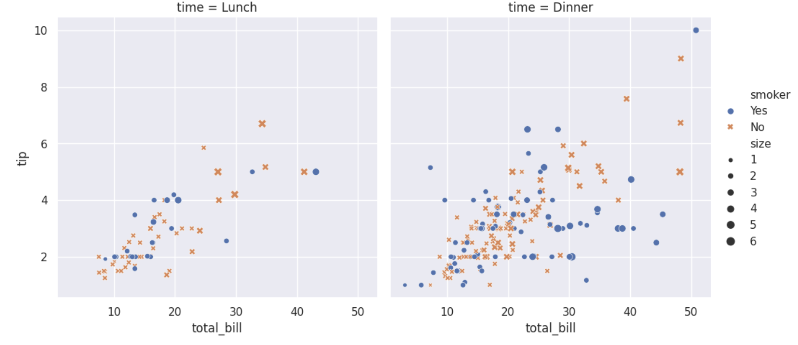
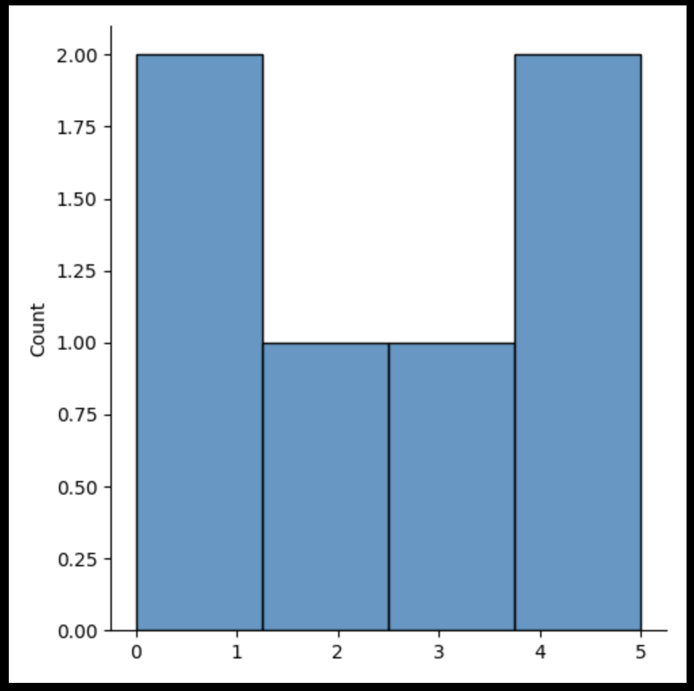
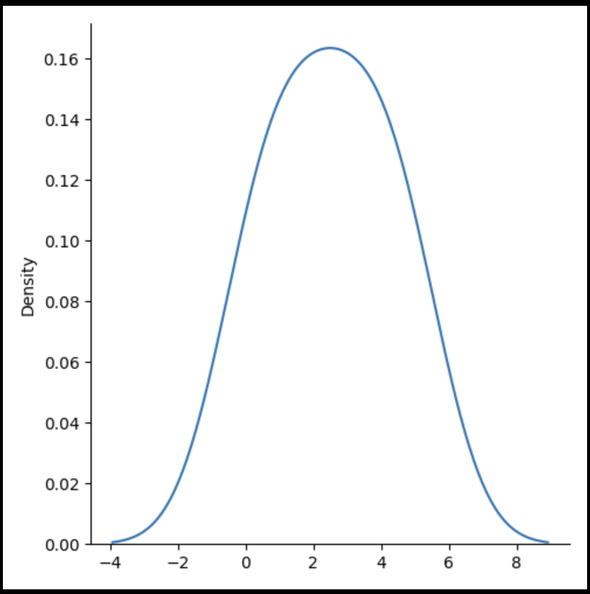

# An introduction to seaborn
Seaborn is a library for making statistical graphics in Python. It builds on top of matplotlib and integrates closely with pandas data structures.

Seaborn helps you explore and understand your data. Its plotting functions operate on dataframes and arrays containing whole datasets and internally perform the necessary semantic mapping and statistical aggregation to produce informative plots. Its dataset-oriented, declarative API lets you focus on what the different elements of your plots mean, rather than on the details of how to draw them.

Here’s an example of what seaborn can do:

```
 Import seaborn
import seaborn as sns

# Apply the default theme
sns.set_theme()

# Load an example dataset
tips = sns.load_dataset("tips")

# Create a visualization
sns.relplot(
    data=tips,
    x="total_bill", y="tip", col="time",
    hue="smoker", style="smoker", size="size",
)
```




# Visualize Distributions With Seaborn

Seaborn is a library that uses Matplotlib underneath to plot graphs. It will be used to visualize random distributions.

## Displots
Displot stands for distribution plot, it takes as input an array and plots a curve corresponding to the distribution of points in the array.

**Import Matplotlib**
Import the pyplot object of the Matplotlib module in your code using the following statement:

```
import matplotlib.pyplot as plt
```

**Import Seaborn**
Import the Seaborn module in your code using the following statement:

```
import seaborn as sns
```

## Plotting a Displot

ExampleGet

```
import matplotlib.pyplot as plt
import seaborn as sns

sns.displot([0, 1, 2, 3, 4, 5])

plt.show()
```



## Plotting a Displot Without the Histogram

Example

```
import matplotlib.pyplot as plt
import seaborn as sns

sns.displot([0, 1, 2, 3, 4, 5], kind="kde")

plt.show()
```



