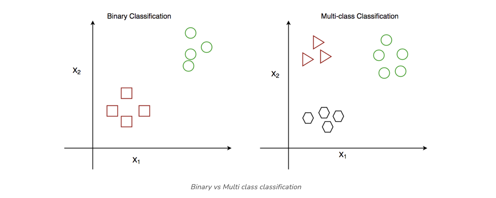
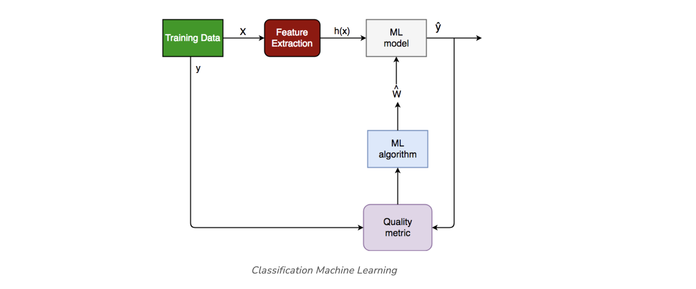
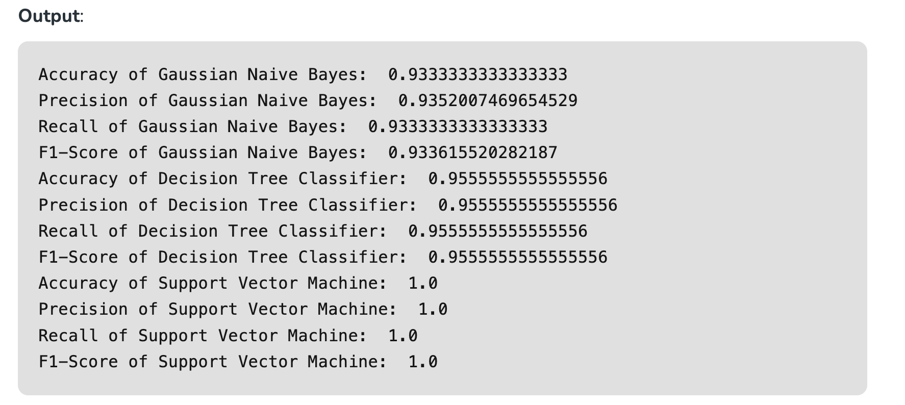

# Classification

Classification algorithms are used to predict a categorical output. For example, a classification algorithm could be used to predict whether an email is spam or not.

# Machine Learning for classification

Classification is a process of categorizing data or objects into predefined classes or categories based on their features or attributes.

Machine Learning classification is a type of supervised learning technique where an algorithm is trained on a labeled dataset to predict the class or category of new, unseen data.

The main objective of classification machine learning is to build a model that can accurately assign a label or category to a new observation based on its features.

For example, a classification model might be trained on a dataset of images labeled as either dogs or cats and then used to predict the class of new, unseen images of dogs or cats based on their features such as color, texture, and shape.

## Classification Types

There are two main classification types in machine learning:

**Binary Classification**
In binary classification, the goal is to classify the input into one of two classes or categories. Example – On the basis of the given health conditions of a person, we have to determine whether the person has a certain disease or not.

**Multiclass Classification**
In multi-class classification, the goal is to classify the input into one of several classes or categories. For Example – On the basis of data about different species of flowers, we have to determine which specie our observation belongs to.



Other categories of classification involves:

**Multi-Label Classification**
In, Multi-label Classification the goal is to predict which of several labels a new data point belongs to. This is different from multiclass classification, where each data point can only belong to one class. For example, a multi-label classification algorithm could be used to classify images of animals as belonging to one or more of the categories cat, dog, bird, or fish.

**Imbalanced Classification**
In, Imbalanced Classification the goal is to predict whether a new data point belongs to a minority class, even though there are many more examples of the majority class. For example, a medical diagnosis algorithm could be used to predict whether a patient has a rare disease, even though there are many more patients with common diseases.

## Classification Algorithms

There are various types of classifiers algorithms. Some of them are : 

**Linear Classifiers**
Linear models create a linear decision boundary between classes. They are simple and computationally efficient. Some of the linear classification models are as follows: 

- Logistic Regression
- Support Vector Machines having kernel = ‘linear’
- Single-layer Perceptron
- Stochastic Gradient Descent (SGD) Classifier

**Non-linear Classifiers**
Non-linear models create a non-linear decision boundary between classes. They can capture more complex relationships between the input features and the target variable. Some of the non-linear classification models are as follows: 

- K-Nearest Neighbours
- Kernel SVM
- Naive Bayes
- Decision Tree Classification
- Ensemble learning classifiers: 
- Random Forests, 
- AdaBoost, 
- Bagging Classifier, 
- Voting Classifier, 
- ExtraTrees Classifier
- Multi-layer Artificial Neural Networks


**Learners in Classifications Algorithm**

In machine learning, classification learners can also be classified as either “lazy” or “eager” learners.

- Lazy Learners: Lazy Learners are also known as instance-based learners, lazy learners do not learn a model during the training phase. Instead, they simply store the training data and use it to classify new instances at prediction time. It is very fast at prediction time because it does not require computations during the predictions. it is less effective in high-dimensional spaces or when the number of training instances is large. Examples of lazy learners include k-nearest neighbors and case-based reasoning.
- Eager Learners: Eager Learners are also known as model-based learners, eager learners learn a model from the training data during the training phase and use this model to classify new instances at prediction time. It is more effective in high-dimensional spaces having large training datasets. Examples of eager learners include decision trees, random forests, and support vector machines.


## Classification Models in Machine Learning

Evaluating a classification model is an important step in machine learning, as it helps to assess the performance and generalization ability of the model on new, unseen data. There are several metrics and techniques that can be used to evaluate a classification model, depending on the specific problem and requirements. Here are some commonly used evaluation metrics:

- **Classification Accuracy:** The proportion of correctly classified instances over the total number of instances in the test set. It is a simple and intuitive metric but can be misleading in imbalanced datasets where the majority class dominates the accuracy score.
- **Confusion matrix:** A table that shows the number of true positives, true negatives, false positives, and false negatives for each class, which can be used to calculate various evaluation metrics.
- **Precision and Recall:** Precision measures the proportion of true positives over the total number of predicted positives, while recall measures the proportion of true positives over the total number of actual positives. These metrics are useful in scenarios where one class is more important than the other, or when there is a trade-off between false positives and false negatives.
- **F1-Score:** The harmonic mean of precision and recall, calculated as 2 x (precision x recall) / (precision + recall). It is a useful metric for imbalanced datasets where both precision and recall are important.
- **ROC curve and AUC:** The Receiver Operating Characteristic (ROC) curve is a plot of the true positive rate (recall) against the false positive rate (1-specificity) for different threshold values of the classifier’s decision function. The Area Under the Curve (AUC) measures the overall performance of the classifier, with values ranging from 0.5 (random guessing) to 1 (perfect classification).
- **Cross-validation:** A technique that divides the data into multiple folds and trains the model on each fold while testing on the others, to obtain a more robust estimate of the model’s performance.

It is important to choose the appropriate evaluation metric(s) based on the specific problem and requirements, and to avoid overfitting by evaluating the model on independent test data.

## Characteristics of Classification

Here are the characteristics of the classification:

- **Categorical Target Variable:** Classification deals with predicting categorical target variables that represent discrete classes or labels. Examples include classifying emails as spam or not spam, predicting whether a patient has a high risk of heart disease, or identifying image objects.
- **Accuracy and Error Rates:** Classification models are evaluated based on their ability to correctly classify data points. Common metrics include accuracy, precision, recall, and F1-score.
- **Model Complexity:** Classification models range from simple linear classifiers to more complex nonlinear models. The choice of model complexity depends on the complexity of the relationship between the input features and the target variable.
- **Overfitting and Underfitting:** Classification models are susceptible to overfitting and underfitting. Overfitting occurs when the model learns the training data too well and fails to generalize to new data.


## How does Classification Machine Learning Work?

The basic idea behind classification is to train a model on a labeled dataset, where the input data is associated with their corresponding output labels, to learn the patterns and relationships between the input data and output labels. Once the model is trained, it can be used to predict the output labels for new unseen data.



The classification process typically involves the following steps:

**Understanding the problem**

Before getting started with classification, it is important to understand the problem you are trying to solve. What are the class labels you are trying to predict? What is the relationship between the input data and the class labels?

Suppose we have to predict whether a patient has a certain disease or not, on the basis of 7 independent variables, called features. This means, there can be only two possible outcomes: 

- The patient has the disease, which means “True”.
- The patient has no disease. which means “False”.

This is a binary classification problem.

**Data preparation**

Once you have a good understanding of the problem, the next step is to prepare your data. This includes collecting and preprocessing the data and splitting it into training, validation, and test sets. In this step, the data is cleaned, preprocessed, and transformed into a format that can be used by the classification algorithm.

- **X:** It is the independent feature, in the form of an N*M matrix. N is the no. of observations and M is the number of features.
- **y:** An N vector corresponding to predicted classes for each of the N observations.

**Feature Extraction**

The relevant features or attributes are extracted from the data that can be used to differentiate between the different classes.

Suppose our input X has 7 independent features, having only 5 features influencing the label or target values remaining 2 are negligibly or not correlated, then we will use only these 5 features only for the model training. 

**Model Selection**

There are many different models that can be used for classification, including **logistic regression, decision trees, support vector machines (SVM), or neural networks**. It is important to select a model that is appropriate for your problem, taking into account the size and complexity of your data, and the computational resources you have available.

**Model Training**

Once you have selected a model, the next step is to train it on your training data. This involves adjusting the parameters of the model to minimize the error between the predicted class labels and the actual class labels for the training data.

**Model Evaluation**

Evaluating the model: After training the model, it is important to evaluate its performance on a validation set. This will give you a good idea of how well the model is likely to perform on new, unseen data. 

```
Log Loss or Cross-Entropy Loss, Confusion Matrix,  Precision, Recall, and AUC-ROC curve are the quality metrics used for measuring the performance of the model.
```

**Fine-tuning the model**

If the model’s performance is not satisfactory, you can fine-tune it by adjusting the parameters, or trying a different model.

**Deploying the model**

Finally, once we are satisfied with the performance of the model, we can deploy it to make predictions on new data.  it can be used for real world problem.

**Examples of Machine Learning Classification in Real Life**

Classification algorithms are widely used in many real-world applications across various domains, including:

- Email spam filtering
- Credit risk assessment
- Medical diagnosis
- Image classification
- Sentiment analysis.
- Fraud detection
- Quality control
- Recommendation systems

**Implementation of Classification Model in Machine Learning**

Requirements for running the given script:

- Python
- Scipy and Numpy
- Pandas
- Scikit-learn 

```
# Importing the required libraries
import numpy as np
import pandas as pd
from sklearn.model_selection import train_test_split
from sklearn.metrics import accuracy_score, precision_score, recall_score, f1_score
from sklearn import datasets
from sklearn import svm
from sklearn.tree import DecisionTreeClassifier
from sklearn.naive_bayes import GaussianNB

# import the iris dataset
iris = datasets.load_iris()
X = iris.data
y = iris.target

# splitting X and y into training and testing sets
X_train, X_test, y_train, y_test = train_test_split(
	X, y, test_size=0.3, random_state=1)

# GAUSSIAN NAIVE BAYES
gnb = GaussianNB()
# train the model
gnb.fit(X_train, y_train)
# make predictions
gnb_pred = gnb.predict(X_test)
# print the accuracy
print("Accuracy of Gaussian Naive Bayes: ",
	accuracy_score(y_test, gnb_pred))
# print other performance metrics
print("Precision of Gaussian Naive Bayes: ",
	precision_score(y_test, gnb_pred, average='weighted'))
print("Recall of Gaussian Naive Bayes: ",
	recall_score(y_test, gnb_pred, average='weighted'))
print("F1-Score of Gaussian Naive Bayes: ",
	f1_score(y_test, gnb_pred, average='weighted'))

# DECISION TREE CLASSIFIER
dt = DecisionTreeClassifier(random_state=0)
# train the model
dt.fit(X_train, y_train)
# make predictions
dt_pred = dt.predict(X_test)
# print the accuracy
print("Accuracy of Decision Tree Classifier: ",
	accuracy_score(y_test, dt_pred))
# print other performance metrics
print("Precision of Decision Tree Classifier: ",
	precision_score(y_test, dt_pred, average='weighted'))
print("Recall of Decision Tree Classifier: ",
	recall_score(y_test, dt_pred, average='weighted'))
print("F1-Score of Decision Tree Classifier: ",
	f1_score(y_test, dt_pred, average='weighted'))

# SUPPORT VECTOR MACHINE
svm_clf = svm.SVC(kernel='linear') # Linear Kernel
# train the model
svm_clf.fit(X_train, y_train)
# make predictions
svm_clf_pred = svm_clf.predict(X_test)
# print the accuracy
print("Accuracy of Support Vector Machine: ",
	accuracy_score(y_test, svm_clf_pred))
# print other performance metrics
print("Precision of Support Vector Machine: ",
	precision_score(y_test, svm_clf_pred, average='weighted'))
print("Recall of Support Vector Machine: ",
	recall_score(y_test, svm_clf_pred, average='weighted'))
print("F1-Score of Support Vector Machine: ",
	f1_score(y_test, svm_clf_pred, average='weighted'))
```



**What is classification rule in machine learning?**
```
A decision guideline in machine learning determining the class or category of input based on features.
```

**What are the classification of algorithms?**
```
Methods like decision trees, SVM, and k-NN categorizing data into predefined classes for predictions.
```

**What is learning classification?**
```
Acquiring knowledge to assign labels to input data, distinguishing classes in supervised machine learning.
```

**What is difference between classification and clustering?**


- **Classification:** Predicts predefined classes.
- **Clustering:** Groups data based on inherent similarities without predefined classes.


