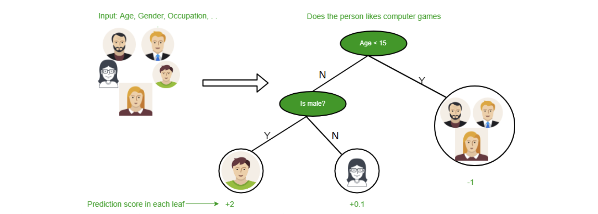
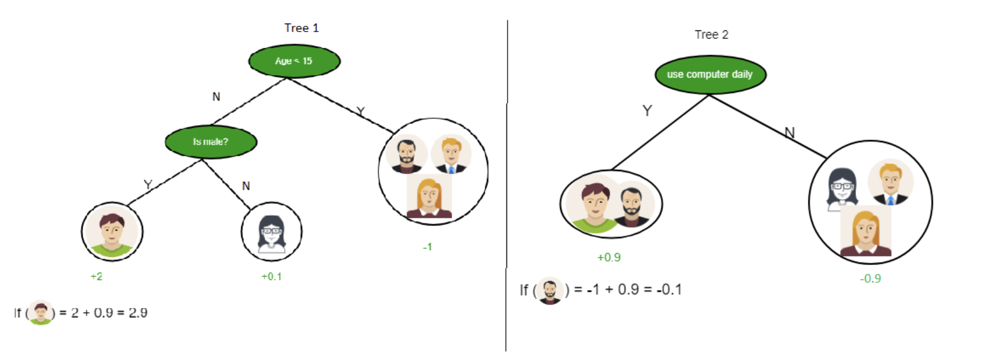
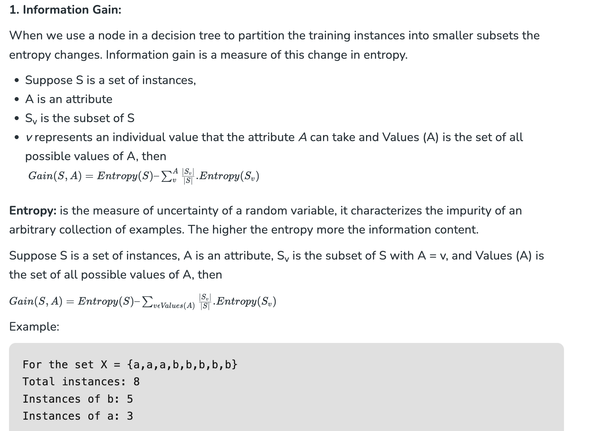

# Decision Tree

## Decision Tree in Machine Learning

A decision tree is a type of supervised learning algorithm that is commonly used in machine learning to model and predict outcomes based on input data. It is a tree-like structure where each internal node tests on attribute, each branch corresponds to attribute value and each leaf node represents the final decision or prediction. The decision tree algorithm falls under the category of supervised learning. They can be used to solve both regression and classification problems.

## Decision Tree Terminologies

There are specialized terms associated with decision trees that denote various components and facets of the tree structure and decision-making procedure. :

- **Root Node:** A decision tree’s root node, which represents the original choice or feature from which the tree branches, is the highest node.
- **Internal Nodes (Decision Nodes):** Nodes in the tree whose choices are determined by the values of particular attributes. There are branches on these nodes that go to other nodes.
- **Leaf Nodes (Terminal Nodes):** The branches’ termini, when choices or forecasts are decided upon. There are no more branches on leaf nodes.
- **Branches (Edges):** Links between nodes that show how decisions are made in response to particular circumstances.
- **Splitting:** The process of dividing a node into two or more sub-nodes based on a decision criterion. It involves selecting a feature and a threshold to create subsets of data.
- **Parent Node:** A node that is split into child nodes. The original node from which a split originates.
- **Child Node:** Nodes created as a result of a split from a parent node.
- **Decision Criterion:** The rule or condition used to determine how the data should be split at a decision node. It involves comparing feature values against a threshold.
- **Pruning:** The process of removing branches or nodes from a decision tree to improve its generalisation and prevent overfitting.

Understanding these terminologies is crucial for interpreting and working with decision trees in machine learning applications.

## Why Decision Tree?

Decision trees are widely used in machine learning for a number of reasons:

- Decision trees are so versatile in simulating intricate decision-making processes, because of their interpretability and versatility.
- Their portrayal of complex choice scenarios that take into account a variety of causes and outcomes is made possible by their hierarchical structure.
- They provide comprehensible insights into the decision logic, decision trees are especially helpful for tasks involving categorisation and regression.
- They are proficient with both numerical and categorical data, and they can easily adapt to a variety of datasets thanks to their autonomous feature selection capability.
- Decision trees also provide simple visualization, which helps to comprehend and elucidate the underlying decision processes in a model.

## Decision Tree Approach

Decision tree uses the tree representation to solve the problem in which each leaf node corresponds to a class label and attributes are represented on the internal node of the tree. We can represent any boolean function on discrete attributes using the decision tree.

**Below are some assumptions that we made while using the decision tree:**

At the beginning, we consider the whole training set as the root.

- Feature values are preferred to be categorical. If the values are continuous then they are discretized prior to building the model.
- On the basis of attribute values, records are distributed recursively.
- We use statistical methods for ordering attributes as root or the internal node.

As you can see from the above image the Decision Tree works on the Sum of Product form which is also known as Disjunctive Normal Form. In the above image, we are predicting the use of computer in the daily life of people. In the Decision Tree, the major challenge is the identification of the attribute for the root node at each level. This process is known as attribute selection. We have two popular attribute selection measures:

1. Information Gain
2. Gini Index

## Building Decision Tree using Information Gain The essentials:

- Start with all training instances associated with the root node
- Use info gain to choose which attribute to label each node with
- Note: No root-to-leaf path should contain the same discrete attribute twice
- Recursively construct each subtree on the subset of training instances that would be classified down that path in the tree.
- If all positive or all negative training instances remain, the label that node “yes” or “no” accordingly
- If no attributes remain, label with a majority vote of training instances left at that node
- If no instances remain, label with a majority vote of the parent’s training instances.

## Example of a Decision Tree Algorithm

**Forecasting Activities Using Weather Information**

- **Root node:** Whole dataset
- **Attribute :** “Outlook” (sunny, cloudy, rainy).
- **Subsets:** Overcast, Rainy, and Sunny.
- **Recursive Splitting:** Divide the sunny subset even more according to humidity, for example.
- **Leaf Nodes:** Activities include “swimming,” “hiking,” and “staying inside.”