# Linear Regression

- Introduction to Linear Regression
- Gradient Descent in Linear Regression
- Linear regression (Python Implementation from scratch)
- Linear regression implementation using sklearn
- Rainfall prediction - Project
- Boston Housing Kaggle Challenge - Project
- Ridge Regression
- Lasso regression
- Elastic net Regression
- Implementation of Lasso, Ridge and Elastic Net

# 1.Introduction to Linear Regression

## What is Linear Regression?
Linear regression is a type of supervised machine learning algorithm that computes the linear relationship between the dependent variable and one or more independent features by fitting a linear equation to observed data.

When there is only one independent feature, it is known as Simple Linear Regression, and when there are more than one feature, it is known as Multiple Linear Regression.

Similarly, when there is only one dependent variable, it is considered Univariate Linear Regression, while when there are more than one dependent variables, it is known as Multivariate Regression.


## Why Linear Regression is Important?
The interpretability of linear regression is a notable strength. The model’s equation provides clear coefficients that elucidate the impact of each independent variable on the dependent variable, facilitating a deeper understanding of the underlying dynamics. Its simplicity is a virtue, as linear regression is transparent, easy to implement, and serves as a foundational concept for more complex algorithms.

Linear regression is not merely a predictive tool; it forms the basis for various advanced models. Techniques like regularization and support vector machines draw inspiration from linear regression, expanding its utility. Additionally, linear regression is a cornerstone in assumption testing, enabling researchers to validate key assumptions about the data.


## Types of Linear Regression
There are two main types of linear regression:

**Simple Linear Regression**
This is the simplest form of linear regression, and it involves only one independent variable and one dependent variable. The equation for simple linear regression is:

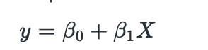

where:

- Y is the dependent variable
- X is the independent variable
- β0 is the intercept
- β1 is the slope


**Multiple Linear Regression**

This involves more than one independent variable and one dependent variable. The equation for multiple linear regression is:

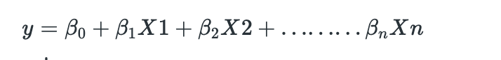


**where:**

- Y is the dependent variable
- X1, X2, …, Xn are the independent variables
- β0 is the intercept
- β1, β2, …, βn are the slopes


**The goal of the algorithm is to find the best Fit Line equation that can predict the values based on the independent variables.**

In regression set of records are present with X and Y values and these values are used to learn a function so if you want to predict Y from an unknown X this learned function can be used. In regression we have to find the value of Y, So, a function is required that predicts continuous Y in the case of regression given X as independent features.


## What is the best Fit Line?

Our primary objective while using linear regression is to locate the best-fit line, which implies that the error between the predicted and actual values should be kept to a minimum. There will be the least error in the best-fit line.

The best Fit Line equation provides a straight line that represents the relationship between the dependent and independent variables. The slope of the line indicates how much the dependent variable changes for a unit change in the independent variable(s).


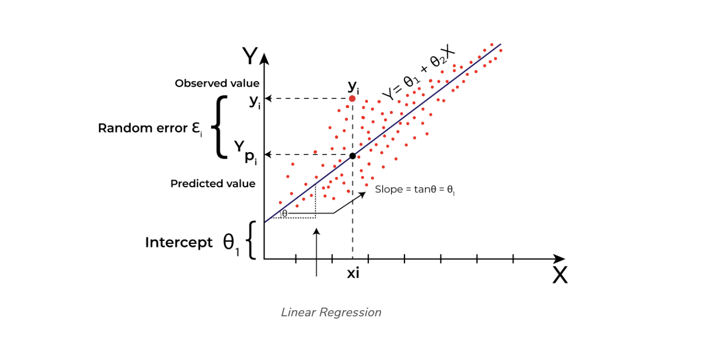


Here Y is called a dependent or target variable and X is called an independent variable also known as the predictor of Y. There are many types of functions or modules that can be used for regression. A linear function is the simplest type of function. Here, X may be a single feature or multiple features representing the problem.

Linear regression performs the task to predict a dependent variable value (y) based on a given independent variable (x)). Hence, the name is Linear Regression. In the figure above, X (input) is the work experience and Y (output) is the salary of a person. The regression line is the best-fit line for our model. 

We utilize the cost function to compute the best values in order to get the best fit line since different values for weights or the coefficient of lines result in different regression lines.


**Hypothesis function in Linear Regression**

As we have assumed earlier that our independent feature is the experience i.e X and the respective salary Y is the dependent variable. Let’s assume there is a linear relationship between X and Y then the salary can be predicted using:

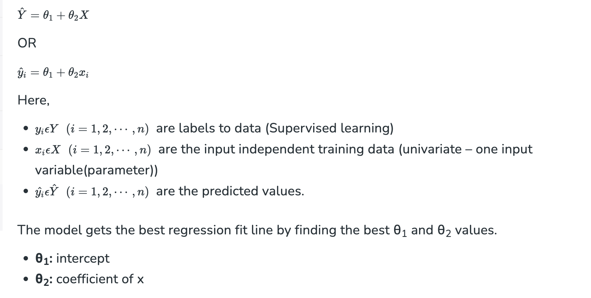

Once we find the best θ1 and θ2 values, we get the best-fit line. So when we are finally using our model for prediction, it will predict the value of y for the input value of x. 

## How to update θ1 and θ2 values to get the best-fit line? 

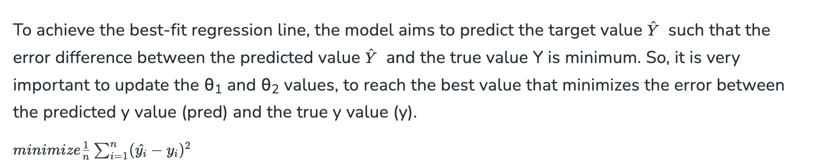

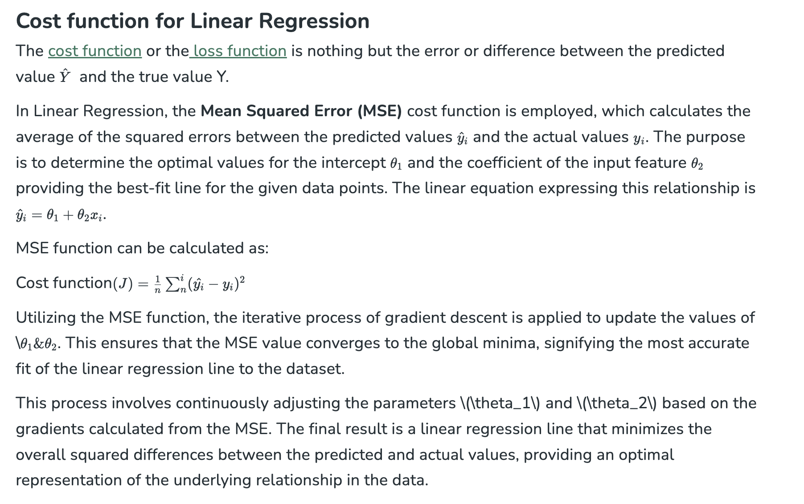

## Gradient Descent for Linear Regression

A linear regression model can be trained using the optimization algorithm gradient descent by iteratively modifying the model’s parameters to reduce the mean squared error (MSE) of the model on a training dataset. To update θ1 and θ2 values in order to reduce the Cost function (minimizing RMSE value) and achieve the best-fit line the model uses Gradient Descent. The idea is to start with random θ1 and θ2 values and then iteratively update the values, reaching minimum cost. 

A gradient is nothing but a derivative that defines the effects on outputs of the function with a little bit of variation in inputs.

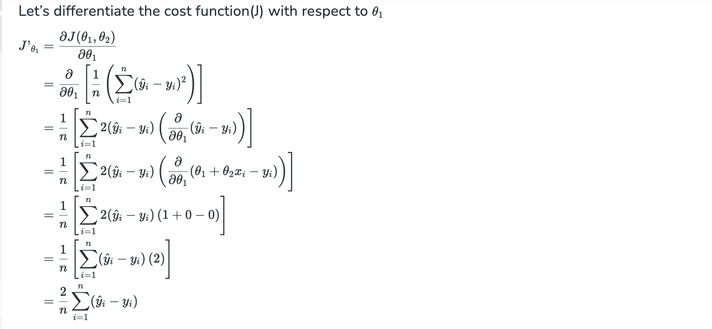

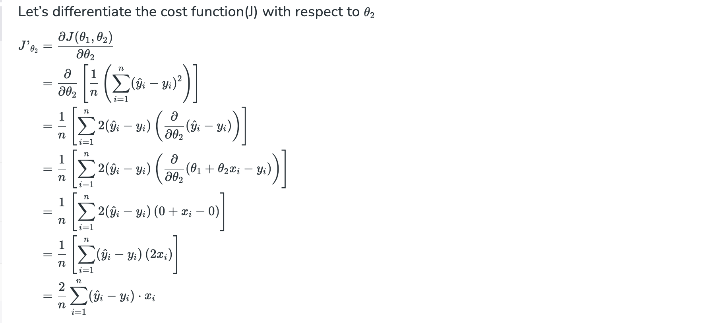
​
Finding the coefficients of a linear equation that best fits the training data is the objective of linear regression. By moving in the direction of the Mean Squared Error negative gradient with respect to the coefficients, the coefficients can be changed. And the respective intercept and coefficient of X will be if α  is the learning rate.    


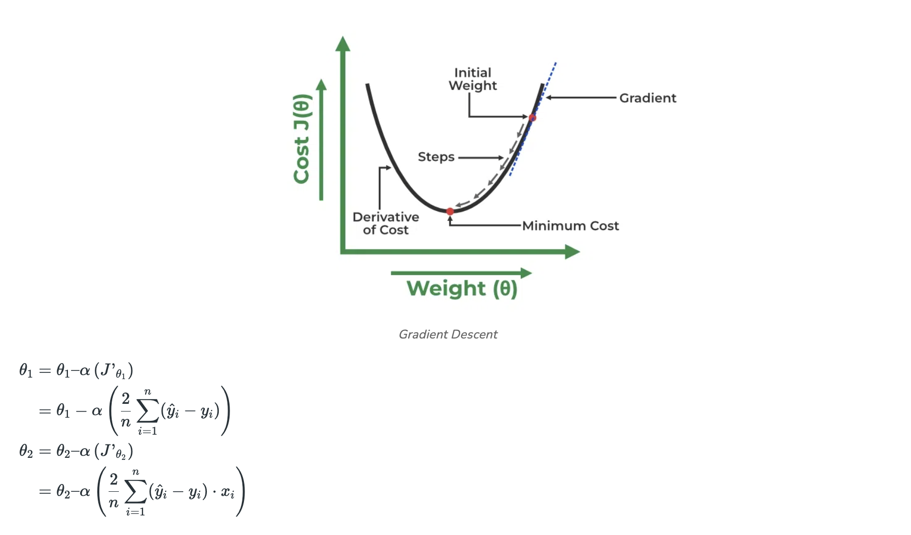

## Assumptions of Simple Linear Regression

Linear regression is a powerful tool for understanding and predicting the behavior of a variable, however, it needs to meet a few conditions in order to be accurate and dependable solutions. 

1. **Linearity:** The independent and dependent variables have a linear relationship with one another. This implies that changes in the dependent variable follow those in the independent variable(s) in a linear fashion. This means that there should be a straight line that can be drawn through the data points. If the relationship is not linear, then linear regression will not be an accurate model.

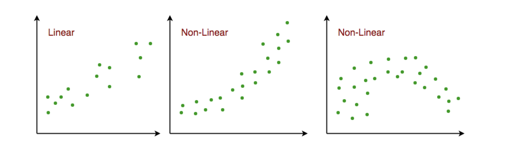

2. **Independence:** The observations in the dataset are independent of each other. This means that the value of the dependent variable for one observation does not depend on the value of the dependent variable for another observation. If the observations are not independent, then linear regression will not be an accurate model.

3. **Homoscedasticity:** Across all levels of the independent variable(s), the variance of the errors is constant. This indicates that the amount of the independent variable(s) has no impact on the variance of the errors. If the variance of the residuals is not constant, then linear regression will not be an accurate model.

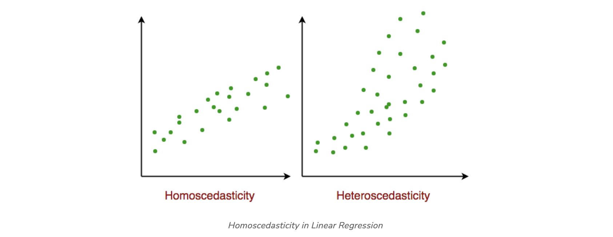

4. **Normality:** The residuals should be normally distributed. This means that the residuals should follow a bell-shaped curve. If the residuals are not normally distributed, then linear regression will not be an accurate model.

## Assumptions of Multiple Linear Regression

For Multiple Linear Regression, all four of the assumptions from Simple Linear Regression apply. In addition to this, below are few more:

1. **No multicollinearity:** There is no high correlation between the independent variables. This indicates that there is little or no correlation between the independent variables. Multicollinearity occurs when two or more independent variables are highly correlated with each other, which can make it difficult to determine the individual effect of each variable on the dependent variable. If there is multicollinearity, then multiple linear regression will not be an accurate model.
2. **Additivity:** The model assumes that the effect of changes in a predictor variable on the response variable is consistent regardless of the values of the other variables. This assumption implies that there is no interaction between variables in their effects on the dependent variable.
3. **Feature Selection:** In multiple linear regression, it is essential to carefully select the independent variables that will be included in the model. Including irrelevant or redundant variables may lead to overfitting and complicate the interpretation of the model.
4. **Overfitting:** Overfitting occurs when the model fits the training data too closely, capturing noise or random fluctuations that do not represent the true underlying relationship between variables. This can lead to poor generalization performance on new, unseen data.

## Multicollinearity
Multicollinearity is a statistical phenomenon that occurs when two or more independent variables in a multiple regression model are highly correlated, making it difficult to assess the individual effects of each variable on the dependent variable.

**Detecting Multicollinearity includes two techniques:**
- **Correlation Matrix:** Examining the correlation matrix among the independent variables is a common way to detect multicollinearity. High correlations (close to 1 or -1) indicate potential multicollinearity.
- **VIF (Variance Inflation Factor):** VIF is a measure that quantifies how much the variance of an estimated regression coefficient increases if your predictors are correlated. A high VIF (typically above 10) suggests multicollinearity.

## Evaluation Metrics for Linear Regression
A variety of evaluation measures can be used to determine the strength of any linear regression model. These assessment metrics often give an indication of how well the model is producing the observed outputs.

The most common measurements are:

**Mean Square Error (MSE)**

Mean Squared Error (MSE) is an evaluation metric that calculates the average of the squared differences between the actual and predicted values for all the data points. The difference is squared to ensure that negative and positive differences don’t cancel each other out.

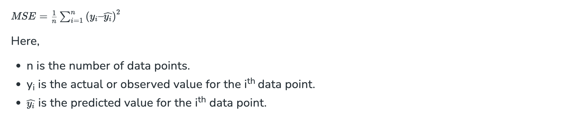

MSE is a way to quantify the accuracy of a model’s predictions. MSE is sensitive to outliers as large errors contribute significantly to the overall score.

**Mean Absolute Error (MAE)**

Mean Absolute Error is an evaluation metric used to calculate the accuracy of a regression model. MAE measures the average absolute difference between the predicted values and actual values.

Mathematically, MAE is expressed as:

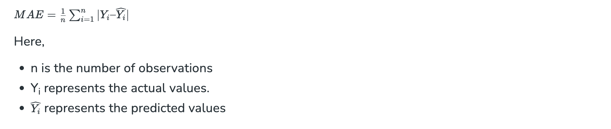

Lower MAE value indicates better model performance. It is not sensitive to the outliers as we consider absolute differences.

**Root Mean Squared Error (RMSE)**

The square root of the residuals’ variance is the Root Mean Squared Error. It describes how well the observed data points match the expected values, or the model’s absolute fit to the data.

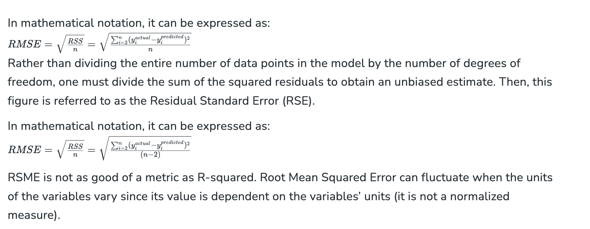

**Coefficient of Determination (R-squared)**

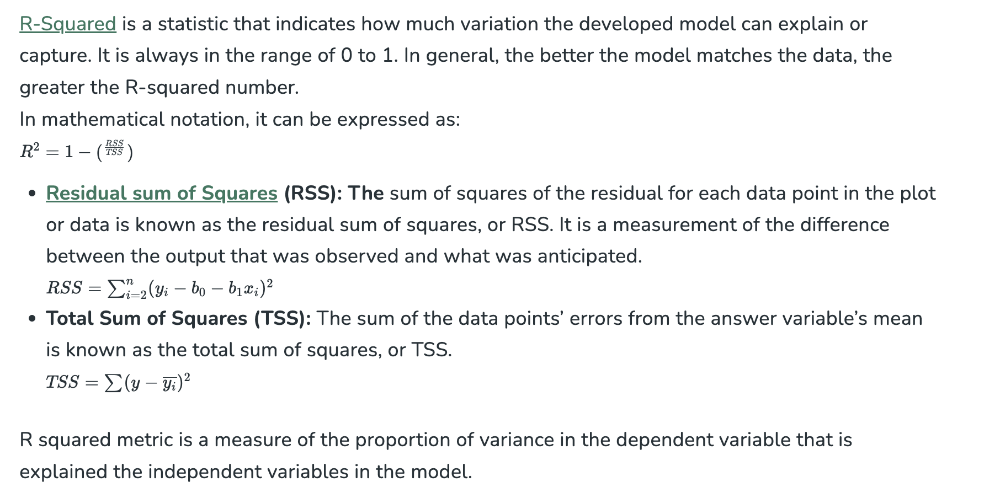

**Adjusted R-Squared Error**

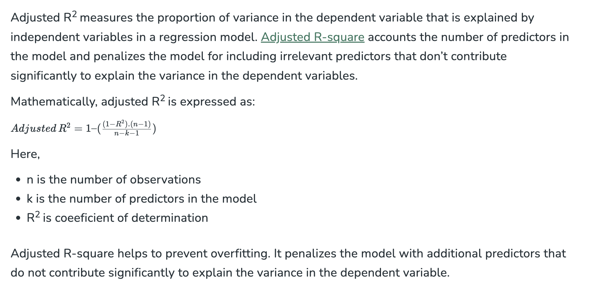

## Python Implementation of Linear Regression

```
import pandas as pd
import numpy as np
import matplotlib.pyplot as plt
import matplotlib.axes as ax
from matplotlib.animation import FuncAnimation
```

**Load the dataset and separate input and Target variables**

```
url = 'https://media.geeksforgeeks.org/wp-content/uploads/20240320114716/data_for_lr.csv'
data = pd.read_csv(url)
data

# Drop the missing values
data = data.dropna()

# training dataset and labels
train_input = np.array(data.x[0:500]).reshape(500, 1)
train_output = np.array(data.y[0:500]).reshape(500, 1)

# valid dataset and labels
test_input = np.array(data.x[500:700]).reshape(199, 1)
test_output = np.array(data.y[500:700]).reshape(199, 1)
```

**Build the Linear Regression Model and Plot the regression line**

**Steps:**

- In forward propagation, Linear regression function Y=mx+c is applied by initially assigning random value of parameter (m & c).
- The we have written the function to finding the cost function i.e the mean 

```
class LinearRegression: 
    def __init__(self): 
        self.parameters = {} 

    def forward_propagation(self, train_input): 
        m = self.parameters['m'] 
        c = self.parameters['c'] 
        predictions = np.multiply(m, train_input) + c 
        return predictions 

    def cost_function(self, predictions, train_output): 
        cost = np.mean((train_output - predictions) ** 2) 
        return cost 

    def backward_propagation(self, train_input, train_output, predictions): 
        derivatives = {} 
        df = (predictions-train_output) 
        # dm= 2/n * mean of (predictions-actual) * input 
        dm = 2 * np.mean(np.multiply(train_input, df)) 
        # dc = 2/n * mean of (predictions-actual) 
        dc = 2 * np.mean(df) 
        derivatives['dm'] = dm 
        derivatives['dc'] = dc 
        return derivatives 

    def update_parameters(self, derivatives, learning_rate): 
        self.parameters['m'] = self.parameters['m'] - learning_rate * derivatives['dm'] 
        self.parameters['c'] = self.parameters['c'] - learning_rate * derivatives['dc'] 

    def train(self, train_input, train_output, learning_rate, iters): 
        # Initialize random parameters 
        self.parameters['m'] = np.random.uniform(0, 1) * -1
        self.parameters['c'] = np.random.uniform(0, 1) * -1

        # Initialize loss 
        self.loss = [] 

        # Initialize figure and axis for animation 
        fig, ax = plt.subplots() 
        x_vals = np.linspace(min(train_input), max(train_input), 100) 
        line, = ax.plot(x_vals, self.parameters['m'] * x_vals +
                        self.parameters['c'], color='red', label='Regression Line') 
        ax.scatter(train_input, train_output, marker='o', 
                color='green', label='Training Data') 

        # Set y-axis limits to exclude negative values 
        ax.set_ylim(0, max(train_output) + 1) 

        def update(frame): 
            # Forward propagation 
            predictions = self.forward_propagation(train_input) 

            # Cost function 
            cost = self.cost_function(predictions, train_output) 

            # Back propagation 
            derivatives = self.backward_propagation( 
                train_input, train_output, predictions) 

            # Update parameters 
            self.update_parameters(derivatives, learning_rate) 

            # Update the regression line 
            line.set_ydata(self.parameters['m'] 
                        * x_vals + self.parameters['c']) 

            # Append loss and print 
            self.loss.append(cost) 
            print("Iteration = {}, Loss = {}".format(frame + 1, cost)) 

            return line, 
        # Create animation 
        ani = FuncAnimation(fig, update, frames=iters, interval=200, blit=True) 

        # Save the animation as a video file (e.g., MP4) 
        ani.save('linear_regression_A.gif', writer='ffmpeg') 

        plt.xlabel('Input') 
        plt.ylabel('Output') 
        plt.title('Linear Regression') 
        plt.legend() 
        plt.show() 

        return self.parameters, self.loss 
```

**Trained the model and Final Prediction**

```
#Example usage
linear_reg = LinearRegression()
parameters, loss = linear_reg.train(train_input, train_output, 0.0001, 20)
```

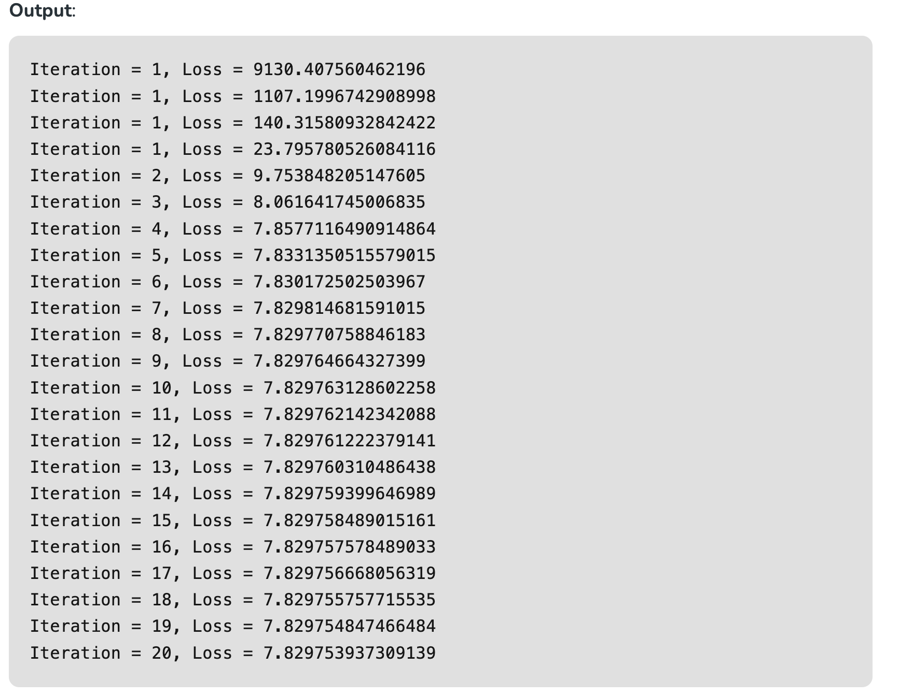


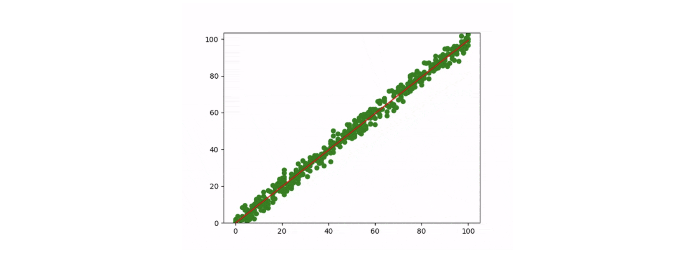

**Linear Regression Line**

The linear regression line provides valuable insights into the relationship between the two variables. It represents the best-fitting line that captures the overall trend of how a dependent variable (Y) changes in response to variations in an independent variable (X).

- **Positive Linear Regression Line:** A positive linear regression line indicates a direct relationship between the independent variable (X) and the dependent variable (Y). This means that as the value of X increases, the value of Y also increases. The slope of a positive linear regression line is positive, meaning that the line slants upward from left to right.
- **Negative Linear Regression Line:** A negative linear regression line indicates an inverse relationship between the independent variable (X) and the dependent variable (Y). This means that as the value of X increases, the value of Y decreases. The slope of a negative linear regression line is negative, meaning that the line slants downward from left to right.

## Regularization Techniques for Linear Models

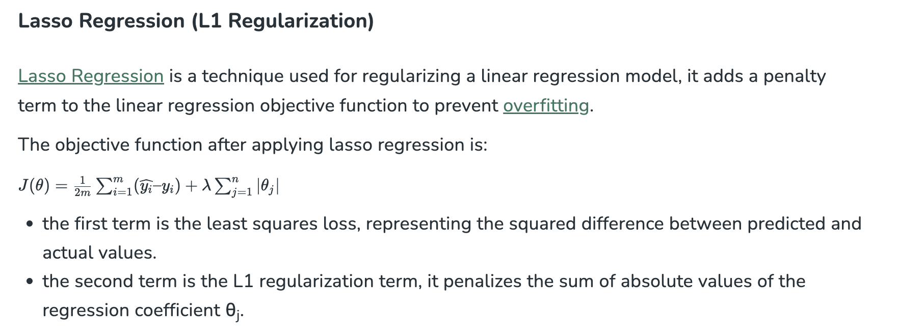
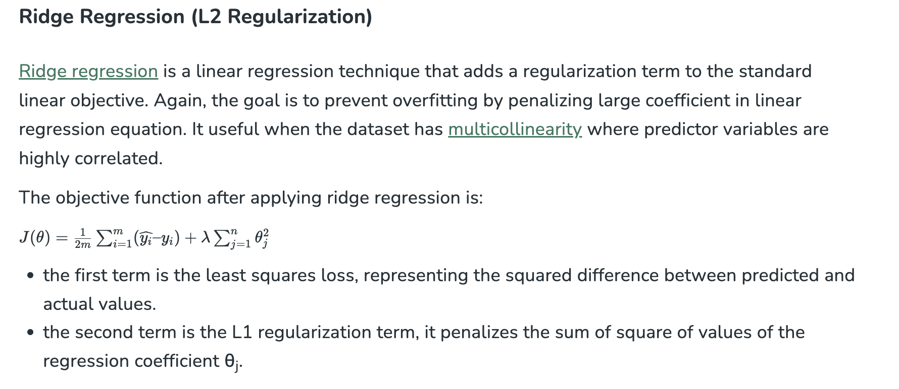
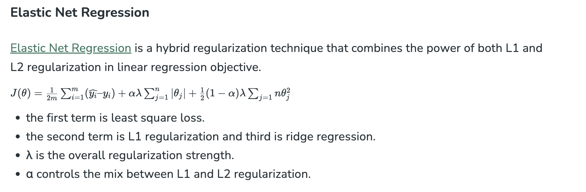


## Advantages & Disadvantages of Linear Regression

**Advantages of Linear Regression**

- Linear regression is a relatively simple algorithm, making it easy to understand and implement. The coefficients of the linear regression model can be interpreted as the change in the dependent variable for a one-unit change in the independent variable, providing insights into the relationships between variables.
- Linear regression is computationally efficient and can handle large datasets effectively. It can be trained quickly on large datasets, making it suitable for real-time applications.
- Linear regression is relatively robust to outliers compared to other machine learning algorithms. Outliers may have a smaller impact on the overall model performance.
- Linear regression often serves as a good baseline model for comparison with more complex machine learning algorithms.
- Linear regression is a well-established algorithm with a rich history and is widely available in various machine learning libraries and software packages.

**Disadvantages of Linear Regression**

- Linear regression assumes a linear relationship between the dependent and independent variables. If the relationship is not linear, the model may not perform well.
- Linear regression is sensitive to multicollinearity, which occurs when there is a high correlation between independent variables. Multicollinearity can inflate the variance of the coefficients and lead to unstable model predictions.
- Linear regression assumes that the features are already in a suitable form for the model. Feature engineering may be required to transform features into a format that can be effectively used by the model.
- Linear regression is susceptible to both overfitting and underfitting. Overfitting occurs when the model learns the training data too well and fails to generalize to unseen data. Underfitting occurs when the model is too simple to capture the underlying relationships in the data.
- Linear regression provides limited explanatory power for complex relationships between variables. More advanced machine learning techniques may be necessary for deeper insights.

## Conclusion

Linear regression is a fundamental machine learning algorithm that has been widely used for many years due to its simplicity, interpretability, and efficiency. It is a valuable tool for understanding relationships between variables and making predictions in a variety of applications.

However, it is important to be aware of its limitations, such as its assumption of linearity and sensitivity to multicollinearity. When these limitations are carefully considered, linear regression can be a powerful tool for data analysis and prediction.

# 2.Gradient Descent in Linear Regression

## What is Gradient Descent?
Gradient Descent is an iterative optimization algorithm that tries to find the optimum value (Minimum/Maximum) of an objective function. It is one of the most used optimization techniques in machine learning projects for updating the parameters of a model in order to minimize a cost function.  

The main aim of gradient descent is to find the best parameters of a model which gives the highest accuracy on training as well as testing datasets. In gradient descent, The gradient is a vector that points in the direction of the steepest increase of the function at a specific point. Moving in the opposite direction of the gradient allows the algorithm to gradually descend towards lower values of the function, and eventually reaching to the minimum of the function.

**Steps Required in Gradient Descent Algorithm**

- **Step 1** we first initialize the parameters of the model randomly
- **Step 2** Compute the gradient of the cost function with respect to each parameter. It involves making partial differentiation of cost function with respect to the parameters.
- **Step 3** Update the parameters of the model by taking steps in the opposite direction of the model. Here we choose a hyperparameter learning rate which is denoted by alpha. It helps in deciding the step size of the gradient.
- **Step 4** Repeat steps 2 and 3 iteratively to get the best parameter for the defined model 

**Pseudocode for Gradient Descent**

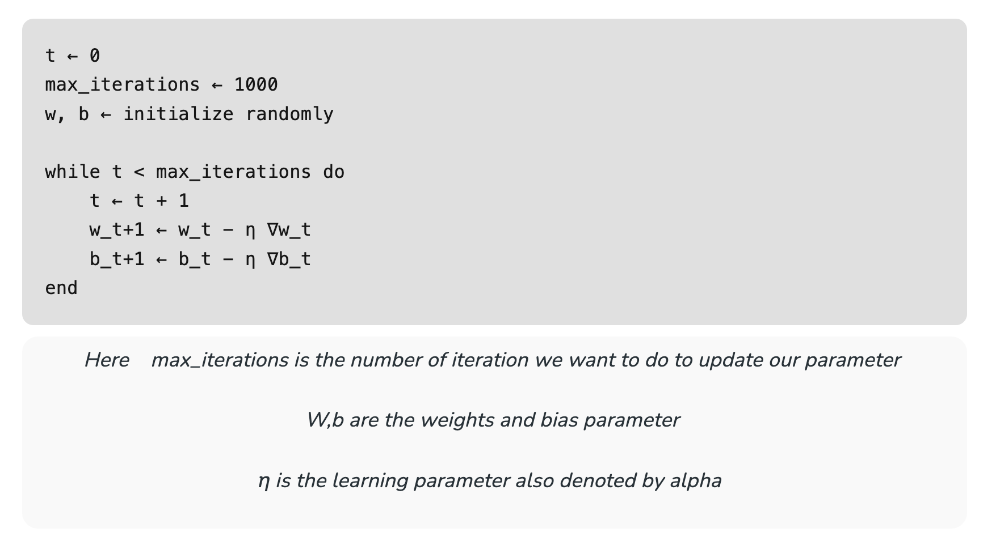

To apply this gradient descent on data using any programming language we have to make four new functions using which we can update our parameter and apply it to data to make a prediction. We will see each function one by one and understand it 

1. **gradient_descent –** In the gradient descent function we will make the prediction on a dataset and compute the difference between the predicted and actual target value and accordingly we will update the parameter and hence it will return the updated parameter.
2. **compute_predictions –** In this function, we will compute the prediction using the parameters at each iteration.
3. **compute_gradient –** In this function we will compute the error which is the difference between the actual and predicted target value and then compute the gradient using this error and training data.
4. **update_parameters –** In this separate function we will update the parameter using learning rate and gradient that we got from the compute_gradient function. 

```
function gradient_descent(X, y, learning_rate, num_iterations):
    Initialize parameters  = θ
    for iter in range(num_iterations):
        predictions = compute_predictions(X, θ)
        gradient = compute_gradient(X, y, predictions)
        update_parameters(θ, gradient, learning_rate)
    return θ

function compute_predictions(X, θ):
    return X*θ

function compute_gradient(X, y, predictions):
    error = predictions - y
    gradient = Xᵀ * error / m
    return gradient

function update_parameters(θ, gradient, learning_rate):
    θ = θ - learning_rate ⨉ gradient
```

**Mathematics Behind Gradient Descent**

In the Machine Learning Regression problem, our model targets to get the best-fit regression line to predict the value y based on the given input value (x). While training the model, the model calculates the cost function like Root Mean Squared error between the predicted value (pred) and true value (y). Our model targets to minimize this cost function. 
To minimize this cost function, the model needs to have the best value of θ1 and θ2(for Univariate linear regression problem). Initially model selects θ1 and θ2 values randomly and then iteratively update these value in order to minimize the cost function until it reaches the minimum. By the time model achieves the minimum cost function, it will have the best θ1 and θ2 values. Using these updated values of θ1 and θ2 in the hypothesis equation of linear equation, our model will predict the output value y.  

**How do θ1 and θ2 values get updated?**

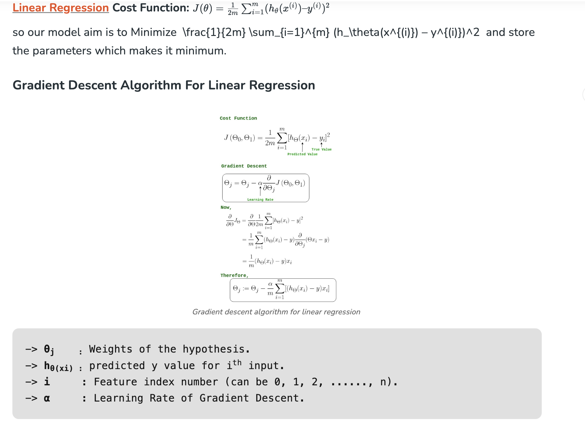

**How Does Gradient Descent Work**

Gradient descent works by moving downward toward the pits or valleys in the graph to find the minimum value. This is achieved by taking the derivative of the cost function, as illustrated in the figure below. During each iteration, gradient descent step-downs the cost function in the direction of the steepest descent. By adjusting the parameters in this direction, it seeks to reach the minimum of the cost function and find the best-fit values for the parameters. The size of each step is determined by parameter α known as Learning Rate. 
In the Gradient Descent algorithm, one can infer two points : 

If slope is +ve : θj = θj – (+ve value). Hence the value of θj decreases.

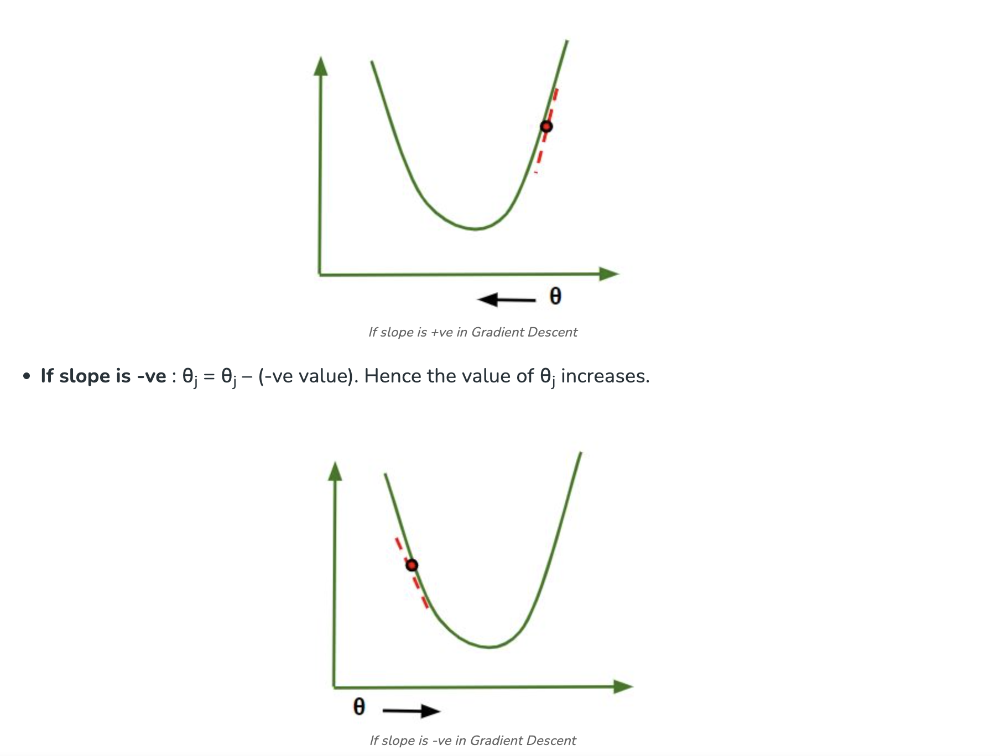

**How To Choose Learning Rate**

The choice of correct learning rate is very important as it ensures that Gradient Descent converges in a reasonable time. : 

- If we choose **α to be very large,** Gradient Descent can overshoot the minimum. It may fail to converge or even diverge. 

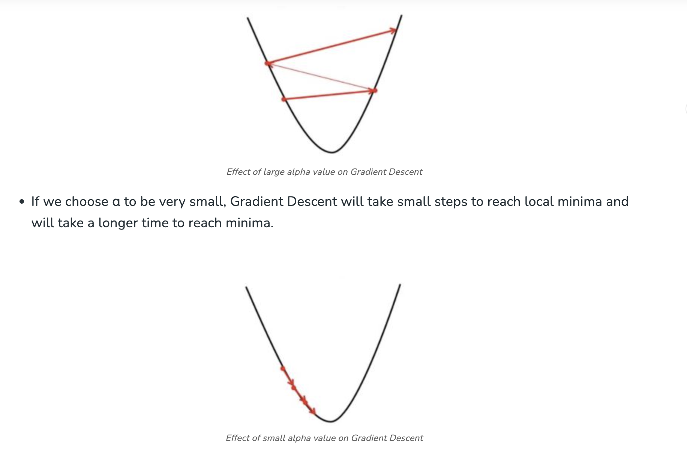

## Python Implementation of Gradient Descent 

At first, we will import all the necessary Python libraries that we will need for mathematical computation and plotting like numpy for mathematical operations and matplotlib for plotting. Then we will define a class Linear_Regression that represents the linear regression model.

We will make a update_coeffs method inside the class to update the coefficients (parameters) of the linear regression model using gradient descent. To calculate the error between the predicted output and the actual output we will make a predict method that will make predictions using the current model coefficients. 

For updating and calculating the gradient of the error we will make compute_cost which will apply gradient descent on (mean squared error) between the predicted values and the actual values.

```
# Implementation of gradient descent in linear regression
import numpy as np
import matplotlib.pyplot as plt


class Linear_Regression:
    def __init__(self, X, Y):
        self.X = X
        self.Y = Y
        self.b = [0, 0]

    def update_coeffs(self, learning_rate):
        Y_pred = self.predict()
        Y = self.Y
        m = len(Y)
        self.b[0] = self.b[0] - (learning_rate * ((1/m) *
                                                  np.sum(Y_pred - Y)))

        self.b[1] = self.b[1] - (learning_rate * ((1/m) *
                                                  np.sum((Y_pred - Y) * self.X)))

    def predict(self, X=[]):
        Y_pred = np.array([])
        if not X:
            X = self.X
        b = self.b
        for x in X:
            Y_pred = np.append(Y_pred, b[0] + (b[1] * x))

        return Y_pred

    def get_current_accuracy(self, Y_pred):
        p, e = Y_pred, self.Y
        n = len(Y_pred)
        return 1-sum(
            [
                abs(p[i]-e[i])/e[i]
                for i in range(n)
                if e[i] != 0]
        )/n
    # def predict(self, b, yi):

    def compute_cost(self, Y_pred):
        m = len(self.Y)
        J = (1 / 2*m) * (np.sum(Y_pred - self.Y)**2)
        return J

    def plot_best_fit(self, Y_pred, fig):
        f = plt.figure(fig)
        plt.scatter(self.X, self.Y, color='b')
        plt.plot(self.X, Y_pred, color='g')
        f.show()


def main():
    X = np.array([i for i in range(11)])
    Y = np.array([2*i for i in range(11)])

    regressor = Linear_Regression(X, Y)

    iterations = 0
    steps = 100
    learning_rate = 0.01
    costs = []

    # original best-fit line
    Y_pred = regressor.predict()
    regressor.plot_best_fit(Y_pred, 'Initial Best Fit Line')

    while 1:
        Y_pred = regressor.predict()
        cost = regressor.compute_cost(Y_pred)
        costs.append(cost)
        regressor.update_coeffs(learning_rate)

        iterations += 1
        if iterations % steps == 0:
            print(iterations, "epochs elapsed")
            print("Current accuracy is :",
                  regressor.get_current_accuracy(Y_pred))

            stop = input("Do you want to stop (y/*)??")
            if stop == "y":
                break

    # final best-fit line
    regressor.plot_best_fit(Y_pred, 'Final Best Fit Line')

    # plot to verify cost function decreases
    h = plt.figure('Verification')
    plt.plot(range(iterations), costs, color='b')
    h.show()

    # if user wants to predict using the regressor:
    regressor.predict([i for i in range(10)])


if __name__ == '__main__':
    main()
```

**Output:**

```
100 epochs elapsed
Current accuracy is : 0.9836456109008862
```

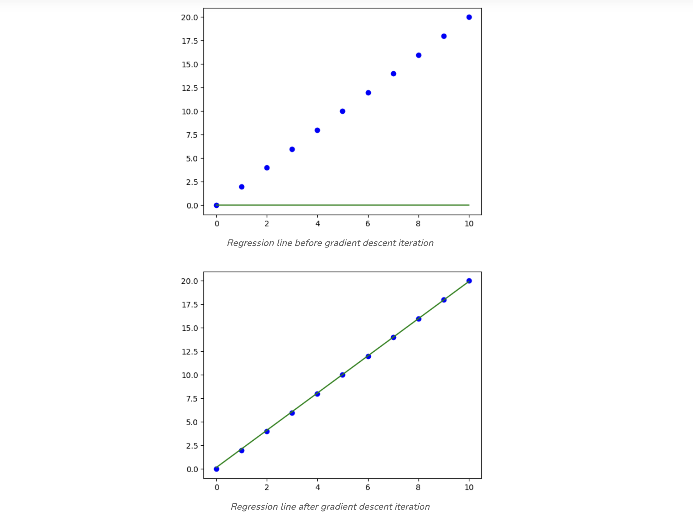


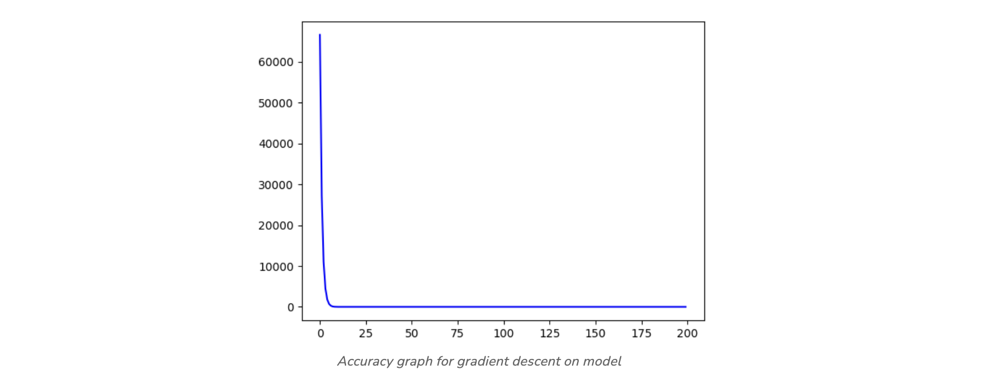


## Advantages Of Gradient Descent

- **Flexibility:** Gradient Descent can be used with various cost functions and can handle non-linear regression problems.
- **Scalability:** Gradient Descent is scalable to large datasets since it updates the parameters for each training example one at a time.
- **Convergence:** Gradient Descent can converge to the global minimum of the cost function, provided that the learning rate is set appropriately.


## Disadvantages Of Gradient Descent 

- **Sensitivity to Learning Rate:** The choice of learning rate can be critical in Gradient Descent since using a high learning rate can cause the algorithm to overshoot the minimum, while a low learning rate can make the algorithm converge slowly.
- **Slow Convergence:** Gradient Descent may require more iterations to converge to the minimum since it updates the parameters for each training example one at a time.
- **Local Minima:** Gradient Descent can get stuck in local minima if the cost function has multiple local minima.
- **Noisy updates:** The updates in Gradient Descent are noisy and have a high variance, which can make the optimization process less stable and lead to oscillations around the minimum.


Overall, Gradient Descent is a useful optimization algorithm for linear regression, but it has some limitations and requires careful tuning of the learning rate to ensure convergence.


