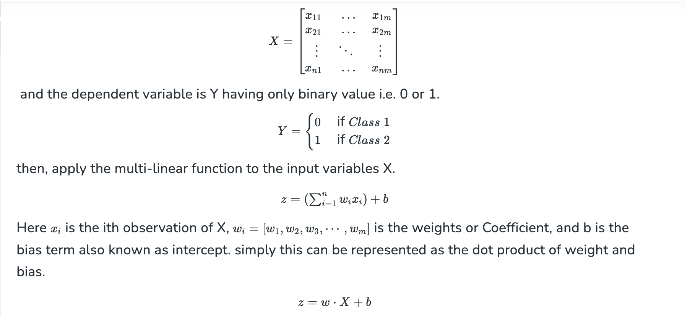
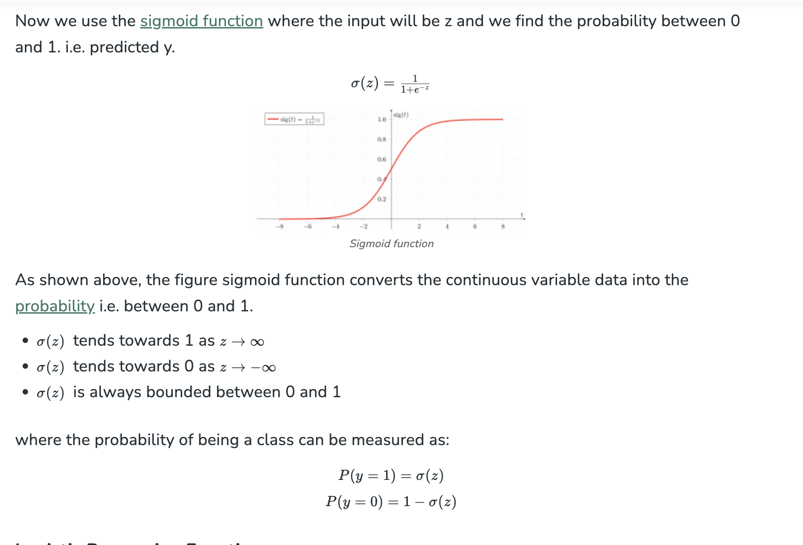
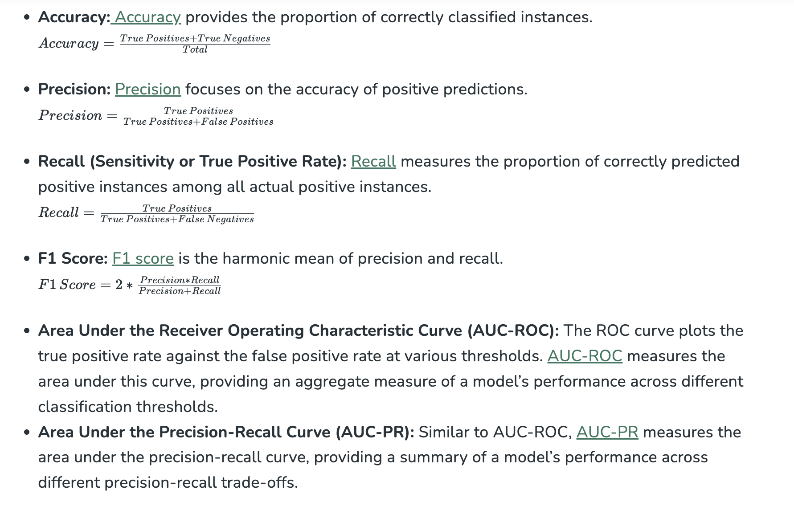

# Logistic Regression

## What is Logistic Regression?

Logistic regression is used for binary classification where we use sigmoid function, that takes input as independent variables and produces a probability value between 0 and 1.

For example, we have two classes Class 0 and Class 1 if the value of the logistic function for an input is greater than 0.5 (threshold value) then it belongs to Class 1 otherwise it belongs to Class 0. It’s referred to as regression because it is the extension of linear regression but is mainly used for classification problems.

**Key Points:**
- Logistic regression predicts the output of a categorical dependent variable. Therefore, the outcome must be a categorical or discrete value.
- It can be either Yes or No, 0 or 1, true or False, etc. but instead of giving the exact value as 0 and 1, it gives the probabilistic values which lie between 0 and 1.
- In Logistic regression, instead of fitting a regression line, we fit an “S” shaped logistic function, which predicts two maximum values (0 or 1).

## Logistic Function – Sigmoid Function

- The sigmoid function is a mathematical function used to map the predicted values to probabilities.
- It maps any real value into another value within a range of 0 and 1. The value of the logistic regression must be between 0 and 1, which cannot go beyond this limit, so it forms a curve like the “S” form.
- The S-form curve is called the Sigmoid function or the logistic function.
- In logistic regression, we use the concept of the threshold value, which defines the probability of either 0 or 1. Such as values above the threshold value tends to 1, and a value below the threshold values tends to 0.

## Types of Logistic Regression

On the basis of the categories, Logistic Regression can be classified into three types:

1. **Binomial:** In binomial Logistic regression, there can be only two possible types of the dependent variables, such as 0 or 1, Pass or Fail, etc.
2. **Multinomial:** In multinomial Logistic regression, there can be 3 or more possible unordered types of the dependent variable, such as “cat”, “dogs”, or “sheep”.
3. **Ordinal:** In ordinal Logistic regression, there can be 3 or more possible ordered types of dependent variables, such as “low”, “Medium”, or “High”.

## Assumptions of Logistic Regression

We will explore the assumptions of logistic regression as understanding these assumptions is important to ensure that we are using appropriate application of the model. The assumption include:

- Independent observations: Each observation is independent of the other. meaning there is no correlation between any input variables.
- Binary dependent variables: It takes the assumption that the dependent variable must be binary or dichotomous, meaning it can take only two values. For more than two categories SoftMax functions are used.
- Linearity relationship between independent variables and log odds: The relationship between the independent variables and the log odds of the dependent variable should be linear.
- No outliers: There should be no outliers in the dataset.
- Large sample size: The sample size is sufficiently large


## Terminologies involved in Logistic Regression

Here are some common terms involved in logistic regression:

- **Independent variables:** The input characteristics or predictor factors applied to the dependent variable’s predictions.
- **Dependent variable:** The target variable in a logistic regression model, which we are trying to predict.
- **Logistic function:** The formula used to represent how the independent and dependent variables relate to one another. The logistic function transforms the input variables into a probability value between 0 and 1, which represents the likelihood of the dependent variable being 1 or 0.
- **Odds:** It is the ratio of something occurring to something not occurring. it is different from probability as the probability is the ratio of something occurring to everything that could possibly occur.
- **Log-odds:** The log-odds, also known as the logit function, is the natural logarithm of the odds. In logistic regression, the log odds of the dependent variable are modeled as a linear combination of the independent variables and the intercept.
- **Coefficient:** The logistic regression model’s estimated parameters, show how the independent and dependent variables relate to one another.
- **Intercept:** A constant term in the logistic regression model, which represents the log odds when all independent variables are equal to zero.
- **Maximum likelihood estimation:** The method used to estimate the coefficients of the logistic regression model, which maximizes the likelihood of observing the data given the model.

## How does Logistic Regression work?

The logistic regression model transforms the linear regression function continuous value output into categorical value output using a sigmoid function, which maps any real-valued set of independent variables input into a value between 0 and 1. This function is known as the logistic function.

Let the independent input features be:



## Sigmoid Function



## Code Implementation for Logistic Regression

**Binomial Logistic regression:**
Target variable can have only 2 possible types: “0” or “1” which may represent “win” vs “loss”, “pass” vs “fail”, “dead” vs “alive”, etc., in this case, sigmoid functions are used, which is already discussed above.

Importing necessary libraries based on the requirement of model. This Python code shows how to use the breast cancer dataset to implement a Logistic Regression model for classification.


```
# import the necessary libraries
from sklearn.datasets import load_breast_cancer
from sklearn.linear_model import LogisticRegression
from sklearn.model_selection import train_test_split
from sklearn.metrics import accuracy_score

# load the breast cancer dataset
X, y = load_breast_cancer(return_X_y=True)

# split the train and test dataset
X_train, X_test,\
    y_train, y_test = train_test_split(X, y,
                                       test_size=0.20,
                                       random_state=23)
# LogisticRegression
clf = LogisticRegression(random_state=0)
clf.fit(X_train, y_train)

# Prediction
y_pred = clf.predict(X_test)

acc = accuracy_score(y_test, y_pred)
print("Logistic Regression model accuracy (in %):", acc*100)
```

**Output:**

```
Logistic Regression model accuracy (in %): 95.6140350877193
```

## Multinomial Logistic Regression:

Target variable can have 3 or more possible types which are not ordered (i.e. types have no quantitative significance) like “disease A” vs “disease B” vs “disease C”.

In this case, the softmax function is used in place of the sigmoid function. Softmax function for K classes will be:


In Multinomial Logistic Regression, the output variable can have more than two possible discrete outputs. Consider the Digit Dataset. 

```
from sklearn.model_selection import train_test_split
from sklearn import datasets, linear_model, metrics

# load the digit dataset
digits = datasets.load_digits()

# defining feature matrix(X) and response vector(y)
X = digits.data
y = digits.target

# splitting X and y into training and testing sets
X_train, X_test,\
    y_train, y_test = train_test_split(X, y,
                                       test_size=0.4,
                                       random_state=1)

# create logistic regression object
reg = linear_model.LogisticRegression()

# train the model using the training sets
reg.fit(X_train, y_train)

# making predictions on the testing set
y_pred = reg.predict(X_test)

# comparing actual response values (y_test)
# with predicted response values (y_pred)
print("Logistic Regression model accuracy(in %):",
      metrics.accuracy_score(y_test, y_pred)*100)
```

**Output:**

```
Logistic Regression model accuracy(in %): 96.52294853963839
```

## How to Evaluate Logistic Regression Model?

We can evaluate the logistic regression model using the following metrics:



## Precision-Recall Tradeoff in Logistic Regression Threshold Setting

Logistic regression becomes a classification technique only when a decision threshold is brought into the picture. The setting of the threshold value is a very important aspect of Logistic regression and is dependent on the classification problem itself.

The decision for the value of the threshold value is majorly affected by the values of precision and recall. Ideally, we want both precision and recall being 1, but this seldom is the case.

In the case of a Precision-Recall tradeoff, we use the following arguments to decide upon the threshold:

1. **Low Precision/High Recall:** In applications where we want to reduce the number of false negatives without necessarily reducing the number of false positives, we choose a decision value that has a low value of Precision or a high value of Recall. For example, in a cancer diagnosis application, we do not want any affected patient to be classified as not affected without giving much heed to if the patient is being wrongfully diagnosed with cancer. This is because the absence of cancer can be detected by further medical diseases, but the presence of the disease cannot be detected in an already rejected candidate.

2. **High Precision/Low Recall:** In applications where we want to reduce the number of false positives without necessarily reducing the number of false negatives, we choose a decision value that has a high value of Precision or a low value of Recall. For example, if we are classifying customers whether they will react positively or negatively to a personalized advertisement, we want to be absolutely sure that the customer will react positively to the advertisement because otherwise, a negative reaction can cause a loss of potential sales from the customer.

