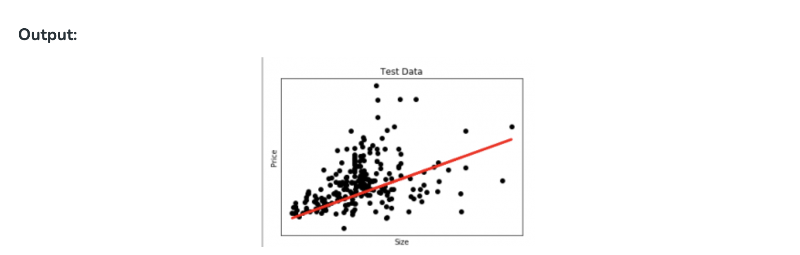
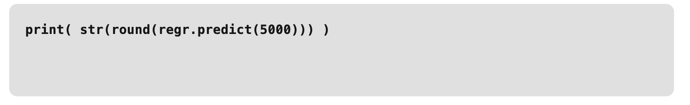

# Regression in machine learning
Regression, a statistical approach, dissects the relationship between dependent and independent variables, enabling predictions through various regression models.

The article delves into regression in machine learning, elucidating models, terminologies, types, and practical applications.

# What is Regression?

Regression is a statistical approach used to analyze the relationship between a dependent variable (target variable) and one or more independent variables (predictor variables). The objective is to determine the most suitable function that characterizes the connection between these variables.

It seeks to find the best-fitting model, which can be utilized to make predictions or draw conclusions.

## Regression in Machine Learning
It is a supervised machine learning technique, used to predict the value of the dependent variable for new, unseen data. It models the relationship between the input features and the target variable, allowing for the estimation or prediction of numerical values.

Regression analysis problem works with if output variable is a real or continuous value, such as “salary” or “weight”. Many different models can be used, the simplest is the linear regression. It tries to fit data with the best hyper-plane which goes through the points.

**Terminologies Related to the Regression Analysis in Machine Learning**

Terminologies Related to Regression Analysis:

- **Response Variable:** The primary factor to predict or understand in regression, also known as the dependent variable or target variable.
- **Predictor Variable:** Factors influencing the response variable, used to predict its values; also called independent variables.
- **Outliers:** Observations with significantly low or high values compared to others, potentially impacting results and best avoided.
- **Multicollinearity:** High correlation among independent variables, which can complicate the ranking of influential variables.
- **Underfitting and Overfitting:** Overfitting occurs when an algorithm performs well on training but poorly on testing, while underfitting indicates poor performance on both datasets.

**Regression Types**

There are two main types of regression:

- **Simple Regression**
    - Used to predict a continuous dependent variable based on a single independent variable.
    - Simple linear regression should be used when there is only a single independent variable.
- **Multiple Regression**
    - Used to predict a continuous dependent variable based on multiple independent variables.
    - Multiple linear regression should be used when there are multiple independent variables.
- **NonLinear Regression**
    - Relationship between the dependent variable and independent variable(s) follows a nonlinear pattern.
    - Provides flexibility in modeling a wide range of functional forms.

## Regression Algorithms

There are many different types of regression algorithms, but some of the most common include:

- **Linear Regression**
    - Linear regression is one of the simplest and most widely used statistical models. This assumes that there is a linear relationship between the independent and dependent variables. This means that the change in the dependent variable is proportional to the change in the independent variables.
- **Polynomial Regression**
    - Polynomial regression is used to model nonlinear relationships between the dependent variable and the independent variables. It adds polynomial terms to the linear regression model to capture more complex relationships.
- **Support Vector Regression (SVR)**
    - Support vector regression (SVR) is a type of regression algorithm that is based on the support vector machine (SVM) algorithm. SVM is a type of algorithm that is used for classification tasks, but it can also be used for regression tasks. SVR works by finding a hyperplane that minimizes the sum of the squared residuals between the predicted and actual values.
- **Decision Tree Regression**
    - Decision tree regression is a type of regression algorithm that builds a decision tree to predict the target value. A decision tree is a tree-like structure that consists of nodes and branches. Each node represents a decision, and each branch represents the outcome of that decision. The goal of decision tree regression is to build a tree that can accurately predict the target value for new data points.
- **Random Forest Regression**
    - Random forest regression is an ensemble method that combines multiple decision trees to predict the target value. Ensemble methods are a type of machine learning algorithm that combines multiple models to improve the performance of the overall model. Random forest regression works by building a large number of decision trees, each of which is trained on a different subset of the training data. The final prediction is made by averaging the predictions of all of the trees.


**Regularized Linear Regression Techniques**

- **Ridge Regression**
    - Ridge regression is a type of linear regression that is used to prevent overfitting. Overfitting occurs when the model learns the training data too well and is unable to generalize to new data.
- **Lasso regression**
    - Lasso regression is another type of linear regression that is used to prevent overfitting. It does this by adding a penalty term to the loss function that forces the model to use some weights and to set others to zero.


## Characteristics of Regression

Here are the characteristics of the regression:

- **Continuous Target Variable:** Regression deals with predicting continuous target variables that represent numerical values. Examples include predicting house prices, forecasting sales figures, or estimating patient recovery times.
- **Error Measurement:** Regression models are evaluated based on their ability to minimize the error between the predicted and actual values of the target variable. Common error metrics include mean absolute error (MAE), mean squared error (MSE), and root mean squared error (RMSE).
- **Model Complexity:** Regression models range from simple linear models to more complex nonlinear models. The choice of model complexity depends on the complexity of the relationship between the input features and the target variable.
- **Overfitting and Underfitting:** Regression models are susceptible to overfitting and underfitting.
- **Interpretability:** The interpretability of regression models varies depending on the algorithm used. Simple linear models are highly interpretable, while more complex models may be more difficult to interpret.


**Examples**

**Which of the following is a regression task?**

- Predicting age of a person
- Predicting nationality of a person
- Predicting whether stock price of a company will increase tomorrow
- Predicting whether a document is related to sighting of UFOs?


**Solution :** Predicting age of a person (because it is a real value, predicting nationality is categorical, whether stock price will increase is discrete-yes/no answer, predicting whether a document is related to UFO is again discrete- a yes/no answer).

## Regression Model Machine Learning

Let’s take an example of linear regression. We have a [Housing data set](https://vincentarelbundock.github.io/Rdatasets/csv/Ecdat/Housing.csv) and we want to predict the price of the house. Following is the python code for it.


```
# Python code to illustrate 
# regression using data set 
import matplotlib 
matplotlib.use('GTKAgg') 

import matplotlib.pyplot as plt 
import numpy as np 
from sklearn import datasets, linear_model 
import pandas as pd 

# Load CSV and columns 
df = pd.read_csv("Housing.csv") 

Y = df['price'] 
X = df['lotsize'] 

X=X.values.reshape(len(X),1) 
Y=Y.values.reshape(len(Y),1) 

# Split the data into training/testing sets 
X_train = X[:-250] 
X_test = X[-250:] 

# Split the targets into training/testing sets 
Y_train = Y[:-250] 
Y_test = Y[-250:] 

# Plot outputs 
plt.scatter(X_test, Y_test, color='black') 
plt.title('Test Data') 
plt.xlabel('Size') 
plt.ylabel('Price') 
plt.xticks(()) 
plt.yticks(()) 


# Create linear regression object 
regr = linear_model.LinearRegression() 

# Train the model using the training sets 
regr.fit(X_train, Y_train) 

# Plot outputs 
plt.plot(X_test, regr.predict(X_test), color='red',linewidth=3) 
plt.show() 
```




Here in this graph, we plot the test data. The red line indicates the best fit line for predicting the price.

To make an individual prediction using the linear regression model: 




## Regression Evaluation Metrics

Here are some most popular evaluation metrics for regression:

- **Mean Absolute Error (MAE):** The average absolute difference between the predicted and actual values of the target variable.
- **Mean Squared Error (MSE):** The average squared difference between the predicted and actual values of the target variable.
- **Root Mean Squared Error (RMSE):** The square root of the mean squared error.
- **Huber Loss:** A hybrid loss function that transitions from MAE to MSE for larger errors, providing balance between robustness and MSE’s sensitivity to outliers.
- Root Mean Square Logarithmic Error
- **R2 – Score:** Higher values indicate better fit, ranging from 0 to 1.

## Applications of Regression

- **Predicting prices:** For example, a regression model could be used to predict the price of a house based on its size, location, and other features.
- **Forecasting trends:** For example, a regression model could be used to forecast the sales of a product based on historical sales data and economic indicators.
- **Identifying risk factors:** For example, a regression model could be used to identify risk factors for heart disease based on patient data.
- **Making decisions:** For example, a regression model could be used to recommend which investment to buy based on market data.


**What is regression and classification?**
```
Regression are used to predict continuous values, while classification categorizes data. Both are supervised learning tasks in machine learning.
```

**What is simple regression in machine learning?**
```
Simple regression predicts a dependent variable based on one independent variable, forming a linear relationship.
```

**What are the different regression algorithm?**
```
Regression algorithms include linear regression, polynomial regression, support vector regression, and decision tree regression.
```

