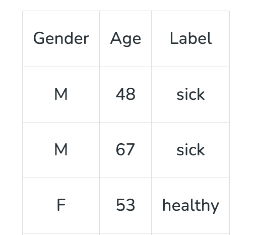

# **Supervised Learning**
## **What is Supervised Learning?**
Supervised learning is the machine learning task of learning a function that maps an input to an output based on example input-output pairs. The given data is labeled. Both classification and regression problems are supervised learning problems.

Supervised Machine Learning is where you have input variables (x) and an output variable (Y) and you use an algorithm to learn the mapping function from the input to the output **Y = f(X)**. The goal is to approximate the mapping function so well that when you have new input data (x) you can predict the output variables (Y) for that data.

- In supervised learning, sample labeled data are provided to the machine learning system for training, and the system then predicts the output based on the training data.
- The system uses labeled data to build a model that understands the datasets and learns about each one.
- After the training and processing are done, we test the model with sample data to see if it can accurately predict the output.
- The mapping of the input data to the output data is the objective of supervised learning.

**Example –** Consider the following data regarding patients entering a clinic . The data consists of the gender and age of the patients and each patient is labeled as “healthy” or “sick”.

## **Supervised learning algorithms are generally categorized into two main types: **

-  **Classification**
-  **Regression**

- **Regression:** Regression algorithms are used to predict a continuous numerical output. For example, a regression algorithm could be used to predict the price of a house based on its size, location, and other features.
- **Classification:** Classification algorithms are used to predict a categorical output. For example, a classification algorithm could be used to predict whether an email is spam or not.

There are many algorithms used in supervised learning, each suited to different types of problems. Some of the most commonly used supervised learning algorithms include:

1. **Linear Regression**
2. **Logistic Regression**
3. **Decision Trees**
4. **Support Vector Machines (SVM)**
5. **k-Nearest Neighbors (k-NN)**
6. **Naive Bayes**
7. **Random Forest (Bagging Algorithm)**
8. **Boosting Algorithms**
