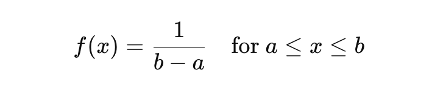
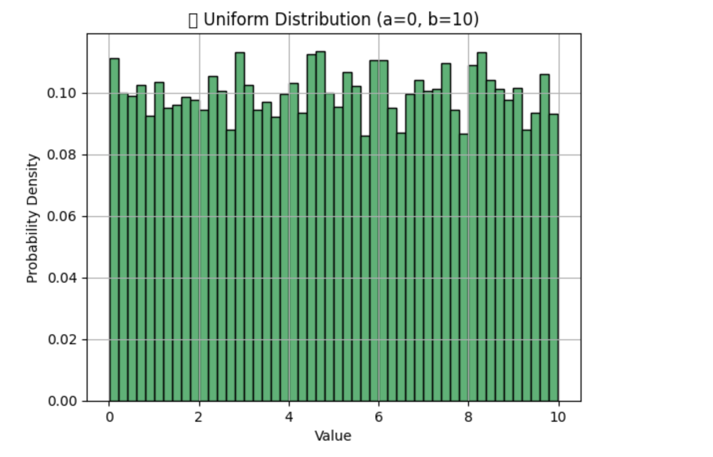

# 📐 What is a Uniform Distribution?
A Uniform Distribution is a probability distribution where all outcomes are equally likely within a certain interval.

Used to describe probability where every event has equal chances of occuring.

## ✅ Types:
1. Discrete Uniform Distribution
    - Limited number of distinct, equally likely outcomes.
    - 🎲 Example: Rolling a fair die → 1, 2, 3, 4, 5, 6.

2. Continuous Uniform Distribution
    - Infinite possible values within a continuous range.
    - 📏 Example: Random float from 0 to 1.

# 📊 Formula (Continuous):


Where:
 - a = lower bound
 - b = upper bound
 - Every value between a and b is equally likely

 # ✅ Real-World Use Cases in AI/ML
 1. Weight Initialization in Neural Networks
    - ⚙️ Frameworks like TensorFlow & PyTorch often use uniform distribution to initialize weights.
    - 🎯 Goal: Avoid starting too high or too low → speeds up convergence.

Example:

```
np.random.uniform(low=-0.05, high=0.05, size=(3, 3))
```

2. Random Sampling / Bootstrapping

- 📊 Uniform distribution is used to randomly select samples for:
    - Cross-validation
    - Bagging algorithms (like Random Forests)
    - Data augmentation

3. Hyperparameter Search
    - 🎯 Used in random search for tuning hyperparameters.
    - For example, selecting learning rates uniformly between 0.001 and 0.1.

Example

```
import numpy as np
import matplotlib.pyplot as plt

a, b = 0, 10
data = np.random.uniform(a, b, 10000)

plt.hist(data, bins=50, color='mediumseagreen', edgecolor='black', density=True)
plt.title(f"📊 Uniform Distribution (a={a}, b={b})")
plt.xlabel("Value")
plt.ylabel("Probability Density")
plt.grid(True)
plt.show()
```



