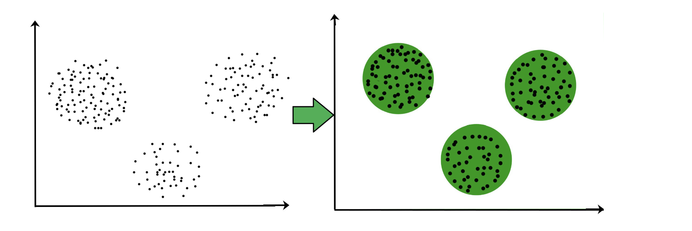
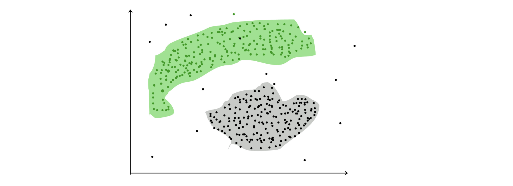
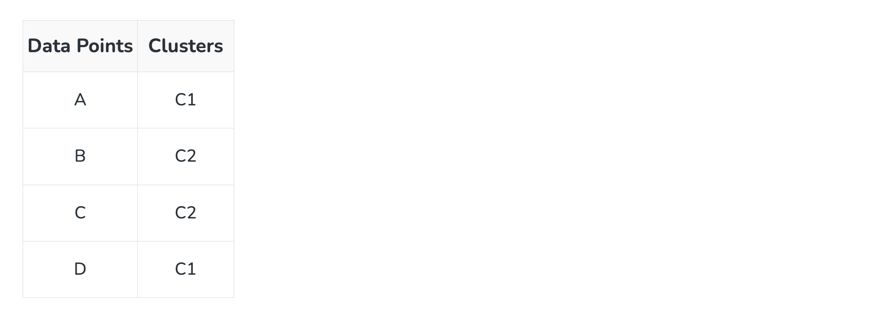
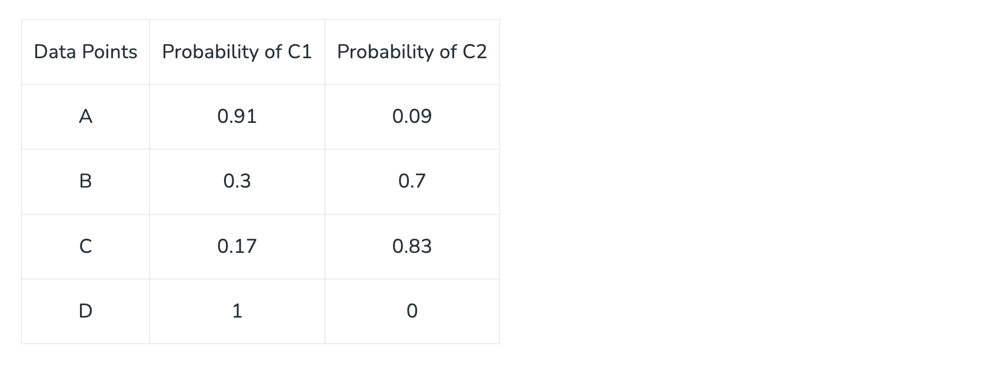

# Clustering in Machine Learning

In real world, not every data we work upon has a target variable. This kind of data cannot be analyzed using supervised learning algorithms. We need the help of unsupervised algorithms. One of the most popular type of analysis under unsupervised learning is Cluster analysis. When the goal is to group similar data points in a dataset, then we use cluster analysis. In practical situations, we can use cluster analysis for customer segmentation for targeted advertisements, or in medical imaging to find unknown or new infected areas and many more use cases.


## What is Clustering ?
The task of grouping data points based on their similarity with each other is called Clustering or Cluster Analysis. This method is defined under the branch of Unsupervised Learning, which aims at gaining insights from unlabelled data points, that is, unlike supervised learning we don’t have a target variable.

Clustering aims at forming groups of homogeneous data points from a heterogeneous dataset. It evaluates the similarity based on a metric like Euclidean distance, Cosine similarity, Manhattan distance, etc. and then group the points with highest similarity score together.

For Example, In the graph given below, we can clearly see that there are 3 circular clusters forming on the basis of distance.




Now it is not necessary that the clusters formed must be circular in shape. The shape of clusters can be arbitrary. There are many algortihms that work well with detecting arbitrary shaped clusters. 

For example, In the below given graph we can see that the clusters formed are not circular in shape.



## Types of Clustering
Broadly speaking, there are 2 types of clustering that can be performed to group similar data points:

- **Hard Clustering:** In this type of clustering, each data point belongs to a cluster completely or not. For example, Let’s say there are 4 data point and we have to cluster them into 2 clusters. So each data point will either belong to cluster 1 or cluster 2.



- **Soft Clustering:** In this type of clustering, instead of assigning each data point into a separate cluster, a probability or likelihood of that point being that cluster is evaluated. For example, Let’s say there are 4 data point and we have to cluster them into 2 clusters. So we will be evaluating a probability of a data point belonging to both clusters. This probability is calculated for all data points.



## Uses of Clustering
Now before we begin with types of clustering algorithms, we will go through the use cases of Clustering algorithms. Clustering algorithms are majorly used for:

- **Market Segmentation –** Businesses use clustering to group their customers and use targeted advertisements to attract more audience.
- **Market Basket Analysis –** Shop owners analyze their sales and figure out which items are majorly bought together by the customers. For example, In USA, according to a study diapers and beers were usually bought together by fathers.
- **Social Network Analysis –** Social media sites use your data to understand your browsing behaviour and provide you with targeted friend recommendations or content recommendations.
- **Medical Imaging –** Doctors use Clustering to find out diseased areas in diagnostic images like X-rays.
- **Anomaly Detection –** To find outliers in a stream of real-time dataset or forecasting fraudulent transactions we can use clustering to identify them.
- **Simplify working with large datasets –** Each cluster is given a cluster ID after clustering is complete. Now, you may reduce a feature set’s whole feature set into its cluster ID. Clustering is effective when it can represent a complicated case with a straightforward cluster ID. Using the same principle, clustering data can make complex datasets simpler.


There are many more use cases for clustering but there are some of the major and common use cases of clustering. Moving forward we will be discussing Clustering Algorithms that will help you perform the above tasks.

## Types of Clustering Algorithms

At the surface level, clustering helps in the analysis of unstructured data. Graphing, the shortest distance, and the density of the data points are a few of the elements that influence cluster formation. Clustering is the process of determining how related the objects are based on a metric called the similarity measure. Similarity metrics are easier to locate in smaller sets of features. It gets harder to create similarity measures as the number of features increases. Depending on the type of clustering algorithm being utilized in data mining, several techniques are employed to group the data from the datasets. In this part, the clustering techniques are described. Various types of clustering algorithms are:


1. **Centroid-based Clustering** (Partitioning methods)
2. **Density-based Clustering** (Model-based methods)
3. **Connectivity-based Clustering** (Hierarchical clustering)
4. **Distribution-based Clustering**


## 1. Centroid-based Clustering (Partitioning methods)
Partitioning methods are the most easiest clustering algorithms. They group data points on the basis of their closeness. Generally, the similarity measure chosen for these algorithms are Euclidian distance, Manhattan Distance or Minkowski Distance. The datasets are separated into a predetermined number of clusters, and each cluster is referenced by a vector of values. When compared to the vector value, the input data variable shows no difference and joins the cluster. 

The primary drawback for these algorithms is the requirement that we establish the number of clusters, “k,” either intuitively or scientifically (using the Elbow Method) before any clustering machine learning system starts allocating the data points. Despite this, it is still the most popular type of clustering. K-means and K-medoids clustering are some examples of this type clustering.

## 2. Density-based Clustering (Model-based methods)
Density-based clustering, a model-based method, finds groups based on the density of data points. Contrary to centroid-based clustering, which requires that the number of clusters be predefined and is sensitive to initialization, density-based clustering determines the number of clusters automatically and is less susceptible to beginning positions. They are great at handling clusters of different sizes and forms, making them ideally suited for datasets with irregularly shaped or overlapping clusters. These methods manage both dense and sparse data regions by focusing on local density and can distinguish clusters with a variety of morphologies. 

In contrast, centroid-based grouping, like k-means, has trouble finding arbitrary shaped clusters. Due to its preset number of cluster requirements and extreme sensitivity to the initial positioning of centroids, the outcomes can vary. Furthermore, the tendency of centroid-based approaches to produce spherical or convex clusters restricts their capacity to handle complicated or irregularly shaped clusters. In conclusion, density-based clustering overcomes the drawbacks of centroid-based techniques by autonomously choosing cluster sizes, being resilient to initialization, and successfully capturing clusters of various sizes and forms. The most popular density-based clustering algorithm is DBSCAN.

## 3. Connectivity-based Clustering (Hierarchical clustering)
A method for assembling related data points into hierarchical clusters is called hierarchical clustering. Each data point is initially taken into account as a separate cluster, which is subsequently combined with the clusters that are the most similar to form one large cluster that contains all of the data points.

Think about how you may arrange a collection of items based on how similar they are. Each object begins as its own cluster at the base of the tree when using hierarchical clustering, which creates a dendrogram, a tree-like structure. The closest pairings of clusters are then combined into larger clusters after the algorithm examines how similar the objects are to one another. When every object is in one cluster at the top of the tree, the merging process has finished. Exploring various granularity levels is one of the fun things about hierarchical clustering. To obtain a given number of clusters, you can select to cut the dendrogram at a particular height. The more similar two objects are within a cluster, the closer they are. It’s comparable to classifying items according to their family trees, where the nearest relatives are clustered together and the wider branches signify more general connections. There are 2 approaches for Hierarchical clustering:

- **Divisive Clustering:** It follows a top-down approach, here we consider all data points to be part one big cluster and then this cluster is divide into smaller groups.
- **Agglomerative Clustering:** It follows a bottom-up approach, here we consider all data points to be part of individual clusters and then these clusters are clubbed together to make one big cluster with all data points. 

## 4. Distribution-based Clustering
Using distribution-based clustering, data points are generated and organized according to their propensity to fall into the same probability distribution (such as a Gaussian, binomial, or other) within the data. The data elements are grouped using a probability-based distribution that is based on statistical distributions. Included are data objects that have a higher likelihood of being in the cluster. A data point is less likely to be included in a cluster the further it is from the cluster’s central point, which exists in every cluster.

A notable drawback of density and boundary-based approaches is the need to specify the clusters a priori for some algorithms, and primarily the definition of the cluster form for the bulk of algorithms. There must be at least one tuning or hyper-parameter selected, and while doing so should be simple, getting it wrong could have unanticipated repercussions. Distribution-based clustering has a definite advantage over proximity and centroid-based clustering approaches in terms of flexibility, accuracy, and cluster structure. The key issue is that, in order to avoid overfitting, many clustering methods only work with simulated or manufactured data, or when the bulk of the data points certainly belong to a preset distribution. The most popular distribution-based clustering algorithm is Gaussian Mixture Model.


# Applications of Clustering in different fields:

1. **Marketing:** It can be used to characterize & discover customer segments for marketing purposes.
2. **Biology:** It can be used for classification among different species of plants and animals.
3. **Libraries:** It is used in clustering different books on the basis of topics and information.
4. **Insurance:** It is used to acknowledge the customers, their policies and identifying the frauds.
5. **City Planning:** It is used to make groups of houses and to study their values based on their geographical locations and other factors present. 
6. **Earthquake studies:** By learning the earthquake-affected areas we can determine the dangerous zones. 
7. **Image Processing:** Clustering can be used to group similar images together, classify images based on content, and identify patterns in image data.
8. **Genetics:** Clustering is used to group genes that have similar expression patterns and identify gene networks that work together in biological processes.
9. **Finance:** Clustering is used to identify market segments based on customer behavior, identify patterns in stock market data, and analyze risk in investment portfolios.
10. **Customer Service:** Clustering is used to group customer inquiries and complaints into categories, identify common issues, and develop targeted solutions.
11. **Manufacturing:** Clustering is used to group similar products together, optimize production processes, and identify defects in manufacturing processes.
12. **Medical diagnosis:** Clustering is used to group patients with similar symptoms or diseases, which helps in making accurate diagnoses and identifying effective treatments.
13. **Fraud detection:** Clustering is used to identify suspicious patterns or anomalies in financial transactions, which can help in detecting fraud or other financial crimes.
14. **Traffic analysis:** Clustering is used to group similar patterns of traffic data, such as peak hours, routes, and speeds, which can help in improving transportation planning and infrastructure.
15. **Social network analysis:** Clustering is used to identify communities or groups within social networks, which can help in understanding social behavior, influence, and trends.
16. **Cybersecurity:** Clustering is used to group similar patterns of network traffic or system behavior, which can help in detecting and preventing cyberattacks.
17. **Climate analysis:** Clustering is used to group similar patterns of climate data, such as temperature, precipitation, and wind, which can help in understanding climate change and its impact on the environment.
18. **Sports analysis:** Clustering is used to group similar patterns of player or team performance data, which can help in analyzing player or team strengths and weaknesses and making strategic decisions.
19. **Crime analysis:** Clustering is used to group similar patterns of crime data, such as location, time, and type, which can help in identifying crime hotspots, predicting future crime trends, and improving crime prevention strategies.


**The top 10 clustering algorithms are:**

1. K-means Clustering
2. Hierarchical Clustering
3. DBSCAN (Density-Based Spatial Clustering of Applications with Noise)
4. Gaussian Mixture Models (GMM)
5. Agglomerative Clustering
6. Spectral Clustering
7. Mean Shift Clustering
8. Affinity Propagation
9. OPTICS (Ordering Points To Identify the Clustering Structure)
10. Birch (Balanced Iterative Reducing and Clustering using Hierarchies)


## What is the difference between clustering and classification?

```
The main difference between clustering and classification is that, classification is a supervised learning algorithm and clustering is an unsupervised learning algorithm. That is, we apply clustering to those datasets that without a target variable. 
```

## What are the advantages of clustering analysis?

```
Data can be organised into meaningful groups using the strong analytical tool of cluster analysis. You can use it to pinpoint segments, find hidden patterns, and improve decisions.
```

## Which is the fastest clustering method?

```
K-means clustering is often considered the fastest clustering method due to its simplicity and computational efficiency. It iteratively assigns data points to the nearest cluster centroid, making it suitable for large datasets with low dimensionality and a moderate number of clusters.
```

## What are the limitations of clustering?

```
Limitations of clustering include sensitivity to initial conditions, dependence on the choice of parameters, difficulty in determining the optimal number of clusters, and challenges with handling high-dimensional or noisy data.
```

## What does the quality of result of clustering depend on?

```
The quality of clustering results depends on factors such as the choice of algorithm, distance metric, number of clusters, initialization method, data preprocessing techniques, cluster evaluation metrics, and domain knowledge. These elements collectively influence the effectiveness and accuracy of the clustering outcome.
```

