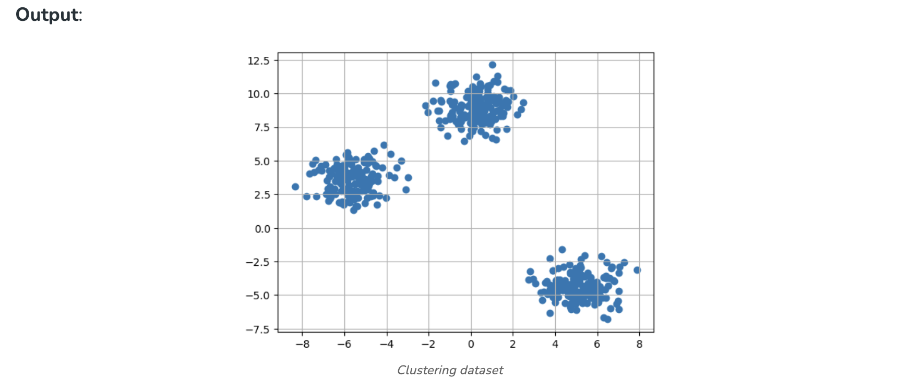
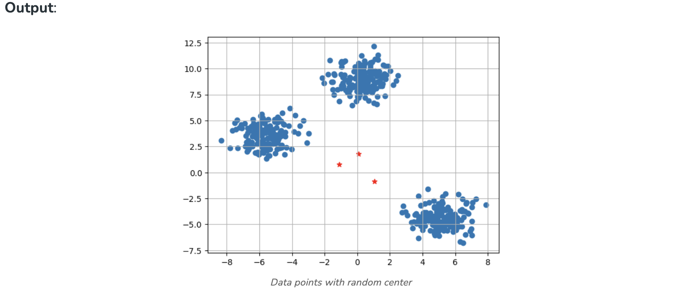
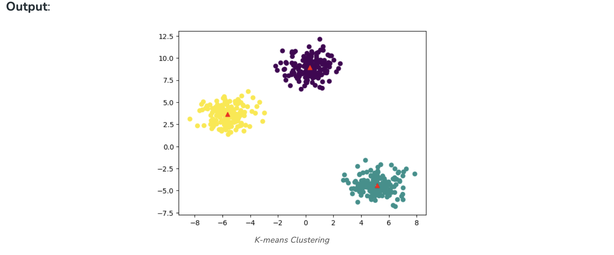
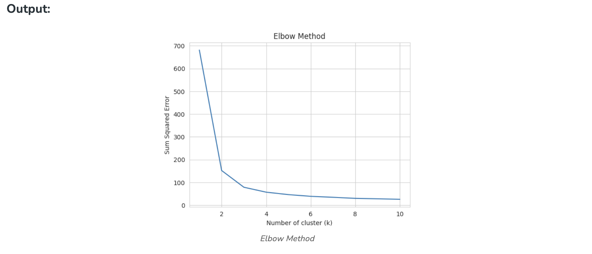
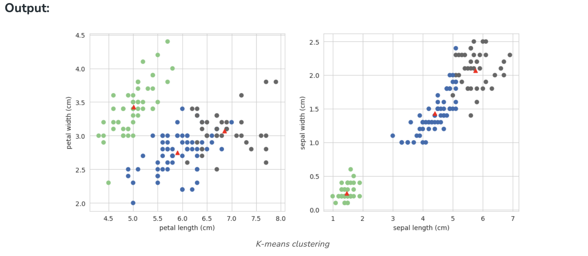

# K means Clustering – Introduction

K-Means Clustering is an Unsupervised Machine Learning algorithm, which groups the unlabeled dataset into different clusters. 

## What is K-means Clustering?
Unsupervised Machine Learning is the process of teaching a computer to use unlabeled, unclassified data and enabling the algorithm to operate on that data without supervision. Without any previous data training, the machine’s job in this case is to organize unsorted data according to parallels, patterns, and variations. 

K means clustering, assigns data points to one of the K clusters depending on their distance from the center of the clusters. It starts by randomly assigning the clusters centroid in the space. Then each data point assign to one of the cluster based on its distance from centroid of the cluster. After assigning each point to one of the cluster, new cluster centroids are assigned. This process runs iteratively until it finds good cluster. In the analysis we assume that number of cluster is given in advanced and we have to put points in one of the group.

In some cases, K is not clearly defined, and we have to think about the optimal number of K. K Means clustering performs best data is well separated. When data points overlapped this clustering is not suitable. K Means is faster as compare to other clustering technique. It provides strong coupling between the data points. K Means cluster do not provide clear information regarding the quality of clusters. Different initial assignment of cluster centroid may lead to different clusters. Also, K Means algorithm is sensitive to noise. It may have stuck in local minima.

## What is the objective of k-means clustering?
The goal of clustering is to divide the population or set of data points into a number of groups so that the data points within each group are more comparable to one another and different from the data points within the other groups. It is essentially a grouping of things based on how similar and different they are to one another. 

## How k-means clustering works?
We are given a data set of items, with certain features, and values for these features (like a vector). The task is to categorize those items into groups. To achieve this, we will use the K-means algorithm, an unsupervised learning algorithm. ‘K’ in the name of the algorithm represents the number of groups/clusters we want to classify our items into.

(It will help if you think of items as points in an n-dimensional space). The algorithm will categorize the items into k groups or clusters of similarity. To calculate that similarity, we will use the Euclidean distance as a measurement.

The algorithm works as follows:  

1. First, we randomly initialize k points, called means or cluster centroids.
2. We categorize each item to its closest mean, and we update the mean’s coordinates, which are the averages of the items categorized in that cluster so far.
3. We repeat the process for a given number of iterations and at the end, we have our clusters.


The “points” mentioned above are called means because they are the mean values of the items categorized in them. To initialize these means, we have a lot of options. An intuitive method is to initialize the means at random items in the data set. Another method is to initialize the means at random values between the boundaries of the data set (if for a feature x, the items have values in [0,3], we will initialize the means with values for x at [0,3]).

The above algorithm in pseudocode is as follows:

```
Initialize k means with random values
--> For a given number of iterations:
    
    --> Iterate through items:
    
        --> Find the mean closest to the item by calculating 
        the euclidean distance of the item with each of the means
        
        --> Assign item to mean
        
        --> Update mean by shifting it to the average of the items in that cluster
```

## Implementation of K-Means Clustering in Python

**Example 1:**

**Import the necessary Libraries**

We are importing Numpy for statistical computations, Matplotlib to plot the graph, and make_blobs from sklearn.datasets.

```
import numpy as np
import matplotlib.pyplot as plt
from sklearn.datasets import make_blobs
```

**Create the custom dataset with make_blobs and plot it**

```
X,y = make_blobs(n_samples = 500,n_features = 2,centers = 3,random_state = 23)

fig = plt.figure(0)
plt.grid(True)
plt.scatter(X[:,0],X[:,1])
plt.show()
```



**Initialize the random centroids**

The code initializes three clusters for K-means clustering. It sets a random seed and generates random cluster centers within a specified range, and creates an empty list of points for each cluster.

```
k = 3

clusters = {}
np.random.seed(23)

for idx in range(k):
    center = 2*(2*np.random.random((X.shape[1],))-1)
    points = []
    cluster = {
        'center' : center,
        'points' : []
    }
    
    clusters[idx] = cluster
    
clusters
```

**Output:**

```
{0: {'center': array([0.06919154, 1.78785042]), 'points': []},
 1: {'center': array([ 1.06183904, -0.87041662]), 'points': []},
 2: {'center': array([-1.11581855,  0.74488834]), 'points': []}}
 ```

 **Plot the random initialize center with data points**

 ```
 plt.scatter(X[:,0],X[:,1])
plt.grid(True)
for i in clusters:
    center = clusters[i]['center']
    plt.scatter(center[0],center[1],marker = '*',c = 'red')
plt.show()
```



The plot displays a scatter plot of data points (X[:,0], X[:,1]) with grid lines. It also marks the initial cluster centers (red stars) generated for K-means clustering.

**Define Euclidean distance**

```
def distance(p1,p2):
    return np.sqrt(np.sum((p1-p2)**2))
```

**Create the function to Assign and Update the cluster center**

The E-step assigns data points to the nearest cluster center, and the M-step updates cluster centers based on the mean of assigned points in K-means clustering.

```
#Implementing E step 
def assign_clusters(X, clusters):
    for idx in range(X.shape[0]):
        dist = []
        
        curr_x = X[idx]
        
        for i in range(k):
            dis = distance(curr_x,clusters[i]['center'])
            dist.append(dis)
        curr_cluster = np.argmin(dist)
        clusters[curr_cluster]['points'].append(curr_x)
    return clusters
        
#Implementing the M-Step
def update_clusters(X, clusters):
    for i in range(k):
        points = np.array(clusters[i]['points'])
        if points.shape[0] > 0:
            new_center = points.mean(axis =0)
            clusters[i]['center'] = new_center
            
            clusters[i]['points'] = []
    return clusters
```

**Step 7: Create the function to Predict the cluster for the datapoints**

```
def pred_cluster(X, clusters):
    pred = []
    for i in range(X.shape[0]):
        dist = []
        for j in range(k):
            dist.append(distance(X[i],clusters[j]['center']))
        pred.append(np.argmin(dist))
    return pred   
```

**Assign, Update, and predict the cluster center**

```
clusters = assign_clusters(X,clusters)
clusters = update_clusters(X,clusters)
pred = pred_cluster(X,clusters)
```

**Plot the data points with their predicted cluster center**

```
plt.scatter(X[:,0],X[:,1],c = pred)
for i in clusters:
    center = clusters[i]['center']
    plt.scatter(center[0],center[1],marker = '^',c = 'red')
plt.show()
```




**Example 2**

**Import the necessary libraries**

```
import pandas as pd
import numpy as np
import seaborn as sns
import matplotlib.pyplot as plt
import matplotlib.cm as cm
from sklearn.datasets import load_iris
from sklearn.cluster import KMeans
```

**Load the Dataset**

```
X, y = load_iris(return_X_y=True)
```

**Elbow Method**
Finding the ideal number of groups to divide the data into is a basic stage in any unsupervised algorithm. One of the most common techniques for figuring out this ideal value of k is the elbow approach.

```
#Find optimum number of cluster
sse = [] #SUM OF SQUARED ERROR
for k in range(1,11):
    km = KMeans(n_clusters=k, random_state=2)
    km.fit(X)
    sse.append(km.inertia_)
```

**Plot the Elbow graph to find the optimum number of cluster**

```
sns.set_style("whitegrid")
g=sns.lineplot(x=range(1,11), y=sse)

g.set(xlabel ="Number of cluster (k)", 
      ylabel = "Sum Squared Error", 
      title ='Elbow Method')

plt.show()
```



From the above graph, we can observe that at k=2 and k=3 elbow-like situation. So, we are considering K=3

**Build the Kmeans clustering model**

```
kmeans = KMeans(n_clusters = 3, random_state = 2)
kmeans.fit(X)
```

**Output:**

```
KMeans
KMeans(n_clusters=3, random_state=2)
```

**Find the cluster center**

```
kmeans.cluster_centers_
```

**Output:**

```
array([[5.006     , 3.428     , 1.462     , 0.246     ],
       [5.9016129 , 2.7483871 , 4.39354839, 1.43387097],
       [6.85      , 3.07368421, 5.74210526, 2.07105263]])
```

**Predict the cluster group:**

```
pred = kmeans.fit_predict(X)
pred
```

**Output:**

```
array([0, 0, 0, 0, 0, 0, 0, 0, 0, 0, 0, 0, 0, 0, 0, 0, 0, 0, 0, 0, 0, 0,
       0, 0, 0, 0, 0, 0, 0, 0, 0, 0, 0, 0, 0, 0, 0, 0, 0, 0, 0, 0, 0, 0,
       0, 0, 0, 0, 0, 0, 1, 1, 2, 1, 1, 1, 1, 1, 1, 1, 1, 1, 1, 1, 1, 1,
       1, 1, 1, 1, 1, 1, 1, 1, 1, 1, 1, 2, 1, 1, 1, 1, 1, 1, 1, 1, 1, 1,
       1, 1, 1, 1, 1, 1, 1, 1, 1, 1, 1, 1, 2, 1, 2, 2, 2, 2, 1, 2, 2, 2,
       2, 2, 2, 1, 1, 2, 2, 2, 2, 1, 2, 1, 2, 1, 2, 2, 1, 1, 2, 2, 2, 2,
       2, 1, 2, 2, 2, 2, 1, 2, 2, 2, 1, 2, 2, 2, 1, 2, 2, 1], dtype=int32)
```

**Plot the cluster center with data points**

```
plt.figure(figsize=(12,5))
plt.subplot(1,2,1)
plt.scatter(X[:,0],X[:,1],c = pred, cmap=cm.Accent)
plt.grid(True)
for center in kmeans.cluster_centers_:
    center = center[:2]
    plt.scatter(center[0],center[1],marker = '^',c = 'red')
plt.xlabel("petal length (cm)")
plt.ylabel("petal width (cm)")
    
plt.subplot(1,2,2)   
plt.scatter(X[:,2],X[:,3],c = pred, cmap=cm.Accent)
plt.grid(True)
for center in kmeans.cluster_centers_:
    center = center[2:4]
    plt.scatter(center[0],center[1],marker = '^',c = 'red')
plt.xlabel("sepal length (cm)")
plt.ylabel("sepal width (cm)")
plt.show()
```



The subplot on the left display petal length vs. petal width with data points colored by clusters, and red markers indicate K-means cluster centers. The subplot on the right show sepal length vs. sepal width similarly.


## Conclusion
In conclusion, K-means clustering is a powerful unsupervised machine learning algorithm for grouping unlabeled datasets. Its objective is to divide data into clusters, making similar data points part of the same group. The algorithm initializes cluster centroids and iteratively assigns data points to the nearest centroid, updating centroids based on the mean of points in each cluster.


## What is k-means clustering for data analysis?

```
K-means is a partitioning method that divides a dataset into ‘k’ distinct, non-overlapping subsets (clusters) based on similarity, aiming to minimize the variance within each cluster.
```

## What is an example of k-means in real life?

```
Customer segmentation in marketing, where k-means groups customers based on purchasing behavior, allowing businesses to tailor marketing strategies for different segments.
```

## What type of data is k-means clustering model?

```
K-means works well with numerical data, where the concept of distance between data points is meaningful. It’s commonly applied to continuous variables.
```

## Is K-means used for prediction?

```
K-means is primarily used for clustering and grouping similar data points. It does not predict labels for new data; it assigns them to existing clusters based on similarity.
```

## What is the objective of k-means clustering?

```
The objective is to partition data into ‘k’ clusters, minimizing the intra-cluster variance. It seeks to form groups where data points within each cluster are more similar to each other than to those in other clusters.
```


