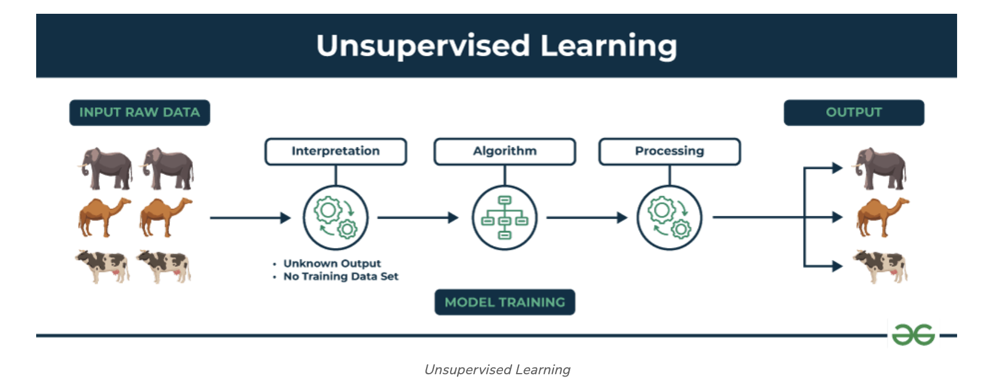
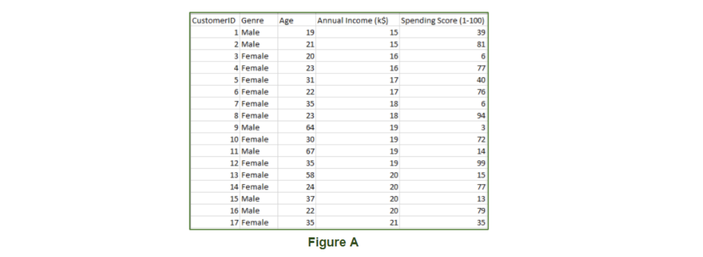

# Unsupervised learning

## What is Unsupervised Learning?

Unsupervised learning is a branch of machine learning that deals with unlabeled data. Unlike supervised learning, where the data is labeled with a specific category or outcome, unsupervised learning algorithms are tasked with finding patterns and relationships within the data without any prior knowledge of the data’s meaning. This makes unsupervised learning a powerful tool for exploratory data analysis, where the goal is to understand the underlying structure of the data.

Unsupervised machine learning analyzes and clusters unlabeled datasets using machine learning algorithms. These algorithms find hidden patterns and data without any human intervention, i.e., we don’t give output to our model. The training model has only input parameter values and discovers the groups or patterns on its own.

## How does unsupervised learning work?

Unsupervised learning works by analyzing unlabeled data to identify patterns and relationships. The data is not labeled with any predefined categories or outcomes, so the algorithm must find these patterns and relationships on its own. This can be a challenging task, but it can also be very rewarding, as it can reveal insights into the data that would not be apparent from a labeled dataset.

Data-set in Figure A is Mall data that contains information about its clients that subscribe to them. Once subscribed they are provided a membership card and the mall has complete information about the customer and his/her every purchase. Now using this data and unsupervised learning techniques, the mall can easily group clients based on the parameters we are feeding in. 

The input to the unsupervised learning models is as follows: 

- **Unstructured data:** May contain noisy(meaningless) data, missing values, or unknown data
- **Unlabeled data:** Data only contains a value for input parameters, there is no targeted value(output). It is easy to collect as compared to the labeled one in the Supervised approach.

## Unsupervised Learning Algorithms
There are mainly 3 types of Algorithms which are used for Unsupervised dataset.

- Clustering
- Association Rule Learning
- Dimensionality Reduction
