# What is Milvus?
- Milvus is a high-performance, highly scalable vector database that runs efficiently across a wide range of environments, from a laptop to large-scale distributed systems. It is available as both open-source software and a cloud service.
- Milvus is an open-source project under LF AI & Data Foundation distributed under the Apache 2.0 license.
- Core contributors include professionals from Zilliz, ARM, NVIDIA, AMD, Intel, Meta, IBM, Salesforce, Alibaba, and Microsoft.

# Unstructured Data, Embeddings, and Milvus
- Unstructured data, such as text, images, and audio, varies in format and carries rich underlying semantics, making it challenging to analyze.
- To manage this complexity, embeddings are used to convert unstructured data into numerical vectors that capture its essential characteristics.
- These vectors are then stored in a vector database, enabling fast and scalable searches and analytics.
- Milvus offers robust data modeling capabilities, enabling you to organize your unstructured or multi-modal data into structured collections.
- It supports a wide range of data types for different attribute modeling, including common numerical and character types, various vector types, arrays, sets, and JSON, saving you from the effort of maintaining multiple database systems.


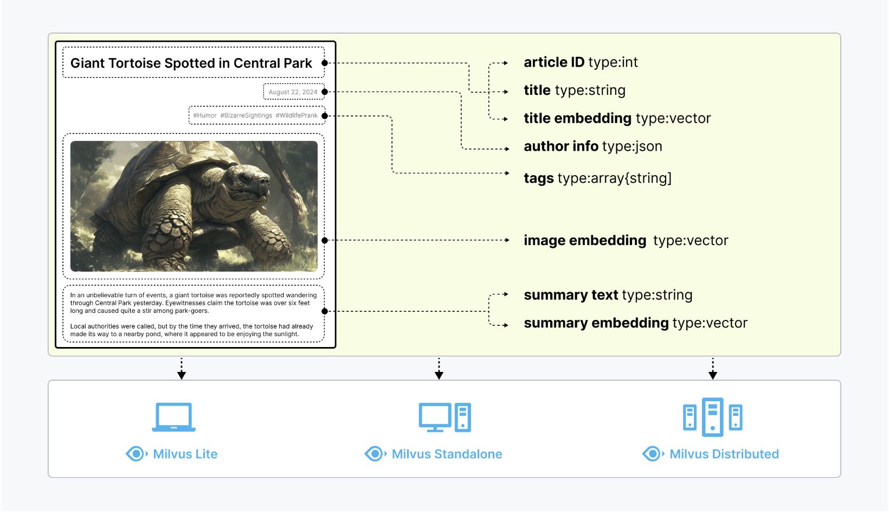

Milvus offers three deployment modes, covering a wide range of data scales—from local prototyping in Jupyter Notebooks to massive Kubernetes clusters managing tens of billions of vectors:

## Milvus Lite
- Milvus Lite is a Python library that can be easily integrated into your applications. As a lightweight version of Milvus, it’s ideal for quick prototyping in Jupyter Notebooks or running on edge devices with limited resources.

## Milvus Standalone
- Milvus Standalone is a single-machine server deployment, with all components bundled into a single Docker image for convenient deployment.

## Milvus Distributed
- Milvus Distributed can be deployed on Kubernetes clusters, featuring a cloud-native architecture designed for billion-scale or even larger scenarios.

- **Milvus Lite** is recommended for smaller datasets, up to a few million vectors.
- **Milvus Standalone** is suitable for medium-sized datasets, scaling up to 100 million vectors.
- **Milvus Distributed** is designed for large-scale deployments, capable of handling datasets from 100 million up to tens of billions of vectors.

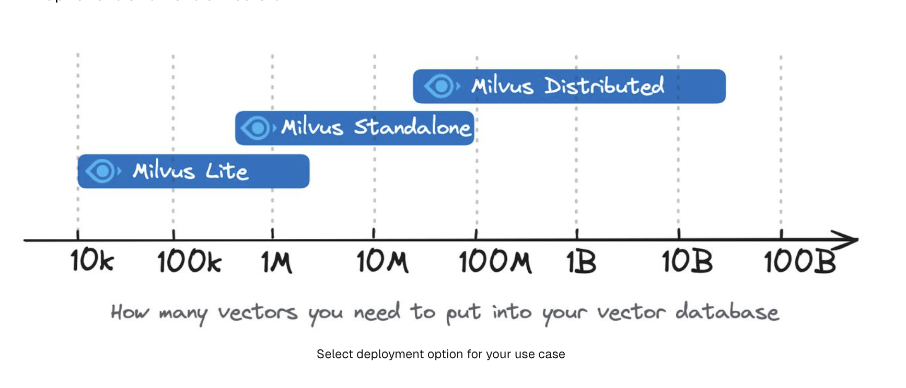

# Indexes supported in Milvus

Milvus supports various index types, which are categorized by the type of vector embeddings they handle:
**floating-point embeddings** (also known as floating point vectors or dense vectors), **binary embeddings** (also known as binary vectors), and **sparse embeddings**  (also known as sparse vectors).

# Floating-point embeddings

## Indexes for floating-point embeddings
For 128-dimensional floating-point embeddings (vectors), the storage they take up is 128 * the size of float = 512 bytes. And the distance metrics used for float-point embeddings are Euclidean distance **(L2)** and Inner product **(IP)**.

These types of indexes include for CPU-based ANN searches.:

- **FLAT**
- **IVF_FLAT**
- **IVF_PQ**
- **IVF_SQ8**
- **HNSW**
- **HNSW_SQ**
- **HNSW_PQ**
- **HNSW_PRQ**
- **SCANN**

## Indexes for binary embeddings
For 128-dimensional binary embeddings, the storage they take up is 128 / 8 = 16 bytes. And the distance metrics used for binary embeddings are **JACCARD** and **HAMMING**.

This type of indexes include **BIN_FLAT** and **BIN_IVF_FLAT**.

## Indexes for sparse embeddings
Indexes for sparse embeddings support the **IP** and **BM25** (for full-text search) metrics only.

Index type supported for sparse embeddings: **SPARSE_INVERTED_INDEX**.

# GPU Index
Milvus supports various GPU index types to accelerate search performance and efficiency, especially in high-throughput, and high-recall scenarios. 

- **GPU_CAGRA**
- **GPU_IVF_FLAT**
- **GPU_IVF_PQ**
- **GPU_BRUTE_FORCE**

# Scalar Index
Milvus supports filtered searches combining both scalar and vector fields. To enhance the efficiency of searches involving scalar fields, Milvus introduced scalar field indexing starting from version 2.1.0. 

## Scalar field indexing algorithms
Milvus aims to achieve low memory usage, high filtering efficiency, and short loading time with its scalar field indexing algorithms.  These algorithms are categorized into two main types: **auto indexing** and **inverted indexing**.

## Auto indexing
Milvus provides the AUTOINDEX option to free you from having to manually choose an index type. When calling the create_index method, if the index_type is not specified, Milvus automatically selects the most suitable index type based on the data type.

The following table lists the data types that Milvus supports and their corresponding auto indexing algorithms.

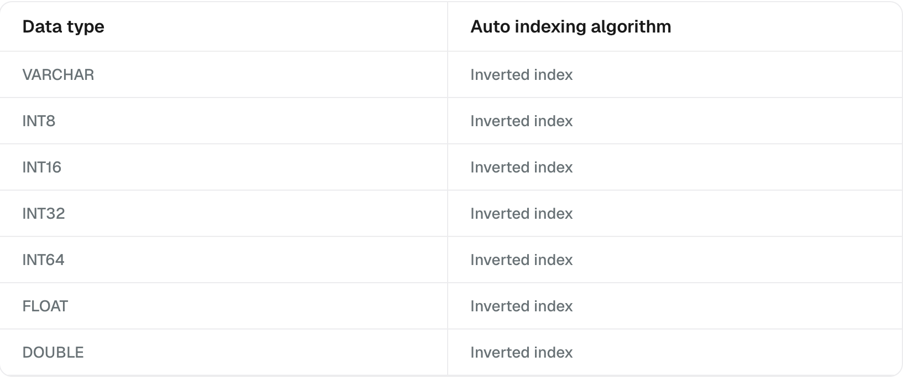

## Inverted indexing
Inverted indexing offers a flexible way to create an index for a scalar field by manually specifying index parameters. This method works well for various scenarios, including point queries, pattern match queries, full-text searches, JSON searches, Boolean searches, and even prefix match queries.

An inverted index has two main components: a term dictionary and an inverted list. The term dictionary includes all tokenized words sorted alphabetically, while the inverted list contains the list of documents where each word appears. This setup makes point queries and range queries much faster and more efficient than brute-force searches.


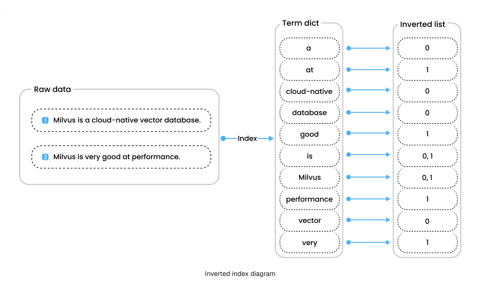


# Metric Types
Similarity metrics are used to measure similarities among vectors. Choosing an appropriate distance metric helps improve classification and clustering performance significantly.

Currently, Milvus supports these types of similarity Metrics: Euclidean distance **(L2)**, Inner Product **(IP)**, Cosine Similarity **(COSINE), JACCARD, HAMMING, and BM25** (specifically designed for full text search on sparse vectors).

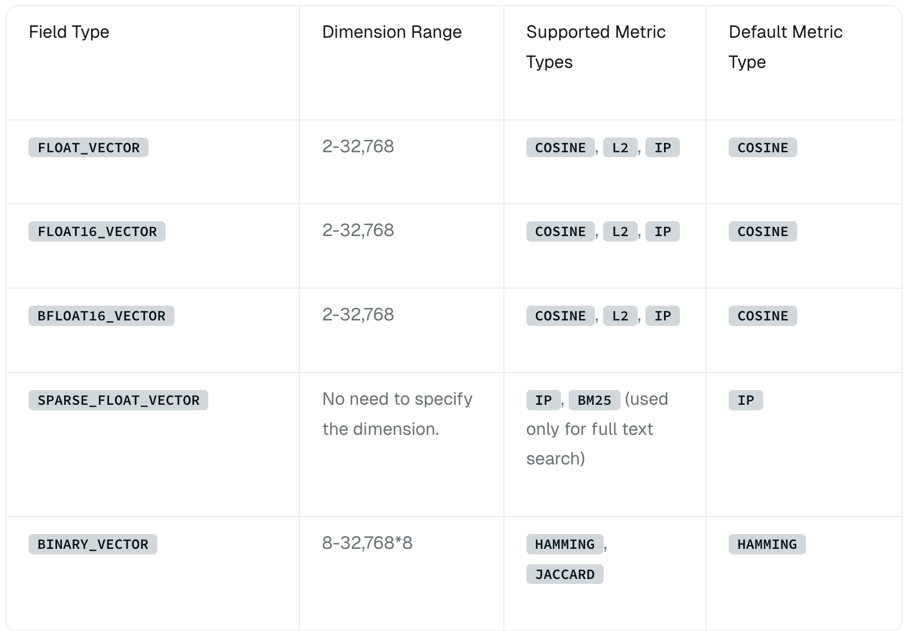

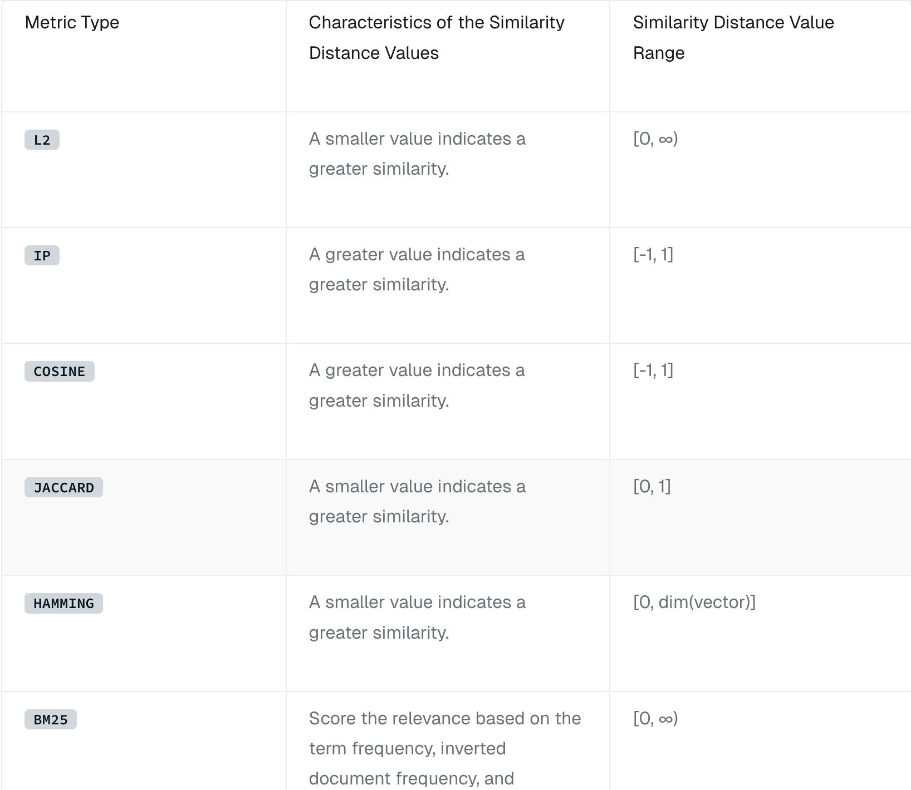

## Euclidean distance (L2)
Essentially, Euclidean distance measures the length of a segment that connects 2 points.

**NOTE:** Milvus only calculates the value before applying the square root when Euclidean distance is chosen as the distance metric.

## Inner product (IP)
IP is more useful if you need to compare non-normalized data or when you care about magnitude and angle.

**NOTE:** If you use IP to calculate similarities between embeddings, you must normalize your embeddings. After normalization, the inner product equals cosine similarity.

## Cosine similarity
Cosine similarity uses the cosine of the angle between two sets of vectors to measure how similar they are. You can think of the two sets of vectors as line segments starting from the same point, such as [0,0,…], but pointing in different directions.

The cosine similarity is always in the interval [-1, 1]. For example, two proportional vectors have a cosine similarity of 1, two orthogonal vectors have a similarity of 0, and two opposite vectors have a similarity of -1. The larger the cosine, the smaller the angle between the two vectors, indicating that these two vectors are more similar to each other.

## JACCARD distance
JACCARD similarity coefficient measures the similarity between two sample sets and is defined as the cardinality of the intersection of the defined sets divided by the cardinality of the union of them. It can only be applied to finite sample sets.

## HAMMING distance
HAMMING distance measures binary data strings. The distance between two strings of equal length is the number of bit positions at which the bits are different.

For example, suppose there are two strings, 1101 1001 and 1001 1101.

11011001 ⊕ 10011101 = 01000100. Since, this contains two 1s, the HAMMING distance, d (11011001, 10011101) = 2.

## BM25 similarity
BM25 is a widely used text relevance measurement method, specifically designed for full text search. It combines the following three key factors:

- **Term Frequency (TF):** Measures how frequently a term appears in a document. While higher frequencies often indicate greater importance, BM25 uses the saturation parameter k1 to prevent overly frequent terms from dominating the relevance score.

- **Inverse Document Frequency (IDF):** Reflects the importance of a term across the entire corpus. Terms appearing in fewer documents receive a higher IDF value, indicating greater contribution to relevance.

- **Document Length Normalization:** Longer documents tend to score higher due to containing more terms. BM25 mitigates this bias by normalizing document lengths, with parameter b controlling the strength of this normalization.

# Consistency Level
As a distributed vector database, Milvus offers multiple levels of consistency to ensure that each node or replica can access the same data during read and write operations. Currently, the supported levels of consistency include **Strong, Bounded, Eventually,** and **Session,** with **Bounded** being the default level of consistency used.


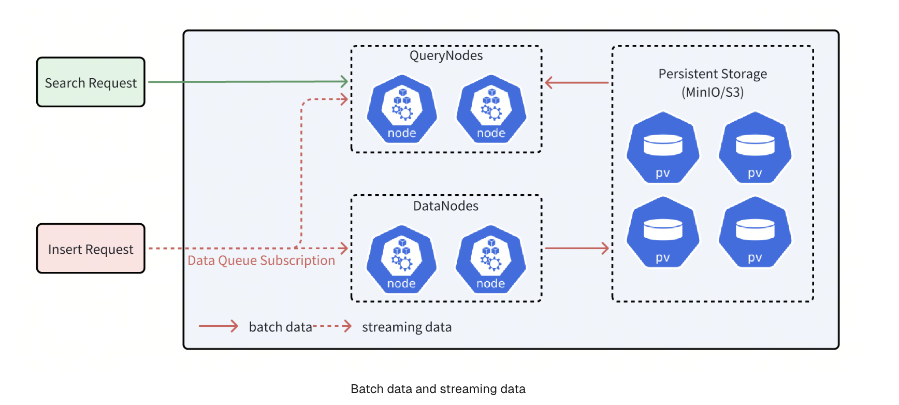

## Milvus provides four types of consistency levels with different GuaranteeTs.

- **Strong:** The latest timestamp is used as the GuaranteeTs, and QueryNodes have to wait until the ServiceTime meets the GuaranteeTs before executing Search requests.
- **Eventual:** The GuaranteeTs is set to an extremely small value, such as 1, to avoid consistency checks so that QueryNodes can immediately execute Search requests upon all batch data.
- **Bounded Staleness:** The GuranteeTs is set to a time point earlier than the latest timestamp to make QueryNodes to perform searches with a tolerance of certain data loss.
- **Session:** The latest time point at which the client inserts data is used as the GuaranteeTs so that QueryNodes can perform searches upon all the data inserted by the client.

Milvus uses Bounded Staleness as the default consistency level. If the GuaranteeTs is left unspecified, the latest ServiceTime is used as the GuaranteeTs.

## Set Consistency Level

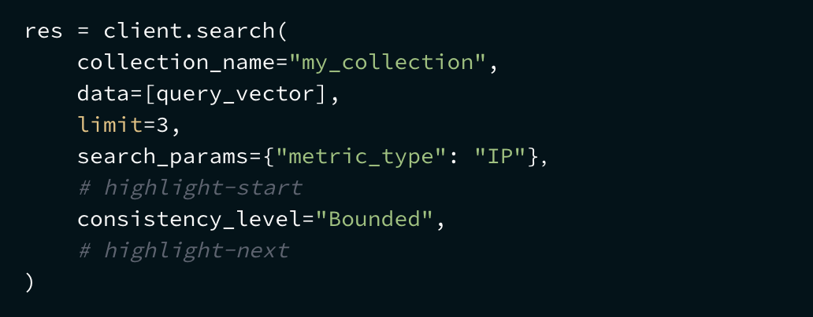

# In-Memory Replica
In-memory replica (replication) mechanism in Milvus that enables multiple segment replications in the working memory to improve performance and availability.

With in-memory replicas, Milvus can load the same segment on multiple query nodes. If one query node has failed or is busy with a current search request when another arrives, the system can send new requests to an idle query node that has a replication of the same segment.

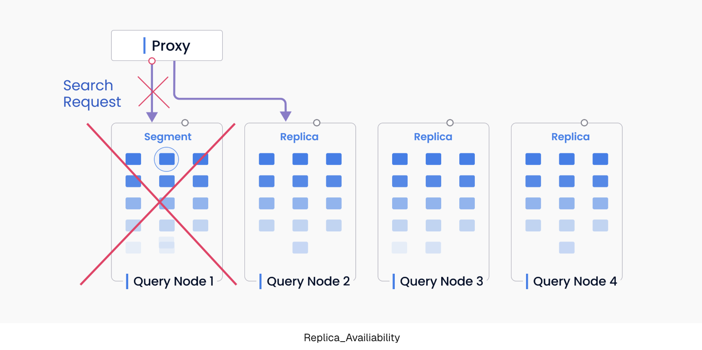

1. **Performance**
In-memory replicas allow you to leverage extra CPU and memory resources. It is very useful if you have a relatively small dataset but want to increase read throughput with extra hardware resources. Overall QPS (query per second) and throughput can be significantly improved.

2. **Availability**
In-memory replicas help Milvus recover faster if a query node crashes. When a query node fails, the segment does not have to be reloaded on another query node. Instead, the search request can be resent to a new query node immediately without having to reload the data again. With multiple segment replicas maintained simultaneously, the system is more resilient in the face of a failover.

**Key Concepts**
In-memory replicas are organized as replica groups. Each replica group contains shard replicas. Each shard replica has a streaming replica and a historical replica that correspond to the growing and sealed segments in the shard (i.e. DML channel).

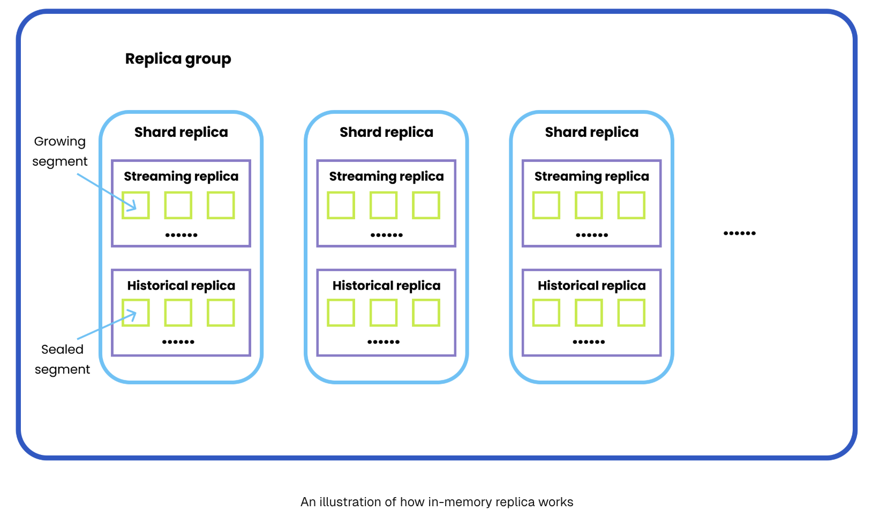

# Terminology

1. **AutoID:** AutoID is an attribute of the primary field that determines whether to enable AutoIncrement for the primary field. The value of AutoID is defined based on a timestamp. 
2. **Auto Index:** Milvus automatically decides the most appropriate index type and params for a specific field based on empirical data. This is ideal for situations when you do not need to control the specific index params.
3. **Attu:** Attu is an all-in-one administration tool for Milvus that significantly reduces the complexity and cost of managing the system.
4. **Birdwatcher:** Birdwatcher is a debugging tool for Milvus that connects to etcd, allowing you to monitor the status of the Milvus server and make adjustments in real-time. It also supports etcd file backups, aiding developers in troubleshooting.
5. **Bulk Writer:** Bulk Writer is a data processing tool provided by Milvus SDKs (e.g. PyMilvus, Java SDK) , designed to convert raw datasets into a format compatible with Milvus for efficient importing.
6. **Bulk Insert:** Bulk Insert is an API that enhances writing performance by allowing multiple files to be imported in a single request, optimizing operations with large datasets.
7. **Cardinal:** Cardinal, developed by Zilliz Cloud, is a cutter-edge vector search algorithm that delivers unparalleled search quality and performance. With its innovative design and extensive optimizations, Cardinal outperforms Knowhere by several times to an order of magnitude while adaptively handling diverse production scenarios, such as varying K sizes, high filtering, different data distributions, and so on.
8. **Channel:** Milvus utilizes two types of channels, PChannel and VChannel. Each PChannel corresponds to a topic for log storage, while each VChannel corresponds to a shard in a collection.
9. **Collection:** In Milvus, a collection is equivalent to a table in a relational database management system (RDBMS). Collections are major logical objects used to store and manage entities. For more information, refer to Manage Collections.
10. **Dependency:** A dependency is a program that another program relies on to work. Milvus’ dependencies include etcd (stores meta data), MinIO or S3 (object storage), and Pulsar (manages snapshot logs). For more information, refer to Manage Dependencies.
11. **Dynamic schema:** Dynamic schema allows you to insert entities with new fields into a collection without modifying the existing schema. This means that you can insert data without knowing the full schema of a collection and can include fields that are not yet defined. You can enable this schema-free capability by enableing the dynamic field when creating a collection. 
12. **Embeddings:** Milvus offers built-in embedding functions that work with popular embedding providers. Before creating a collection in Milvus, you can use these functions to generate embeddings for your datasets, streamlining the process of preparing data and vector searches.
13. **Entity:** An entity consists of a group of fields that represent real-world objects. Each entity in Milvus is represented by a unique primary key.
14. **Field:** A field in a Milvus collection is equivalent to a column of table in a RDBMS. Fields can be either scalar fields for structured data (e.g., numbers, strings), or vector fields for embedding vectors.
15. **Filter:** Milvus supports scalar filtering by searching with predicates, allowing you to define filter conditions within queries and searches to refine results.
16. **Filtered search:** Filtered search applies scalar filters to vector searches, allowing you to refine the search results based on specific criteria. 
17. **Hybrid search:** Hybrid Search is an API for hybrid search since Milvus 2.4.0. You can search multiple vector fields and fusion them. 
18. **Index:** A vector index is a reorganized data structure derived from raw data that can greatly accelerate the process of vector similarity search. Milvus supports a wide range of index types for both vector fields and scalar fields.
19. **Kafka-Milvus Connector:** Kafka-Milvus Connector refers to a Kafka sink connector for Milvus. It allows you to stream vector data from Kafka to Milvus.
20. **Knowhere:** Knowhere is the core vector execution engine of Milvus which incorporates several vector similarity search libraries including Faiss, Hnswlib, and Annoy. Knowhere is also designed to support heterogeneous computing. It controls on which hardware (CPU or GPU) to execute index building and search requests. This is how Knowhere gets its name - knowing where to execute the operations.
21. **Partitionr:** A partition is a division of a collection. Milvus supports dividing collection data into multiple parts on physical storage. This process is called partitioning, and each partition can contain multiple segments. 
22. **Metric type:** Similarity metric types are used to measure similarities between vectors. Currently, Milvus supports Euclidean distance (L2), Inner product (IP), Cosine similarity (COSINE), and binary metric types. You can choose the most appropriate metric type based on your scenario.

# Embedding
Embedding is a machine learning concept for mapping data into a high-dimensional space, where data of similar semantic are placed close together. Typically being a Deep Neural Network from BERT or other Transformer families, the embedding model can effectively represent the semantics of text, images, and other data types with a series of numbers known as vectors.

**There are two main categories of embeddings, each producing a different type of vector:**

- **Dense embedding:** Most embedding models represent information as a floating point vector of hundreds to thousands of dimensions. The output is called “dense” vectors as most dimensions have non-zero values. For instance, the popular open-source embedding model BAAI/bge-base-en-v1.5 outputs vectors of 768 floating point numbers (768-dimension float vector).

- **Sparse embedding:** In contrast, the output vectors of sparse embeddings has most dimensions being zero, namely “sparse” vectors. These vectors often have much higher dimensions (tens of thousands or more) which is determined by the size of the token vocabulary. Sparse vectors can be generated by Deep Neural Networks or statistical analysis of text corpora. Due to their interpretability and observed better out-of-domain generalization capabilities, sparse embeddings are increasingly adopted by developers as a complement to dense embeddings.


Milvus is a vector database designed for vector data management, storage, and retrieval. By integrating mainstream embedding and reranking models, you can easily transform original text into searchable vectors or rerank the results using powerful models to achieve more accurate results for RAG. This integration simplifies text transformation and eliminates the need for additional embedding or reranking components, thereby streamlining RAG development and validation.

**To create embeddings in action, refer to Using PyMilvus’s Model To Generate Text Embeddings.**

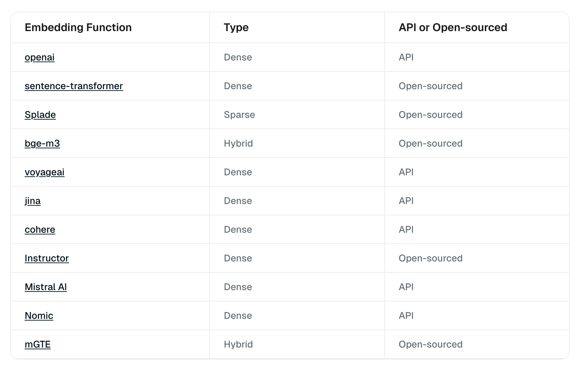

## OpenAIEmbeddingFunction
OpenAIEmbeddingFunction is a class in pymilvus that handles encoding text into embeddings using OpenAI models to support embedding retrieval in Milvus.

```
pymilvus.model.dense.OpenAIEmbeddingFunction

```

**Constructor**
Constructs an OpenAIEmbeddingFunction for common use cases.

```
OpenAIEmbeddingFunction(
    model_name: str = "text-embedding-ada-002", 
    api_key: Optional[str] = None,
    base_url: Optional[str] = None,
    dimensions: Optional[int] = None,
    **kwargs
)
```

**Example:**

```
from pymilvus import model

openai_ef = model.dense.OpenAIEmbeddingFunction(
    model_name='text-embedding-3-large', # Specify the model name
    dimensions=512 # Set the embedding dimensionality according to MRL feature.
)
```

## SentenceTransformerEmbeddingFunction
SentenceTransformerEmbeddingFunction is a class in pymilvus that handles encoding text into embeddings using Sentence Transformer models to support embedding retrieval in Milvus.

```
pymilvus.model.dense.SentenceTransformerEmbeddingFunction
```

**Constructor**
Constructs a SentenceTransformerEmbeddingFunction for common use cases.

```
SentenceTransformerEmbeddingFunction(
    model_name: str = "all-MiniLM-L6-v2",
    batch_size: int = 32,
    query_instruction: str = "",
    doc_instruction: str = "",
    device: str = "cpu",
    normalize_embeddings: bool = True,
    **kwargs
)
```

**Examples:**

```
from pymilvus import model

sentence_transformer_ef = model.dense.SentenceTransformerEmbeddingFunction(
    model_name='all-MiniLM-L6-v2', # Specify the model name
    device='cpu' # Specify the device to use, e.g., 'cpu' or 'cuda:0'
)
```

## SpladeEmbeddingFunction
SpladeEmbeddingFunction is a class in pymilvus that handles encoding text into embeddings using SPLADE models to support embedding retrieval in Milvus.

```
pymilvus.model.sparse.SpladeEmbeddingFunction
```

**Constructor:**
Constructs a SpladeEmbeddingFunction for common use cases.

```
SpladeEmbeddingFunction(
    model_name: str = "naver/splade-cocondenser-ensembledistil",
    batch_size: int = 32,
    query_instruction: str = "",
    doc_instruction: str = "",
    device: Optional[str] = "cpu",
    k_tokens_query: Optional[int] = None,
    k_tokens_document: Optional[int] = None,
    **kwargs,
)
```

**Examples:**

```
from pymilvus import model

splade_ef = model.sparse.SpladeEmbeddingFunction(
    model_name="naver/splade-cocondenser-selfdistil", 
    device="cpu"
)
```

## BGEM3EmbeddingFunction
BGEM3EmbeddingFunction is a class in pymilvus that handles encoding text into embeddings using the BGE M3 model to support embedding retrieval in Milvus.

```
pymilvus.model.hybrid.BGEM3EmbeddingFunction
```

**Constructor:**
Constructs a BGEM3EmbeddingFunction for common use cases.

```
BGEM3EmbeddingFunction(
    model_name: str = "BAAI/bge-m3",
    batch_size: int = 16,
    device: str = "",
    normalize_embeddings: bool = True,
    use_fp16: bool = True,
    return_dense: bool = True,
    return_sparse: bool = True,
    return_colbert_vecs: bool = False,
    **kwargs,
)
```

**Examples:**

```
from pymilvus import model

bge_m3_ef = model.hybrid.BGEM3EmbeddingFunction(
    model_name='BAAI/bge-m3', # Specify t`he model name
    device='cpu', # Specify the device to use, e.g., 'cpu' or 'cuda:0'
    use_fp16=False # Whether to use fp16. `False` for `device='cpu'`.
)
```

## VoyageEmbeddingFunction
VoyageEmbeddingFunction is a class in pymilvus that handles encoding text into embeddings using Voyage models to support embedding retrieval in Milvus.

```
pymilvus.model.dense.VoyageEmbeddingFunction
```

**Constructor:**
Constructs an VoyageEmbeddingFunction for common use cases.

```
VoyageEmbeddingFunction(
    model_name: str = "voyage-2",
    api_key: Optional[str] = None,
    **kwargs
)
```

**Examples:**

```
from pymilvus.model.dense import VoyageEmbeddingFunction

voyage_ef = VoyageEmbeddingFunction(
    model_name="voyage-lite-02-instruct", # Defaults to `voyage-2`
    api_key='YOUR_API_KEY' # Replace with your own Voyage API key
)
```

## JinaEmbeddingFunction
JinaEmbeddingFunction is a class in pymilvus that handles encoding text into embeddings using Jina AI embedding models to support embedding retrieval in Milvus.

```
pymilvus.model.dense.JinaEmbeddingFunction
```

**Constructor:**
Constructs a JinaEmbeddingFunction for common use cases.

```
JinaEmbeddingFunction(
    model_name: str = "jina-embeddings-v2-base-en",
    api_key: Optional[str] = None,
    **kwargs
)
```

**Examples:**

```
from pymilvus.model.dense import JinaEmbeddingFunction

jina_ef = JinaEmbeddingFunction(
    model_name="jina-embeddings-v2-base-en", # Defaults to `jina-embeddings-v2-base-en`
    api_key="YOUR_JINAAI_API_KEY" # Provide your Jina AI API key
)
```

## CohereEmbeddingFunction
CohereEmbeddingFunction is a class in pymilvus that handles encoding text into embeddings using Cohere embedding models to support embedding retrieval in Milvus.

```
pymilvus.model.dense.CohereEmbeddingFunction
```

**Constructor:**
Constructs a CohereEmbeddingFunction for common use cases.

```
CohereEmbeddingFunction(
    model_name: str = "embed-english-light-v3.0",
    api_key: Optional[str] = None,
    input_type: str = "search_document",
    embedding_types: Optional[List[str]] = None,
    truncate: Optional[str] = None,
    **kwargs
)
```

**Examples:**

```
from pymilvus.model.dense import CohereEmbeddingFunction

cohere_ef = CohereEmbeddingFunction(
    model_name="embed-english-light-v3.0",
    api_key="YOUR_COHERE_API_KEY",
    input_type="search_document",
    embedding_types=["float"]
)
```

## InstructorEmbeddingFunction
InstructorEmbeddingFunction is a class in pymilvus that handles encoding text into embeddings using the Instructor embedding model to support embedding retrieval in Milvus.

```
pymilvus.model.dense.InstructorEmbeddingFunction
```

**Constructor:**
Constructs a MistralAIEmbeddingFunction for common use cases.

```
InstructorEmbeddingFunction(
    model_name: str = "hkunlp/instructor-xl",
    batch_size: int = 32,
    query_instruction: str = "Represent the question for retrieval:",
    doc_instruction: str = "Represent the document for retrieval:",
    device: str = "cpu",
    normalize_embeddings: bool = True,
    **kwargs
)
```

**Examples:**

```
from pymilvus.model.dense import InstructorEmbeddingFunction

ef = InstructorEmbeddingFunction(
    model_name="hkunlp/instructor-xl", # Defaults to `hkunlp/instructor-xl`
    query_instruction="Represent the question for retrieval:",
    doc_instruction="Represent the document for retrieval:"
)
```

## MistralAIEmbeddingFunction
MistralAIEmbeddingFunction is a class in pymilvus that handles encoding text into embeddings using Mistral AI embedding models to support embedding retrieval in Milvus.

```
pymilvus.model.dense.MistralAIEmbeddingFunction
```

**Constructor:**
Constructs a MistralAIEmbeddingFunction for common use cases.

```
MistralAIEmbeddingFunction(
    api_key: str,
    model_name: str = "mistral-embed",
    **kwargs
)
```

**Examples:**

```
from pymilvus.model.dense import MistralAIEmbeddingFunction

ef = MistralAIEmbeddingFunction(
    model_name="mistral-embed", # Defaults to `mistral-embed`
    api_key="MISTRAL_API_KEY" # Provide your Mistral AI API key
)
```

## NomicEmbeddingFunction
NomicEmbeddingFunction is a class in pymilvus that handles encoding text into embeddings using Nomic embedding models to support embedding retrieval in Milvus.

```
pymilvus.model.dense.NomicEmbeddingFunction
```

**Constructor:**
Constructs a NomicEmbeddingFunction for common use cases.

```
NomicEmbeddingFunction(
    model_name: str = "nomic-embed-text-v1.5",
    task_type: str = "search_document",
    dimensions: int = 768,
    **kwargs
)
```

**Examples:**

```
from pymilvus.model.dense import NomicEmbeddingFunction

ef = NomicEmbeddingFunction(
    model_name="nomic-embed-text-v1.5", # Defaults to `mistral-embed`
)
```

## MGTEEmbeddingFunction
MGTEEmbeddingFunction is a class in pymilvus that handles encoding text into embeddings using MGTE embedding models to support embedding retrieval in Milvus.

```
pymilvus.model.hybrid.MGTEEmbeddingFunction
```

**Constructor:**
Constructs a MGTEEmbeddingFunction for common use cases.

```
MGTEEmbeddingFunction(
    model_name: str = "Alibaba-NLP/gte-multilingual-base",
    batch_size: int = 16,
    device: str = "",
    normalize_embeddings: bool = True,
    dimensions: Optional[int] = None,
    use_fp16: bool = False,
    return_dense: bool = True,
    return_sparse: bool = True,
    **kwargs
)
```

**Examples:**

```
from pymilvus.model.hybrid import MGTEEmbeddingFunction

ef = MGTEEmbeddingFunction(
    model_name="Alibaba-NLP/gte-multilingual-base",
)
```

## Example 1: Use default embedding function to generate dense vectors

To use embedding functions with Milvus, first install the PyMilvus client library with the model subpackage that wraps all the utilities for embedding generation.

```
pip install "pymilvus[model]"
```

The **model** subpackage supports various embedding models, from OpenAI, Sentence Transformers, BGE M3, to SPLADE pretrained models. For simpilicity, this example uses the **DefaultEmbeddingFunction** which is **all-MiniLM-L6-v2** sentence transformer model, the model is about 70MB and it will be downloaded during first use:

```
from pymilvus import model

ef = model.DefaultEmbeddingFunction()

docs = [
    "Artificial intelligence was founded as an academic discipline in 1956.",
    "Alan Turing was the first person to conduct substantial research in AI.",
    "Born in Maida Vale, London, Turing was raised in southern England.",
]

embeddings = ef.encode_documents(docs)

print("Embeddings:", embeddings)
print("Dim:", ef.dim, embeddings[0].shape)
```

**The expected output is similar to the following:**

```
Embeddings: [array([-3.09392996e-02, -1.80662833e-02,  1.34775648e-02,  2.77156215e-02,
       -4.86349640e-03, -3.12581174e-02, -3.55921760e-02,  5.76934684e-03,
        2.80773244e-03,  1.35783911e-01,  3.59678417e-02,  6.17732145e-02,
...
       -4.61330153e-02, -4.85207550e-02,  3.13997865e-02,  7.82178566e-02,
       -4.75336798e-02,  5.21207601e-02,  9.04406682e-02, -5.36676683e-02],
      dtype=float32)]
Dim: 384 (384,)
```

## Example 2: Generate dense and sparse vectors in one call with BGE M3 model

In this example, we use BGE M3 hybrid model to embed text into both dense and sparse vectors and use them to retrieve relevant documents. The overall steps are as follows:

1. Embed the text as dense and sparse vectors using BGE-M3 model;
2. Set up a Milvus collection to store the dense and sparse vectors;
3. Insert the data to Milvus;
4. Search and inspect the result.

First, we need to install the necessary dependencies.

```
from pymilvus.model.hybrid import BGEM3EmbeddingFunction
from pymilvus import (
    utility,
    FieldSchema, CollectionSchema, DataType,
    Collection, AnnSearchRequest, RRFRanker, connections,
)
```

**Use BGE M3 to encode docs and queries for embedding retrieval.**

```
docs = [
    "Artificial intelligence was founded as an academic discipline in 1956.",
    "Alan Turing was the first person to conduct substantial research in AI.",
    "Born in Maida Vale, London, Turing was raised in southern England.",
]
query = "Who started AI research?"


bge_m3_ef = BGEM3EmbeddingFunction(use_fp16=False, device="cpu")

docs_embeddings = bge_m3_ef(docs)
query_embeddings = bge_m3_ef([query])
```

# Rerankers
In the realm of information retrieval and generative AI, a reranker is an essential tool that optimizes the order of results from initial searches. Rerankers differ from traditional embedding models by taking a query and document as input and directly returning a similarity score instead of embeddings. This score indicates the relevance between the input query and document.

Rerankers are often employed after the first stage retrieval, typically done via vector Approximate Nearest Neighbor (ANN) techniques. While ANN searches are efficient at fetching a broad set of potentially relevant results, they might not always prioritize results in terms of actual semantic closeness to the query. Here, rerankers is used to optimize the results order using deeper contextual analyses, often leveraging advanced machine learning models like BERT or other Transformer-based models. By doing this, rerankers can dramatically enhance the accuracy and relevance of the final results presented to the user.


## BGERerankFunction
BGERerankFunction is a class in milvus_model that takes a query and document as input and directly returns a similarity score instead of embeddings. This functionality uses the underlying BGE reranking model.

```
pymilvus.model.reranker.BGERerankFunction
```

**Constructor:**
Constructs a BGERerankFunction for common use cases.

```
BGERerankFunction(
    model_name: str = "BAAI/bge-reranker-v2-m3",
    use_fp16: bool = True,
    batch_size: int = 32,
    normalize: bool = True,
    device: Optional[str] = None,
)
```

**Examples:**

```
from pymilvus.model.reranker import BGERerankFunction

bge_rf = BGERerankFunction(
    model_name="BAAI/bge-reranker-v2-m3",  # Specify the model name. Defaults to `BAAI/bge-reranker-v2-m3`.
    device="cpu" # Specify the device to use, e.g., 'cpu' or 'cuda:0'
)
```

## CrossEncoderRerankFunction
CrossEncoderRerankFunction is a class in milvus_model that takes a query and document as input and directly returns a similarity score instead of embeddings. This functionality uses the underlying Cross-Encoder reranking model.

```
pymilvus.model.reranker.CrossEncoderRerankFunction
```

**Constructor:**
Constructs a CrossEncoderRerankFunction for common use cases.

```
CrossEncoderRerankFunction(
    model_name: str = "",
    device: str = "",
    batch_size: int = 32,
    activation_fct: Any = None,
    **kwargs,
)
```

**Examples:**

```
from pymilvus.model.reranker import CrossEncoderRerankFunction

ce_rf = CrossEncoderRerankFunction(
    model_name="cross-encoder/ms-marco-MiniLM-L-6-v2",  # Specify the model name. Defaults to an emtpy string.
    device="cpu" # Specify the device to use, e.g., 'cpu' or 'cuda:0'
)
```

## VoyageRerankFunction
VoyageRerankFunction is a class in milvus_model that takes a query and document as input and directly returns a similarity score instead of embeddings. This functionality uses the underlying Voyage reranking model.

```
pymilvus.model.reranker.VoyageRerankFunction
```

**Constructor:**
Constructs a VoyageRerankFunction for common use cases.

```
VoyageRerankFunction(
    model_name: str = "rerank-lite-1",
    api_key: Optional[str] = None
)
```

**Examples:**

```
from pymilvus.model.reranker import VoyageRerankFunction

voyage_rf = VoyageRerankFunction(
    model_name="rerank-lite-1",  # Specify the model name. Defaults to `rerank-lite-1`.
    api_key=VOYAGE_API_KEY # Replace with your Voyage API key
)
```

## CohereRerankFunction
CohereRerankFunction is a class in milvus_model that takes a query and document as input and directly returns a similarity score instead of embeddings. This functionality uses the underlying Cohere reranking model.

```
pymilvus.model.reranker.CohereRerankFunction
```

**Constructor:**
Constructs a CohereRerankFunction for common use cases.

```
CohereRerankFunction(
    model_name: str = "rerank-english-v2.0",
    api_key: Optional[str] = None
)
```

**Examples:**

```
from pymilvus.model.reranker import CohereRerankFunction

cohere_rf = CohereRerankFunction(
    model_name="rerank-english-v3.0",  # Specify the model name. Defaults to `rerank-english-v2.0`.
    api_key=COHERE_API_KEY # Replace with your Cohere API key
)
```

## JinaRerankFunction
JinaRerankFunction is a class in milvus_model that takes a query and document as input and directly returns a similarity score instead of embeddings. This functionality uses the underlying Jina AI reranking model.

```
pymilvus.model.reranker.JinaRerankFunction
```

**Constructor:**
Constructs a JinaRerankFunction for common use cases.

```
JinaRerankFunction(
    model_name: str = "jina-reranker-v2-base-multilingual",
    api_key: Optional[str] = None
)
```

**Examples:**

```
from pymilvus.model.reranker import JinaRerankFunction

jina_rf = JinaRerankFunction(
    model_name="jina-reranker-v2-base-multilingual", # Defaults to `jina-reranker-v2-base-multilingual`
    api_key="YOUR_JINAAI_API_KEY"
)
```


**NOTE:**
- Before using open-source rerankers, make sure to download and install all required dependencies and models.
- For API-based rerankers, get an API key from the provider and set it in the appropriate environment variables or arguments.

## Example 1: Use BGE rerank function to rerank documents according to a query
In this example, we demonstrate how to rerank search results using the BGE reranker based on a specific query.

To use a reranker with PyMilvus model library, start by installing the PyMilvus model library along with the model subpackage that contains all necessary reranking utilities:

```
pip install pymilvus[model]
```

To use the BGE reranker, first import the **BGERerankFunction** class:

```
from pymilvus.model.reranker import BGERerankFunction
```

Then, create a **BGERerankFunction** instance for reranking:

```
bge_rf = BGERerankFunction(
    model_name="BAAI/bge-reranker-v2-m3",  # Specify the model name. Defaults to `BAAI/bge-reranker-v2-m3`.
    device="cpu" # Specify the device to use, e.g., 'cpu' or 'cuda:0'
)
```

To rerank documents based on a query, use the following code:

```
query = "What event in 1956 marked the official birth of artificial intelligence as a discipline?"

documents = [
    "In 1950, Alan Turing published his seminal paper, 'Computing Machinery and Intelligence,' proposing the Turing Test as a criterion of intelligence, a foundational concept in the philosophy and development of artificial intelligence.",
    "The Dartmouth Conference in 1956 is considered the birthplace of artificial intelligence as a field; here, John McCarthy and others coined the term 'artificial intelligence' and laid out its basic goals.",
    "In 1951, British mathematician and computer scientist Alan Turing also developed the first program designed to play chess, demonstrating an early example of AI in game strategy.",
    "The invention of the Logic Theorist by Allen Newell, Herbert A. Simon, and Cliff Shaw in 1955 marked the creation of the first true AI program, which was capable of solving logic problems, akin to proving mathematical theorems."
]

bge_rf(query, documents)
```

The expected output is similar to the following:

```
[RerankResult(text="The Dartmouth Conference in 1956 is considered the birthplace of artificial intelligence as a field; here, John McCarthy and others coined the term 'artificial intelligence' and laid out its basic goals.", score=0.9911615761470803, index=1),
 RerankResult(text="In 1950, Alan Turing published his seminal paper, 'Computing Machinery and Intelligence,' proposing the Turing Test as a criterion of intelligence, a foundational concept in the philosophy and development of artificial intelligence.", score=0.0326971950177779, index=0),
 RerankResult(text='The invention of the Logic Theorist by Allen Newell, Herbert A. Simon, and Cliff Shaw in 1955 marked the creation of the first true AI program, which was capable of solving logic problems, akin to proving mathematical theorems.', score=0.006514905766152258, index=3),
 RerankResult(text='In 1951, British mathematician and computer scientist Alan Turing also developed the first program designed to play chess, demonstrating an early example of AI in game strategy.', score=0.0042116724917325935, index=2)]
```

## Example 2: Use a reranker to enhance relevance of search results
In this guide, we’ll explore how to utilize the search() method in PyMilvus for conducting similarity searches, and how to enhance the relevance of the search results using a reranker. Our demonstration will use the following dataset:

```
entities = [
    {'doc_id': 0, 'doc_vector': [-0.0372721,0.0101959,...,-0.114994], 'doc_text': "In 1950, Alan Turing published his seminal paper, 'Computing Machinery and Intelligence,' proposing the Turing Test as a criterion of intelligence, a foundational concept in the philosophy and development of artificial intelligence."}, 
    {'doc_id': 1, 'doc_vector': [-0.00308882,-0.0219905,...,-0.00795811], 'doc_text': "The Dartmouth Conference in 1956 is considered the birthplace of artificial intelligence as a field; here, John McCarthy and others coined the term 'artificial intelligence' and laid out its basic goals."}, 
    {'doc_id': 2, 'doc_vector': [0.00945078,0.00397605,...,-0.0286199], 'doc_text': 'In 1951, British mathematician and computer scientist Alan Turing also developed the first program designed to play chess, demonstrating an early example of AI in game strategy.'}, 
    {'doc_id': 3, 'doc_vector': [-0.0391119,-0.00880096,...,-0.0109257], 'doc_text': 'The invention of the Logic Theorist by Allen Newell, Herbert A. Simon, and Cliff Shaw in 1955 marked the creation of the first true AI program, which was capable of solving logic problems, akin to proving mathematical theorems.'}
]
```

**Dataset components:**
- **doc_id:** Unique identifier for each document.
- **doc_vector:** Vector embeddings representing the document.
- **doc_text:** Text content of the document.


**Preparations:**
Before initiating a similarity search, you need to establish a connection with Milvus, create a collection, and prepare and insert data into that collection. The following code snippet illustrates these preliminary steps.


```
from pymilvus import MilvusClient, DataType

client = MilvusClient(
    uri="http://10.102.6.214:19530" # replace with your own Milvus server address
)

client.drop_collection('test_collection')


schema = client.create_schema(auto_id=False, enabel_dynamic_field=True)

schema.add_field(field_name="doc_id", datatype=DataType.INT64, is_primary=True, description="document id")
schema.add_field(field_name="doc_vector", datatype=DataType.FLOAT_VECTOR, dim=384, description="document vector")
schema.add_field(field_name="doc_text", datatype=DataType.VARCHAR, max_length=65535, description="document text")


index_params = client.prepare_index_params()

index_params.add_index(field_name="doc_vector", index_type="IVF_FLAT", metric_type="IP", params={"nlist": 128})


client.create_collection(collection_name="test_collection", schema=schema, index_params=index_params)


client.insert(collection_name="test_collection", data=entities)

```

**Conduct a similarity search**

After data insertion, perform similarity searches using the search method.

```

res = client.search(
    collection_name="test_collection",
    data=[[-0.045217834, 0.035171617, ..., -0.025117004]], # replace with your query vector
    limit=3,
    output_fields=["doc_id", "doc_text"]
)

for i in res[0]:
    print(f'distance: {i["distance"]}')
    print(f'doc_text: {i["entity"]["doc_text"]}')
```

The expected output is similar to the following:

```
distance: 0.7235960960388184
doc_text: The Dartmouth Conference in 1956 is considered the birthplace of artificial intelligence as a field; here, John McCarthy and others coined the term 'artificial intelligence' and laid out its basic goals.
distance: 0.6269873976707458
doc_text: In 1950, Alan Turing published his seminal paper, 'Computing Machinery and Intelligence,' proposing the Turing Test as a criterion of intelligence, a foundational concept in the philosophy and development of artificial intelligence.
distance: 0.5340118408203125
doc_text: The invention of the Logic Theorist by Allen Newell, Herbert A. Simon, and Cliff Shaw in 1955 marked the creation of the first true AI program, which was capable of solving logic problems, akin to proving mathematical theorems.
```

**Use a reranker to enhance search results**

Then, improve the relevance of your search results with a reranking step. In this example, we use **CrossEncoderRerankFunction** built in PyMilvus to rerank the results for improved accuracy.


```

from pymilvus.model.reranker import CrossEncoderRerankFunction

ce_rf = CrossEncoderRerankFunction(
    model_name="cross-encoder/ms-marco-MiniLM-L-6-v2",  # Specify the model name.
    device="cpu" # Specify the device to use, e.g., 'cpu' or 'cuda:0'
)

reranked_results = ce_rf(
    query='What event in 1956 marked the official birth of artificial intelligence as a discipline?',
    documents=[
        "In 1950, Alan Turing published his seminal paper, 'Computing Machinery and Intelligence,' proposing the Turing Test as a criterion of intelligence, a foundational concept in the philosophy and development of artificial intelligence.",
        "The Dartmouth Conference in 1956 is considered the birthplace of artificial intelligence as a field; here, John McCarthy and others coined the term 'artificial intelligence' and laid out its basic goals.",
        "In 1951, British mathematician and computer scientist Alan Turing also developed the first program designed to play chess, demonstrating an early example of AI in game strategy.",
        "The invention of the Logic Theorist by Allen Newell, Herbert A. Simon, and Cliff Shaw in 1955 marked the creation of the first true AI program, which was capable of solving logic problems, akin to proving mathematical theorems."
    ],
    top_k=3
)

for result in reranked_results:
    print(f'score: {result.score}')
    print(f'doc_text: {result.text}')
```

The expected output is similar to the following:

```
score: 6.250532627105713
doc_text: The Dartmouth Conference in 1956 is considered the birthplace of artificial intelligence as a field; here, John McCarthy and others coined the term 'artificial intelligence' and laid out its basic goals.
score: -2.9546022415161133
doc_text: In 1950, Alan Turing published his seminal paper, 'Computing Machinery and Intelligence,' proposing the Turing Test as a criterion of intelligence, a foundational concept in the philosophy and development of artificial intelligence.
score: -4.771512031555176
doc_text: The invention of the Logic Theorist by Allen Newell, Herbert A. Simon, and Cliff Shaw in 1955 marked the creation of the first true AI program, which was capable of solving logic problems, akin to proving mathematical theorems.
```


# Types of Searches Supported by Milvus
Milvus supports various types of search functions to meet the demands of different use cases:

1. **ANN Search:** Finds the top K vectors closest to your query vector.
2. **Filtering Search:** Performs ANN search under specified filtering conditions.
3. **Range Search:** Finds vectors within a specified radius from your query vector.
4. **Hybrid Search:** Conducts ANN search based on multiple vector fields.
5. **Full Text Search:** Full text search based on BM25.
6. **Reranking:** Adjusts the order of search results based on additional criteria or a secondary algorithm, refining the initial ANN search results.
7. **Fetch:** Retrieves data by their primary keys.
8. **Query:** Retrieves data using specific expressions.
9. **Filtering:** 
10. **Full Text Search:**
11. **Text Match:**
12. **Search Iterator:**
13. **Use Partition Key:**
14. **Reranking:**


## Comprehensive Feature Set
## API and SDK
- RESTful API
- PyMilvus (Python SDK) 
- Go SDK
- Java SDK
- Node.js (JavaScript)
- C#


# 1. Build RAG with Milvus
  - **Use Case:** RAG
  - **Related Milvus Features:** vector search

[Build RAG with Milvus](https://milvus.io/docs/build-rag-with-milvus.md)

[Deploy](https://github.com/milvus-io/bootcamp/tree/master/bootcamp/tutorials/quickstart/apps/rag_search_with_milvus)


# 2. Advanced RAG
  - **Use Case:** RAG
  - **Related Milvus Features:** vector search
  
[Advanced RAG](https://milvus.io/docs/how_to_enhance_your_rag.md)

# 3. Full Text Search with Milvus
  - **Use Case:** Quickstart
  - **Related Milvus Features:** Full-Text Search
  
[Full Text Search with Milvus](https://milvus.io/docs/full_text_search_with_milvus.md)

# 4. Hybrid Search with Milvus
  - **Use Case:** Hybrid Search
  - **Related Milvus Features:** hybrid search, multi vector, dense embedding, sparse embedding
  
[Hybrid Search with Milvus](https://milvus.io/docs/hybrid_search_with_milvus.md)

# 5. Image Search with Milvus
  - **Use Case:** Semantic Search
  - **Related Milvus Features:** vector search, dynamic field
  
[Image Search with Milvus](https://milvus.io/docs/image_similarity_search.md)


# 6. Multimodal RAG with Milvus
  - **Use Case:** RAG
  - **Related Milvus Features:** vector search, dynamic field

[Graph RAG with Milvus](https://milvus.io/docs/graph_rag_with_milvus.md)

[Deploy](https://github.com/milvus-io/bootcamp/tree/master/bootcamp/tutorials/quickstart/apps/multimodal_rag_with_milvus)

# 7.Multimodal Search using Multi Vectors
  - **Use Case:** Semantic Search
  - **Related Milvus Features:** multi vector, hybrid search

[Graph RAG with Milvus](https://milvus.io/docs/graph_rag_with_milvus.md)

[Deploy](https://github.com/milvus-io/bootcamp/tree/master/bootcamp/tutorials/quickstart/apps/multimodal_rag_with_milvus)


# 8.Graph RAG with Milvus
  - **Use Case:** RAG
  - **Related Milvus Features:** graph search

[Graph RAG with Milvus](https://milvus.io/docs/graph_rag_with_milvus.md)


# 9.Contextual Retrieval with Milvus
  - **Use Case:** Quickstart
  - **Related Milvus Features:** vector search

[Contextual Retrieval with Milvus](https://milvus.io/docs/contextual_retrieval_with_milvus.md)


# 10.HDBSCAN Clustering with Milvus
  - **Use Case:** Quickstart
  - **Related Milvus Features:** vector search

[HDBSCAN Clustering with Milvus](https://milvus.io/docs/hdbscan_clustering_with_milvus.md)


# 11.Use ColPali for Multi-Modal Retrieval with Milvus
  - **Use Case:** Quickstart
  - **Related Milvus Features:** vector search

[Use ColPali for Multi-Modal Retrieval with Milvus](https://milvus.io/docs/use_ColPali_with_milvus.md)


# 12.Vector Visualization
  - **Use Case:** Quickstart
  - **Related Milvus Features:** vector search

[Vector Visualization](https://milvus.io/docs/vector_visualization.md)


# 13.Movie Recommendation with Milvus
  - **Use Case:** Recommendation System
  - **Related Milvus Features:** vector search

[Movie Recommendation with Milvus](https://milvus.io/docs/movie_recommendation_with_milvus.md)


# 14.Funnel Search with Matryoshka Embeddings
  - **Use Case:** Quickstart
  - **Related Milvus Features:** vector search

[Funnel Search with Matryoshka Embeddings](https://milvus.io/docs/funnel_search_with_matryoshka.md)


# 15.Question Answering System
  - **Use Case:** Question Answering
  - **Related Milvus Features:** vector search

[Question Answering System](https://milvus.io/docs/question_answering_system.md)


# 16.Recommender System
  - **Use Case:** Recommendation System
  - **Related Milvus Features:** vector search

[Recommender System](https://milvus.io/docs/recommendation_system.md)


# 17.Video Similarity Search
  - **Use Case:** Semantic Search
  - **Related Milvus Features:** vector search

[Video Similarity Search](https://milvus.io/docs/video_similarity_search.md)


# 18.Audio Similarity Search
  - **Use Case:** Semantic Search
  - **Related Milvus Features:** vector search

[Audio Similarity Search](https://milvus.io/docs/audio_similarity_search.md)


# 19.DNA Classification
  - **Use Case:** Classification
  - **Related Milvus Features:** vector search

[DNA Classification](https://milvus.io/docs/dna_sequence_classification.md)


# 20.Text Search Engine
  - **Use Case:** Semantic Search
  - **Related Milvus Features:** vector search

[Text Search Engine](https://milvus.io/docs/text_search_engine.md)


# 21.Search Image by Text
  - **Use Case:** Semantic Search
  - **Related Milvus Features:** vector search

[Search Image by Text](https://milvus.io/docs/text_image_search.md)


# 22.Image Deduplication
  - **Use Case:** Deduplication
  - **Related Milvus Features:** vector search

[Image Deduplication](https://milvus.io/docs/image_deduplication_system.md)


# 23.Quickstart with Attu
  - **Use Case:** Quickstart
  - **Related Milvus Features:** vector search

[Quickstart with Attu](https://milvus.io/docs/quickstart_with_attu.md)


# 24.Use AsyncMilvusClient with asyncio
  - **Use Case:** AsyncIO
  - **Related Milvus Features:** AsyncIO, vector search

[Use AsyncMilvusClient with asyncio](https://milvus.io/docs/use-async-milvus-client-with-asyncio.md)


# Data Import

## Prepare Source Data

**Before you start:**
The target collection requires mapping the source data to its schema.The diagram below shows how acceptable source data is mapped to the schema of a target collection.

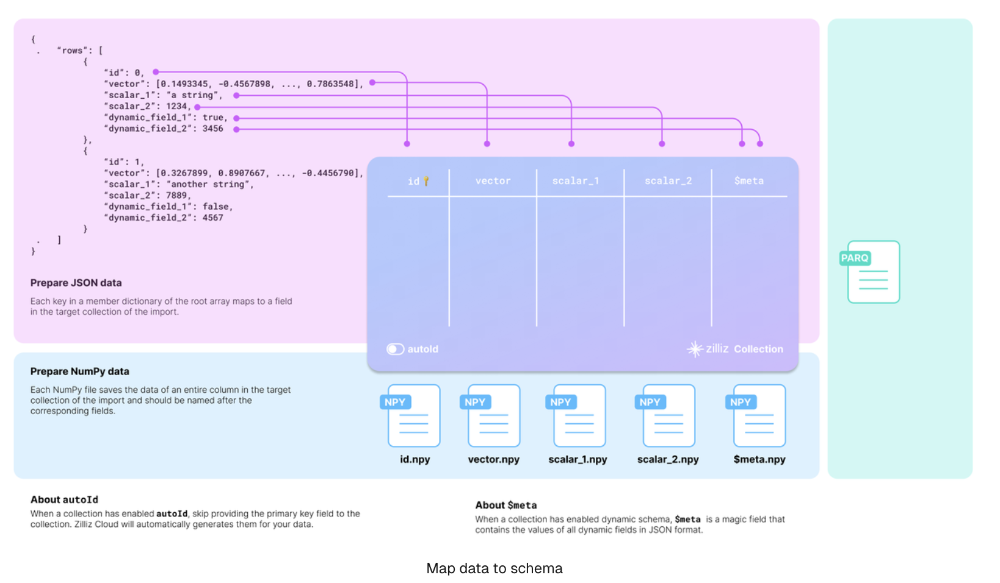

You should carefully examine your data and design the schema of the target collection accordingly.

Taking the JSON data in the above diagram as an example, there are two entities in the rows list, each row having six fields. The collection schema selectively includes four: **id, vector, scalar_1,** and **scalar_2**.

There are two more things to consider when designing the schema:

- **Whether to enable AutoID:**The id field serves as the primary field of the collection. To make the primary field automatically increment, you can enable AutoID in the schema. In this case, you should exclude the id field from each row in the source data.

- **Whether to enable dynamic fields:**The target collection can also store fields not included in its pre-defined schema if the schema enables dynamic fields. The $meta field is a reserved JSON field to hold dynamic fields and their values in key-value pairs. In the above diagram, the fields dynamic_field_1 and dynamic_field_2 and the values will be saved as key-value pairs in the $meta field.


The following code shows how to set up the schema for the collection illustrated in the above diagram.


```
from pymilvus import MilvusClient, DataType

schema = MilvusClient.create_schema(
    auto_id=False,
    enable_dynamic_field=True
)

DIM = 512

schema.add_field(field_name="id", datatype=DataType.INT64, is_primary=True),
schema.add_field(field_name="bool", datatype=DataType.BOOL),
schema.add_field(field_name="int8", datatype=DataType.INT8),
schema.add_field(field_name="int16", datatype=DataType.INT16),
schema.add_field(field_name="int32", datatype=DataType.INT32),
schema.add_field(field_name="int64", datatype=DataType.INT64),
schema.add_field(field_name="float", datatype=DataType.FLOAT),
schema.add_field(field_name="double", datatype=DataType.DOUBLE),
schema.add_field(field_name="varchar", datatype=DataType.VARCHAR, max_length=512),
schema.add_field(field_name="json", datatype=DataType.JSON),
schema.add_field(field_name="array_str", datatype=DataType.ARRAY, max_capacity=100, element_type=DataType.VARCHAR, max_length=128)
schema.add_field(field_name="array_int", datatype=DataType.ARRAY, max_capacity=100, element_type=DataType.INT64)
schema.add_field(field_name="float_vector", datatype=DataType.FLOAT_VECTOR, dim=DIM),
schema.add_field(field_name="binary_vector", datatype=DataType.BINARY_VECTOR, dim=DIM),
schema.add_field(field_name="float16_vector", datatype=DataType.FLOAT16_VECTOR, dim=DIM),
schema.add_field(field_name="sparse_vector", datatype=DataType.SPARSE_FLOAT_VECTOR)

schema.verify()

print(schema)
```

## Set up BulkWriter
BulkWriter is a tool designed to convert raw datasets into a format suitable for importing via the RESTful Import API. It offers two types of writers:

- **LocalBulkWriter:** Reads the designated dataset and transforms it into an easy-to-use format.
- **RemoteBulkWriter:** Performs the same task as the LocalBulkWriter but additionally transfers the converted data files to a specified remote object storage bucket.

**RemoteBulkWriter** differs from **LocalBulkWriter** in that **RemoteBulkWriter** transfers the converted data files to a target object storage bucket.

## Set up LocalBulkWriter

A **LocalBulkWriter** appends rows from the source dataset and commits them to a local file of the specified format.

```
from pymilvus.bulk_writer import LocalBulkWriter, BulkFileType

writer = LocalBulkWriter(
    schema=schema,
    local_path='.',
    segment_size=512 * 1024 * 1024, # Default value
    file_type=BulkFileType.PARQUET
)
```

When creating a LocalBulkWriter, you should:

- Reference the created schema in **schema**.
- Set **local_path** to the output directory.
- Set **file_type** to the output file type.
- If your dataset contains a large number of records, you are advised to segment your data by setting **segment_size** to a proper value.

## Set up RemoteBulkWriter
Instead of committing appended data to a local file, a **RemoteBulkWriter** commits them to a remote bucket. Therefore, you should set up a **ConnectParam** object before creating a **RemoteBulkWriter**.

```
from pymilvus.bulk_writer import RemoteBulkWriter

ACCESS_KEY="minioadmin"
SECRET_KEY="minioadmin"
BUCKET_NAME="a-bucket"

conn = RemoteBulkWriter.S3ConnectParam(
    endpoint="localhost:9000", # the default MinIO service started along with Milvus
    access_key=ACCESS_KEY,
    secret_key=SECRET_KEY,
    bucket_name=BUCKET_NAME,
    secure=False
)

from pymilvus.bulk_writer import BulkFileType

writer = RemoteBulkWriter(
    schema=schema,
    remote_path="/",
    connect_param=conn,
    file_type=BulkFileType.PARQUET
)

print('bulk writer created.')
```

Once the connection parameters are ready, you can reference it in the RemoteBulkWriter as follows:

```
from pymilvus.bulk_writer import BulkFileType

writer = RemoteBulkWriter(
    schema=schema,
    remote_path="/",
    connect_param=conn,
    file_type=BulkFileType.PARQUET
)
```

The parameters for creating a RemoteBulkWriter are barely the same as those for a LocalBulkWriter, except connect_param.

## Start writing

A BulkWriter has two methods: **append_row()** adds a row from a source dataset, and **commit()** commits added rows to a local file or a remote bucket.

For demonstration purposes, the following code appends randomly generated data.

```
import random, string, json
import numpy as np
import tensorflow as tf

def generate_random_str(length=5):
    letters = string.ascii_uppercase
    digits = string.digits
    
    return ''.join(random.choices(letters + digits, k=length))

def gen_binary_vector(to_numpy_arr):
    raw_vector = [random.randint(0, 1) for i in range(DIM)]
    if to_numpy_arr:
        return np.packbits(raw_vector, axis=-1)
    return raw_vector

def gen_float_vector(to_numpy_arr):
    raw_vector = [random.random() for _ in range(DIM)]
    if to_numpy_arr:
        return np.array(raw_vector, dtype="float32")
    return raw_vector


def gen_fp16_vector(to_numpy_arr):
    raw_vector = [random.random() for _ in range(DIM)]
    if to_numpy_arr:
        return np.array(raw_vector, dtype=np.float16)
    return raw_vector

def gen_sparse_vector(pair_dict: bool):
    raw_vector = {}
    dim = random.randint(2, 20)
    if pair_dict:
        raw_vector["indices"] = [i for i in range(dim)]
        raw_vector["values"] = [random.random() for _ in range(dim)]
    else:
        for i in range(dim):
            raw_vector[i] = random.random()
    return raw_vector

for i in range(10000):
    writer.append_row({
        "id": np.int64(i),
        "bool": True if i % 3 == 0 else False,
        "int8": np.int8(i%128),
        "int16": np.int16(i%1000),
        "int32": np.int32(i%100000),
        "int64": np.int64(i),
        "float": np.float32(i/3),
        "double": np.float64(i/7),
        "varchar": f"varchar_{i}",
        "json": json.dumps({"dummy": i, "ok": f"name_{i}"}),
        "array_str": np.array([f"str_{k}" for k in range(5)], np.dtype("str")),
        "array_int": np.array([k for k in range(10)], np.dtype("int64")),
        "float_vector": gen_float_vector(True),
        "binary_vector": gen_binary_vector(True),
        "float16_vector": gen_fp16_vector(True),
        # "bfloat16_vector": gen_bf16_vector(True),
        "sparse_vector": gen_sparse_vector(True),
        f"dynamic_{i}": i,
    })
    if (i+1)%1000 == 0:
        writer.commit()
        print('committed')

print(writer.batch_files)
```

## Verify the results
To check the results, you can get the actual output path by printing the **batch_files** property of the writer.

```
print(writer.batch_files)

```

BulkWriter generates a UUID, creates a sub-folder using the UUID in the provided output directory, and places all generated files in the sub-folder.

# Import data

## Before you start

- You have already prepared your data and placed it into the Milvus bucket.If not, you should use RemoteBulkWriter to prepare your data first, and ensure that the prepared data has already been transferred to the Milvus bucket on the MinIO instance started along with your Milvus instance. 

## Import data
To import the prepared data, you have to create an import job as follows:

```
from pymilvus.bulk_writer import bulk_import

url = f"http://127.0.0.1:19530"

resp = bulk_import(
    url=url,
    collection_name="quick_setup",
    files=[['a1e18323-a658-4d1b-95a7-9907a4391bcf/1.parquet'],
           ['a1e18323-a658-4d1b-95a7-9907a4391bcf/2.parquet'],
           ['a1e18323-a658-4d1b-95a7-9907a4391bcf/3.parquet'],
           ['a1e18323-a658-4d1b-95a7-9907a4391bcf/4.parquet'],
           ['a1e18323-a658-4d1b-95a7-9907a4391bcf/5.parquet'],
           ['a1e18323-a658-4d1b-95a7-9907a4391bcf/6.parquet'],
           ['a1e18323-a658-4d1b-95a7-9907a4391bcf/7.parquet'],
           ['a1e18323-a658-4d1b-95a7-9907a4391bcf/8.parquet'],
           ['a1e18323-a658-4d1b-95a7-9907a4391bcf/9.parquet'],
           ['a1e18323-a658-4d1b-95a7-9907a4391bcf/10.parquet']],
)

job_id = resp.json()['data']['jobId']
print(job_id)
```

The request body contains two fields:

- **collectionName:** The name of the target collection.
- **files:** A list of lists of file paths relative to the root path of the Milvus bucket on the MioIO instance started along with your Milvus instance. Possible sub-lists are as follows:

**JSON files**

If the prepared file is in JSON format, each sub-list should contain the path to a single prepared JSON file.

```
[
    "/d1782fa1-6b65-4ff3-b05a-43a436342445/1.json"
],
```


**Parquet files**
If the prepared file is in Parquet format, each sub-list should contain the path to a single prepared parquet file.

```
[
    "/a6fb2d1c-7b1b-427c-a8a3-178944e3b66d/1.parquet"
]

```

The possible return is as follows:

```
{
    "code": 200,
    "data": {
        "jobId": "448707763884413158"
    }
}
```


## Check import progress

Once you get an import job ID, you can check the import progress as follows:

```
import json
from pymilvus.bulk_writer import get_import_progress

url = f"http://127.0.0.1:19530"

resp = get_import_progress(
    url=url,
    job_id="453265736269038336",
)

print(json.dumps(resp.json(), indent=4))
```

The possible response is as follows:

```
{
    "code": 200,
    "data": {
        "collectionName": "quick_setup",
        "completeTime": "2024-05-18T02:57:13Z",
        "details": [
            {
                "completeTime": "2024-05-18T02:57:11Z",
                "fileName": "id:449839014328146740 paths:\"/8ca44f28-47f7-40ba-9604-98918afe26d1/1.parquet\" ",
                "fileSize": 31567874,
                "importedRows": 100000,
                "progress": 100,
                "state": "Completed",
                "totalRows": 100000
            },
            {
                "completeTime": "2024-05-18T02:57:11Z",
                "fileName": "id:449839014328146741 paths:\"/8ca44f28-47f7-40ba-9604-98918afe26d1/2.parquet\" ",
                "fileSize": 31517224,
                "importedRows": 100000,
                "progress": 100,
                "state": "Completed",
                "totalRows": 200000            
            }
        ],
        "fileSize": 63085098,
        "importedRows": 200000,
        "jobId": "449839014328146739",
        "progress": 100,
        "state": "Completed",
        "totalRows": 200000
    }
}
```

## List Import Jobs
You can list all import jobs relative to a specific collection as follows:


```
import json
from pymilvus.bulk_writer import list_import_jobs

url = f"http://127.0.0.1:19530"

resp = list_import_jobs(
    url=url,
    collection_name="quick_setup",
)

print(json.dumps(resp.json(), indent=4))
```

The possible values are as follows:

```
{
    "code": 200,
    "data": {
        "records": [
            {
                "collectionName": "quick_setup",
                "jobId": "448761313698322011",
                "progress": 50,
                "state": "Importing"
            }
        ]
    }
}
```

## Limitations
- Each import file size should not exceed **16 GB**.
- The maximum number of import requests is limited to **1024**.
- The maximum number of file per import request should not exceed **1024**.
- Only one partition name can be specified in an import request. If no partition name is specified, the data will be inserted into the default partition. Additionally, you cannot set a partition name in the import request if you have set the Partition Key in the target collection.


## Constraints

Before importing data, ensure that you have acknowledged the constaints in terms of the following Milvus behaviors:

- Constraints regarding the Load behavior:
      - If a collection has already been loaded before an import, you can use the refresh_load function to load the newly imported data after the import is complete.
- Constraints regarding the query & search behaviors:
      - Before the import job status is Completed, the newly import data is guaranteed to be invisible to queries and searches.
      - Once the job status is Completed,
            - If the collection is not loaded, you can use the load function to load the newly imported data.
            - If the collection is already loaded, you can call load(is_refresh=True) to load the imported data.
- Constraints regarding the delete behavior:
      - Before the import job status is Completed, deletion is not guaranteed and may or may not succeed.
      - Deletion after the job status is Completed is guaranted to succeed.


## Recommendations
We highly recommend utilizing the multi-file import feature, which allows you to upload several files in a single request. This method not only simplifies the import process but also significantly boosts import performance. Meanwhile, by consolidating your uploads, you can reduce the time spent on data management and make your workflow more efficient.


# Tools
1. Attu (Milvus GUI)
2. Milvus Backup
3. Birdwatcher
4. Milvus-CDC
5. [Milvus Sizing Tool](https://milvus.io/tools/sizing)
6. VTS (short for Vector Transport Service)

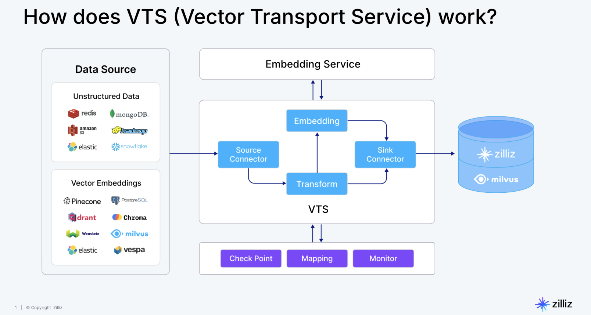


# Integrations Overview

| Tutorial                                                   | Use Case                 | Partners or Stacks                   |
|------------------------------------------------------------|---------------------------|---------------------------------------|
| RAG with Milvus and LlamaIndex                             | RAG                       | Milvus, LlamaIndex                    |
| RAG with Milvus and LangChain                              | RAG                       | Milvus, LangChain                     |
| Milvus Hybrid Search Retriever in LangChain                | Hybrid Search             | Milvus, LangChain                     |
| Semantic Search with Milvus and OpenAI                     | Semantic Search           | Milvus, OpenAI                        |
| Question Answering Using Milvus and Cohere                 | Semantic Search           | Milvus, Cohere                        |
| Question Answering using Milvus and HuggingFace            | Question Answering        | Milvus, HuggingFace                   |
| Image Search using Milvus and Pytorch                      | Semantic Search           | Milvus, Pytorch                       |
| Movie Search using Milvus and SentenceTransformers         | Semantic Search           | Milvus, SentenceTransformers           |
| Use Milvus as a Vector Store in LangChain                  | Semantic Search           | Milvus, LangChain                     |
| Using Full-Text Search with LangChain and Milvus           | Full-Text Search          | Milvus, LangChain                     |
| RAG with Milvus and Haystack                               | RAG                       | Milvus, Haystack                      |
| Conduct Vision Searches with Milvus and FiftyOne           | Semantic Search           | Milvus, FiftyOne                      |
| Semantic Search with Milvus and VoyageAI                   | Semantic Search           | Milvus, VoyageAI                      |
| RAG with Milvus and BentoML                                | RAG                       | Milvus, BentoML                       |
| RAG with Milvus and DSPy                                   | RAG                       | Milvus, DSPy                          |
| Semantic Search with Milvus and Jina                       | Semantic Search           | Milvus, Jina                          |
| Milvus on Snowpark Container Services                      | Data Connection           | Milvus, Snowpark                      |
| Rule-based Retrieval with Milvus and WhyHow                | Question Answering        | Milvus, WhyHow                        |
| Milvus in Langfuse                                         | Observability              | Milvus, Langfuse                      |
| RAG Evaluation with Ragas and Milvus                       | Evaluation                | Milvus, Ragas                         |
| Chatbot Agent with Milvus and MemGPT                       | Agent                     | Milvus, MemGPT                        |
| How to deploy FastGPT with Milvus                          | RAG                       | Milvus, FastGPT                       |
| Write SQL with Vanna and Milvus                            | RAG                       | Milvus, Vanna                         |
| RAG with Milvus and Camel                                  | RAG                       | Milvus, Camel                         |
| Airbyte & Milvus: Open-Source Data Movement Infrastructure | Data Connection           | Milvus, Airbyte                       |
| Advanced Video Search: Leveraging Twelve Labs and Milvus   | Semantic Search           | Milvus, Twelve Labs                   |
| Building RAG with Milvus, vLLM, and Llama 3.1              | RAG                       | Milvus, vLLM, LlamaIndex               |
| Multi-agent Systems with Mistral AI, Milvus and LlamaIndex | Agent                     | Milvus, Mistral AI, LlamaIndex         |
| Connect Kafka with Milvus                                  | Data Sources              | Milvus, Kafka                         |
| Kotaemon RAG with Milvus                                   | RAG                       | Milvus, Kotaemon                      |
| Crawling Websites with Apify and Saving Data to Milvus     | Data Sources              | Milvus, Apify                        |
| Evaluation with DeepEval                                  | Evaluation & Observability | Milvus, DeepEval                      |
| Evaluation with Arize Phoenix                             | Evaluation & Observability | Milvus, Arize Phoenix                 |
| Deploying Dify with Milvus                                 | Orchestration             | Milvus, Dify                          |
| Building a RAG System Using Langflow with Milvus           | Orchestration             | Milvus, Langflow                      |
| Build RAG on Arm Architecture                             | RAG                       | Milvus, Arm                          |
| Build RAG with Milvus and Fireworks AI                     | LLMs                      | Milvus, Fireworks AI                  |
| Build RAG with Milvus and Lepton AI                        | LLMs                      | Milvus, Lepton AI                     |
| Build RAG with Milvus and SiliconFlow                      | LLMs                      | Milvus, SiliconFlow                   |
| Build a RAG with Milvus and Unstructured                   | Data Sources              | Milvus, Unstructured                  |
| Build RAG with Milvus + PII Masker                         | Data Sources              | Milvus, PII Masker                    |
| Use Milvus in PrivateGPT                                  | Orchestration              | Vector Search                        |
| Getting Started with Mem0 and Milvus                       | Agents                    | Mem0, Milvus                         |
| Knowledge Table with Milvus                               | Knowledge Engineering     | Knowledge Table, Milvus               |
| Use Milvus in DocsGPT                                     | Orchestration             | DocsGPT, Milvus                      |
| Use Milvus with SambaNova                                  | Orchestration             | Milvus, SambaNova                    |
| Build RAG with Milvus and Cognee                          | Knowledge Engineering     | Milvus, Cognee                       |
| Build RAG with Milvus and Gemini                          | LLMs                      | Milvus, Gemini                       |
| Build RAG with Milvus and Ollama                          | LLMs                      | Milvus, Ollama                       |
| Getting Started with Dynamiq and Milvus                   | Orchestration             | Milvus, Dynamiq                      |
| Build RAG with Milvus and DeepSeek                        | LLMs                      | Milvus, DeepSeek                     |
| Integrate Milvus with Phidata                             | Agents                    | Milvus, Phidata                      |
| Building RAG with Milvus and Crawl4AI                     | Data Sources              | Milvus, Crawl4AI                     |
| Building RAG with Milvus and Firecrawl                    | Data Sources              | Milvus, Firecrawl                    |

[Integrations link](https://milvus.io/docs/integrations_overview.md)


# Milvus Limits

Milvus is committed to providing the best vector databases to power AI applications and vector similarity search. However, the team is continuously working to bring in more features and the best utilities to enhance user experience. This page lists out some known limitations that the users may encounter when using Milvus.


[Limitation link](https://milvus.io/docs/limitations.md)
