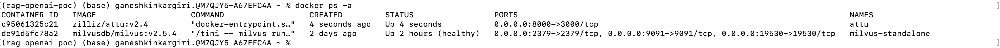
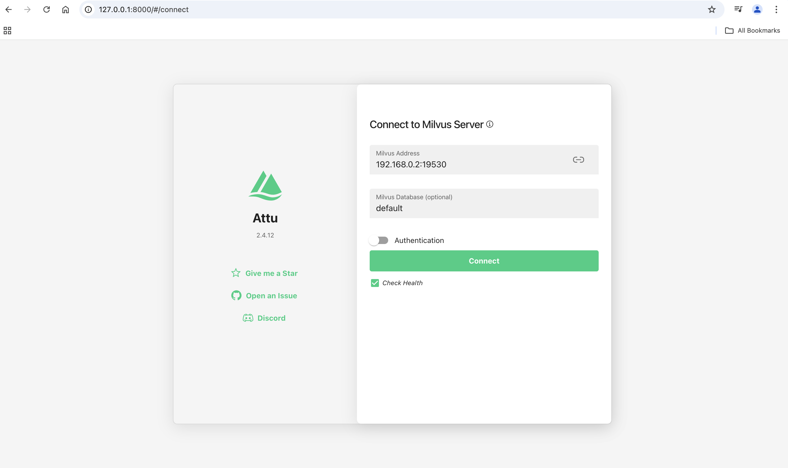
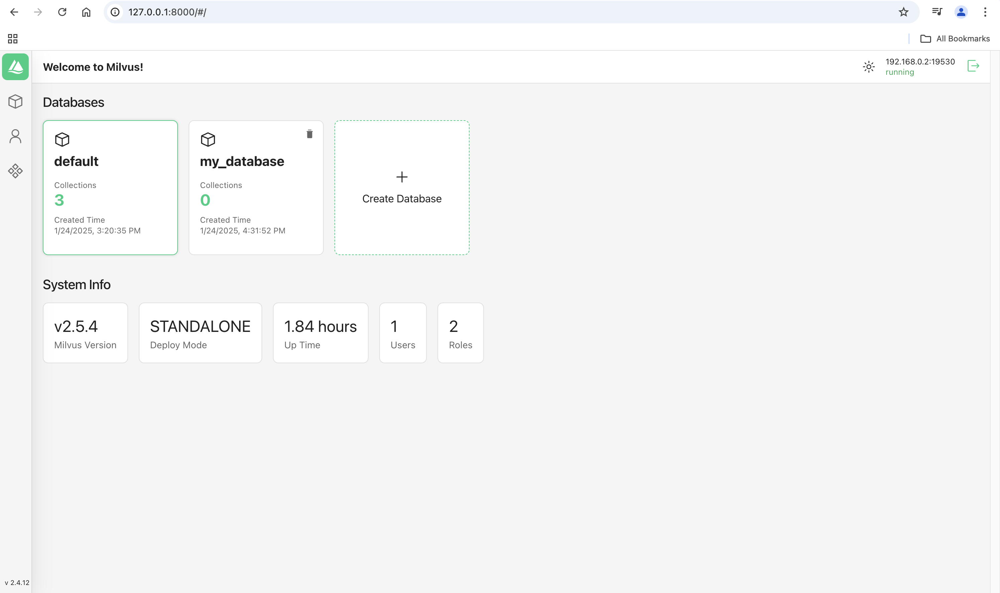

# Run Milvus in Docker

# Ref git repo
## Download the installation script

```
curl -sfL https://raw.githubusercontent.com/milvus-io/milvus/master/scripts/standalone_embed.sh -o standalone_embed.sh

bash standalone_embed.sh start

```


## create embedEtcd.yaml
1. create embedEtcd.yaml file with below content in the /tmp folder

```
listen-client-urls: http://0.0.0.0:2379
advertise-client-urls: http://0.0.0.0:2379
quota-backend-bytes: 4294967296
auto-compaction-mode: revision
auto-compaction-retention: '1000'
```

2. create user.yaml in the /tmp folder

```
touch user.yaml
```

3. Start running the below docker command

```
sudo docker run -d \
    --name milvus-standalone \
    --security-opt seccomp:unconfined \
    -e ETCD_USE_EMBED=true \
    -e ETCD_DATA_DIR=/var/lib/milvus/etcd \
    -e ETCD_CONFIG_PATH=/milvus/configs/embedEtcd.yaml \
    -e COMMON_STORAGETYPE=local \
    -v $(pwd)/volumes/milvus:/var/lib/milvus \
    -v $(pwd)/embedEtcd.yaml:/milvus/configs/embedEtcd.yaml \
    -v $(pwd)/user.yaml:/milvus/configs/user.yaml \
    -p 19530:19530 \
    -p 9091:9091 \
    -p 2379:2379 \
    --health-cmd="curl -f http://localhost:9091/healthz" \
    --health-interval=30s \
    --health-start-period=90s \
    --health-timeout=20s \
    --health-retries=3 \
    milvusdb/milvus:v2.5.4 \
    milvus run standalone
```

4. Check milvus is running or not? 

```
docker ps -a

CONTAINER ID   IMAGE                    COMMAND                  CREATED          STATUS                    PORTS                                                                      NAMES
de91d5fc78a2   milvusdb/milvus:v2.5.4   "/tini -- milvus run…"   11 minutes ago   Up 11 minutes (healthy)   0.0.0.0:2379->2379/tcp, 0.0.0.0:9091->9091/tcp, 0.0.0.0:19530->19530/tcp   milvus-standalone
```

```
http://localhost:9091/healthz
http://127.0.0.1:9091/webui
http://127.0.0.1:19530
```


# Running Attu Docker

## Reference document
[Attu](https://github.com/zilliztech/attu)


```
docker run --name attu -itd -p 8000:3000 -e HOST_URL=http://0.0.0.0:8000 -e MILVUS_URL=0.0.0.0:19530 zilliz/attu:v2.4
```



## To access attu

```
http://127.0.0.1:8000/
```



## Connect to Milvus Server
Note: For attu Milvus Server IP will be system IPv4 address((localhost or 127.0.0.1 will not work)

Ex: 192.168.0.2:19530



