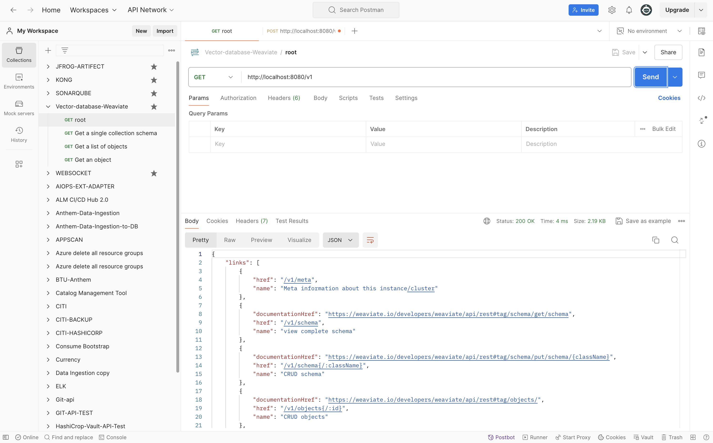
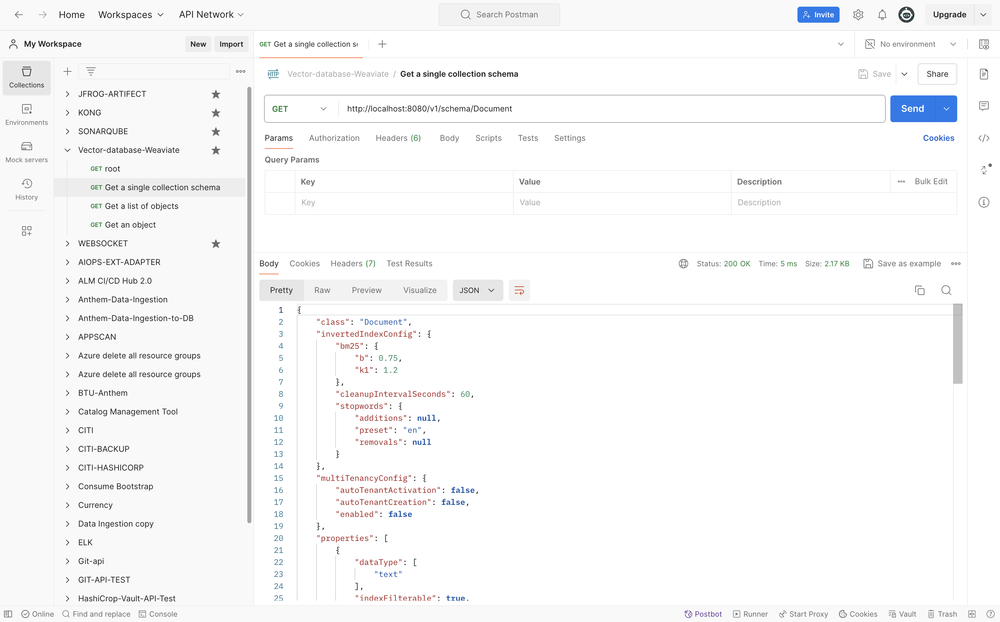
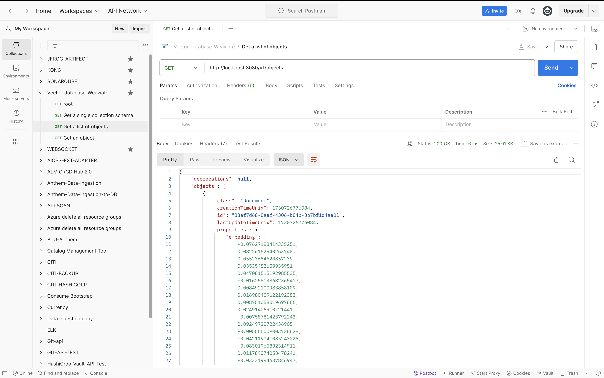
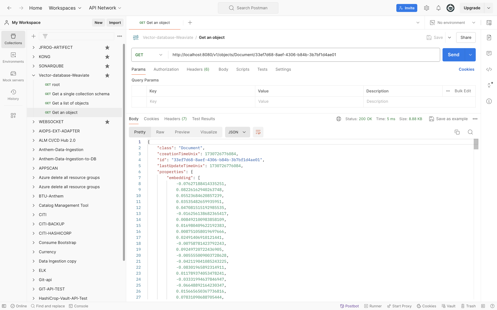

# weaviate

```
docker run -d -p 8080:8080 semitechnologies/weaviate
```

```
http://localhost:8080/v1
```

```
import weaviate

# Connect to your Weaviate instance
client = weaviate.Client("http://localhost:8080")

# Define a schema for your documents
client.schema.create_class({
    "class": "Document",
    "properties": [
        {
            "name": "text",
            "dataType": ["text"]
        },
        {
            "name": "embedding",
            "dataType": ["number[]"]
        }
    ]
})
```

```
# Sample data and embeddings
documents = ["This is document 1", "This is document 2", "Document 3 content"]
embeddings = model.encode(documents)

# Upload documents with embeddings
for i, (doc, embedding) in enumerate(zip(documents, embeddings)):
    client.data_object.create(
        {
            "text": doc,
            "embedding": embedding.tolist()
        },
        "Document"
    )
```

```
query_embedding = model.encode(["What is document retrieval?"])
result = client.query.get("Document", ["text"]) \
    .with_near_vector({"vector": query_embedding.tolist()}) \
    .with_limit(3) \
    .do()
print("Top results:", result)
```



**Get a single collection schema**



**Get a list of objects**



**Get an object**



```
https://weaviate.io/developers/weaviate/api/rest#description/introduction
```