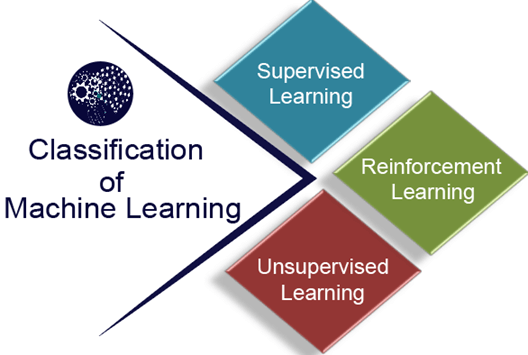

## **What is Machine Learning**

In the real world, we are surrounded by humans who can learn everything from their experiences with their learning capability, and we have computers or machines which work on our instructions. But can a machine also learn from experiences or past data like a human does? So here comes the role of Machine Learning.

Machine learning (ML) is a type of Artificial Intelligence (AI) that allows computers to learn and make decisions without being explicitly programmed. It involves feeding data into algorithms that can then identify patterns and make predictions on new data. Machine learning is used in a wide variety of applications, including image and speech recognition, natural language processing, and recommender systems.

# Why we need Machine Learning?
Machine learning is able to learn, train from data and solve/predict complex solutions which cannot be done with traditional programming. It enables us with better decision making and solve complex business problems in optimized time. Machine learning has applications in various fields, like Healthcare, finance, educations, sports and more.

1. **Solving Complex Business Problems:**
It is too complex to tackle problems like Image recognition, Natural language processing, disease diagnose etc. with Traditional programming. Machine learning can handle such problems by learning from examples or making predictions, rather than following some rigid rules.

2. **Handling Large Volumes of Data:**
Expansion of Internet and users is producing massive amount of data. Machine Learning can process these data effectively and analyze, predict useful insights from them.
    - For example, ML can analyze millions of everyday transactions to detect any fraud activity in real time.
    - Social platforms like Facebook, Instagram use ML to analyze billions of post, like and share to predict next recommendation in your feed.

3. **Automate Repetitive Tasks:**
With Machine Learning, we can automate time-consuming and repetitive tasks, with better accuracy.

    - GMail uses ML to filter out Spam emails and ensure your Index stay clean and spam free. Using traditional programming or handling these manually will only make the system error-prone.
    - Customer Support chatbots can use ML to solve frequent occurring problems like Checking order status, Password reset etc.
    - Big organizations can use ML to process large amount of data (like Invoices etc) to extract historical and current key insights.

4. **Personalized User Experience:**
All social-media, OTT and E-commerce platforms uses Machine learning to recommend better feed based on user preference or interest.

    - Netflix recommends movies and TV shows based on what you’ve watched
    - E-commerce platforms suggesting products you are likely to buy.

5. **Self Improvement in Performance:**
ML models are able to improve themselves based on more data, like user-behavior and feedback. For example,

    - **Voice Assistants (Siri, Alexa, Google Assistant) –** Voice assistants continuously improve as they process millions of voice inputs. They adapt to user preferences, understand regional accents better, and handle ambiguous queries more effectively.
    - **Search Engines (Google, Bing) –** Search engines analyze user behavior to refine their ranking algorithms.
    - **Self-driving Cars –** Self-driving cars use data from millions of miles driven (both in simulations and real-world scenarios) to enhance their decision-making.

## **Introduction to Machine Learning**

- A subset of artificial intelligence known as machine learning focuses primarily on the creation of algorithms that enable a computer to independently learn from data and previous experiences. 
- Machine learning algorithms create a mathematical model that, without being explicitly programmed, aids in making predictions or decisions with the assistance of sample historical data, or training data.
- For the purpose of developing predictive models, machine learning brings together statistics and computer science. 

## **Classification of Machine Learning**

## Types of Machine Learning
Machine learning can be broadly categorized into three types:

1. **Supervised learning:**
Trains models on labeled data to predict or classify new, unseen data.

2. **Unsupervised learning:**
Finds patterns or groups in unlabeled data, like clustering or dimensionality reduction.

3. **Reinforcement learning:**
Learns through trial and error to maximize rewards, ideal for decision-making tasks.

# Machine Learning Pipeline
Machine learning is fundamentally built upon data, which serves as the foundation for training and testing models.
**Data** consists of inputs (features) and outputs (labels). A model learns patterns during training and is tested on unseen data to evaluate its performance and generalization. In order to make predictions, there are essential steps through which data passes in order to produce a machine learning model that can make predictions.

1. **ML workflow**
2. **Data Cleaning**
3. **Feature Scaling**
4. **Data Preprocessing in Python**
