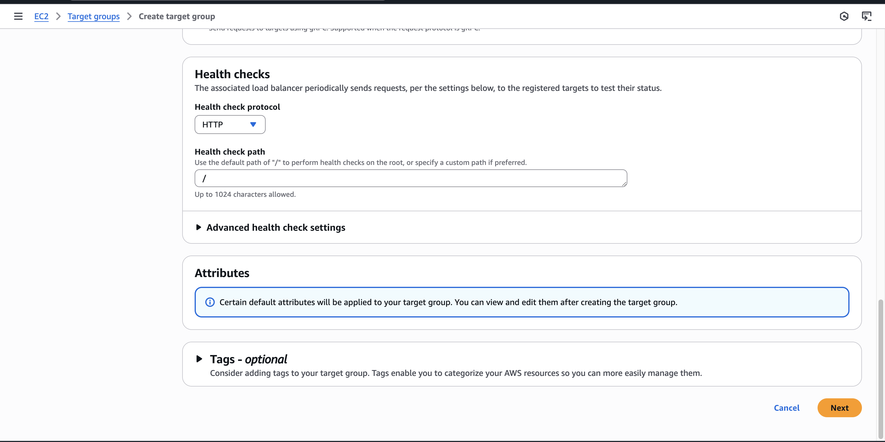

# CREATE A ALB
1. Click Load balancers
2. Click Create load balancer
3. Click Create Application Load Balancer


VPC: Select your VPC
Availability Zones and subnets: Select Zones


Security groups: create your security group HTTP and port 80
Listeners and routing: HTTP and port 80


## aiml-devops-eks-alb-security-group:

**Inbound rules:**
Type: HTTP
Protocol: TCP
Port Range:80


**Outbound rules:**
Type: All traffic
Protocol: All
Port Range: All


## Target group:

**aiml-devops-eks-target-group**

Protocol: HTTP
Port:80




## EC2
- Instances 
- i-084beb74e5cf7ca2b(Instance summary for i-084beb74e5cf7ca2b (devops-worker-node-dont-delete))
- Security: sg-039e9177e791695b9 (eks-cluster-sg-eks-nvai-devops-1264174662)

**Inbound rules:**


**Outbound rules:**


## VPC

vpc-0ef7d0584a5b8db05


## Private Subnets
subnet-007a981fc371a9ff2 
subnet-08cb0d3c13a59859f 
subnet-00cadeb6d9b4e0b96 


## Private Subnet (EKS Worker Nodes live here):
- Route Table:
- Destination: 0.0.0.0/0
- Target: nat-xxxxxxxxxxxxxxx   ← ✅ NAT Gateway


## Public Subnets:

subnet-0646cc13f2eccf180
subnet-017b30ee9d49fbf50
subnet-098bba3f2fafd5d58


## Public Subnet (NAT Gateway lives here):
- Route Table:
- Destination: 0.0.0.0/0
- Target: igw-01c210f16270dff09  ← ✅ Internet Gateway


 
## Creating OIDC provider

1. IAM
2. Identity providers


- Click Add provider
- Provider name: Run below command to get Provider URL
    ```
    aws eks describe-cluster \
        --name eks-nvai-devops \
        --region ap-south-1 \
        --profile KD-Admisssssssccess-7755555555866\
        --query "cluster.identity.oidc.issuer" \
        --output text
    ```

```
Example(Provider URL): https://oidc.eks.ap-south-1.amazonaws.com/id/Axxxxxxxxx02F9E527C9BA6
```

- Audience : sts.amazonaws.com

- Click Add provider


- Assign Role
- Create a new role


# Install AWS Load Balancer Controller with Helm

```
brew install eksctl
```


## Step 1: Create IAM Role using eksctl

```
curl -O https://raw.githubusercontent.com/kubernetes-sigs/aws-load-balancer-controller/v2.12.0/docs/install/iam_policy.json
```

## Step 2: Create an IAM policy using the policy downloaded in the previous step.

```
aws iam create-policy \
    --policy-name AWSLoadBalancerControllerIAMPolicy \
    --policy-document file://iam_policy.json\
    --profile KD-AdmeeeeeeeeatorAccess-7755555855866
```

EX: Output:

```
{
    "Policy": {
        "PolicyName": "AWSLoadBalancerControllerIAMPolicy",
        "PolicyId": "ANPA3J5HVWH5AYBPFK7Z4",
        "Arn": "arn:aws:iam::7772044444866:policy/AWSLoadBalancerControllerIAMPolicy",
        "Path": "/",
        "DefaultVersionId": "v1",
        "AttachmentCount": 0,
        "PermissionsBoundaryUsageCount": 0,
        "IsAttachable": true,
        "CreateDate": "2025-05-09T12:38:43+00:00",
        "UpdateDate": "2025-05-09T12:38:43+00:00"
    }
}
```

## Step 3: Create an IAM serviceaccount.

```
Get AWS_ACCOUNT_ID

aws sts get-caller-identity --query Account --output text --profile KD-AdministratorAccess-77152225566
sts.amazonaws.com

**CREATE:**

eksctl create iamserviceaccount \
    --cluster=eks-nvai-devops \
    --namespace=kube-system \
    --name=aws-load-balancer-controller \
    --attach-policy-arn=arn:aws:iam:23419855866:policy/AWSLoadBalancerControllerIAMPolicy \
    --override-existing-serviceaccounts \
    --region ap-south-1 \
    --profile KD-AdministratorAccess-74562203855866 \
    --approve


DELETE:

eksctl delete iamserviceaccount \
    --cluster=eks-nvai-devops\
    --namespace=kube-system \
    --name=aws-load-balancer-controller \
    --region ap-south-1 \
    --profile KD-AdministratorAccess-777203855866
```

Example Ouput:

```
2025-05-09 18:18:38 [ℹ]  1 iamserviceaccount (kube-system/aws-load-balancer-controller) was included (based on the include/exclude rules)
2025-05-09 18:18:38 [!]  metadata of serviceaccounts that exist in Kubernetes will be updated, as --override-existing-serviceaccounts was set
2025-05-09 18:18:38 [ℹ]  1 task: { 
    2 sequential sub-tasks: { 
        create IAM role for serviceaccount "kube-system/aws-load-balancer-controller",
        create serviceaccount "kube-system/aws-load-balancer-controller",
    } }2025-05-09 18:18:38 [ℹ]  building iamserviceaccount stack "eksctl-eks-nvai-devops-addon-iamserviceaccount-kube-system-aws-load-balancer-controller"
2025-05-09 18:18:38 [ℹ]  deploying stack "eksctl-eks-nvai-devops-addon-iamserviceaccount-kube-system-aws-load-balancer-controller"
2025-05-09 18:18:38 [ℹ]  waiting for CloudFormation stack "eksctl-eks-nvai-devops-addon-iamserviceaccount-kube-system-aws-load-balancer-controller"
2025-05-09 18:19:08 [ℹ]  waiting for CloudFormation stack "eksctl-eks-nvai-devops-addon-iamserviceaccount-kube-system-aws-load-balancer-controller"
2025-05-09 18:19:09 [ℹ]  created serviceaccount "kube-system/aws-load-balancer-controller"

```

## Step 4: Install AWS Load Balancer Controller

```
helm repo add eks https://aws.github.io/eks-charts
helm repo update eks


helm install aws-load-balancer-controller eks/aws-load-balancer-controller \
  --set clusterName=eks-nvai-devops \
  --set serviceAccount.create=false \
  --set serviceAccount.name=aws-load-balancer-controller \
  --namespace kube-system
```

## Output:

```
E0509 19:34:53.481411   60086 round_tripper.go:63] CancelRequest not implemented by *kube.RetryingRoundTripper
NAME: aws-load-balancer-controller
LAST DEPLOYED: Fri May  9 19:34:21 2025
NAMESPACE: kube-system
STATUS: deployed
REVISION: 1
TEST SUITE: None
NOTES:
AWS Load Balancer controller installed!
```

## Step 5: Verify that the controller is installed

```
kubectl get deployment -n kube-system aws-load-balancer-controller

NAME                           READY   UP-TO-DATE   AVAILABLE   AGE
aws-load-balancer-controller   2/2     2            2           84s
```


## Check


## create ```nginx-ingress.yaml```

```
apiVersion: networking.k8s.io/v1
kind: Ingress
metadata:
  name: 
  annotations:
    alb.ingress.kubernetes.io/scheme: internet-facing
    alb.ingress.kubernetes.io/target-type: ip
    alb.ingress.kubernetes.io/listen-ports: '[{"HTTP": 80}]'
    alb.ingress.kubernetes.io/healthcheck-path: /
spec:
  ingressClassName: alb
  rules:
    - http:
        paths:
          - path: /
            pathType: Prefix
            backend:
              service:
                name: nginx-service
                port:
                  number: 80
```


- Create namespace: aiml-app 


nginx-deployment.yaml

```
apiVersion: apps/v1
kind: Deployment
metadata:
  name: nginx-deployment
spec:
  replicas: 2
  selector:
    matchLabels:
      app: nginx
  template:
    metadata:
      labels:
        app: nginx
    spec:
      containers:
        - name: nginx
          image: nginx:latest
          ports:
            - containerPort: 80
```

```
kubectl create namespace aiml-app
kubectl apply -f  nginx-service.yaml
kubectl apply -f  xxxxxxx.yaml
```

```
nginx-service.yaml 

cat: cat: No such file or directory

apiVersion: v1
kind: Service
metadata:
  name: nginx-service
spec:
  type: ClusterIP
  selector:
    app: nginx
  ports:
    - protocol: TCP
      port: 80
      targetPort: 80
```

```
kubectl get pod,svc,ingress -n aiml-app 
NAME                                  READY   STATUS    RESTARTS   AGE
pod/nginx-deployment-96b9d695-98qd5   1/1     Running   0          106m
pod/nginx-deployment-96b9d695-gw46s   1/1     Running   0          106m

NAME                    TYPE        CLUSTER-IP      EXTERNAL-IP   PORT(S)   AGE
service/nginx-service   ClusterIP   172.20.56.130   <none>        80/TCP    106m

NAME                                      CLASS   HOSTS   ADDRESS                                                                   PORTS   AGE
ingress.networking.k8s.io/nginx-ingress   alb     *       k8s-aimlapp-nxfggggggg2134-1385223656.ap-south-1.elb.amazonaws.com   80      106m
```


k8s-aimlapp-nginxing-d8a06b6d70-1385223656.ap-south-1.elb.amazonaws.com


[Ref](https://docs.aws.amazon.com/eks/latest/userguide/lbc-helm.html)