# Create AWS ELB with Self-Signed SSL Cert

# Self-signing SSL Cert

1. Generate self-sign certificate using this command:

```
openssl req -x509 -nodes -days 365 -newkey rsa:2048 -keyout privateKey.key -out certificate.crt
```

2. Verify the key and certificate generated

```
openssl rsa -in privateKey.key -check
openssl x509 -in certificate.crt -text -noout
```

3. Convert the key and cert into .pem encoded file

```
openssl rsa -in privateKey.key -text > private.pem
openssl x509 -inform PEM -in certificate.crt > public.pem
```

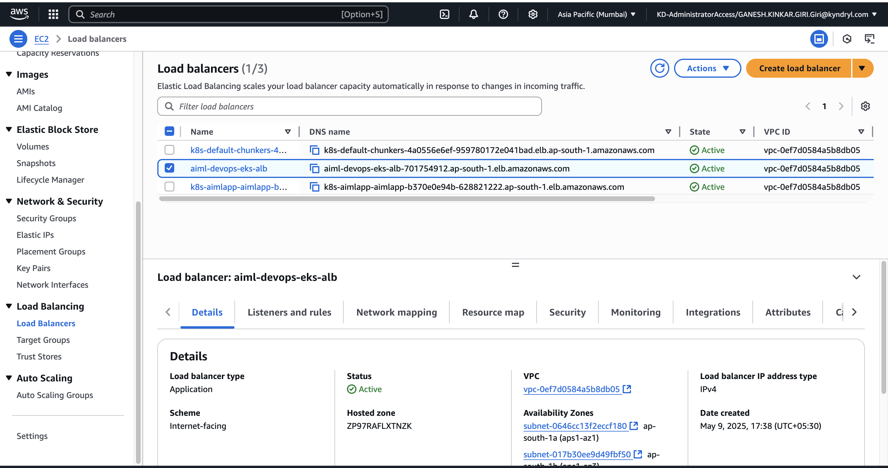


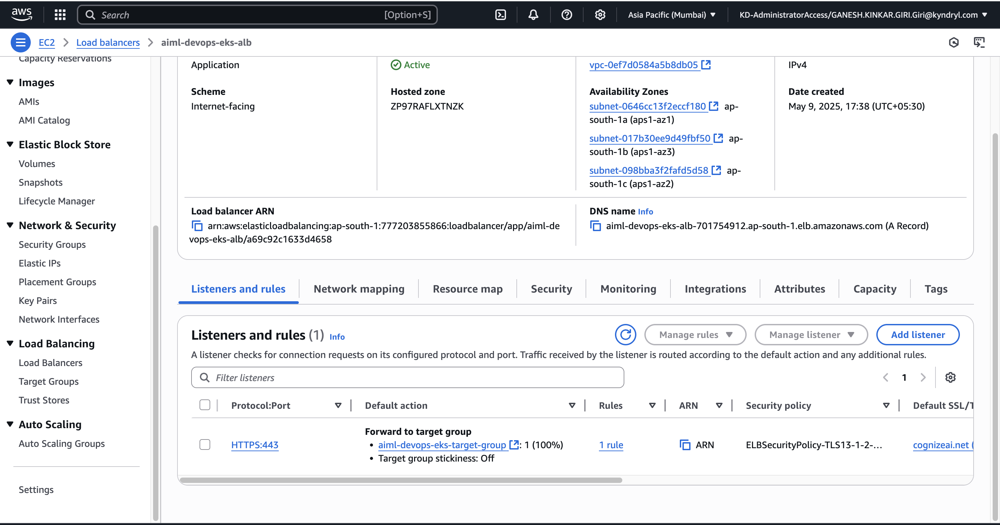

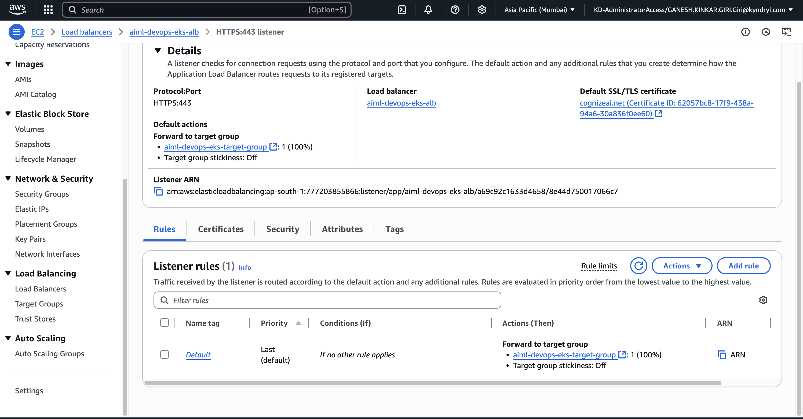

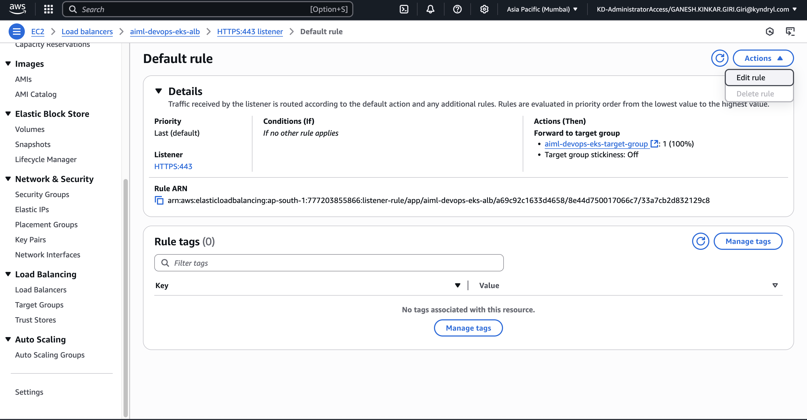

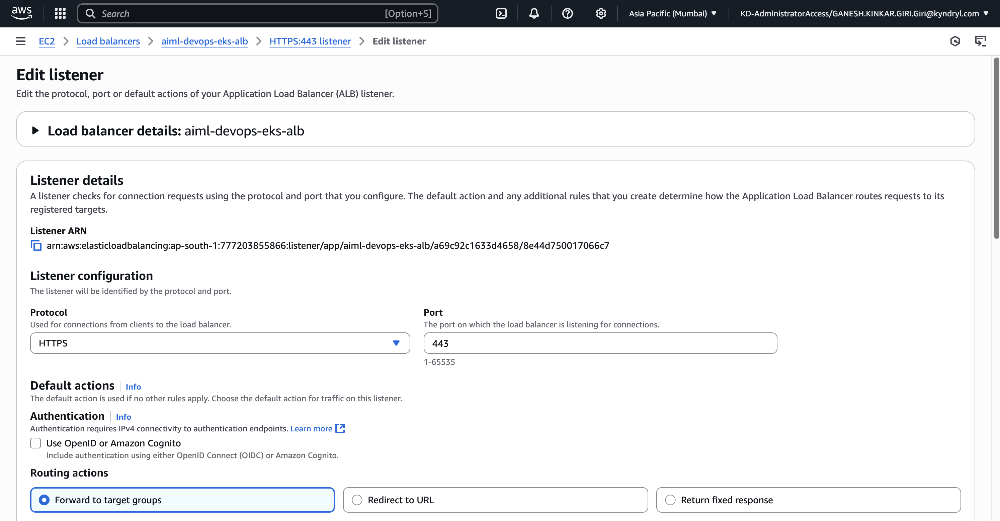

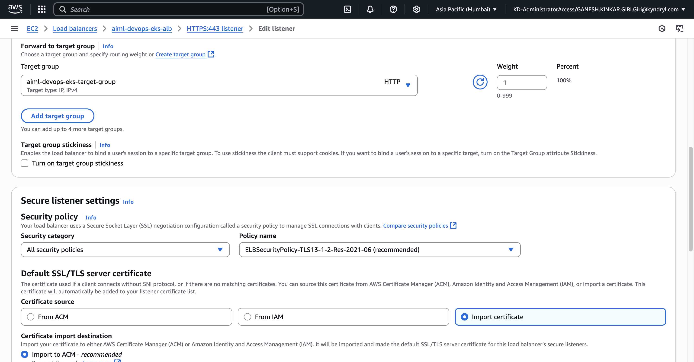

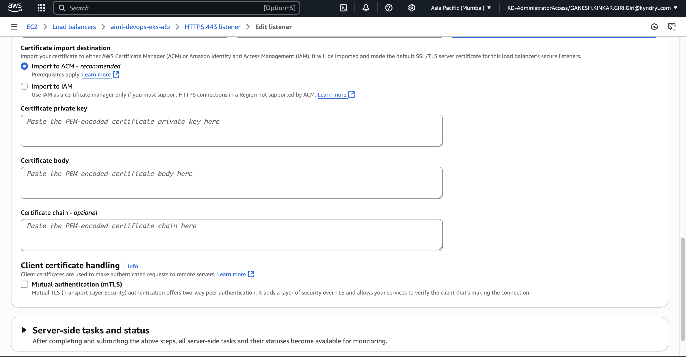

- Certificate private key (privateKey.key content)
- Certificate body (certificate.crt content)

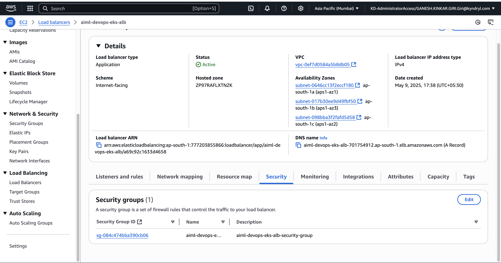

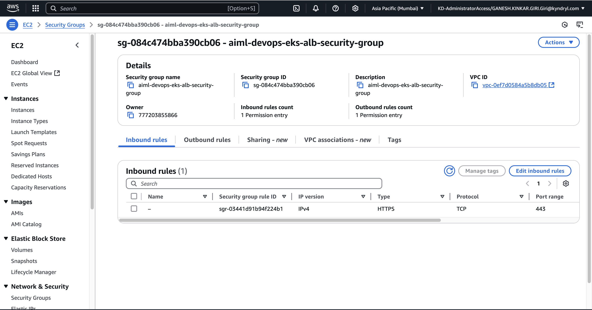

## certificate-arn

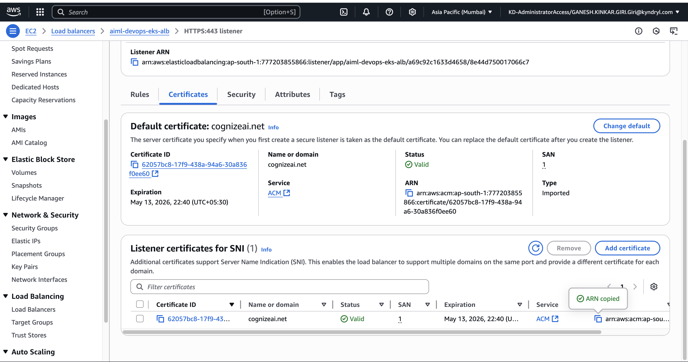

## nginx-ingress.yaml

```
apiVersion: networking.k8s.io/v1
kind: Ingress
metadata:
  name: aiml-app
  annotations:
    alb.ingress.kubernetes.io/scheme: internet-facing
    alb.ingress.kubernetes.io/target-type: ip
    alb.ingress.kubernetes.io/listen-ports: '[{"HTTPS":443}]'
    alb.ingress.kubernetes.io/certificate-arn: arn:aws:acm:ap-south-1:7772:certificate/62057bc8-17f9-438a-94a6-30
    alb.ingress.kubernetes.io/ssl-redirect: '443'
    alb.ingress.kubernetes.io/healthcheck-path: /
spec:
  ingressClassName: alb
  tls:
    - hosts:
        - cognizeai.net
      secretName: tls-secret  # optional if using ACM certificate with ALB
  rules:
    - host: cognizeai.net
      http:
        paths:
          - path: /
            pathType: Prefix
            backend:
              service:
                name: simcard-shelf-space-service
                port:
                  number: 5004
          - path: /bms
            pathType: Prefix
            backend:
              service:
                name: battery-management-system-service
                port:
                  number: 9290
          - path: /semiconductor
            pathType: Prefix
            backend:
              service:
                name: semiconductor-failure-detection-service
                port:
                  number: 5000

```

```
kubectl apply -f nginx-ingress.yaml -n aiml-app
```

```
NAME                                 CLASS   HOSTS           ADDRESS                                                                 PORTS     AGE
ingress.networking.k8s.io/aiml-app   alb     cognizeai.net   k8s-p-aimlapp-8821222.ap-south-1.elb.amazonaws.com   80, 443   24m
```

```
nslookup k8s-aimlapp-aimlapp-b370-6288.ap-south-1.elb.amazonaws.com 

Server:		49.205.72.130
Address:	49.205.72.130#53

Non-authoritative answer:
Name:	k8s-aimlapp-aimlapp-b370e0-6288.ap-south-1.elb.amazonaws.com
Address: 35.154.82.208
Name:	k8s-aimlapp-aimlapp-b370e0-6288.ap-south-1.elb.amazonaws.com
Address: 65.0.223.248
Name:	k8s-aimlapp-aimlapp-b370e0-6288.ap-south-1.elb.amazonaws.com
Address: 35.154.117.203

```

```
vi /etc/hosts

65.0.223.248 cognizeai.net
```

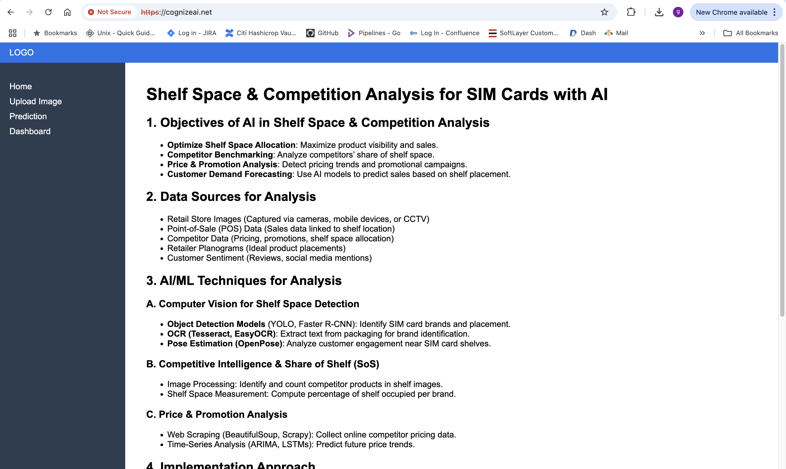


## Route 53 Dashboard 

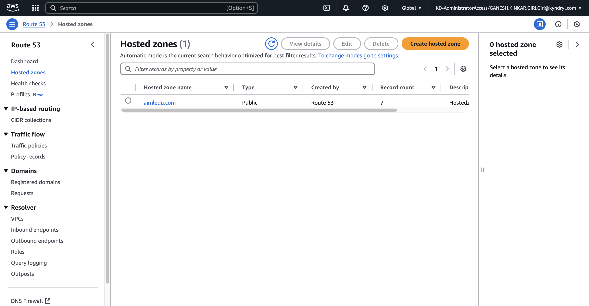

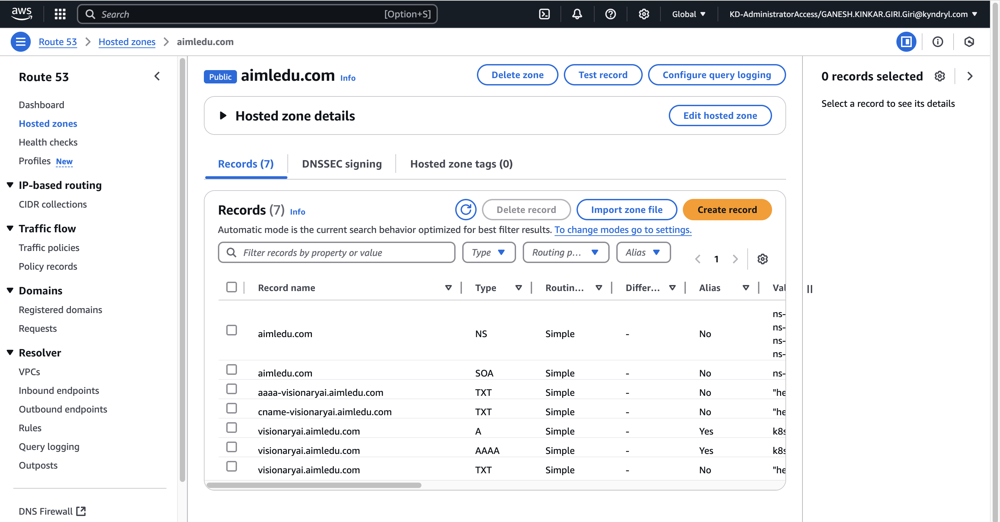

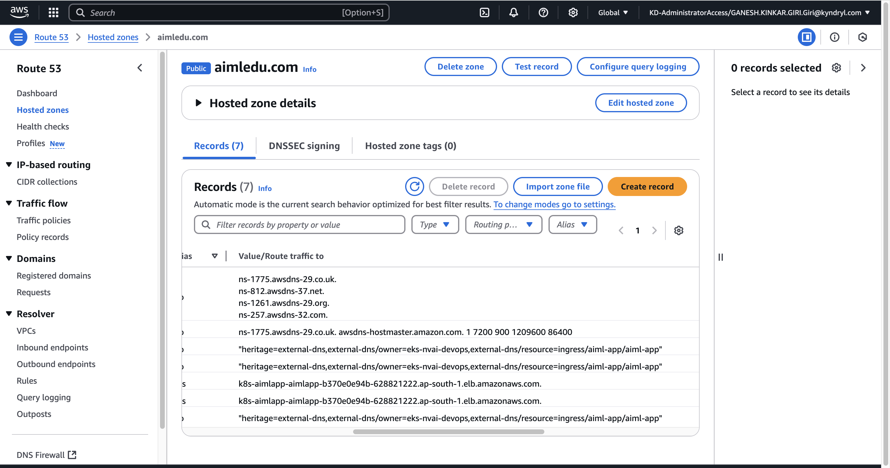

