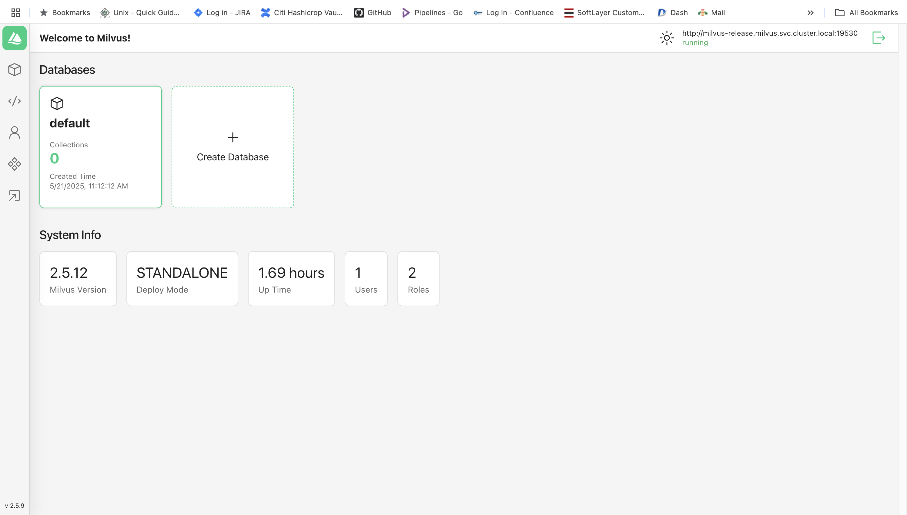

# Setup Milvus Standalone in EKS with ALB Ingress

## Create a Namespace

```
kubectl create namespace milvus
```

## Add Milvus Helm Repo

```
helm repo add milvus https://milvus-io.github.io/milvus-helm/
helm repo update
```

## milvus-nlb-values.yaml 

```
milvus-nlb-values.yaml 

cluster:
  enabled: false

etcd:
  replicaCount: 1

minio:
  mode: standalone

pulsarv3:
  enabled: false

service:
  type: LoadBalancer
  port: 19530
  annotations: 
    service.beta.kubernetes.io/aws-load-balancer-type: external
    service.beta.kubernetes.io/aws-load-balancer-name: milvus-service
    service.beta.kubernetes.io/aws-load-balancer-scheme: internet-facing
    service.beta.kubernetes.io/aws-load-balancer-nlb-target-type: ip

```

## Install Milvus Standalone via Helm

```
helm install milvus-release milvus/milvus \
  --namespace milvus \
  --create-namespace \
  -f milvus-nlb-values.yaml
```

```
kubectl -n milvus get pod,svc,ingress                                    

NAME                                            READY   STATUS    RESTARTS   AGE
pod/attu-5675f77748-c292g                       1/1     Running   0          4h40m
pod/milvus-release-etcd-0                       1/1     Running   0          12m
pod/milvus-release-minio-dc4957c7c-zd7lq        1/1     Running   0          12m
pod/milvus-release-standalone-c4c56cccf-bv9vx   1/1     Running   0          12m

NAME                                   TYPE           CLUSTER-IP       EXTERNAL-IP                                                    PORT(S)                          AGE
service/attu                           ClusterIP      172.20.234.81    <none>                                                         80/TCP                           4h40m
service/milvus-release                 LoadBalancer   172.20.122.195   milvus-service-xxxxxxxxx.elb.ap-south-1.amazonaws.com   19530:32620/TCP,9091:30682/TCP   12m
service/milvus-release-etcd            ClusterIP      172.20.190.137   <none>                                                         2379/TCP,2380/TCP                12m
service/milvus-release-etcd-headless   ClusterIP      None             <none>                                                         2379/TCP,2380/TCP                12m
service/milvus-release-minio           ClusterIP      172.20.139.189   <none>                                                         9000/TCP                         12m

NAME                                    CLASS   HOSTS                          ADDRESS                                                                 PORTS     AGE
ingress.networking.k8s.io/milvus-attu   alb     attu.visionaryai.aimledu.com   k8s-milvus-milvusat-xxxxxx.ap-south-1.elb.amazonaws.com   80, 443   3h33m
```

# Test

```
nc -vz milvus-service-xxxxxx.elb.ap-south-1.amazonaws.com 19530
Connection to milvus-service-xxxx.elb.ap-south-1.amazonaws.com port 19530 [tcp/*] succeeded!
```

# Test python

```
from pymilvus import connections

try:
    connections.connect(
        alias="default",
        host="milvus-service-b31a319c36663f78.elb.ap-south-1.amazonaws.com",
        port="19530"
    )
    print("✅ Connected to Milvus!")
except Exception as e:
    print(f"❌ Failed to connect to Milvus: {e}")
```

```
python testmilvus.py                                                     

✅ Connected to Milvus!
```

## Install attu

```
attu-deployment.yaml

apiVersion: apps/v1
kind: Deployment
metadata:
  name: attu
  namespace: milvus
spec:
  replicas: 1
  selector:
    matchLabels:
      app: attu
  template:
    metadata:
      labels:
        app: attu
    spec:
      containers:
        - name: attu
          image: zilliz/attu:v2.5
          ports:
            - containerPort: 3000
          env:
            - name: MILVUS_URL
              value: http://milvus-release.milvus.svc.cluster.local:19530

```

```
attu-service.yaml

apiVersion: v1
kind: Service
metadata:
  name: attu
  namespace: milvus
spec:
  type: ClusterIP
  selector:
    app: attu
  ports:
    - port: 80
      targetPort: 3000
      protocol: TCP
```

## Install Ingress

```
attu-ingress.yaml

apiVersion: networking.k8s.io/v1
kind: Ingress
metadata:
  name: milvus-attu
  annotations:
    alb.ingress.kubernetes.io/scheme: internet-facing
    alb.ingress.kubernetes.io/target-type: ip
    alb.ingress.kubernetes.io/listen-ports: '[{"HTTPS":443}]'
    alb.ingress.kubernetes.io/certificate-arn: arn:aws:acm:ap-south-1:777203855866:certificate/b78-98d0b00706ff
    alb.ingress.kubernetes.io/ssl-redirect: '443'
    alb.ingress.kubernetes.io/healthcheck-path: /
    alb.ingress.kubernetes.io/load-balancer-attributes: idle_timeout.timeout_seconds=900
spec:
  ingressClassName: alb
  tls:
   - hosts:
       - attu.visionaryai.aimledu.com
  rules:
    - host: attu.visionaryai.aimledu.com
      http:
        paths:
          - path: /
            pathType: Prefix
            backend:
              service:
                name: attu
                port:
                  number: 80
```

```
kubectl apply -f attu-deployment.yaml -n milvus
kubectl apply -f attu-service.yaml -n milvus
kubectl apply -f attu-ingress.yaml -n milvus
```

```
kubectl -n milvus get pod,svc,ingress
NAME                                            READY   STATUS    RESTARTS   AGE
pod/attu-5675f77748-c292g                       1/1     Running   0          115m
pod/milvus-release-etcd-0                       1/1     Running   0          139m
pod/milvus-release-minio-dc4957c7c-q5dks        1/1     Running   0          139m
pod/milvus-release-standalone-c4c56cccf-bflrx   1/1     Running   0          139m

NAME                                   TYPE        CLUSTER-IP       EXTERNAL-IP   PORT(S)              AGE
service/attu                           ClusterIP   172.20.234.81    <none>        80/TCP               115m
service/milvus-release                 ClusterIP   172.20.53.181    <none>        19530/TCP,9091/TCP   139m
service/milvus-release-etcd            ClusterIP   172.20.39.67     <none>        2379/TCP,2380/TCP    139m
service/milvus-release-etcd-headless   ClusterIP   None             <none>        2379/TCP,2380/TCP    139m
service/milvus-release-minio           ClusterIP   172.20.129.162   <none>        9000/TCP             139m

NAME                                    CLASS   HOSTS                          ADDRESS                                                                 PORTS     AGE
ingress.networking.k8s.io/milvus-attu   alb     attu.xxxxxxx.xxxxx.com   k8s-milvus-milvusat--727822688.ap-south-1.elb.amazonaws.com   80, 443   48m
```

```
nslookup attu.xxx.xxxxx 8.8.8.8

curl -k --resolve attu.xxx.xxxx.com:443:3.7.237.185 https://attu.xxxi.xxxx.com
```
```
/etc/hosts

3.7.237.185 attu.xxxx.axxxx.com
```




