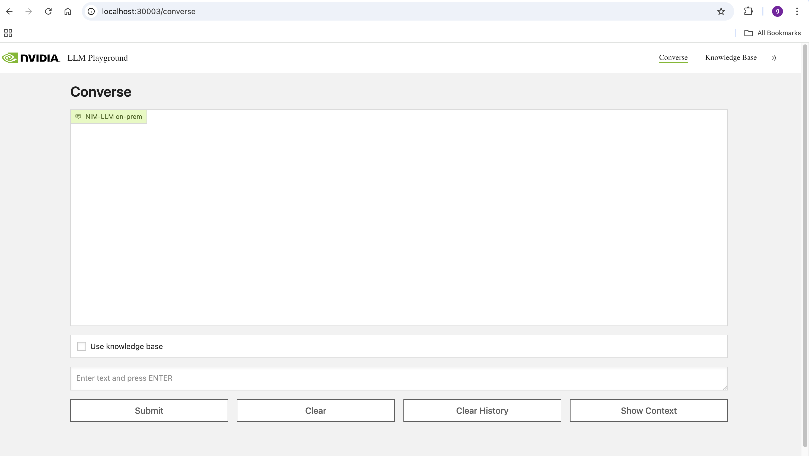

# RAG Application: Multiturn Chatbot
Multi Turn RAG

This example showcases multi turn usecase in a RAG pipeline. It stores the conversation history and knowledge base in Milvus and retrieves them at runtime to understand contextual queries. It uses NeMo Inference Microservices to communicate with the embedding model and large language model. The example supports ingestion of PDF, .txt files. The docs are ingested in a dedicated document vectorstore. The prompt for the example is currently tuned to act as a document chat bot. For maintaining the conversation history, we store the previous query of user and its generated answer as a text entry in a different dedicated vectorstore for conversation history. Both these vectorstores are part of a Langchain LCEL chain as Langchain Retrievers. When the chain is invoked with a query, its passed through both the retrievers. The retriever retrieves context from the document vectorstore and the closest matching conversation history from conversation history vectorstore and the chunks are added into the LLM prompt as part of the chain.

Prerequisites:
- You have the NGC CLI available on your client machine. You can download the CLI from https://ngc.nvidia.com/setup/installers/cli.

- You have Kubernetes installed and running Ubuntu 22.04. Refer to the Kubernetes documentation or the NVIDIA Cloud Native Stack repository for more information.

- You have a default storage class available in the cluster for PVC provisioning. One option is the local path provisioner by Rancher. Refer to the installation section of the README in the GitHub repository.

https://github.com/rancher/local-path-provisioner?tab=readme-ov-file#installation


```
kubectl apply -f https://raw.githubusercontent.com/rancher/local-path-provisioner/v0.0.26/deploy/local-path-storage.yaml

kubectl get pods -n local-path-storage

kubectl get storageclass

```

- If the local path storage class is not set as default, it can be made default using the command below

```
kubectl patch storageclass local-path -p '{"metadata": {"annotations":{"storageclass.kubernetes.io/is-default-class":"true"}}}'
```

## Deployment:

1. Fetch the helm chart from NGC

```
helm fetch https://helm.ngc.nvidia.com/nvidia/aiworkflows/charts/rag-app-multiturn-chatbot-24.08.tgz --username='$oauthtoken' --password=<YOUR API KEY>
```

2. Deploy NVIDIA NIM LLM, NVIDIA NeMo Retriever Embedding and NVIDIA NeMo Retriever Ranking Microservice following steps in this section.

3. Deploy Milvus vectorstore following steps in this section.

4. Create the example namespace

```
kubectl create namespace multiturn-rag
```

5. Export the NGC API Key in the environment.

```
export NGC_CLI_API_KEY="<YOUR NGC API KEY>"
```

6. Create the Helm pipeline instance and start the services.

```
helm install multiturn-rag rag-app-multiturn-chatbot-24.08.tgz -n multiturn-rag --set imagePullSecret.password=$NGC_CLI_API_KEY
```

7. Verify the pods are running and ready.

```
kubectl get pods -n multiturn-rag
```

8. Access the app using port-forwarding.

```
kubectl port-forward service/rag-playground-multiturn-rag -n multiturn-rag 30003:3001
```

```Open browser and access the rag-playground UI using http://localhost:30003/converse```




