# 1. Set Up VPC with Private Subnets

- Create a VPC with public and private subnets.
- Private Subnet: This subnet will host the EKS nodes and won't have direct access to the internet.
- Public Subnet: This subnet will have a NAT Gateway that allows the EKS nodes to access the internet indirectly.

## 1. Create a VPC
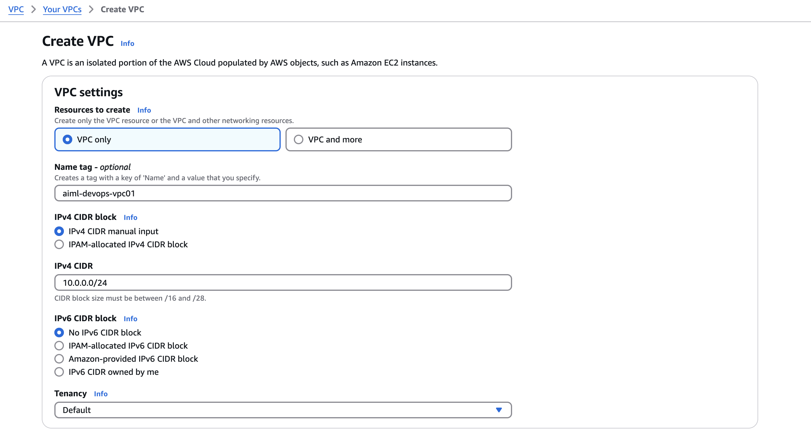
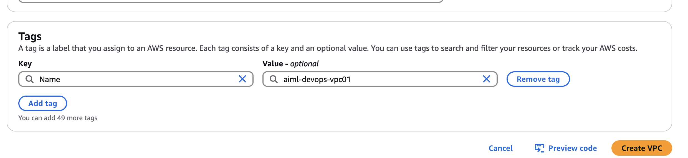


## 2. Create Subnet(Private & Public)

**Private Subnet:**

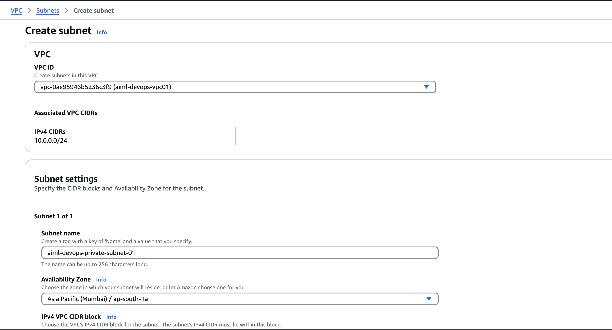
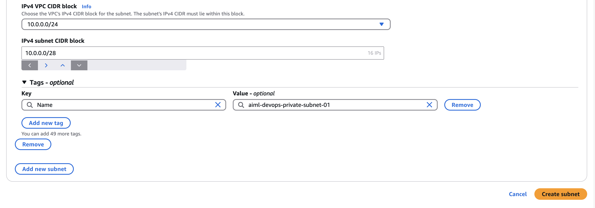

**Public Subnet:**
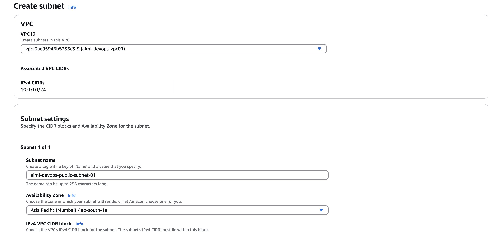
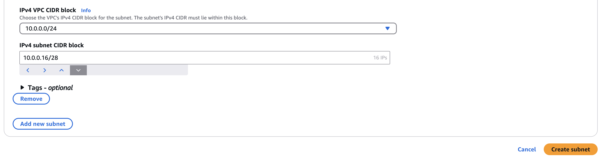


# 2. Create NAT Gateway

- Elastic IP: First, allocate an Elastic IP (EIP) for the NAT Gateway.
- NAT Gateway: Create a NAT Gateway in the public subnet using the EIP. This will allow instances in the private subnet to access the internet.

**Elastic IP:**
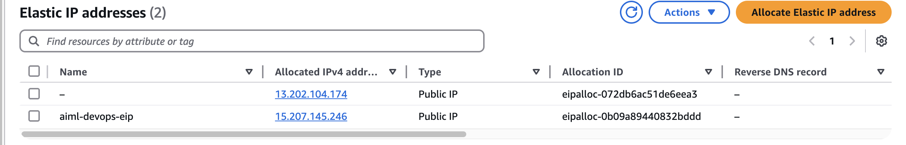

**NAT Gateway:**

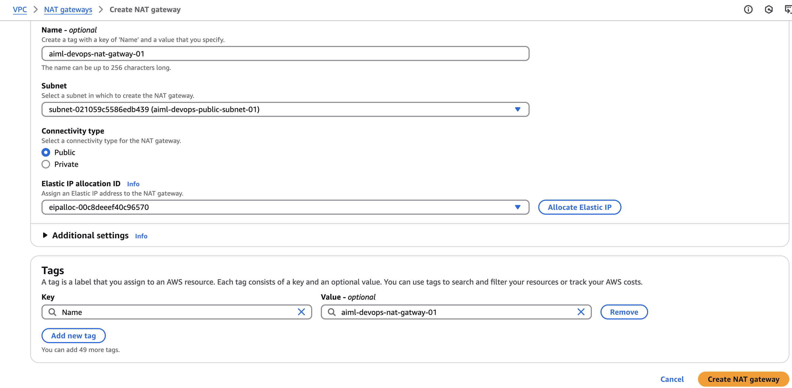
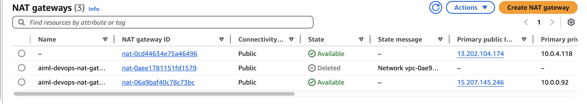

# 3. Configure Route Tables

- Public Route Table: Ensure the public subnet route table has a route for 0.0.0.0/0 pointing to the Internet Gateway.
- Private Route Table: For private subnets, configure the route table to route traffic for 0.0.0.0/0 to the NAT Gateway. - - This enables EKS nodes in private subnets to access the internet for updates, pulling container images, etc.


**Internet gateways:**
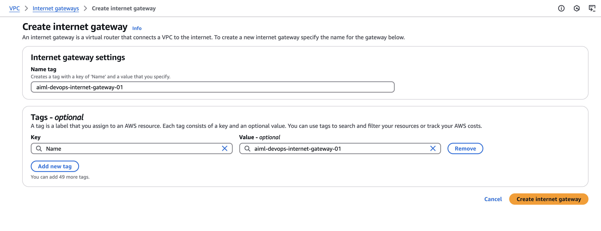
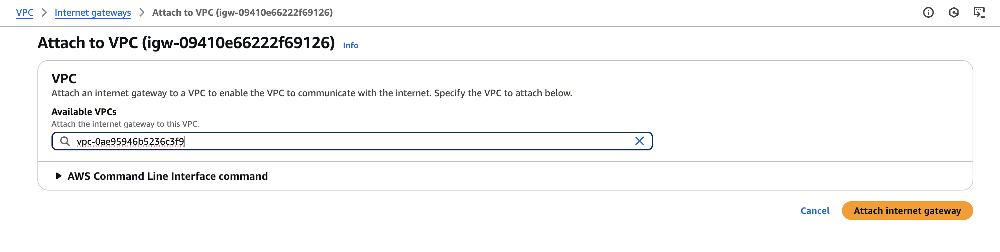

**Public Route Table:**
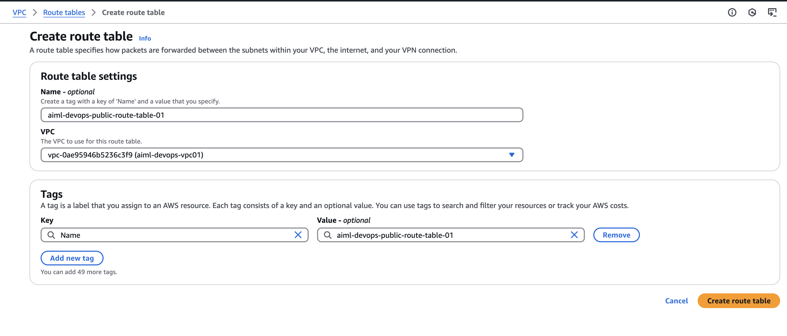
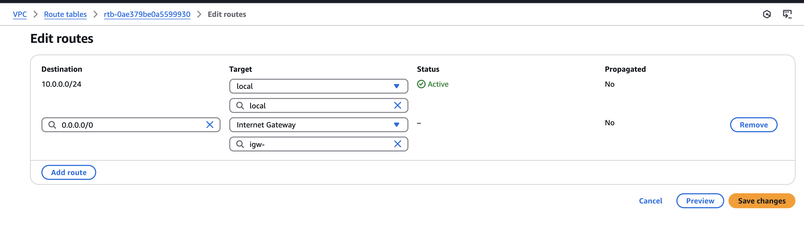
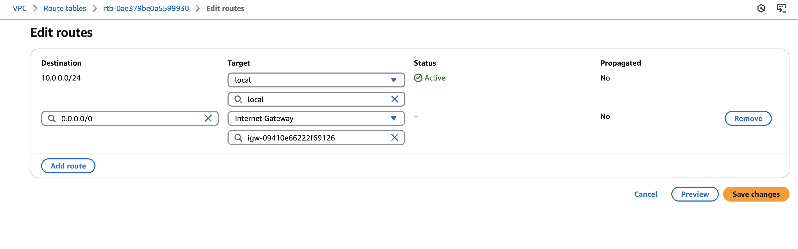

**Private Route Table:**
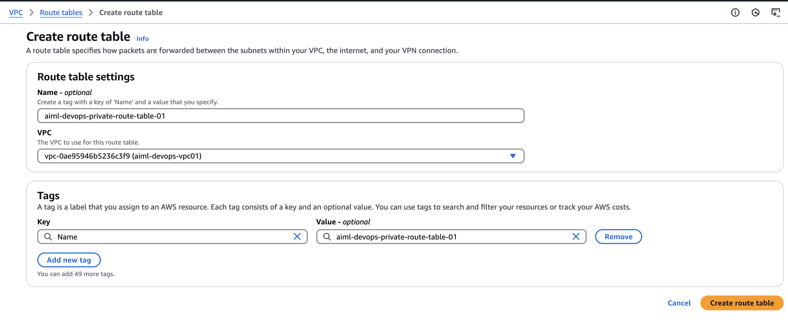
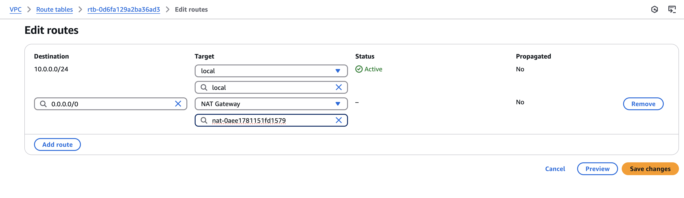


# 4. Set Up EKS Cluster in Private Subnets

- When creating your EKS cluster, make sure to select the private subnets for your worker nodes.
- Ensure that the EKS nodes are configured to communicate with the NAT Gateway by routing their internet-bound traffic   through the private subnet route table.


## Amazon Elastic Kubernetes Service

## Create EKS cluster

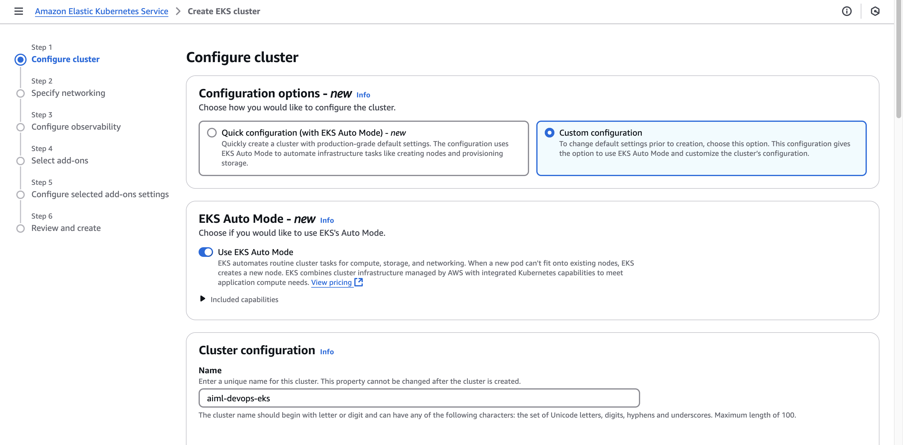
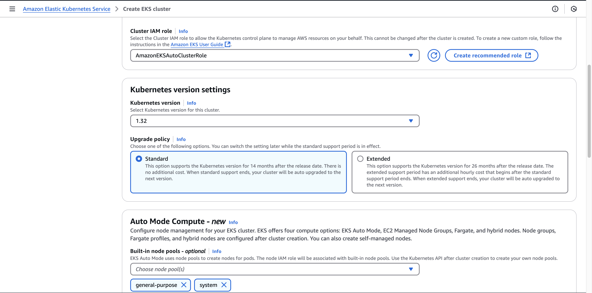
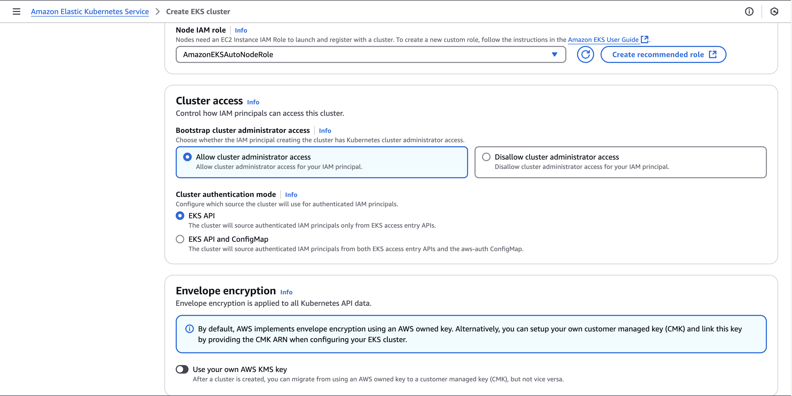
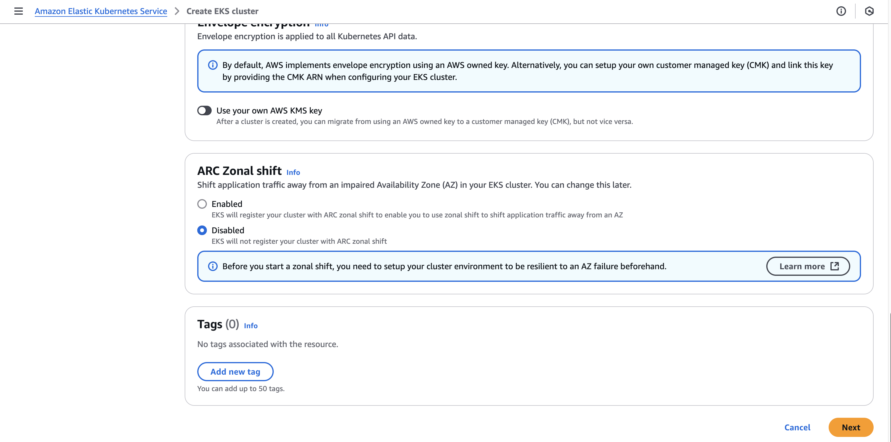
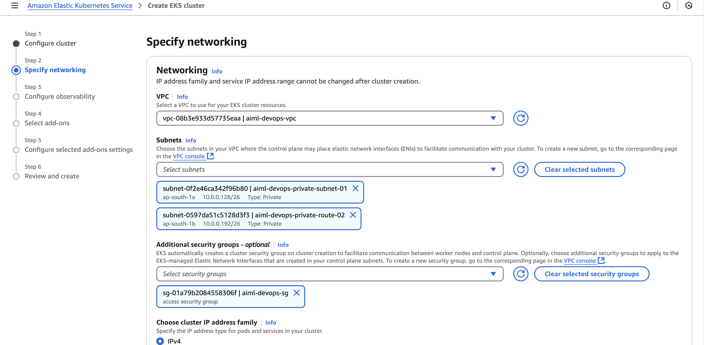
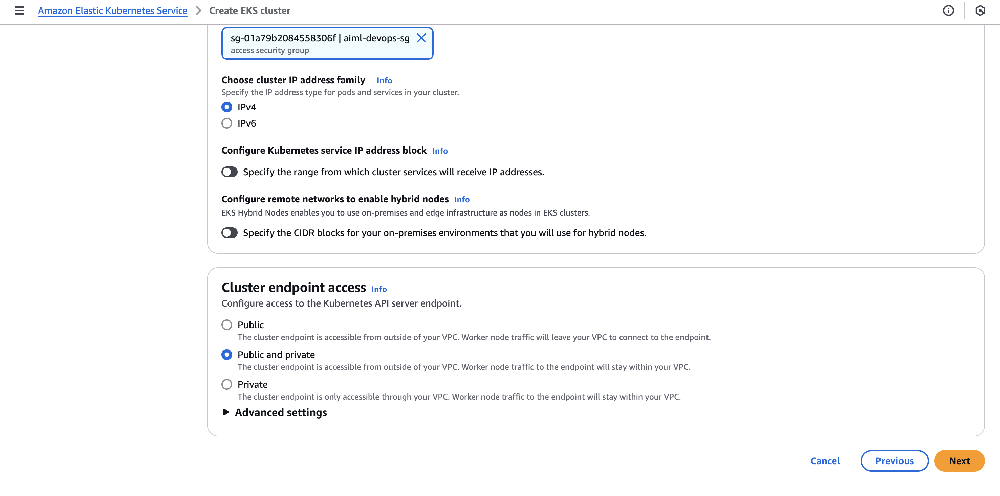
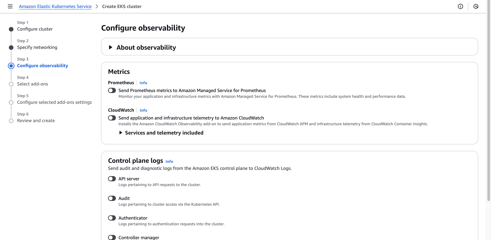
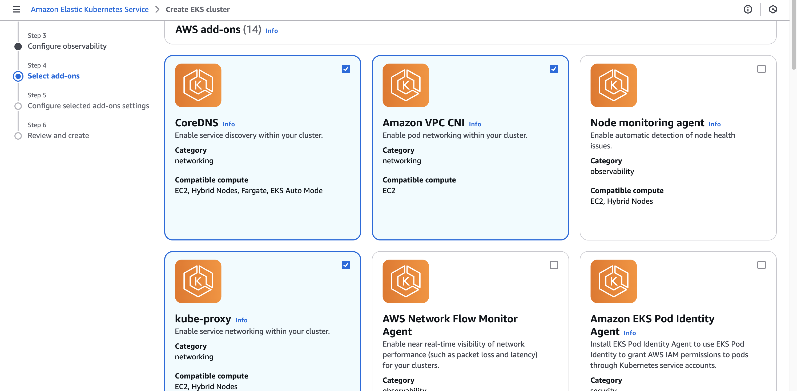

# 7. Security Group Configuration

- Ensure that the security groups attached to your EKS worker nodes allow outbound traffic to the internet (through the - NAT Gateway) and inbound traffic from your application services.


## Add-ons
1. kube-proxy
2. CoreDNS
3. Metrics Server
4. Amazon VPC CNI
5. Prometheus Node Exporter
6. Amazon EBS CSI Driver
7. Mountpoint for Amazon S3 CSI Driver 


eks-worker-node-policy
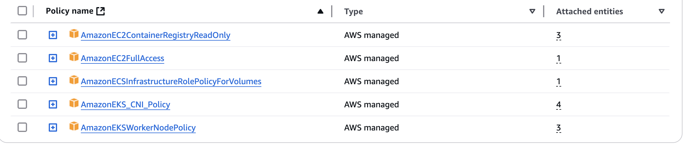


# Installing the NVIDIA GPU Operator

1. **Add the NVIDIA Helm repository:**
```
helm repo add nvidia https://helm.ngc.nvidia.com/nvidia \
    && helm repo update
```

2. **Install the GPU Operator.**

```
helm install --wait --generate-name \
    -n gpu-operator --create-namespace \
    nvidia/gpu-operator \
    --version=v25.3.0
```


# ✅ Verify NVIDIA Plugin Installed
Check the NVIDIA device plugin DaemonSet:

```
kubectl get daemonset -n nvidia-gpu-operator| grep nvidia
```

- **You should see:**

```
gpu-feature-discovery                                   1         1         1       1            1           nvidia.com/gpu.deploy.gpu-feature-discovery=true                       12m
nvidia-container-toolkit-daemonset                      1         1         1       1            1           nvidia.com/gpu.deploy.container-toolkit=true                           12m
nvidia-dcgm-exporter                                    1         1         1       1            1           nvidia.com/gpu.deploy.dcgm-exporter=true                               12m
nvidia-device-plugin-daemonset                          1         1         1       1            1           nvidia.com/gpu.deploy.device-plugin=true                               12m
nvidia-device-plugin-mps-control-daemon                 0         0         0       0            0           nvidia.com/gpu.deploy.device-plugin=true,nvidia.com/mps.capable=true   12m
nvidia-driver-daemonset                                 0         0         0       0            0           nvidia.com/gpu.deploy.driver=true                                      12m
nvidia-mig-manager                                      0         0         0       0            0           nvidia.com/gpu.deploy.mig-manager=true                                 12m
nvidia-operator-validator                               1         1         1       1            1           nvidia.com/gpu.deploy.operator-validator=true                          12m

```


- **Install it (if not present):**

```
kubectl apply -f https://raw.githubusercontent.com/NVIDIA/k8s-device-plugin/v0.14.1/nvidia-device-plugin.yml
```

```
ganeshkinkargiri.@M7QJY5-A67EFC4A ~ % kubectl apply -f https://raw.githubusercontent.com/NVIDIA/k8s-device-plugin/v0.14.1/nvidia-device-plugin.yml

daemonset.apps/nvidia-device-plugin-daemonset created
ganeshkinkargiri.@M7QJY5-A67EFC4A ~ % 
```

```
ganeshkinkargiri.@M7QJY5-A67EFC4A ~ % kubectl get pod -A                                                                                          
NAMESPACE     NAME                                   READY   STATUS    RESTARTS   AGE
kube-system   aws-node-frfnv                         2/2     Running   0          10h
kube-system   aws-node-hx576                         2/2     Running   0          19m
kube-system   coredns-6799d65cb-n6jbt                1/1     Running   0          9h
kube-system   coredns-6799d65cb-tw92r                1/1     Running   0          10h
kube-system   kube-proxy-n5w89                       1/1     Running   0          10h
kube-system   kube-proxy-ww9cm                       1/1     Running   0          19m
kube-system   metrics-server-5c998cf5dc-hrlc9        1/1     Running   0          9h
kube-system   metrics-server-5c998cf5dc-t5d5d        1/1     Running   0          10h
kube-system   nvidia-device-plugin-daemonset-tcmzw   1/1     Running   0          12s
ganeshkinkargiri.@M7QJY5-A67EFC4A ~ % 
```

```
ganeshkinkargiri.@M7QJY5-A67EFC4A ~ % kubectl get daemonset -n kube-system | grep nvidia                                                          
nvidia-device-plugin-daemonset   1         1         1       1            1           <none>          63s
ganeshkinkargiri.@M7QJY5-A67EFC4A ~ % 
```

## Create Namespace

```
ganeshkinkargiri.@M7QJY5-A67EFC4A ~ % kubectl create namespace nvidia-gpu-smi
namespace/nvidia-gpu-smi created
ganeshkinkargiri.@M7QJY5-A67EFC4A ~ % 
```

```
apiVersion: v1
kind: Pod
metadata:
  name: nvidia-smi
  namespace: gpu-test
spec:
  restartPolicy: Never
  containers:
  - name: nvidia
    image: nvidia/cuda:12.2.0-base-ubuntu20.04
    command: ["nvidia-smi"]
    resources:
      limits:
        nvidia.com/gpu: 1
```
```
ganeshkinkargiri.@M7QJY5-A67EFC4A ~ % kubectl apply -f nvidia-gpu-test.yaml  
pod/gpu-check created
ganeshkinkargiri.@M7QJY5-A67EFC4A ~ % 
```

```
ganeshkinkargiri.@M7QJY5-A67EFC4A ~ % kubectl -n nvidia-gpu-smi get pod        
NAME         READY   STATUS      RESTARTS   AGE
nvidia-smi   0/1     Completed   0          43s
ganeshkinkargiri.@M7QJY5-A67EFC4A ~ % 
```

```
ganeshkinkargiri.@M7QJY5-A67EFC4A ~ % kubectl logs -n nvidia-gpu-smi nvidia-smi

Fri Apr 18 06:37:40 2025 
```      
+-----------------------------------------------------------------------------------------+
| NVIDIA-SMI 550.144.03             Driver Version: 550.144.03     CUDA Version: 12.4     |
|-----------------------------------------+------------------------+----------------------+
| GPU  Name                 Persistence-M | Bus-Id          Disp.A | Volatile Uncorr. ECC |
| Fan  Temp   Perf          Pwr:Usage/Cap |           Memory-Usage | GPU-Util  Compute M. |
|                                         |                        |               MIG M. |
|=========================================+========================+======================|
|   0  NVIDIA A10G                    On  |   00000000:00:1E.0 Off |                    0 |
|  0%   23C    P8              9W /  300W |       1MiB /  23028MiB |      0%      Default |
|                                         |                        |                  N/A |
+-----------------------------------------+------------------------+----------------------+
                                                                                         
+-----------------------------------------------------------------------------------------+
| Processes:                                                                              |
|  GPU   GI   CI        PID   Type   Process name                              GPU Memory |
|        ID   ID                                                               Usage      |
|=========================================================================================|
|  No running processes found                                                             |
+-----------------------------------------------------------------------------------------+


## NVIDIA GPU Driver already installed with  Amazon AMI
- Run this to confirm GPU driver:
    - **nvidia-smi**

+-----------------------------------------------------------------------------------------+
| NVIDIA-SMI 550.144.03             Driver Version: 550.144.03     CUDA Version: 12.4     |
|-----------------------------------------+------------------------+----------------------+

# ✅ Step 2: Install NVIDIA GPU Operator via Helm (Recommended)
You’ll deploy the NVIDIA GPU Operator, which automatically handles driver/toolkit/monitoring inside Kubernetes.

## 🛠️ 1. Create the gpu-operator namespace

```
ganeshkinkargiri.@M7QJY5-A67EFC4A ~ % kubectl create namespace gpu-operator
namespace/gpu-operator created
ganeshkinkargiri.@M7QJY5-A67EFC4A ~ % 
```

## 🛠️ 2. Add NVIDIA Helm repo

```
ganeshkinkargiri.@M7QJY5-A67EFC4A ~ helm repo add nvidia https://nvidia.github.io/gpu-operator
"nvidia" has been added to your repositories
ganeshkinkargiri.@M7QJY5-A67EFC4A ~ %
```

```
ganeshkinkargiri.@M7QJY5-A67EFC4A ~ % helm repo update
Hang tight while we grab the latest from your chart repositories...
...Successfully got an update from the "nvidia" chart repository
Update Complete. ⎈Happy Helming!⎈
ganeshkinkargiri.@M7QJY5-A67EFC4A ~ %
```

```
ganeshkinkargiri.@M7QJY5-A67EFC4A ~ % helm install --wait --generate-name \
  -n gpu-operator \
  nvidia/gpu-operator

W0418 12:22:46.210733   42738 warnings.go:70] spec.template.spec.affinity.nodeAffinity.preferredDuringSchedulingIgnoredDuringExecution[0].preference.matchExpressions[0].key: node-role.kubernetes.io/master is use "node-role.kubernetes.io/control-plane" instead
W0418 12:22:46.215110   42738 warnings.go:70] spec.template.spec.affinity.nodeAffinity.preferredDuringSchedulingIgnoredDuringExecution[0].preference.matchExpressions[0].key: node-role.kubernetes.io/master is use "node-role.kubernetes.io/control-plane" instead
NAME: gpu-operator-1744959159
LAST DEPLOYED: Fri Apr 18 12:22:42 2025
NAMESPACE: gpu-operator
STATUS: deployed
REVISION: 1
TEST SUITE: None
ganeshkinkargiri.@M7QJY5-A67EFC4A ~ % 
```

```
ganeshkinkargiri.@M7QJY5-A67EFC4A ~ % kubectl -n gpu-operator get pod
NAME                                                              READY   STATUS      RESTARTS   AGE
gpu-feature-discovery-jkjlt                                       1/1     Running     0          15m
gpu-operator-1744959159-node-feature-discovery-gc-656c869cpktzs   1/1     Running     0          15m
gpu-operator-1744959159-node-feature-discovery-master-79f87fxj4   1/1     Running     0          15m
gpu-operator-1744959159-node-feature-discovery-worker-kfw2t       1/1     Running     0          15m
gpu-operator-1744959159-node-feature-discovery-worker-vj94m       1/1     Running     0          15m
gpu-operator-85746cf4fc-gclqb                                     1/1     Running     0          15m
nvidia-container-toolkit-daemonset-r5vmj                          1/1     Running     0          15m
nvidia-cuda-validator-4zwr6                                       0/1     Completed   0          15m
nvidia-dcgm-exporter-pvlsj                                        1/1     Running     0          15m
nvidia-device-plugin-daemonset-m9bk5                              1/1     Running     0          15m
nvidia-operator-validator-hgq8r                                   1/1     Running     0          15m
ganeshkinkargiri.@M7QJY5-A67EFC4A ~ % 
```

kubectl port-forward nvidia-dcgm-exporter-pvlsj 9400:9400 -n gpu-operator

curl http://localhost:9400/metrics


# Monitoring GPUs in Kubernetes with DCGM

# NVIDIA DCGM
NVIDIA DCGM is a set of tools for managing and monitoring NVIDIA GPUs in large-scale, Linux-based cluster environments.

DCGM includes APIs for gathering GPU telemetry. Of particular interest are GPU utilization metrics (for monitoring Tensor Cores, FP64 units, and so on), memory metrics, and interconnect traffic metrics. 

## DCGM exporter
Monitoring stacks usually consist of a collector, a time-series database to store metrics, and a visualization layer. A popular open-source stack is **Prometheus**, used along with **Grafana** as the visualization tool to create rich dashboards. Prometheus also includes **Alertmanager** to create and manage alerts. Prometheus is deployed along with **kube-state-metrics** and **node_exporter** to expose cluster-level metrics for Kubernetes API objects and node-level metrics such as CPU utilization. Figure 1 shows a sample architecture of Prometheus.


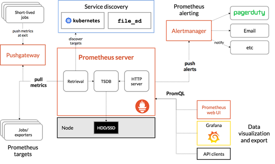

## Per-pod GPU metrics in a Kubernetes cluster
dcgm-exporter collects metrics for all available GPUs on a node. However, in Kubernetes, you might not necessarily know which GPUs in a node would be assigned to a pod when it requests GPU resources. Starting in v1.13, kubelet has added a device monitoring feature that lets you find out the assigned devices to the pod—pod name, pod namespace, and device ID—using a pod-resources socket.

The http server in dcgm-exporter connects to the kubelet pod-resources server (/var/lib/kubelet/pod-resources) to identify the GPU devices running on a pod and appends the GPU devices pod information to the metrics collected.


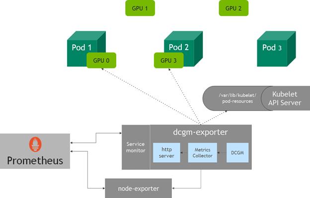

Here are some examples of setting up **dcgm-exporter**. If you use the **NVIDIA GPU Operator**, then dcgm-exporter is one of the components deployed as part of the operator.

```
$ helm repo add prometheus-community \
https://prometheus-community.github.io/helm-charts

$ helm repo update
$ helm inspect values prometheus-community/kube-prometheus-stack > /tmp/kube-prometheus-stack.values
# Edit /tmp/kube-prometheus-stack.values in your favorite editor
# according to the documentation
# This exposes the service via NodePort so that Prometheus/Grafana
# are accessible outside the cluster with a browser
$ helm install prometheus-community/kube-prometheus-stack \
--create-namespace --namespace prometheus \
--generate-name \
--set prometheus.service.type=NodePort \
--set prometheus.prometheusSpec.serviceMonitorSelectorNilUsesHelmValues=false
```

## Installing dcgm-exporter 

Here’s how to get started installing dcgm-exporter to monitor GPU performance and utilization. You use the Helm chart for setting up dcgm-exporter. First, add the Helm repo:

```
$ helm repo add gpu-helm-charts \
https://nvidia.github.io/gpu-monitoring-tools/helm-charts
```

```
$ helm repo update
```

Then, install the chart using Helm:

```
$ helm install \
   --generate-name \
   gpu-helm-charts/dcgm-exporter
```

Using the Grafana service exposed at port 32032, access the Grafana homepage. Log in to the dashboard using the credentials available in the Prometheus chart: the adminPassword field in prometheus.values.

To now start a Grafana dashboard for GPU metrics, import the reference NVIDIA dashboard from Grafana Dashboards.

[!grafana_import_url](https://grafana.com/grafana/dashboards/12239-nvidia-dcgm-exporter-dashboard/)

## Using the DCGM dashboard

```
kubectl port-forward -n prometheus service/kube-prometheus-stack-1744977651-grafana 32032:80
```

http://127.0.0.1:32032


```
kubectl -n gpu-operator port-forward svc/nvidia-dcgm-exporter 9400:9400
```


1. Login to Graphana
2. User: admin, credentials available in the Prometheus chart: the adminPassword field in prometheus.values. 
          adminUser: admin
          adminPassword: prom-xxxxxxx

3. Click Dashboard
4. New...
5. Import

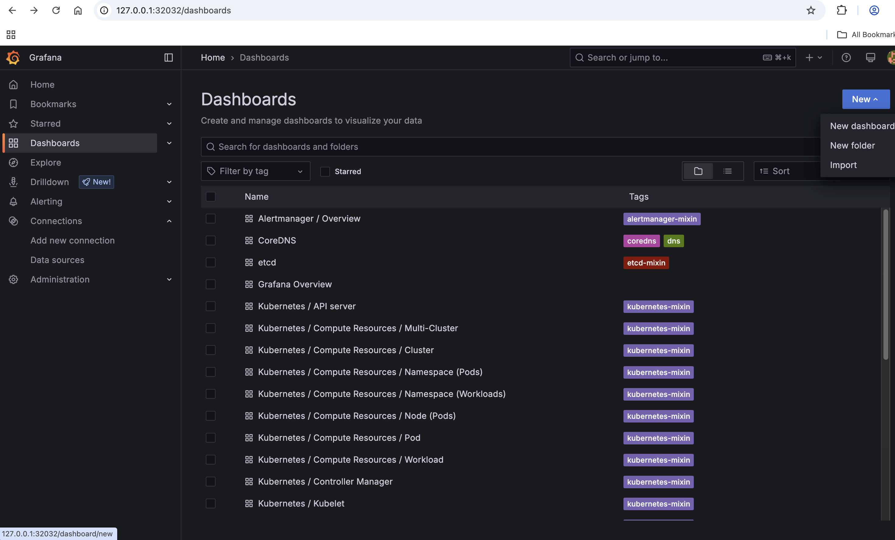

use this URL: https://grafana.com/grafana/dashboards/12239-nvidia-dcgm-exporter-dashboard/

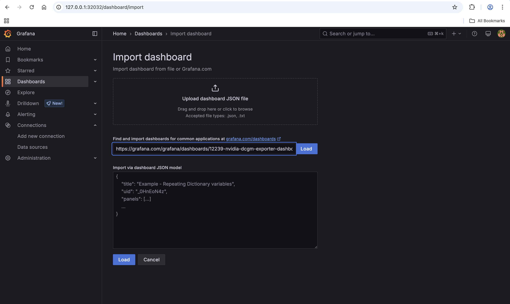

Select Prometheus and finally Load

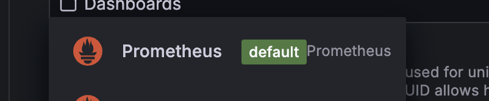


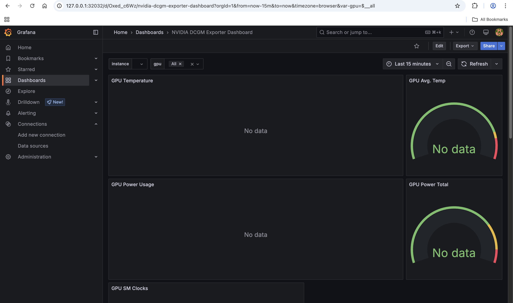


```
NAMESPACE        NAME                                                              READY   STATUS      RESTARTS   AGE
default          grafana-74d4987685-cnrth                                          1/1     Running     0          6h33m
gpu-operator     gpu-feature-discovery-jkjlt                                       1/1     Running     0          7h29m
gpu-operator     gpu-operator-1744959159-node-feature-discovery-gc-656c869cpktzs   1/1     Running     0          7h29m
gpu-operator     gpu-operator-1744959159-node-feature-discovery-master-79f87fxj4   1/1     Running     0          7h29m
gpu-operator     gpu-operator-1744959159-node-feature-discovery-worker-kfw2t       1/1     Running     0          7h29m
gpu-operator     gpu-operator-1744959159-node-feature-discovery-worker-vj94m       1/1     Running     0          7h29m
gpu-operator     gpu-operator-85746cf4fc-gclqb                                     1/1     Running     0          7h29m
gpu-operator     nvidia-container-toolkit-daemonset-r5vmj                          1/1     Running     0          7h29m
gpu-operator     nvidia-cuda-validator-4zwr6                                       0/1     Completed   0          7h28m
gpu-operator     nvidia-dcgm-exporter-pvlsj                                        1/1     Running     0          7h29m
gpu-operator     nvidia-device-plugin-daemonset-m9bk5                              1/1     Running     0          7h29m
gpu-operator     nvidia-operator-validator-hgq8r                                   1/1     Running     0          7h29m
kube-system      aws-node-frfnv                                                    2/2     Running     0          18h
kube-system      aws-node-hx576                                                    2/2     Running     0          8h
kube-system      coredns-6799d65cb-n6jbt                                           1/1     Running     0          18h
kube-system      coredns-6799d65cb-tw92r                                           1/1     Running     0          18h
kube-system      ebs-csi-controller-7bdbc84dfb-hg2x7                               6/6     Running     0          5h58m
kube-system      ebs-csi-controller-7bdbc84dfb-n9jbg                               6/6     Running     0          5h58m
kube-system      ebs-csi-node-jblfb                                                3/3     Running     0          5h58m
kube-system      ebs-csi-node-qhdjs                                                3/3     Running     0          5h58m
kube-system      kube-proxy-n5w89                                                  1/1     Running     0          18h
kube-system      kube-proxy-ww9cm                                                  1/1     Running     0          8h
kube-system      metrics-server-5c998cf5dc-hrlc9                                   1/1     Running     0          18h
kube-system      metrics-server-5c998cf5dc-t5d5d                                   1/1     Running     0          18h
kube-system      nvidia-device-plugin-daemonset-jhgpn                              1/1     Running     0          7h47m
kube-system      nvidia-device-plugin-daemonset-tcmzw                              1/1     Running     0          8h
kube-system      s3-csi-node-9fnkm                                                 3/3     Running     0          5h58m
kube-system      s3-csi-node-m8xn4                                                 3/3     Running     0          5h58m
nvidia-gpu-smi   nvidia-smi                                                        0/1     Completed   0          7h44m
prometheus       alertmanager-kube-prometheus-stack-1744-alertmanager-0            2/2     Running     0          140m
prometheus       kube-prometheus-stack-1744-operator-57fb44cf74-9dtwj              1/1     Running     0          140m
prometheus       kube-prometheus-stack-1744977651-grafana-5988f98874-bb4xd         3/3     Running     0          140m
prometheus       kube-prometheus-stack-1744977651-kube-state-metrics-6db49d8w5zm   1/1     Running     0          140m
prometheus       kube-prometheus-stack-1744977651-prometheus-node-exporter-7b48v   1/1     Running     0          140m
prometheus       kube-prometheus-stack-1744977651-prometheus-node-exporter-wgv5s   1/1     Running     0          140m
prometheus       prometheus-kube-prometheus-stack-1744-prometheus-0                2/2     Running     0          140m
ganeshkinkargiri.@M7QJY5-A67EFC4A ~ % 
```


ganeshkinkargiri.@M7QJY5-A67EFC4A ~ % kubectl taint nodes ip-10-0-150-130.ap-south-1.compute.internal nvidia.com/gpu-only=true:NoSchedule
node/ip-10-0-150-130.ap-south-1.compute.internal tainted
ganeshkinkargiri.@M7QJY5-A67EFC4A ~ % 


# Reference Linking

[DCGM](https://developer.nvidia.com/blog/monitoring-gpus-in-kubernetes-with-dcgm/)

[Deploy Prometheus using Helm](https://docs.aws.amazon.com/eks/latest/userguide/deploy-prometheus.html)


# Others

ganeshkinkargiri.@M7QJY5-A67EFC4A ~ % helm repo add grafana https://grafana.github.io/helm-charts
"grafana" has been added to your repositories
ganeshkinkargiri.@M7QJY5-A67EFC4A ~ % helm repo update
Hang tight while we grab the latest from your chart repositories...
...Successfully got an update from the "nvidia" chart repository
...Successfully got an update from the "grafana" chart repository
Update Complete. ⎈Happy Helming!⎈
ganeshkinkargiri.@M7QJY5-A67EFC4A ~ % 
ganeshkinkargiri.@M7QJY5-A67EFC4A ~ % 
ganeshkinkargiri.@M7QJY5-A67EFC4A ~ % helm install grafana grafana/grafana
NAME: grafana
LAST DEPLOYED: Fri Apr 18 13:18:51 2025
NAMESPACE: default
STATUS: deployed
REVISION: 1
NOTES:
1. Get your 'admin' user password by running:

   kubectl get secret --namespace default grafana -o jsonpath="{.data.admin-password}" | base64 --decode ; echo


2. The Grafana server can be accessed via port 80 on the following DNS name from within your cluster:

   grafana.default.svc.cluster.local

   Get the Grafana URL to visit by running these commands in the same shell:
     export POD_NAME=$(kubectl get pods --namespace default -l "app.kubernetes.io/name=grafana,app.kubernetes.io/instance=grafana" -o jsonpath="{.items[0].metadata.name}")
     kubectl --namespace default port-forward $POD_NAME 3000

3. Login with the password from step 1 and the username: admin
#################################################################################
######   WARNING: Persistence is disabled!!! You will lose your data when   #####
######            the Grafana pod is terminated.                            #####
#################################################################################
ganeshkinkargiri.@M7QJY5-A67EFC4A ~ % export POD_NAME=$(kubectl get pods --namespace default -l "app.kubernetes.io/name=grafana,app.kubernetes.io/instance=grafana" -o jsonpath="{.items[0].metadata.name}")
ganeshkinkargiri.@M7QJY5-A67EFC4A ~ % 
ganeshkinkargiri.@M7QJY5-A67EFC4A ~ % kubectl --namespace default port-forward $POD_NAME 3000
Forwarding from 127.0.0.1:3000 -> 3000
Forwarding from [::1]:3000 -> 3000


user: admin

ganeshkinkargiri.@M7QJY5-A67EFC4A ~ % kubectl get secret --namespace default grafana -o jsonpath="{.data.admin-password}" | base64 --decode ; echo

JzLpeQTU3knXiqyXLYQ3FfL3udgbeMZ8ZMPWvzLF
ganeshkinkargiri.@M7QJY5-A67EFC4A ~ % 


ganeshkinkargiri.@M7QJY5-A67EFC4A ~ % kubectl create namespace prometheus
namespace/prometheus created
ganeshkinkargiri.@M7QJY5-A67EFC4A ~ % helm repo add prometheus-community https://prometheus-community.github.io/helm-charts
"prometheus-community" has been added to your repositories
ganeshkinkargiri.@M7QJY5-A67EFC4A ~ % 


ganeshkinkargiri.@M7QJY5-A67EFC4A ~ % helm upgrade -i prometheus prometheus-community/prometheus \
    --namespace prometheus \
    --set alertmanager.persistence.storageClass="gp2" \
    --set server.persistentVolume.storageClass="gp2"
Release "prometheus" does not exist. Installing it now.
NAME: prometheus
LAST DEPLOYED: Fri Apr 18 13:37:07 2025
NAMESPACE: prometheus
STATUS: deployed
REVISION: 1
TEST SUITE: None
NOTES:
The Prometheus server can be accessed via port 80 on the following DNS name from within your cluster:
prometheus-server.prometheus.svc.cluster.local

```
helm uninstall prometheus -n prometheus
```

Get the Prometheus server URL by running these commands in the same shell:
  export POD_NAME=$(kubectl get pods --namespace prometheus -l "app.kubernetes.io/name=prometheus,app.kubernetes.io/instance=prometheus" -o jsonpath="{.items[0].metadata.name}")
  kubectl --namespace prometheus port-forward $POD_NAME 9090


The Prometheus alertmanager can be accessed via port 9093 on the following DNS name from within your cluster:
prometheus-alertmanager.prometheus.svc.cluster.local


Get the Alertmanager URL by running these commands in the same shell:
  export POD_NAME=$(kubectl get pods --namespace prometheus -l "app.kubernetes.io/name=alertmanager,app.kubernetes.io/instance=prometheus" -o jsonpath="{.items[0].metadata.name}")
  kubectl --namespace prometheus port-forward $POD_NAME 9093
#################################################################################
######   WARNING: Pod Security Policy has been disabled by default since    #####
######            it deprecated after k8s 1.25+. use                        #####
######            (index .Values "prometheus-node-exporter" "rbac"          #####
###### .          "pspEnabled") with (index .Values                         #####
######            "prometheus-node-exporter" "rbac" "pspAnnotations")       #####
######            in case you still need it.                                #####
#################################################################################


The Prometheus PushGateway can be accessed via port 9091 on the following DNS name from within your cluster:
prometheus-prometheus-pushgateway.prometheus.svc.cluster.local


Get the PushGateway URL by running these commands in the same shell:
  export POD_NAME=$(kubectl get pods --namespace prometheus -l "app=prometheus-pushgateway,component=pushgateway" -o jsonpath="{.items[0].metadata.name}")
  kubectl --namespace prometheus port-forward $POD_NAME 9091

For more information on running Prometheus, visit:
https://prometheus.io/
ganeshkinkargiri.@M7QJY5-A67EFC4A ~ % 


ganeshkinkargiri.@M7QJY5-A67EFC4A ~ % kubectl get pods -n kube-system -l app=ebs-csi-controller

NAME                                  READY   STATUS    RESTARTS   AGE
ebs-csi-controller-7bdbc84dfb-hg2x7   6/6     Running   0          5m44s
ebs-csi-controller-7bdbc84dfb-n9jbg   6/6     Running   0          5m44s
ganeshkinkargiri.@M7QJY5-A67EFC4A ~ % 


ganeshkinkargiri.@M7QJY5-A67EFC4A ~ % kubectl get storageclass                                 

NAME   PROVISIONER             RECLAIMPOLICY   VOLUMEBINDINGMODE      ALLOWVOLUMEEXPANSION   AGE
gp2    kubernetes.io/aws-ebs   Delete          WaitForFirstConsumer   false                  3d2h
ganeshkinkargiri.@M7QJY5-A67EFC4A ~ % 


ganeshkinkargiri.@M7QJY5-A67EFC4A ~ % kubectl get pvc -n prometheus

NAME                                STATUS    VOLUME   CAPACITY   ACCESS MODES   STORAGECLASS   VOLUMEATTRIBUTESCLASS   AGE
prometheus-server                   Pending                                      gp2            <unset>                 23m
storage-prometheus-alertmanager-0   Pending                                      gp2            <unset>                 23m
ganeshkinkargiri.@M7QJY5-A67EFC4A ~ % 


# Trobule shhot

ganeshkinkargiri.@M7QJY5-A67EFC4A ~ % kubectl describe node ip-10-0-153-26.ap-south-1.compute.internal | grep -i allocatable
Allocatable:
  Normal   NodeAllocatableEnforced  60m                kubelet                Updated Node Allocatable limit across pods
  Normal   NodeAllocatableEnforced  58m                kubelet                Updated Node Allocatable limit across pods
  Normal   NodeAllocatableEnforced  27m                kubelet                Updated Node Allocatable limit across pods
ganeshkinkargiri.@M7QJY5-A67EFC4A ~ % 


ganeshkinkargiri.@M7QJY5-A67EFC4A ~ % kubectl get nodes -o wide
NAME                                         STATUS   ROLES    AGE   VERSION               INTERNAL-IP   EXTERNAL-IP   OS-IMAGE                                KERNEL-VERSION                  CONTAINER-RUNTIME
ip-10-0-133-51.ap-south-1.compute.internal   Ready    <none>   20h   v1.32.2-eks-677bac1   10.0.133.51   <none>        Bottlerocket OS 1.36.0 (aws-k8s-1.32)   6.1.131                         containerd://1.7.27+bottlerocket
ip-10-0-153-26.ap-south-1.compute.internal   Ready    <none>   59m   v1.32.1-eks-5d632ec   10.0.153.26   <none>        Amazon Linux 2                          5.10.234-225.921.amzn2.x86_64   containerd://1.7.27
ganeshkinkargiri.@M7QJY5-A67EFC4A ~ % 


ganeshkinkargiri.@M7QJY5-A67EFC4A ~ % kubectl describe node ip-10-0-153-26.ap-south-1.compute.internal | grep -A5 "Allocatable"

Allocatable:
  cpu:                7910m
  ephemeral-storage:  95551679124
  hugepages-1Gi:      0
  hugepages-2Mi:      0
  memory:             31482280Ki
--
  Normal   NodeAllocatableEnforced  60m   kubelet  Updated Node Allocatable limit across pods
  Normal   NodeHasSufficientMemory  60m   kubelet  Node ip-10-0-153-26.ap-south-1.compute.internal status is now: NodeHasSufficientMemory
  Normal   NodeHasNoDiskPressure    60m   kubelet  Node ip-10-0-153-26.ap-south-1.compute.internal status is now: NodeHasNoDiskPressure
  Normal   NodeHasSufficientPID     60m   kubelet  Node ip-10-0-153-26.ap-south-1.compute.internal status is now: NodeHasSufficientPID
  Normal   Starting                 29m   kubelet  Starting kubelet.
  Warning  CgroupV1                 29m   kubelet  cgroup v1 support is in maintenance mode, please migrate to cgroup v2
--
  Normal   NodeAllocatableEnforced  29m   kubelet  Updated Node Allocatable limit across pods
  Normal   NodeHasSufficientMemory  29m   kubelet  Node ip-10-0-153-26.ap-south-1.compute.internal status is now: NodeHasSufficientMemory
  Normal   NodeHasNoDiskPressure    29m   kubelet  Node ip-10-0-153-26.ap-south-1.compute.internal status is now: NodeHasNoDiskPressure
  Normal   NodeHasSufficientPID     29m   kubelet  Node ip-10-0-153-26.ap-south-1.compute.internal status is now: NodeHasSufficientPID
ganeshkinkargiri.@M7QJY5-A67EFC4A ~ % 


ganeshkinkargiri.@M7QJY5-A67EFC4A ~ % kubectl describe node ip-10-0-153-26.ap-south-1.compute.internal | grep nvidia.com/gpu

                    nvidia.com/gpu-driver-upgrade-state=upgrade-done
                    nvidia.com/gpu.compute.major=8
                    nvidia.com/gpu.compute.minor=6
                    nvidia.com/gpu.count=1
                    nvidia.com/gpu.deploy.container-toolkit=true
                    nvidia.com/gpu.deploy.dcgm=true
                    nvidia.com/gpu.deploy.dcgm-exporter=true
                    nvidia.com/gpu.deploy.device-plugin=true
                    nvidia.com/gpu.deploy.driver=pre-installed
                    nvidia.com/gpu.deploy.gpu-feature-discovery=true
                    nvidia.com/gpu.deploy.node-status-exporter=true
                    nvidia.com/gpu.deploy.operator-validator=true
                    nvidia.com/gpu.family=ampere
                    nvidia.com/gpu.machine=g5.2xlarge
                    nvidia.com/gpu.memory=23028
                    nvidia.com/gpu.mode=compute
                    nvidia.com/gpu.present=true
                    nvidia.com/gpu.product=NVIDIA-A10G
                    nvidia.com/gpu.replicas=1
                    nvidia.com/gpu.sharing-strategy=none
                    nvidia.com/gpu-driver-upgrade-enabled: true
  nvidia.com/gpu:     0
  nvidia.com/gpu:     0
  nvidia.com/gpu     0           0
ganeshkinkargiri.@M7QJY5-A67EFC4A ~ % 


Thanks — this confirms the root cause:

⚠️ nvidia.com/gpu: 0 in both Capacity and Allocatable

Even though the node has a GPU installed (you can see all the nvidia.com/gpu.* labels), Kubernetes does not recognize it as available for scheduling.


🎯 What's going wrong?
You have the GPU driver installed, and the nvidia-device-plugin is probably not working as expected, or the GPU is not visible to the container runtime (containerd).


