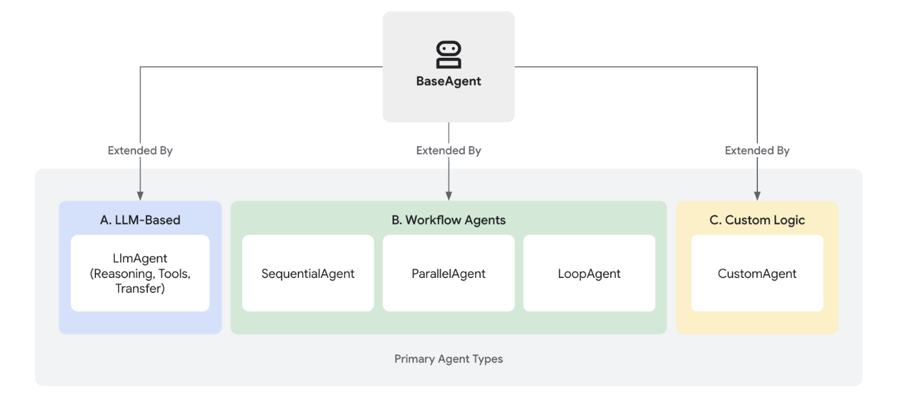
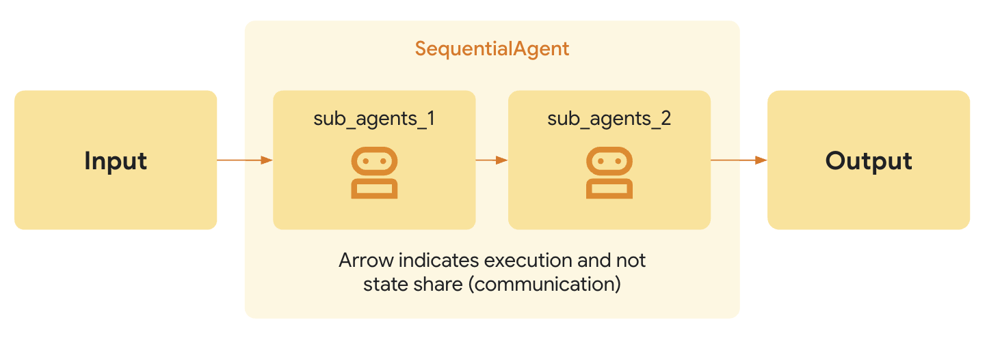
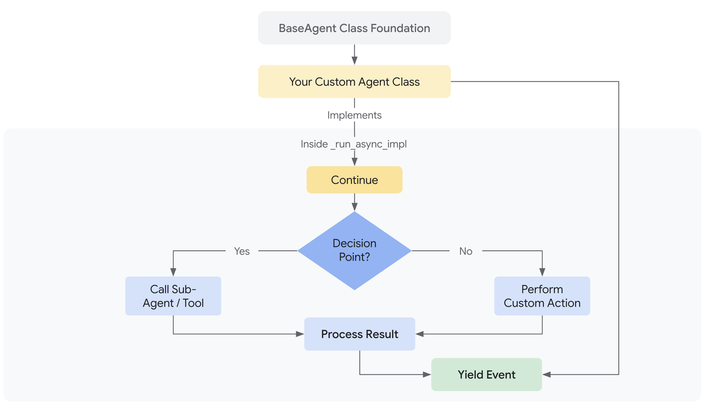

<h3 style="color:red;">✅ Agents</h3>


<h3 style="color:blue;">📌 What is Agents?</h3>

In the Agent Development Kit (ADK), an Agent is a self-contained execution unit designed to act autonomously to achieve specific goals. Agents can perform tasks, interact with users, utilize external tools, and coordinate with other agents.

The foundation for all agents in ADK is the BaseAgent class. It serves as the fundamental blueprint. To create functional agents, you typically extend BaseAgent in one of three main ways, catering to different needs – from intelligent reasoning to structured process control.




<h3 style="color:blue;">📌 Core Agent Categories</h3>

ADK provides distinct agent categories to build sophisticated applications:

<h3 style="color:red;">✅ LLM Agents (LlmAgent, Agent):</h3>

These agents utilize Large Language Models (LLMs) as their core engine to understand natural language, reason, plan, generate responses, and dynamically decide how to proceed or which tools to use, making them ideal for flexible, language-centric tasks.

<h3 style="color:red;">✅ Workflow Agents (SequentialAgent, ParallelAgent, LoopAgent):</h3>

These specialized agents control the execution flow of other agents in predefined, deterministic patterns (sequence, parallel, or loop) without using an LLM for the flow control itself, perfect for structured processes needing predictable execution.

<h3 style="color:red;">✅ Custom Agents:</h3>
 Created by extending BaseAgent directly, these agents allow you to implement unique operational logic, specific control flows, or specialized integrations not covered by the standard types, catering to highly tailored application requirements.


 <h3 style="color:blue;">📌 Choosing the Right Agent Type</h3>

 | Feature        | LLM Agent (`LlmAgent`)               | Workflow Agent                        | Custom Agent (`BaseAgent` subclass)          |
|----------------|--------------------------------------|---------------------------------------|----------------------------------------------|
| **Primary Function** | Reasoning, Generation, Tool Use     | Controlling Agent Execution Flow       | Implementing Unique Logic/Integrations        |
| **Core Engine**      | Large Language Model (LLM)          | Predefined Logic (Sequence, Parallel, Loop) | Custom Code                                   |
| **Determinism**      | Non-deterministic (Flexible)        | Deterministic (Predictable)            | Can be either, based on implementation        |
| **Primary Use**      | Language tasks, Dynamic decisions   | Structured processes, Orchestration    | Tailored requirements, Specific workflows     |


 <h3 style="color:blue;">📌 Agents Working Together: Multi-Agent Systems</h3>

 While each agent type serves a distinct purpose, the true power often comes from combining them. Complex applications frequently employ multi-agent architectures where:

 - **LLM Agents** handle intelligent, language-based task execution.

 - **Workflow Agents** manage the overall process flow using standard patterns.

 - **Custom Agents** provide specialized capabilities or rules needed for unique integrations.


<h3 style="color:blue;">📌 LLM Agents:</h3>

The ```LlmAgent``` (often aliased simply as Agent) is a core component in ADK, acting as the "thinking" part of your application. It leverages the power of a Large Language Model (LLM) for reasoning, understanding natural language, making decisions, generating responses, and interacting with tools.


Unlike deterministic ```Workflow Agents``` that follow predefined execution paths, LlmAgent behavior is non-deterministic. It uses the LLM to interpret instructions and context, deciding dynamically how to proceed, which tools to use (if any), or whether to transfer control to another agent.

Building an effective ```LlmAgent``` involves defining its identity, clearly guiding its behavior through instructions, and equipping it with the necessary tools and capabilities.

<h3 style="color:blue;">📌 Defining the Agent's Identity and Purpose:</h3>

First, you need to establish what the agent is and what it's for.

- **name** ```(Required):``` Every agent needs a unique string identifier. This name is crucial for internal operations, especially in multi-agent systems where agents need to refer to or delegate tasks to each other. Choose a descriptive name that reflects the agent's function (e.g., ```customer_support_router```, ```billing_inquiry_agent```). Avoid reserved names like ```user```.

- **description** ```(Optional, Recommended for Multi-Agent):``` Provide a concise summary of the agent's capabilities. This description is primarily used by other LLM agents to determine if they should route a task to this agent. Make it specific enough to differentiate it from peers (e.g., "Handles inquiries about current billing statements," not just "Billing agent").

- **model** ```(Required):``` Specify the underlying LLM that will power this agent's reasoning. This is a string identifier like ```"gemini-2.0-flash"```. The choice of model impacts the agent's capabilities, cost, and performance. See the Models page for available options and considerations.

```
# Example: Defining the basic identity
capital_agent = LlmAgent(
    model="gemini-2.0-flash",
    name="capital_agent",
    description="Answers user questions about the capital city of a given country."
    # instruction and tools will be added next
)
```

<h3 style="color:blue;">📌 Guiding the Agent: Instructions (instruction)</h3>

The ```instruction``` parameter is arguably the most critical for shaping an ```LlmAgent's``` behavior. It's a string (or a function returning a string) that tells the agent:

- Its core task or goal.

- Its personality or persona (e.g., "You are a helpful assistant," "You are a witty pirate").

- Constraints on its behavior (e.g., "Only answer questions about X," "Never reveal Y").

- How and when to use its ```tools```. You should explain the purpose of each tool and the circumstances under which it should be called, supplementing any descriptions within the tool itself.

- The desired format for its output (e.g., "Respond in JSON," "Provide a bulleted list").

<h3 style="color:blue;">📌 Tips for Effective Instructions:</h3>

- **Be Clear and Specific:** Avoid ambiguity. Clearly state the desired actions and outcomes.

- **Use Markdown:** Improve readability for complex instructions using headings, lists, etc.

- **Provide Examples (Few-Shot):** For complex tasks or specific output formats, include examples directly in the instruction.

- **Guide Tool Use:** Don't just list tools; explain when and why the agent should use them.

<h3 style="color:blue;">📌 State:</h3>

- The instruction is a string template, you can use the {var} syntax to insert dynamic values into the instruction.

- ```{var}``` is used to insert the value of the state variable named var.

- ```{artifact.var}``` is used to insert the text content of the artifact named var.

- If the state variable or artifact does not exist, the agent will raise an error. If you want to ignore the error, you can append a ```?``` to the variable name as in ```{var?}```.

```
# Example: Adding instructions
capital_agent = LlmAgent(
    model="gemini-2.0-flash",
    name="capital_agent",
    description="Answers user questions about the capital city of a given country.",
    instruction="""You are an agent that provides the capital city of a country.
When a user asks for the capital of a country:
1. Identify the country name from the user's query.
2. Use the `get_capital_city` tool to find the capital.
3. Respond clearly to the user, stating the capital city.
Example Query: "What's the capital of {country}?"
Example Response: "The capital of France is Paris."
""",
    # tools will be added next
)
```

Note: For instructions that apply to all agents in a system, consider using global_instruction on the root agent.


<h3 style="color:blue;">📌 Equipping the Agent: Tools (tools)</h3>

Tools give your ```LlmAgent``` capabilities beyond the LLM's built-in knowledge or reasoning. They allow the agent to interact with the outside world, perform calculations, fetch real-time data, or execute specific actions.

- **tools** ```(Optional)```: Provide a list of tools the agent can use. Each item in the list can be:

    - A native function or method (wrapped as a FunctionTool). Python ADK automatically wraps the native function into a FuntionTool whereas, you must explicitly wrap your Java methods using FunctionTool.create(...)

    - An instance of a class inheriting from ```BaseTool```.

    - An instance of another agent AgentTool, enabling agent-to-agent delegation.

The LLM uses the function/tool names, descriptions (from docstrings or the description field), and parameter schemas to decide which tool to call based on the conversation and its instructions.

```
# Define a tool function
def get_capital_city(country: str) -> str:
  """Retrieves the capital city for a given country."""
  # Replace with actual logic (e.g., API call, database lookup)
  capitals = {"france": "Paris", "japan": "Tokyo", "canada": "Ottawa"}
  return capitals.get(country.lower(), f"Sorry, I don't know the capital of {country}.")

# Add the tool to the agent
capital_agent = LlmAgent(
    model="gemini-2.0-flash",
    name="capital_agent",
    description="Answers user questions about the capital city of a given country.",
    instruction="""You are an agent that provides the capital city of a country... (previous instruction text)""",
    tools=[get_capital_city] # Provide the function directly
)
```

<h3 style="color:blue;">📌 Advanced Configuration & Control</h3>

Beyond the core parameters, LlmAgent offers several options for finer control:

Configuring LLM Generation (generate_content_config)

You can adjust how the underlying LLM generates responses using ```generate_content_config```.


- **generate_content_config** ```(Optional)```: Pass an instance of ```google.genai.types.GenerateContentConfig``` to control parameters like ```temperature``` (randomness), ```max_output_tokens``` (response length), ```top_p, top_k,``` and safety settings.

```
from google.genai import types

agent = LlmAgent(
    # ... other params
    generate_content_config=types.GenerateContentConfig(
        temperature=0.2, # More deterministic output
        max_output_tokens=250,
        safety_settings=[
            types.SafetySetting(
                category=types.HarmCategory.HARM_CATEGORY_DANGEROUS_CONTENT,
                threshold=types.HarmBlockThreshold.BLOCK_LOW_AND_ABOVE,
            )
        ]
    )
)
```

**Structuring Data** ```(input_schema, output_schema, output_key)```

For scenarios requiring structured data exchange with an LLM Agent, the ADK provides mechanisms to define expected input and desired output formats using schema definitions.

- **input_schema (Optional):** Define a schema representing the expected input structure. If set, the user message content passed to this agent must be a JSON string conforming to this schema. Your instructions should guide the user or preceding agent accordingly.

- **output_schema (Optional):** Define a schema representing the desired output structure. If set, the agent's final response must be a JSON string conforming to this schema.

- **output_key (Optional):** Provide a string key. If set, the text content of the agent's final response will be automatically saved to the session's state dictionary under this key. This is useful for passing results between agents or steps in a workflow.

    - In Python, this might look like: ```session.state[output_key] = agent_response_text```


```
from pydantic import BaseModel, Field

class CapitalOutput(BaseModel):
    capital: str = Field(description="The capital of the country.")

structured_capital_agent = LlmAgent(
    # ... name, model, description
    instruction="""You are a Capital Information Agent. Given a country, respond ONLY with a JSON object containing the capital. Format: {"capital": "capital_name"}""",
    output_schema=CapitalOutput, # Enforce JSON output
    output_key="found_capital"  # Store result in state['found_capital']
    # Cannot use tools=[get_capital_city] effectively here
)
```

<h3 style="color:blue;">📌 Managing Context (include_contents)</h3>

Control whether the agent receives the prior conversation history.

- **include_contents (Optional, Default: 'default'):** Determines if the contents (history) are sent to the LLM.

    - **'default':** The agent receives the relevant conversation history.

    - **'none':** The agent receives no prior contents. It operates based solely on its current instruction and any input provided in the current turn (useful for stateless tasks or enforcing specific contexts).


```
stateless_agent = LlmAgent(
    # ... other params
    include_contents='none'
)
```


<h3 style="color:blue;">📌 Planner</h3>

**planner (Optional):** Assign a ```BasePlanner``` instance to enable multi-step reasoning and planning before execution. There are two main planners:

   - **BuiltInPlanner:** Leverages the model's built-in planning capabilities (e.g., Gemini's thinking feature)
     Here, the thinking_budget parameter guides the model on the number of thinking tokens to use when generating a response. The include_thoughts parameter controls whether the model should include its raw thoughts and internal reasoning process in the response.


```
from google.adk import Agent
from google.adk.planners import BuiltInPlanner
from google.genai import types

my_agent = Agent(
    model="gemini-2.5-flash",
    planner=BuiltInPlanner(
        thinking_config=types.ThinkingConfig(
            include_thoughts=True,
            thinking_budget=1024,
        )
    ),
    # ... your tools here
)
```


   - **PlanReActPlanner:** This planner instructs the model to follow a specific structure in its output: first create a plan, then execute actions (like calling tools), and provide reasoning for its steps. It's particularly useful for models that don't have a built-in "thinking" feature.

```
from google.adk import Agent
from google.adk.planners import PlanReActPlanner

my_agent = Agent(
    model="gemini-2.0-flash",
    planner=PlanReActPlanner(),
    # ... your tools here
)
```


The agent's response will follow a structured format:

```
[user]: ai news
[google_search_agent]: /*PLANNING*/
1. Perform a Google search for "latest AI news" to get current updates and headlines related to artificial intelligence.
2. Synthesize the information from the search results to provide a summary of recent AI news.

/*ACTION*/
/*REASONING*/
The search results provide a comprehensive overview of recent AI news, covering various aspects like company developments, research breakthroughs, and applications. I have enough information to answer the user's request.

/*FINAL_ANSWER*/
Here's a summary of recent AI news:
....
```

<h3 style="color:blue;">📌 Code Execution</h3>

- **code_executor (Optional):** Provide a BaseCodeExecutor instance to allow the agent to execute code blocks found in the LLM's response.

Example for using built-in-planner:

```
from dotenv import load_dotenv


import asyncio
import os

from google.genai import types
from google.adk.agents.llm_agent import LlmAgent
from google.adk.runners import Runner
from google.adk.sessions import InMemorySessionService
from google.adk.artifacts.in_memory_artifact_service import InMemoryArtifactService # Optional
from google.adk.planners import BasePlanner, BuiltInPlanner, PlanReActPlanner
from google.adk.models import LlmRequest

from google.genai.types import ThinkingConfig
from google.genai.types import GenerateContentConfig

import datetime
from zoneinfo import ZoneInfo

APP_NAME = "weather_app"
USER_ID = "1234"
SESSION_ID = "session1234"

def get_weather(city: str) -> dict:
    """Retrieves the current weather report for a specified city.

    Args:
        city (str): The name of the city for which to retrieve the weather report.

    Returns:
        dict: status and result or error msg.
    """
    if city.lower() == "new york":
        return {
            "status": "success",
            "report": (
                "The weather in New York is sunny with a temperature of 25 degrees"
                " Celsius (77 degrees Fahrenheit)."
            ),
        }
    else:
        return {
            "status": "error",
            "error_message": f"Weather information for '{city}' is not available.",
        }


def get_current_time(city: str) -> dict:
    """Returns the current time in a specified city.

    Args:
        city (str): The name of the city for which to retrieve the current time.

    Returns:
        dict: status and result or error msg.
    """

    if city.lower() == "new york":
        tz_identifier = "America/New_York"
    else:
        return {
            "status": "error",
            "error_message": (
                f"Sorry, I don't have timezone information for {city}."
            ),
        }

    tz = ZoneInfo(tz_identifier)
    now = datetime.datetime.now(tz)
    report = (
        f'The current time in {city} is {now.strftime("%Y-%m-%d %H:%M:%S %Z%z")}'
    )
    return {"status": "success", "report": report}

# Step 1: Create a ThinkingConfig
thinking_config = ThinkingConfig(
    include_thoughts=True,   # Ask the model to include its thoughts in the response
    thinking_budget=256      # Limit the 'thinking' to 256 tokens (adjust as needed)
)
print("ThinkingConfig:", thinking_config)

# Step 2: Instantiate BuiltInPlanner
planner = BuiltInPlanner(
    thinking_config=thinking_config
)
print("BuiltInPlanner created.")

# Step 3: Wrap the planner in an LlmAgent
agent = LlmAgent(
    model="gemini-2.5-pro-preview-03-25",  # Set your model name
    name="weather_and_time_agent",
    instruction="You are an agent that returns time and weather",
    planner=planner,
    tools=[get_weather, get_current_time]
)

# Session and Runner
session_service = InMemorySessionService()
session = session_service.create_session(app_name=APP_NAME, user_id=USER_ID, session_id=SESSION_ID)
runner = Runner(agent=agent, app_name=APP_NAME, session_service=session_service)

# Agent Interaction
def call_agent(query):
    content = types.Content(role='user', parts=[types.Part(text=query)])
    events = runner.run(user_id=USER_ID, session_id=SESSION_ID, new_message=content)

    for event in events:
        print(f"\nDEBUG EVENT: {event}\n")
        if event.is_final_response() and event.content:
            final_answer = event.content.parts[0].text.strip()
            print("\n🟢 FINAL ANSWER\n", final_answer, "\n")

call_agent("If it's raining in New York right now, what is the current temperature?")
```

# Workflow Agents

<h3 style="color:blue;">📌 workflow agents</h3>

Workflow agents - **specialized agents that control the execution flow of its sub-agents**.

Workflow agents are specialized components in ADK designed purely for **orchestrating the execution flow of sub-agents**. Their primary role is to manage how and when other agents run, defining the control flow of a process.

Unlike LLM Agents, which use Large Language Models for dynamic reasoning and decision-making, Workflow Agents operate based on **predefined logic**. They determine the execution sequence according to their type (e.g., sequential, parallel, loop) without consulting an LLM for the orchestration itself. This results in **deterministic and predictable execution patterns**.


ADK provides three core workflow agent types, each implementing a distinct execution pattern:

1. **Sequential Agents**

2. **Loop Agents**

3. **Parallel Agents**

<h3 style="color:blue;">📌 Why Use Workflow Agents?</h3>

Workflow agents are essential when you need explicit control over how a series of tasks or agents are executed. They provide:

- **Predictability:** The flow of execution is guaranteed based on the agent type and configuration.

- **Reliability:** Ensures tasks run in the required order or pattern consistently.

- **Structure:** Allows you to build complex processes by composing agents within clear control structures.


<h3 style="color:blue;">📌 Sequential agents</h3>

The SequentialAgent is a workflow agent that executes its sub-agents in the order they are specified in the list.

**Example:**

- You want to build an agent that can summarize any webpage, using two tools: Get Page Contents and Summarize Page. Because the agent must always call Get Page Contents before calling Summarize Page (you can't summarize from nothing!), you should build your agent using a SequentialAgent.

As with other workflow agents, the SequentialAgent is not powered by an LLM, and is thus deterministic in how it executes. That being said, workflow agents are concerned only with their execution (i.e. in sequence), and not their internal logic; the tools or sub-agents of a workflow agent may or may not utilize LLMs.


**How it works**

When the ```SequentialAgent```'s ```Run Async``` method is called, it performs the following actions:

1. **Iteration:** It iterates through the sub agents list in the order they were provided.

2. **Sub-Agent Execution:** For each sub-agent in the list, it calls the sub-agent's ```Run Async``` method.





**Full Example: Code Development Pipeline**

Consider a simplified code development pipeline:

- **Code Writer Agent:** An LLM Agent that generates initial code based on a specification.

- **Code Reviewer Agent:** An LLM Agent that reviews the generated code for errors, style issues, and adherence to best practices. It receives the output of the Code Writer Agent.

- **Code Refactorer Agent:** An LLM Agent that takes the reviewed code (and the reviewer's comments) and refactors it to improve quality and address issues.

A ```SequentialAgent``` is perfect for this:

```
SequentialAgent(sub_agents=[CodeWriterAgent, CodeReviewerAgent, CodeRefactorerAgent])
```

This ensures the code is written, then reviewed, and finally refactored, in a strict, dependable order. **The output from each sub-agent is passed to the next by storing them in state via** ```Output Key```.

**Shared Invocation Context**

The ```SequentialAgent``` passes the same ```InvocationContext``` to each of its sub-agents. This means they all share the same session state, including the temporary (temp:) namespace, making it easy to pass data between steps within a single turn.

```
# Part of agent.py --> Follow https://google.github.io/adk-docs/get-started/quickstart/ to learn the setup

# --- 1. Define Sub-Agents for Each Pipeline Stage ---

# Code Writer Agent
# Takes the initial specification (from user query) and writes code.
code_writer_agent = LlmAgent(
    name="CodeWriterAgent",
    model=GEMINI_MODEL,
    # Change 3: Improved instruction
    instruction="""You are a Python Code Generator.
Based *only* on the user's request, write Python code that fulfills the requirement.
Output *only* the complete Python code block, enclosed in triple backticks (```python ... ```). 
Do not add any other text before or after the code block.
""",
    description="Writes initial Python code based on a specification.",
    output_key="generated_code" # Stores output in state['generated_code']
)

# Code Reviewer Agent
# Takes the code generated by the previous agent (read from state) and provides feedback.
code_reviewer_agent = LlmAgent(
    name="CodeReviewerAgent",
    model=GEMINI_MODEL,
    # Change 3: Improved instruction, correctly using state key injection
    instruction="""You are an expert Python Code Reviewer. 
    Your task is to provide constructive feedback on the provided code.

    **Code to Review:**
    ```python
    {generated_code}
    ```

**Review Criteria:**
1.  **Correctness:** Does the code work as intended? Are there logic errors?
2.  **Readability:** Is the code clear and easy to understand? Follows PEP 8 style guidelines?
3.  **Efficiency:** Is the code reasonably efficient? Any obvious performance bottlenecks?
4.  **Edge Cases:** Does the code handle potential edge cases or invalid inputs gracefully?
5.  **Best Practices:** Does the code follow common Python best practices?

**Output:**
Provide your feedback as a concise, bulleted list. Focus on the most important points for improvement.
If the code is excellent and requires no changes, simply state: "No major issues found."
Output *only* the review comments or the "No major issues" statement.
""",
    description="Reviews code and provides feedback.",
    output_key="review_comments", # Stores output in state['review_comments']
)


# Code Refactorer Agent
# Takes the original code and the review comments (read from state) and refactors the code.
code_refactorer_agent = LlmAgent(
    name="CodeRefactorerAgent",
    model=GEMINI_MODEL,
    # Change 3: Improved instruction, correctly using state key injection
    instruction="""You are a Python Code Refactoring AI.
Your goal is to improve the given Python code based on the provided review comments.

  **Original Code:**
  python
  {generated_code}
  

  **Review Comments:**
  {review_comments}

**Task:**
Carefully apply the suggestions from the review comments to refactor the original code.
If the review comments state "No major issues found," return the original code unchanged.
Ensure the final code is complete, functional, and includes necessary imports and docstrings.

**Output:**
Output *only* the final, refactored Python code block, enclosed in triple backticks (```python ... ```). 
Do not add any other text before or after the code block.
""",
    description="Refactors code based on review comments.",
    output_key="refactored_code", # Stores output in state['refactored_code']
)


# --- 2. Create the SequentialAgent ---
# This agent orchestrates the pipeline by running the sub_agents in order.
code_pipeline_agent = SequentialAgent(
    name="CodePipelineAgent",
    sub_agents=[code_writer_agent, code_reviewer_agent, code_refactorer_agent],
    description="Executes a sequence of code writing, reviewing, and refactoring.",
    # The agents will run in the order provided: Writer -> Reviewer -> Refactorer
)

# For ADK tools compatibility, the root agent must be named `root_agent`
root_agent = code_pipeline_agent
```

# Loop agents

<h3 style="color:blue;">📌 LoopAgent</h3>

The ```LoopAgent``` is a workflow agent that executes its sub-agents in a loop (i.e. iteratively). It **repeatedly runs a sequence of agents** for a specified number of iterations or until a termination condition is met.

Use the ```LoopAgent``` when your workflow involves repetition or iterative refinement, such as revising code.

**Example:**

You want to build an agent that can generate images of food, but sometimes when you want to generate a specific number of items (e.g. 5 bananas), it generates a different number of those items in the image (e.g. an image of 7 bananas). You have two tools: ```Generate Image```, ```Count Food Items```. Because you want to keep generating images until it either correctly generates the specified number of items, or after a certain number of iterations, you should build your agent using a LoopAgent.

As with other workflow agents, the LoopAgent is not powered by an LLM, and is thus deterministic in how it executes. That being said, workflow agents are only concerned only with their execution (i.e. in a loop), and not their internal logic; the tools or sub-agents of a workflow agent may or may not utilize LLMs.

**How it Works**

When the ```LoopAgent's Run Async``` method is called, it performs the following actions:

1. **Sub-Agent Execution:** It iterates through the Sub Agents list in order. For each sub-agent, it calls the agent's ```Run Async``` method.

2. **Termination Check:**

Crucially, the LoopAgent itself does not inherently decide when to stop looping. You must implement a termination mechanism to prevent infinite loops. Common strategies include:

   - **Max Iterations:** Set a maximum number of iterations in the ```LoopAgent```. The loop will terminate after that many iterations.

   - **Escalation from sub-agent:** Design one or more sub-agents to evaluate a condition (e.g., "Is the document quality good enough?", "Has a consensus been reached?"). If the condition is met, the sub-agent can signal termination (e.g., by raising a custom event, setting a flag in a shared context, or returning a specific value).


```
# Part of agent.py --> Follow https://google.github.io/adk-docs/get-started/quickstart/ to learn the setup

import asyncio
import os
from google.adk.agents import LoopAgent, LlmAgent, BaseAgent, SequentialAgent
from google.genai import types
from google.adk.runners import InMemoryRunner
from google.adk.agents.invocation_context import InvocationContext
from google.adk.tools.tool_context import ToolContext
from typing import AsyncGenerator, Optional
from google.adk.events import Event, EventActions

# --- Constants ---
APP_NAME = "doc_writing_app_v3" # New App Name
USER_ID = "dev_user_01"
SESSION_ID_BASE = "loop_exit_tool_session" # New Base Session ID
GEMINI_MODEL = "gemini-2.0-flash"
STATE_INITIAL_TOPIC = "initial_topic"

# --- State Keys ---
STATE_CURRENT_DOC = "current_document"
STATE_CRITICISM = "criticism"
# Define the exact phrase the Critic should use to signal completion
COMPLETION_PHRASE = "No major issues found."

# --- Tool Definition ---
def exit_loop(tool_context: ToolContext):
  """Call this function ONLY when the critique indicates no further changes are needed, signaling the iterative process should end."""
  print(f"  [Tool Call] exit_loop triggered by {tool_context.agent_name}")
  tool_context.actions.escalate = True
  # Return empty dict as tools should typically return JSON-serializable output
  return {}

# --- Agent Definitions ---

# STEP 1: Initial Writer Agent (Runs ONCE at the beginning)
initial_writer_agent = LlmAgent(
    name="InitialWriterAgent",
    model=GEMINI_MODEL,
    include_contents='none',
    # MODIFIED Instruction: Ask for a slightly more developed start
    instruction=f"""You are a Creative Writing Assistant tasked with starting a story.
    Write the *first draft* of a short story (aim for 2-4 sentences).
    Base the content *only* on the topic provided below. Try to introduce a specific element (like a character, a setting detail, or a starting action) to make it engaging.
    Topic: {{initial_topic}}

    Output *only* the story/document text. Do not add introductions or explanations.
""",
    description="Writes the initial document draft based on the topic, aiming for some initial substance.",
    output_key=STATE_CURRENT_DOC
)

# STEP 2a: Critic Agent (Inside the Refinement Loop)
critic_agent_in_loop = LlmAgent(
    name="CriticAgent",
    model=GEMINI_MODEL,
    include_contents='none',
    # MODIFIED Instruction: More nuanced completion criteria, look for clear improvement paths.
    instruction=f"""You are a Constructive Critic AI reviewing a short document draft (typically 2-6 sentences). Your goal is balanced feedback.

    **Document to Review:**
    ```
    {{current_document}}
    ```

    **Task:**
    Review the document for clarity, engagement, and basic coherence according to the initial topic (if known).

    IF you identify 1-2 *clear and actionable* ways the document could be improved to better capture the topic or enhance reader engagement (e.g., "Needs a stronger opening sentence", "Clarify the character's goal"):
    Provide these specific suggestions concisely. Output *only* the critique text.

    ELSE IF the document is coherent, addresses the topic adequately for its length, and has no glaring errors or obvious omissions:
    Respond *exactly* with the phrase "{COMPLETION_PHRASE}" and nothing else. It doesn't need to be perfect, just functionally complete for this stage. Avoid suggesting purely subjective stylistic preferences if the core is sound.

    Do not add explanations. Output only the critique OR the exact completion phrase.
""",
    description="Reviews the current draft, providing critique if clear improvements are needed, otherwise signals completion.",
    output_key=STATE_CRITICISM
)


# STEP 2b: Refiner/Exiter Agent (Inside the Refinement Loop)
refiner_agent_in_loop = LlmAgent(
    name="RefinerAgent",
    model=GEMINI_MODEL,
    # Relies solely on state via placeholders
    include_contents='none',
    instruction=f"""You are a Creative Writing Assistant refining a document based on feedback OR exiting the process.
    **Current Document:**
    ```
    {{current_document}}
    ```
    **Critique/Suggestions:**
    {{criticism}}

    **Task:**
    Analyze the 'Critique/Suggestions'.
    IF the critique is *exactly* "{COMPLETION_PHRASE}":
    You MUST call the 'exit_loop' function. Do not output any text.
    ELSE (the critique contains actionable feedback):
    Carefully apply the suggestions to improve the 'Current Document'. Output *only* the refined document text.

    Do not add explanations. Either output the refined document OR call the exit_loop function.
""",
    description="Refines the document based on critique, or calls exit_loop if critique indicates completion.",
    tools=[exit_loop], # Provide the exit_loop tool
    output_key=STATE_CURRENT_DOC # Overwrites state['current_document'] with the refined version
)


# STEP 2: Refinement Loop Agent
refinement_loop = LoopAgent(
    name="RefinementLoop",
    # Agent order is crucial: Critique first, then Refine/Exit
    sub_agents=[
        critic_agent_in_loop,
        refiner_agent_in_loop,
    ],
    max_iterations=5 # Limit loops
)

# STEP 3: Overall Sequential Pipeline
# For ADK tools compatibility, the root agent must be named `root_agent`
root_agent = SequentialAgent(
    name="IterativeWritingPipeline",
    sub_agents=[
        initial_writer_agent, # Run first to create initial doc
        refinement_loop       # Then run the critique/refine loop
    ],
    description="Writes an initial document and then iteratively refines it with critique using an exit tool."
)
```

# Parallel agents

<h3 style="color:blue;">📌 ParallelAgent</h3>

The ```ParallelAgent``` is a workflow agent that executes its sub-agents concurrently. This dramatically speeds up workflows where tasks can be performed independently.

Use ```ParallelAgent``` when: For scenarios prioritizing speed and involving independent, resource-intensive tasks, a ParallelAgent facilitates efficient parallel execution. **When sub-agents operate without dependencies, their tasks can be performed concurrently**, significantly reducing overall processing time.

As with other workflow agents, the ParallelAgent is not powered by an LLM, and is thus deterministic in how it executes. That being said, workflow agents are only concerned with their execution (i.e. executing sub-agents in parallel), and not their internal logic; the tools or sub-agents of a workflow agent may or may not utilize LLMs.

**Example:**
This approach is particularly beneficial for operations like multi-source data retrieval or heavy computations, where parallelization yields substantial performance gains. Importantly, this strategy assumes no inherent need for shared state or direct information exchange between the concurrently executing agents.

**How it works**

When the ```ParallelAgent```'s ```run_async()``` method is called:

1. **Concurrent Execution:** It initiates the ```run_async()``` method of each sub-agent present in the sub_agents list concurrently. This means all the agents start running at (approximately) the same time.

2. **Independent Branches:** Each sub-agent operates in its own execution branch. There is no automatic sharing of conversation history or state between these branches during execution.

3. **Result Collection:** The ParallelAgent manages the parallel execution and, typically, provides a way to access the results from each sub-agent after they have completed (e.g., through a list of results or events). The order of results may not be deterministic.


**Independent Execution and State Management**

It's crucial to understand that sub-agents within a ParallelAgent run independently. If you need communication or data sharing between these agents, you must implement it explicitly. Possible approaches include:

- **Shared** ```InvocationContext```: You could pass a shared InvocationContext object to each sub-agent. This object could act as a shared data store. However, you'd need to manage concurrent access to this shared context carefully (e.g., using locks) to avoid race conditions.

- **External State Management:** Use an external database, message queue, or other mechanism to manage shared state and facilitate communication between agents.

- **Post-Processing:** Collect results from each branch, and then implement logic to coordinate data afterwards.


**Full Example: Parallel Web Research**

Imagine researching multiple topics simultaneously:

1. **Researcher Agent 1:** An LlmAgent that researches "renewable energy sources."

2. **Researcher Agent 2:** An LlmAgent that researches "electric vehicle technology."

3. **Researcher Agent 3:** An LlmAgent that researches "carbon capture methods."


```
ParallelAgent(sub_agents=[ResearcherAgent1, ResearcherAgent2, ResearcherAgent3])
```

```
 # Part of agent.py --> Follow https://google.github.io/adk-docs/get-started/quickstart/ to learn the setup
 # --- 1. Define Researcher Sub-Agents (to run in parallel) ---

 # Researcher 1: Renewable Energy
 researcher_agent_1 = LlmAgent(
     name="RenewableEnergyResearcher",
     model=GEMINI_MODEL,
     instruction="""You are an AI Research Assistant specializing in energy.
 Research the latest advancements in 'renewable energy sources'.
 Use the Google Search tool provided.
 Summarize your key findings concisely (1-2 sentences).
 Output *only* the summary.
 """,
     description="Researches renewable energy sources.",
     tools=[google_search],
     # Store result in state for the merger agent
     output_key="renewable_energy_result"
 )

 # Researcher 2: Electric Vehicles
 researcher_agent_2 = LlmAgent(
     name="EVResearcher",
     model=GEMINI_MODEL,
     instruction="""You are an AI Research Assistant specializing in transportation.
 Research the latest developments in 'electric vehicle technology'.
 Use the Google Search tool provided.
 Summarize your key findings concisely (1-2 sentences).
 Output *only* the summary.
 """,
     description="Researches electric vehicle technology.",
     tools=[google_search],
     # Store result in state for the merger agent
     output_key="ev_technology_result"
 )

 # Researcher 3: Carbon Capture
 researcher_agent_3 = LlmAgent(
     name="CarbonCaptureResearcher",
     model=GEMINI_MODEL,
     instruction="""You are an AI Research Assistant specializing in climate solutions.
 Research the current state of 'carbon capture methods'.
 Use the Google Search tool provided.
 Summarize your key findings concisely (1-2 sentences).
 Output *only* the summary.
 """,
     description="Researches carbon capture methods.",
     tools=[google_search],
     # Store result in state for the merger agent
     output_key="carbon_capture_result"
 )

 # --- 2. Create the ParallelAgent (Runs researchers concurrently) ---
 # This agent orchestrates the concurrent execution of the researchers.
 # It finishes once all researchers have completed and stored their results in state.
 parallel_research_agent = ParallelAgent(
     name="ParallelWebResearchAgent",
     sub_agents=[researcher_agent_1, researcher_agent_2, researcher_agent_3],
     description="Runs multiple research agents in parallel to gather information."
 )

 # --- 3. Define the Merger Agent (Runs *after* the parallel agents) ---
 # This agent takes the results stored in the session state by the parallel agents
 # and synthesizes them into a single, structured response with attributions.
 merger_agent = LlmAgent(
     name="SynthesisAgent",
     model=GEMINI_MODEL,  # Or potentially a more powerful model if needed for synthesis
     instruction="""You are an AI Assistant responsible for combining research findings into a structured report.

 Your primary task is to synthesize the following research summaries, clearly attributing findings to their source areas. Structure your response using headings for each topic. Ensure the report is coherent and integrates the key points smoothly.

 **Crucially: Your entire response MUST be grounded *exclusively* on the information provided in the 'Input Summaries' below. Do NOT add any external knowledge, facts, or details not present in these specific summaries.**

 **Input Summaries:**

 *   **Renewable Energy:**
     {renewable_energy_result}

 *   **Electric Vehicles:**
     {ev_technology_result}

 *   **Carbon Capture:**
     {carbon_capture_result}

 **Output Format:**

 ## Summary of Recent Sustainable Technology Advancements

 ### Renewable Energy Findings
 (Based on RenewableEnergyResearcher's findings)
 [Synthesize and elaborate *only* on the renewable energy input summary provided above.]

 ### Electric Vehicle Findings
 (Based on EVResearcher's findings)
 [Synthesize and elaborate *only* on the EV input summary provided above.]

 ### Carbon Capture Findings
 (Based on CarbonCaptureResearcher's findings)
 [Synthesize and elaborate *only* on the carbon capture input summary provided above.]

 ### Overall Conclusion
 [Provide a brief (1-2 sentence) concluding statement that connects *only* the findings presented above.]

 Output *only* the structured report following this format. Do not include introductory or concluding phrases outside this structure, and strictly adhere to using only the provided input summary content.
 """,
     description="Combines research findings from parallel agents into a structured, cited report, strictly grounded on provided inputs.",
     # No tools needed for merging
     # No output_key needed here, as its direct response is the final output of the sequence
 )


 # --- 4. Create the SequentialAgent (Orchestrates the overall flow) ---
 # This is the main agent that will be run. It first executes the ParallelAgent
 # to populate the state, and then executes the MergerAgent to produce the final output.
 sequential_pipeline_agent = SequentialAgent(
     name="ResearchAndSynthesisPipeline",
     # Run parallel research first, then merge
     sub_agents=[parallel_research_agent, merger_agent],
     description="Coordinates parallel research and synthesizes the results."
 )

 root_agent = sequential_pipeline_agent
 ```

 # Custom agents

 <h3 style="color:blue;">📌 Custom agents</h3>

 Custom agents provide the ultimate flexibility in ADK, allowing you to define **arbitrary orchestration logic** by inheriting directly from ```BaseAgent``` and implementing your own control flow. This goes beyond the predefined patterns of ```SequentialAgent```, ```LoopAgent```, and ```ParallelAgent```, enabling you to build highly specific and complex agentic workflows.


<h3 style="color:blue;">📌 What is a Custom Agent?</h3>

A Custom Agent is essentially any class you create that inherits from ```google.adk.agents.BaseAgent``` and implements its core execution logic within the ```_run_async_impl``` asynchronous method. You have complete control over how this method calls other agents (sub-agents), manages state, and handles events.

<h3 style="color:blue;">📌 Why Use Them?</h3>

While the standard Workflow Agents ```(SequentialAgent, LoopAgent, ParallelAgent)``` cover common orchestration patterns, you'll need a Custom agent when your requirements include:

- **Conditional Logic:** Executing different sub-agents or taking different paths based on runtime conditions or the results of previous steps.

- **Complex State Management:** Implementing intricate logic for maintaining and updating state throughout the workflow beyond simple sequential passing.

- **External Integrations:** Incorporating calls to external APIs, databases, or custom libraries directly within the orchestration flow control.

- **Dynamic Agent Selection:** Choosing which sub-agent(s) to run next based on dynamic evaluation of the situation or input.

- **Unique Workflow Patterns:** Implementing orchestration logic that doesn't fit the standard sequential, parallel, or loop structures.




**Implementing Custom Logic:**

The core of any custom agent is the method where you define its unique asynchronous behavior. This method allows you to orchestrate sub-agents and manage the flow of execution.

The heart of any custom agent is the ```_run_async_impl``` method. This is where you define its unique behavior.

- **Signature:** ```async def _run_async_impl(self, ctx: InvocationContext) -> AsyncGenerator[Event, None]:```

- **Asynchronous Generator:** It must be an ```async def``` function and return an ```AsyncGenerator```. This allows it to yield events produced by sub-agents or its own logic back to the runner.


- **ctx** ```(InvocationContext)```: Provides access to crucial runtime information, most importantly ctx.session.state, which is the primary way to share data between steps orchestrated by your custom agent.

**Key Capabilities within the Core Asynchronous Method:**

1. **Calling Sub-Agents:** You invoke sub-agents (which are typically stored as instance attributes like ```self.my_llm_agent```) using their ```run_async``` method and yield their events:

```
async for event in self.some_sub_agent.run_async(ctx):
    # Optionally inspect or log the event
    yield event # Pass the event up
```

2. **Managing State:** Read from and write to the session state dictionary (```ctx.session.state```) to pass data between sub-agent calls or make decisions:

```
# Read data set by a previous agent
previous_result = ctx.session.state.get("some_key")

# Make a decision based on state
if previous_result == "some_value":
    # ... call a specific sub-agent ...
else:
    # ... call another sub-agent ...

# Store a result for a later step (often done via a sub-agent's output_key)
# ctx.session.state["my_custom_result"] = "calculated_value"
```

3. **Implementing Control Flow:** Use standard Python constructs ```(if/elif/else, for/while loops, try/except)``` to create sophisticated, conditional, or iterative workflows involving your sub-agents.


<h3 style="color:blue;">📌 Managing Sub-Agents and State</h3>

Typically, a custom agent orchestrates other agents (```like LlmAgent, LoopAgent, etc.```).

