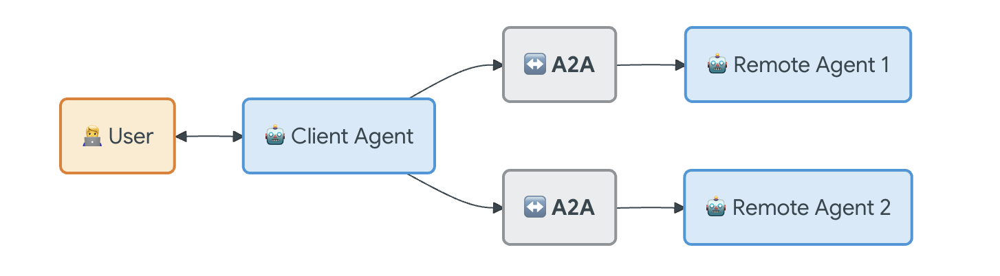

<h3 style="color:red;">✅ ADK with Agent2Agent (A2A) Protocol</h3>

<h3 style="color:blue;">📌 What is Agent2Agent (A2A) Protocol?</h3>

With Agent Development Kit (ADK), you can build complex multi-agent systems where different agents need to collaborate and interact using Agent2Agent (A2A) Protocol! This section provides a comprehensive guide to building powerful multi-agent systems where agents can communicate and collaborate securely and efficiently.

The **Agent2Agent (A2A) Protocol** is an open standard developed by Google and donated to the Linux Foundation designed to enable seamless communication and collaboration between AI agents.

<h3 style="color:blue;">📌 Why use the A2A Protocol?</h3>

