<h3 style="color:red;">✅ LangGraph</h3>


<h3 style="color:blue;">📌 What is LangGraph?</h3>
LangGraph is built for developers who want to build powerful, adaptable AI agents.Developers choose LangGraph for:

- **Reliability and controllability.** Steer agent actions with moderation checks and human-in-the-loop approvals. LangGraph persists context for long-running workflows, keeping your agents on course.

- **Low-level and extensible.** Build custom agents with fully descriptive, low-level primitives free from rigid abstractions that limit customization. Design scalable multi-agent systems, with each agent serving a specific role tailored to your use case.

- **First-class streaming support.** With token-by-token streaming and streaming of intermediate steps, LangGraph gives users clear visibility into agent reasoning and actions as they unfold in real time.


<h3 style="color:blue;">📌 Learn LangGraph basics</h3>

1. **Build a basic chatbot**
2. **Add tools**
3. **Add memory**
4. **Add human-in-the-loop controls**
5. **Customize state**
6. **Time travel**


## Agent architectures

Many LLM applications implement a particular control flow of steps before and / or after LLM calls. As an example, RAG performs retrieval of documents relevant to a user question, and passes those documents to an LLM in order to ground the model's response in the provided document context.

Instead of hard-coding a fixed control flow, we sometimes want LLM systems that can pick their own control flow to solve more complex problems! This is one definition of an agent: an agent is a system that uses an LLM to decide the control flow of an application. There are many ways that an LLM can control application:

- An LLM can route between two potential paths

- An LLM can decide which of many tools to call

- An LLM can decide whether the generated answer is sufficient or more work is needed


**Router**

A router allows an LLM to select a single step from a specified set of options. This is an agent architecture that exhibits a relatively limited level of control because the LLM usually focuses on making a single decision and produces a specific output from a limited set of pre-defined options. Routers typically employ a few different concepts to achieve this.

**Structured Output**

Structured outputs with LLMs work by providing a specific format or schema that the LLM should follow in its response. This is similar to tool calling, but more general. While tool calling typically involves selecting and using predefined functions, structured outputs can be used for any type of formatted response. Common methods to achieve structured outputs include:


1. **Prompt engineering:** Instructing the LLM to respond in a specific format via the system prompt.

2. **Output parsers:** Using post-processing to extract structured data from LLM responses.

3. **Tool calling:** Leveraging built-in tool calling capabilities of some LLMs to generate structured outputs.


**Tool-calling agent**

cWhile a router allows an LLM to make a single decision, more complex agent architectures expand the LLM's control in two key ways:


1. Multi-step decision making: The LLM can make a series of decisions, one after another, instead of just one.

2. Tool access:The LLM can choose from and use a variety of tools to accomplish tasks.

<h3 style="color:blue;">📌 Install LangGraph:</h3>

```
pip install -U langgraph
```

<h3 style="color:blue;">📌 create an agent using prebuilt components:</h3>

```
import os
from langgraph.prebuilt import create_react_agent
from langchain.chat_models import init_chat_model


os.environ["OPENAI_API_KEY"] = "sk-proj-*****"
llm = init_chat_model("openai:gpt-4.1")

def get_weather(city: str) -> str:
    """Get weather for a given city."""
    return f"It's always sunny in {city}!"

agent = create_react_agent(
    model=llm,
    tools=[get_weather],
    prompt="You are a helpful assistant"
)

# Run the agent
result = agent.invoke(
    {"messages": [{"role": "user", "content": "what is the weather in sf"}]}
)

# Print the output
print(result['messages'][-1].content)
```

**Output:**

```
python langgraph_test.py
The weather in San Francisco is reported to be always sunny! If you need a more detailed or up-to-date weather report, please let me know.
```

<h3 style="color:blue;">📌 Core benefits</h3>


LangGraph provides low-level supporting infrastructure for any long-running, stateful workflow or agent. LangGraph does not abstract prompts or architecture, and provides the following central benefits:

- **Durable execution:** Build agents that persist through failures and can run for extended periods, automatically resuming from exactly where they left off.

- **Human-in-the-loop:** Seamlessly incorporate human oversight by inspecting and modifying agent state at any point during execution.

- **Comprehensive memory:** Create truly stateful agents with both short-term working memory for ongoing reasoning and long-term persistent memory across sessions.

- **Debugging with LangSmith:** Gain deep visibility into complex agent behavior with visualization tools that trace execution paths, capture state transitions, and provide detailed runtime metrics.

- **Production-ready deployment:** Deploy sophisticated agent systems confidently with scalable infrastructure designed to handle the unique challenges of stateful, long-running workflows.


<h3 style="color:blue;">📌 LangGraph’s ecosystem</h3>

While LangGraph can be used standalone, it also integrates seamlessly with any LangChain product, giving developers a full suite of tools for building agents. To improve your LLM application development, pair LangGraph with:

- **LangSmith** — Helpful for agent evals and observability. Debug poor-performing LLM app runs, evaluate agent trajectories, gain visibility in production, and improve performance over time.

- **LangGraph Platform** — Deploy and scale agents effortlessly with a purpose-built deployment platform for long running, stateful workflows. Discover, reuse, configure, and share agents across teams — and iterate quickly with visual prototyping in LangGraph Studio.

- **LangChain** – Provides integrations and composable components to streamline LLM application development.


<h3 style="color:blue;">📌 Models</h3>

LangGraph provides built-in support for LLMs (language models) via the LangChain library. This makes it easy to integrate various LLMs into your agents and workflows.

**Initialize a model**

Use ```init_chat_model``` to initialize models:

<h3 style="color:blue;">📌 OpenAI:</h3>

```
pip install -U "langchain[openai]"
```

```
import os
from langchain.chat_models import init_chat_model

os.environ["OPENAI_API_KEY"] = "sk-..."

llm = init_chat_model("openai:gpt-4.1")
```

<h3 style="color:blue;">📌 Anthropic:</h3>

```
pip install -U "langchain[anthropic]"
```

```
import os
from langchain.chat_models import init_chat_model

os.environ["ANTHROPIC_API_KEY"] = "sk-..."

llm = init_chat_model("anthropic:claude-3-5-sonnet-latest")
```

<h3 style="color:blue;">📌 Azure:</h3>

```
pip install -U "langchain[openai]"
```

```
import os
from langchain.chat_models import init_chat_model

os.environ["AZURE_OPENAI_API_KEY"] = "..."
os.environ["AZURE_OPENAI_ENDPOINT"] = "..."
os.environ["OPENAI_API_VERSION"] = "2025-03-01-preview"

llm = init_chat_model(
    "azure_openai:gpt-4.1",
    azure_deployment=os.environ["AZURE_OPENAI_DEPLOYMENT_NAME"],
)
```

<h3 style="color:blue;">📌 Google Gemini:</h3>

```
pip install -U "langchain[google-genai]"
```

```
import os
from langchain.chat_models import init_chat_model

os.environ["GOOGLE_API_KEY"] = "..."

llm = init_chat_model("google_genai:gemini-2.0-flash")
```

<h3 style="color:blue;">📌 AWS Bedrock:</h3>

```
pip install -U "langchain[aws]"
```

```
from langchain.chat_models import init_chat_model

# Follow the steps here to configure your credentials:
# https://docs.aws.amazon.com/bedrock/latest/userguide/getting-started.html

llm = init_chat_model(
    "anthropic.claude-3-5-sonnet-20240620-v1:0",
    model_provider="bedrock_converse",
)
```

<h3 style="color:blue;">📌 Instantiate a model directly</h3>

If a model provider is not available via init_chat_model, you can instantiate the provider's model class directly. The model must implement the BaseChatModel interface and support tool calling:

```
# Anthropic is already supported by `init_chat_model`,
# but you can also instantiate it directly.
from langchain_anthropic import ChatAnthropic

model = ChatAnthropic(
  model="claude-3-7-sonnet-latest",
  temperature=0,
  max_tokens=2048
)
```

<h3 style="color:blue;">📌 Dynamic model selection</h3>

Pass a callable function to create_react_agent to dynamically select the model at runtime. This is useful for scenarios where you want to choose a model based on user input, configuration settings, or other runtime conditions.

The selector function must return a chat model. If you're using tools, you must bind the tools to the model within the selector function.

```
from dataclasses import dataclass
from typing import Literal
from langchain.chat_models import init_chat_model
from langchain_core.language_models import BaseChatModel
from langchain_core.tools import tool
from langgraph.prebuilt import create_react_agent
from langgraph.prebuilt.chat_agent_executor import AgentState
from langgraph.runtime import Runtime

@tool
def weather() -> str:
    """Returns the current weather conditions."""
    return "It's nice and sunny."


# Define the runtime context
@dataclass
class CustomContext:
    provider: Literal["anthropic", "openai"]

# Initialize models
openai_model = init_chat_model("openai:gpt-4o")
anthropic_model = init_chat_model("anthropic:claude-sonnet-4-20250514")


# Selector function for model choice
def select_model(state: AgentState, runtime: Runtime[CustomContext]) -> BaseChatModel:
    if runtime.context.provider == "anthropic":
        model = anthropic_model
    elif runtime.context.provider == "openai":
        model = openai_model
    else:
        raise ValueError(f"Unsupported provider: {runtime.context.provider}")

    # With dynamic model selection, you must bind tools explicitly
    return model.bind_tools([weather])


# Create agent with dynamic model selection
agent = create_react_agent(select_model, tools=[weather])

# Invoke with context to select model
output = agent.invoke(
    {
        "messages": [
            {
                "role": "user",
                "content": "Which model is handling this?",
            }
        ]
    },
    context=CustomContext(provider="openai"),
)

print(output["messages"][-1].text())
```

<h3 style="color:blue;">📌 Advanced model configuration</h3>

**Disable streaming**

To disable streaming of the individual LLM tokens, set disable_streaming=True when initializing the model:

**init_chat_model**

```
from langchain.chat_models import init_chat_model

model = init_chat_model(
    "anthropic:claude-3-7-sonnet-latest",
    disable_streaming=True
)
```

**ChatModel**

```
from langchain_anthropic import ChatAnthropic

model = ChatAnthropic(
    model="claude-3-7-sonnet-latest",
    disable_streaming=True
)
```

<h3 style="color:blue;">📌 Add model fallbacks</h3>

You can add a fallback to a different model or a different LLM provider using ```model.with_fallbacks([...])```:

**init_chat_model**

```
from langchain.chat_models import init_chat_model

model_with_fallbacks = (
    init_chat_model("anthropic:claude-3-5-haiku-latest")
    .with_fallbacks([
        init_chat_model("openai:gpt-4.1-mini"),
    ])
)
```

**ChatModel**

```
from langchain.chat_models import init_chat_model

model_with_fallbacks = (
    init_chat_model("anthropic:claude-3-5-haiku-latest")
    .with_fallbacks([
        init_chat_model("openai:gpt-4.1-mini"),
    ])
)
```

<h3 style="color:blue;">📌 Use the built-in rate limiter</h3>

Langchain includes a built-in in-memory rate limiter. This rate limiter is thread safe and can be shared by multiple threads in the same process.

```
from langchain_core.rate_limiters import InMemoryRateLimiter
from langchain_anthropic import ChatAnthropic

rate_limiter = InMemoryRateLimiter(
    requests_per_second=0.1,  # <-- Super slow! We can only make a request once every 10 seconds!!
    check_every_n_seconds=0.1,  # Wake up every 100 ms to check whether allowed to make a request,
    max_bucket_size=10,  # Controls the maximum burst size.
)

model = ChatAnthropic(
   model_name="claude-3-opus-20240229",
   rate_limiter=rate_limiter
)
```

<h3 style="color:blue;">📌 Bring your own model</h3>

If your desired LLM isn't officially supported by LangChain, consider these options:

1. **Implement a custom LangChain chat model:** Create a model conforming to the LangChain chat model interface. This enables full compatibility with LangGraph's agents and workflows but requires understanding of the LangChain framework.

2. **Direct invocation with custom streaming:** Use your model directly by adding custom streaming logic with StreamWriter.


## Tools

Many AI applications interact with users via natural language. However, some use cases require models to interface directly with external systems—such as APIs, databases, or file systems—using structured input. In these scenarios, **tool calling** enables models to generate requests that conform to a specified input schema.

**Tools** encapsulate a callable function and its input schema. These can be passed to compatible chat models, allowing the model to decide whether to invoke a tool and with what arguments.

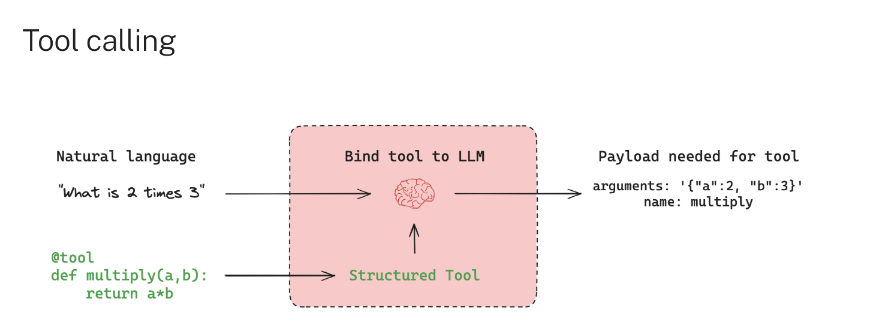

Tool calling is typically **conditional**. Based on the user input and available tools, the model may choose to issue a tool call request. This request is returned in an AIMessage object, which includes a tool_calls field that specifies the tool name and input arguments:

```
llm_with_tools.invoke("What is 2 multiplied by 3?")
# -> AIMessage(tool_calls=[{'name': 'multiply', 'args': {'a': 2, 'b': 3}, ...}])
```

```
AIMessage(
  tool_calls=[
    ToolCall(name="multiply", args={"a": 2, "b": 3}),
    ...
  ]
)
```

If the input is unrelated to any tool, the model returns only a natural language message:

```
llm_with_tools.invoke("Hello world!")  # -> AIMessage(content="Hello!")
```

Importantly, the model does not execute the tool—it only generates a request. A separate executor (such as a runtime or agent) is responsible for handling the tool call and returning the result.

## Custom tools

You can define custom tools using the @tool decorator or plain Python functions. For example:

```
from langchain_core.tools import tool

@tool
def multiply(a: int, b: int) -> int:
    """Multiply two numbers."""
    return a * b
```

## Call tools

**Tools** encapsulate a callable function and its input schema. These can be passed to compatible chat models, allowing the model to decide whether to invoke a tool and determine the appropriate arguments.

You can **define your own tools** or use **prebuilt tools**


**Define a tool**

Define a basic tool with the **@tool** decorator:

**Run a tool**

Tools conform to the **Runnable interface**, which means you can run a tool using the invoke method:

```
multiply.invoke({"a": 6, "b": 7})  # returns 42
```

If the tool is invoked with ```type="tool_call"```, it will return a ToolMessage:

```
tool_call = {
    "type": "tool_call",
    "id": "1",
    "args": {"a": 42, "b": 7}
}
multiply.invoke(tool_call) # returns a ToolMessage object
```

**Output:**

```
ToolMessage(content='294', name='multiply', tool_call_id='1')
```

## Use in an agent

To create a tool-calling agent, you can use the prebuilt ```create_react_agent```:

```
from langchain_core.tools import tool
from langgraph.prebuilt import create_react_agent

@tool
def multiply(a: int, b: int) -> int:
    """Multiply two numbers."""
    return a * b

agent = create_react_agent(
    model="anthropic:claude-3-7-sonnet",
    tools=[multiply]
)
agent.invoke({"messages": [{"role": "user", "content": "what's 42 x 7?"}]})
```

## Dynamically select tools

Configure tool availability at runtime based on context:

```
from dataclasses import dataclass
from typing import Literal

from langchain.chat_models import init_chat_model
from langchain_core.tools import tool

from langgraph.prebuilt import create_react_agent
from langgraph.prebuilt.chat_agent_executor import AgentState
from langgraph.runtime import Runtime


@dataclass
class CustomContext:
    tools: list[Literal["weather", "compass"]]


@tool
def weather() -> str:
    """Returns the current weather conditions."""
    return "It's nice and sunny."


@tool
def compass() -> str:
    """Returns the direction the user is facing."""
    return "North"

model = init_chat_model("anthropic:claude-sonnet-4-20250514")

def configure_model(state: AgentState, runtime: Runtime[CustomContext]):
    """Configure the model with tools based on runtime context."""
    selected_tools = [
        tool
        for tool in [weather, compass]
        if tool.name in runtime.context.tools
    ]
    return model.bind_tools(selected_tools)


agent = create_react_agent(
    # Dynamically configure the model with tools based on runtime context
    configure_model,
    # Initialize with all tools available
    tools=[weather, compass]
)

output = agent.invoke(
    {
        "messages": [
            {
                "role": "user",
                "content": "Who are you and what tools do you have access to?",
            }
        ]
    },
    context=CustomContext(tools=["weather"]),  # Only enable the weather tool
)

print(output["messages"][-1].text())
```

## Use in a workflow

If you are writing a custom workflow, you will need to:

1. register the tools with the chat model

2. call the tool if the model decides to use it


Use ```model.bind_tools()``` to register the tools with the model.

```
from langchain.chat_models import init_chat_model

model = init_chat_model(model="claude-3-5-haiku-latest")

model_with_tools = model.bind_tools([multiply])
```

**ToolNode**

To execute tools in custom workflows, use the prebuilt ToolNode or implement your own custom node.

ToolNode is a specialized node for executing tools in a workflow. It provides the following features:

- Supports both synchronous and asynchronous tools.

- Executes multiple tools concurrently.

- Handles errors during tool execution (handle_tool_errors=True, enabled by default).


ToolNode operates on ```MessagesState```:

- **Input:** MessagesState, where the last message is an AIMessage containing the tool_calls parameter.

- **Output:** MessagesState updated with the resulting ToolMessage from executed tools.

```
from langgraph.prebuilt import ToolNode

def get_weather(location: str):
    """Call to get the current weather."""
    if location.lower() in ["sf", "san francisco"]:
        return "It's 60 degrees and foggy."
    else:
        return "It's 90 degrees and sunny."

def get_coolest_cities():
    """Get a list of coolest cities"""
    return "nyc, sf"

tool_node = ToolNode([get_weather, get_coolest_cities])
tool_node.invoke({"messages": [...]})
```


**Single tool call**

```
from langchain_core.messages import AIMessage
from langgraph.prebuilt import ToolNode

# Define tools
@tool
def get_weather(location: str):
    """Call to get the current weather."""
    if location.lower() in ["sf", "san francisco"]:
        return "It's 60 degrees and foggy."
    else:
        return "It's 90 degrees and sunny."

tool_node = ToolNode([get_weather])

message_with_single_tool_call = AIMessage(
    content="",
    tool_calls=[
        {
            "name": "get_weather",
            "args": {"location": "sf"},
            "id": "tool_call_id",
            "type": "tool_call",
        }
    ],
)

tool_node.invoke({"messages": [message_with_single_tool_call]})
```

**Multiple tool calls**

```
from langchain_core.messages import AIMessage
from langgraph.prebuilt import ToolNode

# Define tools

def get_weather(location: str):
    """Call to get the current weather."""
    if location.lower() in ["sf", "san francisco"]:
        return "It's 60 degrees and foggy."
    else:
        return "It's 90 degrees and sunny."

def get_coolest_cities():
    """Get a list of coolest cities"""
    return "nyc, sf"

tool_node = ToolNode([get_weather, get_coolest_cities])

message_with_multiple_tool_calls = AIMessage(
    content="",
    tool_calls=[
        {
            "name": "get_coolest_cities",
            "args": {},
            "id": "tool_call_id_1",
            "type": "tool_call",
        },
        {
            "name": "get_weather",
            "args": {"location": "sf"},
            "id": "tool_call_id_2",
            "type": "tool_call",
        },
    ],
)

tool_node.invoke({"messages": [message_with_multiple_tool_calls]})
```

**Use with a chat model**

```
from langchain.chat_models import init_chat_model
from langgraph.prebuilt import ToolNode

def get_weather(location: str):
    """Call to get the current weather."""
    if location.lower() in ["sf", "san francisco"]:
        return "It's 60 degrees and foggy."
    else:
        return "It's 90 degrees and sunny."

tool_node = ToolNode([get_weather])

model = init_chat_model(model="claude-3-5-haiku-latest")
model_with_tools = model.bind_tools([get_weather])  


response_message = model_with_tools.invoke("what's the weather in sf?")
tool_node.invoke({"messages": [response_message]})
```

**Use in a tool-calling agent**

```
from langchain.chat_models import init_chat_model
from langgraph.prebuilt import ToolNode
from langgraph.graph import StateGraph, MessagesState, START, END

def get_weather(location: str):
    """Call to get the current weather."""
    if location.lower() in ["sf", "san francisco"]:
        return "It's 60 degrees and foggy."
    else:
        return "It's 90 degrees and sunny."

tool_node = ToolNode([get_weather])

model = init_chat_model(model="claude-3-5-haiku-latest")
model_with_tools = model.bind_tools([get_weather])

def should_continue(state: MessagesState):
    messages = state["messages"]
    last_message = messages[-1]
    if last_message.tool_calls:
        return "tools"
    return END

def call_model(state: MessagesState):
    messages = state["messages"]
    response = model_with_tools.invoke(messages)
    return {"messages": [response]}

builder = StateGraph(MessagesState)

# Define the two nodes we will cycle between
builder.add_node("call_model", call_model)
builder.add_node("tools", tool_node)

builder.add_edge(START, "call_model")
builder.add_conditional_edges("call_model", should_continue, ["tools", END])
builder.add_edge("tools", "call_model")

graph = builder.compile()

graph.invoke({"messages": [{"role": "user", "content": "what's the weather in sf?"}]})
```

## Tool customization

For more control over tool behavior, use the @tool decorator.

**Parameter descriptions**

Auto-generate descriptions from docstrings:

```
from langchain_core.tools import tool

@tool("multiply_tool", parse_docstring=True)
def multiply(a: int, b: int) -> int:
    """Multiply two numbers.

    Args:
        a: First operand
        b: Second operand
    """
    return a * b
```

**Explicit input schema**

Define schemas using args_schema:

```
from pydantic import BaseModel, Field
from langchain_core.tools import tool

class MultiplyInputSchema(BaseModel):
    """Multiply two numbers"""
    a: int = Field(description="First operand")
    b: int = Field(description="Second operand")

@tool("multiply_tool", args_schema=MultiplyInputSchema)
def multiply(a: int, b: int) -> int:
    return a * b
```

**Tool name**

Override the default tool name using the first argument or name property:

```
from langchain_core.tools import tool

@tool("multiply_tool")
def multiply(a: int, b: int) -> int:
    """Multiply two numbers."""
    return a * b
```

## Context management

Tools within LangGraph sometimes require context data, such as runtime-only arguments (e.g., user IDs or session details), that should not be controlled by the model. LangGraph provides three methods for managing such context:

**Configuration**

Use configuration when you have **immutable** runtime data that tools require, such as user identifiers. You pass these arguments via RunnableConfig at invocation and access them in the tool:

```
from langchain_core.tools import tool
from langchain_core.runnables import RunnableConfig

@tool
def get_user_info(config: RunnableConfig) -> str:
    """Retrieve user information based on user ID."""
    user_id = config["configurable"].get("user_id")
    return "User is John Smith" if user_id == "user_123" else "Unknown user"

# Invocation example with an agent
agent.invoke(
    {"messages": [{"role": "user", "content": "look up user info"}]},
    config={"configurable": {"user_id": "user_123"}}
)
```

**Extended example: Access config in tools**

```
from langchain_core.runnables import RunnableConfig
from langchain_core.tools import tool
from langgraph.prebuilt import create_react_agent

def get_user_info(
    config: RunnableConfig,
) -> str:
    """Look up user info."""
    user_id = config["configurable"].get("user_id")
    return "User is John Smith" if user_id == "user_123" else "Unknown user"

agent = create_react_agent(
    model="anthropic:claude-3-7-sonnet-latest",
    tools=[get_user_info],
)

agent.invoke(
    {"messages": [{"role": "user", "content": "look up user information"}]},
    config={"configurable": {"user_id": "user_123"}}
)
```

**Short-term memory**

Short-term memory maintains dynamic state that changes during a single execution.

To **access** (read) the graph state inside the tools, you can use a special parameter **annotation** — InjectedState:

```
from typing import Annotated, NotRequired
from langchain_core.tools import tool
from langgraph.prebuilt import InjectedState, create_react_agent
from langgraph.prebuilt.chat_agent_executor import AgentState

class CustomState(AgentState):
    # The user_name field in short-term state
    user_name: NotRequired[str]

@tool
def get_user_name(
    state: Annotated[CustomState, InjectedState]
) -> str:
    """Retrieve the current user-name from state."""
    # Return stored name or a default if not set
    return state.get("user_name", "Unknown user")

# Example agent setup
agent = create_react_agent(
    model="anthropic:claude-3-7-sonnet-latest",
    tools=[get_user_name],
    state_schema=CustomState,
)

# Invocation: reads the name from state (initially empty)
agent.invoke({"messages": "what's my name?"})
```

**Long-term memory**

Use **long-term memory** to store user-specific or application-specific data across conversations. This is useful for applications like chatbots, where you want to remember user preferences or other information.

To use long-term memory, you need to:

1. Configure a store to persist data across invocations.

2. Access the store from within tools.

To **access** information in the store:

```
from langchain_core.runnables import RunnableConfig
from langchain_core.tools import tool
from langgraph.graph import StateGraph
from langgraph.config import get_store

@tool
def get_user_info(config: RunnableConfig) -> str:
    """Look up user info."""
    # Same as that provided to `builder.compile(store=store)`
    # or `create_react_agent`
    store = get_store()
    user_id = config["configurable"].get("user_id")
    user_info = store.get(("users",), user_id)
    return str(user_info.value) if user_info else "Unknown user"

builder = StateGraph(...)
...
graph = builder.compile(store=store)
```

**Access long-term memory**

```
from langchain_core.runnables import RunnableConfig
from langchain_core.tools import tool
from langgraph.config import get_store
from langgraph.prebuilt import create_react_agent
from langgraph.store.memory import InMemoryStore

store = InMemoryStore() 

store.put(  
    ("users",),  
    "user_123",  
    {
        "name": "John Smith",
        "language": "English",
    } 
)

@tool
def get_user_info(config: RunnableConfig) -> str:
    """Look up user info."""
    # Same as that provided to `create_react_agent`
    store = get_store() 
    user_id = config["configurable"].get("user_id")
    user_info = store.get(("users",), user_id) 
    return str(user_info.value) if user_info else "Unknown user"

agent = create_react_agent(
    model="anthropic:claude-3-7-sonnet-latest",
    tools=[get_user_info],
    store=store 
)

# Run the agent
agent.invoke(
    {"messages": [{"role": "user", "content": "look up user information"}]},
    config={"configurable": {"user_id": "user_123"}}
)
```

To **update** information in the store:

```
from langchain_core.runnables import RunnableConfig
from langchain_core.tools import tool
from langgraph.graph import StateGraph
from langgraph.config import get_store

@tool
def save_user_info(user_info: str, config: RunnableConfig) -> str:
    """Save user info."""
    # Same as that provided to `builder.compile(store=store)`
    # or `create_react_agent`
    store = get_store()
    user_id = config["configurable"].get("user_id")
    store.put(("users",), user_id, user_info)
    return "Successfully saved user info."

builder = StateGraph(...)
...
graph = builder.compile(store=store)
```

**Update long-term memory**

```
from typing_extensions import TypedDict

from langchain_core.tools import tool
from langgraph.config import get_store
from langchain_core.runnables import RunnableConfig
from langgraph.prebuilt import create_react_agent
from langgraph.store.memory import InMemoryStore

store = InMemoryStore() 

class UserInfo(TypedDict): 
    name: str

@tool
def save_user_info(user_info: UserInfo, config: RunnableConfig) -> str: 
    """Save user info."""
    # Same as that provided to `create_react_agent`
    store = get_store() 
    user_id = config["configurable"].get("user_id")
    store.put(("users",), user_id, user_info) 
    return "Successfully saved user info."

agent = create_react_agent(
    model="anthropic:claude-3-7-sonnet-latest",
    tools=[save_user_info],
    store=store
)

# Run the agent
agent.invoke(
    {"messages": [{"role": "user", "content": "My name is John Smith"}]},
    config={"configurable": {"user_id": "user_123"}} 
)

# You can access the store directly to get the value
store.get(("users",), "user_123").value
```

## Advanced tool features

**Immediate return**

Use ```return_direct=True``` to immediately return a tool's result without executing additional logic.

This is useful for tools that should not trigger further processing or tool calls, allowing you to return results directly to the user.

```
@tool(return_direct=True)
def add(a: int, b: int) -> int:
    """Add two numbers"""
    return a + b
```

**Extended example: Using return_direct in a prebuilt agent**

```
from langchain_core.tools import tool
from langgraph.prebuilt import create_react_agent

@tool(return_direct=True)
def add(a: int, b: int) -> int:
    """Add two numbers"""
    return a + b

agent = create_react_agent(
    model="anthropic:claude-3-7-sonnet-latest",
    tools=[add]
)

agent.invoke(
    {"messages": [{"role": "user", "content": "what's 3 + 5?"}]}
)
```

**Force tool use**

If you need to force a specific tool to be used, you will need to configure this at the model level using the ```tool_choice``` parameter in the bind_tools method.

Force specific tool usage via tool_choice:

```
@tool(return_direct=True)
def greet(user_name: str) -> int:
    """Greet user."""
    return f"Hello {user_name}!"

tools = [greet]

configured_model = model.bind_tools(
    tools,
    # Force the use of the 'greet' tool
    tool_choice={"type": "tool", "name": "greet"}
)
```


**Extended example: Force tool usage in an agent**

```
from langchain_core.tools import tool

@tool(return_direct=True)
def greet(user_name: str) -> int:
    """Greet user."""
    return f"Hello {user_name}!"

tools = [greet]

agent = create_react_agent(
    model=model.bind_tools(tools, tool_choice={"type": "tool", "name": "greet"}),
    tools=tools
)

agent.invoke(
    {"messages": [{"role": "user", "content": "Hi, I am Bob"}]}
)
```


```Forcing tool usage without stopping conditions can create infinite loops. Use one of the following safeguards:```

- Mark the tool with ```return_direct=True``` to end the loop after execution.

- Set ```recursion_limit``` to restrict the number of execution steps.


**Disable parallel calls**

For supported providers, you can disable parallel tool calling by setting ```parallel_tool_calls=False``` via the ```model.bind_tools()``` method:

**Extended example: disable parallel tool calls in a prebuilt agent**

```
from langchain.chat_models import init_chat_model

def add(a: int, b: int) -> int:
    """Add two numbers"""
    return a + b

def multiply(a: int, b: int) -> int:
    """Multiply two numbers."""
    return a * b

model = init_chat_model("anthropic:claude-3-5-sonnet-latest", temperature=0)
tools = [add, multiply]
agent = create_react_agent(
    # disable parallel tool calls
    model=model.bind_tools(tools, parallel_tool_calls=False),
    tools=tools
)

agent.invoke(
    {"messages": [{"role": "user", "content": "what's 3 + 5 and 4 * 7?"}]}
)
```

**Handle errors**

LangGraph provides built-in error handling for tool execution through the prebuilt ToolNode component, used both independently and in prebuilt agents.

By default, ToolNode catches exceptions raised during tool execution and returns them as ToolMessage objects with a status indicating an error.

```
from langchain_core.messages import AIMessage
from langgraph.prebuilt import ToolNode

def multiply(a: int, b: int) -> int:
    if a == 42:
        raise ValueError("The ultimate error")
    return a * b

# Default error handling (enabled by default)
tool_node = ToolNode([multiply])

message = AIMessage(
    content="",
    tool_calls=[{
        "name": "multiply",
        "args": {"a": 42, "b": 7},
        "id": "tool_call_id",
        "type": "tool_call"
    }]
)

result = tool_node.invoke({"messages": [message]})
```

**Output:**

```
{'messages': [
    ToolMessage(
        content="Error: ValueError('The ultimate error')\n Please fix your mistakes.",
        name='multiply',
        tool_call_id='tool_call_id',
        status='error'
    )
]}
```


**Disable error handling**

To propagate exceptions directly, disable error handling:

```
tool_node = ToolNode([multiply], handle_tool_errors=False)
```

**Example output:**

```
{'messages': [
    ToolMessage(
        content="Can't use 42 as the first operand, please switch operands!",
        name='multiply',
        tool_call_id='tool_call_id',
        status='error'
    )
]}
```

**Error handling in agents**

Error handling in prebuilt agents (```create_react_agent```) leverages ```ToolNode```:

```
from langgraph.prebuilt import create_react_agent

agent = create_react_agent(
    model="anthropic:claude-3-7-sonnet-latest",
    tools=[multiply]
)

# Default error handling
agent.invoke({"messages": [{"role": "user", "content": "what's 42 x 7?"}]})
```

To disable or customize error handling in prebuilt agents, explicitly pass a configured ToolNode:

```
custom_tool_node = ToolNode(
    [multiply],
    handle_tool_errors="Cannot use 42 as a first operand!"
)

agent_custom = create_react_agent(
    model="anthropic:claude-3-7-sonnet-latest",
    tools=custom_tool_node
)

agent_custom.invoke({"messages": [{"role": "user", "content": "what's 42 x 7?"}]})
```

**Handle large numbers of tools**

As the number of available tools grows, you may want to limit the scope of the LLM's selection, to decrease token consumption and to help manage sources of error in LLM reasoning.

To address this, you can dynamically adjust the tools available to a model by retrieving relevant tools at runtime using semantic search.


## Human-in-the-loop

To review, edit, and approve tool calls in an agent or workflow, use LangGraph's human-in-the-loop features to enable human intervention at any point in a workflow. This is especially useful in large language model (LLM)-driven applications where model output may require validation, correction, or additional context.


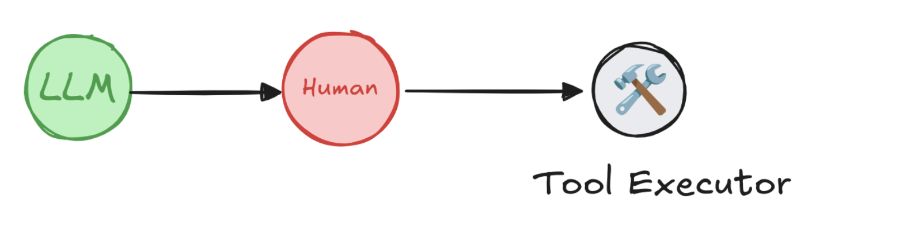

**Key capabilities**

- **Persistent execution state:** Interrupts use LangGraph's persistence layer, which saves the graph state, to indefinitely pause graph execution until you resume. This is possible because LangGraph checkpoints the graph state after each step, which allows the system to persist execution context and later resume the workflow, continuing from where it left off. This supports asynchronous human review or input without time constraints.

**There are two ways to pause a graph:**

- **Dynamic interrupts:** Use interrupt to pause a graph from inside a specific node, based on the current state of the graph.

- **Static interrupts:** Use ```interrupt_before``` and ```interrupt_after``` to pause the graph at pre-defined points, either before or after a node executes.

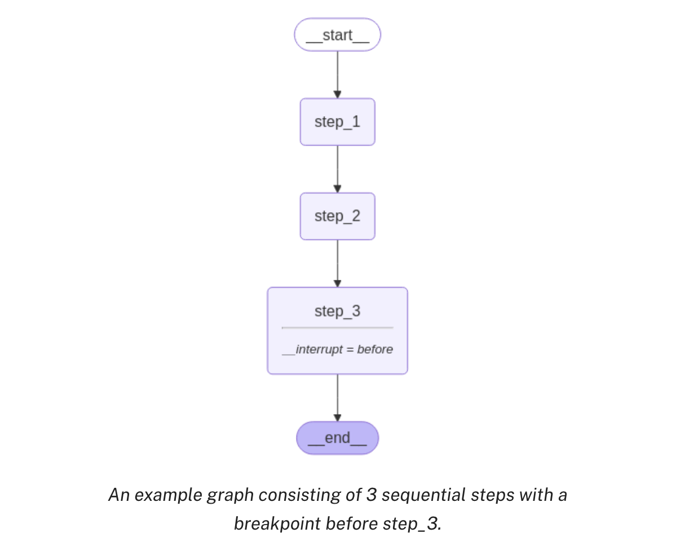

- **Flexible integration points:** Human-in-the-loop logic can be introduced at any point in the workflow. This allows targeted human involvement, such as approving API calls, correcting outputs, or guiding conversations.

**Patterns**

There are four typical design patterns that you can implement using ```interrupt``` and ```Command```:

- **Approve or reject:** Pause the graph before a critical step, such as an API call, to review and approve the action. If the action is rejected, you can prevent the graph from executing the step, and potentially take an alternative action. This pattern often involves routing the graph based on the human's input.

- **Edit graph state:** Pause the graph to review and edit the graph state. This is useful for correcting mistakes or updating the state with additional information. This pattern often involves updating the state with the human's input.

- **Review tool calls:** Pause the graph to review and edit tool calls requested by the LLM before tool execution.

- **Validate human input:** Pause the graph to validate human input before proceeding with the next step.


## Enable human intervention

To review, edit, and approve tool calls in an agent or workflow, use interrupts to pause a graph and wait for human input. Interrupts use LangGraph's ```persistence``` layer, which saves the graph state, to indefinitely pause graph execution until you resume.


**Pause using interrupt**

**Dynamic interrupts** (also known as dynamic breakpoints) are triggered based on the current state of the graph. You can set dynamic interrupts by calling **interrupt function** in the appropriate place. The graph will pause, which allows for human intervention, and then resumes the graph with their input. It's useful for tasks like approvals, edits, or gathering additional context.

To use ```interrupt``` in your graph, you need to:

1. **Specify a checkpointer** to save the graph state after each step.

2. **Call** ```interrupt()``` in the appropriate place. See the **Common Patterns** section for examples.

3. **Run the graph** with a **thread ID** until the ```interrupt``` is hit.

4. **Resume execution** using ```invoke/stream```


```
from langgraph.types import interrupt, Command

def human_node(state: State):
    value = interrupt( 
        {
            "text_to_revise": state["some_text"] 
        }
    )
    return {
        "some_text": value 
    }


graph = graph_builder.compile(checkpointer=checkpointer) 

# Run the graph until the interrupt is hit.
config = {"configurable": {"thread_id": "some_id"}}
result = graph.invoke({"some_text": "original text"}, config=config) 
print(result['__interrupt__']) 
# > [
# >    Interrupt(
# >       value={'text_to_revise': 'original text'},
# >       resumable=True,
# >       ns=['human_node:6ce9e64f-edef-fe5d-f7dc-511fa9526960']
# >    )
# > ]

print(graph.invoke(Command(resume="Edited text"), config=config)) 
# > {'some_text': 'Edited text'}
```

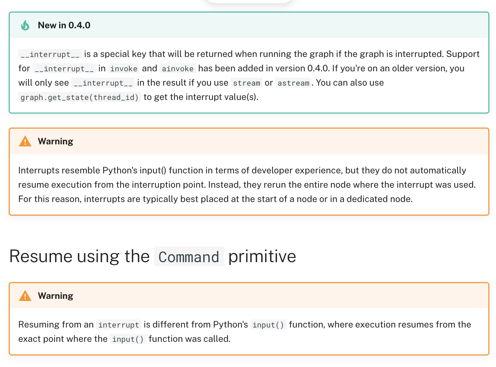

When the interrupt function is used within a graph, execution pauses at that point and awaits user input.

To resume execution, use the Command primitive, which can be supplied via the invoke or stream methods. The graph resumes execution from the beginning of the node where interrupt(...) was initially called. This time, the interrupt function will return the value provided in Command(resume=value) rather than pausing again. All code from the beginning of the node to the interrupt will be re-executed.

```
# Resume graph execution by providing the user's input.
graph.invoke(Command(resume={"age": "25"}), thread_config)
```

**Resume multiple interrupts with one invocation**

When nodes with interrupt conditions are run in parallel, it's possible to have multiple interrupts in the task queue. For example, the following graph has two nodes run in parallel that require human input:

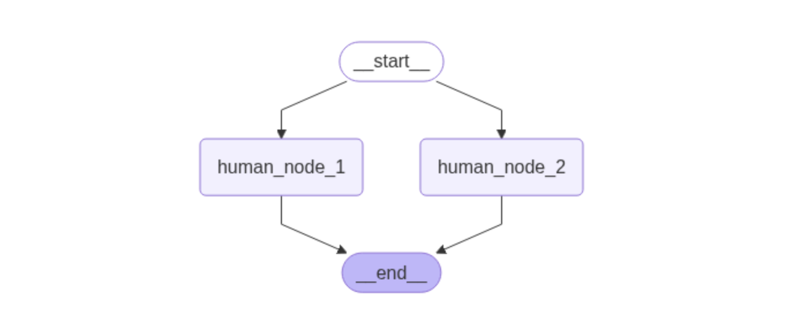

Once your graph has been interrupted and is stalled, you can resume all the interrupts at once with Command.resume, passing a dictionary mapping of interrupt ids to resume values.

```
from typing import TypedDict
import uuid
from langchain_core.runnables import RunnableConfig
from langgraph.checkpoint.memory import InMemorySaver
from langgraph.constants import START
from langgraph.graph import StateGraph
from langgraph.types import interrupt, Command


class State(TypedDict):
    text_1: str
    text_2: str


def human_node_1(state: State):
    value = interrupt({"text_to_revise": state["text_1"]})
    return {"text_1": value}


def human_node_2(state: State):
    value = interrupt({"text_to_revise": state["text_2"]})
    return {"text_2": value}


graph_builder = StateGraph(State)
graph_builder.add_node("human_node_1", human_node_1)
graph_builder.add_node("human_node_2", human_node_2)

# Add both nodes in parallel from START
graph_builder.add_edge(START, "human_node_1")
graph_builder.add_edge(START, "human_node_2")

checkpointer = InMemorySaver()
graph = graph_builder.compile(checkpointer=checkpointer)

thread_id = str(uuid.uuid4())
config: RunnableConfig = {"configurable": {"thread_id": thread_id}}
result = graph.invoke(
    {"text_1": "original text 1", "text_2": "original text 2"}, config=config
)

# Resume with mapping of interrupt IDs to values
resume_map = {
    i.id: f"edited text for {i.value['text_to_revise']}"
    for i in graph.get_state(config).interrupts
}
print(graph.invoke(Command(resume=resume_map), config=config))
# > {'text_1': 'edited text for original text 1', 'text_2': 'edited text for original text 2'}
```

**Common patterns**

Below we show different design patterns that can be implemented using interrupt and Command.

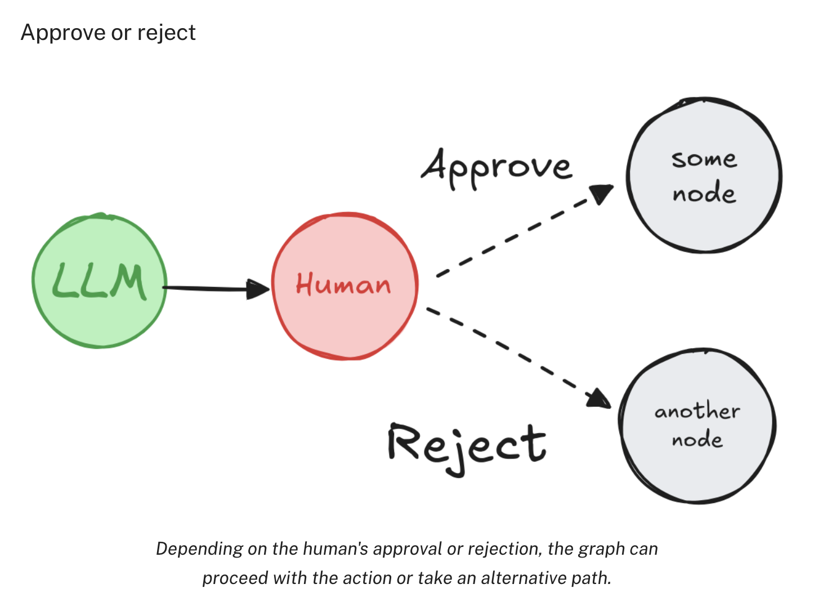


Pause the graph before a critical step, such as an API call, to review and approve the action. If the action is rejected, you can prevent the graph from executing the step, and potentially take an alternative action.

```
from typing import Literal
from langgraph.types import interrupt, Command

def human_approval(state: State) -> Command[Literal["some_node", "another_node"]]:
    is_approved = interrupt(
        {
            "question": "Is this correct?",
            # Surface the output that should be
            # reviewed and approved by the human.
            "llm_output": state["llm_output"]
        }
    )

    if is_approved:
        return Command(goto="some_node")
    else:
        return Command(goto="another_node")

# Add the node to the graph in an appropriate location
# and connect it to the relevant nodes.
graph_builder.add_node("human_approval", human_approval)
graph = graph_builder.compile(checkpointer=checkpointer)

# After running the graph and hitting the interrupt, the graph will pause.
# Resume it with either an approval or rejection.
thread_config = {"configurable": {"thread_id": "some_id"}}
graph.invoke(Command(resume=True), config=thread_config)
```

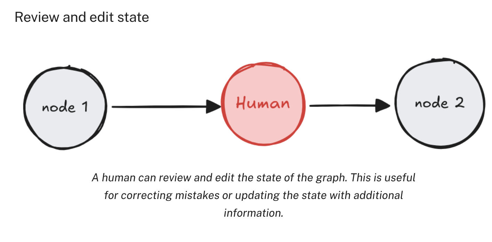

```
from langgraph.types import interrupt

def human_editing(state: State):
    ...
    result = interrupt(
        # Interrupt information to surface to the client.
        # Can be any JSON serializable value.
        {
            "task": "Review the output from the LLM and make any necessary edits.",
            "llm_generated_summary": state["llm_generated_summary"]
        }
    )

    # Update the state with the edited text
    return {
        "llm_generated_summary": result["edited_text"]
    }

# Add the node to the graph in an appropriate location
# and connect it to the relevant nodes.
graph_builder.add_node("human_editing", human_editing)
graph = graph_builder.compile(checkpointer=checkpointer)

...

# After running the graph and hitting the interrupt, the graph will pause.
# Resume it with the edited text.
thread_config = {"configurable": {"thread_id": "some_id"}}
graph.invoke(
    Command(resume={"edited_text": "The edited text"}),
    config=thread_config
)
```

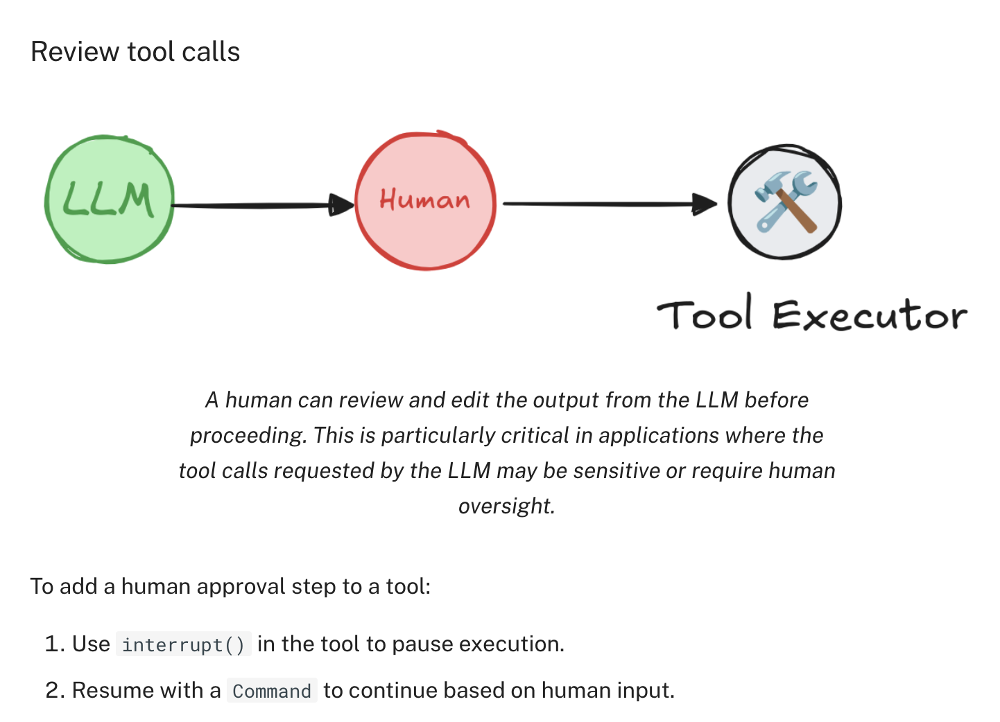


```
from langgraph.checkpoint.memory import InMemorySaver
from langgraph.types import interrupt
from langgraph.prebuilt import create_react_agent

# An example of a sensitive tool that requires human review / approval
def book_hotel(hotel_name: str):
    """Book a hotel"""
    response = interrupt(  
        f"Trying to call `book_hotel` with args {{'hotel_name': {hotel_name}}}. "
        "Please approve or suggest edits."
    )
    if response["type"] == "accept":
        pass
    elif response["type"] == "edit":
        hotel_name = response["args"]["hotel_name"]
    else:
        raise ValueError(f"Unknown response type: {response['type']}")
    return f"Successfully booked a stay at {hotel_name}."

checkpointer = InMemorySaver() 

agent = create_react_agent(
    model="anthropic:claude-3-5-sonnet-latest",
    tools=[book_hotel],
    checkpointer=checkpointer, 
)
```

Run the agent with the stream() method, passing the config object to specify the thread ID. This allows the agent to resume the same conversation on future invocations.

```
config = {
   "configurable": {
      "thread_id": "1"
   }
}

for chunk in agent.stream(
    {"messages": [{"role": "user", "content": "book a stay at McKittrick hotel"}]},
    config
):
    print(chunk)
    print("\n")
```

```You should see that the agent runs until it reaches the interrupt() call, at which point it pauses and waits for human input.```

Resume the agent with a Command to continue based on human input.

```
from langgraph.types import Command

for chunk in agent.stream(
    Command(resume={"type": "accept"}),  
    # Command(resume={"type": "edit", "args": {"hotel_name": "McKittrick Hotel"}}),
    config
):
    print(chunk)
    print("\n")
```

**Add interrupts to any tool**

You can create a wrapper to add interrupts to any tool. The example below provides a reference implementation compatible with Agent Inbox UI and Agent Chat UI.

**Wrapper that adds human-in-the-loop to any tool**

```
from typing import Callable
from langchain_core.tools import BaseTool, tool as create_tool
from langchain_core.runnables import RunnableConfig
from langgraph.types import interrupt
from langgraph.prebuilt.interrupt import HumanInterruptConfig, HumanInterrupt

def add_human_in_the_loop(
    tool: Callable | BaseTool,
    *,
    interrupt_config: HumanInterruptConfig = None,
) -> BaseTool:
    """Wrap a tool to support human-in-the-loop review."""
    if not isinstance(tool, BaseTool):
        tool = create_tool(tool)

    if interrupt_config is None:
        interrupt_config = {
            "allow_accept": True,
            "allow_edit": True,
            "allow_respond": True,
        }

    @create_tool(  
        tool.name,
        description=tool.description,
        args_schema=tool.args_schema
    )
    def call_tool_with_interrupt(config: RunnableConfig, **tool_input):
        request: HumanInterrupt = {
            "action_request": {
                "action": tool.name,
                "args": tool_input
            },
            "config": interrupt_config,
            "description": "Please review the tool call"
        }
        response = interrupt([request])[0]  
        # approve the tool call
        if response["type"] == "accept":
            tool_response = tool.invoke(tool_input, config)
        # update tool call args
        elif response["type"] == "edit":
            tool_input = response["args"]["args"]
            tool_response = tool.invoke(tool_input, config)
        # respond to the LLM with user feedback
        elif response["type"] == "response":
            user_feedback = response["args"]
            tool_response = user_feedback
        else:
            raise ValueError(f"Unsupported interrupt response type: {response['type']}")

        return tool_response

    return call_tool_with_interrupt
```

You can use the wrapper to add interrupt() to any tool without having to add it inside the tool:


```
from langgraph.checkpoint.memory import InMemorySaver
from langgraph.prebuilt import create_react_agent

checkpointer = InMemorySaver()

def book_hotel(hotel_name: str):
   """Book a hotel"""
   return f"Successfully booked a stay at {hotel_name}."


agent = create_react_agent(
    model="anthropic:claude-3-5-sonnet-latest",
    tools=[
        add_human_in_the_loop(book_hotel), 
    ],
    checkpointer=checkpointer,
)

config = {"configurable": {"thread_id": "1"}}

# Run the agent
for chunk in agent.stream(
    {"messages": [{"role": "user", "content": "book a stay at McKittrick hotel"}]},
    config
):
    print(chunk)
    print("\n")
```

**Validate human input**

If you need to validate the input provided by the human within the graph itself (rather than on the client side), you can achieve this by using multiple interrupt calls within a single node.

```
from langgraph.types import interrupt

def human_node(state: State):
    """Human node with validation."""
    question = "What is your age?"

    while True:
        answer = interrupt(question)

        # Validate answer, if the answer isn't valid ask for input again.
        if not isinstance(answer, int) or answer < 0:
            question = f"'{answer} is not a valid age. What is your age?"
            answer = None
            continue
        else:
            # If the answer is valid, we can proceed.
            break

    print(f"The human in the loop is {answer} years old.")
    return {
        "age": answer
    }
```

**Debug with interrupts**

To debug and test a graph, use static interrupts (also known as static breakpoints) to step through the graph execution one node at a time or to pause the graph execution at specific nodes. Static interrupts are triggered at defined points either before or after a node executes. You can set static interrupts by specifying interrupt_before and interrupt_after at compile time or run time.


```Static interrupts are not recommended for human-in-the-loop workflows. Use dynamic interrupts instead.```

**compile time**

```
graph = graph_builder.compile( 
    interrupt_before=["node_a"], 
    interrupt_after=["node_b", "node_c"], 
    checkpointer=checkpointer, 
)

config = {
    "configurable": {
        "thread_id": "some_thread"
    }
}

# Run the graph until the breakpoint
graph.invoke(inputs, config=thread_config) 

# Resume the graph
graph.invoke(None, config=thread_config)
```

**Run time**

```
graph.invoke( 
    inputs,
    interrupt_before=["node_a"], 
    interrupt_after=["node_b", "node_c"] 
    config={
        "configurable": {"thread_id": "some_thread"}
    },
)

config = {
    "configurable": {
        "thread_id": "some_thread"
    }
}

# Run the graph until the breakpoint
graph.invoke(inputs, config=config) 

# Resume the graph
graph.invoke(None, config=config)
```

```You cannot set static breakpoints at runtime for sub-graphs. If you have a sub-graph, you must set the breakpoints at compilation time.```

**Use static interrupts in LangGraph Studio**

You can use LangGraph Studio to debug your graph. You can set static breakpoints in the UI and then run the graph. You can also use the UI to inspect the graph state at any point in the execution.


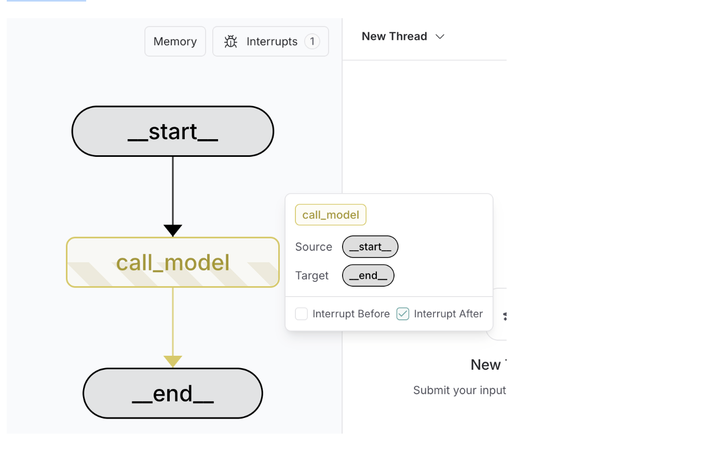


```LangGraph Studio is free with locally deployed applications using langgraph dev.```

**Considerations**

When using human-in-the-loop, there are some considerations to keep in mind.

**Using with code with side-effects**

Place code with side effects, such as API calls, after the interrupt or in a separate node to avoid duplication, as these are re-triggered every time the node is resumed.

**Side effects after interrupt**

```
from langgraph.types import interrupt

def human_node(state: State):
    """Human node with validation."""

    answer = interrupt(question)

    api_call(answer) # OK as it's after the interrupt
```

**Side effects in a separate node**

```
from langgraph.types import interrupt

def human_node(state: State):
    """Human node with validation."""

    answer = interrupt(question)

    return {
        "answer": answer
    }

def api_call_node(state: State):
    api_call(...) # OK as it's in a separate node
```

**Using with subgraphs called as functions**

When invoking a subgraph as a function, the parent graph will resume execution from the **beginning of the node** where the subgraph was invoked where the interrupt was triggered. Similarly, the **subgraph** will resume from the **beginning of the node** where the interrupt() function was called.


```
def node_in_parent_graph(state: State):
    some_code()  # <-- This will re-execute when the subgraph is resumed.
    # Invoke a subgraph as a function.
    # The subgraph contains an `interrupt` call.
    subgraph_result = subgraph.invoke(some_input)
    ...
```

**Using multiple interrupts in a single node**

Using multiple interrupts within a single node can be helpful for patterns like validating human input. However, using multiple interrupts in the same node can lead to unexpected behavior if not handled carefully.

When a node contains multiple interrupt calls, LangGraph keeps a list of resume values specific to the task executing the node. Whenever execution resumes, it starts at the beginning of the node. For each interrupt encountered, LangGraph checks if a matching value exists in the task's resume list. Matching is strictly index-based, so the order of interrupt calls within the node is critical.

To avoid issues, refrain from dynamically changing the node's structure between executions. This includes adding, removing, or reordering interrupt calls, as such changes can result in mismatched indices. These problems often arise from unconventional patterns, such as mutating state via Command(resume=..., update=SOME_STATE_MUTATION) or relying on global variables to modify the node's structure dynamically.


## Time Travel

When working with non-deterministic systems that make model-based decisions (e.g., agents powered by LLMs), it can be useful to examine their decision-making process in detail:

1. 🤔 **Understand reasoning:** Analyze the steps that led to a successful result.

2. 🐞 **Debug mistakes:** Identify where and why errors occurred.

3. 🔍 **Explore alternatives:** Test different paths to uncover better solutions.


LangGraph provides **time travel functionality** to support these use cases. Specifically, you can resume execution from a prior checkpoint — either replaying the same state or modifying it to explore alternatives. In all cases, resuming past execution produces a new fork in the history.


**Use time-travel**

To use time-travel in LangGraph:

1. **Run the graph** with initial inputs using **invoke** or **stream** methods.

2. **Identify a checkpoint in an existing thread:** Use the ```get_state_history()``` method to retrieve the execution history for a specific thread_id and locate the desired checkpoint_id.
Alternatively, set an interrupt before the node(s) where you want execution to pause. You can then find the most recent checkpoint recorded up to that interrupt.

3. **Update the graph state (optional): Use the update_state method to modify the graph's state at the checkpoint and resume execution from alternative state.

4. **Resume execution from the checkpoint:** Use the invoke or stream methods with an input of None and a configuration containing the appropriate thread_id and checkpoint_id.


**In a workflow**

This example builds a simple LangGraph workflow that generates a joke topic and writes a joke using an LLM. It demonstrates how to run the graph, retrieve past execution

checkpoints, optionally modify the state, and resume execution from a chosen checkpoint to explore alternate outcomes.

**Setup**

First we need to install the packages required

```
%%capture --no-stderr
%pip install --quiet -U langgraph langchain_anthropic
```

Next, we need to set API keys for Anthropic (the LLM we will use)

```
import uuid

from typing_extensions import TypedDict, NotRequired
from langgraph.graph import StateGraph, START, END
from langchain.chat_models import init_chat_model
from langgraph.checkpoint.memory import InMemorySaver


class State(TypedDict):
    topic: NotRequired[str]
    joke: NotRequired[str]


llm = init_chat_model(
    "anthropic:claude-3-7-sonnet-latest",
    temperature=0,
)


def generate_topic(state: State):
    """LLM call to generate a topic for the joke"""
    msg = llm.invoke("Give me a funny topic for a joke")
    return {"topic": msg.content}


def write_joke(state: State):
    """LLM call to write a joke based on the topic"""
    msg = llm.invoke(f"Write a short joke about {state['topic']}")
    return {"joke": msg.content}


# Build workflow
workflow = StateGraph(State)

# Add nodes
workflow.add_node("generate_topic", generate_topic)
workflow.add_node("write_joke", write_joke)

# Add edges to connect nodes
workflow.add_edge(START, "generate_topic")
workflow.add_edge("generate_topic", "write_joke")
workflow.add_edge("write_joke", END)

# Compile
checkpointer = InMemorySaver()
graph = workflow.compile(checkpointer=checkpointer)
graph
```

```
import uuid

from typing_extensions import TypedDict, NotRequired
from langgraph.graph import StateGraph, START, END
from langchain.chat_models import init_chat_model
from langgraph.checkpoint.memory import InMemorySaver


class State(TypedDict):
    topic: NotRequired[str]
    joke: NotRequired[str]


llm = init_chat_model(
    "anthropic:claude-3-7-sonnet-latest",
    temperature=0,
)


def generate_topic(state: State):
    """LLM call to generate a topic for the joke"""
    msg = llm.invoke("Give me a funny topic for a joke")
    return {"topic": msg.content}


def write_joke(state: State):
    """LLM call to write a joke based on the topic"""
    msg = llm.invoke(f"Write a short joke about {state['topic']}")
    return {"joke": msg.content}


# Build workflow
workflow = StateGraph(State)

# Add nodes
workflow.add_node("generate_topic", generate_topic)
workflow.add_node("write_joke", write_joke)

# Add edges to connect nodes
workflow.add_edge(START, "generate_topic")
workflow.add_edge("generate_topic", "write_joke")
workflow.add_edge("write_joke", END)

# Compile
checkpointer = InMemorySaver()
graph = workflow.compile(checkpointer=checkpointer)
graph
```

**Output:**

```
How about "The Secret Life of Socks in the Dryer"? You know, exploring the mysterious phenomenon of how socks go into the laundry as pairs but come out as singles. Where do they go? Are they starting new lives elsewhere? Is there a sock paradise we don't know about? There's a lot of comedic potential in the everyday mystery that unites us all!

# The Secret Life of Socks in the Dryer

I finally discovered where all my missing socks go after the dryer. Turns out they're not missing at all—they've just eloped with someone else's socks from the laundromat to start new lives together.

My blue argyle is now living in Bermuda with a red polka dot, posting vacation photos on Sockstagram and sending me lint as alimony.
```

** Identify a checkpoint**


```
# The states are returned in reverse chronological order.
states = list(graph.get_state_history(config))

for state in states:
    print(state.next)
    print(state.config["configurable"]["checkpoint_id"])
    print()
```

**Output:**

```
()
1f02ac4a-ec9f-6524-8002-8f7b0bbeed0e

('write_joke',)
1f02ac4a-ce2a-6494-8001-cb2e2d651227

('generate_topic',)
1f02ac4a-a4e0-630d-8000-b73c254ba748

('__start__',)
1f02ac4a-a4dd-665e-bfff-e6c8c44315d9
```

```
# This is the state before last (states are listed in chronological order)
selected_state = states[1]
print(selected_state.next)
print(selected_state.values)
```

**Output:**

```
('write_joke',)
{'topic': 'How about "The Secret Life of Socks in the Dryer"? You know, exploring the mysterious phenomenon of how socks go into the laundry as pairs but come out as singles. Where do they go? Are they starting new lives elsewhere? Is there a sock paradise we don\\'t know about? There\\'s a lot of comedic potential in the everyday mystery that unites us all!'}
```

**Update the state (optional)**

update_state will create a new checkpoint. The new checkpoint will be associated with the same thread, but a new checkpoint ID.

```
new_config = graph.update_state(selected_state.config, values={"topic": "chickens"})
print(new_config)
```

**Output:**

```
{'configurable': {'thread_id': 'c62e2e03-c27b-4cb6-8cea-ea9bfedae006', 'checkpoint_ns': '', 'checkpoint_id': '1f02ac4a-ecee-600b-8002-a1d21df32e4c'}}
```

**Resume execution from the checkpoint**

```
graph.invoke(None, new_config)
```

**Output:**

```
{'topic': 'chickens',
 'joke': 'Why did the chicken join a band?\n\nBecause it had excellent drumsticks!'}
```

## Subgraphs
A subgraph is a graph that is used as a node in another graph — this is the concept of encapsulation applied to LangGraph. Subgraphs allow you to build complex systems with multiple components that are themselves graphs.

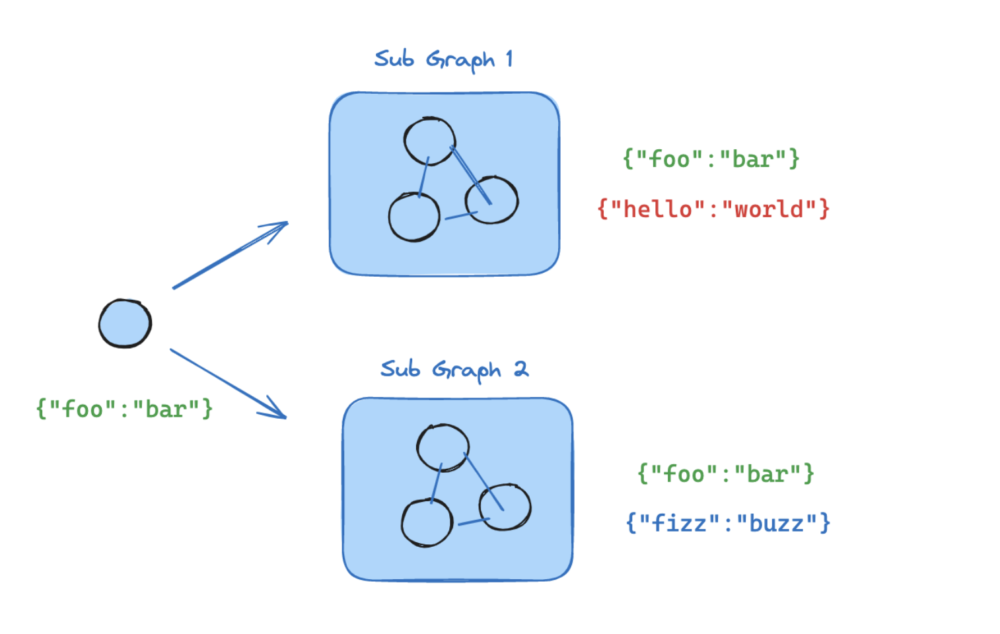

Some reasons for using subgraphs are:

- building multi-agent systems

- when you want to reuse a set of nodes in multiple graphs

- when you want different teams to work on different parts of the graph independently, you can define each part as a subgraph, and as long as the subgraph interface (the input and output schemas) is respected, the parent graph can be built without knowing any details of the subgraph

The main question when adding subgraphs is how the parent graph and subgraph communicate, i.e. how they pass the state between each other during the graph execution. There are two scenarios:

- parent and subgraph have shared state keys in their state schemas. In this case, you can include the subgraph as a node in the parent graph

```
from langgraph.graph import StateGraph, MessagesState, START

# Subgraph

def call_model(state: MessagesState):
    response = model.invoke(state["messages"])
    return {"messages": response}

subgraph_builder = StateGraph(State)
subgraph_builder.add_node(call_model)
...
subgraph = subgraph_builder.compile()

# Parent graph

builder = StateGraph(State)
builder.add_node("subgraph_node", subgraph)
builder.add_edge(START, "subgraph_node")
graph = builder.compile()
...
graph.invoke({"messages": [{"role": "user", "content": "hi!"}]})
```

- parent graph and subgraph have **different schemas** (no shared state keys in their state schemas). In this case, you have to call the subgraph from inside a node in the parent graph: this is useful when the parent graph and the subgraph have different state schemas and you need to transform state before or after calling the subgraph

```
from typing_extensions import TypedDict, Annotated
from langchain_core.messages import AnyMessage
from langgraph.graph import StateGraph, MessagesState, START
from langgraph.graph.message import add_messages

class SubgraphMessagesState(TypedDict):
    subgraph_messages: Annotated[list[AnyMessage], add_messages]

# Subgraph

def call_model(state: SubgraphMessagesState):
    response = model.invoke(state["subgraph_messages"])
    return {"subgraph_messages": response}

subgraph_builder = StateGraph(SubgraphMessagesState)
subgraph_builder.add_node("call_model_from_subgraph", call_model)
subgraph_builder.add_edge(START, "call_model_from_subgraph")
...
subgraph = subgraph_builder.compile()

# Parent graph

def call_subgraph(state: MessagesState):
    response = subgraph.invoke({"subgraph_messages": state["messages"]})
    return {"messages": response["subgraph_messages"]}

builder = StateGraph(State)
builder.add_node("subgraph_node", call_subgraph)
builder.add_edge(START, "subgraph_node")
graph = builder.compile()
...
graph.invoke({"messages": [{"role": "user", "content": "hi!"}]})
```

## Use subgraphs

This guide explains the mechanics of using subgraphs. A common application of subgraphs is to build multi-agent systems.

When adding subgraphs, you need to define how the parent graph and the subgraph communicate:

- **Shared state schemas** — parent and subgraph have **shared state keys** in their state schemas

- **Different state schemas** — **no shared state keys** in parent and subgraph schemas


**Setup**

```
pip install -U langgraph
```

**Shared state schemas**

A common case is for the parent graph and subgraph to communicate over a shared state key (channel) in the schema. For example, in multi-agent systems, the agents often communicate over a shared messages key.


If your subgraph shares state keys with the parent graph, you can follow these steps to add it to your graph:

1. Define the subgraph workflow (```subgraph_builder``` in the example below) and compile it

2. Pass compiled subgraph to the ```.add_node``` method when defining the parent graph workflow

```
from typing_extensions import TypedDict
from langgraph.graph.state import StateGraph, START

class State(TypedDict):
    foo: str

# Subgraph

def subgraph_node_1(state: State):
    return {"foo": "hi! " + state["foo"]}

subgraph_builder = StateGraph(State)
subgraph_builder.add_node(subgraph_node_1)
subgraph_builder.add_edge(START, "subgraph_node_1")
subgraph = subgraph_builder.compile()

# Parent graph

builder = StateGraph(State)
builder.add_node("node_1", subgraph)
builder.add_edge(START, "node_1")
graph = builder.compile()
```

**Full example: shared state schemas**

```
from typing_extensions import TypedDict
from langgraph.graph.state import StateGraph, START

# Define subgraph
class SubgraphState(TypedDict):
    foo: str  
    bar: str  

def subgraph_node_1(state: SubgraphState):
    return {"bar": "bar"}

def subgraph_node_2(state: SubgraphState):
    # note that this node is using a state key ('bar') that is only available in the subgraph
    # and is sending update on the shared state key ('foo')
    return {"foo": state["foo"] + state["bar"]}

subgraph_builder = StateGraph(SubgraphState)
subgraph_builder.add_node(subgraph_node_1)
subgraph_builder.add_node(subgraph_node_2)
subgraph_builder.add_edge(START, "subgraph_node_1")
subgraph_builder.add_edge("subgraph_node_1", "subgraph_node_2")
subgraph = subgraph_builder.compile()

# Define parent graph
class ParentState(TypedDict):
    foo: str

def node_1(state: ParentState):
    return {"foo": "hi! " + state["foo"]}

builder = StateGraph(ParentState)
builder.add_node("node_1", node_1)
builder.add_node("node_2", subgraph)
builder.add_edge(START, "node_1")
builder.add_edge("node_1", "node_2")
graph = builder.compile()

for chunk in graph.stream({"foo": "foo"}):
    print(chunk)
```

**Different state schemas**

For more complex systems you might want to define subgraphs that have a **completely different schema** from the parent graph (no shared keys). For example, you might want to keep a private message history for each of the agents in a multi-agent system.

If that's the case for your application, you need to define a node **function that invokes the subgraph**. This function needs to transform the input (parent) state to the subgraph state before invoking the subgraph, and transform the results back to the parent state before returning the state update from the node.

```
from typing_extensions import TypedDict
from langgraph.graph.state import StateGraph, START

class SubgraphState(TypedDict):
    bar: str

# Subgraph

def subgraph_node_1(state: SubgraphState):
    return {"bar": "hi! " + state["bar"]}

subgraph_builder = StateGraph(SubgraphState)
subgraph_builder.add_node(subgraph_node_1)
subgraph_builder.add_edge(START, "subgraph_node_1")
subgraph = subgraph_builder.compile()

# Parent graph

class State(TypedDict):
    foo: str

def call_subgraph(state: State):
    subgraph_output = subgraph.invoke({"bar": state["foo"]})  
    return {"foo": subgraph_output["bar"]}  

builder = StateGraph(State)
builder.add_node("node_1", call_subgraph)
builder.add_edge(START, "node_1")
graph = builder.compile()
```

**Full example: different state schemas**

```
from typing_extensions import TypedDict
from langgraph.graph.state import StateGraph, START

# Define subgraph
class SubgraphState(TypedDict):
    # note that none of these keys are shared with the parent graph state
    bar: str
    baz: str

def subgraph_node_1(state: SubgraphState):
    return {"baz": "baz"}

def subgraph_node_2(state: SubgraphState):
    return {"bar": state["bar"] + state["baz"]}

subgraph_builder = StateGraph(SubgraphState)
subgraph_builder.add_node(subgraph_node_1)
subgraph_builder.add_node(subgraph_node_2)
subgraph_builder.add_edge(START, "subgraph_node_1")
subgraph_builder.add_edge("subgraph_node_1", "subgraph_node_2")
subgraph = subgraph_builder.compile()

# Define parent graph
class ParentState(TypedDict):
    foo: str

def node_1(state: ParentState):
    return {"foo": "hi! " + state["foo"]}

def node_2(state: ParentState):
    response = subgraph.invoke({"bar": state["foo"]})  
    return {"foo": response["bar"]}  


builder = StateGraph(ParentState)
builder.add_node("node_1", node_1)
builder.add_node("node_2", node_2)
builder.add_edge(START, "node_1")
builder.add_edge("node_1", "node_2")
graph = builder.compile()

for chunk in graph.stream({"foo": "foo"}, subgraphs=True):
    print(chunk)
```

**Full example: different state schemas (two levels of subgraphs)**

```
# Grandchild graph
from typing_extensions import TypedDict
from langgraph.graph.state import StateGraph, START, END

class GrandChildState(TypedDict):
    my_grandchild_key: str

def grandchild_1(state: GrandChildState) -> GrandChildState:
    # NOTE: child or parent keys will not be accessible here
    return {"my_grandchild_key": state["my_grandchild_key"] + ", how are you"}


grandchild = StateGraph(GrandChildState)
grandchild.add_node("grandchild_1", grandchild_1)

grandchild.add_edge(START, "grandchild_1")
grandchild.add_edge("grandchild_1", END)

grandchild_graph = grandchild.compile()

# Child graph
class ChildState(TypedDict):
    my_child_key: str

def call_grandchild_graph(state: ChildState) -> ChildState:
    # NOTE: parent or grandchild keys won't be accessible here
    grandchild_graph_input = {"my_grandchild_key": state["my_child_key"]}  
    grandchild_graph_output = grandchild_graph.invoke(grandchild_graph_input)
    return {"my_child_key": grandchild_graph_output["my_grandchild_key"] + " today?"}  

child = StateGraph(ChildState)
child.add_node("child_1", call_grandchild_graph)  
child.add_edge(START, "child_1")
child.add_edge("child_1", END)
child_graph = child.compile()

# Parent graph
class ParentState(TypedDict):
    my_key: str

def parent_1(state: ParentState) -> ParentState:
    # NOTE: child or grandchild keys won't be accessible here
    return {"my_key": "hi " + state["my_key"]}

def parent_2(state: ParentState) -> ParentState:
    return {"my_key": state["my_key"] + " bye!"}

def call_child_graph(state: ParentState) -> ParentState:
    child_graph_input = {"my_child_key": state["my_key"]}  
    child_graph_output = child_graph.invoke(child_graph_input)
    return {"my_key": child_graph_output["my_child_key"]}  

parent = StateGraph(ParentState)
parent.add_node("parent_1", parent_1)
parent.add_node("child", call_child_graph)  
parent.add_node("parent_2", parent_2)

parent.add_edge(START, "parent_1")
parent.add_edge("parent_1", "child")
parent.add_edge("child", "parent_2")
parent.add_edge("parent_2", END)

parent_graph = parent.compile()

for chunk in parent_graph.stream({"my_key": "Bob"}, subgraphs=True):
    print(chunk)
```

**Add persistence**

You only need to **provide the checkpointer when compiling the parent graph**. LangGraph will automatically propagate the checkpointer to the child subgraphs.

```
from langgraph.graph import START, StateGraph
from langgraph.checkpoint.memory import MemorySaver
from typing_extensions import TypedDict

class State(TypedDict):
    foo: str

# Subgraph

def subgraph_node_1(state: State):
    return {"foo": state["foo"] + "bar"}

subgraph_builder = StateGraph(State)
subgraph_builder.add_node(subgraph_node_1)
subgraph_builder.add_edge(START, "subgraph_node_1")
subgraph = subgraph_builder.compile()

# Parent graph

builder = StateGraph(State)
builder.add_node("node_1", subgraph)
builder.add_edge(START, "node_1")

checkpointer = MemorySaver()
graph = builder.compile(checkpointer=checkpointer)
```

If you want the subgraph to have its own memory, you can compile it with the appropriate checkpointer option. This is useful in multi-agent systems, if you want agents to keep track of their internal message histories:

```
subgraph_builder = StateGraph(...)
subgraph = subgraph_builder.compile(checkpointer=True)
```

**View subgraph state**

When you enable persistence, you can inspect the graph state (checkpoint) via the appropriate method. To view the subgraph state, you can use the subgraphs option.

You can inspect the graph state via ```graph.get_state(config)```. To view the subgraph state, you can use ```graph.get_state(config, subgraphs=True)```.

```Subgraph state can only be viewed when the subgraph is interrupted. Once you resume the graph, you won't be able to access the subgraph state.```

**View interrupted subgraph state**

```
from langgraph.graph import START, StateGraph
from langgraph.checkpoint.memory import MemorySaver
from langgraph.types import interrupt, Command
from typing_extensions import TypedDict

class State(TypedDict):
    foo: str

# Subgraph

def subgraph_node_1(state: State):
    value = interrupt("Provide value:")
    return {"foo": state["foo"] + value}

subgraph_builder = StateGraph(State)
subgraph_builder.add_node(subgraph_node_1)
subgraph_builder.add_edge(START, "subgraph_node_1")

subgraph = subgraph_builder.compile()

# Parent graph

builder = StateGraph(State)
builder.add_node("node_1", subgraph)
builder.add_edge(START, "node_1")

checkpointer = MemorySaver()
graph = builder.compile(checkpointer=checkpointer)

config = {"configurable": {"thread_id": "1"}}

graph.invoke({"foo": ""}, config)
parent_state = graph.get_state(config)
subgraph_state = graph.get_state(config, subgraphs=True).tasks[0].state  

# resume the subgraph
graph.invoke(Command(resume="bar"), config)
```

**Stream subgraph outputs**

To include outputs from subgraphs in the streamed outputs, you can set the subgraphs option in the stream method of the parent graph. This will stream outputs from both the parent graph and any subgraphs.

```
for chunk in graph.stream(
    {"foo": "foo"},
    subgraphs=True, 
    stream_mode="updates",
):
    print(chunk)
```

**Stream from subgraphs**

```
from typing_extensions import TypedDict
from langgraph.graph.state import StateGraph, START

# Define subgraph
class SubgraphState(TypedDict):
    foo: str
    bar: str

def subgraph_node_1(state: SubgraphState):
    return {"bar": "bar"}

def subgraph_node_2(state: SubgraphState):
    # note that this node is using a state key ('bar') that is only available in the subgraph
    # and is sending update on the shared state key ('foo')
    return {"foo": state["foo"] + state["bar"]}

subgraph_builder = StateGraph(SubgraphState)
subgraph_builder.add_node(subgraph_node_1)
subgraph_builder.add_node(subgraph_node_2)
subgraph_builder.add_edge(START, "subgraph_node_1")
subgraph_builder.add_edge("subgraph_node_1", "subgraph_node_2")
subgraph = subgraph_builder.compile()

# Define parent graph
class ParentState(TypedDict):
    foo: str

def node_1(state: ParentState):
    return {"foo": "hi! " + state["foo"]}

builder = StateGraph(ParentState)
builder.add_node("node_1", node_1)
builder.add_node("node_2", subgraph)
builder.add_edge(START, "node_1")
builder.add_edge("node_1", "node_2")
graph = builder.compile()

for chunk in graph.stream(
    {"foo": "foo"},
    stream_mode="updates",
    subgraphs=True, 
):
    print(chunk)
```

## Multi-agent systems

An agent is a system that uses an LLM to decide the control flow of an application. As you develop these systems, they might grow more complex over time, making them harder to manage and scale. For example, you might run into the following problems:

- agent has too many tools at its disposal and makes poor decisions about which tool to call next

- context grows too complex for a single agent to keep track of

- there is a need for multiple specialization areas in the system (e.g. planner, researcher, math expert, etc.)

To tackle these, you might consider breaking your application into multiple smaller, independent agents and composing them into a **multi-agent system**.These independent agents can be as simple as a prompt and an LLM call, or as complex as a ReAct agent (and more!).

The primary benefits of using multi-agent systems are:

- **Modularity:** Separate agents make it easier to develop, test, and maintain agentic systems.

- **Specialization:** You can create expert agents focused on specific domains, which helps with the overall system performance.

- **Control:** You can explicitly control how agents communicate (as opposed to relying on function calling).


## Multi-agent architectures

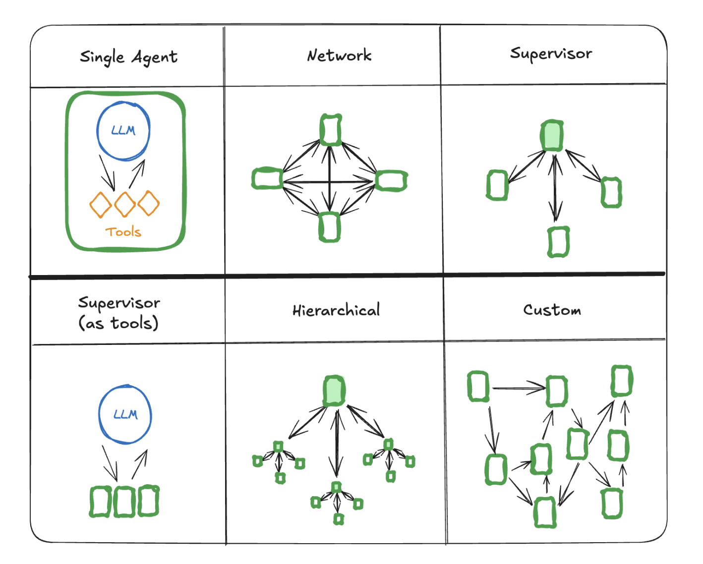

There are several ways to connect agents in a multi-agent system:

- **Network:** each agent can communicate with every other agent. Any agent can decide which other agent to call next.

- **Supervisor:** each agent communicates with a single supervisor agent. Supervisor agent makes decisions on which agent should be called next.

- **Supervisor (tool-calling):** this is a special case of supervisor architecture. Individual agents can be represented as tools. In this case, a supervisor agent uses a tool-calling LLM to decide which of the agent tools to call, as well as the arguments to pass to those agents.

- **Hierarchical:** you can define a multi-agent system with a supervisor of supervisors. This is a generalization of the supervisor architecture and allows for more complex control flows.

- **Custom multi-agent workflow:** each agent communicates with only a subset of agents. Parts of the flow are deterministic, and only some agents can decide which other agents to call next.


**Handoffs**

In multi-agent architectures, agents can be represented as graph nodes. Each agent node executes its step(s) and decides whether to finish execution or route to another agent, including potentially routing to itself (e.g., running in a loop). A common pattern in multi-agent interactions is **handoffs**, where one agent hands off control to another. Handoffs allow you to specify:

- **destination:** target agent to navigate to (e.g., name of the node to go to)

- **payload:** information to pass to that agent (e.g., state update)

To implement handoffs in LangGraph, agent nodes can return Command object that allows you to combine both control flow and state updates:

```
def agent(state) -> Command[Literal["agent", "another_agent"]]:
    # the condition for routing/halting can be anything, e.g. LLM tool call / structured output, etc.
    goto = get_next_agent(...)  # 'agent' / 'another_agent'
    return Command(
        # Specify which agent to call next
        goto=goto,
        # Update the graph state
        update={"my_state_key": "my_state_value"}
    )
```

In a more complex scenario where each agent node is itself a graph (i.e., a subgraph), a node in one of the agent subgraphs might want to navigate to a different agent. For example, if you have two agents, alice and bob (subgraph nodes in a parent graph), and alice needs to navigate to bob, you can set ```graph=Command.PARENT``` in the Command object:

```
def some_node_inside_alice(state):
    return Command(
        goto="bob",
        update={"my_state_key": "my_state_value"},
        # specify which graph to navigate to (defaults to the current graph)
        graph=Command.PARENT,
    )
```

If you need to support visualization for subgraphs communicating using Command(graph=Command.PARENT) you would need to wrap them in a node function with Command annotation: Instead of this:

```
builder.add_node(alice)
```

you would need to do this:

```
def call_alice(state) -> Command[Literal["bob"]]:
    return alice.invoke(state)

builder.add_node("alice", call_alice)
```

**Handoffs as tools**

One of the most common agent types is a tool-calling agent. For those types of agents, a common pattern is wrapping a handoff in a tool call:

```
from langchain_core.tools import tool

@tool
def transfer_to_bob():
    """Transfer to bob."""
    return Command(
        # name of the agent (node) to go to
        goto="bob",
        # data to send to the agent
        update={"my_state_key": "my_state_value"},
        # indicate to LangGraph that we need to navigate to
        # agent node in a parent graph
        graph=Command.PARENT,
    )
```

This is a special case of updating the graph state from tools where, in addition to the state update, the control flow is included as well.

If you want to use tools that return Command, you can use the prebuilt create_react_agent / ToolNode components, or else implement your own logic:

```
def call_tools(state):
    ...
    commands = [tools_by_name[tool_call["name"]].invoke(tool_call) for tool_call in tool_calls]
    return commands
```

**Network**

In this architecture, agents are defined as graph nodes. Each agent can communicate with every other agent (many-to-many connections) and can decide which agent to call next. This architecture is good for problems that do not have a clear hierarchy of agents or a specific sequence in which agents should be called.

```
from typing import Literal
from langchain_openai import ChatOpenAI
from langgraph.types import Command
from langgraph.graph import StateGraph, MessagesState, START, END

model = ChatOpenAI()

def agent_1(state: MessagesState) -> Command[Literal["agent_2", "agent_3", END]]:
    # you can pass relevant parts of the state to the LLM (e.g., state["messages"])
    # to determine which agent to call next. a common pattern is to call the model
    # with a structured output (e.g. force it to return an output with a "next_agent" field)
    response = model.invoke(...)
    # route to one of the agents or exit based on the LLM's decision
    # if the LLM returns "__end__", the graph will finish execution
    return Command(
        goto=response["next_agent"],
        update={"messages": [response["content"]]},
    )

def agent_2(state: MessagesState) -> Command[Literal["agent_1", "agent_3", END]]:
    response = model.invoke(...)
    return Command(
        goto=response["next_agent"],
        update={"messages": [response["content"]]},
    )

def agent_3(state: MessagesState) -> Command[Literal["agent_1", "agent_2", END]]:
    ...
    return Command(
        goto=response["next_agent"],
        update={"messages": [response["content"]]},
    )

builder = StateGraph(MessagesState)
builder.add_node(agent_1)
builder.add_node(agent_2)
builder.add_node(agent_3)

builder.add_edge(START, "agent_1")
network = builder.compile()
```

**Supervisor**

In this architecture, we define agents as nodes and add a supervisor node (LLM) that decides which agent nodes should be called next. We use Command to route execution to the appropriate agent node based on supervisor's decision. This architecture also lends itself well to running multiple agents in parallel or using ```map-reduce pattern```.

```
from typing import Literal
from langchain_openai import ChatOpenAI
from langgraph.types import Command
from langgraph.graph import StateGraph, MessagesState, START, END

model = ChatOpenAI()

def supervisor(state: MessagesState) -> Command[Literal["agent_1", "agent_2", END]]:
    # you can pass relevant parts of the state to the LLM (e.g., state["messages"])
    # to determine which agent to call next. a common pattern is to call the model
    # with a structured output (e.g. force it to return an output with a "next_agent" field)
    response = model.invoke(...)
    # route to one of the agents or exit based on the supervisor's decision
    # if the supervisor returns "__end__", the graph will finish execution
    return Command(goto=response["next_agent"])

def agent_1(state: MessagesState) -> Command[Literal["supervisor"]]:
    # you can pass relevant parts of the state to the LLM (e.g., state["messages"])
    # and add any additional logic (different models, custom prompts, structured output, etc.)
    response = model.invoke(...)
    return Command(
        goto="supervisor",
        update={"messages": [response]},
    )

def agent_2(state: MessagesState) -> Command[Literal["supervisor"]]:
    response = model.invoke(...)
    return Command(
        goto="supervisor",
        update={"messages": [response]},
    )

builder = StateGraph(MessagesState)
builder.add_node(supervisor)
builder.add_node(agent_1)
builder.add_node(agent_2)

builder.add_edge(START, "supervisor")

supervisor = builder.compile()
```

**Supervisor (tool-calling)**

In this variant of the supervisor architecture, we define a supervisor agent which is responsible for calling sub-agents. The sub-agents are exposed to the supervisor as tools, and the supervisor agent decides which tool to call next. The supervisor agent follows a standard implementation as an LLM running in a while loop calling tools until it decides to stop.

```
from typing import Annotated
from langchain_openai import ChatOpenAI
from langgraph.prebuilt import InjectedState, create_react_agent

model = ChatOpenAI()

# this is the agent function that will be called as tool
# notice that you can pass the state to the tool via InjectedState annotation
def agent_1(state: Annotated[dict, InjectedState]):
    # you can pass relevant parts of the state to the LLM (e.g., state["messages"])
    # and add any additional logic (different models, custom prompts, structured output, etc.)
    response = model.invoke(...)
    # return the LLM response as a string (expected tool response format)
    # this will be automatically turned to ToolMessage
    # by the prebuilt create_react_agent (supervisor)
    return response.content

def agent_2(state: Annotated[dict, InjectedState]):
    response = model.invoke(...)
    return response.content

tools = [agent_1, agent_2]
# the simplest way to build a supervisor w/ tool-calling is to use prebuilt ReAct agent graph
# that consists of a tool-calling LLM node (i.e. supervisor) and a tool-executing node
supervisor = create_react_agent(model, tools)
```

**Hierarchical**

As you add more agents to your system, it might become too hard for the supervisor to manage all of them. The supervisor might start making poor decisions about which agent to call next, or the context might become too complex for a single supervisor to keep track of. In other words, you end up with the same problems that motivated the multi-agent architecture in the first place.

To address this, you can design your system hierarchically. For example, you can create separate, specialized teams of agents managed by individual supervisors, and a top-level supervisor to manage the teams.

```
from typing import Literal
from langchain_openai import ChatOpenAI
from langgraph.graph import StateGraph, MessagesState, START, END
from langgraph.types import Command
model = ChatOpenAI()

# define team 1 (same as the single supervisor example above)

def team_1_supervisor(state: MessagesState) -> Command[Literal["team_1_agent_1", "team_1_agent_2", END]]:
    response = model.invoke(...)
    return Command(goto=response["next_agent"])

def team_1_agent_1(state: MessagesState) -> Command[Literal["team_1_supervisor"]]:
    response = model.invoke(...)
    return Command(goto="team_1_supervisor", update={"messages": [response]})

def team_1_agent_2(state: MessagesState) -> Command[Literal["team_1_supervisor"]]:
    response = model.invoke(...)
    return Command(goto="team_1_supervisor", update={"messages": [response]})

team_1_builder = StateGraph(Team1State)
team_1_builder.add_node(team_1_supervisor)
team_1_builder.add_node(team_1_agent_1)
team_1_builder.add_node(team_1_agent_2)
team_1_builder.add_edge(START, "team_1_supervisor")
team_1_graph = team_1_builder.compile()

# define team 2 (same as the single supervisor example above)
class Team2State(MessagesState):
    next: Literal["team_2_agent_1", "team_2_agent_2", "__end__"]

def team_2_supervisor(state: Team2State):
    ...

def team_2_agent_1(state: Team2State):
    ...

def team_2_agent_2(state: Team2State):
    ...

team_2_builder = StateGraph(Team2State)
...
team_2_graph = team_2_builder.compile()


# define top-level supervisor

builder = StateGraph(MessagesState)
def top_level_supervisor(state: MessagesState) -> Command[Literal["team_1_graph", "team_2_graph", END]]:
    # you can pass relevant parts of the state to the LLM (e.g., state["messages"])
    # to determine which team to call next. a common pattern is to call the model
    # with a structured output (e.g. force it to return an output with a "next_team" field)
    response = model.invoke(...)
    # route to one of the teams or exit based on the supervisor's decision
    # if the supervisor returns "__end__", the graph will finish execution
    return Command(goto=response["next_team"])

builder = StateGraph(MessagesState)
builder.add_node(top_level_supervisor)
builder.add_node("team_1_graph", team_1_graph)
builder.add_node("team_2_graph", team_2_graph)
builder.add_edge(START, "top_level_supervisor")
builder.add_edge("team_1_graph", "top_level_supervisor")
builder.add_edge("team_2_graph", "top_level_supervisor")
graph = builder.compile()
```

**Custom multi-agent workflow**

In this architecture we add individual agents as graph nodes and define the order in which agents are called ahead of time, in a custom workflow. In LangGraph the workflow can be defined in two ways:

- **Explicit control flow (normal edges):** LangGraph allows you to explicitly define the control flow of your application (i.e. the sequence of how agents communicate) explicitly, via normal graph edges. This is the most deterministic variant of this architecture above — we always know which agent will be called next ahead of time.


- **Dynamic control flow (Command):** in LangGraph you can allow LLMs to decide parts of your application control flow. This can be achieved by using Command. A special case of this is a supervisor tool-calling architecture. In that case, the tool-calling LLM powering the supervisor agent will make decisions about the order in which the tools (agents) are being called.

```
from langchain_openai import ChatOpenAI
from langgraph.graph import StateGraph, MessagesState, START

model = ChatOpenAI()

def agent_1(state: MessagesState):
    response = model.invoke(...)
    return {"messages": [response]}

def agent_2(state: MessagesState):
    response = model.invoke(...)
    return {"messages": [response]}

builder = StateGraph(MessagesState)
builder.add_node(agent_1)
builder.add_node(agent_2)
# define the flow explicitly
builder.add_edge(START, "agent_1")
builder.add_edge("agent_1", "agent_2")
```

**Communication and state management**

The most important thing when building multi-agent systems is figuring out how the agents communicate.

**Handoffs vs tool calls**

What is the "payload" that is being passed around between agents? In most of the architectures discussed above, the agents communicate via handoffs and pass the graph state as part of the handoff payload. Specifically, agents pass around lists of messages as part of the graph state. In the case of the supervisor with tool-calling, the payloads are tool call arguments.

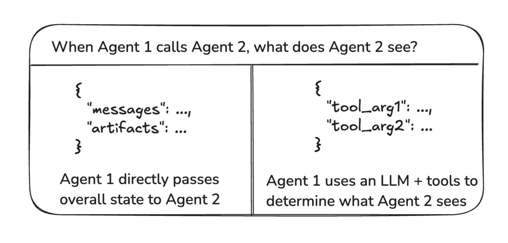

**Message passing between agents**

The most common way for agents to communicate is via a shared state channel, typically a list of messages. This assumes that there is always at least a single channel (key) in the state that is shared by the agents (e.g., messages). When communicating via a shared message list, there is an additional consideration: should the agents share the full history of their thought process or only the final result?


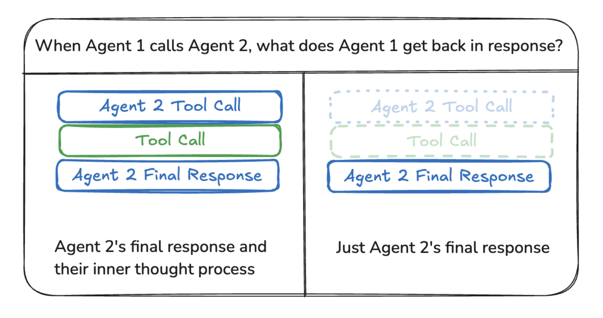

**Sharing full thought process**

Agents can share the full history of their thought process (i.e., "scratchpad") with all other agents. This "scratchpad" would typically look like a list of messages. The benefit of sharing the full thought process is that it might help other agents make better decisions and improve reasoning ability for the system as a whole. The downside is that as the number of agents and their complexity grows, the "scratchpad" will grow quickly and might require additional strategies for memory management.

**Sharing only final results**

Agents can have their own private "scratchpad" and only share the final result with the rest of the agents. This approach might work better for systems with many agents or agents that are more complex. In this case, you would need to define agents with different state schemas.

For agents called as tools, the supervisor determines the inputs based on the tool schema. Additionally, LangGraph allows passing state to individual tools at runtime, so subordinate agents can access parent state, if needed.

**Indicating agent name in messages**

It can be helpful to indicate which agent a particular AI message is from, especially for long message histories. Some LLM providers (like OpenAI) support adding a name parameter to messages — you can use that to attach the agent name to the message. If that is not supported, you can consider manually injecting the agent name into the message content, e.g., <agent>alice</agent><message>message from alice</message>.


## Multi-agent

A single agent might struggle if it needs to specialize in multiple domains or manage many tools. To tackle this, you can break your agent into smaller, independent agents and compose them into a multi-agent system.

In multi-agent systems, agents need to communicate between each other. They do so via handoffs — a primitive that describes which agent to hand control to and the payload to send to that agent.

Two of the most popular multi-agent architectures are:

- **supervisor** — individual agents are coordinated by a central supervisor agent. The supervisor controls all communication flow and task delegation, making decisions about which agent to invoke based on the current context and task requirements.


- **swarm** — agents dynamically hand off control to one another based on their specializations. The system remembers which agent was last active, ensuring that on subsequent interactions, the conversation resumes with that agent.


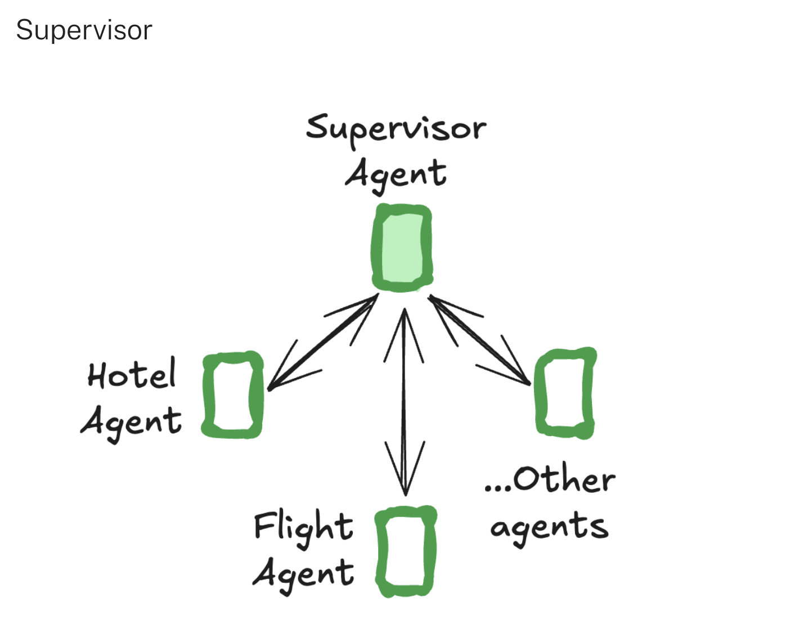

Use ```langgraph-supervisor``` library to create a supervisor multi-agent system:

```
pip install langgraph-supervisor
```

```
from langchain_openai import ChatOpenAI
from langgraph.prebuilt import create_react_agent
from langgraph_supervisor import create_supervisor

def book_hotel(hotel_name: str):
    """Book a hotel"""
    return f"Successfully booked a stay at {hotel_name}."

def book_flight(from_airport: str, to_airport: str):
    """Book a flight"""
    return f"Successfully booked a flight from {from_airport} to {to_airport}."

flight_assistant = create_react_agent(
    model="openai:gpt-4o",
    tools=[book_flight],
    prompt="You are a flight booking assistant",
    name="flight_assistant"
)

hotel_assistant = create_react_agent(
    model="openai:gpt-4o",
    tools=[book_hotel],
    prompt="You are a hotel booking assistant",
    name="hotel_assistant"
)

supervisor = create_supervisor(
    agents=[flight_assistant, hotel_assistant],
    model=ChatOpenAI(model="gpt-4o"),
    prompt=(
        "You manage a hotel booking assistant and a"
        "flight booking assistant. Assign work to them."
    )
).compile()

for chunk in supervisor.stream(
    {
        "messages": [
            {
                "role": "user",
                "content": "book a flight from BOS to JFK and a stay at McKittrick Hotel"
            }
        ]
    }
):
    print(chunk)
    print("\n")
```

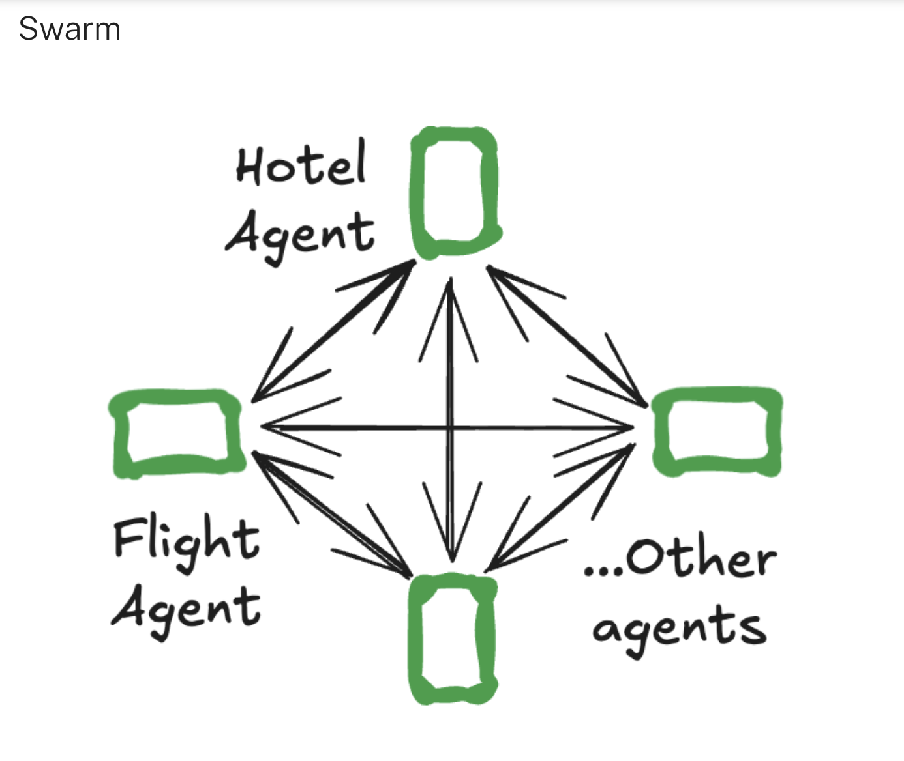

Use ```langgraph-swarm``` library to create a swarm multi-agent system:

```
pip install langgraph-swarm
```

```
from langgraph.prebuilt import create_react_agent
from langgraph_swarm import create_swarm, create_handoff_tool

transfer_to_hotel_assistant = create_handoff_tool(
    agent_name="hotel_assistant",
    description="Transfer user to the hotel-booking assistant.",
)
transfer_to_flight_assistant = create_handoff_tool(
    agent_name="flight_assistant",
    description="Transfer user to the flight-booking assistant.",
)

flight_assistant = create_react_agent(
    model="anthropic:claude-3-5-sonnet-latest",
    tools=[book_flight, transfer_to_hotel_assistant],
    prompt="You are a flight booking assistant",
    name="flight_assistant"
)
hotel_assistant = create_react_agent(
    model="anthropic:claude-3-5-sonnet-latest",
    tools=[book_hotel, transfer_to_flight_assistant],
    prompt="You are a hotel booking assistant",
    name="hotel_assistant"
)

swarm = create_swarm(
    agents=[flight_assistant, hotel_assistant],
    default_active_agent="flight_assistant"
).compile()

for chunk in swarm.stream(
    {
        "messages": [
            {
                "role": "user",
                "content": "book a flight from BOS to JFK and a stay at McKittrick Hotel"
            }
        ]
    }
):
    print(chunk)
    print("\n")
```

**Handoffs**

A common pattern in multi-agent interactions is handoffs, where one agent hands off control to another. Handoffs allow you to specify:

- **destination:** target agent to navigate to

- **payload:** information to pass to that agent

This is used both by ```langgraph-supervisor```(supervisor hands off to individual agents) and ```langgraph-swarm``` (an individual agent can hand off to other agents).

To implement handoffs with ```create_react_agent```, you need to:

1. Create a special tool that can transfer control to a different agent

```
def transfer_to_bob():
    """Transfer to bob."""
    return Command(
        # name of the agent (node) to go to
        goto="bob",
        # data to send to the agent
        update={"messages": [...]},
        # indicate to LangGraph that we need to navigate to
        # agent node in a parent graph
        graph=Command.PARENT,
    )
```

2. Create individual agents that have access to handoff tools:

```
flight_assistant = create_react_agent(
    ..., tools=[book_flight, transfer_to_hotel_assistant]
)
hotel_assistant = create_react_agent(
    ..., tools=[book_hotel, transfer_to_flight_assistant]
)
```

3. Define a parent graph that contains individual agents as nodes:

```
from langgraph.graph import StateGraph, MessagesState
multi_agent_graph = (
    StateGraph(MessagesState)
    .add_node(flight_assistant)
    .add_node(hotel_assistant)
    ...
)
```

Putting this together, here is how you can implement a simple multi-agent system with two agents — a flight booking assistant and a hotel booking assistant:


```
from typing import Annotated
from langchain_core.tools import tool, InjectedToolCallId
from langgraph.prebuilt import create_react_agent, InjectedState
from langgraph.graph import StateGraph, START, MessagesState
from langgraph.types import Command

def create_handoff_tool(*, agent_name: str, description: str | None = None):
    name = f"transfer_to_{agent_name}"
    description = description or f"Transfer to {agent_name}"

    @tool(name, description=description)
    def handoff_tool(
        state: Annotated[MessagesState, InjectedState], 
        tool_call_id: Annotated[str, InjectedToolCallId],
    ) -> Command:
        tool_message = {
            "role": "tool",
            "content": f"Successfully transferred to {agent_name}",
            "name": name,
            "tool_call_id": tool_call_id,
        }
        return Command(  
            goto=agent_name,  
            update={"messages": state["messages"] + [tool_message]},  
            graph=Command.PARENT,  
        )
    return handoff_tool

# Handoffs
transfer_to_hotel_assistant = create_handoff_tool(
    agent_name="hotel_assistant",
    description="Transfer user to the hotel-booking assistant.",
)
transfer_to_flight_assistant = create_handoff_tool(
    agent_name="flight_assistant",
    description="Transfer user to the flight-booking assistant.",
)

# Simple agent tools
def book_hotel(hotel_name: str):
    """Book a hotel"""
    return f"Successfully booked a stay at {hotel_name}."

def book_flight(from_airport: str, to_airport: str):
    """Book a flight"""
    return f"Successfully booked a flight from {from_airport} to {to_airport}."

# Define agents
flight_assistant = create_react_agent(
    model="anthropic:claude-3-5-sonnet-latest",
    tools=[book_flight, transfer_to_hotel_assistant],
    prompt="You are a flight booking assistant",
    name="flight_assistant"
)
hotel_assistant = create_react_agent(
    model="anthropic:claude-3-5-sonnet-latest",
    tools=[book_hotel, transfer_to_flight_assistant],
    prompt="You are a hotel booking assistant",
    name="hotel_assistant"
)

# Define multi-agent graph
multi_agent_graph = (
    StateGraph(MessagesState)
    .add_node(flight_assistant)
    .add_node(hotel_assistant)
    .add_edge(START, "flight_assistant")
    .compile()
)

# Run the multi-agent graph
for chunk in multi_agent_graph.stream(
    {
        "messages": [
            {
                "role": "user",
                "content": "book a flight from BOS to JFK and a stay at McKittrick Hotel"
            }
        ]
    }
):
    print(chunk)
    print("\n")
```

## Build multi-agent systems

**Handoffs**

```
from typing import Annotated
from langchain_core.tools import tool, InjectedToolCallId
from langgraph.prebuilt import create_react_agent, InjectedState
from langgraph.graph import StateGraph, START, MessagesState
from langgraph.types import Command

def create_handoff_tool(*, agent_name: str, description: str | None = None):
    name = f"transfer_to_{agent_name}"
    description = description or f"Transfer to {agent_name}"

    @tool(name, description=description)
    def handoff_tool(
        state: Annotated[MessagesState, InjectedState], 
        tool_call_id: Annotated[str, InjectedToolCallId],
    ) -> Command:
        tool_message = {
            "role": "tool",
            "content": f"Successfully transferred to {agent_name}",
            "name": name,
            "tool_call_id": tool_call_id,
        }
        return Command(  
            goto=agent_name,  
            update={"messages": state["messages"] + [tool_message]},  
            graph=Command.PARENT,  
        )
    return handoff_tool
```

**Control agent inputs**

You can use the Send() primitive to directly send data to the worker agents during the handoff. For example, you can request that the calling agent populate a task description for the next agent:

```
from typing import Annotated
from langchain_core.tools import tool, InjectedToolCallId
from langgraph.prebuilt import InjectedState
from langgraph.graph import StateGraph, START, MessagesState
from langgraph.types import Command, Send

def create_task_description_handoff_tool(
    *, agent_name: str, description: str | None = None
):
    name = f"transfer_to_{agent_name}"
    description = description or f"Ask {agent_name} for help."

    @tool(name, description=description)
    def handoff_tool(
        # this is populated by the calling agent
        task_description: Annotated[
            str,
            "Description of what the next agent should do, including all of the relevant context.",
        ],
        # these parameters are ignored by the LLM
        state: Annotated[MessagesState, InjectedState],
    ) -> Command:
        task_description_message = {"role": "user", "content": task_description}
        agent_input = {**state, "messages": [task_description_message]}
        return Command(
            goto=[Send(agent_name, agent_input)],
            graph=Command.PARENT,
        )

    return handoff_tool
```

**Build a multi-agent system**

You can use handoffs in any agents built with LangGraph. We recommend using the prebuilt agent or ToolNode, as they natively support handoffs tools returning Command. Below is an example of how you can implement a multi-agent system for booking travel using handoffs:


```
from langgraph.prebuilt import create_react_agent
from langgraph.graph import StateGraph, START, MessagesState

def create_handoff_tool(*, agent_name: str, description: str | None = None):
    # same implementation as above
    ...
    return Command(...)

# Handoffs
transfer_to_hotel_assistant = create_handoff_tool(agent_name="hotel_assistant")
transfer_to_flight_assistant = create_handoff_tool(agent_name="flight_assistant")

# Define agents
flight_assistant = create_react_agent(
    model="anthropic:claude-3-5-sonnet-latest",
    tools=[..., transfer_to_hotel_assistant],
    name="flight_assistant"
)
hotel_assistant = create_react_agent(
    model="anthropic:claude-3-5-sonnet-latest",
    tools=[..., transfer_to_flight_assistant],
    name="hotel_assistant"
)

# Define multi-agent graph
multi_agent_graph = (
    StateGraph(MessagesState)
    .add_node(flight_assistant)
    .add_node(hotel_assistant)
    .add_edge(START, "flight_assistant")
    .compile()
)
```

**Full example: Multi-agent system for booking travel**

```
from typing import Annotated
from langchain_core.messages import convert_to_messages
from langchain_core.tools import tool, InjectedToolCallId
from langgraph.prebuilt import create_react_agent, InjectedState
from langgraph.graph import StateGraph, START, MessagesState
from langgraph.types import Command

# We'll use `pretty_print_messages` helper to render the streamed agent outputs nicely

def pretty_print_message(message, indent=False):
    pretty_message = message.pretty_repr(html=True)
    if not indent:
        print(pretty_message)
        return

    indented = "\n".join("\t" + c for c in pretty_message.split("\n"))
    print(indented)


def pretty_print_messages(update, last_message=False):
    is_subgraph = False
    if isinstance(update, tuple):
        ns, update = update
        # skip parent graph updates in the printouts
        if len(ns) == 0:
            return

        graph_id = ns[-1].split(":")[0]
        print(f"Update from subgraph {graph_id}:")
        print("\n")
        is_subgraph = True

    for node_name, node_update in update.items():
        update_label = f"Update from node {node_name}:"
        if is_subgraph:
            update_label = "\t" + update_label

        print(update_label)
        print("\n")

        messages = convert_to_messages(node_update["messages"])
        if last_message:
            messages = messages[-1:]

        for m in messages:
            pretty_print_message(m, indent=is_subgraph)
        print("\n")


def create_handoff_tool(*, agent_name: str, description: str | None = None):
    name = f"transfer_to_{agent_name}"
    description = description or f"Transfer to {agent_name}"

    @tool(name, description=description)
    def handoff_tool(
        state: Annotated[MessagesState, InjectedState], 
        tool_call_id: Annotated[str, InjectedToolCallId],
    ) -> Command:
        tool_message = {
            "role": "tool",
            "content": f"Successfully transferred to {agent_name}",
            "name": name,
            "tool_call_id": tool_call_id,
        }
        return Command(  
            goto=agent_name,  
            update={"messages": state["messages"] + [tool_message]},  
            graph=Command.PARENT,  
        )
    return handoff_tool

# Handoffs
transfer_to_hotel_assistant = create_handoff_tool(
    agent_name="hotel_assistant",
    description="Transfer user to the hotel-booking assistant.",
)
transfer_to_flight_assistant = create_handoff_tool(
    agent_name="flight_assistant",
    description="Transfer user to the flight-booking assistant.",
)

# Simple agent tools
def book_hotel(hotel_name: str):
    """Book a hotel"""
    return f"Successfully booked a stay at {hotel_name}."

def book_flight(from_airport: str, to_airport: str):
    """Book a flight"""
    return f"Successfully booked a flight from {from_airport} to {to_airport}."

# Define agents
flight_assistant = create_react_agent(
    model="anthropic:claude-3-5-sonnet-latest",
    tools=[book_flight, transfer_to_hotel_assistant],
    prompt="You are a flight booking assistant",
    name="flight_assistant"
)
hotel_assistant = create_react_agent(
    model="anthropic:claude-3-5-sonnet-latest",
    tools=[book_hotel, transfer_to_flight_assistant],
    prompt="You are a hotel booking assistant",
    name="hotel_assistant"
)

# Define multi-agent graph
multi_agent_graph = (
    StateGraph(MessagesState)
    .add_node(flight_assistant)
    .add_node(hotel_assistant)
    .add_edge(START, "flight_assistant")
    .compile()
)

# Run the multi-agent graph
for chunk in multi_agent_graph.stream(
    {
        "messages": [
            {
                "role": "user",
                "content": "book a flight from BOS to JFK and a stay at McKittrick Hotel"
            }
        ]
    },
    subgraphs=True
):
    pretty_print_messages(chunk)
```


**Multi-turn conversation**

Users might want to engage in a multi-turn conversation with one or more agents. To build a system that can handle this, you can create a node that uses an interrupt to collect user input and routes back to the active agent.

The agents can then be implemented as nodes in a graph that executes agent steps and determines the next action:

1. **Wait for user input** to continue the conversation, or

2. **Route to another agent** (or back to itself, such as in a loop) via a handoff


```
def human(state) -> Command[Literal["agent", "another_agent"]]:
    """A node for collecting user input."""
    user_input = interrupt(value="Ready for user input.")

    # Determine the active agent.
    active_agent = ...

    ...
    return Command(
        update={
            "messages": [{
                "role": "human",
                "content": user_input,
            }]
        },
        goto=active_agent
    )

def agent(state) -> Command[Literal["agent", "another_agent", "human"]]:
    # The condition for routing/halting can be anything, e.g. LLM tool call / structured output, etc.
    goto = get_next_agent(...)  # 'agent' / 'another_agent'
    if goto:
        return Command(goto=goto, update={"my_state_key": "my_state_value"})
    else:
        return Command(goto="human") # Go to human node
```

## MCP

Model Context Protocol (MCP) is an open protocol that standardizes how applications provide tools and context to language models. LangGraph agents can use tools defined on MCP servers through the langchain-mcp-adapters library.

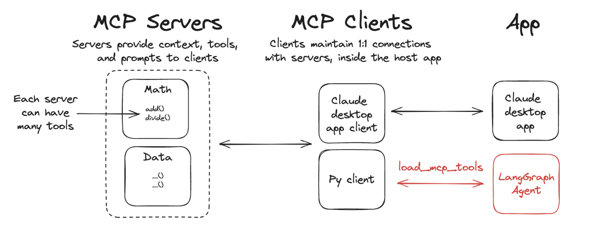

Install the ```langchain-mcp-adapters``` library to use MCP tools in LangGraph:

```
pip install langchain-mcp-adapters
```

**Use MCP tools**

The ```langchain-mcp-adapters``` package enables agents to use tools defined across one or more MCP servers.


**In an agent**

```
from langchain_mcp_adapters.client import MultiServerMCPClient
from langgraph.prebuilt import create_react_agent

client = MultiServerMCPClient(
    {
        "math": {
            "command": "python",
            # Replace with absolute path to your math_server.py file
            "args": ["/path/to/math_server.py"],
            "transport": "stdio",
        },
        "weather": {
            # Ensure you start your weather server on port 8000
            "url": "http://localhost:8000/mcp",
            "transport": "streamable_http",
        }
    }
)
tools = await client.get_tools()
agent = create_react_agent(
    "anthropic:claude-3-7-sonnet-latest",
    tools
)
math_response = await agent.ainvoke(
    {"messages": [{"role": "user", "content": "what's (3 + 5) x 12?"}]}
)
weather_response = await agent.ainvoke(
    {"messages": [{"role": "user", "content": "what is the weather in nyc?"}]}
)
```

**In a workflow**

```
from langchain_mcp_adapters.client import MultiServerMCPClient
from langchain.chat_models import init_chat_model
from langgraph.graph import StateGraph, MessagesState, START, END
from langgraph.prebuilt import ToolNode

# Initialize the model
model = init_chat_model("anthropic:claude-3-5-sonnet-latest")

# Set up MCP client
client = MultiServerMCPClient(
    {
        "math": {
            "command": "python",
            # Make sure to update to the full absolute path to your math_server.py file
            "args": ["./examples/math_server.py"],
            "transport": "stdio",
        },
        "weather": {
            # make sure you start your weather server on port 8000
            "url": "http://localhost:8000/mcp/",
            "transport": "streamable_http",
        }
    }
)
tools = await client.get_tools()

# Bind tools to model
model_with_tools = model.bind_tools(tools)

# Create ToolNode
tool_node = ToolNode(tools)

def should_continue(state: MessagesState):
    messages = state["messages"]
    last_message = messages[-1]
    if last_message.tool_calls:
        return "tools"
    return END

# Define call_model function
async def call_model(state: MessagesState):
    messages = state["messages"]
    response = await model_with_tools.ainvoke(messages)
    return {"messages": [response]}

# Build the graph
builder = StateGraph(MessagesState)
builder.add_node("call_model", call_model)
builder.add_node("tools", tool_node)

builder.add_edge(START, "call_model")
builder.add_conditional_edges(
    "call_model",
    should_continue,
)
builder.add_edge("tools", "call_model")

# Compile the graph
graph = builder.compile()

# Test the graph
math_response = await graph.ainvoke(
    {"messages": [{"role": "user", "content": "what's (3 + 5) x 12?"}]}
)
weather_response = await graph.ainvoke(
    {"messages": [{"role": "user", "content": "what is the weather in nyc?"}]}
)
```

**Custom MCP servers**

To create your own MCP servers, you can use the mcp library. This library provides a simple way to define tools and run them as servers.

Install the MCP library:

```
pip install mcp
```

Use the following reference implementations to test your agent with MCP tool servers.

**Example Math Server (stdio transport)**

```
from mcp.server.fastmcp import FastMCP

mcp = FastMCP("Math")

@mcp.tool()
def add(a: int, b: int) -> int:
    """Add two numbers"""
    return a + b

@mcp.tool()
def multiply(a: int, b: int) -> int:
    """Multiply two numbers"""
    return a * b

if __name__ == "__main__":
    mcp.run(transport="stdio")
```

**Example Weather Server (Streamable HTTP transport)**

```
from mcp.server.fastmcp import FastMCP

mcp = FastMCP("Weather")

@mcp.tool()
async def get_weather(location: str) -> str:
    """Get weather for location."""
    return "It's always sunny in New York"

if __name__ == "__main__":
    mcp.run(transport="streamable-http")
```

## Tracing
Traces are a series of steps that your application takes to go from input to output. Each of these individual steps is represented by a run. You can use ```LangSmith``` to visualize these execution steps. To use it, enable tracing for your application. This enables you to do the following:


**Enable tracing for your application**

```
export LANGSMITH_TRACING=true
export LANGSMITH_API_KEY=<your-api-key>
```

## Evals

To evaluate your agent's performance you can use LangSmith evaluations. You would need to first define an evaluator function to judge the results from an agent, such as final outputs or trajectory. Depending on your evaluation technique, this may or may not involve a reference output:

```
def evaluator(*, outputs: dict, reference_outputs: dict):
    # compare agent outputs against reference outputs
    output_messages = outputs["messages"]
    reference_messages = reference_outputs["messages"]
    score = compare_messages(output_messages, reference_messages)
    return {"key": "evaluator_score", "score": score}
```

To get started, you can use prebuilt evaluators from AgentEvals package:

```
pip install -U agentevals
```

**Create evaluator**

A common way to evaluate agent performance is by comparing its trajectory (the order in which it calls its tools) against a reference trajectory:

```
import json
from agentevals.trajectory.match import create_trajectory_match_evaluator

outputs = [
    {
        "role": "assistant",
        "tool_calls": [
            {
                "function": {
                    "name": "get_weather",
                    "arguments": json.dumps({"city": "san francisco"}),
                }
            },
            {
                "function": {
                    "name": "get_directions",
                    "arguments": json.dumps({"destination": "presidio"}),
                }
            }
        ],
    }
]
reference_outputs = [
    {
        "role": "assistant",
        "tool_calls": [
            {
                "function": {
                    "name": "get_weather",
                    "arguments": json.dumps({"city": "san francisco"}),
                }
            },
        ],
    }
]

# Create the evaluator
evaluator = create_trajectory_match_evaluator(
    trajectory_match_mode="superset",  
)

# Run the evaluator
result = evaluator(
    outputs=outputs, reference_outputs=reference_outputs
)
```

**LLM-as-a-judge**

You can use LLM-as-a-judge evaluator that uses an LLM to compare the trajectory against the reference outputs and output a score:

```
import json
from agentevals.trajectory.llm import (
    create_trajectory_llm_as_judge,
    TRAJECTORY_ACCURACY_PROMPT_WITH_REFERENCE
)

evaluator = create_trajectory_llm_as_judge(
    prompt=TRAJECTORY_ACCURACY_PROMPT_WITH_REFERENCE,
    model="openai:o3-mini"
)
```

**Run evaluator**

To run an evaluator, you will first need to create a LangSmith dataset. To use the prebuilt AgentEvals evaluators, you will need a dataset with the following schema:

- **input**: {"messages": [...]} input messages to call the agent with.
- **output**: {"messages": [...]} expected message history in the agent output. For trajectory evaluation, you can choose to keep only assistant messages.

```
from langsmith import Client
from langgraph.prebuilt import create_react_agent
from agentevals.trajectory.match import create_trajectory_match_evaluator

client = Client()
agent = create_react_agent(...)
evaluator = create_trajectory_match_evaluator(...)

experiment_results = client.evaluate(
    lambda inputs: agent.invoke(inputs),
    # replace with your dataset name
    data="<Name of your dataset>",
    evaluators=[evaluator]
)
```

## Reference

[!LangGraph](https://langchain-ai.github.io/langgraph/reference/)

