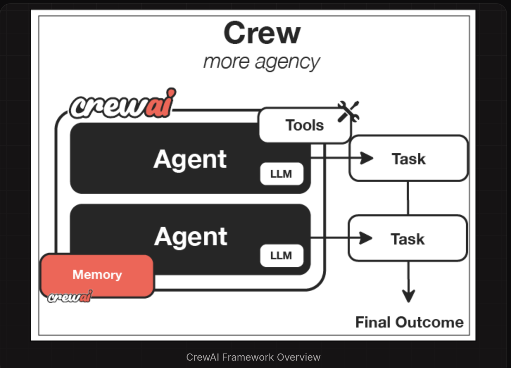
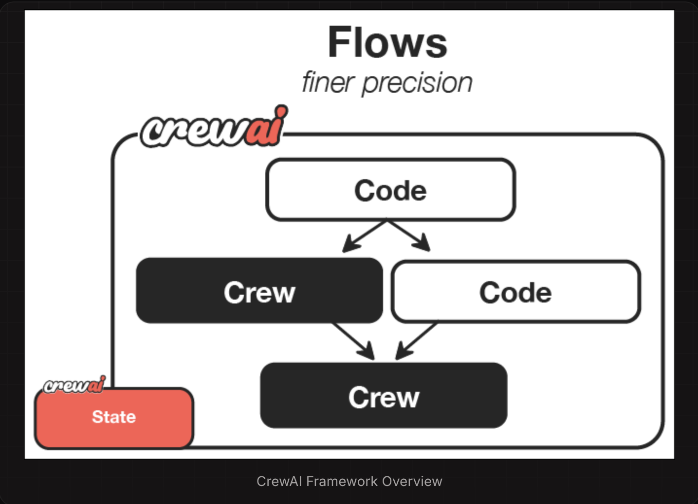
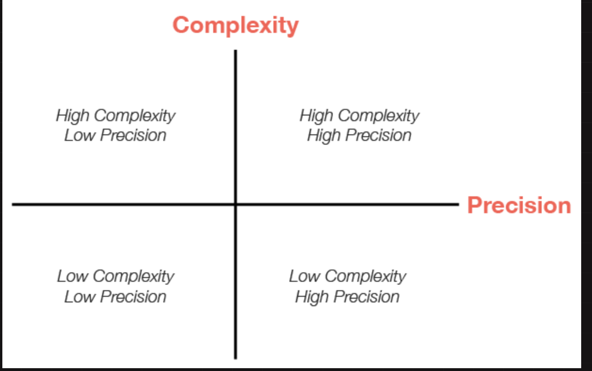

## What is CrewAI?
CrewAI is a lean, lightning-fast Python framework built entirely from scratch—completely independent of LangChain or other agent frameworks.


## ✅ Core Components of a Crew Flow
| Component     | Description                                                                                           |
| ------------- | ----------------------------------------------------------------------------------------------------- |
| **Agents**    | Individual LLM-powered workers with a role, goal, and behavior (e.g., Researcher, Analyst, Developer) |
| **Tasks**     | Discrete units of work assigned to agents (e.g., "Summarize a report", "Extract financial KPIs")      |
| **Crew**      | A team of agents orchestrated to execute a full task plan                                             |
| **Crew Flow** | The execution pipeline that controls how the agents collaborate to complete the full workflow         |

## Why CrewAI?


CrewAI unlocks the true potential of multi-agent automation, delivering the best-in-class combination of speed, flexibility, and control with either Crews of AI Agents or Flows of Events:

- **Standalone Framework:** Built from scratch, independent of LangChain or any other agent framework.
- **High Performance:** Optimized for speed and minimal resource usage, enabling faster execution.
- **Flexible Low Level Customization:** Complete freedom to customize at both high and low levels - from overall workflows and system architecture to granular agent behaviors, internal prompts, and execution logic.
- **Ideal for Every Use Case:** Proven effective for both simple tasks and highly complex, real-world, enterprise-grade scenarios.

## Understanding Flows and Crews
CrewAI offers two powerful, complementary approaches that work seamlessly together to build sophisticated AI applications:

1. **Crews:** Teams of AI agents with true autonomy and agency, working together to accomplish complex tasks through role-based collaboration. Crews enable:
    - Natural, autonomous decision-making between agents
    - Dynamic task delegation and collaboration
    - Specialized roles with defined goals and expertise
    - Flexible problem-solving approaches

2. **Flows:** Production-ready, event-driven workflows that deliver precise control over complex automations. Flows provide:
    - Fine-grained control over execution paths for real-world scenarios
    - Secure, consistent state management between tasks
    - Clean integration of AI agents with production Python code
    - Conditional branching for complex business logic

The true power of CrewAI emerges when combining Crews and Flows. This synergy allows you to:

    - Build complex, production-grade applications
    - Balance autonomy with precise control
    - Handle sophisticated real-world scenarios
    - Maintain clean, maintainable code structure

## Getting Started with Installation
To get started with CrewAI, follow these simple steps:

## 1. Installation

- Ensure you have Python >=3.10 <3.13 installed on your system.
- CrewAI uses **UV** for dependency management and package handling, offering a seamless setup and execution experience.

First, install CrewAI:

```
pip install crewai
```

If you want to install the 'crewai' package along with its optional features that include additional tools for agents, you can do so by using the following command:

```
pip install 'crewai[tools]'
```

## Common Issues
1. **ModuleNotFoundError: No module named** ```'tiktoken'```

    - Install tiktoken explicitly: pip install 'crewai[embeddings]'
    -If using embedchain or other tools: pip install 'crewai[tools]'

2. **Failed building wheel for tiktoken**

    - Ensure Rust compiler is installed (see installation steps above)
    - For Windows: Verify Visual C++ Build Tools are installed
    - Try upgrading pip: ```pip install --upgrade pip```
    - If issues persist, use a pre-built wheel: ```pip install tiktoken --prefer-binary```


## 2. Setting Up Your Crew with the YAML Configuration

To create a new CrewAI project, run the following CLI (Command Line Interface) command:

```
crewai create crew <project_name>
```

This command creates a new project folder with the following structure:

```
my_project/
├── .gitignore
├── pyproject.toml
├── README.md
├── .env
└── src/
    └── my_project/
        ├── __init__.py
        ├── main.py
        ├── crew.py
        ├── tools/
        │   ├── custom_tool.py
        │   └── __init__.py
        └── config/
            ├── agents.yaml
            └── tasks.yaml
```

- You can now start developing your crew by editing the files in the ```src/my_project``` folder.
- Entry point of the project, the ```crew.py``` file is where you define your crew.
- The ```agents.yaml``` file is where you define your agents
- The ```tasks.yaml``` file is where you define your tasks.

**To customize your project, you can:**
- Modify ```src/my_project/config/agents.yaml``` to define your agents.
- Modify ```src/my_project/config/tasks.yaml``` to define your tasks.
- Modify ```src/my_project/crew.py``` to add your own logic, tools, and specific arguments.
- Modify ```src/my_project/main.py``` to add custom inputs for your agents and tasks.
- Add your environment variables into the ```.env``` file.


## Example of a simple crew with a sequential process:

Instantiate your crew:

```
crewai create crew latest-ai-development
```

Modify the files as needed to fit your use case:

**agents.yaml**

```
# src/my_project/config/agents.yaml
researcher:
  role: >
    {topic} Senior Data Researcher
  goal: >
    Uncover cutting-edge developments in {topic}
  backstory: >
    You're a seasoned researcher with a knack for uncovering the latest
    developments in {topic}. Known for your ability to find the most relevant
    information and present it in a clear and concise manner.

reporting_analyst:
  role: >
    {topic} Reporting Analyst
  goal: >
    Create detailed reports based on {topic} data analysis and research findings
  backstory: >
    You're a meticulous analyst with a keen eye for detail. You're known for
    your ability to turn complex data into clear and concise reports, making
    it easy for others to understand and act on the information you provide.
```

**tasks.yaml**

```
# src/my_project/config/tasks.yaml
research_task:
  description: >
    Conduct a thorough research about {topic}
    Make sure you find any interesting and relevant information given
    the current year is 2025.
  expected_output: >
    A list with 10 bullet points of the most relevant information about {topic}
  agent: researcher

reporting_task:
  description: >
    Review the context you got and expand each topic into a full section for a report.
    Make sure the report is detailed and contains any and all relevant information.
  expected_output: >
    A fully fledge reports with the mains topics, each with a full section of information.
    Formatted as markdown without '```'
  agent: reporting_analyst
  output_file: report.md
```

**crew.py**

```
# src/my_project/crew.py
from crewai import Agent, Crew, Process, Task
from crewai.project import CrewBase, agent, crew, task
from crewai_tools import SerperDevTool
from crewai.agents.agent_builder.base_agent import BaseAgent
from typing import List

@CrewBase
class LatestAiDevelopmentCrew():
	"""LatestAiDevelopment crew"""
	agents: List[BaseAgent]
	tasks: List[Task]

	@agent
	def researcher(self) -> Agent:
		return Agent(
			config=self.agents_config['researcher'],
			verbose=True,
			tools=[SerperDevTool()]
		)

	@agent
	def reporting_analyst(self) -> Agent:
		return Agent(
			config=self.agents_config['reporting_analyst'],
			verbose=True
		)

	@task
	def research_task(self) -> Task:
		return Task(
			config=self.tasks_config['research_task'],
		)

	@task
	def reporting_task(self) -> Task:
		return Task(
			config=self.tasks_config['reporting_task'],
			output_file='report.md'
		)

	@crew
	def crew(self) -> Crew:
		"""Creates the LatestAiDevelopment crew"""
		return Crew(
			agents=self.agents, # Automatically created by the @agent decorator
			tasks=self.tasks, # Automatically created by the @task decorator
			process=Process.sequential,
			verbose=True,
		)
```

**main.py**

```
#!/usr/bin/env python
# src/my_project/main.py
import sys
from latest_ai_development.crew import LatestAiDevelopmentCrew

def run():
    """
    Run the crew.
    """
    inputs = {
        'topic': 'AI Agents'
    }
    LatestAiDevelopmentCrew().crew().kickoff(inputs=inputs)
```

## 3. Running Your Crew

Before running your crew, make sure you have the following keys set as environment variables in your .env file:

- An OpenAI API key (or other LLM API key): ```OPENAI_API_KEY=sk-...```
- A Serper.dev API key: ```SERPER_API_KEY=YOUR_KEY_HERE```

Lock the dependencies and install them by using the CLI command but first, navigate to your project directory:

```
cd my_project
crewai install (Optional)
```

To run your crew, execute the following command in the root of your project:

```
crewai run
```

or

```
python src/my_project/main.py
```

If an error happens due to the usage of poetry, please run the following command to update your crewai package:

```
crewai update
```

You should see the output in the console and the ```report.md``` file should be created in the root of your project with the full final report.

## In addition to the sequential process, you can use the hierarchical process, which automatically assigns a manager to the defined crew to properly coordinate the planning and execution of tasks through delegation and validation of results.


## Code Snippet Example

```
from crewai import Agent, Task, Crew

# Define agents
analyst = Agent(role="Risk Analyst", ...)
modeler = Agent(role="Credit Modeler", ...)
writer = Agent(role="Report Generator", ...)

# Assign tasks
tasks = [
    Task(agent=analyst, description="Collect applicant financial info"),
    Task(agent=modeler, description="Run risk model and produce score"),
    Task(agent=writer, description="Write risk report and recommendation")
]

# Define Crew (Flow)
credit_assessment_crew = Crew(
    agents=[analyst, modeler, writer],
    tasks=tasks,
    process="sequential"  # could also be "async" or "concurrent"
)

# Execute the flow
output = credit_assessment_crew.run()
print(output)
```

## How Crews Work


| Component  | Description                   | Key Features                                                                 |
|------------|-------------------------------|------------------------------------------------------------------------------|
| Crew       | The top-level organization    | • Manages AI agent teams<br>• Oversees workflows<br>• Ensures collaboration<br>• Delivers outcomes |
| AI Agents  | Specialized team members      | • Have specific roles (researcher, writer)<br>• Use designated tools<br>• Can delegate tasks<br>• Make autonomous decisions |
| Process    | Workflow management system    | • Defines collaboration patterns<br>• Controls task assignments<br>• Manages interactions<br>• Ensures efficient execution |
| Tasks      | Individual assignments        | • Have clear objectives<br>• Use specific tools<br>• Feed into larger process<br>• Produce actionable results |

## How It All Works Together

1. The **Crew** organizes the overall operation
2. **AI Agents** work on their specialized tasks
3. The **Process** ensures smooth collaboration
4. **Tasks** get completed to achieve the goal

## Key Features

**Role-Based Agents:** Create specialized agents with defined roles, expertise, and goals - from researchers to analysts to writers

**Intelligent Collaboration:** Agents work together, sharing insights and coordinating tasks to achieve complex objectives

**Flexible Tools:** Equip agents with custom tools and APIs to interact with external services and data sources

**Task Management:** Define sequential or parallel workflows, with agents automatically handling task dependencies

## How Flows Work
While Crews excel at autonomous collaboration, Flows provide structured automations, offering granular control over workflow execution. Flows ensure tasks are executed reliably, securely, and efficiently, handling conditional logic, loops, and dynamic state management with precision. Flows integrate seamlessly with Crews, enabling you to balance high autonomy with exacting control.



| Component    | Description                           | Key Features                                                                 |
|--------------|---------------------------------------|------------------------------------------------------------------------------|
| Flow         | Structured workflow orchestration     | • Manages execution paths<br>• Handles state transitions<br>• Controls task sequencing<br>• Ensures reliable execution |
| Events       | Triggers for workflow actions         | • Initiate specific processes<br>• Enable dynamic responses<br>• Support conditional branching<br>• Allow for real-time adaptation |
| States       | Workflow execution contexts           | • Maintain execution data<br>• Enable persistence<br>• Support resumability<br>• Ensure execution integrity |
| Crew Support | Enhances workflow automation          | • Injects pockets of agency when needed<br>• Complements structured workflows<br>• Balances automation with intelligence<br>• Enables adaptive decision-making |


## Key Capabilities

**Event-Driven Orchestration:** Define precise execution paths responding dynamically to events

**Native Crew Integration:** Effortlessly combine with Crews for enhanced autonomy and intelligence

**Fine-Grained Control:** Manage workflow states and conditional execution securely and efficiently

**Deterministic Execution:** Ensure predictable outcomes with explicit control flow and error handling

## When to Use Crews vs. Flows
Understanding when to use **Crews** versus **Flows** is key to maximizing the potential of CrewAI in your applications.

| Use Case               | Recommended Approach    | Why?                                                                         |
|------------------------|-------------------------|------------------------------------------------------------------------------|
| Open-ended research    | Crews                  | When tasks require creative thinking, exploration, and adaptation           |
| Content generation     | Crews                  | For collaborative creation of articles, reports, or marketing materials      |
| Decision workflows     | Flows                  | When you need predictable, auditable decision paths with precise control    |
| API orchestration      | Flows                  | For reliable integration with multiple external services in a specific sequence |
| Hybrid applications   | Combined approach       | Use Flows to orchestrate overall process with Crews handling complex subtasks |

## Decision Framework

- **Choose Crews when:** You need autonomous problem-solving, creative collaboration, or exploratory tasks

- **Choose Flows when:** You require deterministic outcomes, auditability, or precise control over execution

- **Combine both when:** Your application needs both structured processes and pockets of autonomous intelligence

## Why Choose CrewAI?

- **Autonomous Operation:** Agents make intelligent decisions based on their roles and available tools

- **Natural Interaction:** Agents communicate and collaborate like human team members

- **Extensible Design:** Easy to add new tools, roles, and capabilities

- **Production Ready:** Built for reliability and scalability in real-world applications

- **Security-Focused:** Designed with enterprise security requirements in mind

- **Cost-Efficient:** Optimized to minimize token usage and API calls

## Strategy

## Evaluating Use Cases for CrewAI

Learn how to assess your AI application needs and choose the right approach between Crews and Flows based on complexity and precision requirements.

## Understanding the Decision Framework
When building AI applications with CrewAI, one of the most important decisions you’ll make is choosing the right approach for your specific use case.Should you use a Crew? A Flow? A combination of both?
This guide will help you evaluate your requirements and make informed architectural decisions.

At the heart of this decision is understanding the relationship between complexity and precision in your application:



This matrix helps visualize how different approaches align with varying requirements for complexity and precision. Let’s explore what each quadrant means and how it guides your architectural choices.

## The Complexity-Precision Matrix Explained

**What is Complexity?**

In the context of CrewAI applications, **complexity** refers to:

- The number of distinct steps or operations required
- The diversity of tasks that need to be performed
- The interdependencies between different components
- The need for conditional logic and branching
- The sophistication of the overall workflow

## What is Precision?

**Precision** in this context refers to:

- The accuracy required in the final output
- The need for structured, predictable results
- The importance of reproducibility
- The level of control needed over each step
- The tolerance for variation in outputs

## The Four Quadrants
1. Low Complexity, Low Precision

**Characteristics:**

- Simple, straightforward tasks
- Tolerance for some variation in outputs
- Limited number of steps
- Creative or exploratory applications

**Recommended Approach:** Simple Crews with minimal agents

**Example Use Cases:**
- Basic content generation
- Idea brainstorming
- Simple summarization tasks
- Creative writing assistance

## 2. Low Complexity, High Precision

**Characteristics:**
- Simple workflows that require exact, structured outputs
- Need for reproducible results
- Limited steps but high accuracy requirements
- Often involves data processing or transformation

**Example Use Cases:**

- Data extraction and transformation
- Form filling and validation
- Structured content generation (JSON, XML)
- Simple classification tasks

## 3. High Complexity, Low Precision

**Characteristics:**

- Multi-stage processes with many steps
- Creative or exploratory outputs
- Complex interactions between components
- Tolerance for variation in final results

**Recommended Approach:** Complex Crews with multiple specialized agents

**Example Use Cases:**

- Research and analysis
- Content creation pipelines
- Exploratory data analysis
- Creative problem-solving

## 4. High Complexity, High Precision

**Characteristics:**

- Complex workflows requiring structured outputs
- Multiple interdependent steps with strict accuracy requirements
- Need for both sophisticated processing and precise results
- Often mission-critical applications


**Recommended Approach:** Flows orchestrating multiple Crews with validation steps

**Example Use Cases:**

- Enterprise decision support systems
- Complex data processing pipelines
- Multi-stage document processing
- Regulated industry applications

## Choosing Between Crews and Flows

**When to Choose Crews**
Crews are ideal when:

1. **You need collaborative intelligence** - Multiple agents with different specializations need to work together

2. **The problem requires emergent thinking** - The solution benefits from different perspectives and approaches

3. **The task is primarily creative or analytical** - The work involves research, content creation, or analysis

4. **You value adaptability over strict structure** - The workflow can benefit from agent autonomy

5. **The output format can be somewhat flexible** - Some variation in output structure is acceptable


## Example: Research Crew for market analysis

```
from crewai import Agent, Crew, Process, Task

# Create specialized agents

researcher = Agent(
    role="Market Research Specialist",
    goal="Find comprehensive market data on emerging technologies",
    backstory="You are an expert at discovering market trends and gathering data."
)

analyst = Agent(
    role="Market Analyst",
    goal="Analyze market data and identify key opportunities",
    backstory="You excel at interpreting market data and spotting valuable insights."
)

# Define their tasks
research_task = Task(
    description="Research the current market landscape for AI-powered healthcare solutions",
    expected_output="Comprehensive market data including key players, market size, and growth trends",
    agent=researcher
)

analysis_task = Task(
    description="Analyze the market data and identify the top 3 investment opportunities",
    expected_output="Analysis report with 3 recommended investment opportunities and rationale",
    agent=analyst,
    context=[research_task]
)

# Create the crew
market_analysis_crew = Crew(
    agents=[researcher, analyst],
    tasks=[research_task, analysis_task],
    process=Process.sequential,
    verbose=True
)

# Run the crew
result = market_analysis_crew.kickoff()
```


## When to Choose Flows
Flows are ideal when:

1. **You need precise control over execution** - The workflow requires exact sequencing and state management

2. **The application has complex state requirements** - You need to maintain and transform state across multiple steps

3. **You need structured, predictable outputs** - The application requires consistent, formatted results

4. **The workflow involves conditional logic** - Different paths need to be taken based on intermediate results

5. **You need to combine AI with procedural code** - The solution requires both AI capabilities and traditional programming

## Example: Customer Support Flow with structured processing

```
# Example: Content Production Pipeline combining Crews and Flows
from crewai.flow.flow import Flow, listen, start
from crewai import Agent, Crew, Process, Task
from pydantic import BaseModel
from typing import List, Dict

class ContentState(BaseModel):
    topic: str = ""
    target_audience: str = ""
    content_type: str = ""
    outline: Dict = {}
    draft_content: str = ""
    final_content: str = ""
    seo_score: int = 0

class ContentProductionFlow(Flow[ContentState]):
    @start()
    def initialize_project(self):
        # Set initial parameters
        self.state.topic = "Sustainable Investing"
        self.state.target_audience = "Millennial Investors"
        self.state.content_type = "Blog Post"
        return "Project initialized"

    @listen(initialize_project)
    def create_outline(self, _):
        # Use a research crew to create an outline
        researcher = Agent(
            role="Content Researcher",
            goal=f"Research {self.state.topic} for {self.state.target_audience}",
            backstory="You are an expert researcher with deep knowledge of content creation."
        )

        outliner = Agent(
            role="Content Strategist",
            goal=f"Create an engaging outline for a {self.state.content_type}",
            backstory="You excel at structuring content for maximum engagement."
        )

        research_task = Task(
            description=f"Research {self.state.topic} focusing on what would interest {self.state.target_audience}",
            expected_output="Comprehensive research notes with key points and statistics",
            agent=researcher
        )

        outline_task = Task(
            description=f"Create an outline for a {self.state.content_type} about {self.state.topic}",
            expected_output="Detailed content outline with sections and key points",
            agent=outliner,
            context=[research_task]
        )

        outline_crew = Crew(
            agents=[researcher, outliner],
            tasks=[research_task, outline_task],
            process=Process.sequential,
            verbose=True
        )

        # Run the crew and store the result
        result = outline_crew.kickoff()

        # Parse the outline (in a real app, you might use a more robust parsing approach)
        import json
        try:
            self.state.outline = json.loads(result.raw)
        except:
            # Fallback if not valid JSON
            self.state.outline = {"sections": result.raw}

        return "Outline created"

    @listen(create_outline)
    def write_content(self, _):
        # Use a writing crew to create the content
        writer = Agent(
            role="Content Writer",
            goal=f"Write engaging content for {self.state.target_audience}",
            backstory="You are a skilled writer who creates compelling content."
        )

        editor = Agent(
            role="Content Editor",
            goal="Ensure content is polished, accurate, and engaging",
            backstory="You have a keen eye for detail and a talent for improving content."
        )

        writing_task = Task(
            description=f"Write a {self.state.content_type} about {self.state.topic} following this outline: {self.state.outline}",
            expected_output="Complete draft content in markdown format",
            agent=writer
        )

        editing_task = Task(
            description="Edit and improve the draft content for clarity, engagement, and accuracy",
            expected_output="Polished final content in markdown format",
            agent=editor,
            context=[writing_task]
        )

        writing_crew = Crew(
            agents=[writer, editor],
            tasks=[writing_task, editing_task],
            process=Process.sequential,
            verbose=True
        )

        # Run the crew and store the result
        result = writing_crew.kickoff()
        self.state.final_content = result.raw

        return "Content created"

    @listen(write_content)
    def optimize_for_seo(self, _):
        # Use a direct LLM call for SEO optimization
        from crewai import LLM
        llm = LLM(model="openai/gpt-4o-mini")

        prompt = f"""
        Analyze this content for SEO effectiveness for the keyword "{self.state.topic}".
        Rate it on a scale of 1-100 and provide 3 specific recommendations for improvement.

        Content: {self.state.final_content[:1000]}... (truncated for brevity)

        Format your response as JSON with the following structure:
        {{
            "score": 85,
            "recommendations": [
                "Recommendation 1",
                "Recommendation 2",
                "Recommendation 3"
            ]
        }}
        """

        seo_analysis = llm.call(prompt)

        # Parse the SEO analysis
        import json
        try:
            analysis = json.loads(seo_analysis)
            self.state.seo_score = analysis.get("score", 0)
            return analysis
        except:
            self.state.seo_score = 50
            return {"score": 50, "recommendations": ["Unable to parse SEO analysis"]}

# Run the flow
content_flow = ContentProductionFlow()
result = content_flow.kickoff()

```

## Practical Evaluation Framework
To determine the right approach for your specific use case, follow this step-by-step evaluation framework:

**Step 1: Assess Complexity**
Rate your application’s complexity on a scale of 1-10 by considering:

1. **Number of steps**: How many distinct operations are required?

- 1-3 steps: Low complexity (1-3)
- 4-7 steps: Medium complexity (4-7)
- 8+ steps: High complexity (8-10)


2. **Interdependencies**: How interconnected are the different parts?

- Few dependencies: Low complexity (1-3)
- Some dependencies: Medium complexity (4-7)
- Many complex dependencies: High complexity (8-10)

3. **Conditional logic**: How much branching and decision-making is needed?

- **Linear process**: Low complexity (1-3)
- **Some branching**: Medium complexity (4-7)
- **Complex decision trees**: High complexity (8-10)

4. **Domain knowledge**: How specialized is the knowledge required?

- **General knowledge**: Low complexity (1-3)
- **Some specialized knowledge**: Medium complexity (4-7)
- **Deep expertise in multiple domains**: High complexity (8-10)


## Step 2: Assess Precision Requirements

1. **Output structure**: How structured must the output be?
    - **Free-form text**: Low precision (1-3)
    - **Semi-structured**: Medium precision (4-7)
    - **Strictly formatted (JSON, XML)**: High precision (8-10)

2. **Accuracy needs**: How important is factual accuracy?
    - **Creative content:** Low precision (1-3)
    - **Informational content:** Medium precision (4-7)
    - **Critical information:** High precision (8-10)

3. **Reproducibility**: How consistent must results be across runs?
    - **Variation acceptable**: Low precision (1-3)
    - **Some consistency needed**: Medium precision (4-7)
    - **Exact reproducibility required**: High precision (8-10)

4. **Error tolerance**: What is the impact of errors?
    - **Low impact**: Low precision (1-3)
    - **Moderate impact**: Medium precision (4-7)
    - **High impact**: High precision (8-10)

## Step 3: Map to the Matrix

Plot your complexity and precision scores on the matrix:

- **Low Complexity (1-4), Low Precision (1-4)**: Simple Crews
- **Low Complexity (1-4), High Precision (5-10)**: Flows with direct LLM calls
- **High Complexity (5-10), Low Precision (1-4)**: Complex Crews
- **High Complexity (5-10), High Precision (5-10)**: Flows orchestrating Crews

## Step 4: Consider Additional Factors

Beyond complexity and precision, consider:

1. **Development time**: Crews are often faster to prototype
2. **Maintenance needs**: Flows provide better long-term maintainability
3. **Team expertise**: Consider your team’s familiarity with different approaches
4. **Scalability requirements**: Flows typically scale better for complex applications
5. **Integration needs**: Consider how the solution will integrate with existing systems


## Crafting Effective Agents
Learn best practices for designing powerful, specialized AI agents that collaborate effectively to solve complex problems.

## The Art and Science of Agent Design
At the heart of CrewAI lies the agent - a specialized AI entity designed to perform specific roles within a collaborative framework. While creating basic agents is simple, crafting truly effective agents that produce exceptional results requires understanding key design principles and best practices.

This guide will help you master the art of agent design, enabling you to create specialized AI personas that collaborate effectively, think critically, and produce high-quality outputs tailored to your specific needs.

## Why Agent Design Matters?

The way you define your agents significantly impacts:

1. **Output quality**: Well-designed agents produce more relevant, high-quality results

2. **Collaboration effectiveness**: Agents with complementary skills work together more efficiently

3. **Task performance**: Agents with clear roles and goals execute tasks more effectively

4. **System scalability**: Thoughtfully designed agents can be reused across multiple crews and contexts

## Let’s explore best practices for creating agents that excel in these dimensions.

## The 80/20 Rule: Focus on Tasks Over Agents

When building effective AI systems, remember this crucial principle: **80% of your effort should go into designing tasks, and only 20% into defining agents**.

Why? Because even the most perfectly defined agent will fail with poorly designed tasks, but well-designed tasks can elevate even a simple agent. This means:

- Spend most of your time writing clear task instructions
- Define detailed inputs and expected outputs
- Add examples and context to guide execution
- Dedicate the remaining time to agent role, goal, and backstory

This doesn’t mean agent design isn’t important - it absolutely is. But task design is where most execution failures occur, so prioritize accordingly.

## Core Principles of Effective Agent Design

**1. The Role-Goal-Backstory Framework**
The most powerful agents in CrewAI are built on a strong foundation of three key elements:

**Role: The Agent’s Specialized Function**
The role defines what the agent does and their area of expertise. When crafting roles:

- **Be specific and specialized**: Instead of “Writer,” use “Technical Documentation Specialist” or “Creative Storyteller”

- **Align with real-world professions**: Base roles on recognizable professional archetypes

- **Include domain expertise**: Specify the agent’s field of knowledge (e.g., “Financial Analyst specializing in market trends”)

**Examples of effective roles:**

```
role: "Senior UX Researcher specializing in user interview analysis"
role: "Full-Stack Software Architect with expertise in distributed systems"
role: "Corporate Communications Director specializing in crisis management"
```


## Goal: The Agent’s Purpose and Motivation

The goal directs the agent’s efforts and shapes their decision-making process. Effective goals should:

- **Be clear and outcome-focused**: Define what the agent is trying to achieve

- **Emphasize quality standards**: Include expectations about the quality of work

- **Incorporate success criteria**: Help the agent understand what “good” looks like

**Examples of effective goals:**

```
goal: "Uncover actionable user insights by analyzing interview data and identifying recurring patterns, unmet needs, and improvement opportunities"
goal: "Design robust, scalable system architectures that balance performance, maintainability, and cost-effectiveness"
goal: "Craft clear, empathetic crisis communications that address stakeholder concerns while protecting organizational reputation"
```

## Backstory: The Agent’s Experience and Perspective

The backstory gives depth to the agent, influencing how they approach problems and interact with others. Good backstories:

- **Establish expertise and experience**: Explain how the agent gained their skills
- **Define working style and values**: Describe how the agent approaches their work
- **Create a cohesive persona**: Ensure all elements of the backstory align with the role and goal

**Examples of effective backstories:**

```
backstory: "You have spent 15 years conducting and analyzing user research for top tech companies. You have a talent for reading between the lines and identifying patterns that others miss. You believe that good UX is invisible and that the best insights come from listening to what users don't say as much as what they do say."

backstory: "With 20+ years of experience building distributed systems at scale, you've developed a pragmatic approach to software architecture. You've seen both successful and failed systems and have learned valuable lessons from each. You balance theoretical best practices with practical constraints and always consider the maintenance and operational aspects of your designs."

backstory: "As a seasoned communications professional who has guided multiple organizations through high-profile crises, you understand the importance of transparency, speed, and empathy in crisis response. You have a methodical approach to crafting messages that address concerns while maintaining organizational credibility."
```

## 2. Specialists Over Generalists

Agents perform significantly better when given specialized roles rather than general ones. A highly focused agent delivers more precise, relevant outputs:


**Generic (Less Effective):**

```
role: "Writer"
```

**Specialized (More Effective):**

```
role: "Technical Blog Writer specializing in explaining complex AI concepts to non-technical audiences"
```

**Specialist Benefits:**

- Clearer understanding of expected output
- More consistent performance
- Better alignment with specific tasks
- Improved ability to make domain-specific judgments

## 3. Balancing Specialization and Versatility
Effective agents strike the right balance between specialization (doing one thing extremely well) and versatility (being adaptable to various situations):

- **Specialize in role, versatile in application**: Create agents with specialized skills that can be applied across multiple contexts

- **Avoid overly narrow definitions**: Ensure agents can handle variations within their domain of expertise

- **Consider the collaborative context**: Design agents whose specializations complement the other agents they’ll work with

## 4. Setting Appropriate Expertise Levels

The expertise level you assign to your agent shapes how they approach tasks:

- **Novice agents**: Good for straightforward tasks, brainstorming, or initial drafts

- **Intermediate agents**: Suitable for most standard tasks with reliable execution

- **Expert agents:** Best for complex, specialized tasks requiring depth and nuance

- **World-class agents**: Reserved for critical tasks where exceptional quality is needed

Choose the appropriate expertise level based on task complexity and quality requirements. For most collaborative crews, a mix of expertise levels often works best, with higher expertise assigned to core specialized functions.


## Practical Examples: Before and After

Let’s look at some examples of agent definitions before and after applying these best practices:

## Example 1: Content Creation Agent

**Before:**

```
role: "Writer"
goal: "Write good content"
backstory: "You are a writer who creates content for websites."
```

**After:**

```
role: "B2B Technology Content Strategist"
goal: "Create compelling, technically accurate content that explains complex topics in accessible language while driving reader engagement and supporting business objectives"
backstory: "You have spent a decade creating content for leading technology companies, specializing in translating technical concepts for business audiences. You excel at research, interviewing subject matter experts, and structuring information for maximum clarity and impact. You believe that the best B2B content educates first and sells second, building trust through genuine expertise rather than marketing hype."
```

## Example 2: Research Agent

**Before:**

```
role: "Researcher"
goal: "Find information"
backstory: "You are good at finding information online."
```

**After:**

```
role: "Academic Research Specialist in Emerging Technologies"
goal: "Discover and synthesize cutting-edge research, identifying key trends, methodologies, and findings while evaluating the quality and reliability of sources"
backstory: "With a background in both computer science and library science, you've mastered the art of digital research. You've worked with research teams at prestigious universities and know how to navigate academic databases, evaluate research quality, and synthesize findings across disciplines. You're methodical in your approach, always cross-referencing information and tracing claims to primary sources before drawing conclusions."
```

## Crafting Effective Tasks for Your Agents

While agent design is important, task design is critical for successful execution. Here are best practices for designing tasks that set your agents up for success:

## The Anatomy of an Effective Task
A well-designed task has two key components that serve different purposes:

## Task Description: The Process
The description should focus on what to do and how to do it, including:

- Detailed instructions for execution
- Context and background information
- Scope and constraints
- Process steps to follow

## Expected Output: The Deliverable
The expected output should define what the final result should look like:

- Format specifications (markdown, JSON, etc.)
- Structure requirements
- Quality criteria
- Examples of good outputs (when possible)

## Task Design Best Practices

## 1. Single Purpose, Single Output

Tasks perform best when focused on one clear objective:

## Bad Example (Too Broad):

```
task_description: "Research market trends, analyze the data, and create a visualization."
```

## Good Example (Focused):

```
# Task 1
research_task:
  description: "Research the top 5 market trends in the AI industry for 2024."
  expected_output: "A markdown list of the 5 trends with supporting evidence."

# Task 2
analysis_task:
  description: "Analyze the identified trends to determine potential business impacts."
  expected_output: "A structured analysis with impact ratings (High/Medium/Low)."

# Task 3
visualization_task:
  description: "Create a visual representation of the analyzed trends."
  expected_output: "A description of a chart showing trends and their impact ratings."
```

## 2. Be Explicit About Inputs and Outputs

Always clearly specify what inputs the task will use and what the output should look like:

**Example:**

```
analysis_task:
  description: >
    Analyze the customer feedback data from the CSV file.
    Focus on identifying recurring themes related to product usability.
    Consider sentiment and frequency when determining importance.
  expected_output: >
    A markdown report with the following sections:
    1. Executive summary (3-5 bullet points)
    2. Top 3 usability issues with supporting data
    3. Recommendations for improvement
```


## 3. Include Purpose and Context
Explain why the task matters and how it fits into the larger workflow:

**Example:**

```
competitor_analysis_task:
  description: >
    Analyze our three main competitors' pricing strategies.
    This analysis will inform our upcoming pricing model revision.
    Focus on identifying patterns in how they price premium features
    and how they structure their tiered offerings.
```

## 4. Use Structured Output Tools
For machine-readable outputs, specify the format clearly:

**Example:**

```
data_extraction_task:
  description: "Extract key metrics from the quarterly report."
  expected_output: "JSON object with the following keys: revenue, growth_rate, customer_acquisition_cost, and retention_rate."
```

## Common Mistakes to Avoid

Based on lessons learned from real-world implementations, here are the most common pitfalls in agent and task design:

## 1. Unclear Task Instructions
**Problem:** Tasks lack sufficient detail, making it difficult for agents to execute effectively.

**Example of Poor Design:**

```
research_task:
  description: "Research AI trends."
  expected_output: "A report on AI trends."
```

**Improved Version:**

