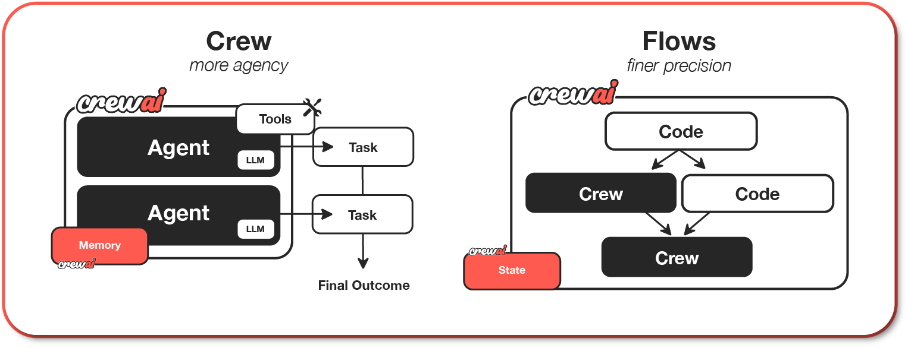

## What is CrewAI?
CrewAI is a lean, lightning-fast Python framework built entirely from scratch—completely independent of LangChain or other agent frameworks.


## ✅ Core Components of a Crew Flow
| Component     | Description                                                                                           |
| ------------- | ----------------------------------------------------------------------------------------------------- |
| **Agents**    | Individual LLM-powered workers with a role, goal, and behavior (e.g., Researcher, Analyst, Developer) |
| **Tasks**     | Discrete units of work assigned to agents (e.g., "Summarize a report", "Extract financial KPIs")      |
| **Crew**      | A team of agents orchestrated to execute a full task plan                                             |
| **Crew Flow** | The execution pipeline that controls how the agents collaborate to complete the full workflow         |

## Why CrewAI?



CrewAI unlocks the true potential of multi-agent automation, delivering the best-in-class combination of speed, flexibility, and control with either Crews of AI Agents or Flows of Events:

- **Standalone Framework:** Built from scratch, independent of LangChain or any other agent framework.
- **High Performance:** Optimized for speed and minimal resource usage, enabling faster execution.
- **Flexible Low Level Customization:** Complete freedom to customize at both high and low levels - from overall workflows and system architecture to granular agent behaviors, internal prompts, and execution logic.
- **Ideal for Every Use Case:** Proven effective for both simple tasks and highly complex, real-world, enterprise-grade scenarios.

## Understanding Flows and Crews
CrewAI offers two powerful, complementary approaches that work seamlessly together to build sophisticated AI applications:

1. **Crews:** Teams of AI agents with true autonomy and agency, working together to accomplish complex tasks through role-based collaboration. Crews enable:
    - Natural, autonomous decision-making between agents
    - Dynamic task delegation and collaboration
    - Specialized roles with defined goals and expertise
    - Flexible problem-solving approaches

2. **Flows:** Production-ready, event-driven workflows that deliver precise control over complex automations. Flows provide:
    - Fine-grained control over execution paths for real-world scenarios
    - Secure, consistent state management between tasks
    - Clean integration of AI agents with production Python code
    - Conditional branching for complex business logic

The true power of CrewAI emerges when combining Crews and Flows. This synergy allows you to:

    - Build complex, production-grade applications
    - Balance autonomy with precise control
    - Handle sophisticated real-world scenarios
    - Maintain clean, maintainable code structure

## Getting Started with Installation
To get started with CrewAI, follow these simple steps:

## 1. Installation

- Ensure you have Python >=3.10 <3.13 installed on your system.
- CrewAI uses **UV** for dependency management and package handling, offering a seamless setup and execution experience.

First, install CrewAI:

```
pip install crewai
```

If you want to install the 'crewai' package along with its optional features that include additional tools for agents, you can do so by using the following command:

```
pip install 'crewai[tools]'
```

## Common Issues
1. **ModuleNotFoundError: No module named** ```'tiktoken'```

    - Install tiktoken explicitly: pip install 'crewai[embeddings]'
    -If using embedchain or other tools: pip install 'crewai[tools]'

2. **Failed building wheel for tiktoken**

    - Ensure Rust compiler is installed (see installation steps above)
    - For Windows: Verify Visual C++ Build Tools are installed
    - Try upgrading pip: ```pip install --upgrade pip```
    - If issues persist, use a pre-built wheel: ```pip install tiktoken --prefer-binary```


## 2. Setting Up Your Crew with the YAML Configuration

To create a new CrewAI project, run the following CLI (Command Line Interface) command:

```
crewai create crew <project_name>
```

This command creates a new project folder with the following structure:

```
my_project/
├── .gitignore
├── pyproject.toml
├── README.md
├── .env
└── src/
    └── my_project/
        ├── __init__.py
        ├── main.py
        ├── crew.py
        ├── tools/
        │   ├── custom_tool.py
        │   └── __init__.py
        └── config/
            ├── agents.yaml
            └── tasks.yaml
```

- You can now start developing your crew by editing the files in the ```src/my_project``` folder.
- Entry point of the project, the ```crew.py``` file is where you define your crew.
- The ```agents.yaml``` file is where you define your agents
- The ```tasks.yaml``` file is where you define your tasks.

**To customize your project, you can:**
- Modify ```src/my_project/config/agents.yaml``` to define your agents.
- Modify ```src/my_project/config/tasks.yaml``` to define your tasks.
- Modify ```src/my_project/crew.py``` to add your own logic, tools, and specific arguments.
- Modify ```src/my_project/main.py``` to add custom inputs for your agents and tasks.
- Add your environment variables into the ```.env``` file.


## Example of a simple crew with a sequential process:

Instantiate your crew:

```
crewai create crew latest-ai-development
```

Modify the files as needed to fit your use case:

**agents.yaml**

```
# src/my_project/config/agents.yaml
researcher:
  role: >
    {topic} Senior Data Researcher
  goal: >
    Uncover cutting-edge developments in {topic}
  backstory: >
    You're a seasoned researcher with a knack for uncovering the latest
    developments in {topic}. Known for your ability to find the most relevant
    information and present it in a clear and concise manner.

reporting_analyst:
  role: >
    {topic} Reporting Analyst
  goal: >
    Create detailed reports based on {topic} data analysis and research findings
  backstory: >
    You're a meticulous analyst with a keen eye for detail. You're known for
    your ability to turn complex data into clear and concise reports, making
    it easy for others to understand and act on the information you provide.
```

**tasks.yaml**

```
# src/my_project/config/tasks.yaml
research_task:
  description: >
    Conduct a thorough research about {topic}
    Make sure you find any interesting and relevant information given
    the current year is 2025.
  expected_output: >
    A list with 10 bullet points of the most relevant information about {topic}
  agent: researcher

reporting_task:
  description: >
    Review the context you got and expand each topic into a full section for a report.
    Make sure the report is detailed and contains any and all relevant information.
  expected_output: >
    A fully fledge reports with the mains topics, each with a full section of information.
    Formatted as markdown without '```'
  agent: reporting_analyst
  output_file: report.md
```

**crew.py**

```
# src/my_project/crew.py
from crewai import Agent, Crew, Process, Task
from crewai.project import CrewBase, agent, crew, task
from crewai_tools import SerperDevTool
from crewai.agents.agent_builder.base_agent import BaseAgent
from typing import List

@CrewBase
class LatestAiDevelopmentCrew():
	"""LatestAiDevelopment crew"""
	agents: List[BaseAgent]
	tasks: List[Task]

	@agent
	def researcher(self) -> Agent:
		return Agent(
			config=self.agents_config['researcher'],
			verbose=True,
			tools=[SerperDevTool()]
		)

	@agent
	def reporting_analyst(self) -> Agent:
		return Agent(
			config=self.agents_config['reporting_analyst'],
			verbose=True
		)

	@task
	def research_task(self) -> Task:
		return Task(
			config=self.tasks_config['research_task'],
		)

	@task
	def reporting_task(self) -> Task:
		return Task(
			config=self.tasks_config['reporting_task'],
			output_file='report.md'
		)

	@crew
	def crew(self) -> Crew:
		"""Creates the LatestAiDevelopment crew"""
		return Crew(
			agents=self.agents, # Automatically created by the @agent decorator
			tasks=self.tasks, # Automatically created by the @task decorator
			process=Process.sequential,
			verbose=True,
		)
```

**main.py**

```
#!/usr/bin/env python
# src/my_project/main.py
import sys
from latest_ai_development.crew import LatestAiDevelopmentCrew

def run():
    """
    Run the crew.
    """
    inputs = {
        'topic': 'AI Agents'
    }
    LatestAiDevelopmentCrew().crew().kickoff(inputs=inputs)
```

## 3. Running Your Crew

Before running your crew, make sure you have the following keys set as environment variables in your .env file:

- An OpenAI API key (or other LLM API key): ```OPENAI_API_KEY=sk-...```
- A Serper.dev API key: ```SERPER_API_KEY=YOUR_KEY_HERE```

Lock the dependencies and install them by using the CLI command but first, navigate to your project directory:

```
cd my_project
crewai install (Optional)
```

To run your crew, execute the following command in the root of your project:

```
crewai run
```

or

```
python src/my_project/main.py
```

If an error happens due to the usage of poetry, please run the following command to update your crewai package:

```
crewai update
```

You should see the output in the console and the ```report.md``` file should be created in the root of your project with the full final report.

## In addition to the sequential process, you can use the hierarchical process, which automatically assigns a manager to the defined crew to properly coordinate the planning and execution of tasks through delegation and validation of results.


## Code Snippet Example

```
from crewai import Agent, Task, Crew

# Define agents
analyst = Agent(role="Risk Analyst", ...)
modeler = Agent(role="Credit Modeler", ...)
writer = Agent(role="Report Generator", ...)

# Assign tasks
tasks = [
    Task(agent=analyst, description="Collect applicant financial info"),
    Task(agent=modeler, description="Run risk model and produce score"),
    Task(agent=writer, description="Write risk report and recommendation")
]

# Define Crew (Flow)
credit_assessment_crew = Crew(
    agents=[analyst, modeler, writer],
    tasks=tasks,
    process="sequential"  # could also be "async" or "concurrent"
)

# Execute the flow
output = credit_assessment_crew.run()
print(output)
```

## How Crews Work
