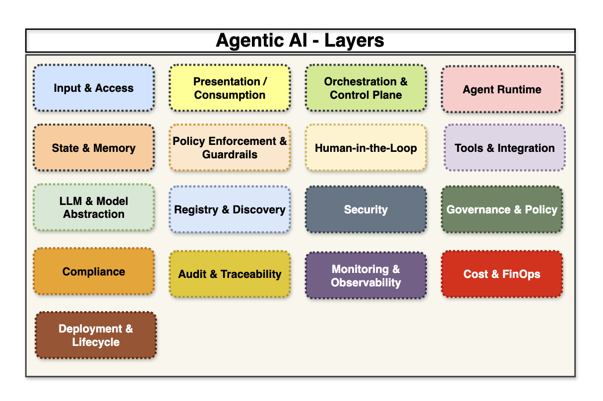
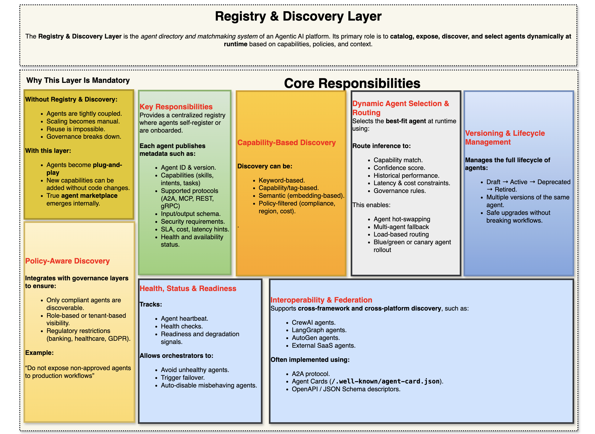

# Agentic AI - Enterprise & Production Grade Framework

## ```1. Agentic AI - 16 Layers```



## ```2. Input & Access Layer```


## ```3. Presentation / Consumption Layer```


## ```4. Orchestration & Control Plane Layer```


## ```5. Agent Runtime Layer```


## ```6. State & Memory Layer```


## ```7. Policy Enforcement & Guardrails Layer```


## ```8. Human in the Loop Layer```


## ```9. Tools & Integration Layer```


## ```10. LLM & Model Abstraction Layer```


## ```11. Registry & Discovery Layer```



## ```12. Security Layer```


## ```13. Governance & Policy Layer```


## ```14. Compliance Layer```


## ```15. Audit & Traceability Layer```


## ```16. Monitoring & Observability Layer```


## ```17. Cost & FinOps Layer```


## ```18. Deployment & Lifecycle Layer```


## Agentic AI - 16 Layers

| #  | Layer Name                       | Purpose                                       | Key Components                        | Patterns Used                     | CoT / ToT / Reflection use              |
| -- | -------------------------------- | --------------------------------------------- | ------------------------------------- | --------------------------------- | ---------------------- |
| 1  | Input & Access Layer             | Ingest alerts, telemetry, tickets, chatops    | APIs, OTel collectors, event bus      | Event-driven, normalization       | ❌ No                   |
| 2  | Presentation / Consumption Layer | UI, dashboards, ChatOps, reports              | Web UI, Slack/Teams bot, APIs         | Human-in-the-loop, outcome views  | ❌ No                   |
| 3  | Orchestration & Control Plane    | Workflow routing, state graph, task lifecycle | LangGraph, workflow engine, scheduler | Workflow graph, saga, routing     | ❌ No                   |
| 4  | Agent Runtime Layer              | Reasoning, planning, decision making          | LangChain/CrewAI agents               | CoT, ReAct, Plan-Act-Reflect, ToT | ✅ Primary              |
| 5  | State & Memory Layer             | Persist workflow state and context            | Redis, vector DB, graph DB            | Working memory, episodic memory   | ⚠️ Stores outputs only |
| 6  | Policy Enforcement & Guardrails  | Validate actions before execution             | Policy engine, safety checks          | Guardrails, risk-tier autonomy    | ❌ No                   |
| 7  | Human-in-the-Loop Layer          | Approval, override, feedback                  | Approval UI, escalation logic         | Approval gate, feedback loop      | ❌ No                   |
| 8  | Tools & Integration Layer        | Execute actions and fetch data                | Cloud APIs, K8s, ITSM, monitoring     | Tool chaining, parallel tools     | ❌ No                   |
| 9  | LLM & Model Abstraction Layer    | Model routing and prompt control              | GPT, Claude, Gemini, local LLM        | Model routing, token budgeting    | ⚠️ Hosts CoT execution |
| 10 | Registry & Discovery Layer       | Catalog agents, tools, capabilities           | Agent registry, tool metadata         | Capability discovery              | ❌ No                   |
| 11 | Security Layer                   | Identity, secrets, access control             | IAM, RBAC/ABAC, vault                 | Permission scoping                | ❌ No                   |
| 12 | Governance & Policy Layer        | Compliance rules and policies                 | Policy-as-code, risk matrix           | Policy routing                    | ❌ No                   |
| 13 | Audit & Traceability Layer       | Full decision and action logs                 | Audit DB, reasoning logs              | Traceable reasoning               | ⚠️ Stores CoT summary  |
| 14 | Monitoring & Observability Layer | Track agent performance and health            | Metrics, logs, traces                 | Agent telemetry, drift detection  | ❌ No                   |
| 15 | Cost & FinOps Layer              | Track and optimize LLM/tool cost              | Cost analyzer, budget policies        | Model routing, caching            | ❌ No                   |
| 16 | Deployment & Lifecycle Layer     | Versioning, rollout, testing                  | CI/CD, canary agents, feature flags   | Blue-green, versioned agents      | ❌ No                   |


## Pattern → Layer Matrix

| Pattern                   | L1 Input | L2 UI | L3 Orchestrator | L4 Agent Runtime | L5 Memory | L6 Guardrails | L7 HITL | L8 Tools | L9 LLM Abstraction | L10 Registry | L11 Security | L12 Governance | L13 Audit | L14 Observability | L15 FinOps | L16 Deploy |
| ------------------------- | -------- | ----- | --------------- | ---------------- | --------- | ------------- | ------- | -------- | ------------------ | ------------ | ------------ | -------------- | --------- | ----------------- | ---------- | ---------- |
| Chain-of-Thought (CoT)    | ❌        | ❌     | ❌               | ✔                | ⚠         | ❌             | ❌       | ❌        | ⚠                  | ❌            | ❌            | ❌              | ⚠         | ❌                 | ⚠          | ❌          |
| Tree-of-Thoughts (ToT)    | ❌        | ❌     | ❌               | ✔                | ⚠         | ❌             | ❌       | ❌        | ⚠                  | ❌            | ❌            | ❌              | ⚠         | ❌                 | ⚠          | ❌          |
| ReAct (Reason+Act)        | ❌        | ❌     | ❌               | ✔                | ⚠         | ❌             | ❌       | ❌        | ⚠                  | ❌            | ❌            | ❌              | ⚠         | ❌                 | ❌          | ❌          |
| Plan–Act–Reflect          | ❌        | ❌     | ❌               | ✔                | ⚠         | ❌             | ❌       | ❌        | ⚠                  | ❌            | ❌            | ❌              | ⚠         | ❌                 | ❌          | ❌          |
| Hypothesis Testing        | ❌        | ❌     | ❌               | ✔                | ⚠         | ❌             | ❌       | ❌        | ⚠                  | ❌            | ❌            | ❌              | ⚠         | ❌                 | ❌          | ❌          |
| Goal Decomposition        | ❌        | ❌     | ⚠               | ✔                | ❌         | ❌             | ❌       | ❌        | ❌                  | ❌            | ❌            | ❌              | ❌         | ❌                 | ❌          | ❌          |
| Orchestrator–Worker       | ❌        | ❌     | ✔               | ⚠                | ❌         | ❌             | ❌       | ❌        | ❌                  | ⚠            | ❌            | ❌              | ❌         | ❌                 | ❌          | ❌          |
| Planner–Executor          | ❌        | ❌     | ✔               | ✔                | ❌         | ❌             | ❌       | ❌        | ❌                  | ❌            | ❌            | ❌              | ❌         | ❌                 | ❌          | ❌          |
| Workflow Graph            | ❌        | ❌     | ✔               | ❌                | ✔         | ❌             | ❌       | ❌        | ❌                  | ❌            | ❌            | ❌              | ❌         | ✔                 | ❌          | ✔          |
| Saga / Rollback           | ❌        | ❌     | ✔               | ❌                | ✔         | ⚠             | ❌       | ✔        | ❌                  | ❌            | ❌            | ✔              | ✔         | ✔                 | ❌          | ✔          |
| Checkpoint / Resume       | ❌        | ❌     | ✔               | ❌                | ✔         | ❌             | ❌       | ❌        | ❌                  | ❌            | ❌            | ❌              | ✔         | ✔                 | ❌          | ✔          |
| Policy-Based Routing      | ❌        | ❌     | ✔               | ❌                | ❌         | ✔             | ❌       | ❌        | ❌                  | ❌            | ❌            | ✔              | ✔         | ❌                 | ✔          | ❌          |
| Circuit Breaker           | ❌        | ❌     | ✔               | ❌                | ❌         | ✔             | ❌       | ✔        | ❌                  | ❌            | ❌            | ✔              | ✔         | ✔                 | ❌          | ✔          |
| Guardrails                | ❌        | ❌     | ❌               | ❌                | ❌         | ✔             | ❌       | ❌        | ⚠                  | ❌            | ✔            | ✔              | ✔         | ✔                 | ❌          | ❌          |
| Risk-Tiered Autonomy      | ❌        | ❌     | ✔               | ❌                | ❌         | ✔             | ✔       | ❌        | ❌                  | ❌            | ✔            | ✔              | ✔         | ✔                 | ✔          | ❌          |
| Human Approval Gate       | ❌        | ✔     | ✔               | ❌                | ❌         | ❌             | ✔       | ❌        | ❌                  | ❌            | ❌            | ✔              | ✔         | ❌                 | ❌          | ❌          |
| Tool Chaining             | ❌        | ❌     | ❌               | ⚠                | ❌         | ❌             | ❌       | ✔        | ❌                  | ❌            | ❌            | ❌              | ✔         | ✔                 | ❌          | ❌          |
| Parallel Tool Execution   | ❌        | ❌     | ❌               | ⚠                | ❌         | ❌             | ❌       | ✔        | ❌                  | ❌            | ❌            | ❌              | ✔         | ✔                 | ❌          | ❌          |
| Fallback Tools            | ❌        | ❌     | ✔               | ❌                | ❌         | ✔             | ❌       | ✔        | ❌                  | ❌            | ❌            | ✔              | ✔         | ✔                 | ❌          | ✔          |
| Function Calling          | ❌        | ❌     | ❌               | ✔                | ❌         | ❌             | ❌       | ✔        | ✔                  | ❌            | ❌            | ❌              | ✔         | ✔                 | ❌          | ❌          |
| Model Routing             | ❌        | ❌     | ❌               | ❌                | ❌         | ❌             | ❌       | ❌        | ✔                  | ❌            | ❌            | ✔              | ✔         | ✔                 | ✔          | ❌          |
| Token Budgeting           | ❌        | ❌     | ❌               | ⚠                | ❌         | ❌             | ❌       | ❌        | ✔                  | ❌            | ❌            | ✔              | ✔         | ✔                 | ✔          | ❌          |
| Caching / Memoization     | ❌        | ❌     | ❌               | ⚠                | ✔         | ❌             | ❌       | ❌        | ✔                  | ❌            | ❌            | ❌              | ✔         | ✔                 | ✔          | ❌          |
| Selective Reasoning       | ❌        | ❌     | ✔               | ✔                | ❌         | ✔             | ❌       | ❌        | ✔                  | ❌            | ❌            | ✔              | ✔         | ✔                 | ✔          | ❌          |
| RAG                       | ❌        | ❌     | ❌               | ✔                | ✔         | ❌             | ❌       | ❌        | ⚠                  | ❌            | ❌            | ❌              | ✔         | ✔                 | ❌          | ❌          |
| Knowledge Graph Reasoning | ❌        | ❌     | ❌               | ✔                | ✔         | ❌             | ❌       | ❌        | ⚠                  | ❌            | ❌            | ❌              | ✔         | ✔                 | ❌          | ❌          |
| Semantic Memory           | ❌        | ❌     | ❌               | ⚠                | ✔         | ❌             | ❌       | ❌        | ❌                  | ❌            | ❌            | ❌              | ✔         | ❌                 | ❌          | ❌          |
| Episodic Memory           | ❌        | ❌     | ❌               | ⚠                | ✔         | ❌             | ❌       | ❌        | ❌                  | ❌            | ❌            | ❌              | ✔         | ✔                 | ❌          | ❌          |
| Traceable Reasoning Logs  | ❌        | ❌     | ❌               | ⚠                | ❌         | ❌             | ❌       | ❌        | ❌                  | ❌            | ❌            | ✔              | ✔         | ✔                 | ❌          | ❌          |
| Agent Telemetry           | ❌        | ❌     | ✔               | ❌                | ❌         | ❌             | ❌       | ❌        | ❌                  | ❌            | ❌            | ❌              | ✔         | ✔                 | ✔          | ❌          |
| Drift Detection           | ❌        | ❌     | ❌               | ❌                | ❌         | ❌             | ❌       | ❌        | ❌                  | ❌            | ❌            | ❌              | ❌         | ✔                 | ✔          | ✔          |
| FinOps Cost Tracking      | ❌        | ❌     | ❌               | ❌                | ❌         | ❌             | ❌       | ❌        | ✔                  | ❌            | ❌            | ✔              | ✔         | ✔                 | ✔          | ❌          |
| Registry & Discovery      | ❌        | ❌     | ✔               | ❌                | ❌         | ❌             | ❌       | ❌        | ❌                  | ✔            | ❌            | ❌              | ✔         | ❌                 | ❌          | ✔          |
| RBAC / ABAC               | ❌        | ❌     | ❌               | ❌                | ❌         | ✔             | ❌       | ✔        | ❌                  | ❌            | ✔            | ✔              | ✔         | ✔                 | ❌          | ❌          |
| Policy-as-Code            | ❌        | ❌     | ✔               | ❌                | ❌         | ✔             | ❌       | ❌        | ❌                  | ❌            | ❌            | ✔              | ✔         | ✔                 | ✔          | ✔          |
| Versioned Agents          | ❌        | ❌     | ❌               | ✔                | ❌         | ❌             | ❌       | ❌        | ❌                  | ✔            | ❌            | ✔              | ✔         | ✔                 | ✔          | ✔          |
| Canary Agents             | ❌        | ❌     | ❌               | ✔                | ❌         | ❌             | ❌       | ❌        | ❌                  | ❌            | ❌            | ✔              | ✔         | ✔                 | ✔          | ✔          |
| Blue/Green Rollout        | ❌        | ❌     | ❌               | ❌                | ❌         | ❌             | ❌       | ❌        | ❌                  | ❌            | ❌            | ✔              | ✔         | ✔                 | ✔          | ✔          |
