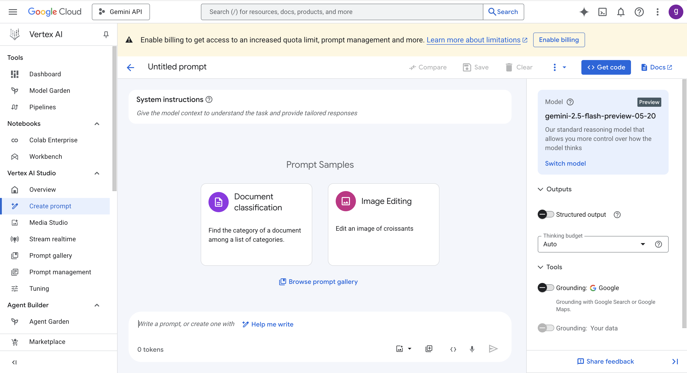

## Google Cloud AI services

| **Service**                          | **Description**                                                   | **Service Type** | **SaaS / Shelf-Managed** | **Use Case Example**                                            |
| ------------------------------------ | ----------------------------------------------------------------- | ---------------- | ------------------------ | --------------------------------------------------------------- |
| Vertex AI Studio                     | Rapid prototyping and testing of generative AI models             | Platform         | SaaS                     | Quickly experiment with LLMs for text generation                |
| Vertex AI Agent Builder              | No-code generative AI agents grounded in organizational data      | Platform         | SaaS                     | Build chatbots for internal IT helpdesk without coding          |
| Generative AI Document Summarization | Summarizes documents using Vertex AI and stores in BigQuery       | SaaS             | SaaS                     | Automatically summarize lengthy legal or medical documents      |
| Gemini for Google Cloud              | AI-powered assistance for writing, coding, and data analysis      | SaaS             | SaaS                     | Use AI to assist developers with code generation and debugging  |
| Veo 2                                | AI video model for generation and editing with cinematic features | SaaS             | SaaS                     | Create promotional videos with AI-based editing                 |
| Imagen 3                             | Text-to-image model with advanced editing                         | SaaS             | SaaS                     | Generate marketing images from text descriptions                |
| Chirp 3                              | Synthetic speech model for realistic voice and transcription      | SaaS             | SaaS                     | Develop realistic voice assistants and transcription services   |
| Lyria                                | Text-to-music generation model                                    | SaaS             | SaaS                     | Generate background music tracks for apps or games              |
| Vertex AI Platform                   | Unified platform for building, deploying ML models                | Platform         | SaaS                     | Deploy production-grade ML models for customer churn prediction |
| Vertex AI Notebooks                  | Environments for model development (e.g., Colab, Workbench)       | Platform         | SaaS                     | Collaborative data science and model development                |
| AutoML                               | Train custom ML models with minimal effort                        | Platform         | SaaS                     | Build custom image classifiers without deep ML expertise        |
| Natural Language API                 | Sentiment analysis and entity recognition from text               | API              | SaaS                     | Analyze customer reviews for sentiment trends                   |
| Speech-to-Text API                   | Converts speech into text                                         | API              | SaaS                     | Transcribe customer service calls in real-time                  |
| Text-to-Speech API                   | Generates natural-sounding speech                                 | API              | SaaS                     | Create audio narration for e-learning courses                   |
| Translation API                      | Translates text into multiple languages                           | API              | SaaS                     | Provide multilingual support on websites and apps               |
| Dialogflow API                       | Conversational interface for chatbots and voice apps              | API              | SaaS                     | Build customer support chatbots for websites                    |
| Vision API                           | Image labeling, face detection, OCR                               | API              | SaaS                     | Automate product tagging in e-commerce                          |
| Video Intelligence API               | Video content analysis and object tracking                        | API              | SaaS                     | Detect and index objects and actions in surveillance videos     |
| Vertex AI Vision                     | Build and deploy computer vision applications                     | Platform         | SaaS                     | Develop quality control systems for manufacturing               |
| Document AI API                      | Extracts data from structured/unstructured documents              | API              | SaaS                     | Extract invoice details automatically for accounts payable      |
| Document Warehouse API               | Stores and retrieves processed documents                          | API              | SaaS                     | Centralize storage of processed contract documents              |
| Dialogflow CX/ES                     | Build advanced conversational agents                              | Platform         | SaaS                     | Create sophisticated virtual assistants with complex workflows  |
| Agent Assist                         | Real-time agent support with AI suggestions                       | SaaS             | SaaS                     | Provide call center agents with live help and suggestions       |
| Contact Center AI                    | AI-powered virtual agents for customer service                    | SaaS             | SaaS                     | Automate customer inquiries with virtual agents                 |
| Vertex AI Search                     | Semantic search and Q\&A experiences                              | Platform         | SaaS                     | Implement intelligent document search within enterprise systems |
| Recommendations AI                   | Product recommendations using ML                                  | SaaS             | SaaS                     | Personalized product suggestions for e-commerce                 |
| Retail Search                        | AI-driven retail site search with personalization                 | SaaS             | SaaS                     | Enhance online retail search with personalized results          |
| Translation Hub                      | Manage and translate large content volumes                        | SaaS             | SaaS                     | Localize marketing content for global audiences                 |
| Agentspace                           | Automation using agents and Gemini models                         | Platform         | SaaS                     | Automate workflows with AI agents interacting on your behalf    |

[Agentspace](https://youtu.be/OSB8QijrEIA)