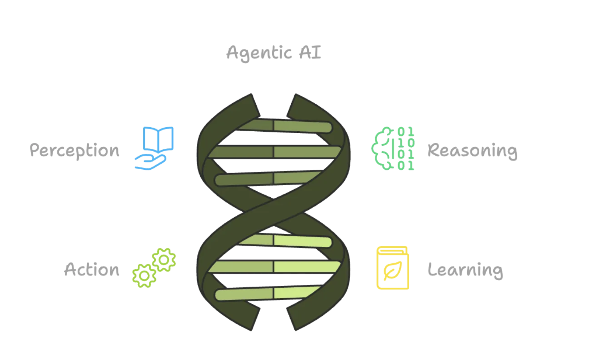
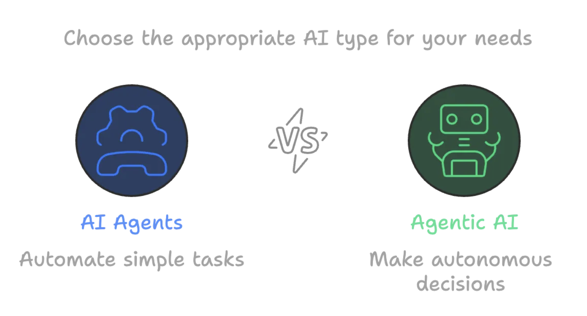

## what is agentic ai and how will it change work?

Agentic AI refers to AI systems capable of autonomous action and decision-making to achieve specific goals, often with minimal human supervision. It's a step beyond traditional AI and generative AI, enabling AI agents to go beyond content creation and perform complex tasks by integrating with various systems and tools.

## What is Agentic AI?
At its core, Agentic AI is a type of AI that’s all about autonomy. This means that it can make decisions, take actions, and even learn on its own to achieve specific goals. It’s kind of like having a virtual assistant that can think, reason, and adapt to changing circumstances without needing constant direction.

**Agentic AI operates in four key stages:**

1. **Perception:** It gathers data from the world around it.
2. **Reasoning:** It processes this data to understand what’s going on.
3. **Action:** It decides what to do based on its understanding.
4. **Learning:** It improves and adapts over time, learning from feedback and experience.

1. **Autonomous Agents:**Agentic AI systems utilize AI agents – individual software entities that perform specific tasks with a degree of autonomy. 

2. **Goal-Oriented:**These agents are designed to understand user goals and autonomously take actions to achieve them, rather than just responding to specific instructions. 

3. **Adaptive and Learning:**Agentic AI systems are adaptive and can learn from interactions, refining their strategies and improving performance over time. 

4. **Beyond Generative AI:**While generative AI focuses on creating content, agentic AI extends this capability by using generated content to complete tasks, integrate with other systems, and achieve broader goals. 

## How Agentic AI Will Change Work: 

1. **Increased Automation:**Agentic AI can automate complex, multi-step workflows and business processes that were previously difficult or impossible to automate with traditional systems. 

2. **Improved Productivity:**By taking over routine and repetitive tasks, agentic AI can free up human workers to focus on more strategic, creative, and high-value work.

3. **Enhanced Collaboration:**Agentic AI can facilitate seamless collaboration between humans and AI, with AI acting as a partner, assistant, or even a coach. 

4. **Data-Driven Decisions:**Agentic AI can analyze large amounts of data and provide insights that can help organizations make more informed decisions. 

## What is an AI Agent?
On the other hand, AI Agents are typically built to do specific tasks. They’re designed to help you with something — like answering questions, organizing your calendar, or even managing your email inbox. AI Agents are great at automating simple, repetitive tasks but don’t have the autonomy or decision-making abilities that Agentic AI does. Think of them as virtual helpers that do exactly what you tell them to do, without thinking for themselves.

## What’s the Difference?
| **Aspect**                    | **Agentic AI**                                        | **AI Agent**                                       |
|------------------------------|--------------------------------------------------------|----------------------------------------------------|
| **Autonomy Level**           | Highly autonomous, can act independently              | Limited autonomy, needs human input                |
| **Goal-Orientation**         | Goal-driven, solves problems on its own               | Task-specific, follows set instructions            |
| **Learning Capabilities**    | Continuously learns and improves                      | May not learn or only learns within set rules      |
| **Complexity**               | Handles complex, dynamic environments                 | Handles simpler, more structured tasks             |
| **Decision-Making Process**  | Makes decisions based on reasoning and analysis       | Pre-programmed responses to inputs                 |
| **Interaction with Environment** | Actively adapts to surroundings and changes     | Reacts to set inputs but doesn’t adapt             |
| **Responsiveness to Change** | Changes its goals and methods autonomously            | Limited ability to adapt to new situations         |

## Where Do We See These in the Real World?
Both Agentic AI and AI Agents have started popping up in various industries, and their applications are growing fast.

## Agentic AI in Action

1. **Self-Driving Cars:** One of the most exciting uses of Agentic AI is in autonomous vehicles. These AI systems perceive their surroundings, make driving decisions, and learn from every trip. Over time, they get better at navigating and handling new challenges on the road. For example, Tesla’s Full Self-Driving system is an example of Agentic AI that continuously learns from the driving environment and adjusts its behavior to improve safety and efficiency.

2. **Supply Chain Management:** Agentic AI is also helping companies optimize their supply chains. By autonomously managing inventory, predicting demand, and adjusting delivery routes in real-time, AI can ensure smoother, more efficient operations. Amazon’s Warehouse Robots, powered by AI, are an example — these robots navigate complex environments, adapt to different conditions, and autonomously move goods around warehouses.

3. **Cybersecurity:** In the world of cybersecurity, Agentic AI can detect threats and vulnerabilities by analyzing network activity and automatically responding to potential breaches. Darktrace, an AI cybersecurity company, uses Agentic AI to autonomously detect, respond to, and learn from potential cyber threats in real-time.

4. **Healthcare:** AI is playing a big role in healthcare, too. Agentic AI can assist with diagnostics, treatment recommendations, and patient care management. It analyzes medical data, identifies patterns, and helps doctors make more informed decisions. For instance, IBM’s Watson Health uses AI to analyze massive amounts of healthcare data, learning from new information to offer insights that help doctors and healthcare professionals.

## AI Agents in Action

1. **Customer Support:** One of the most common uses of AI Agents is in customer service. Chatbots can answer questions, resolve issues, and guide customers through processes — all without needing human intervention. Zendesk’s AI-powered chatbot helps businesses respond to customer queries quickly and efficiently, acting as an AI Agent that handles common issues and frees up human agents for more complex tasks.

2. **Personal Assistants:** You probably already interact with an AI Agent every day if you use voice assistants like Siri or Google Assistant. They can help you set reminders, check the weather, or play your favorite music — tasks that are useful but don’t require much decision-making. These AI Agents rely on predefined commands and are great at handling simple, repetitive tasks.

3. **Email Management:** AI Agents are also great for managing your inbox. They can sort emails, flag important ones, and even provide smart replies to save you time.**Google’s Gmail Smart Compose** feature is an excellent example of an AI Agent at work, helping users respond to emails faster by suggesting phrases based on context.

4. **Productivity Tools:** Tools like GitHub Copilot are AI Agents that help software developers by suggesting code and helping with debugging. They’re like having a second set of eyes that’s always there to help. By offering code suggestions in real-time, this AI Agent enhances developer productivity, allowing them to focus on more creative aspects of their work.

