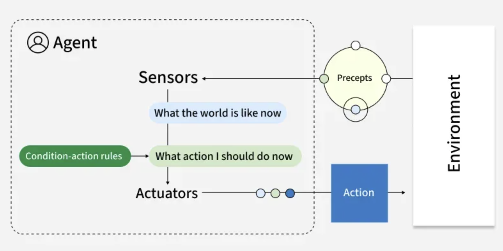
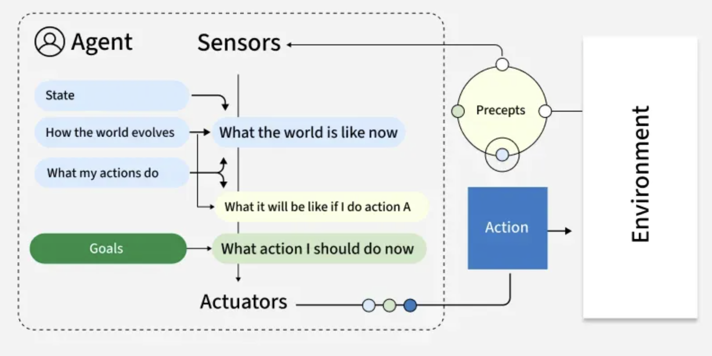
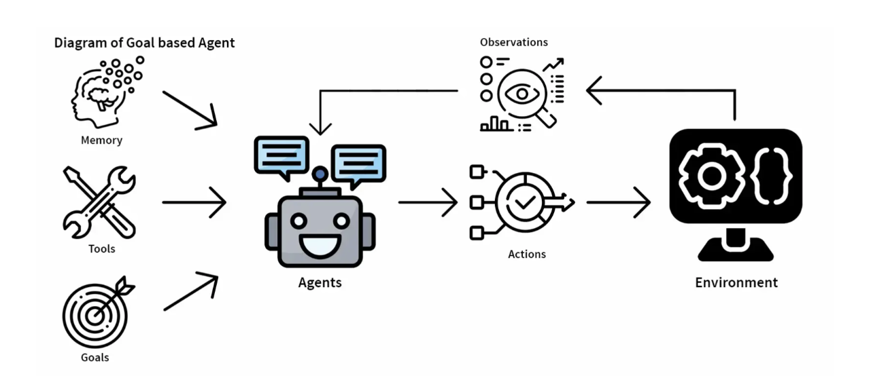
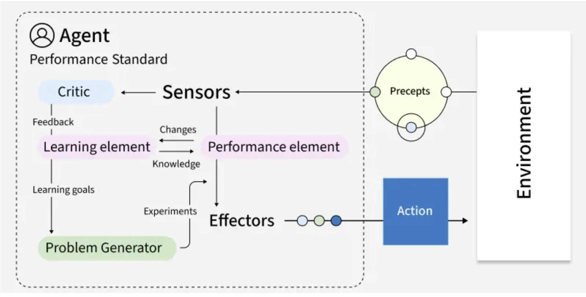
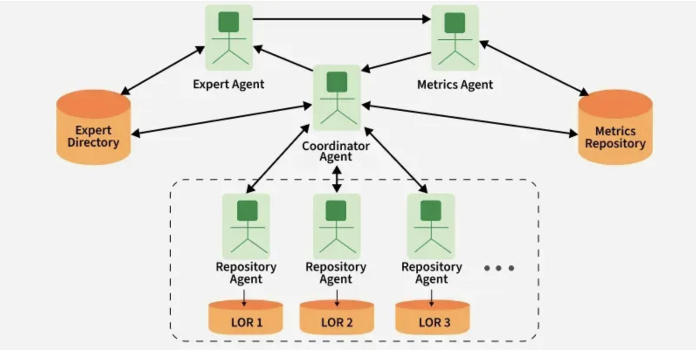
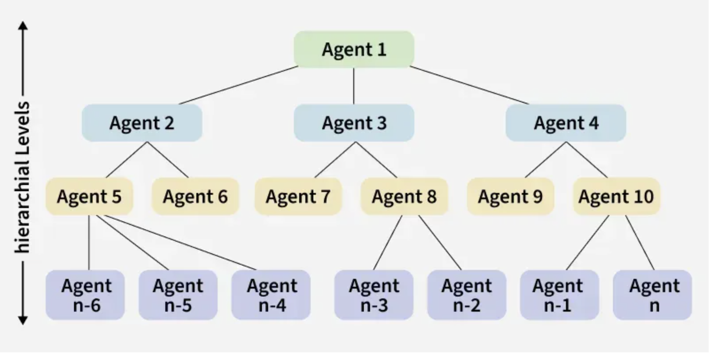

<h2 style="color:red;">✅ What is Agentic AI?</h2>

The field of artificial intelligence is rapidly evolving beyond reactive models to embrace a new paradigm:
**Agentic AI.**This transformative approach empowers AI systems to act autonomously, make decisions, and proactively work towards goals with minimal human intervention. Unlike traditional AI that responds to specific commands, agentic AI systems are dynamic problem-solvers, capable of planning, executing multi-step tasks, and adapting to changing environments.

At its core, an agentic AI system, or an "AI agent," is a software entity that perceives its environment, reasons about its observations, and takes actions to achieve a specific objective. This process involves a sophisticated interplay of several key components:

- **Perception:** The agent gathers information from its digital or physical environment through various inputs like data feeds, APIs, or sensor readings.

- **Reasoning and Planning:** Leveraging large language models (LLMs) and other advanced algorithms, the agent analyzes the perceived information, breaks down complex goals into smaller, manageable steps, and formulates a plan of action.

- **Action:** The agent executes its plan by interacting with its environment. This could involve anything from sending an email and updating a database to controlling a robotic arm.

- **Learning and Adaptation:** Through feedback loops and experience, the agent continuously learns and refines its strategies to improve its performance over time. This adaptability is a hallmark of agentic AI.

- **Orchestration:** In more complex scenarios, multiple AI agents can be orchestrated to work together, each with specialized skills, to tackle multifaceted problems.

<h3 style="color:blue;">📌 Types of Agents in AI:</h3>

There are several **types of agents in AI**, each differing in how they perceive the environment, process information, and take actions.

Artificial Intelligence (AI) agents are the foundation of many intelligent systems which helps them to understand their environment, make decisions and take actions to achieve specific goals. These agents vary in complexity from simple reflex-based systems to advanced models that learn and adapt over time.


<h3 style="color:blue;">1. Simple Reflex Agents:</h3>

A **Simple Reflex Agent** is the most basic type of intelligent agent in Artificial Intelligence (AI).
It works on the principle of **condition–action rules** (also called **if–then rules**).
That means it looks at the current **percept** (the environment input it senses) and chooses an action **without considering history or future consequences**.

**Note:** ```Simple Reflex Agents (SRA)``` are not typically implemented with frameworks like **CrewAI, LangChain, LangGraph, or AutoGen**.

- **Simple Reflex Agent** = Based only on **if–then rules** (condition → action).

- It **does not** require memory, reasoning, planning, or multi-agent collaboration.

- Frameworks like **CrewAI, LangChain, AutoGen** are designed for **complex, reasoning-based, multi-agent workflows with LLMs** — which is **much more than a reflex agent needs**.

**✅ Suitable Frameworks for Simple Reflex Agent**

If you want to implement a **Simple Reflex Agent**, you’d use:

- **Finite State Machines (FSMs)**

- **Rule-based systems** (Drools, CLIPS, PyKnow in Python)

- **Custom Python code with condition–action rules**

**Note:** This is a true Simple Reflex Agent — ```no LLM, no memory, no reasoning```.

**❌ Not Ideal (But Possible)**

- **CrewAI, LangChain/LangGraph, AutoGen** → These are **too heavy** for simple reflex use cases. They’re for reasoning, planning, tool use, and autonomous workflows.

- You can technically implement reflex behavior in them, but it would just be LLM-wrapped if-else rules, which is inefficient.

<h3 style="color:blue;">✅ Key Characteristics of a Simple Reflex Agent:</h3>

1. **Action is based only on the current percept.**

It ignores past percepts (no memory) and does not plan for the future.

2. **Uses condition–action rules.**

  - **Example:**
     
     - ```If traffic light is red → stop```

     - ```If traffic light is green → go```

3. **No internal state.**

It doesn’t keep track of what happened before.

4. **Efficient but limited.**

Works only in fully observable environments where the current percept gives enough information to make the right decision.

**⚖️ Advantages**

- Very fast and simple to design.

- Works well in simple, predictable environments.

**❌ Limitations**

- Fails in **partially observable** or **complex** environments.

- Cannot learn or adapt to changes.

- No memory or long-term strategy.

**🌍 Domain-Specific Real-Time Examples of Simple Reflex Agents**

| **Domain**       | **Example**                 | **Sensors (Percepts)**        | **Rules (Condition → Action)**                                          | **Actuators**         |
| ---------------- | --------------------------- | ----------------------------- | ----------------------------------------------------------------------- | --------------------- |
| 🏥 Healthcare    | Automatic Insulin Pump      | Glucose sensor                | If *Glucose > threshold → Inject insulin*; Else → Do nothing            | Insulin injector      |
| 🚗 Automotive    | Automatic Wipers            | Rain sensor                   | If *Rain detected → Turn wipers ON*; Else → OFF                         | Wiper motor           |
| 🚗 Automotive    | Automatic Headlights        | Light sensor                  | If *Brightness < threshold → Lights ON*; Else → Lights OFF              | Headlight switch      |
| 🏭 Manufacturing | Furnace Temperature Control | Thermocouple                  | If *Temp < 1200°C → Increase gas*; If *Temp ≥ 1200°C → Cut gas*         | Gas valve             |
| 🏭 Manufacturing | Conveyor Belt QC            | Size/weight sensor            | If *Item defective → Push off belt*; Else → Let pass                    | Robotic arm / ejector |
| 🏦 Banking       | ATM Security (PIN check)    | Card reader & PIN input       | If *3 wrong PINs → Block card*; Else → Continue                         | ATM system controller |
| 🏠 Smart Home    | Smart Lights                | Motion sensor                 | If *Motion detected → Light ON*; If *No motion 5 min → Light OFF*       | Smart light switch    |
| 🏠 Smart Home    | Smart Sprinkler             | Soil moisture sensor          | If *Moisture < 30% → Turn sprinkler ON*; Else OFF                       | Water pump            |
| ✈️ Aviation      | Landing Gear Warning System | Altitude sensor + Gear status | If *Altitude < 1000 ft AND Gear not down → Alarm ON*; Else → Do nothing | Alarm system          |


<h3 style="color:blue;">🧠 Agentic AI Frameworks – Comparison for Simple Reflex Agent:</h3>

| Framework                         | Agent Architecture                                       | Agent Types Supported                                                         | Orchestration / Flow                                                    | Tooling / Integrations                                              | Best Use Cases                                                                                                   |
| --------------------------------- | -------------------------------------------------------- | ----------------------------------------------------------------------------- | ----------------------------------------------------------------------- | ------------------------------------------------------------------- | ---------------------------------------------------------------------------------------------------------------- |
| **CrewAI**                        | Multi-agent orchestration with **Crew (team of agents)** | Research Agent, Code Agent, Reviewer Agent, QA Agent, Custom agents           | **Task + Role-based orchestration** (assign roles, tasks, dependencies) | Python functions, APIs, DB connectors, GitHub, Slack, Jira, etc.    | Collaborative multi-agent workflows (code review, GitHub automation, research & summarization, DevOps pipelines) |
| **LangChain / LangGraph**         | Modular chain + graph-based orchestration                | Conversational agent, Retrieval agent, Tool-using agent, Memory-enabled agent | **Sequential Chains** & **Graph DAG execution (LangGraph)**             | 100+ integrations (LLMs, vector DBs, APIs, RAG pipelines, memory)   | RAG, chatbots, document Q\&A, knowledge workers, enterprise apps                                                 |
| **AutoGen** (Microsoft)           | **Agent ↔ Agent conversation paradigm**                  | Assistant Agent, User Proxy Agent, Custom Multi-agent teams                   | **Conversation-based orchestration** (agents talk to each other)        | Python code execution, Web search, APIs, Data pipelines             | AI coding assistants, self-correcting agents, reasoning loops                                                    |
| **Google AI Agent Builder (ADK)** | Pre-built + customizable agents                          | Chatbots, RAG Agents, Workflow agents                                         | Declarative agent builder, UI + API                                     | GCP services (Vertex AI, BigQuery, Cloud Functions, Pub/Sub, Drive) | Customer support, search, enterprise knowledge assistants                                                        |
| **AWS Bedrock**                   | Serverless orchestration for LLM apps                    | Reasoning agent, Knowledge agent, Orchestration agent                         | **Managed orchestration (Amazon Agents for Bedrock)**                   | AWS ecosystem (S3, DynamoDB, SageMaker, API Gateway, Lambda)        | Enterprise AI apps, RAG, financial & retail AI copilots, compliance-heavy use cases                              |


**🏗️ Simple Reflex Agent – Architecture**



```
+-----------------+
|   Environment   |
+-----------------+
        ^
        |   (Changes Environment)
        |
+-----------------+      +--------------------------------+
|    Actuators    | <--- |Condition-Action Rules (if-then)|
+-----------------+      |                                |
        ^                |  "What action should I take?"  |
        |                +--------------------------------+
        |   (Action)             ^
        |                        |
        |                        |
+-----------------+      +--------------------------------+
|     Sensors     | ---> |    "What is the world like?"   |
+-----------------+      +--------------------------------+
        ^
        |   (Percepts)
        |
+-----------------+
|   Environment   |
+-----------------+
```


<h3 style="color:blue;">2. Model-Based Reflex Agents:</h3>

These agents improve over simple reflex agents by maintaining an **internal state (model of the world)** that helps them handle **partially observable environments**.


<h3 style="color:blue;">Comparison Model-Based Reflex Agent vs Simple Reflex Agent:</h3>

| Feature                 | Simple Reflex Agent                 | Model-Based Reflex Agent                            |
| ----------------------- | ----------------------------------- | --------------------------------------------------- |
| **Memory**              | No memory                           | Maintains internal state                            |
| **World Understanding** | Current percept only                | Current percept + history                           |
| **Action**              | Immediate reaction                  | Informed decision                                   |
| **Example**             | Car reacts only to “lane empty now” | Car predicts “lane empty now **and** in next 3 sec” |


<h3 style="color:blue;">🧠 Agentic AI Frameworks – Comparison:</h3>

| Framework                                 | Simple Reflex Agent                                                       | Example Use Case (Simple Reflex)                               | Model-Based Reflex Agent                                     | Example Use Case (Model-Based Reflex)                                        |
| ----------------------------------------- | ------------------------------------------------------------------------- | -------------------------------------------------------------- | ------------------------------------------------------------ | ---------------------------------------------------------------------------- |
| **CrewAI**                                | ❌ Not ideal (CrewAI is task/role-driven, not simple rules)                | –                                                              | ✅ Can maintain memory/state across tasks                     | Customer support agent that remembers last user complaint while solving next |
| **LangChain / LangGraph**                 | ⚠️ Possible with `Rule-based chains` but overkill                         | Rule-based chatbot that always responds “Yes” if keyword found | ✅ Strong fit – uses memory + state graphs                    | Conversational bot that uses memory to track user preferences                |
| **AutoGen**                               | ❌ Not suitable (designed for multi-agent conversations, not reflex rules) | –                                                              | ⚠️ Possible with stateful multi-agent design                 | Two agents coordinate: one tracks state (model) while other acts             |
| **Google AI Agent Development Kit (ADK)** | ✅ Can build simple reflex with event triggers                             | IoT agent that turns off light if sensor > threshold           | ✅ Natively supports state via environment modeling           | Smart thermostat that remembers past temperatures to adjust next             |
| **AWS Bedrock**                           | ❌ Not for reflex (LLM-focused, no direct reflex handling)                 | –                                                              | ⚠️ Limited, can add external memory layer (DynamoDB, Lambda) | Chatbot that remembers last query using external DB                          |


<h3 style="color:blue;">🌐 Model-Based Reflex Agents – Domain Examples:</h3>


| **Domain**                     | **Example Use Case**            | **Percepts (Inputs)**                      | **Internal Model (State Tracking)**            | **Actions (Outputs)**                                         |
| ------------------------------ | ------------------------------- | ------------------------------------------ | ---------------------------------------------- | ------------------------------------------------------------- |
| **Smart Home (IoT)**           | Energy-efficient lighting       | Motion sensor data, time of day            | Tracks last detected motion + daylight state   | Turn lights on/off intelligently                              |
| **Healthcare**                 | Remote patient monitoring       | Vitals (HR, BP, glucose), patient activity | Maintains patient’s baseline health model      | Alert doctor if abnormal pattern persists                     |
| **Retail**                     | Smart shelf inventory           | Camera feed, weight sensors                | Tracks stock changes + delivery schedule       | Trigger restock request to supplier                           |
| **Finance**                    | Fraud detection in transactions | Transaction amount, location, device       | Maintains customer’s transaction history model | Flag suspicious activity, request OTP                         |
| **Cybersecurity**              | Intrusion detection             | Network traffic logs, system events        | Tracks baseline network behavior               | Block IP, trigger alert if anomaly persists                   |
| **Autonomous Vehicles**        | Lane keeping                    | Camera, lidar, GPS signals                 | Tracks vehicle’s position + road map           | Adjust steering to remain in lane                             |
| **Manufacturing**              | Predictive maintenance          | Sensor readings from machines              | Tracks wear-and-tear progression               | Schedule maintenance before failure                           |
| **Customer Service (Chatbot)** | Context-aware support           | User query, past chat history              | Maintains conversation context state           | Respond with relevant solution instead of repeating questions |

**Key Characteristics:**

- **Internal State:** By maintaining an internal model of the environment, these agents can handle scenarios where some aspects are not directly observable thus it provides more flexible decision-making.

- **Adaptive:** They update their internal model based on new information which allows them to adapt to changes in the environment.

- **Better Decision-Making:** The ability to refer to the internal model helps agents make more informed decisions which reduces the risk of making impulsive or suboptimal choices.

- **Increased Complexity:** Maintaining an internal model increases computational demands which requires more memory and processing power to track changes in the environment.

**🔑 Key Takeaways:**

- **Simple Reflex Agents** → Best suited for rule-based systems (Google ADK fits well, LangChain can do it but heavy).

- **Model-Based Reflex Agents** → Need **state/memory** → CrewAI, LangChain/LangGraph, and Google ADK are strongest.

- **AutoGen & Bedrock** → More aligned with conversational or LLM-driven agents, not pure reflex.


<h3 style="color:blue;">Model-Based Reflex Agents – Architecture:</h3>




```
+----------------------+      +---------------------------+
| How the world evolves| ---> |                           |
+----------------------+      |      Internal State       |      +---------------------+
                            |         (Model)           | --->   | Condition-Action    |
+----------------------+      |                           |      |   Rules (if-then)   |
| How my actions affect| ---> | "How the world is now"    |      |                     |
| the world            |      +---------------------------+      | "What action should |
+----------------------+               ^                         |  I take now?"       |
                                       |                         +---------------------+
                                       |                                    | (Action)
                                       |                                    V
+-----------------+      +---------------------------+             +-----------------+
|   Environment   | ---> |          Sensors          | ----------> |    Actuators    |
|                 |      |                           |             |                 |
| (Percepts)      |      | "What is the world like?" |             +-----------------+
+-----------------+      +---------------------------+                      |
        ^                                                                   | (Changes 
        |                                                                   | Environment)
        +-------------------------------------------------------------------+
```


<h3 style="color:blue;">3. Goal-based AI Agents:</h3>

Goal-based AI agents represent a sophisticated approach in artificial intelligence (AI), where agents are programmed to achieve specific objectives. These agents are designed to plan, execute, and adjust their actions dynamically to meet predefined goals. This approach is particularly useful in complex environments where flexibility and adaptability are crucial.


## Key Concepts of Goal-Based AI Agents

## 1. Goals
- **Planning**  
- **Execution**  
- **Adaptation**  

## 2. Components of Goal-Based AI Agents
- **Perception Module**  
- **Knowledge Base**  
- **Decision-Making Module**  
- **Planning Module**  
- **Execution Module**  

## 3. Types of Goal-Based Agents
- **Reactive Agents**  
- **Deliberative Agents**  
- **Hybrid Agents**  
- **Learning Agents**  

## 4. Applications of Goal-Based Agents
- **Robotics**  
- **Game AI**  
- **Autonomous Vehicles**  
- **Resource Management**  
- **Healthcare**  

## 5. Challenges and Future Directions
- **Complexity and Computation**  
- **Uncertainty and Adaptation**  
- **Ethical and Safety Concerns**  
- **Future Directions**  


## Key Concepts of Goal-Based AI Agents

**Goals**

Goals are the specific objectives that the agent aims to achieve. These can range from simple tasks, such as sorting objects, to complex missions, such as navigating a robot through a maze, solving a puzzle, or managing resources in a simulated environment. Goals provide a clear direction for the agent's actions and decisions.

**Planning**

Planning involves determining the sequence of actions required to achieve the goal. This process can be complex, involving predictive models, heuristics, and algorithms to evaluate possible future states and actions. Effective planning allows agents to anticipate potential obstacles and devise strategies to overcome them.

**Execution**

Execution is the phase where the agent carries out the planned actions. This involves interacting with the environment and performing tasks that bring the agent closer to its goal. Successful execution requires precise coordination of actions and real-time responsiveness to changes in the environment.

**Adaptation**

Adaptation is essential as the agent interacts with its environment. It may encounter unexpected obstacles or changes, and adaptation involves modifying plans and actions in response to new information, ensuring the agent remains on track to achieve its goal. This ability to adapt makes goal-based agents robust and flexible.


**Components of Goal-Based AI Agents**

**Perception Module**

The perception module is responsible for collecting data from the environment using sensors or input mechanisms and processing this data to form a coherent understanding of the current state. This information is crucial for informed decision-making and planning.

**Knowledge Base**

The knowledge base includes the world model, which is a representation of the environment and the agent’s understanding of it, as well as the rules and facts about how the world operates and the rules governing the agent’s actions. This structured knowledge helps the agent to interpret sensory data and make logical decisions.

**Decision-Making Module**

The decision-making module involves goal formulation, where the goals are defined and updated based on the current state and objectives, and action selection, where actions are chosen based on the current state, goals, and predicted outcomes. This module ensures that the agent's actions are aligned with its objectives.

**Planning Module**

The planning module handles path planning, determining the optimal sequence of actions to achieve the goal, and contingency planning, developing alternative plans in case of unexpected changes or failures. Effective planning minimizes the risk of failure and enhances the agent's efficiency.

**Execution Module**

The execution module is responsible for carrying out the planned actions in the environment, and for monitoring and feedback, continuously monitoring the results of actions and adjusting plans as needed. This module ensures that the agent remains responsive to real-time changes and maintains progress towards its goal.


**Types of Goal-Based Agents**

**Reactive Agents**

Reactive agents operate based on immediate perceptions and pre-defined rules. They quickly respond to changes in the environment without long-term planning. These agents are suitable for simple tasks where rapid response is more important than complex decision-making.

**Deliberative Agents**

Deliberative agents involve a higher level of planning and reasoning. They create detailed plans and execute them, adjusting their actions based on feedback and changes in the environment. These agents are suitable for complex tasks that require strategic thinking and adaptability.

**Hybrid Agents**

Hybrid agents combine reactive and deliberative approaches. They can respond quickly to changes while also engaging in higher-level planning when necessary. This combination allows them to handle a wide range of tasks with varying complexity and urgency.

**Learning Agents**

Learning agents can adapt their strategies and improve performance over time by learning from their interactions with the environment. They use techniques like reinforcement learning to enhance their ability to achieve goals. Learning agents are particularly useful in dynamic environments where conditions and requirements change frequently.


<h3 style="color:blue;">🧠 Goal-Based Agents – Structured View</h3>

| **Aspect**                             | **Details**                                                                                                                                                                                                                                                                                                                                                                                                                                                                                                                        |
| -------------------------------------- | ---------------------------------------------------------------------------------------------------------------------------------------------------------------------------------------------------------------------------------------------------------------------------------------------------------------------------------------------------------------------------------------------------------------------------------------------------------------------------------------------------------------------------------- |
| **Suitable Frameworks**                | - **LangChain / LangGraph** (goal-directed planning with chains & memory)<br> - **AutoGen** (multi-agent collaboration to achieve goals)<br> - **CrewAI** (team of agents aligned to a goal, role-based execution)<br> - **Haystack** (goal-based retrieval-augmented generation)<br> - **BabyAGI / Task-driven frameworks** (goal-driven task decomposition & execution)                                                                                                                                                          |
| **Key Characteristics**                | - Decisions depend on **goals, not just current state**<br> - Requires **planning & search** to achieve goals<br> - Can evaluate **multiple actions** and select the one aligned with the final objective<br> - Uses **reasoning, knowledge base, and inference**<br> - More flexible and adaptive than reflex agents                                                                                                                                                                                                              |
| **Domain-Specific Real-Time Examples** | - **Healthcare**: AI treatment planner deciding best therapy for a patient (goal = patient recovery)<br> - **Finance**: Robo-advisor optimizing portfolio allocation for target ROI<br> - **Autonomous Driving**: Car plans optimal route considering traffic & safety (goal = reach destination safely)<br> - **Customer Service**: AI assistant aiming to resolve customer queries with minimal interactions<br> - **DevOps**: Automated incident resolution agent targeting service uptime & SLA compliance                     |
| **Agentic AI Frameworks – Comparison** | **LangChain / LangGraph** → Best for building structured, goal-oriented workflows with memory & reasoning<br> **AutoGen** → Useful for **multi-agent collaboration** toward a shared goal (e.g., one agent plans, another executes)<br> **CrewAI** → Best when a team of agents with **specialized roles** must collectively achieve a business goal<br> **BabyAGI** → Great for iterative **task decomposition** to achieve open-ended goals<br> **Haystack** → Best when goals rely on **retrieval & knowledge-based reasoning** |
| **Architecture**                       | - **Goal Module** → Defines target state<br> - **Knowledge Base** → Stores domain/world model<br> - **Inference Engine** → Plans sequence of actions<br> - **Decision-Making Unit** → Chooses action based on goal satisfaction<br> - **Execution Module** → Acts in environment<br> - **Feedback Loop** → Evaluates progress toward goal                                                                                                                                                                                          |
| **Key Takeaways**                      | ✅ Goal-based agents provide **flexibility & reasoning** beyond reflex agents.<br> ✅ They require **planning, memory, and decision evaluation**.<br> ✅ Agentic AI frameworks like **LangChain, AutoGen, CrewAI** are well-suited.<br> ✅ Real-world use cases include **healthcare, finance, autonomous driving, DevOps, and customer service**.<br> ✅ Architecture emphasizes **goal setting, planning, execution, and feedback**.                                                                                                  |


<h3 style="color:blue;">Model-Based Reflex Agents – Architecture:</h3>





```
+----------------------+      +---------------------------+
| How the world evolves| ---> |                           |
+----------------------+      |      Internal State       |
                              |         (Model)           |
+----------------------+      |                           |      +---------------------+
| How my actions affect| ---> | "How the world is now"    | ---> |                     |
| the world            |      +---------------------------+      |   Planning/Search   |
+----------------------+               ^                         |                     |
                                       |                         | "What if I do A?"   |
                                       |                         | "How do I reach my  |      +----------+
+-----------------+      +---------------------------+      |  goal?"             | <--- |   Goal   |
|   Environment   | ---> |          Sensors          | ----> +---------------------+      +----------+
|                 |      |                           |                  | (Chosen Action)
| (Perceiving)    |      | "What is the world like?" |                  V
+-----------------+      +---------------------------+      +-----------------+
        ^                                                   |    Actuators    |
        | (Acting on Environment)                           +-----------------+
        +-----------------------------------------------------------+
```


<h3 style="color:blue;">4. Utility-Based Agents:</h3>

Artificial Intelligence has boomed in growth in recent years. Various types of intelligent agents are being developed to solve complex problems. Utility-based agents hold a strong position due to their ability to make rational decisions based on a utility function. These agents are designed to optimize their performance by maximizing utility measures.

Utility-based agents extend goal-based reasoning by considering not only whether a goal is met but also how valuable or desirable a particular outcome is. They use a utility function to quantify preferences and make trade-offs between competing objectives, enabling nuanced decision-making in uncertain or resource-limited situations. Designing an appropriate utility function is crucial for their effectiveness.


**What is Utility Theory?**

Utility theory is a fundamental concept in economics and decision theory. This theory provides a framework for understanding how individuals make choices under uncertainty. The aim of this agent is not only to achieve the goal but the best possible way to reach the goal. This idea suggests that people give a value to each possible result of a choice showing how much they like or are happy with that result. The aim is to get the highest expected value, which is the average of the values of all possible results taking into account how likely each one is to happen.


**Rational decision making**

Rational Decision making means picking the option that maximizes an agent's expected utility. i.e. give the best outcome. When it comes to AI, a rational agent always goes for the action that leads to the best results, given its current knowledge and the possible future states of the environment. To do this, the agent needs a utility function, which is a way to measure how good each option is. This helps the agent figure out which action will likely give the best results.


h3 style="color:blue;">🧠 Utility-Based Agents</h3>


| **Aspect**                              | **Details**                                                                                                                                                                                                                                                                                                                                                                                            |
| --------------------------------------- | ------------------------------------------------------------------------------------------------------------------------------------------------------------------------------------------------------------------------------------------------------------------------------------------------------------------------------------------------------------------------------------------------------ |
| **Suitable Frameworks**                 | - **LangChain / LangGraph** → define utility functions for selecting best plan <br> - **CrewAI** → multi-agent setup where agents vote on best option <br> - **AutoGen** → negotiation-based decision-making <br> - **Ray RLlib** / **Stable Baselines** → when reinforcement learning utility optimization is needed                                                                                  |
| **Key Characteristics**                 | - Choose actions **not only to achieve goals** but also to **maximize performance/utility** <br> - Introduces **preference ranking** among states (e.g., “better” vs. “worse” outcomes) <br> - Balances **trade-offs** (speed vs. cost, accuracy vs. computation) <br> - Often leverages **reinforcement learning** or **optimization models**                                                         |
| **Domain-Specific Real-Time Examples**  | - **Autonomous Vehicles** → deciding safest + fastest route balancing time, fuel, and risk <br> - **Healthcare AI** → recommending treatment with best success probability & least side effects <br> - **Retail Dynamic Pricing** → adjusting prices based on demand elasticity to maximize revenue <br> - **Cloud Resource Allocation** → balancing cost vs. performance in real time                 |
| **Agentic AI Frameworks – Comparison**  | - **LangChain / LangGraph** → utility functions as evaluators for agent outputs <br> - **CrewAI** → multiple agents propose, then utility scoring selects optimal <br> - **AutoGen** → conversational negotiation, pick action with highest expected utility <br> - **RL frameworks (Ray RLlib, SB3)** → explicitly optimize reward signals for utility                                                |
| **Utility-Based Agents – Architecture** | 1. **Perception Module** → observes environment (inputs) <br> 2. **Knowledge Base / Model** → state representations <br> 3. **Utility Function** → assigns score (preference measure) to outcomes <br> 4. **Decision Module** → selects action maximizing expected utility <br> 5. **Action Execution** → performs chosen action <br> 6. **Feedback Loop** → updates utility preferences from outcomes |
| **Key Takeaways**                       | - Utility-based agents **go beyond goals** → they optimize preferences <br> - Essential when **multiple conflicting goals** exist (e.g., speed vs. safety) <br> - Best for **complex, uncertain, real-world environments** <br> - Require well-defined **utility/reward functions** to work effectively                                                                                                |


<h3 style="color:blue;">Utility-Based Agents – Architecture:</h3>

[alt text](./image/agenticai5.png)

```
+----------------------+      +---------------------------+
| How the world evolves| ---> |                           |
+----------------------+      |      Internal State       |
                              |         (Model)           |
+----------------------+      |                           |      +---------------------+
| How my actions affect| ---> | "What will my state be    | ---> |                     |
| the world            |      |  if I do action A?"       |      |   Utility Function  |
+----------------------+      +---------------------------+      |                     |
        ^                              |                         |  "How happy will I  |
        |                              | (Possible Outcomes)     |   be in this state?"|
        |                              V                         +---------------------+
+-----------------+      +---------------------------+                      | (Utility Score)
|   Environment   | ---> |          Sensors          |                      V
|                 |      |                           |      +------------------------------+
| (Perceiving)    |      | "What is the world like?" | ---> |Choose Action with Max Utility|
+-----------------+      +---------------------------+      +------------------------------+
        ^                                                               | (Optimal Action)
        | (Acting on Environment)                                       V
        |                                                     +-----------------+
        +---------------------------------------------------> |    Actuators    |
                                                              +-----------------+

```

<h3 style="color:blue;">🧠 Utility-Based Agents – Structured View:</h3>

| **Aspect**                              | **Details**                                                                                                                                                                                                                                                                                                                                                                                            |
| --------------------------------------- | ------------------------------------------------------------------------------------------------------------------------------------------------------------------------------------------------------------------------------------------------------------------------------------------------------------------------------------------------------------------------------------------------------ |
| **Suitable Frameworks**                 | - **LangChain / LangGraph** → define utility functions for selecting best plan <br> - **CrewAI** → multi-agent setup where agents vote on best option <br> - **AutoGen** → negotiation-based decision-making <br> - **Ray RLlib** / **Stable Baselines** → when reinforcement learning utility optimization is needed                                                                                  |
| **Key Characteristics**                 | - Choose actions **not only to achieve goals** but also to **maximize performance/utility** <br> - Introduces **preference ranking** among states (e.g., “better” vs. “worse” outcomes) <br> - Balances **trade-offs** (speed vs. cost, accuracy vs. computation) <br> - Often leverages **reinforcement learning** or **optimization models**                                                         |
| **Domain-Specific Real-Time Examples**  | - **Autonomous Vehicles** → deciding safest + fastest route balancing time, fuel, and risk <br> - **Healthcare AI** → recommending treatment with best success probability & least side effects <br> - **Retail Dynamic Pricing** → adjusting prices based on demand elasticity to maximize revenue <br> - **Cloud Resource Allocation** → balancing cost vs. performance in real time                 |
| **Agentic AI Frameworks – Comparison**  | - **LangChain / LangGraph** → utility functions as evaluators for agent outputs <br> - **CrewAI** → multiple agents propose, then utility scoring selects optimal <br> - **AutoGen** → conversational negotiation, pick action with highest expected utility <br> - **RL frameworks (Ray RLlib, SB3)** → explicitly optimize reward signals for utility                                                |
| **Utility-Based Agents – Architecture** | 1. **Perception Module** → observes environment (inputs) <br> 2. **Knowledge Base / Model** → state representations <br> 3. **Utility Function** → assigns score (preference measure) to outcomes <br> 4. **Decision Module** → selects action maximizing expected utility <br> 5. **Action Execution** → performs chosen action <br> 6. **Feedback Loop** → updates utility preferences from outcomes |
| **Key Takeaways**                       | - Utility-based agents **go beyond goals** → they optimize preferences <br> - Essential when **multiple conflicting goals** exist (e.g., speed vs. safety) <br> - Best for **complex, uncertain, real-world environments** <br> - Require well-defined **utility/reward functions** to work effectively                                                                                                |


<h3 style="color:blue;">5. Learning Agents:</h3>

Learning agents improve their performance over time by learning from experience and updating their internal models, strategies or policies. They can adapt to changes in the environment and often outperform static agents in dynamic contexts. Learning may involve supervised, unsupervised or reinforcement learning techniques and these agents typically contain both a performance element (for acting) and a learning element (for improving future actions).

**Key Characteristics:**

- **Adaptive Learning:** It improve their decision-making through continuous feedback from their actions.

- **Exploration vs. Exploitation:** These agents balance exploring new actions that may lead to better outcomes with exploiting known successful strategies.

- **Flexibility:** They can adapt to a wide variety of tasks or environments by modifying their behavior based on new data.

- **Generalization:** It can apply lessons learned in one context to new, similar situations enhancing their versatility.


**When to Use:** They are well-suited for dynamic environments that change over time such as recommendation systems, fraud detection and personalized healthcare management.

**Example:** Customer service chatbots can improve response accuracy over time by learning from previous interactions and adapting to user needs.


<h3 style="color:blue;">Learning Agents – Architecture:</h3>

```
+---------------------------------------------------------------------------------+
|                                  Environment                                    |
+---------------------------------------------------------------------------------+
        ^                                      |
        | (Actions)                            | (Percepts)
        |                                      V
+-----------------+                      +-----------------+
|    Actuators    |                      |     Sensors     |
+-----------------+                      +-----------------+
        ^                                      |
        |                                      |
+---------------------------------------------------------------------------------+
|                                     AGENT                                       |
|                                                                                 |
|       +---------------------+        (Changes)       +----------------------+   |
|       | Performance Element | <---------------------- |   Learning Element   |  |
|       |                     |                         |                      |  |
|       | (Agent's "Brain")   |         (Feedback)      +----------------------+  |
|       +---------------------+ ----------------------> |        Critic        |  |
|         ^         |                                   |                      |  |
|         |         | (Action)                          +----------------------+  |
|         |         +-------------------------------------------^                 |
|         |                                                     |(How am I doing?)|
|         | (New Problems)                                      |                 |
|       +----------------------+                                |                 |
|       |  Problem Generator   | -------------------------------+                 |
|       +----------------------+                                                  |
|                                                                                 |
+---------------------------------------------------------------------------------+
```




<h3 style="color:blue;">🧠 Learning Agents – Structured View:</h3>

| **Aspect**                             | **Details**                                                                                                                                                                                                                                                                                                                                                                                                                                             |
| -------------------------------------- | ------------------------------------------------------------------------------------------------------------------------------------------------------------------------------------------------------------------------------------------------------------------------------------------------------------------------------------------------------------------------------------------------------------------------------------------------------- |
| **Suitable Frameworks**                | - **LangChain / LangGraph** → memory, feedback loops, continuous improvement<br>- **CrewAI** → autonomous teams with adaptive behavior<br>- **AutoGen** → agents that learn from multi-agent conversations and feedback<br>- **Ray RLlib / TensorFlow / PyTorch** → reinforcement learning & deep learning for adaptive agents                                                                                                                          |
| **Key Characteristics**                | - Improves performance over time via **feedback**<br>- Has a **learning element** (e.g., ML model) to adapt<br>- Has a **performance element** (executes tasks)<br>- Has a **critic** (evaluates performance)<br>- Has a **problem generator** (explores new strategies)<br>- Capable of **self-correction** and **knowledge accumulation**                                                                                                             |
| **Domain-Specific Real-Time Examples** | **Healthcare** → AI agent learns from past patient interactions to improve diagnosis accuracy<br>**Finance** → Fraud detection agents adapt to new fraud patterns over time<br>**Retail** → Personalized recommendation engine that learns user preferences<br>**DevOps** → CI/CD optimization agent that learns which pipeline configurations minimize failures<br>**Autonomous Vehicles** → Self-driving cars learn from real-world driving scenarios |
| **Agentic AI Frameworks – Comparison** | **LangChain / LangGraph** → LLM + Memory + Feedback (reinforcement loops)<br>**CrewAI** → Role-based adaptive agents that collaborate and improve with iteration<br>**AutoGen** → Agents improve by analyzing conversation history and refining reasoning<br>**Ray RLlib** → Reinforcement learning backbone for agents that require simulation and policy optimization                                                                                 |
| **Architecture**                       | 1. **Learning Element** → Improves agent’s knowledge/strategy (ML/RL models)<br>2. **Performance Element** → Executes based on learned policy<br>3. **Critic** → Provides feedback on actions<br>4. **Problem Generator** → Suggests exploratory actions for learning<br>5. **Environment** → Provides input data and feedback signals                                                                                                                  |
| **Key Takeaways**                      | - Learning Agents **continuously evolve** unlike reflex or goal-based agents<br>- Suitable for **dynamic, uncertain, and data-rich environments**<br>- Combine **reasoning (LLM frameworks)** + **adaptation (ML/RL frameworks)**<br>- Examples: **Autonomous trading systems, adaptive chatbots, self-driving cars, personalized assistants**                                                                                                          |


<h3 style="color:blue;">📌 Fraud Detection in Finance – Framework Mapping:</h3>

| **Framework**                      | **How it Fits Fraud Detection**                                                                                                                                                                                                           | **Agentic AI Role**                                                                                        | **Strengths**                                                                                                       | **Limitations**                                                                                                    |
| ---------------------------------- | ----------------------------------------------------------------------------------------------------------------------------------------------------------------------------------------------------------------------------------------- | ---------------------------------------------------------------------------------------------------------- | ------------------------------------------------------------------------------------------------------------------- | ------------------------------------------------------------------------------------------------------------------ |
| **LangChain**                      | Build a pipeline where incoming financial transactions are passed through an LLM with access to a **vector DB** (historical fraud patterns) and **external APIs** (AML, KYC). The LLM queries knowledge, classifies, and flags anomalies. | Acts as an **Orchestrator**: routes queries → retrieves patterns → calls APIs → flags suspicious activity. | Strong at **retrieval-augmented generation (RAG)**, integrating structured + unstructured data, and explainability. | Needs custom logic for **decision-making & multi-agent coordination**.                                             |
| **CrewAI**                         | Define multiple agents: e.g., **Transaction Analyzer Agent** (checks real-time payments), **Pattern Detection Agent** (compares with fraud signatures), **Escalation Agent** (notifies compliance team). CrewAI coordinates them.         | **Multi-Agent Collaboration**: Specialized agents working together for detection, decision, escalation.    | Clear separation of responsibilities, human-in-the-loop, transparency.                                              | Can be complex to design & optimize for **real-time latency-sensitive use cases**.                                 |
| **AutoGen**                        | Create **conversational agents** where one agent monitors transactions, another challenges suspicious cases (“Explain why this looks fraudulent”), and a supervisor agent decides the final action. Agents communicate iteratively.       | **Dialogue-driven multi-agent workflow** for fraud classification, justification, and escalation.          | Strong at **LLM-to-LLM communication**, scenario simulation, and **iterative reasoning**.                           | Might add overhead if immediate, low-latency decisions are needed (e.g., payments approval).                       |
| **RLlib (Reinforcement Learning)** | Train an RL agent that learns fraud detection policies over time by **maximizing reward** (catching fraud, minimizing false positives). It continuously improves from transaction feedback.                                               | **Learning Agent**: adapts fraud detection policies dynamically.                                           | Handles **real-time decision-making** under uncertainty, improves over time.                                        | Needs **large-scale data** & training; interpretability can be challenging compared to symbolic/logical reasoning. |


<h3 style="color:blue;">6. Multi-Agent Systems (MAS):</h3>

Multi-agent systems operate in environments shared with other agents, either cooperating or competing to achieve individual or group goals. These systems are decentralized, often requiring communication, negotiation or coordination protocols. They are well-suited to distributed problem solving but can be complex to design due to emergent and unpredictable behaviors. Types of multi-agent systems:

- **Cooperative MAS:** Agents work together toward shared objectives.

- **Competitive MAS:** Agents pursue individual goals that may conflict.

- **Mixed MAS:** Agents cooperate in some scenarios and compete in others.


**Key Characteristics:**

- **Autonomous Agents:** Each agent acts on its own based on its goals and knowledge.

- **Interactions:** Agents communicate, cooperate or compete to achieve individual or shared objectives.

- **Distributed Problem Solving:** Agents work together to solve complex problems more efficiently than they could alone.

- **Decentralization:** No central control, agents make decisions independently.


<h3 style="color:blue;">🧩 Multi-Agent Systems (MAS) – Structured View:</h3>

| **Dimension**               | **Description**                                                                                                                                                                                                                                                 | **Examples**                                                                                            |
| --------------------------- | --------------------------------------------------------------------------------------------------------------------------------------------------------------------------------------------------------------------------------------------------------------- | ------------------------------------------------------------------------------------------------------- |
| **Definition**              | A system composed of multiple interacting agents, each with autonomy, situatedness, and ability to collaborate/compete.                                                                                                                                         | AI trading bots, swarm robotics, distributed simulations.                                               |
| **Types of Agents**         | - **Reactive Agents** (reflexive, no memory)<br> - **Deliberative Agents** (reasoning, planning)<br> - **Hybrid Agents** (mix of reactive + deliberative)<br> - **Learning Agents** (improve over time)                                                         | Chatbots, warehouse robots, autonomous vehicles, fraud detection bots.                                  |
| **Interaction Types**       | - **Cooperative** (work toward shared goals)<br> - **Competitive** (adversarial, game-theoretic)<br> - **Mixed-Motive** (partial cooperation + competition)                                                                                                     | Cooperative: swarm drones; Competitive: auction bidding bots; Mixed: supply chain negotiations.         |
| **Coordination Mechanisms** | - Communication protocols (messages, APIs)<br> - Contract net protocol (task allocation)<br> - Consensus algorithms (agreement)<br> - Market-based approaches                                                                                                   | Blockchain consensus, auction-based resource allocation, task delegation in teams.                      |
| **Architectures**           | - **Centralized MAS** (coordinator agent)<br> - **Decentralized MAS** (peer-to-peer)<br> - **Hierarchical MAS** (leader-follower)                                                                                                                               | Centralized: traffic control system; Decentralized: swarm robotics; Hierarchical: military drones.      |
| **Key Capabilities**        | - Autonomy<br> - Social ability (communication)<br> - Reactivity (respond to environment)<br> - Proactiveness (goal-driven)<br> - Adaptability (learn from experience)                                                                                          | Self-driving fleets, financial trading systems, cyber defense MAS.                                      |
| **Applications**            | - Finance (fraud detection, algorithmic trading)<br> - Robotics (multi-robot coordination)<br> - Smart Grids (energy distribution)<br> - Healthcare (distributed diagnostics)<br> - Logistics (supply chain, fleet management)                                  | Amazon delivery drones, stock trading agents, patient monitoring systems.                               |
| **Challenges**              | - Scalability<br> - Inter-agent trust & coordination<br> - Conflict resolution<br> - Robustness in dynamic environments<br> - Ethical considerations                                                                                                            | Multi-agent negotiations, cybersecurity MAS resilience.                                                 |
| **Key Frameworks**          | - **LangChain** (Agent orchestration, memory, tools)<br> - **CrewAI** (Multi-agent collaboration with roles)<br> - **AutoGen** (Conversational & task-based multi-agent LLM systems)<br> - **RLlib** (Reinforcement learning for MAS simulation & optimization) | LangChain agents + tools, CrewAI role-based teamwork, AutoGen negotiation agents, RLlib multi-agent RL. |


<h3 style="color:blue;">Multi-Agent Systems (MAS) – Architecture:</h3>



```
+-----------------------------------------------------------------------------+
|                                                                             |
|                           SHARED ENVIRONMENT                                |
|                                                                             |
|    +----------+         (Perception/Action)          +----------+           |
|    | Agent 1  | <----------------------------------> | Agent 2  |           |
|    | (e.g.,   |                                      | (e.g.,   |           |
|    | Goal-    | <----------------------------------> | Utility- |           |
|    | Based)   |       (Communication/Interaction)    | Based)   |           |
|    +----------+ <----------------------------------> +----------+           |
|         ^                        |                      ^                   |
|         |                        |                      |                   |
|         | (Perception/Action)    | (Communication)      |(Perception/Action)|
|         |                        |                      |                   |
|         |                        V                      |                   |
|    +----------+         (Perception/Action)          +----------+           |
|    | Agent 3  | <----------------------------------> | Agent 4  |           |
|    | (e.g.,   |                                      | (e.g.,   |           |
|    | Model-   | -------------------------------------> | Simple |           |
|    | Based)   |                                      | Reflex)  |           |
|    +----------+                                      +----------+           |
|                                                                             |
+-----------------------------------------------------------------------------+
```


<h3 style="color:blue;">🧩 Multi-Agent Systems (MAS) – Real-Time Use Case Mapping:</h3>

| Aspect               | LangChain                                                                                                            | CrewAI                                                                                                                             | AutoGen                                                                                                | RLlib                                                                                      |
| -------------------- | -------------------------------------------------------------------------------------------------------------------- | ---------------------------------------------------------------------------------------------------------------------------------- | ------------------------------------------------------------------------------------------------------ | ------------------------------------------------------------------------------------------ |
| **Use Case**         | Supply Chain Optimization – AI agents coordinating inventory, demand forecasting, logistics, and supplier management |                                                                                                                                    |                                                                                                        |                                                                                            |
| **Role of Agents**   | Agents handle reasoning chains (e.g., forecast demand → plan procurement → adjust logistics)                         | Specialized agents (Procurement Agent, Logistics Agent, Demand Forecasting Agent) collaborating                                    | Conversation-driven task decomposition between agents (Planner Agent ↔ Solver Agent ↔ Validator Agent) | RL agents optimize policies for inventory, pricing, logistics, minimizing costs and delays |
| **Architecture Fit** | Modular **chains + tools** for data access, reasoning, and workflow orchestration                                    | Multi-agent orchestration with **clear role assignment** and crew collaboration                                                    | Multi-agent **dialogue framework** for negotiation and plan execution                                  | **Multi-agent reinforcement learning (MARL)** for dynamic decision-making                  |
| **Strengths**        | Easy to integrate with APIs (ERP, Supplier APIs), reasoning workflows                                                | Best for **team-based coordination** and structured agent roles                                                                    | Great for **agent-to-agent dialogue** and automated collaboration                                      | Handles **complex adaptive optimization** under uncertainty (e.g., demand fluctuations)    |
| **Weaknesses**       | Limited to reasoning workflows, not designed for autonomous decision optimization                                    | Overhead in defining roles & communication protocols                                                                               | Dialogue-heavy approach may be verbose for real-time systems                                           | Requires high compute & careful reward design                                              |
| **Domain Example**   | Chain for **demand forecasting** using historical data, ERP integration, and pricing APIs                            | Crew with **Procurement Agent** (supplier negotiation), **Logistics Agent** (route planning), **Inventory Agent** (stock tracking) | Agents simulate **negotiation between suppliers and logistics** for cost/delivery optimization         | RL agents learn **optimal reorder policies**, logistics routing under dynamic constraints  |
| **Best Fit**         | Decision support & ERP/CRM integration                                                                               | Cross-team multi-agent workflows in enterprise                                                                                     | AI negotiation & planning bots                                                                         | Autonomous optimization & control under uncertainty                                        |


<h3 style="color:blue;">7. Hierarchical agents</h3>

Hierarchical agents organize behavior into multiple layers such as strategic, tactical and operational. Higher levels make abstract decisions that break down into more specific subgoals for lower levels to execute. This structure improves scalability, reusability of skills and management of complex tasks, but requires designing effective interfaces between layers.

**Key Characteristics:**

- **Structured Decision-Making:** Decision-making is divided into different levels for more efficient task handling.

- **Task Division:** Complex tasks are broken down into simpler subtasks.

- **Control and Guidance:** Higher levels direct lower levels for coordinated action.


<h3 style="color:blue;">🧩 Hierarchical Agents – Structured View:</h3>

| **Aspect**                       | **Details**                                                                                                                                                                                                                                                                                                                               |
| -------------------------------- | ----------------------------------------------------------------------------------------------------------------------------------------------------------------------------------------------------------------------------------------------------------------------------------------------------------------------------------------- |
| **Definition**                   | Hierarchical Agents are agents that decompose complex problems into multiple layers (high-level → mid-level → low-level tasks). Each level manages sub-tasks and coordinates with others to achieve the overall objective.                                                                                                                |
| **Key Characteristics**          | - Task decomposition into levels <br> - Abstraction between layers <br> - Coordination & communication across layers <br> - Top-down control (high-level sets goals, low-level executes) <br> - Reusability of sub-modules                                                                                                                |
| **Architecture**                 | - **High-Level Layer**: Defines goals, strategies, and overall planning <br> - **Mid-Level Layer**: Translates goals into sub-goals & manages workflows <br> - **Low-Level Layer**: Executes primitive actions and handles environment interaction                                                                                        |
| **Advantages**                   | - Simplifies complex decision-making <br> - Improves scalability and modularity <br> - Allows specialization at different layers <br> - Easier debugging & monitoring                                                                                                                                                                     |
| **Challenges**                   | - Coordination overhead <br> - Failure in lower layer impacts higher-level goals <br> - Requires robust communication mechanisms <br> - Complexity in dynamic/adaptive environments                                                                                                                                                       |
| **Domain-Specific Example**      | **Autonomous Vehicles** <br> - **High-Level**: Plan route from City A → City B <br> - **Mid-Level**: Break route into road segments, traffic lights, lane selection <br> - **Low-Level**: Execute steering, braking, acceleration in real-time                                                                                            |
| **Agentic AI Framework Mapping** | - **LangChain**: High-level reasoning & task orchestration using chains/agents <br> - **CrewAI**: Multi-agent collaboration with clear role-based hierarchy <br> - **AutoGen**: Conversation-driven sub-agent management for sub-tasks <br> - **RLlib (Hierarchical RL)**: Multi-level reinforcement learning with policies at each level |
| **Key Takeaways**                | - Hierarchical Agents = structured problem-solving <br> - Useful in domains with layered decision-making (e.g., robotics, supply chain, healthcare, finance) <br> - MAS + Hierarchical design improves coordination and modularity                                                                                                        |


<h3 style="color:blue;">🧩 Real-Time Use Case Mapping – Hierarchical Agents</h3>


| Aspect                     | LangChain                                                                                                                | CrewAI                                                                                                          | AutoGen                                                                                                                        | RLlib                                                                                                                  |
| -------------------------- | ------------------------------------------------------------------------------------------------------------------------ | --------------------------------------------------------------------------------------------------------------- | ------------------------------------------------------------------------------------------------------------------------------ | ---------------------------------------------------------------------------------------------------------------------- |
| **Agent Role**             | High-level **Planner Agent** breaks query → Low-level **Executor Agents** (retrieval, summarization, sentiment analysis) | **Manager Agent** delegates tasks to **Specialist Agents** (FAQ resolver, escalation handler, ticket generator) | **Controller Agent** coordinates **Sub-Agents** (NLP agent, reasoning agent, action agent)                                     | **Hierarchical RL**: High-level policy (decides escalation vs. resolution) → Low-level policy (specific reply actions) |
| **Framework Support**      | Supports **AgentExecutor + Chains** (Planner → Tools → Sub-agents)                                                       | Native **hierarchical crew** design – Manager defines sub-task structure                                        | Built-in **multi-agent orchestration** with hierarchical control flows                                                         | Hierarchical RL environments (HRL), e.g., **options framework** for sub-policies                                       |
| **Coordination Mechanism** | Chains, memory, and tool routing                                                                                         | Task → Subtask decomposition                                                                                    | Message passing between parent and child agents                                                                                | High-level rewards guide low-level policies                                                                            |
| **Real-Time Example**      | Customer asks complex billing query → Planner splits into: retrieve policy, check DB, summarize → Compose response       | User query → Manager delegates: FAQ agent resolves or escalates → Ticketing agent creates case if unresolved    | User query → Controller agent: Sentiment analysis → If negative, escalation sub-agent activates → Generate empathetic response | High-level agent decides: *Resolve or escalate* → Low-level agent executes *generate response / create escalation*     |
| **Strengths**              | Modular design, easy to integrate tools                                                                                  | Explicit **role & responsibility hierarchy**                                                                    | Flexible orchestration, plug-and-play sub-agents                                                                               | Optimized learning of multi-level policies over time                                                                   |
| **Limitations**            | Not natively hierarchical – must design chains                                                                           | Complexity increases with agent hierarchy                                                                       | Debugging multi-layered flows harder                                                                                           | Training hierarchical RL agents is compute-heavy                                                                       |


| **Aspect**               | **Autonomous Vehicles** 🚗                                                                                                                                      | **Healthcare Diagnosis** 🏥                                                                                                                                                        |
| ------------------------ | --------------------------------------------------------------------------------------------------------------------------------------------------------------- | ---------------------------------------------------------------------------------------------------------------------------------------------------------------------------------- |
| **Domain Goal**          | Safe, efficient driving                                                                                                                                         | Accurate and timely disease diagnosis                                                                                                                                              |
| **Top-Level Agent**      | **Route Planner Agent** – decides optimal path based on destination, traffic, road conditions                                                                   | **Medical Supervisor Agent** – manages patient evaluation process, aligns with hospital protocols                                                                                  |
| **Mid-Level Agents**     | - **Perception Agent** (interprets camera, LIDAR, radar)<br>- **Decision Agent** (lane change, overtaking, stopping)<br>- **Safety Agent** (obstacle avoidance) | - **Symptom Analyzer Agent** (parses patient data)<br>- **Medical Knowledge Agent** (queries guidelines, medical literature)<br>- **Risk Assessment Agent** (prioritizes severity) |
| **Low-Level Agents**     | - **Steering Control Agent**<br>- **Speed Control Agent**<br>- **Brake Control Agent**                                                                          | - **Lab Test Interpreter Agent** (blood tests, scans)<br>- **Treatment Recommendation Agent** (suggests medications, therapies)<br>- **Follow-up Monitoring Agent**                |
| **Hierarchical Flow**    | **Goal → Route → Perception → Decision → Control Actions**                                                                                                      | **Goal → Patient Assessment → Symptom Analysis → Risk Prioritization → Diagnosis & Treatment**                                                                                     |
| **Feedback Loop**        | Sensors (LIDAR, radar, GPS) provide feedback to higher-level planners                                                                                           | Continuous patient vitals, lab results, treatment outcomes feed back into diagnosis                                                                                                |
| **Real-Time Challenge**  | Handling unpredictable events (pedestrians, sudden braking, weather)                                                                                            | Handling uncertainty in symptoms, overlapping conditions, missing data                                                                                                             |
| **Benefit of Hierarchy** | Scalability, modular fault isolation (if braking agent fails, others still operate)                                                                             | Structured reasoning, specialization of agents by expertise (lab vs treatment vs risk)                                                                                             |
| **MAS Advantage**        | Faster coordination between agents for real-time response                                                                                                       | Collaborative diagnosis combining multiple medical perspectives                                                                                                                    |


<h3 style="color:blue;">Hierarchical agents – Architecture:</h3>

```
                +---------------------+
                |  Coordinator Agent  | (Top-Level Goal)
                |       (Layer 1)     |
                +---------------------+
                     |             |
(Sub-Goals)          |             | (Sub-Goals)
                     V             V
        +------------------+     +------------------+
        |  Manager Agent A |     |  Manager Agent B |
        |     (Layer 2)    |     |     (Layer 2)    |
        +------------------+     +------------------+
          |         |              |         |
(Actions) |         | (Actions)    |         | (Actions)
          V         V              V         V
      +--------+ +--------+    +--------+ +--------+
      | Worker | | Worker |    | Worker | | Worker |
      | Agent  | | Agent  |    | Agent  | | Agent  |
      | (L3-A1)| | (L3-A2)|    | (L3-B1)| | (L3-B2)|
      +--------+ +--------+    +--------+ +--------+
          ^         ^              ^         ^
          | (Status)|              | (Status)|
          +---------+              +---------+
               ^                        ^
(Feedback)     |                        | (Feedback)
               +------------------------+


+------------------------------------------------------+
|                   SHARED ENVIRONMENT                 |
|                                                      |
| <---- (Perception/Action) ----> [All Worker Agents]  |
|                                                      |
+------------------------------------------------------+
```




<h3 style="color:blue;">🧩 Agentic AI Types vs Frameworks – Structured View</h3>


| **Agent Type**                | **Definition**                                       | **LangChain**                        | **CrewAI**                   | **AutoGen (MSFT)**            | **RLlib (Ray)**         | **Google ADK (Agent Developer Kit)** | **AWS Bedrock**                    |
| ----------------------------- | ---------------------------------------------------- | ------------------------------------ | ---------------------------- | ----------------------------- | ----------------------- | ------------------------------------ | ---------------------------------- |
| **Simple Reflex Agents**      | Act on condition-action rules (`if-then`).           | Tool-Calling Chains                  | Simple Task Agent            | Rule-based Dialogue Agents    | N/A                     | ADK Rule-Oriented Agents             | Bedrock Prompt + Guardrails        |
| **Model-Based Reflex Agents** | Maintain internal state & act accordingly.           | ConversationalRetrievalChain         | Stateful Agents              | State Tracking Agents         | N/A                     | Context-Aware ADK Agents             | Bedrock w/ Memory Store            |
| **Goal-Based Agents**         | Choose actions to achieve defined goals.             | LCEL (LangChain Expression Language) | Crew Goals & Roles           | Goal-Oriented Planning Agents | N/A                     | ADK Goal-Oriented APIs               | Bedrock + Knowledge Graph          |
| **Utility-Based Agents**      | Optimize outcomes via utility function (max reward). | ReAct Agent w/ scoring               | Crew Scoring Agents          | Reward-based AutoAgents       | RLlib Policy Optimizers | ADK Utility Function APIs            | Bedrock w/ LLM Ranking             |
| **Learning Agents**           | Improve performance via feedback & learning.         | Fine-tuned Chains + RAG              | Adaptive Crew                | Self-Improving AutoAgents     | RLlib RL Learners       | ADK Adaptive Learning Agents         | Bedrock Continuous Training        |
| **Hierarchical Agents**       | Organize into sub-agents (manager/worker).           | Multi-Chain Agents                   | Manager-Agent → Worker-Agent | Multi-Agent Orchestrator      | RLlib Hierarchical RL   | ADK Orchestrated Agents              | Bedrock w/ Multi-Agent Workflow    |
| **Multi-Agent Systems (MAS)** | Multiple agents coordinate/compete.                  | Agent Executor w/ multiple tools     | Multi-Agent Crew             | AutoGen Multi-Agent Chat      | RLlib Multi-Agent Env   | ADK MAS Deployment                   | Bedrock Orchestration & Guardrails |


<h3 style="color:blue;">🧩 Agentic AI – Framework & Domain Mapping (Finance vs Healthcare)</h3>


| **Agent Type**                        | **Frameworks** (CrewAI, AutoGen, LangChain, LlamaIndex, Google ADK, AWS Bedrock) | **Finance (Fraud Detection)**                                                                                           | **Healthcare (Diagnosis & Treatment)**                                                                                       |
| ------------------------------------- | -------------------------------------------------------------------------------- | ----------------------------------------------------------------------------------------------------------------------- | ---------------------------------------------------------------------------------------------------------------------------- |
| **Reactive Agents**                   | CrewAI, LangChain                                                                | Detect anomalies in **real-time transactions** → block suspicious credit card use instantly                             | Monitor **patient vitals** (e.g., heartbeat, oxygen levels) → trigger alerts for anomalies                                   |
| **Deliberative Agents (Model-based)** | AutoGen, LlamaIndex                                                              | Use reasoning with **historical spending patterns + user profiles** to flag fraud risk                                  | Analyze **symptom history, lab reports** → reason about possible diseases                                                    |
| **Utility-Based Agents**              | CrewAI, AWS Bedrock                                                              | Score transactions based on **fraud probability & business impact** → prioritize investigation                          | Rank treatment options by **success rate, risk, and patient health utility**                                                 |
| **Learning Agents**                   | LangChain, Google ADK, AutoGen                                                   | Continuously learn from **new fraud tactics** → adapt fraud detection models                                            | Learn from **diagnosis outcomes** → refine disease prediction & treatment models                                             |
| **Hierarchical Agents**               | CrewAI (multi-agent), LangChain Orchestrator                                     | **Layered fraud defense**: (1) Data collector agent → (2) Pattern analyzer agent → (3) Decision agent                   | **Layered diagnosis**: (1) Symptom collector agent → (2) Diagnosis agent → (3) Treatment recommender                         |
| **Multi-Agent Systems (MAS)**         | AutoGen, CrewAI, LlamaIndex                                                      | **Collaborative agents**: one agent monitors banking apps, another monitors cards, another checks KYC → combine signals | **Collaborative care agents**: radiology agent reads scans, lab agent processes tests, doctor agent synthesizes diagnosis    |
| **Agentic AI Orchestrators**          | Google ADK, AWS Bedrock, LangChain                                               | Bedrock → integrate **fraud detection ML models + transaction APIs**; Google ADK → orchestrate **fraud alert workflow** | Bedrock → integrate **diagnosis LLM + EHR APIs**; Google ADK → orchestrate **care pathway (triage → diagnosis → treatment)** |


<h3 style="color:blue;">📌 Side-by-side comparison of AI Agents vs Agentic AI:</h3>


| Feature                   | **AI Agents**                                                              | **Agentic AI**                                                                                            |
| ------------------------- | -------------------------------------------------------------------------- | --------------------------------------------------------------------------------------------------------- |
| **Definition**            | Software entities that perceive, decide, and act toward predefined goals   | Next-generation AI that proactively reasons, plans, adapts, and self-directs tasks                        |
| **Initiative**            | Mostly **reactive** – acts after receiving input or trigger                | **Proactive** – can initiate actions without explicit prompts                                             |
| **Planning**              | Executes single or predefined sequences of steps                           | Performs **multi-step reasoning** and can dynamically reorder or change plans                             |
| **Adaptability**          | Limited to programmed rules or ML model predictions                        | **Adaptive** – learns from feedback, changes strategies, and can adjust goals                             |
| **Tool Usage**            | Uses specific tools or APIs assigned at design time                        | Can **select, combine, and orchestrate multiple tools or other agents** on the fly                        |
| **Goal Handling**         | Works toward fixed, clearly defined goals                                  | Can **refine, prioritize, or even redefine goals** based on changing context                              |
| **Learning & Reflection** | Usually relies on offline training; no self-reflection loop                | Includes **reflection loops** – evaluates past performance, learns, and improves                          |
| **Example Use Case**      | Chatbot answering FAQs, automated email sorter, robotic process automation | Research assistant that autonomously investigates a problem, gathers data, writes reports, and follows up |
| **Complexity Level**      | Lower – simpler rules or single-model logic                                | Higher – may involve multi-agent orchestration, reasoning frameworks, and planning modules                |
| **Human Oversight**       | Frequent – requires task-by-task instructions                              | Minimal – can work on broad objectives for extended periods                                               |


<h3 style="color:blue;">📌 Use Case Breakdown Customer inquiry</h3>

**Scenario:**

Customer inquiry received by email about a product (e.g., “left side footrest – what does it cost?”).
Steps involved:

1. **Input processing:** Receive email from website’s contact form.

2. **Information retrieval:** Search exploded views (Drive/T-drive) for product category → product → part number.

3. **Database lookup:** Get price from DC.

4. **Contextual check:** Verify if the part is under a customer contract (affects price).

5. **Decision-making:** Choose correct price based on contract.

6. **Action:** Respond via email/phone.


<h3 style="color:blue;">🧠 Agent Type Classification</h3>

| Step                                  | Function                | Agent Type                                                                         |
| ------------------------------------- | ----------------------- | ---------------------------------------------------------------------------------- |
| Parse email (NLP, intent extraction)  | Language Understanding  | **Reactive Agent** (responds to current input, doesn’t learn history)              |
| Identify product & map exploded views | Information Retrieval   | **Reasoning Agent** (infers correct mapping using structured knowledge)            |
| Fetch pricing & contract rules        | Knowledge/Context Query | **Knowledge-based Agent** (uses domain knowledge like DC, contracts)               |
| Decide contract applicability         | Rule-based Decision     | **Utility-based Agent** (chooses outcome based on maximizing correct pricing rule) |
| Respond (email/phone)                 | Action Execution        | **Action Agent** (task-performing agent)                                           |


<h3 style="color:blue;">🔗 Comparison Across Agentic AI Frameworks</h3>

| Framework                             | How this Use Case Maps                                                                                                                                                                                                                                            | Agent Types Involved                                   |
| ------------------------------------- | ----------------------------------------------------------------------------------------------------------------------------------------------------------------------------------------------------------------------------------------------------------------- | ------------------------------------------------------ |
| **LangChain (LCEL + Tools + Agents)** | - Use an `EmailTool` for input/output. <br> - Use `RetrievalQA` for exploded views & contracts. <br> - Use `Rule-based Agent` for contract vs non-contract pricing.                                                                                               | Reactive + Reasoning + Knowledge-based + Utility-based |
| **CrewAI**                            | - Multiple specialized agents: <br>   • **Email Agent** → handle incoming msg. <br>   • **Product Info Agent** → query exploded views. <br>   • **Contract Agent** → check contracts. <br>   • **Response Agent** → send final reply. <br> Crew coordinates flow. | Multi-Agent Orchestration                              |
| **AutoGen**                           | - Chat-driven agents collaborate: <br>   • UserProxyAgent (customer input) <br>   • ProductDBAgent (product lookup) <br>   • ContractAgent (pricing rules) <br>   • EmailAgent (reply).                                                                           | Conversational + Collaborative Agents                  |
| **Haystack**                          | - Use **Pipelines**: <br> Email → Text Preprocessor → Retriever (Drive/DC) → Ranker → Decision Node (contract?) → Generator (email).                                                                                                                              | Knowledge + Reasoning Agents                           |
| **Microsoft Semantic Kernel**         | - Skills/Plugins: <br>   • Email Skill <br>   • Contract Skill <br>   • Product Lookup Skill <br>   • Planner decides order.                                                                                                                                      | Planning Agent + Utility-based                         |
| **Google AIDK (AI Development Kit)**  | - Agents as Vertex AI Functions: <br>   • Retrieval function → exploded views. <br>   • Pricing check function. <br>   • Contract function. <br>   • Response function.                                                                                           | Tool-using Agents                                      |
| **AWS Bedrock Agents**                | - Bedrock Agent Orchestration: <br>   • Parse email with Claude/LLM. <br>   • Query DynamoDB (pricing, contract). <br>   • Business logic (Lambda). <br>   • Respond via SES/SNS.                                                                                 | Orchestrator + Knowledge Agents                        |


**Note:** use case is a Hybrid Multi-Agent System (Reactive + Reasoning + Knowledge-based + Utility-based + Action Agents).


```
                ┌───────────────────┐
                │   Input Channel   │
                │ (Email / Phone)   │
                └─────────┬─────────┘
                          │
                          ▼
               ┌────────────────────┐
               │   Ingestion Agent  │
               │ (Parse Email Text, │
               │ Extract Entities:  │
               │ Product, Contact)  │
               └─────────┬──────────┘
                         │
                         ▼
              ┌─────────────────────┐
              │   Reasoning Agent   │
              │  (Exploded View DB  │
              │   Lookup → Identify │
              │   Product + Part #) │
              └──────────┬──────────┘
                         │
                         ▼
           ┌──────────────────────────┐
           │   Knowledge Agent        │
           │ (DC System / Contracts)  │
           │ - Fetch price from DC    │
           │ - Check customer contract│
           └───────────┬─────────────-┘
                       │
                       ▼
        ┌──────────────────────────────┐
        │   Decision Orchestrator Agent│
        │ (Applies Pricing Logic:      │
        │ Contract Price vs Standard)  │
        └───────────┬──────────────────┘
                    │
                    ▼
      ┌────────────────────────────┐
      │   Response Generation Agent│
      │ (Email/Text Generator,     │
      │ Multilingual if needed)    │
      └───────────┬────────────────┘
                  │
                  ▼
      ┌─────────────────────────────┐
      │ Output Channel              │
      │  - Email Reply if Email ID  │
      │  - Phone Call if only Phone │
      └─────────────────────────────┘
```

<h3 style="color:blue;">📌 Documents Links</h3>

[https://python.langchain.com/docs/modules/agents/](https://python.langchain.com/docs/how_to/#agents)

[https://github.com/microsoft/autogen/tree/main/notebook](https://github.com/microsoft/autogen/tree/main/notebook)

[https://github.com/joaomdmoura/crewAI](https://github.com/joaomdmoura/crewAI)

[https://python.langchain.com/docs/modules/agents/get_started](https://python.langchain.com/docs/modules/agents/get_started)

[https://aws.amazon.com/blogs/machine-learning/the-next-wave-of-ai-agentic-ai/](https://aws.amazon.com/blogs/machine-learning/the-next-wave-of-ai-agentic-ai/)

[https://www.capgemini.com/insights/research-library/the-rise-of-agentic-ai/](https://www.capgemini.com/insights/research-library/the-rise-of-agentic-ai/)

[https://microsoft.github.io/autogen/](https://microsoft.github.io/autogen/)

[https://github.com/joaomdmoura/crewAI](https://github.com/joaomdmoura/crewAI)

[https://www.langchain.com/](https://www.langchain.com/)