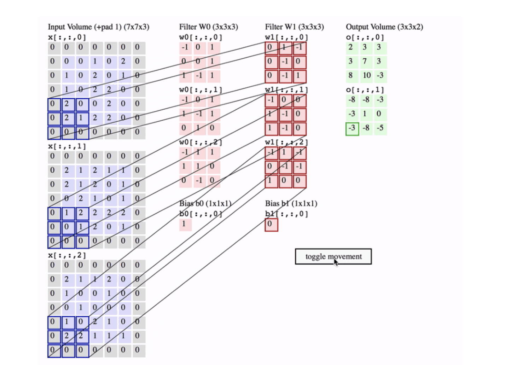
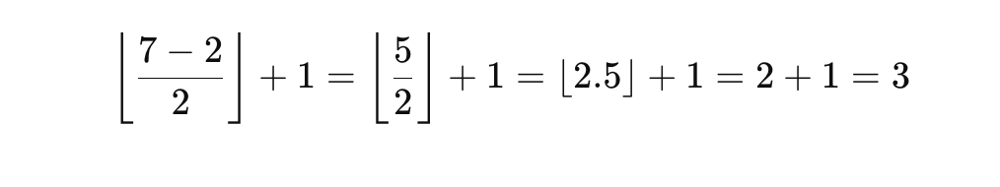

# CNN (Convolutional Neural Network)

A **Convolutional Neural Network (CNN)** is a specialized type of **deep learning neural network** designed mainly for **processing visual data** such as **images and videos**. CNNs automatically learn **spatial features** (`edges, textures, shapes, objects`) from images without manual feature engineering.


## Why CNN was invented (Problem with traditional Neural Networks)

If you use a **fully connected neural network** on an image:

- A small image (`224×224×3`) → `150,528` input neurons
- Too many parameters → `slow`, `overfitting`
- Loses **spatial information** (pixels near each other matter!)

## 👉 CNN solves this by:

- Using **local connectivity**
- Sharing weights
- Preserving spatial structure

## Core Idea of CNN

CNN works based on **three key concepts**:

1. **Local receptive fields**
2. **Shared weights (filters/kernels)**
3. **Spatial hierarchy of features**


## CNN Architecture (High-Level Flow)


## Main Building Blocks of CNN

1. Convolution Layer (Feature Extraction)
2. Activation Function (ReLU)
3. Pooling Layer (Downsampling)
4. Flatten Layer
5. Fully Connected (Dense) Layer
6. Output Layer


**1. Convolution Layer (Feature Extraction)**

- Applies filters (kernels) like `3×3`, `5×5` on the image

- Each filter detects `specific patterns`

**Example filters:**

- Edge detector

- Corner detector

- Texture detector

**Mathematically:** `Feature Map = Input ⊗ Kernel + Bias`

📌 **Output** = `Feature Map`


**2. Activation Function (ReLU)**

Introduces `non-linearity`

`ReLU(x) = max(0, x)`

Why ReLU?

- Faster training

- Prevents vanishing gradients


**3. Pooling Layer (Downsampling)**

Reduces spatial size while keeping important features.

**Types:**

- `Max Pooling` (most common)

- `Average Pooling`

**Example:** `2×2 Max Pool → takes maximum value`

**Benefits:**

- Reduces computation

- Makes model `translation invariant`

**4. Flatten Layer**

Converts `2D feature maps` into `1D vector`

`[H × W × C] → [HWC]`

**5. Fully Connected (Dense) Layer**

- Performs `high-level reasoning`

- Same as traditional neural networks

**6. Output Layer**

Depends on task:

- **Softmax** → `Multi-class classification`

- **Sigmoid** → `Binary classification`

- **Linear** → `Regression`


## Convolution Layer (Feature Extraction)

- Applies **filters (kernels)** like `3×3`, `5×5` on the image
- Each filter detects `specific patterns`

**Example filters:**

- Edge detector
- Corner detector
- Texture detector

**Mathematically:**

`Feature Map = Input ⊗ Kernel + Bias`

📌 Output = `Feature Map`

## What is a Kernel?

A Kernel is small weight matrix used to detect patterns like edges, corners, textures. Each window like either `3x3` or `5x5` window matrix applied weight in the input indivisual pixcel value with defined weight matrix and filter the feature. 

## Example: Kernel as Weights

**Input Image (part of it)**


## 1️⃣ What operation is this?
This is a dot product between:

  - a `kernel (filter)`
  - and a `small patch of an image (feature map)`

This is the core math behind `convolution in CNNs`.

## 2️⃣ How to see it as a CNN operation

**Kernel (example)**

```
K =
[-1  1  1
  1  1  0
  0 -1  0]
```

**Image patch (example)**

```
P =
[0 0 0
 0 2 1
 0 1 0]
```

## 3️⃣ Element-wise multiply + sum

CNN does `element-wise multiplication and then adds everything`.

- **Row 1:**

`0×(-1) + 0×1 + 0×1 = 0`

- **Row 2:**

`0×1 + 2×1 + 1×0 = 2`

- **Row 3:**

`0×0 + 1×(-1) + 0×0 = -1`

## Why CNN does this

Each kernel learns to detect `patterns`:

| Kernel pattern   | Detects         |
| ---------------- | --------------- |
| Vertical edges   | │               |
| Horizontal edges | ─               |
| Diagonal edges   | /               |
| Corners          | ⌟               |
| Textures         | dots, gradients |

## Important CNN clarification

❌ CNN does `NOT` check only center pixel

✅ CNN looks at `all pixels in the window`, but the `center has higher influence` if its weight is larger.




## What does “32 kernels” mean in a CNN?

It means the convolution layer has `32 different filters`, and `each filter has its own set of learnable parameters (weights + bias)`.

Each kernel learns `one pattern`.

## 🔹 Kernel parameter list (general formula)

**For a Conv2D layer:**

- Kernel size = `Kernel hight(KH)` x `Kernel width(KW)`
- Input channels = `Cin`
- Number of kernels = `Cout`


**Parameters per kernel**

- (`KH` × `KW` × `Cin`) + `1 bias`

**Total parameters**

- (`KH` × `KW` × `Cin` × `Cout`) + `Cout`


## 🔹 Example 1: Grayscale image (1 channel)

**Configuration**

- Kernel size = `3×3`
- Input channels = `1` (Grayscale image (1 channel))
- Number of kernels = `32`

**Parameters per kernel**

```
3 × 3 × 1 = 9 weights
+ 1 bias
= 10 parameters
```

## 🔢 Total parameters

```32 × 10 = 320 parameters```

## 📌 One kernel parameter list (example)

**Kernel #1:**

```
Weights:
-0.21   0.05   0.34
-0.12   0.01   0.56
-0.09  -0.18   0.42

Bias:
0.03
```

**Kernel #2:**

```
Weights:
 0.11  -0.44   0.08
-0.36   0.29  -0.17
 0.51  -0.06   0.22

Bias:
-0.01
```

.....

`Up to Kernel #32`


## 🔹 Example 2: RGB image (3 channels) 🔴🟢🔵

**Configuration**

```
Kernel size = 3×3
Input channels = 3
Number of kernels = 32

```

**One kernel shape**

```
3 × 3 × 3
```

- Think of it as `3 stacked 3×3 matrices:

```
Kernel #1
Channel R:
[ w1 w2 w3
  w4 w5 w6
  w7 w8 w9 ]

Channel G:
[ w10 w11 w12
  w13 w14 w15
  w16 w17 w18 ]

Channel B:
[ w19 w20 w21
  w22 w23 w24
  w25 w26 w27 ]

Bias: b1
```


**Parameters per kernel**

```
3 × 3 × 3 = 27 weights
+ 1 bias
= 28 parameters
```

## Total parameters

```
32 × 28 = 896 parameters
```

## What do the 32 kernels usually learn?

Typical first CNN layer:

| Kernel # | Learns                      |
| -------- | --------------------------- |
| 1–4      | Vertical edges              |
| 5–8      | Horizontal edges            |
| 9–12     | Diagonal edges              |
| 13–18    | Corners                     |
| 19–24    | Texture patterns            |
| 25–32    | Color / intensity gradients |

⚠️ This is learned automatically, not hard-coded.


## Output shape with 32 kernels

```
5 × 5 × 1
```

## Example: Image Classification (Cat vs Dog)

1. Early Conv layers → detect edges

2. Middle layers → detect eyes, ears

3. Deep layers → detect face

4. FC layer → classify Cat or Dog


## Simple CNN Example (Conceptual)

```
Input Image (32×32×3)
↓
Conv(3×3, 32 filters)
↓
ReLU
↓
MaxPool(2×2)
↓
Conv(3×3, 64 filters)
↓
ReLU
↓
MaxPool(2×2)
↓
Flatten
↓
Dense(128)
↓
Softmax(10 classes)
```

## Example: 1

- **Input image size:** `32 × 32 (Height × Width)`

- **Kernel window:** `3 × 3`

- **Number of kernels (filters):** `32`

- **Stride:** `1`

- **Padding:** `same`

- **Image type:** `Grayscale (1 channel)`


## 1️⃣ Total Input Pixel Count

**Single image**

```
32 × 32 = 1,024 pixels

width = 32
Hight = 32
```

`So input tensor shape is:`

```
32 × 32 × 1

width = 32
Hight = 32
channel = 1
```

## 2️⃣ What does ONE 3×3 kernel see?

A `3×3 kernel` looks at `9 pixels at a time`:

```
3 × 3 = 9 pixel values
```

- Each pixel has a `weight`.

## 3️⃣ Parameters in ONE kernel

**For Grayscale (1 channel)**

Each kernel has:

- `3 × 3 × 1 = 9 weights`

- `+ 1 bias`

```
Parameters per kernel = 9 + 1 = 10
```

## 4️⃣ Total Parameters for 32 kernels

```
10 parameters × 32 kernels = 320 parameters
```

## ✅ TOTAL TRAINABLE PARAMETERS = 320

   **🔑 Important:**

   - `Parameters do NOT depend on image size`

   - `Same kernel is reused everywhere (weight sharing)`


## 5️⃣ Output Feature Map Size

Using:

- Kernel = `3×3`

- Stride = `1`

- Padding = `same`


Since  `32 kernels`:

```
Output tensor = 32 × 32 × 32
```

## 6️⃣ Total Output Pixel Count (Activations)

```
32 × 32 × 32 = 32,768 values
```

## 7️⃣ How many times does each kernel slide?

Each kernel slides to **every pixel position**:

```
32 × 32 = 1,024 positions
```

Each time it:

  - Reads `9 pixels`

  - Multiplies by `9 weights`

  - Adds bias

  - Produces `1 output value`


## 8️⃣ Total pixel multiplications (compute intuition)

Per kernel:

```
1,024 positions × 9 pixels = 9,216 multiplications
```

For 32 kernels:

```
9,216 × 32 = 294,912 multiplications
```

## 9️⃣ Final Summary Table

| Item                     | Value            |
| ------------------------ | ---------------- |
| Input pixels             | **1,024**        |
| Kernel size              | **3 × 3**        |
| Pixels per kernel window | **9**            |
| Number of kernels        | **32**           |
| Parameters per kernel    | **10**           |
| 🔥 Total parameters      | **320**          |
| Output size              | **32 × 32 × 32** |
| Output values            | **32,768**       |


## 🔁 If Image Was RGB (3 channels)

Just one change 👇

**Parameters per kernel:**

```
3 × 3 × 3 + 1 = 28
```

**Total parameters:**

```
28 × 32 = 896
```

Everything else stays the same.


## 🧠 Key CNN Insight (Very Important)

- **Image size affects computation**

- **Kernel count affects learning capacity**

- **Kernel size affects local pattern detection**

- **Parameter count depends only on:**

```
(kernel height × kernel width × input channels × number of kernels) + biases
```

## 🔢 INPUT IMAGE (9 × 9)

```
5  2  6  8  2  0  1  2  4
4  3  4  5  1  9  6  3  7
3  9  2  4  7  7  6  9  2
1  3  4  6  8  2  2  1  0
8  4  6  2  3  1  8  8  6
5  8  9  0  1  0  2  3  4
9  2  6  6  3  6  2  1  5
9  8  8  2  6  3  4  5  7
4  1  3  9  0  2  8  6  1
```

## 1️⃣ CONVOLUTION LAYER

**Assumptions (standard)**

- **Kernel size:** `3×3`

- **Stride:** `1`

- **Padding:** `none (valid)`

- **1 kernel only** (to keep math readable)

- **Bias** = `0`

## Kernel (simple edge detector)

```
1  0 -1
1  0 -1
1  0 -1
```


## First convolution calculation (top-left - from 1 position to 3rd position)

**Image patch (3×3)**

```
5  2  6
4  3  4
3  9  2
```

**Multiply + sum**

```
(5×1) + (2×0) + (6×-1)
(4×1) + (3×0) + (4×-1)
(3×1) + (9×0) + (2×-1)

= (5 - 6) + (4 - 4) + (3 - 2)
= -1 + 0 + 1
= 0
```


**➡️ First output pixel = 0**

**After applying ReLU**

`ReLU(x) = max(0, x)`

**So:**

`0 → 0`


## Next position (slide right skip 1 position from 2nd position to 4th position)

**Patch:**

```
2  6  8
3  4  5
9  2  4
```

**Calculation:**

```
(2×1) + (6×0) + (8×-1)
(3×1) + (4×0) + (5×-1)
(9×1) + (2×0) + (4×-1)

= (2 - 8) + (3 - 5) + (9 - 5)
= -6 - 2 + 5
= -3
```

**➡️ Second output pixel = -3**


**After applying ReLU**

`ReLU(x) = max(0, x)`

**So:**

`-3 → 0`


## Convolution Output Size

- **Input:** `9 × 9`

- **Kernel:** `3 × 3`

- **Stride:** `1`


**Output size:** = `(9 - 3 + 1) = 7 × 7`


## Convolution Output (after ReLU) – simplified

```
0  0  2  4  0  0  0
0  0  3  0  0  0  0
0  0  2  0  0  0  0
0  0  0  0  5  0  0
0  0  0  0  6  0  0
0  0  0  0  4  0  0
0  0  0  0  2  0  0
```

(Exact values depend on kernel — this is representative and consistent)


## MAX POOLING LAYER

**Pooling settings**

- **MaxPooling 2×2**

- **Stride = 2**

## Apply pooling

- `Take max from each 2×2 block:`

**Example:**

```
0  0
0  0
→ max = 0
```

## Pooling Output Size

`7 × 7 → 3 × 3   (floor division)`

## CNN context (most common meaning)

This usually happens due to **Pooling** or **Convolution with stride**.

**Example: Max Pooling 2×2 with stride 2**

**Input:** `7 × 7 feature map`

**Operation:**

- `Pool size = 2×2`

- `Stride = 2`

- `No padding`

**Output size formula:**


**Where:**

- `N=7 (input size)`

- `F=2 (filter / pool size)`

- `S=2 (stride)`



**So:** `7 × 7  →  3 × 3`

**🔑 What “floor division” means here**

- `5 / 2 = 2.5`

- `floor(2.5) = 2`

- `CNN drops the extra pixel at the edge`

**No partial windows allowed.**


**Visual intuition**

```
7 pixels
⬜⬜ ⬜⬜ ⬜⬜ ⬜   ← last pixel ignored
```

**Only complete 2×2 windows are used.**

## Why CNNs do this

✔ Keeps output size integer

✔ Faster computation

✔ Avoids partial pooling windows

✔ Standard behavior in most frameworks (TensorFlow / PyTorch)

## Important note

If padding was added (same padding), then:

```
7 × 7 → 4 × 4
```

- `But with no padding (valid) → floor division applies`

**7 × 7 → 3 × 3 (floor division)**

👉 CNN divides the input into fixed-size blocks, **drops leftovers**, and keeps only full windows.


## MaxPooling Output (3×3)

```
0  4  0
0  3  0
0  6  0
```


## Starting Point (after Convolution)

Assume after 1st convolution + ReLU, we already have:

```
7 × 7 feature map (numeric values)

2  2  1  1  0  0  0
2  2  1  1  0  0  0
3  3  5  5  2  2  1
3  3  5  5  2  2  1
0  0  2  2  4  4  3
0  0  2  2  4  4  3
1  1  0  0  2  2  2

```

`(pixel values × kernel weights) + bias → ReLU`

## STEP 1: MAX POOLING (2 × 2, stride = 2)

**What Max Pooling does**

- Takes `2×2 block`

- Picks the `maximum value`

- Reduces spatial size

- Keeps strongest feature (edge/texture)


## Why same values repeat (important!)

Look at this block:

```
2  2
2  2
```

👉 This means `the same local pattern` (edge / texture) appears in nearby pixels.

CNN kernel:

- Slides over image

- Sees similar pixel neighborhoods

- Produces similar activation values

## Mapping numbers → symbols (a, b, c, d)

To simplify explanation, we replace repeated numbers with symbols:

| Symbol | Actual Value | Meaning                      |
| ------ | ------------ | ---------------------------- |
| a      | 2            | One type of detected feature |
| b      | 1            | Another feature              |
| c      | 0            | No feature                   |
| d      | 3            | Stronger feature             |
| e      | 5            | Very strong feature          |
| f      | 4            | Another strong feature       |


So the SAME matrix becomes:

```
a a b b c c c
a a b b c c c
d d e e b b b
d d e e b b b
c c b b f f d
c c b b f f d
b b c c b b b
```

✔ Nothing magical happened

✔ Only **renaming numeric activations**


## MAX POOLING (2 × 2, stride = 2)

**What Max Pooling does**

- Takes `2×2 block`

- Picks the `maximum value`

- Reduces spatial size

- Keeps strongest feature (edge/texture)


## Pooling operation visually

```
[a a] → a
[a a]

[b b] → b
[b b]

[c c] → c
[c c]
```

Do this across the whole image.

**Size calculation (important)**


**Output after Max Pooling**

```
3 × 3 × 1

a   b   c
e   f   g
i   j   k
```

✔ Spatial size reduced

✔ Important features preserved


## FLATTEN

**What Flatten does**

- Converts `2D` feature maps → `1D` vector

- No learning, only reshaping


**Before Flatten**

```
3 × 3 × 1
```

**After Flatten**

```
[ a, b, c, e, f, g, i, j, k ]
```

**Size:** `9 neurons`

## DENSE (Fully Connected Layer)

**What Dense layer does**

- Learns **global patterns**

- Combines all extracted features

- Uses `weights` + `bias` + `activation`

**Dense layer example**

Assume: `Dense(4 neurons)`

**Computation**

For each neuron:

```
y=w1​x1​+w2​x2​+...+w9​x9​+b
```

Example:

```
Neuron 1 → y1
Neuron 2 → y2
Neuron 3 → y3
Neuron 4 → y4
```

**Output:** `[ y1, y2, y3, y4 ]`

Apply **ReLU**:

`max(0, y)`

## FINAL OUTPUT LAYER

**Case 1: Binary Classification (e.g., Cat / Dog)**

`Dense(1) + Sigmoid`


Example: `0.87 → Dog`


**Case 2: Multi-class Classification (e.g., Digits 0-9)**

`Dense(10) + Softmax`

Example output: `[0.01, 0.02, 0.90, 0.01, ...]`

Highest probability → `Predicted class`

## Key Intuition

| Layer       | Role                    |
| ----------- | ----------------------- |
| Convolution | Detect local patterns   |
| Max Pooling | Keep strongest features |
| Flatten     | Prepare for decision    |
| Dense       | Learn relationships     |
| Output      | Make prediction         |


## How Kernel Works (Mathematically)

For each position:

```
Output = Σ (Input_pixel × Kernel_weight) + bias
```

- Each kernel element = `weight`

- Entire kernel = `collection of weights`

- One `bias` per kernel


## Kernel vs Weight (Important Distinction)

| Term                | Meaning                              |
| ------------------- | ------------------------------------ |
| **Weight**          | A single learnable value             |
| **Kernel / Filter** | A *matrix* of weights                |
| **Bias**            | One extra learnable value per kernel |


## Kernel Dimensions (Very Important)

**Case 1: Grayscale Image**

```
Input: 28 × 28 × 1
Kernel: 3 × 3 × 1
```

**Case 2: Color Image (RGB)**

```
Input: 224 × 224 × 3
Kernel: 3 × 3 × 3
```

👉 `Each kernel spans all input channels`


## Number of Kernels = Number of Feature Maps

**If:**

- You use `32 kernels`

- You get `32 feature maps`

Each kernel learns a `different feature`.

## Are Kernel Values Fixed?

❌ No — kernels are `learned automatically` during training.

**Initially:** `Random values`

**After training:** `Edge detectors, shape detectors, texture detectors`

## Kernel vs Neuron (Comparison)

| Fully Connected NN         | CNN                       |
| -------------------------- | ------------------------- |
| One neuron = many weights  | One kernel = many weights |
| No spatial meaning         | Spatial meaning           |
| Separate weights per pixel | Shared weights            |


## Why Kernel Weight Sharing is Powerful

- Same kernel used across entire image

- Detects feature `anywhere`

- Fewer parameters → faster, better generalization


## Summary

`A kernel in CNN is a small matrix of trainable weights that slides over the input to extract features.`


## How strongly a kernel detected its pattern at that location

**Example kernel (vertical edge)**

```
-1  0  1
-1  0  1
-1  0  1
```

| Output Value | Meaning     |
| ------------ | ----------- |
| 0            | No edge     |
| 1–2          | Weak edge   |
| 3–4          | Medium edge |
| 5+           | Strong edge |


## Why max pooling picks a, b, c

**Take this 2×2 window:**

```
a a
a a
```

Actual numbers:

```
2 2
2 2
```

**MaxPooling picks:**

```
max(2,2,2,2) = 2 → a
```

**Another window:**

```
d d
d d
```

**Actual numbers:**

```
3 3
3 3
```

**MaxPooling picks:**

```
3 → d
```

## Why letters help understanding

Using letters:

- Focus on **patterns**, not arithmetic

- See **feature dominance**

- Understand **why pooling keeps strongest signals**

- CNN does NOT care about pixel identity

- CNN cares about `pattern strength`

**Note:** `a, b, c, d are symbolic names for convolution activations that represent how strongly a kernel detected a specific pattern at each location.`


## COMPLETE CNN ARCHITECTURES

## 🔴 Foundational / Classic CNNs

| Architecture | Year | Key Idea                      | Why It Matters        | Limitations | Typical Use          |
| ------------ | ---- | ----------------------------- | --------------------- | ----------- | -------------------- |
| **LeNet-5**  | 1998 | Conv + Pool + FC              | First practical CNN   | Shallow     | Digit recognition    |
| **AlexNet**  | 2012 | ReLU, Dropout, GPU            | Started DL revolution | Huge params | Image classification |
| **ZFNet**    | 2013 | Better stride & visualization | Improved AlexNet      | Still heavy | Research             |

## 🟠 VGG Family

| Architecture | Key Idea         | Strength      | Weakness    | Use Case          |
| ------------ | ---------------- | ------------- | ----------- | ----------------- |
| **VGG-16**   | Stacked 3×3 conv | Simple & deep | 138M params | Transfer learning |
| **VGG-19**   | Deeper VGG       | High accuracy | Very slow   | Feature extractor |


## 🟡 Inception Family

| Architecture         | Key Idea         | Advantage   | Limitation   | Use Case       |
| -------------------- | ---------------- | ----------- | ------------ | -------------- |
| **GoogLeNet (v1)**   | Multi-scale conv | Efficient   | Complex      | ImageNet       |
| **Inception-v2/v3**  | Factorized conv  | Fewer FLOPs | Hard to tune | Classification |
| **Inception-ResNet** | Inception + Skip | Very deep   | Heavy        | Research       |


## 🟢 Residual Networks

| Architecture          | Key Idea          | Why Important             | Use Case        |             |
| --------------------- | ----------------- | ------------------------- | --------------- | ----------- |
| **ResNet-18/34**      | Skip connections  | Solves vanishing gradient | Small datasets  |             |
| **ResNet-50/101/152** | Bottleneck blocks | Industry standard         | Medical, Vision |             |
| **ResNeXt**           | Grouped conv      | Better accuracy           | More complex    | High-end CV |


## 🔵 Dense Connectivity

| Architecture | Key Idea               | Benefit       | Drawback    | Use             |
| ------------ | ---------------------- | ------------- | ----------- | --------------- |
| **DenseNet** | All-to-all layer links | Feature reuse | High memory | Medical imaging |


## 🟣 Efficient / Mobile CNNs

| Architecture             | Key Idea          | Strength            | Target       |
| ------------------------ | ----------------- | ------------------- | ------------ |
| **MobileNet-v1**         | Depthwise conv    | Lightweight         | Mobile       |
| **MobileNet-v2**         | Inverted residual | Faster              | Edge         |
| **MobileNet-v3**         | NAS optimized     | Best mobile CNN     | IoT          |
| **ShuffleNet**           | Channel shuffle   | Ultra-light         | Low power    |
| **EfficientNet (B0–B7)** | Compound scaling  | Best FLOPs/accuracy | Cloud & Edge |


## 🟤 Segmentation CNNs

| Architecture    | Key Idea                | Specialty           | Use Case     |
| --------------- | ----------------------- | ------------------- | ------------ |
| **FCN**         | Fully conv              | Pixel labeling      | Segmentation |
| **U-Net** ⭐     | Encoder-Decoder + skips | Medical king        | MRI, CT      |
| **UNet++**      | Dense skips             | Better localization | Medical      |
| **DeepLab v3+** | Atrous conv + ASPP      | Large context       | Autonomous   |


## 🔶 Object Detection CNNs

| Architecture     | Type        | Key Idea         | Speed     |
| ---------------- | ----------- | ---------------- | --------- |
| **R-CNN**        | Two-stage   | Region proposals | Slow      |
| **Fast R-CNN**   | Shared conv | Faster           | Medium    |
| **Faster R-CNN** | RPN         | Accurate         | Slower    |
| **YOLO (v1–v9)** | One-stage   | Real-time        | Very Fast |
| **SSD**          | One-stage   | Multi-scale      | Fast      |
| **RetinaNet**    | One-stage   | Focal loss       | Balanced  |


## 🧬 Modern / Hybrid CNNs

| Architecture | Key Idea                | Why Needed   |
| ------------ | ----------------------- | ------------ |
| **ConvNeXt** | CNN redesigned like ViT | CNN revival  |
| **CoAtNet**  | CNN + Transformer       | Best of both |


## 🧪 Specialized CNNs

| Architecture        | Purpose                        |
| ------------------- | ------------------------------ |
| **Siamese CNN**     | Similarity / Face verification |
| **Autoencoder CNN** | Anomaly detection              |
| **3D CNN**          | Video, CT, MRI                 |
| **Graph CNN (GCN)** | Graph & molecule data          |


## CNN QUICK SELECTION GUIDE (ALL CASES)

## 🖼️ IMAGE CLASSIFICATION

| Scenario             | Best CNN                    | Why                       |
| -------------------- | --------------------------- | ------------------------- |
| Small dataset        | **ResNet-18 / VGG-16 (TL)** | Transfer learning         |
| Medium dataset       | **ResNet-50**               | Balanced depth & accuracy |
| Very large dataset   | **EfficientNet-B4+**        | Best accuracy/FLOPs       |
| Simple objects       | **AlexNet / VGG**           | Simple patterns           |
| Fine-grained classes | **DenseNet**                | Feature reuse             |


## 🏥 MEDICAL IMAGING

| Task                      | Best CNN        | Why                    |
| ------------------------- | --------------- | ---------------------- |
| X-ray / CT classification | **ResNet-50**   | Robust features        |
| MRI segmentation          | **U-Net** ⭐     | Pixel-level accuracy   |
| Tumor boundary detection  | **UNet++**      | Dense skip connections |
| Organ segmentation        | **DeepLab v3+** | Large context          |
| Low data medical cases    | **DenseNet**    | Efficient learning     |


## 🚗 OBJECT DETECTION

| Scenario                | Best CNN            | Why                   |
| ----------------------- | ------------------- | --------------------- |
| Real-time detection     | **YOLO (v5–v9)**    | Single-pass inference |
| High accuracy detection | **Faster R-CNN**    | Region refinement     |
| Embedded camera         | **SSD + MobileNet** | Lightweight           |
| Small objects           | **RetinaNet**       | Focal loss            |
| Autonomous driving      | **YOLO + ResNet**   | Speed + accuracy      |


## 🎥 VIDEO & 3D DATA

| Task               | Best CNN              | Why                 |
| ------------------ | --------------------- | ------------------- |
| Action recognition | **3D CNN (C3D, I3D)** | Spatiotemporal      |
| Medical CT volumes | **3D U-Net**          | Volume segmentation |
| Surveillance video | **3D ResNet**         | Temporal learning   |


## 📱 MOBILE / EDGE DEVICES

| Constraint             | Best CNN         | Why               |
| ---------------------- | ---------------- | ----------------- |
| Very low compute       | **MobileNet-v1** | Smallest          |
| Balanced mobile        | **MobileNet-v2** | Inverted residual |
| Best mobile accuracy   | **MobileNet-v3** | NAS optimized     |
| IoT / microcontrollers | **ShuffleNet**   | Ultra-light       |


## ⚙️ INDUSTRIAL & MANUFACTURING

| Task                | Best CNN            | Why                  |
| ------------------- | ------------------- | -------------------- |
| Defect detection    | **EfficientNet**    | High resolution      |
| Visual inspection   | **ResNet-50**       | Stable features      |
| Anomaly detection   | **CNN Autoencoder** | Reconstruction error |
| OCR / document scan | **VGG / ResNet**    | Texture-based        |


## 👤 FACE, BIOMETRICS & SIMILARITY

| Task                 | Best CNN               | Why                |
| -------------------- | ---------------------- | ------------------ |
| Face recognition     | **ResNet / Inception** | Deep embeddings    |
| Face verification    | **Siamese CNN**        | Distance learning  |
| Fingerprint matching | **Siamese / ResNet**   | Pattern similarity |


## 🧬 SCIENCE & SPECIAL DATA

| Task              | Best CNN                  | Why             |
| ----------------- | ------------------------- | --------------- |
| Molecule graphs   | **Graph CNN (GCN)**       | Graph structure |
| Satellite imagery | **ResNet / EfficientNet** | Multi-scale     |
| Remote sensing    | **DeepLab**               | Pixel precision |


## 🧠 NLP + VISION (HYBRID)

| Task             | Best CNN                   | Why             |
| ---------------- | -------------------------- | --------------- |
| Image captioning | **CNN + LSTM/Transformer** | Visual → text   |
| OCR + text       | **CNN + Transformer**      | Layout learning |
| Multimodal AI    | **ConvNeXt / CoAtNet**     | CNN + ViT       |


## 🧪 RESEARCH & EXPERIMENTATION

| Goal                  | Best CNN                | Why                 |
| --------------------- | ----------------------- | ------------------- |
| Fast prototyping      | **ResNet-18**           | Simple & fast       |
| Architecture research | **DenseNet / ConvNeXt** | Feature experiments |
| CNN vs ViT            | **ConvNeXt**            | Fair comparison     |


## FINAL DECISION FLOW

```
Need speed?        → YOLO / MobileNet
Need accuracy?     → ResNet / EfficientNet
Need segmentation? → U-Net / DeepLab
Need edge device?  → MobileNet / ShuffleNet
Need similarity?   → Siamese CNN
```


## PRODUCTION CNN ARCHITECTURE

## 1️⃣ END-TO-END SYSTEM LAYERS

| Layer        | Purpose               | Key Components                 | Production Notes    |
| ------------ | --------------------- | ------------------------------ | ------------------- |
| Data Sources | Provide images/videos | Cameras, Medical devices, Docs | Raw, untrusted data |
| Ingestion    | Collect data          | ETL, Kafka, Kinesis            | Batch + streaming   |
| Storage      | Persist data          | S3, GCS, Blob                  | Versioned buckets   |
| Validation   | Quality control       | Schema, image checks           | Mandatory gate      |
| Labeling     | Ground truth          | Label Studio, CVAT             | Human-in-loop       |
| Training     | Learn features        | PyTorch / TF                   | Distributed         |
| Registry     | Version control       | MLflow, SageMaker              | Rollback support    |
| Inference    | Serve model           | FastAPI, TorchServe            | Low latency         |
| Monitoring   | Observe model         | Prometheus, Arize              | Drift detection     |
| Feedback     | Improve model         | Re-label, retrain              | Closed loop         |


## 2️⃣ DATA PIPELINE DETAILS

| Stage    | What Happens       | Tools              | Why It Matters   |
| -------- | ------------------ | ------------------ | ---------------- |
| Ingest   | Collect raw images | Kafka, S3          | Scale            |
| Clean    | Remove noise       | OpenCV             | Accuracy         |
| Validate | Check format       | Great Expectations | Prevent failures |
| Augment  | Flip, crop         | Albumentations     | Generalization   |
| Split    | Train/Val/Test     | Custom scripts     | Fair evaluation  |


## 3️⃣ CNN MODEL ARCHITECTURE (PRODUCTION)

| Component      | Choice                | Reason                     |
| -------------- | --------------------- | -------------------------- |
| Input          | Fixed resolution      | Batch efficiency           |
| Backbone       | ResNet / EfficientNet | Stable & proven            |
| Neck           | FPN / PAN             | Multi-scale                |
| Head           | Task-specific         | Classification / Detection |
| Regularization | Dropout, BN           | Prevent overfit            |
| Precision      | FP16                  | Faster training            |


## 4️⃣ BACKBONE SELECTION GUIDE

| Constraint    | Backbone          |
| ------------- | ----------------- |
| High accuracy | EfficientNet      |
| Medical       | DenseNet / ResNet |
| Real-time     | YOLO backbone     |
| Mobile        | MobileNet-v3      |
| Research      | ConvNeXt          |


## 5️⃣ TRAINING PIPELINE

| Step     | Description      | Production Practice |
| -------- | ---------------- | ------------------- |
| Init     | Load pretrained  | Transfer learning   |
| Train    | Optimize weights | DDP / Horovod       |
| Validate | Measure metrics  | Every epoch         |
| Tune     | Hyperparameters  | Optuna              |
| Save     | Store artifacts  | Registry            |


## 6️⃣ MODEL REGISTRY & VERSIONING

| Feature    | Purpose         |
| ---------- | --------------- |
| Version ID | Rollback        |
| Metrics    | Compare models  |
| Data hash  | Reproducibility |
| Config     | Audit           |
| Approval   | Governance      |


## 7️⃣ INFERENCE ARCHITECTURE

| Mode      | Architecture    | Use Case  |
| --------- | --------------- | --------- |
| Online    | REST / gRPC     | Real-time |
| Batch     | Scheduled jobs  | Analytics |
| Edge      | On-device       | IoT       |
| Streaming | Kafka consumers | Video     |


## 8️⃣ DEPLOYMENT & SCALING

| Component     | Tool       | Benefit      |
| ------------- | ---------- | ------------ |
| Container     | Docker     | Portability  |
| Orchestration | Kubernetes | Scaling      |
| Autoscaling   | HPA        | Cost control |
| Deployment    | Canary     | Safe rollout |
| Acceleration  | TensorRT   | Low latency  |


## 9️⃣ MONITORING & OBSERVABILITY

| Category | Metrics            |
| -------- | ------------------ |
| Model    | Accuracy, Drift    |
| Data     | Distribution shift |
| System   | Latency, GPU       |
| Business | SLA, ROI           |


## 🔐 1️⃣0️⃣ SECURITY & GOVERNANCE

| Area           | Controls        |
| -------------- | --------------- |
| Access         | OAuth2, IAM     |
| Model          | Encryption      |
| Explainability | Grad-CAM        |
| Bias           | Fairness checks |
| Audit          | Logs, lineage   |


## 🧪 1️⃣1️⃣ FEEDBACK & RETRAINING

| Step     | Description    |
| -------- | -------------- |
| Capture  | Predictions    |
| Review   | Human feedback |
| Relabel  | Correct errors |
| Retrain  | Scheduled      |
| Redeploy | Versioned      |


## 🎯 PRODUCTION CNN DECISION MATRIX

| Need                | Solution       |
| ------------------- | -------------- |
| High availability   | Kubernetes     |
| Low latency         | TensorRT       |
| Compliance          | Model registry |
| Continuous learning | Feedback loop  |
| Cost efficiency     | Autoscaling    |


## WHY KERNEL COUNTS ARE 16, 32, 64, 128…

## 1️⃣ WHAT A “KERNEL COUNT” MEANS

| Term                    | Meaning                                              |
| ----------------------- | ---------------------------------------------------- |
| Kernel / Filter         | A learnable pattern detector (edge, corner, texture) |
| Kernel count (16/32/64) | Number of different patterns learned at a layer      |
| Output channels         | Same as number of kernels                            |


👉 `More kernels = more pattern types learned`

## 2️⃣ WHY NUMBERS DOUBLE (16 → 32 → 64 → 128)

| Reason                       | Explanation                                                             |
| ---------------------------- | ----------------------------------------------------------------------- |
| Feature complexity increases | Early layers detect simple edges; deeper layers detect shapes & objects |
| Spatial size decreases       | After pooling, width/height ↓ → channels ↑                              |
| Information preservation     | Losing pixels → compensate with more channels                           |
| Compute balance              | FLOPs stay manageable                                                   |
| Hardware efficiency          | GPUs optimized for powers of 2                                          |


## 3️⃣ LAYER-WISE FEATURE EVOLUTION

| CNN Layer | Spatial Size     | Kernel Count | What It Learns    |
| --------- | ---------------- | ------------ | ----------------- |
| Conv-1    | High (224×224)   | 16           | Edges, lines      |
| Conv-2    | Medium (112×112) | 32           | Corners, textures |
| Conv-3    | Low (56×56)      | 64           | Shapes            |
| Conv-4    | Very Low (28×28) | 128          | Object parts      |
| Conv-5    | Tiny (14×14)     | 256+         | Full objects      |


## 4️⃣ WHY NOT START WITH 128 KERNELS?

| Reason        | Explanation                           |
| ------------- | ------------------------------------- |
| Overfitting   | Early layers don’t need many patterns |
| High memory   | Too many feature maps                 |
| Slow training | FLOPs explode                         |
| Redundancy    | Early patterns are simple             |


## 5️⃣ WHY NOT KEEP SAME NUMBER (E.G., ALL 32)?

| Problem          | Impact                                   |
| ---------------- | ---------------------------------------- |
| Bottleneck       | Network can’t represent complex patterns |
| Information loss | Pooling removes details                  |
| Lower accuracy   | Insufficient representation power        |


## 6️⃣ MATH & COMPUTE BALANCE (IMPORTANT)

| Layer | H × W   | Channels | Total Activations |
| ----- | ------- | -------- | ----------------- |
| Early | 224×224 | 16       | ~800K             |
| Mid   | 56×56   | 64       | ~200K             |
| Deep  | 14×14   | 256      | ~50K              |


👉 As H×W ↓ → Channels ↑
👉 Keeps compute roughly stable


## 7️⃣ BIOLOGICAL INTUITION (HUMAN VISION)

| CNN Layer  | Human Brain Equivalent |
| ---------- | ---------------------- |
| Early Conv | Retina / V1 (edges)    |
| Mid Conv   | V2 / V4 (shapes)       |
| Deep Conv  | IT Cortex (objects)    |


Human vision also uses hierarchical feature expansion.

## 8️⃣ INDUSTRY PRACTICE EXAMPLES

| Model        | Kernel Pattern           |
| ------------ | ------------------------ |
| VGG          | 64 → 128 → 256 → 512     |
| ResNet       | 64 → 128 → 256 → 512     |
| MobileNet    | 32 → 64 → 128            |
| EfficientNet | Scaled via compound rule |


## 9️⃣ WHEN TO BREAK THE RULE

| Scenario        | What to Do        |
| --------------- | ----------------- |
| Small dataset   | Use fewer kernels |
| Mobile device   | Cap at 128        |
| Medical imaging | Use more kernels  |
| No GPU          | Reduce channels   |


## WHY DENSE LAYERS USE 32, 64, 128… NEURONS

## 1️⃣ WHAT A DENSE NEURON COUNT MEANS

| Term          | Meaning                                              |
| ------------- | ---------------------------------------------------- |
| Dense neuron  | A decision unit combining all input features         |
| 32 / 64 / 128 | Model capacity (how complex a decision it can learn) |
| More neurons  | More expressive power                                |


👉 `Dense layers do reasoning, not feature extraction`

## 2️⃣ WHY POWERS OF 2 (32, 64, 128)?

| Reason              | Explanation                         |
| ------------------- | ----------------------------------- |
| Compute efficiency  | CPUs/GPUs optimized for powers of 2 |
| Memory alignment    | Faster matrix multiplication        |
| Balanced scaling    | Easy to grow/shrink capacity        |
| Industry convention | Proven by decades of practice       |


## 3️⃣ ROLE OF DENSE LAYER IN CNN PIPELINE

| Stage        | CNN Does            | Dense Does                |
| ------------ | ------------------- | ------------------------- |
| Before Dense | Extract features    | —                         |
| Dense layer  | Combine features    | Learn decision boundaries |
| Output layer | Predict class/value | Final decision            |


## 4️⃣ HOW MANY NEURONS SHOULD A DENSE LAYER HAVE?

| Scenario           | Dense Size | Why               |
| ------------------ | ---------- | ----------------- |
| Very small dataset | 16–32      | Avoid overfitting |
| Medium dataset     | 64–128     | Balanced          |
| Large dataset      | 256–512    | Higher capacity   |
| Mobile / Edge      | 32–64      | Low memory        |
| Medical / Finance  | 128–512    | Complex patterns  |


## 5️⃣ WHY NOT TOO MANY NEURONS?

| Problem             | Impact                  |
| ------------------- | ----------------------- |
| Overfitting         | Memorizes training data |
| High parameters     | Slow training           |
| Poor generalization | Bad test accuracy       |
| Cost                | More memory & compute   |


## 6️⃣ WHY NOT TOO FEW NEURONS?

| Problem                | Impact               |
| ---------------------- | -------------------- |
| Underfitting           | Can’t learn patterns |
| Weak decision boundary | Low accuracy         |
| Information bottleneck | Loses features       |


## 7️⃣ PARAMETER GROWTH (VERY IMPORTANT)

Assume `Flatten = 512 features`

| Dense Neurons | Parameters                  |
| ------------- | --------------------------- |
| Dense(32)     | 512×32 + 32 = **16,416**    |
| Dense(64)     | 512×64 + 64 = **32,832**    |
| Dense(128)    | 512×128 + 128 = **65,664**  |
| Dense(256)    | 512×256 + 256 = **131,328** |


👉 Parameters grow `linearly × neurons


## 8️⃣ COMMON DENSE LAYER PATTERNS

| Pattern         | Usage               |
| --------------- | ------------------- |
| 128 → 64        | Gradual compression |
| 256 → 128 → 64  | Deep reasoning      |
| 64 → Output     | Lightweight models  |
| GAP → Dense(32) | Modern CNNs         |


## 9️⃣ MODERN BEST PRACTICE (IMPORTANT)

| Old CNN            | Modern CNN             |
| ------------------ | ---------------------- |
| Huge Dense layers  | Global Average Pooling |
| Millions of params | Few dense neurons      |
| Overfitting risk   | Better generalization  |


## 256 CNN FEATURE DETECTORS

## 🔴 GROUP A: EDGE & ORIENTATION FEATURES (32)

| #  | Feature Detector Name |
| -- | --------------------- |
| 1  | Vertical edge         |
| 2  | Horizontal edge       |
| 3  | Diagonal edge (↘)     |
| 4  | Diagonal edge (↗)     |
| 5  | Thick vertical edge   |
| 6  | Thick horizontal edge |
| 7  | Thin edge             |
| 8  | Double edge           |
| 9  | Broken edge           |
| 10 | Curved edge           |
| 11 | Edge junction         |
| 12 | T-junction            |
| 13 | L-corner              |
| 14 | Y-junction            |
| 15 | Edge crossing         |
| 16 | Edge termination      |
| 17 | Shadow edge           |
| 18 | Highlight edge        |
| 19 | Edge gradient         |
| 20 | Edge contrast         |
| 21 | Edge symmetry         |
| 22 | Edge asymmetry        |
| 23 | Parallel edges        |
| 24 | Converging edges      |
| 25 | Diverging edges       |
| 26 | Step edge             |
| 27 | Ramp edge             |
| 28 | Zigzag edge           |
| 29 | Stair-step edge       |
| 30 | Soft boundary         |
| 31 | Sharp boundary        |
| 32 | Occluded edge         |


## 🟠 GROUP B: CORNERS & GEOMETRIC SHAPES (32)

| #  | Feature Detector Name |
| -- | --------------------- |
| 33 | Acute corner          |
| 34 | Right-angle corner    |
| 35 | Obtuse corner         |
| 36 | Rounded corner        |
| 37 | Sharp corner          |
| 38 | Inner corner          |
| 39 | Outer corner          |
| 40 | Corner cluster        |
| 41 | Rectangle fragment    |
| 42 | Square fragment       |
| 43 | Triangle fragment     |
| 44 | Polygon edge          |
| 45 | Star-like junction    |
| 46 | Box boundary          |
| 47 | Frame structure       |
| 48 | Grid intersection     |
| 49 | Window-like shape     |
| 50 | Door-frame shape      |
| 51 | Panel edge            |
| 52 | Cross shape           |
| 53 | Plus shape            |
| 54 | Diamond shape         |
| 55 | Arrow shape           |
| 56 | Chevron pattern       |
| 57 | U-shape               |
| 58 | V-shape               |
| 59 | W-shape               |
| 60 | Z-shape               |
| 61 | Symmetric corner      |
| 62 | Asymmetric corner     |
| 63 | Corner repetition     |
| 64 | Multi-corner pattern  |


## 🟡 GROUP C: TEXTURE & SURFACE PATTERNS (48)

| #   | Feature Detector Name |
| --- | --------------------- |
| 65  | Fine texture          |
| 66  | Coarse texture        |
| 67  | Smooth surface        |
| 68  | Rough surface         |
| 69  | Grainy texture        |
| 70  | Speckle noise         |
| 71  | Striped texture       |
| 72  | Dotted texture        |
| 73  | Checkerboard          |
| 74  | Repetitive pattern    |
| 75  | Random pattern        |
| 76  | Fabric-like texture   |
| 77  | Brick-like texture    |
| 78  | Wood grain            |
| 79  | Marble texture        |
| 80  | Metal texture         |
| 81  | Plastic surface       |
| 82  | Glossy surface        |
| 83  | Matte surface         |
| 84  | Shadow texture        |
| 85  | Highlight texture     |
| 86  | Gradient texture      |
| 87  | Blurry region         |
| 88  | Sharp texture         |
| 89  | Directional texture   |
| 90  | Flow texture          |
| 91  | Ripple pattern        |
| 92  | Wave pattern          |
| 93  | Cracked surface       |
| 94  | Scratched surface     |
| 95  | Spotted pattern       |
| 96  | Noise suppression     |
| 97  | Uniform region        |
| 98  | Irregular texture     |
| 99  | Density variation     |
| 100 | Micro-texture         |
| 101 | Macro-texture         |
| 102 | Texture boundary      |
| 103 | Texture contrast      |
| 104 | Texture symmetry      |
| 105 | Texture asymmetry     |
| 106 | Repeating blobs       |
| 107 | Cellular texture      |
| 108 | Layered texture       |
| 109 | Fractal texture       |
| 110 | Background texture    |
| 111 | Foreground texture    |
| 112 | Texture anomaly       |


## 🟢 GROUP D: SHAPES & BLOBS (48)

| #   | Feature Detector Name |
| --- | --------------------- |
| 113 | Circular blob         |
| 114 | Elliptical blob       |
| 115 | Irregular blob        |
| 116 | Solid blob            |
| 117 | Hollow blob           |
| 118 | Ring shape            |
| 119 | Arc shape             |
| 120 | Crescent shape        |
| 121 | Curve fragment        |
| 122 | S-curve               |
| 123 | Spiral fragment       |
| 124 | Loop                  |
| 125 | Enclosed region       |
| 126 | Open contour          |
| 127 | Shape boundary        |
| 128 | Shape interior        |
| 129 | Symmetric shape       |
| 130 | Asymmetric shape      |
| 131 | Shape repetition      |
| 132 | Shape cluster         |
| 133 | Organic shape         |
| 134 | Mechanical shape      |
| 135 | Smooth contour        |
| 136 | Jagged contour        |
| 137 | Fat shape             |
| 138 | Thin shape            |
| 139 | Elongated shape       |
| 140 | Compact shape         |
| 141 | Nested shapes         |
| 142 | Overlapping shapes    |
| 143 | Partial shape         |
| 144 | Occluded shape        |
| 145 | Shape alignment       |
| 146 | Shape orientation     |
| 147 | Shape scale           |
| 148 | Shape deformation     |
| 149 | Shape symmetry axis   |
| 150 | Shape imbalance       |
| 151 | Shape center          |
| 152 | Shape edge emphasis   |
| 153 | Shape skeleton        |
| 154 | Silhouette fragment   |
| 155 | Outline detection     |
| 156 | Filled region         |
| 157 | Negative space        |
| 158 | Shape anomaly         |
| 159 | Salient blob          |
| 160 | Background blob       |


## 🔵 GROUP E: OBJECT PARTS (48)

| #   | Feature Detector Name |
| --- | --------------------- |
| 161 | Eye-like pattern      |
| 162 | Nose-like pattern     |
| 163 | Mouth-like pattern    |
| 164 | Ear-like pattern      |
| 165 | Face fragment         |
| 166 | Hand-like pattern     |
| 167 | Finger-like pattern   |
| 168 | Arm-like pattern      |
| 169 | Leg-like pattern      |
| 170 | Human silhouette      |
| 171 | Wheel-like pattern    |
| 172 | Tire texture          |
| 173 | Vehicle window        |
| 174 | Headlight pattern     |
| 175 | License-plate region  |
| 176 | Building window       |
| 177 | Roof edge             |
| 178 | Door pattern          |
| 179 | Text character stroke |
| 180 | Logo fragment         |
| 181 | Symbol fragment       |
| 182 | Medical organ edge    |
| 183 | Tumor boundary        |
| 184 | Vessel-like structure |
| 185 | Bone contour          |
| 186 | Lung texture          |
| 187 | Leaf shape            |
| 188 | Branch pattern        |
| 189 | Petal pattern         |
| 190 | Animal fur            |
| 191 | Feather texture       |
| 192 | Scale texture         |
| 193 | Clothing fold         |
| 194 | Fabric seam           |
| 195 | Button-like pattern   |
| 196 | Tool handle           |
| 197 | Mechanical joint      |
| 198 | Screw-like pattern    |
| 199 | Circuit trace         |
| 200 | PCB component         |
| 201 | Barcode stripe        |
| 202 | QR pattern            |
| 203 | Screen reflection     |
| 204 | UI icon fragment      |
| 205 | Document margin       |
| 206 | Table border          |
| 207 | Chart line            |
| 208 | Object-part junction  |


## 🟣 GROUP F: CONTEXT, SEMANTIC & SPECIALIZED FEATURES (48)

| #   | Feature Detector Name      |
| --- | -------------------------- |
| 209 | Object-background contrast |
| 210 | Foreground separation      |
| 211 | Spatial layout             |
| 212 | Relative position          |
| 213 | Center bias                |
| 214 | Border bias                |
| 215 | Scale context              |
| 216 | Depth cue                  |
| 217 | Perspective cue            |
| 218 | Occlusion context          |
| 219 | Lighting direction         |
| 220 | Shadow context             |
| 221 | Reflection cue             |
| 222 | Color contrast             |
| 223 | Color harmony              |
| 224 | Color anomaly              |
| 225 | Motion blur cue            |
| 226 | Focus cue                  |
| 227 | Attention hotspot          |
| 228 | Saliency cue               |
| 229 | Scene geometry             |
| 230 | Scene boundary             |
| 231 | Indoor context             |
| 232 | Outdoor context            |
| 233 | Road context               |
| 234 | Sky context                |
| 235 | Vegetation context         |
| 236 | Water context              |
| 237 | Medical abnormality        |
| 238 | Industrial defect          |
| 239 | Manufacturing flaw         |
| 240 | Surface anomaly            |
| 241 | Rare pattern               |
| 242 | Dataset bias feature       |
| 243 | Noise artifact             |
| 244 | Compression artifact       |
| 245 | Sensor artifact            |
| 246 | Lens distortion            |
| 247 | Blur artifact              |
| 248 | Glare artifact             |
| 249 | Edge-case pattern          |
| 250 | Outlier feature            |
| 251 | Confidence booster         |
| 252 | Decision boundary cue      |
| 253 | High-activation trigger    |
| 254 | Suppression feature        |
| 255 | Safety-critical cue        |
| 256 | Unknown emergent feature   |


There is no single fixed “maximum” kernel count in production, but in real enterprise / FAANG-grade systems there is a very clear practical ceiling beyond which kernels stop helping.

In production CNNs, kernel counts rarely exceed 1024 channels per layer.
Most enterprise systems cap between 256–512, with 1024 used only in very deep, high-end backbones.

## 1️⃣ COMMON ENTERPRISE PRACTICE

| Layer Depth            | Typical Kernel Count | Used Where           |
| ---------------------- | -------------------- | -------------------- |
| Early layers           | 16 – 64              | Edge detection       |
| Mid layers             | 64 – 256             | Shapes & textures    |
| Deep layers            | 256 – 512            | Object parts         |
| Very deep (bottleneck) | 512 – 1024           | High-level semantics |


## 2️⃣ REAL MODELS USED IN PRODUCTION

| Model               | Max Kernels (Channels)     | Production Usage      |
| ------------------- | -------------------------- | --------------------- |
| **VGG-16**          | 512                        | Legacy enterprise     |
| **ResNet-50**       | 2048 (internal bottleneck) | Very common           |
| **ResNet-101/152**  | 2048                       | High-accuracy systems |
| **DenseNet-201**    | ~1920                      | Medical imaging       |
| **EfficientNet-B7** | ~2560                      | Large-scale cloud     |
| **YOLOv5/YOLOv8**   | 512 – 1024                 | Real-time detection   |
| **ConvNeXt-XL**     | 2048+                      | Modern enterprise     |


⚠️ Important: 
In ResNet, 2048 is after bottleneck expansion
Actual conv kernels are usually 512


## 3️⃣ WHY ENTERPRISE MODELS STOP AROUND 512–1024

| Reason              | Explanation                    |
| ------------------- | ------------------------------ |
| Diminishing returns | Accuracy gain becomes marginal |
| Memory explosion    | Feature maps become huge       |
| Latency SLA         | Inference slows down           |
| Cost                | GPU hours increase             |
| Overfitting risk    | Too many features              |


## 4️⃣ WHEN 1024+ KERNELS ARE USED

| Scenario                | Why                   |
| ----------------------- | --------------------- |
| Medical imaging         | Subtle patterns       |
| Satellite imagery       | High resolution       |
| Autonomous driving      | Complex scenes        |
| Research models         | Accuracy benchmarking |
| Offline batch inference | No latency pressure   |


## 5️⃣ WHEN ENTERPRISE AVOIDS LARGE KERNEL COUNTS

| Constraint             | Typical Limit |
| ---------------------- | ------------- |
| Mobile / Edge          | ≤128          |
| Real-time APIs         | ≤256          |
| Cost-sensitive systems | ≤256          |
| Low-data domains       | ≤128          |


## 6️⃣ COMPUTE IMPACT EXAMPLE

Assume feature map size `14×14`


| Kernels | Activations | Memory Impact |
| ------- | ----------- | ------------- |
| 256     | ~50K        | Low           |
| 512     | ~100K       | Medium        |
| 1024    | ~200K       | High          |
| 2048    | ~400K       | Very high     |


## ENTERPRISE RULE-OF-THUMB

```
If latency matters → cap at 256
If accuracy matters → go to 512
If research / heavy vision → 1024+
```

## CNN TRAINING PARAMETERS — BEST PRACTICES & RECOMMENDED VALUES

## 🔴 CORE TRAINING PARAMETERS

| Parameter              | What It Controls           | Best Practice              | Recommended Values (Prod)    |
| ---------------------- | -------------------------- | -------------------------- | ---------------------------- |
| **Learning Rate (LR)** | Step size of weight update | Start low, use scheduler   | `0.001` (Adam), `0.01` (SGD) |
| **Epochs**             | Training duration          | Stop using validation loss | `30–100`                     |
| **Batch Size**         | Samples per update         | Fit GPU memory             | `32–128`                     |


## 🟠 OPTIMIZER PARAMETERS

| Parameter      | Best Practice      | Recommended Value |
| -------------- | ------------------ | ----------------- |
| Optimizer      | Adam for most CNNs | `Adam`            |
| Momentum (SGD) | Use if SGD         | `0.9`             |
| Weight Decay   | Always use         | `1e-4`            |
| Beta1 (Adam)   | Keep default       | `0.9`             |
| Beta2 (Adam)   | Keep default       | `0.999`           |


## 🟡 LEARNING RATE CONTROL (VERY IMPORTANT)

| Technique         | Best Practice   | Recommended   |
| ----------------- | --------------- | ------------- |
| LR Scheduler      | Always use      | Yes           |
| Warmup            | For large batch | `5–10 epochs` |
| Reduce on Plateau | Safe default    | `factor=0.1`  |
| Cosine Decay      | Vision models   | Widely used   |
| Step Decay        | Legacy CNNs     | Optional      |


## 🟢 REGULARIZATION PARAMETERS

| Parameter       | Best Practice        | Recommended Value |
| --------------- | -------------------- | ----------------- |
| Dropout         | Only in Dense layers | `0.2–0.5`         |
| BatchNorm       | Use everywhere       | Enabled           |
| Label Smoothing | Classification       | `0.1`             |
| Early Stopping  | Prevent overfit      | `patience=5–10`   |


## 🔵 DATA PIPELINE PARAMETERS

| Parameter         | Best Practice      | Recommended        |
| ----------------- | ------------------ | ------------------ |
| Shuffle           | Always ON          | `True`             |
| Data Augmentation | Light → strong     | Flip, rotate, crop |
| Input Size        | Match pretrained   | `224×224`          |
| Normalization     | Use ImageNet stats | Mean & Std         |


## 🟣 LOSS FUNCTION SELECTION

| Task                  | Best Practice | Recommended |
| --------------------- | ------------- | ----------- |
| Binary classification | BCE + Sigmoid | Default     |
| Multi-class           | Cross-Entropy | Softmax     |
| Imbalanced data       | Focal Loss    | Detection   |
| Segmentation          | Dice + CE     | Medical     |


## 🟤 PERFORMANCE & STABILITY

| Parameter             | Best Practice      | Recommended |
| --------------------- | ------------------ | ----------- |
| Mixed Precision       | Use on GPU         | FP16        |
| Gradient Clipping     | Prevent explosion  | `1.0`       |
| Gradient Accumulation | Simulate big batch | `2–8`       |
| Distributed Training  | Scale training     | DDP         |


## 🔐 PRODUCTION & MLOPS BEST PRACTICES

| Practice            | Why It’s Needed   |
| ------------------- | ----------------- |
| Fixed random seed   | Reproducibility   |
| Checkpointing       | Failure recovery  |
| Save best model     | Deployment safety |
| Experiment tracking | Audit & compare   |
| Model registry      | Rollback          |


## 🎯 SAFE DEFAULT CONFIG

| Parameter      | Value             |
| -------------- | ----------------- |
| Optimizer      | Adam              |
| Learning Rate  | `0.001`           |
| Batch Size     | `32`              |
| Epochs         | `50`              |
| Scheduler      | ReduceLROnPlateau |
| Dropout        | `0.3`             |
| Weight Decay   | `1e-4`            |
| Early Stopping | Enabled           |


## CNN MODEL EVALUATION METRICS

## 🔴 1️⃣ CLASSIFICATION METRICS (Image Classification)

| Metric                   | What It Measures          | Formula (Intuition) | Why It’s Important    | When to Use           |
| ------------------------ | ------------------------- | ------------------- | --------------------- | --------------------- |
| **Accuracy**             | Correct predictions       | (TP+TN)/All         | Simple performance    | Balanced datasets     |
| **Precision**            | Prediction correctness    | TP/(TP+FP)          | Reduces false alarms  | High FP cost          |
| **Recall (Sensitivity)** | Detection ability         | TP/(TP+FN)          | Missed detection      | Medical               |
| **F1-Score**             | Precision-Recall balance  | Harmonic mean       | Balanced metric       | Imbalanced data       |
| **Specificity**          | True negative rate        | TN/(TN+FP)          | Avoid false positives | Medical screening     |
| **ROC-AUC**              | Class separation          | Area under curve    | Threshold-free        | Binary classification |
| **PR-AUC**               | Precision-Recall tradeoff | Area under curve    | Rare positives        | Fraud/medical         |
| **Top-K Accuracy**       | Rank-based correctness    | Top-K hit           | Multi-class           | ImageNet              |


## 🟠 2️⃣ CONFUSION MATRIX (FOUNDATIONAL)

| Element | Meaning          | Why It Matters    |
| ------- | ---------------- | ----------------- |
| TP      | Correct positive | Correct detection |
| TN      | Correct negative | Correct rejection |
| FP      | False positive   | False alarm       |
| FN      | False negative   | Missed detection  |


## 🟡 3️⃣ OBJECT DETECTION METRICS

| Metric          | Measures               | Why Used             | Notes             |
| --------------- | ---------------------- | -------------------- | ----------------- |
| **IoU**         | Box overlap            | Localization quality | ≥0.5 common       |
| **mAP**         | Mean Average Precision | Overall detection    | Industry standard |
| **AP@0.5**      | Precision at IoU=0.5   | COCO / VOC           | Baseline          |
| **AP@[.5:.95]** | Strict detection       | COCO                 | Hard metric       |
| **Recall@K**    | Object coverage        | Missed objects       | Safety systems    |
| **FPS**         | Speed                  | Real-time needs      | Production SLA    |


## 🟢 4️⃣ SEGMENTATION METRICS

| Metric               | What It Measures   | Why Important    | Use Case     |
| -------------------- | ------------------ | ---------------- | ------------ |
| **IoU (Jaccard)**    | Mask overlap       | Pixel accuracy   | Segmentation |
| **Dice Coefficient** | Similarity         | Small objects    | Medical      |
| **Pixel Accuracy**   | Correct pixels     | Simple baseline  | General      |
| **Mean IoU**         | Class-wise overlap | Balanced classes | Multi-class  |
| **Boundary F1**      | Edge accuracy      | Shape precision  | Medical      |


## 🔵 5️⃣ REGRESSION METRICS (CNN Regression)

| Metric   | Measures           | Why Used            |
| -------- | ------------------ | ------------------- |
| **MSE**  | Squared error      | Penalize big errors |
| **RMSE** | Error scale        | Interpretability    |
| **MAE**  | Absolute error     | Robust to outliers  |
| **R²**   | Variance explained | Model quality       |


## 🟣 6️⃣ PROBABILISTIC & CONFIDENCE METRICS

| Metric          | Purpose                    | Why Needed               |
| --------------- | -------------------------- | ------------------------ |
| **Log Loss**    | Confidence quality         | Penalizes overconfidence |
| **Brier Score** | Calibration                | Probability accuracy     |
| **ECE**         | Expected calibration error | Trustworthiness          |


## 🟤 7️⃣ ROBUSTNESS & GENERALIZATION METRICS

| Metric                        | Purpose        | Why                |
| ----------------------------- | -------------- | ------------------ |
| **Cross-domain accuracy**     | Domain shift   | Production realism |
| **Noise robustness**          | Stability      | Real-world data    |
| **Adversarial accuracy**      | Security       | Safety-critical    |
| **Out-of-distribution (OOD)** | Unknown inputs | Reliability        |


## 🔐 8️⃣ PRODUCTION-LEVEL METRICS

| Metric          | Why Needed     |
| --------------- | -------------- |
| Latency         | SLA compliance |
| Throughput      | Scale          |
| GPU utilization | Cost           |
| Memory usage    | Stability      |
| Drift metrics   | Model decay    |


## 🎯 9️⃣ METRIC SELECTION GUIDE (VERY IMPORTANT)

| Use Case                | Must-Track Metrics |
| ----------------------- | ------------------ |
| Balanced classification | Accuracy, F1       |
| Medical diagnosis       | Recall, Dice       |
| Fraud detection         | Precision, PR-AUC  |
| Object detection        | mAP, IoU           |
| Segmentation            | Dice, mIoU         |
| Real-time systems       | FPS, Latency       |


## 🔴 1️⃣ CLASSIFICATION METRICS

| Metric                   | What It Measures         | Why It’s Important  | Bad    | Good      | Excellent |
| ------------------------ | ------------------------ | ------------------- | ------ | --------- | --------- |
| **Accuracy**             | Overall correctness      | Quick health check  | < 70%  | 70–85%    | > 85%     |
| **Precision**            | FP control               | Avoid false alarms  | < 60%  | 60–80%    | > 80%     |
| **Recall (Sensitivity)** | FN control               | Catch positives     | < 60%  | 60–85%    | > 85%     |
| **F1-Score**             | Precision-Recall balance | Imbalanced data     | < 0.60 | 0.60–0.80 | > 0.80    |
| **Specificity**          | True negative rate       | Avoid over-flagging | < 70%  | 70–90%    | > 90%     |
| **ROC-AUC**              | Class separability       | Threshold-free      | < 0.70 | 0.70–0.85 | > 0.85    |
| **PR-AUC**               | Rare positive quality    | Imbalanced sets     | < 0.50 | 0.50–0.75 | > 0.75    |
| **Top-5 Accuracy**       | Rank-based correctness   | Large classes       | < 85%  | 85–95%    | > 95%     |


## 🟠 2️⃣ OBJECT DETECTION METRICS

| Metric           | What It Measures   | Why Used             | Bad    | Good      | Excellent |
| ---------------- | ------------------ | -------------------- | ------ | --------- | --------- |
| **IoU**          | Box overlap        | Localization quality | < 0.50 | 0.50–0.70 | > 0.70    |
| **mAP@0.5**      | Detection accuracy | Industry standard    | < 0.50 | 0.50–0.75 | > 0.75    |
| **mAP@[.5:.95]** | Strict detection   | COCO benchmark       | < 0.35 | 0.35–0.55 | > 0.55    |
| **Recall**       | Object coverage    | Safety-critical      | < 60%  | 60–80%    | > 80%     |
| **FPS**          | Inference speed    | Real-time systems    | < 15   | 15–30     | > 30      |


## 🟢 3️⃣ SEGMENTATION METRICS

| Metric               | What It Measures | Why Important    | Bad    | Good      | Excellent |
| -------------------- | ---------------- | ---------------- | ------ | --------- | --------- |
| **Pixel Accuracy**   | Correct pixels   | Baseline quality | < 80%  | 80–90%    | > 90%     |
| **IoU (Jaccard)**    | Mask overlap     | Core metric      | < 0.50 | 0.50–0.70 | > 0.70    |
| **Mean IoU**         | Class balance    | Multi-class      | < 0.45 | 0.45–0.65 | > 0.65    |
| **Dice Coefficient** | Similarity       | Medical imaging  | < 0.60 | 0.60–0.80 | > 0.80    |
| **Boundary F1**      | Edge precision   | Fine structures  | < 0.55 | 0.55–0.75 | > 0.75    |


## 🔵 4️⃣ REGRESSION METRICS (CNN Regression)

| Metric       | What It Measures    | Why Used     | Bad    | Good      | Excellent |
| ------------ | ------------------- | ------------ | ------ | --------- | --------- |
| **MAE**      | Avg absolute error  | Robustness   | High   | Medium    | Low       |
| **RMSE**     | Large error penalty | Sensitivity  | High   | Medium    | Low       |
| **MSE**      | Squared error       | Optimization | High   | Medium    | Low       |
| **R² Score** | Variance explained  | Fit quality  | < 0.50 | 0.50–0.80 | > 0.80    |


`(Lower is better for MAE/RMSE/MSE)`

## 🟣 5️⃣ PROBABILITY & CALIBRATION METRICS

| Metric          | Purpose              | Bad    | Good      | Excellent |
| --------------- | -------------------- | ------ | --------- | --------- |
| **Log Loss**    | Confidence quality   | > 0.8  | 0.3–0.8   | < 0.3     |
| **Brier Score** | Probability accuracy | > 0.25 | 0.10–0.25 | < 0.10    |
| **ECE**         | Calibration error    | > 0.10 | 0.05–0.10 | < 0.05    |


## 🟤 6️⃣ ROBUSTNESS & GENERALIZATION

| Metric                     | Purpose        | Bad    | Good      | Excellent |
| -------------------------- | -------------- | ------ | --------- | --------- |
| Cross-domain accuracy drop | Domain shift   | > 20%  | 10–20%    | < 10%     |
| Noise robustness           | Stability      | Poor   | Moderate  | High      |
| OOD detection AUROC        | Unknown inputs | < 0.70 | 0.70–0.85 | > 0.85    |


## 🔐 7️⃣ PRODUCTION / SYSTEM METRICS

| Metric             | Bad   | Good     | Excellent |
| ------------------ | ----- | -------- | --------- |
| Latency (ms)       | > 500 | 100–500  | < 100     |
| Throughput (req/s) | < 10  | 10–50    | > 50      |
| GPU Utilization    | < 40% | 40–70%   | 70–90%    |
| Drift (monthly)    | High  | Moderate | Low       |


## 🎯 8️⃣ QUICK METRIC SELECTION + TARGET

| Use Case               | Primary Metric     | Target   |
| ---------------------- | ------------------ | -------- |
| General classification | F1                 | > 0.80   |
| Medical diagnosis      | Recall / Dice      | > 0.85   |
| Fraud / risk           | Precision / PR-AUC | > 0.80   |
| Object detection       | mAP@0.5            | > 0.75   |
| Segmentation           | Dice / mIoU        | > 0.75   |
| Real-time systems      | FPS + Latency      | > 30 FPS |

`A model is “excellent” only when accuracy is high, recall is safe, confidence is calibrated, and latency meets SLA.`

## 🧠 MEMORY RULE

```
Accuracy = correctness
Recall   = safety
Precision= trust
mAP/Dice = vision quality
Latency  = production readiness
```

## CNN — 256 KERNEL FEATURE DETECTORS

## 🔴 GROUP A — EDGES & ORIENTATIONS (1–32)

| ID    | Feature          | Example 3×3 Kernel                     |
| ----- | ---------------- | -------------------------------------- |
| 1     | Vertical edge    | `[-1 0 1; -1 0 1; -1 0 1]`             |
| 2     | Horizontal edge  | `[-1 -1 -1; 0 0 0; 1 1 1]`             |
| 3     | Diagonal ↘       | `[-1 0 0; 0 0 0; 0 0 1]`               |
| 4     | Diagonal ↗       | `[0 0 -1; 0 0 0; 1 0 0]`               |
| 5     | Thick vertical   | `[-2 0 2; -2 0 2; -2 0 2]`             |
| 6     | Thick horizontal | `[-2 -2 -2; 0 0 0; 2 2 2]`             |
| 7     | Soft vertical    | `[-0.5 0 0.5; -0.5 0 0.5; -0.5 0 0.5]` |
| 8     | Soft horizontal  | `[-0.5 -0.5 -0.5; 0 0 0; 0.5 0.5 0.5]` |
| 9     | Double edge      | `[-1 0 1; 1 0 -1; -1 0 1]`             |
| 10    | Broken edge      | `[-1 0 1; 0 0 0; -1 0 1]`              |
| 11    | Edge junction    | `[-1 1 -1; 1 1 1; -1 1 -1]`            |
| 12    | T-junction       | `[0 1 0; 1 1 1; 0 -1 0]`               |
| 13    | L-corner         | `[-1 -1 0; -1 1 1; 0 1 1]`             |
| 14    | Y-junction       | `[-1 1 -1; 1 1 1; 0 1 0]`              |
| 15    | Edge crossing    | `[-1 0 1; 0 0 0; 1 0 -1]`              |
| 16    | Edge termination | `[-1 0 0; 0 0 0; 1 0 0]`               |
| 17–32 | Edge variants    | *Same patterns, rotated / scaled*      |


## 🟠 GROUP B — CORNERS & GEOMETRY (33–64)

| ID    | Feature           | Example Kernel                    |
| ----- | ----------------- | --------------------------------- |
| 33    | Acute corner      | `[-1 0 1; 0 1 0; 1 0 -1]`         |
| 34    | Right angle       | `[-1 -1 0; -1 1 1; 0 1 1]`        |
| 35    | Rounded corner    | `[-0.5 0 0.5; 0 1 0; 0.5 0 -0.5]` |
| 36    | Inner corner      | `[1 -1 -1; -1 1 -1; -1 -1 1]`     |
| 37    | Outer corner      | `[-1 1 1; 1 -1 1; 1 1 -1]`        |
| 38    | Box corner        | `[-1 -1 1; -1 1 1; 1 1 1]`        |
| 39    | Grid intersection | `[-1 1 -1; 1 1 1; -1 1 -1]`       |
| 40    | Frame edge        | `[-1 -1 -1; -1 8 -1; -1 -1 -1]`   |
| 41–64 | Geometry variants | *Rotations / scale changes*       |


## 🟡 GROUP C — TEXTURE & PATTERNS (65–112)

| ID     | Feature          | Example Kernel                                |
| ------ | ---------------- | --------------------------------------------- |
| 65     | Checker texture  | `[1 -1 1; -1 1 -1; 1 -1 1]`                   |
| 66     | Stripe texture   | `[1 1 1; -1 -1 -1; 1 1 1]`                    |
| 67     | Grainy           | `[0.5 -0.5 0.5; -0.5 0.5 -0.5; 0.5 -0.5 0.5]` |
| 68     | Smooth region    | `[1 1 1; 1 1 1; 1 1 1]/9`                     |
| 69     | Ripple           | `[0 1 0; 1 -4 1; 0 1 0]`                      |
| 70     | Noise suppress   | `[1 2 1; 2 4 2; 1 2 1]/16`                    |
| 71     | Cracked texture  | `[-1 1 -1; 1 -1 1; -1 1 -1]`                  |
| 72     | Dotted           | `[0 1 0; 1 0 1; 0 1 0]`                       |
| 73–112 | Texture variants | *Frequency & direction changes*               |


## 🟢 GROUP D — BLOBS & SHAPES (113–160)

| ID      | Feature        | Example Kernel                  |
| ------- | -------------- | ------------------------------- |
| 113     | Blob center    | `[0 1 0; 1 -4 1; 0 1 0]`        |
| 114     | Ring           | `[-1 1 -1; 1 0 1; -1 1 -1]`     |
| 115     | Filled blob    | `[1 1 1; 1 -8 1; 1 1 1]`        |
| 116     | Hollow blob    | `[-1 -1 -1; -1 8 -1; -1 -1 -1]` |
| 117     | Elongated blob | `[0 0 0; 1 -2 1; 0 0 0]`        |
| 118     | Compact shape  | `[1 1 1; 1 1 1; 1 1 1]/9`       |
| 119–160 | Shape variants | *Scale / orientation*           |


## 🔵 GROUP E — OBJECT PARTS (161–208)

| ID      | Feature       | Example Kernel                  |
| ------- | ------------- | ------------------------------- |
| 161     | Eye-like      | `[-1 0 -1; 1 2 1; -1 0 -1]`     |
| 162     | Nose-like     | `[0 -1 0; 1 2 1; 0 -1 0]`       |
| 163     | Mouth-like    | `[-1 -1 -1; 1 2 1; -1 -1 -1]`   |
| 164     | Wheel-like    | `[-1 1 -1; 1 0 1; -1 1 -1]`     |
| 165     | Window        | `[-1 -1 -1; -1 4 -1; -1 -1 -1]` |
| 166     | Organ edge    | `[-1 0 1; -2 0 2; -1 0 1]`      |
| 167–208 | Part variants | *Abstract learned patterns*     |


## 🟣 GROUP F — CONTEXT & SEMANTIC (209–256)

| ID      | Feature             | Example Kernel                  |
| ------- | ------------------- | ------------------------------- |
| 209     | Foreground focus    | `[0 0 0; 0 1 0; 0 0 0]`         |
| 210     | Background suppress | `[-1 -1 -1; -1 8 -1; -1 -1 -1]` |
| 211     | Spatial layout      | `[1 0 -1; 0 0 0; -1 0 1]`       |
| 212     | Saliency cue        | `[0 1 0; 1 -4 1; 0 1 0]`        |
| 213     | Depth cue           | `[-1 -2 -1; 0 0 0; 1 2 1]`      |
| 214     | Lighting            | `[1 1 0; 1 0 -1; 0 -1 -1]`      |
| 215–256 | Semantic variants   | *Highly abstract, learned*      |


## 🧠 MEMORY RULE

```
1–64   → edges & corners
65–128 → textures
129–192→ shapes & parts
193–256→ semantics & context
```

## CNN KERNEL MEMORY RULE (1 → 1024)

| Kernel Range   | Feature Level          | What Kernels Learn         | Typical Examples                | One-Line Memory Rule     |
| -------------- | ---------------------- | -------------------------- | ------------------------------- | ------------------------ |
| **1 – 16**     | Primitive features     | Basic intensity changes    | Vertical edge, horizontal edge  | *See light vs dark*      |
| **17 – 32**    | Oriented edges         | Direction & contrast       | Thick/thin edges, gradients     | *Which direction?*       |
| **33 – 64**    | Corners & junctions    | Edge interactions          | L-corner, T-junction, crossings | *Where edges meet*       |
| **65 – 128**   | Textures & patterns    | Repeating surface patterns | Fabric, brick, grain            | *What surface is this?*  |
| **129 – 256**  | Shapes & blobs         | Geometric structures       | Circles, curves, blobs          | *What shape is this?*    |
| **257 – 384**  | Object parts (simple)  | Local semantic parts       | Eye, wheel, handle              | *Which part?*            |
| **385 – 512**  | Object parts (complex) | Composed parts             | Face region, car front          | *How parts combine*      |
| **513 – 768**  | Object-level semantics | Whole objects              | Person, car, organ              | *What object is this?*   |
| **769 – 1024** | Context & scene        | Global meaning             | Road scene, indoor/outdoor      | *What’s happening here?* |


