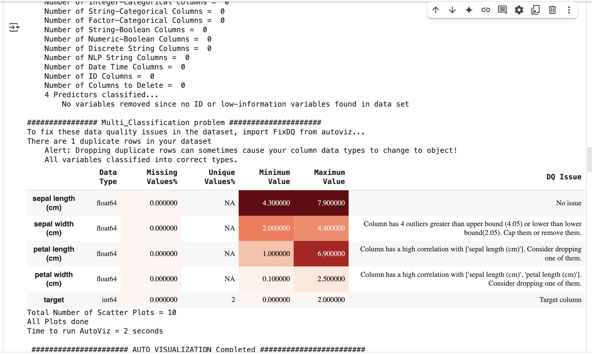

## Exploratory Data Analysis (EDA) tools used in Machine Learning


## 🧰 Popular EDA Tools and Libraries

| Tool / Library          | Description                                                                                | Language  |
| ----------------------- | ------------------------------------------------------------------------------------------ | --------- |
| **Pandas Profiling**    | Auto-generates a detailed EDA report from a pandas DataFrame.                              | Python    |
| **Sweetviz**            | Generates beautiful, high-density visualizations and comparisons between datasets.         | Python    |
| **D-Tale**              | Combines pandas with a Flask web server for visual data exploration in a browser.          | Python    |
| **AutoViz**             | Automatically visualizes any dataset with just one line of code.                           | Python    |
| **EDA (Dataprep)**      | Simple, interactive EDA with summary statistics, correlations, and missing value analysis. | Python    |
| **Lux**                 | Augments pandas DataFrames with visual recommendations.                                    | Python    |
| **Tidyverse (ggplot2)** | A collection of R packages including tools for data wrangling and visualization.           | R         |
| **DataExplorer**        | A powerful EDA package for automated report generation in R.                               | R         |
| **Orange**              | A visual programming tool for EDA and ML without coding.                                   | GUI-based |
| **Tableau / Power BI**  | Business intelligence tools that allow drag-and-drop EDA and visual analytics.             | GUI-based |
| **Qlik Sense**          | Interactive data visualization and EDA in enterprise environments.                         | GUI-based |
| **Kibana**              | For time-series and log-based data exploration in Elasticsearch.                           | Web-based |


## 🔍 Popular Python Libraries Used in Manual EDA

| Library                 | Use Case                                |
| ----------------------- | --------------------------------------- |
| **pandas**              | Data manipulation and descriptive stats |
| **matplotlib**          | Basic plotting                          |
| **seaborn**             | Advanced statistical visualization      |
| **plotly**              | Interactive and dynamic visualizations  |
| **missingno**           | Missing value visualization             |
| **scipy / statsmodels** | Statistical summaries, tests            |


## Pandas Profiling

```
!pip install ydata-profiling
```

```
from ydata_profiling import ProfileReport

import pandas as pd
from sklearn.datasets import load_iris
from ydata_profiling import ProfileReport

# Load the Iris dataset
data = load_iris()
df = pd.DataFrame(data.data, columns=data.feature_names)
df['target'] = data.target

# Generate the profile report
profile = ProfileReport(df, title="Iris Dataset Profile Report", explorative=True)

# Save the report as an HTML file
profile.to_file("iris_profile_report.html")
```

[Click here to view the Iris Profile Report](./iris_profile_report.html)


## autoviz

```
!pip install autoviz
```

```
from autoviz.AutoViz_Class import AutoViz_Class
av = AutoViz_Class()

report = av.AutoViz("", dfte=df, depVar="target")
```




## sweetviz

```
!pip install sweetviz
```

```
!pip install numpy==1.24.4
```

```
import pandas as pd
from sklearn.datasets import load_iris
import sweetviz as sv

# Load the Iris datasetdata
data = load_iris()
df = pd.DataFrame(data.data, columns=data.feature_names)
df['target'] = data.target
```

```
#Generate a report
report = sv.analyze(df)
report.show_html('iris_report.html')
```

[Click here to view the Iris sweetviz Report](./iris_report.html)


```
from sklearn.model_selection import train_test_split

train_df, test_df = train_test_split(df, test_size=0.2, random_state=42)

# Compare two Datasets

compare_report = sv.compare([train_df, "Training Data"], [test_df, "Test Data"])
compare_report.show_html('compare_report.html')
```

[Click here to view the Iris sweetviz Report](./compare_report.html)


```
import seaborn as sns

titanic_df = sns.load_dataset('titanic')

report = sv.analyze(titanic_df, target_feat='survived')
report.show_html('titanic_report.html')
```

[Click here to view the Iris sweetviz titanic Report](./titanic_report.html)


