<h2 style="color:red;">✅ Activation functions in Neural Networks</h2>

<h3 style="color:blue;">📌 What is Activation functions in Neural Networks?</h3>

- While building a neural network, one key decision is selecting the Activation Function for both the **hidden layer** and the **output layer**. 

- It is a mathematical function applied to the **output of a neuron**

- It introduces **non-linearity into the model**, allowing the network to learn and represent complex patterns in the data.

- Without this non-linearity feature a neural network would behave like a linear regression model no matter how many layers it has.

- Activation function decides whether a neuron should be activated by calculating the weighted sum of inputs and adding a bias term.

**1. Weighted Sum of Inputs:**

- In a neural network, each input to a neuron is multiplied by a weight. These weights represent the importance or strength of each input.

**Formula:**

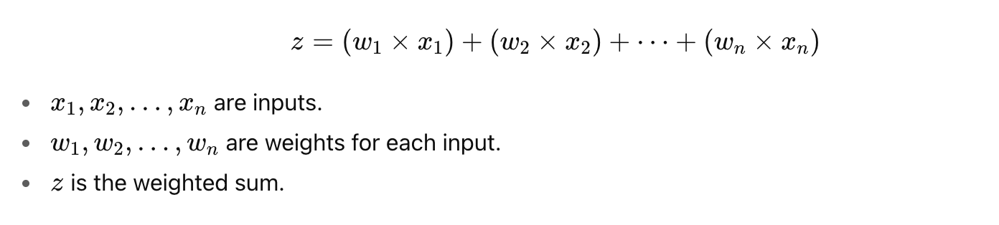


**2. Adding Bias:**

- The bias b is a value added to the weighted sum. It helps the neuron to shift the activation function curve to the left or right, allowing the model to better fit the data.

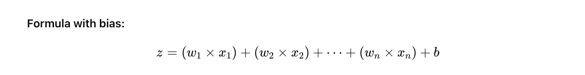

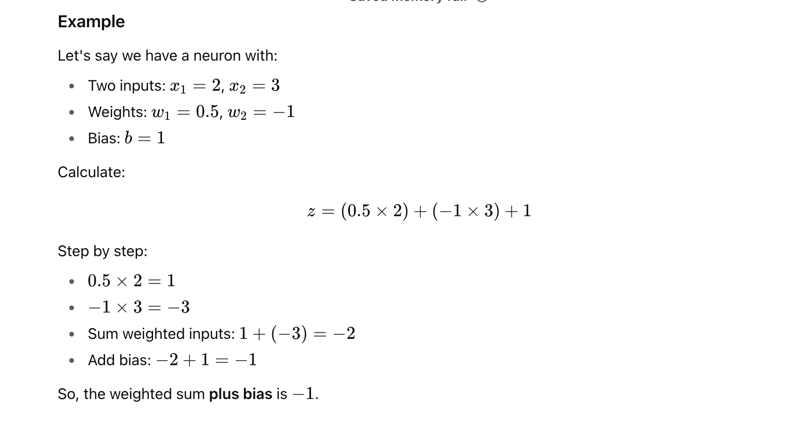

**What happens next?**

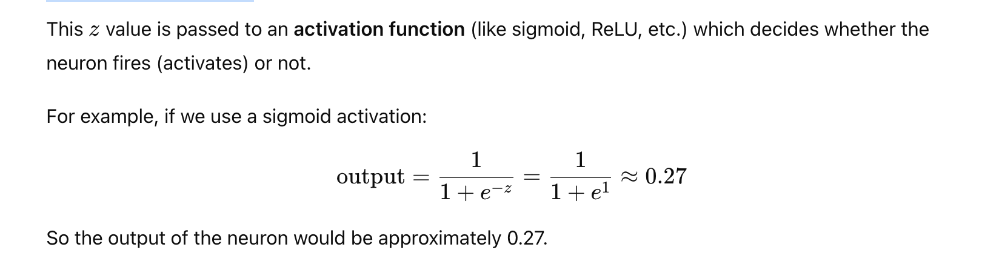

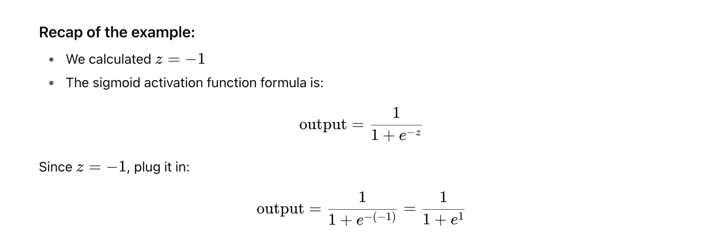

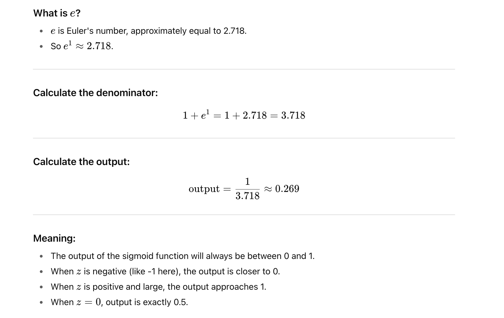

**Intuition behind the sigmoid:**

- It's a smooth curve that squashes any input value into a range between 0 and 1.

- Useful to interpret the output as a probability or "activation level".


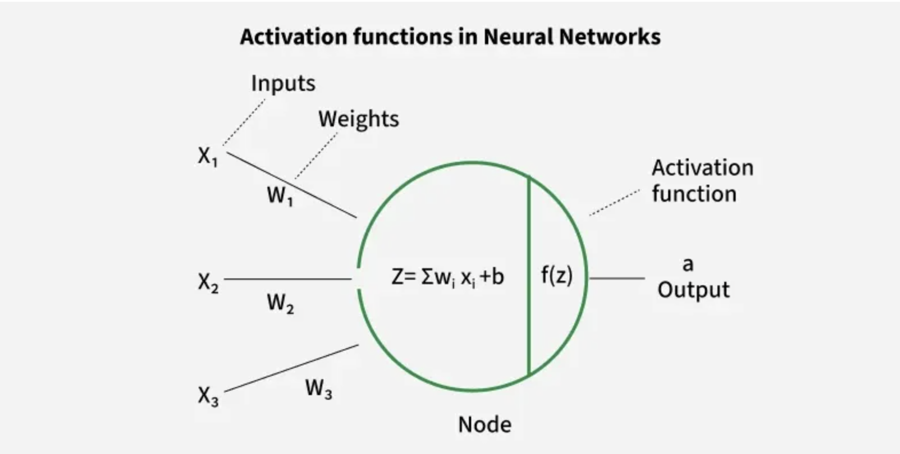


<h3 style="color:blue;">📌 Introducing Non-Linearity in Neural Network?</h3>

Imagine you want to classify apples and bananas based on their shape and color.

- If we use a linear function it can only separate them using a straight line.

- But real-world data is often more complex like overlapping colors, different lighting, etc.

- By adding a non-linear activation function like ReLU, Sigmoid or Tanh the network can create curved decision boundaries to separate them correctly.


**Why is Non-Linearity Important in Neural Networks?**

- Neural networks consist of neurons that operate using weights, biases and activation functions.

- In the learning process these weights and biases are updated based on the error produced at the output—a process known as backpropagation. Activation functions enable backpropagation by providing gradients that are essential for updating the weights and biases.

- Without non-linearity even deep networks would be limited to solving only simple, linearly separable problems. Activation functions help neural networks to model highly complex data distributions and solve advanced deep learning tasks. Adding non-linear activation functions introduce flexibility and enable the network to learn more complex and abstract patterns from data.

**Mathematical Proof of Need of Non-Linearity in Neural Networks**

To illustrate the need for non-linearity in neural networks with a specific example let's consider a network with two input nodes 
(i1 and i2), a single hidden layer containing neurons h1 and h2
​
  and an output neuron (out).

- Non-linearity means that the relationship between input and output is not a straight line. In simple terms the output does not change proportionally with the input.

- A common choice is the ReLU function defined as ```σ(x)=max(0,x)```.

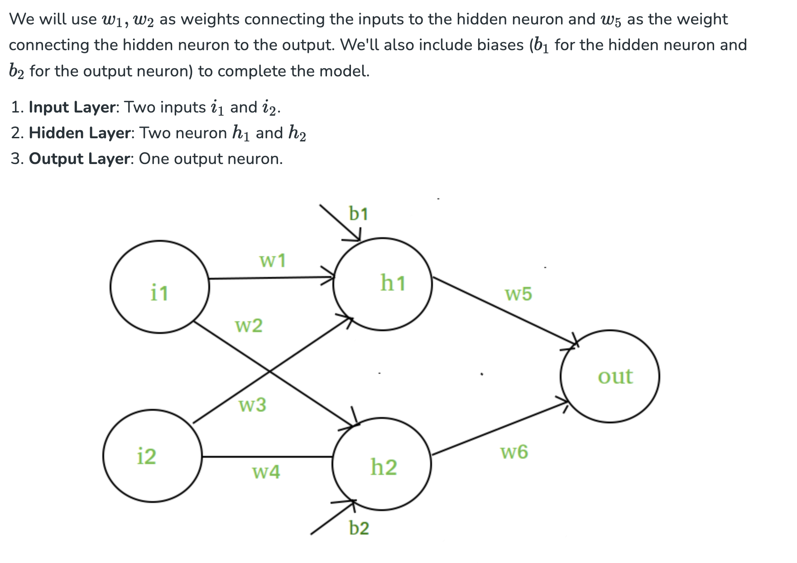


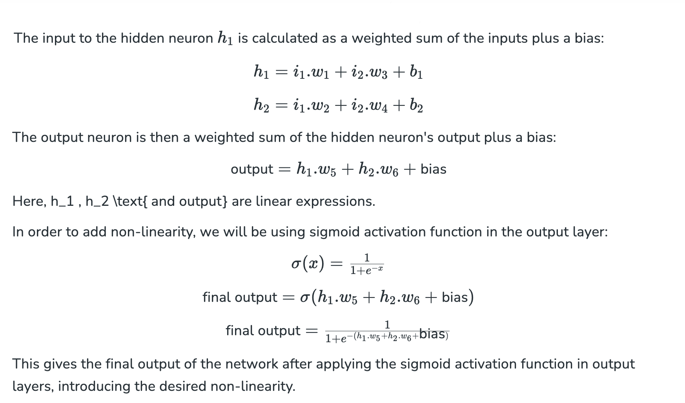

- **σ(x)=max(0,x)** is a mathematical function called the **ReLU function**, which stands for **Rectified Linear Unit**.

**Explanation:**

**σ(x)** here is the function notation.The Greek letter **σ (sigma)** is just a symbol for the function;sometimes people use different symbols, but it just means ```a function of x.```

The function outputs the **maximum value** between 0 and the input x.

**What it means in simple terms:**

- If x is **positive or zero**, then σ(x)=x.

- If x is **negative**, then σ(x)=0.

**Example:**

| x | sigma(x) = max(0, x)|
| --- | ------------------------ |
| -3  | 0                        |
| 0   | 0                        |
| 2   | 2                        |
| 5   | 5                        |


**Where is this used?**

In **neural networks**, ReLU is a popular **activation function** used in neurons to decide whether a neuron should "fire" or not, by transforming the input signal.

**Why use ReLU?**

- It introduces **non-linearity** in the network.

- It is **simple and fast** to compute.

- Helps with the problem of vanishing gradients (compared to sigmoid or tanh).


<h3 style="color:blue;">📌 Common activation functions used in neural networks and how ReLU compares to them.</h3>

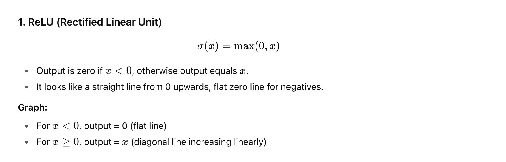

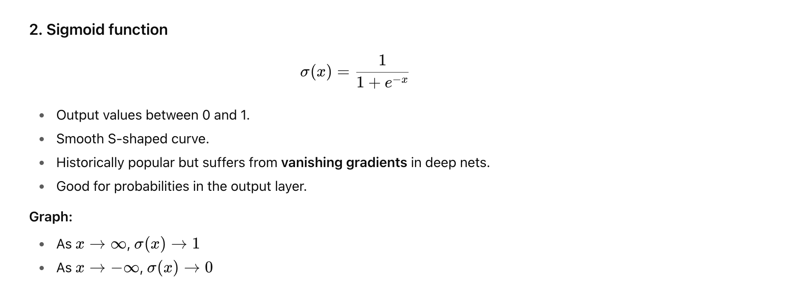

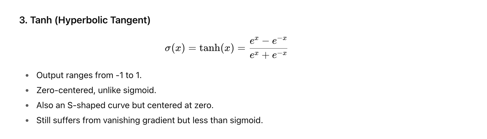


| Activation | Output Range | Shape                           | Pros                                    | Cons                                                        |
| ---------- | ------------ | ------------------------------- | --------------------------------------- | ----------------------------------------------------------- |
| ReLU       | [0, ∞)      | Piecewise linear (zero + line)  | Fast, simple, avoids vanishing gradient | Can "die" (neurons output zero forever) for negative inputs |
| Sigmoid    | (0, 1)       | Smooth S-shape                  | Output interpretable as probability     | Vanishing gradient, slow training                           |
| Tanh       | (-1, 1)      | Smooth S-shape centered at zero | Zero-centered outputs                   | Vanishing gradient, slower                                  |


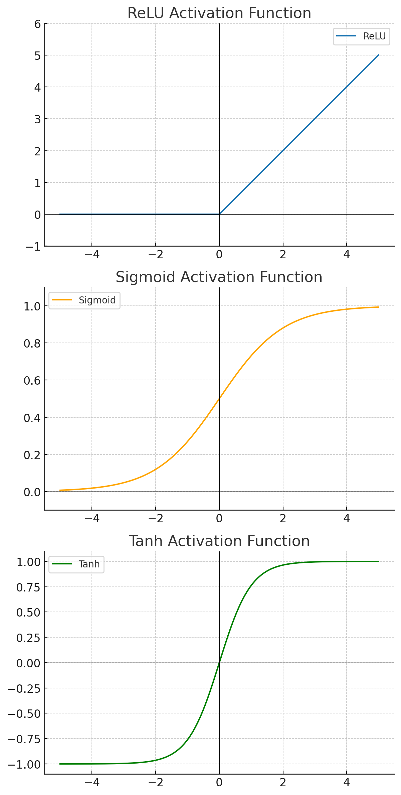


- **ReLU:** Outputs zero for all negative values, then increases linearly for positive values.

- **Sigmoid:** Smooth S-shaped curve between 0 and 1, saturates at both ends.

- **Tanh:** Smooth S-shaped curve between -1 and 1, zero-centered.

You can see how ReLU sharply cuts off negative values and grows linearly, which helps neural networks learn efficiently.


