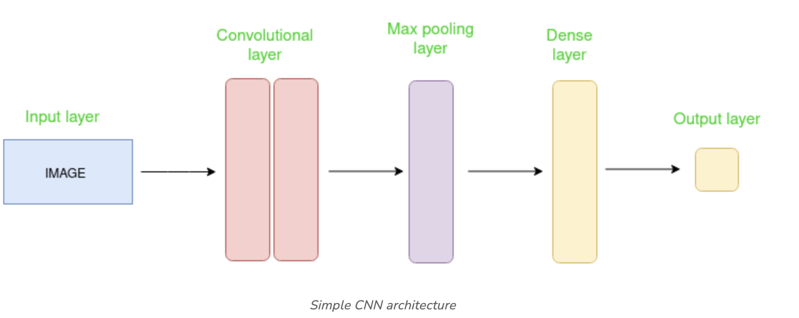
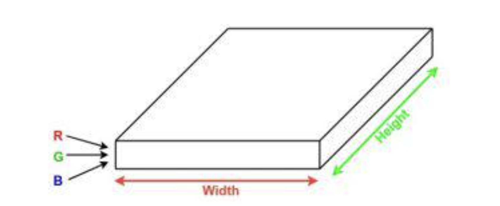
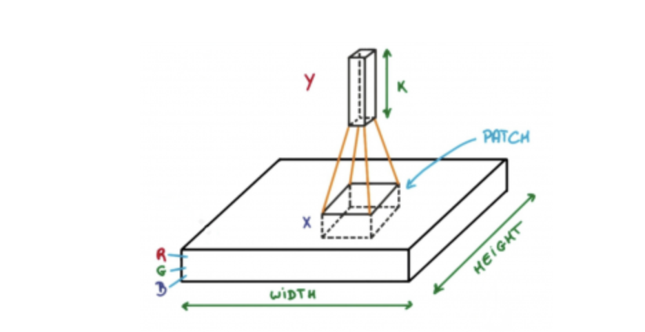

<h2 style="color:red;">✅ Convolutional Neural Network (CNN)</h2>

<h3 style="color:blue;">📌 What is Convolutional Neural Network (CNN)?</h3>

Convolutional Neural Network (CNN) is an advanced version of artificial neural networks (ANNs), primarily designed to extract features from grid-like matrix datasets. This is particularly useful for visual datasets such as images or videos, where data patterns play a crucial role. CNNs are widely used in **computer vision** applications due to their effectiveness in processing visual data.

CNNs consist of multiple layers like the **input layer**, **Convolutional layer**, **pooling layer**, and **fully connected layers**.

<h3 style="color:blue;">📌 How Convolutional Layers Works?</h3>

Convolution Neural Networks are neural networks that share their parameters.

Imagine you have an image. It can be represented as a cuboid having its length, width (dimension of the image), and height (i.e the channel as images generally have red, green, and blue channels). 

Now imagine taking a small patch of this image and running a small neural network, called a filter or kernel on it, with say, K outputs and representing them vertically.

Now slide that neural network across the whole image, as a result, we will get another image with different widths, heights, and depths. Instead of just R, G, and B channels now we have more channels but lesser width and height. This operation is called Convolution. If the patch size is the same as that of the image it will be a regular neural network. Because of this small patch, we have fewer weights. 

<h3 style="color:blue;">📌 Mathematical Overview of Convolution</h3>

- Convolution layers consist of a set of learnable filters (or kernels) having small widths and heights and the same depth as that of input volume (3 if the input layer is image input).

- For example, if we have to run convolution on an image with dimensions 34x34x3. The possible size of filters can be axax3, where ‘a’ can be anything like 3, 5, or 7 but smaller as compared to the image dimension.

- During the forward pass, we slide each filter across the whole input volume step by step where each step is called stride (which can have a value of 2, 3, or even 4 for high-dimensional images)

and compute the dot product between the kernel weights and patch from input volume.

As we slide our filters we’ll get a 2-D output for each filter and we’ll stack them together as a result, we’ll get output volume having a depth equal to the number of filters. The network will learn all the filters.

x