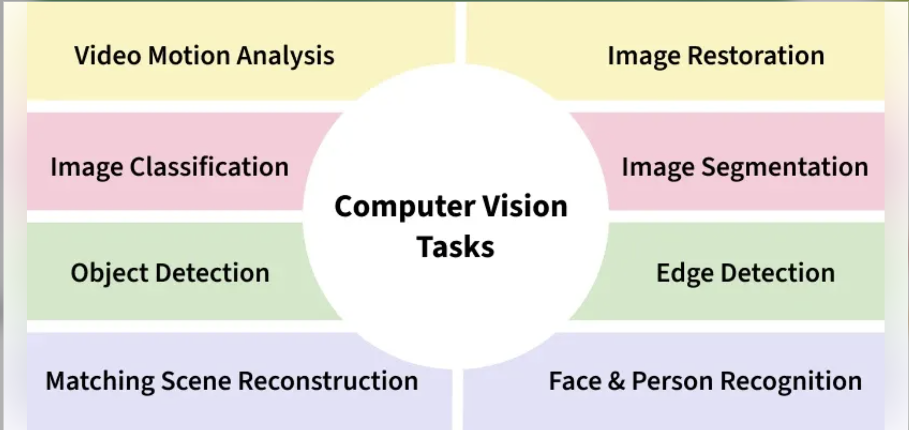

<h2 style="color:red;">✅ Computer Vision</h2>

<h3 style="color:blue;">📌 What is Computer Vision?</h3>

Computer Vision (CV) in artificial intelligence (AI) help machines to interpret and understand visual information similar to how humans use their eyes and brains. It involves teaching computers to analyze and understand images and videos, helping them "see" the world. From identifying objects in images to recognizing faces in a crowd, it is revolutionizing industries such as healthcare, automotive, security and entertainment.

<h3 style="color:blue;">📌 Key Concepts of Computer Vision</h3>

1. **Image Processing:** This involves improving or changing an image to make it clearer or easier to analyze. It includes cleaning up images by removing noise, improving contrast or adjusting the lighting.

2. **Object Detection:** This allows the machine to find and identify specific objects within an image or video. For example, it can detect faces in a photo or find cars in a traffic scene.

3. **Image Classification:** It involves categorizing an image into a specific class or label such as identifying whether a given image is of a dog or a cat.

4. **Feature Extraction:** It is the process of identifying unique patterns or features in an image that can be used for further analysis like shapes, colors or textures.

<h3 style="color:blue;">📌 How Does Computer Vision Work?</h3>

- **Image Acquisition:** It involves collecting images or videos using cameras, sensors or other devices. The quality of the image and its type (black-and-white, color or 3D) affects how the system will process the data.

- **Preprocessing:** Raw images are often not perfect, so they are cleaned up first. This might include adjusting the brightness, sharpening the image or removing unwanted noise to help the system see better.

- **Feature Detection:** In this, the system looks for key elements in the image like edges, patterns or shapes. This helps the system focus on the important parts of the image.

- **Pattern Recognition:** This compares what it detects in the image to known patterns or examples. Using machine learning, the system can recognize objects, classify images or even understand relationships in the image.

- **Decision Making:** After recognizing patterns, the system uses this information to make decisions such as identifying a dog in the image or recognizing a stop sign in a video.

<h3 style="color:blue;">📌 Tasks of Computer Vision</h3>

1. **Object Recognition:** This is used for identifying objects in an image such as recognizing a car, dog or tree. It’s used in surveillance, self-driving cars and checking products in factories.

2. **Face Recognition:** This involves identifying people based on their facial features. It is used in security systems, unlocking smartphones and identifying people in photos or videos.

3. **Image Segmentation:** Segmentation breaks an image into smaller parts for easier analysis. For example, in medical imaging, different organs may be segmented to focus on specific areas.

4. **Optical Character Recognition (OCR):** OCR helps in recognizing text in images such as scanning documents or extracting text from pictures of signs. It’s used in document scanners, translation apps and more.

<h3 style="color:blue;">📌 Key Techniques in Computer Vision</h3>

1. **Convolutional Neural Networks (CNNs):** CNNs are a type of deep learning model that has changed the field of CV. These networks can automatically learn and recognize patterns in images. They are excellent for tasks like object detection, image classification and segmentation.

2. **Feature Matching:** This technique matches key points between images. It’s used in applications like creating panoramas where multiple images are stitched together to form one large image.

3. **Optical Flow:** It helps track movement in videos by analyzing how pixels change from one frame to the next. It’s used in things like tracking moving objects or detecting motion in surveillance videos.

4. **Generative Adversarial Networks (GANs):** GANs are used in advanced CV tasks such as generating realistic images or improving low-quality images. They work by having two components challenging each other to improve their results.

<h3 style="color:blue;">📌 Popular Libraries for Computer Vision</h3>

1. **OpenCV:** Mostly used open-source library for computer vision tasks like image processing, video capture and real-time applications.

2. **TensorFlow:** A popular deep learning framework that includes tools for building and training computer vision models.

3. **PyTorch:** Another deep learning library that provides great flexibility for computer vision tasks for research and development.

<h3 style="color:blue;">📌 Object Detection</h3>

It involves identifying and locating objects within an image by drawing bounding boxes around them.

It includes below following Techniques:

1. **Yolo** (You Only Look Once).