<h2 style="color:red;">✅ LSTM - Long Short Term Memory</h2>

<h3 style="color:blue;">📌 What is LSTM - Long Short Term Memory?</h3>

Long Short-Term Memory (LSTM) is an enhanced version of the Recurrent Neural Network (RNN)
designed by Hochreiter and Schmidhuber. LSTMs can capture long-term dependencies in sequential data making them ideal for tasks like language translation, speech recognition and time series forecasting.

Unlike traditional RNNs which use a single hidden state passed through time LSTMs introduce a memory cell that holds information over extended periods addressing the challenge of learning long-term dependencies.

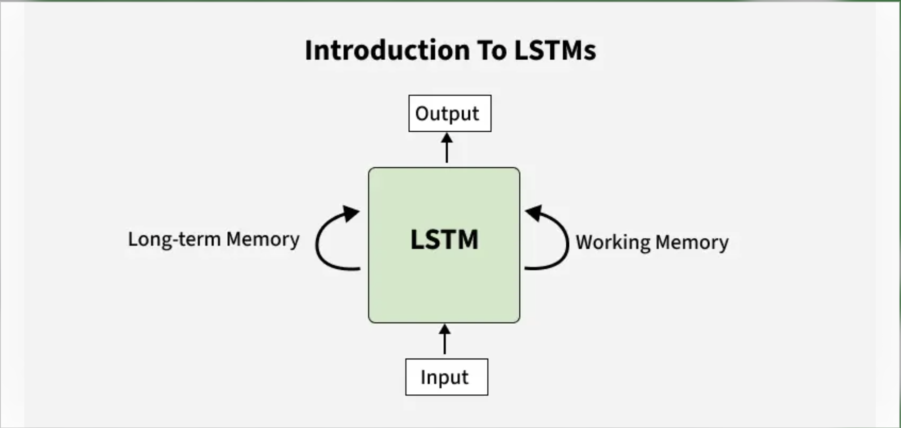


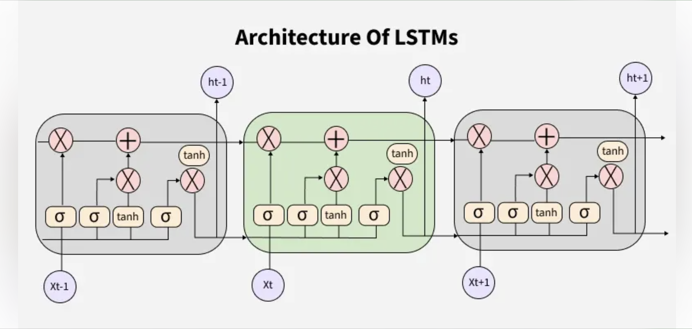


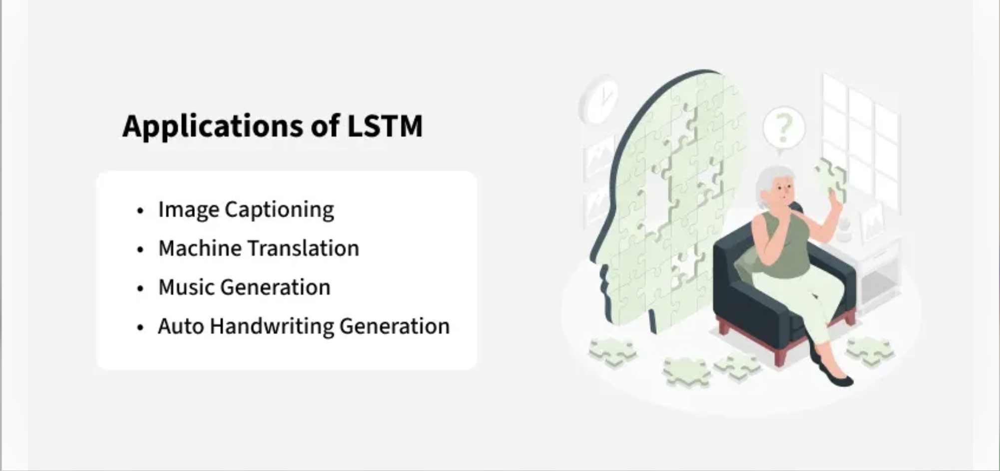


**Problem with Long-Term Dependencies in RNN**

Recurrent Neural Networks (RNNs) are designed to handle sequential data by maintaining a hidden state that captures information from previous time steps.


<h3 style="color:blue;">📌 Understanding LSTM Networks</h3>

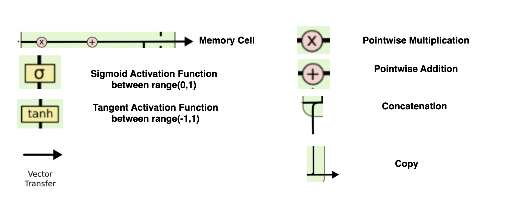

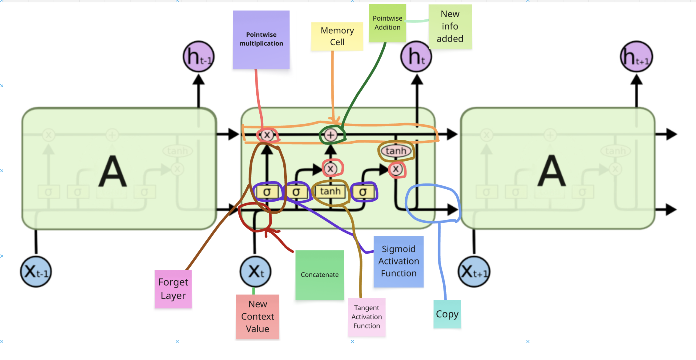


Long Short Term Memory networks – usually just called “LSTMs” – are a special kind of RNN,capable of learning long-term dependencies.

LSTMs are explicitly designed to avoid the long-term dependency problem. Remembering information for long periods of time is practically their default behavior, not something they struggle to learn!

All recurrent neural networks have the form of a chain of repeating modules of neural network. In standard RNNs, this repeating module will have a very simple structure, such as a single tanh layer.


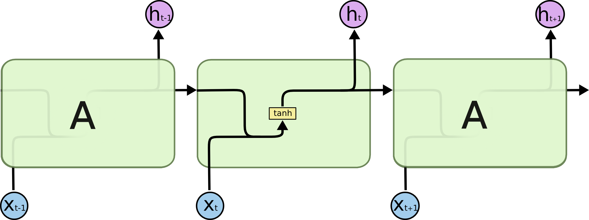

The repeating module in a standard RNN contains a single layer.

LSTMs also have this chain like structure, but the repeating module has a different structure. Instead of having a single neural network layer, there are four, interacting in a very special way.

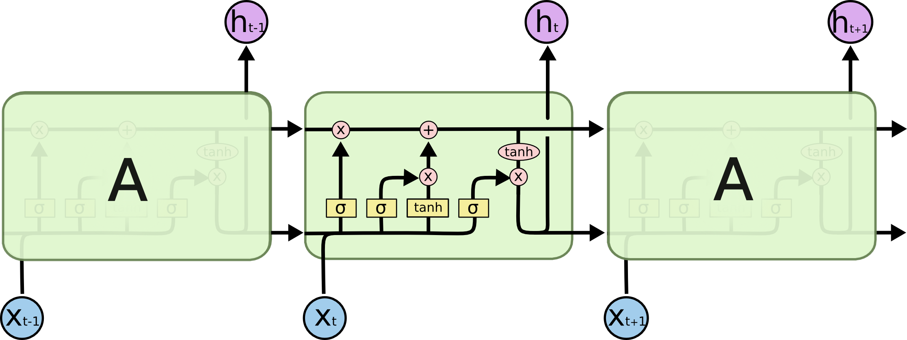

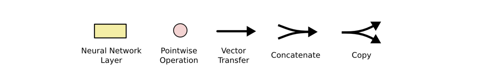

## The Core Idea Behind LSTMs

The key to LSTMs is the cell state, the horizontal line running through the top of the diagram.
The cell state is kind of like a conveyor belt. It runs straight down the entire chain, with only some minor linear interactions. It’s very easy for information to just flow along it unchanged.

## Memory Cell

1. **You can Add information**

2. **You can Remove Information**

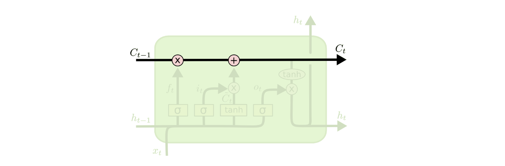


The LSTM does have the ability to remove or add information to the cell state, carefully regulated by structures called gates.

Gates are a way to optionally let information through. They are composed out of a sigmoid neural net layer and a pointwise multiplication operation.

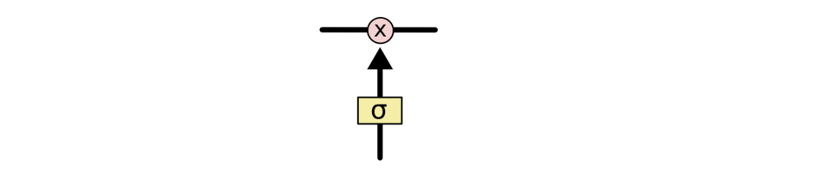


The sigmoid layer outputs numbers between zero and one, describing how much of each component should be let through. A value of zero means “let nothing through,” while a value of one means “let everything through!”

An LSTM has three of these gates, to protect and control the cell state.

**Step-by-Step LSTM Walk Through**

The first step in our LSTM is to decide what information we’re going to throw away from the cell state. This decision is made by a sigmoid layer called the “forget gate layer.” It looks at ht−1  and xt, and outputs a number between 0  and 1 for each number in the cell state Ct−1.

A 1 represents “completely keep this” while a 0 represents “completely get rid of this.”

Let’s go back to our example of a language model trying to predict the next word based on all the previous ones. In such a problem, the cell state might include the gender of the present subject, so that the correct pronouns can be used. When we see a new subject, we want to forget the gender of the old subject.


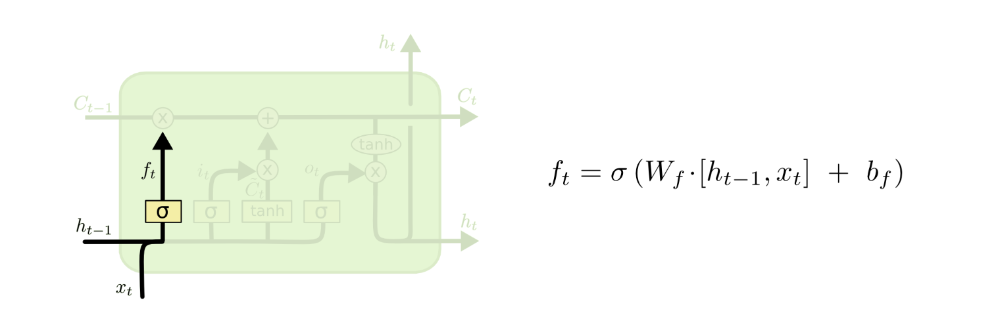

The next step is to decide what new information we’re going to store in the cell state. This has two parts. First, a sigmoid layer called the “input gate layer” decides which values we’ll update. Next, a tanh layer creates a vector of new candidate values, C̃ t
, that could be added to the state. In the next step, we’ll combine these two to create an update to the state.

In the example of our language model, we’d want to add the gender of the new subject to the cell state, to replace the old one we’re forgetting.

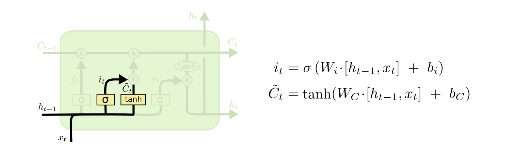

It’s now time to update the old cell state, Ct−1 , into the new cell state Ct . The previous steps already decided what to do, we just need to actually do it.

We multiply the old state by ft , forgetting the things we decided to forget earlier. Then we add it∗C̃ t. This is the new candidate values, scaled by how much we decided to update each state value.

In the case of the language model, this is where we’d actually drop the information about the old subject’s gender and add the new information, as we decided in the previous steps.

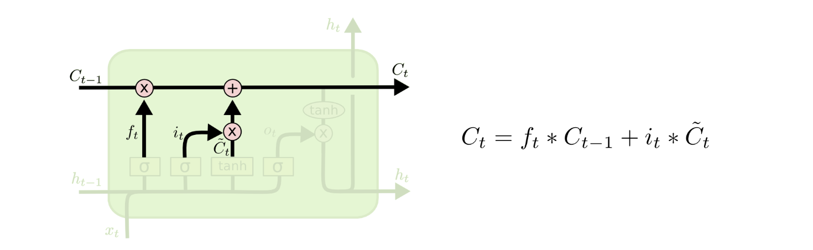


Finally, we need to decide what we’re going to output. This output will be based on our cell state, but will be a filtered version. First, we run a sigmoid layer which decides what parts of the cell state we’re going to output. Then, we put the cell state through tanh
 (to push the values to be between −1
 and 1
) and multiply it by the output of the sigmoid gate, so that we only output the parts we decided to.

For the language model example, since it just saw a subject, it might want to output information relevant to a verb, in case that’s what is coming next. For example, it might output whether the subject is singular or plural, so that we know what form a verb should be conjugated into if that’s what follows next.


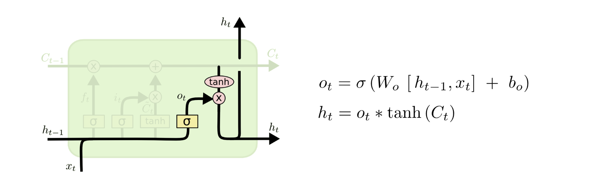


## Variants on Long Short Term Memory

What I’ve described so far is a pretty normal LSTM. But not all LSTMs are the same as the above. In fact, it seems like almost every paper involving LSTMs uses a slightly different version. The differences are minor, but it’s worth mentioning some of them.

One popular LSTM variant, introduced by Gers & Schmidhuber (2000), is adding “peephole connections.” This means that we let the gate layers look at the cell state.

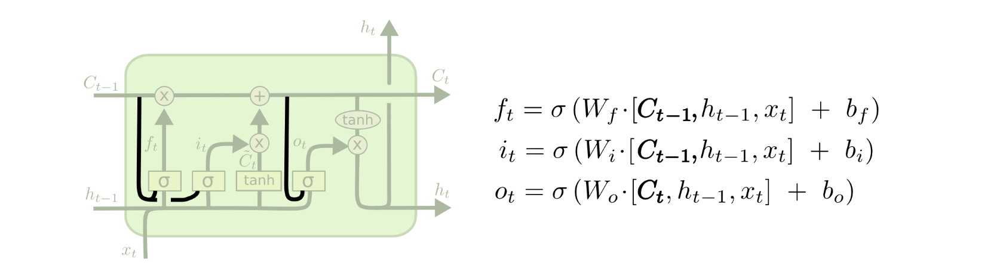


The above diagram adds peepholes to all the gates, but many papers will give some peepholes and not others.

Another variation is to use coupled forget and input gates. Instead of separately deciding what to forget and what we should add new information to, we make those decisions together. We only forget when we’re going to input something in its place. We only input new values to the state when we forget something older.


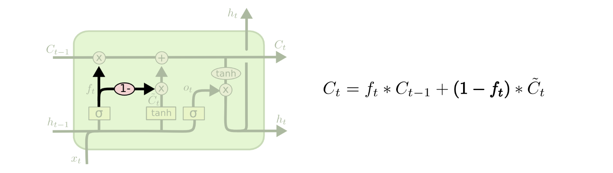

A slightly more dramatic variation on the LSTM is the Gated Recurrent Unit, or GRU, introduced by Cho, et al. (2014). It combines the forget and input gates into a single “update gate.” It also merges the cell state and hidden state, and makes some other changes. The resulting model is simpler than standard LSTM models, and has been growing increasingly popular.


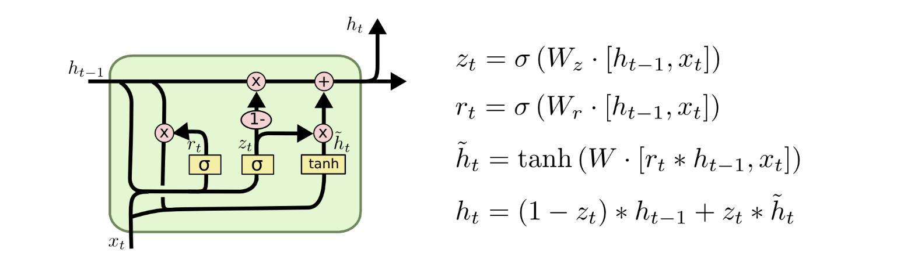

These are only a few of the most notable LSTM variants. There are lots of others, like Depth Gated RNNs by Yao, et al. (2015). There’s also some completely different approach to tackling long-term dependencies, like Clockwork RNNs by Koutnik, et al. (2014).

Which of these variants is best? Do the differences matter? Greff, et al. (2015) do a nice comparison of popular variants, finding that they’re all about the same. Jozefowicz, et al. (2015) tested more than ten thousand RNN architectures, finding some that worked better than LSTMs on certain tasks.


## Conclusion

Earlier, I mentioned the remarkable results people are achieving with RNNs. Essentially all of these are achieved using LSTMs. They really work a lot better for most tasks!

Written down as a set of equations, LSTMs look pretty intimidating. Hopefully, walking through them step by step in this essay has made them a bit more approachable.

LSTMs were a big step in what we can accomplish with RNNs. It’s natural to wonder: is there another big step? A common opinion among researchers is: “Yes! There is a next step and it’s attention!” The idea is to let every step of an RNN pick information to look at from some larger collection of information. For example, if you are using an RNN to create a caption describing an image, it might pick a part of the image to look at for every word it outputs. In fact, Xu, et al. (2015) do exactly this – it might be a fun starting point if you want to explore attention! There’s been a number of really exciting results using attention, and it seems like a lot more are around the corner…

Attention isn’t the only exciting thread in RNN research. For example, Grid LSTMs by Kalchbrenner, et al. (2015) seem extremely promising. Work using RNNs in generative models – such as Gregor, et al. (2015), Chung, et al. (2015), or Bayer & Osendorfer (2015) – also seems very interesting. The last few years have been an exciting time for recurrent neural networks, and the coming ones promise to only be more so!


# Extra Understanding
Long Short terl Memory

1. **Memory Cell**

2. **Forget Cell**

4. **Input Cell**


## Relu
Can actually cause dead neurons duraing back propagation.


- ```My name is Ganesh and I want to eat Pizza```

When I am trying to use the **RNN**, what RNN will do?

```Each and every word it will try to convert in to vectors to make sure it consider that each and every word is important.```

Suppose if something we have missed, suppose let say Pizza dependent on some word like it. This case you know that "eat" is just before the "Pizza" so it is being able to capture the context by with the help of RNN and also it will be able to capture the context. But over here you can see another word "I" I is definitly related to "Ganesh" I is basically giving the context of "Ganesh". This is only one word distance. But think about "I" and "My" can also be related. There should be some kind of context and Important context. Here you can see the distance is quite long.


What memory do? (Sometime you need to remember something, sometimes you need to forget something )


# LSTM Context Switching Example

## Example

1. **Ganesh likes AIML** → This is one context.  
2. **Ram likes DevSecOps** → This is another context.  

From **context 1** to **context 2**, a switch happens because the topic (or subject) changes — we are now talking about a different person.

Let’s say in the previous step (cell), we passed the information:

> **"Ganesh likes AIML"**

In the next step, the context changes.  
When this happens, if we want our neural network to predict future words, it should only be based on the **new context**.  
It should **not** remember the previous context at this moment.

So, the **old context** (`Ganesh likes AIML`) will be **forgotten**, and the **new context** will be added.

---

## Forget Gate Behavior

Most of the information in such a context-switching scenario will be close to **[0]** because the forget gate will filter it out.

- The forget gate uses a **sigmoid** activation function that outputs values between **[0, 1]**.
- If the previous information is **similar** to the new context → values will be close to **1** (retain it).
- If it is **different** → values will be close to **0** (forget it).

When values are near **0**, the memory cell is instructed to **forget** the old information.  
This is done through **pointwise multiplication** in the forward pass.

---

## Adding New Information

We now want to store the **new word** `"friend"` in the memory cell.

1. **Sigmoid gate** decides **how much** of the new information should be stored (values in `[0, 1]`).
2. The same input passes through a **tanh** activation function, producing values in the range `[-1, 1]`.
3. Outputs from **sigmoid** and **tanh** are **combined element-wise**.
4. The result is **added to the memory cell**, updating it with only the important parts of the new context.

---

## Summary

- **Pointwise operation** ensures that **only important new information** passes through and merges with the memory cell.
- **Old, irrelevant context** is discarded when the forget gate outputs values close to `0`.


## Referance Link:

[Understanding LSTM Networks](https://colah.github.io/posts/2015-08-Understanding-LSTMs/)


<h2 style="color:red;">✅ Bidirectional LSTM</h2>

# Bidirectional LSTM (BiLSTM) Explanation

## 1. What is a Bidirectional LSTM?

A **Bidirectional LSTM (BiLSTM)** is an extension of the traditional LSTM (Long Short-Term Memory) network.  
Instead of processing the sequence in **only one direction** (forward in time), BiLSTM processes the sequence in **both directions**:

- **Forward LSTM** → Reads the sequence from start to end.
- **Backward LSTM** → Reads the sequence from end to start.

The outputs from both directions are then **combined** (either concatenated, summed, or averaged) to make the final prediction.

---

## 2. Why use Bidirectional LSTM?

Some tasks require understanding **both past and future context** in a sequence.

- Standard LSTM: Has access only to **past information**.
- BiLSTM: Has access to **both past and future information** at each time step.

This is especially useful in:
- Natural Language Processing (NLP)
- Speech Recognition
- Handwriting Recognition
- Named Entity Recognition (NER)
- Sentiment Analysis

---

## 3. Real-Life Example

### Problem:
We want to predict the **sentiment** (Positive/Negative) of a sentence.

Sentence:  
> `"The movie was not bad"`

### Why BiLSTM helps:
- If we read **only forward**, we might think "The movie was not..." is **negative**.
- But when reading **backward** as well, we see the word **"bad"** preceded by **"not"**, which changes the meaning to **positive**.
- A BiLSTM can use both forward and backward context to correctly understand that the sentiment is **Positive**.

---

## 4. How it works step-by-step:

1. **Input sentence** is tokenized into a sequence of words:

["The", "movie", "was", "not", "bad"]


2. **Forward LSTM** processes:

The → movie → was → not → bad


4. At each word position, **both forward and backward hidden states** are concatenated:


Hidden_state_t = [Forward_hidden_t ; Backward_hidden_t]


5. Final combined representation is passed to a classifier (e.g., Softmax for sentiment prediction).

---

## 5. Diagram

Input: The movie was not bad
Forward → h1 → h2 → h3 → h4 → h5
Backward ← h1'← h2'← h3'← h4'← h5'
| | | | |
Output: [h1;h1'] [h2;h2'] ... [h5;h5']


---

## 6. Advantages

- Uses **full context** of the sequence (past + future).
- Improves performance in many NLP tasks where meaning depends on both sides of the word.

---

## 7. Limitations

- **Cannot be used for real-time predictions** where future data is not yet available.
- **More computational cost** compared to a single LSTM.

---

## 8. Summary Table

| Feature              | LSTM           | BiLSTM                |
|----------------------|----------------|-----------------------|
| Direction            | Forward only   | Forward + Backward    |
| Context              | Past only      | Past + Future         |
| Computation Time     | Lower          | Higher                |
| Use in Real-time     | Yes            | No                    |
| Accuracy in NLP      | Good           | Often Better          |


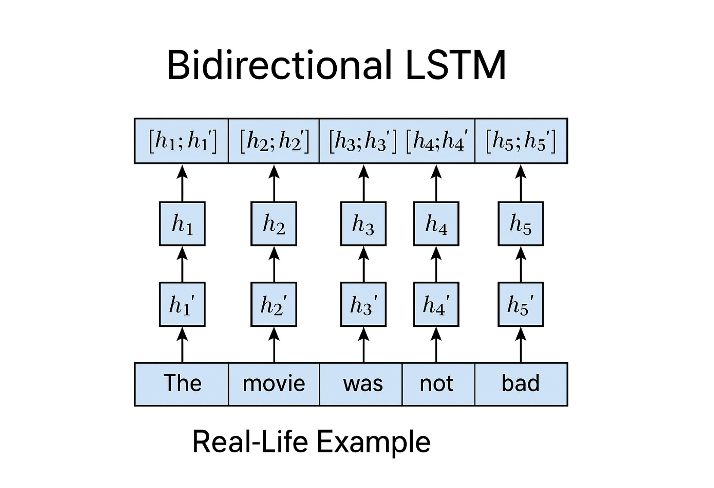

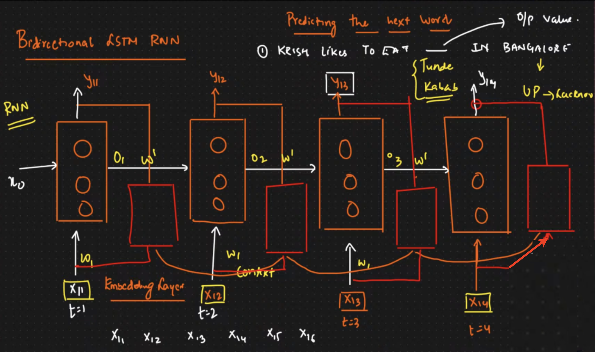


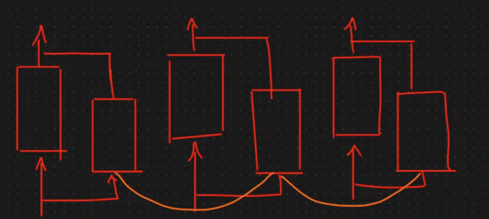

