<h2 style="color:red;">✅ Recurrent Neural Networks(RNN)</h2>


<h3 style="color:blue;">📌 What is Recurrent Neural Networks(RNN)?</h3>

**Recurrent Neural Networks (RNNs)** differ from regular neural networks in how they process information. While standard neural networks pass information in one direction i.e from input to output, RNNs feed information back into the network at each step.


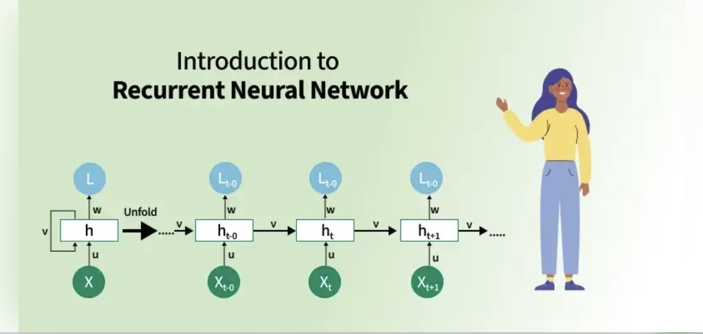


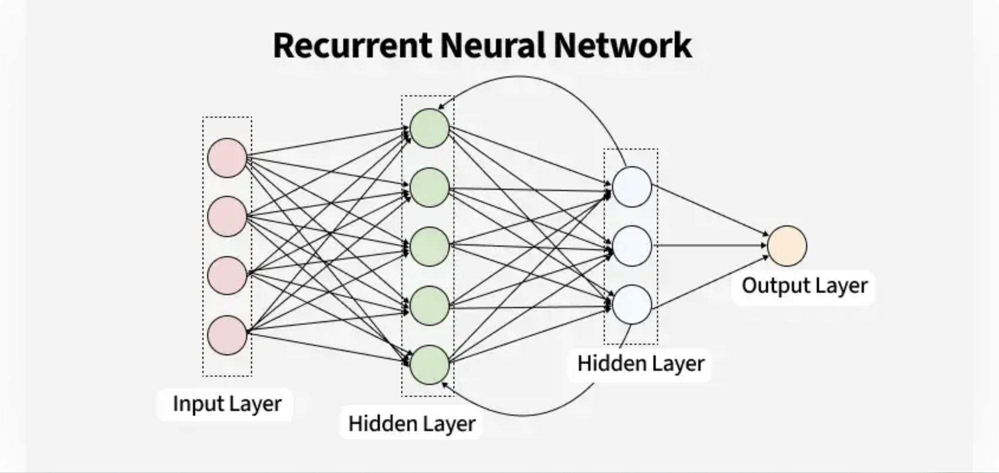


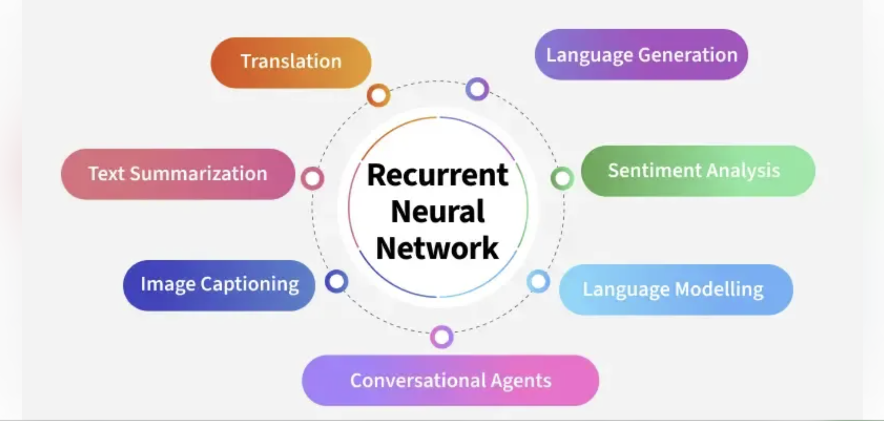


- Imagine reading a sentence and you try to predict the next word, you don’t rely only on the current word but also remember the words that came before.

- RNNs work similarly by “remembering” past information and passing the output from one step as input to the next i.e it considers all the earlier words to choose the most likely next word. This memory of previous steps helps the network understand context and make better predictions.


<h3 style="color:blue;">📌Key Components of RNNs</h3>

There are mainly two components of RNNs


**1. Recurrent Neurons**

The fundamental processing unit in RNN is a Recurrent Unit. They hold a hidden state that maintains information about previous inputs in a sequence. Recurrent units can "remember" information from prior steps by feeding back their hidden state, allowing them to capture dependencies across time.


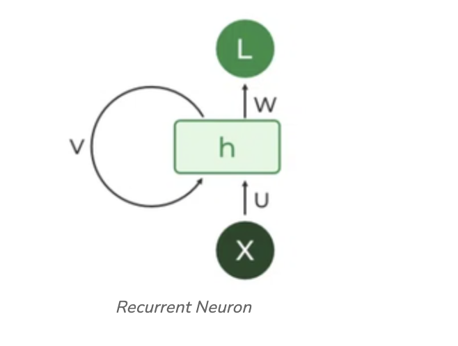


**2. RNN Unfolding**

RNN unfolding or unrolling is the process of expanding the recurrent structure over time steps. During unfolding each step of the sequence is represented as a separate layer in a series illustrating how information flows across each time step.


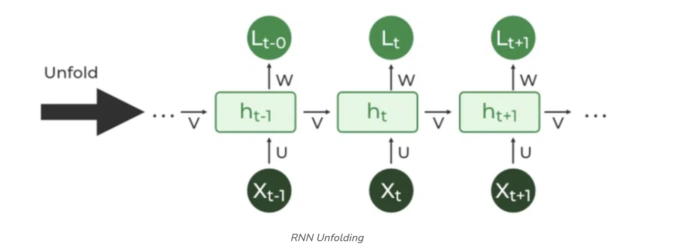


<h3 style="color:blue;">📌Recurrent Neural Network Architecture</h3>

RNNs share similarities in input and output structures with other deep learning architectures but differ significantly in how information flows from input to output. Unlike traditional deep neural networks where each dense layer has distinct weight matrices. RNNs use shared weights across time steps, allowing them to remember information over sequences.

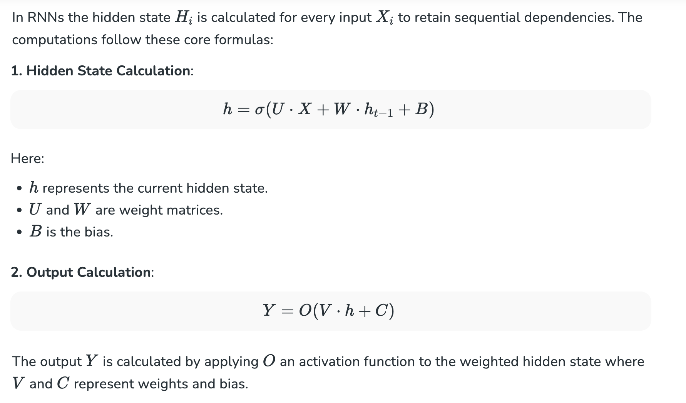


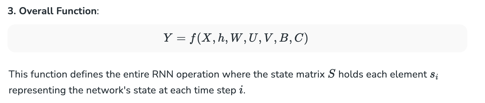

In deep learning, especially when discussing Recurrent Neural Networks (RNNs), the expression

Y=f(X,h,W,U,V,B,C)

is essentially describing the **forward pass equation**, where Y is the **output** and f is a function of the **inputs, hidden state, and parameters**.

**The Parameters and Variables**

| Symbol | Meaning                                                        |
| ------ | -------------------------------------------------------------- |
| **X**  | Input at the current time step *t*                             |
| **h**  | Hidden state from the previous time step *(t−1)*               |
| **W**  | Weight matrix for **input-to-hidden** connections              |
| **U**  | Weight matrix for **hidden-to-hidden (recurrent)** connections |
| **V**  | Weight matrix for **hidden-to-output** connections             |
| **B**  | Bias vector for **hidden layer**                               |
| **C**  | Bias vector for **output layer**                               |


This function defines the entire RNN operation where the state matrix S holds each element si representing the network's state at each time step i.

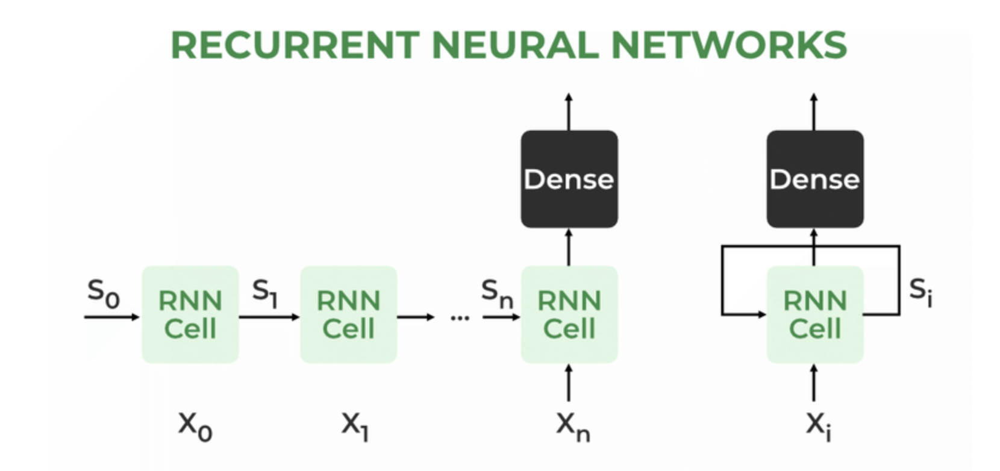

**How does RNN work?**

At each time step RNNs process units with a fixed activation function. These units have an internal hidden state that acts as memory that retains information from previous time steps. This memory allows the network to store past knowledge and adapt based on new inputs.

**Updating the Hidden State in RNNs**

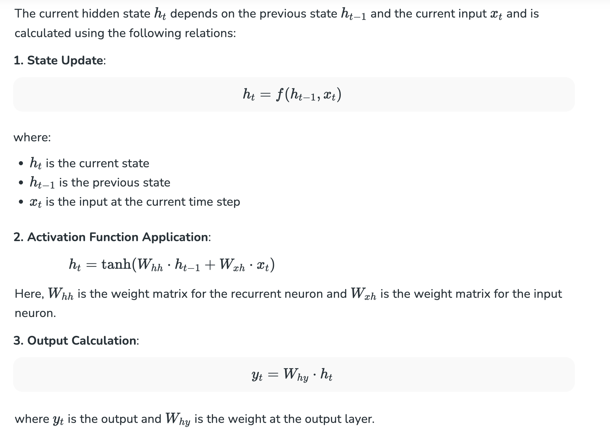

**Meaning of terms**

| Symbol   | Meaning                                                                      |
| -------- | ---------------------------------------------------------------------------- |
| **hₜ**   | Hidden state at time step *t*                                                |
| **hₜ₋₁** | Hidden state from the previous time step *(t−1)*                             |
| **xₜ**   | Input vector at time step *t*                                                |
| **Wₕₕ**  | Weight matrix for **hidden-to-hidden (recurrent)** connection                |
| **Wₓₕ**  | Weight matrix for **input-to-hidden** connection                             |
| **tanh** | Non-linear activation function that squashes output to the range **(−1, 1)** |


<h3 style="color:blue;">📌Backpropagation Through Time (BPTT) in RNNs</h3>

Since RNNs process sequential data Backpropagation Through Time (BPTT) is used to update the network's parameters. The loss function L(θ) depends on the final hidden state h3 and each hidden state relies on preceding ones forming a sequential dependency chain:

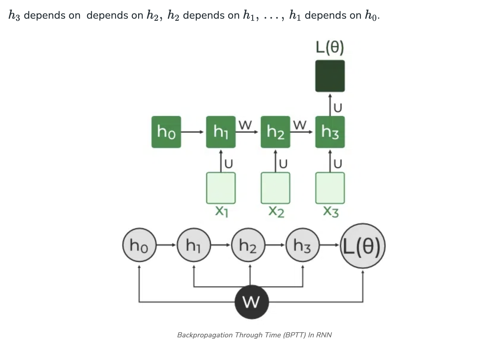

In BPTT, gradients are backpropagated through each time step. This is essential for updating network parameters based on temporal dependencies.

1. **Simplified Gradient Calculation:**

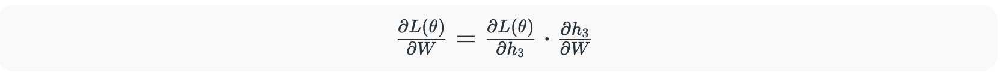

It’s basically **the chain rule** from calculus applied to neural network training.

**What each term means**

| Symbol          | Meaning                                                                                   |
| --------------- | ----------------------------------------------------------------------------------------- |
| **L(θ)**        | Loss function, depends on all model parameters **θ** (including weight matrices like *W*) |
| **W**           | Weight matrix (can be **Wₓₕ**, **Wₕₕ**, etc.)                                             |
| **h₃**          | Hidden state at time step **t = 3**                                                       |
| **∂L(θ) / ∂h₃** | How much the loss changes if **h₃** changes (error signal at time step 3)                 |
| **∂h₃ / ∂W**    | How much **h₃** changes if **W** changes (sensitivity of hidden state to weights)         |


**2. Handling Dependencies in Layers:** Each hidden state is updated based on its dependencies:


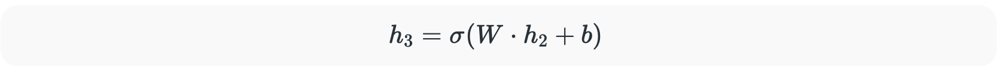

| Symbol | Meaning                                             |
| ------ | --------------------------------------------------- |
| **h₃** | Hidden state at time step **3**                     |
| **W**  | Weight matrix (could be recurrent **Wₕₕ**)          |
| **h₂** | Hidden state at time step **2**                     |
| **b**  | Bias vector                                         |
| **σ**  | Activation function (e.g., **tanh**, ReLU, sigmoid) |


The gradient is then calculated for each state, considering dependencies from previous hidden states.


**3. Gradient Calculation with Explicit and Implicit Parts:** The gradient is broken down into explicit and implicit parts summing up the indirect paths from each hidden state to the weights.

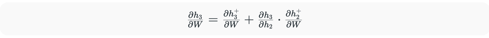


**4. Final Gradient Expression:** The final derivative of the loss function with respect to the weight matrix W is computed:

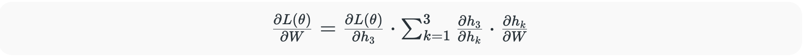


This iterative process is the essence of backpropagation through time.


<h3 style="color:blue;">📌Types Of Recurrent Neural Networks*</h3>

There are four types of RNNs based on the number of inputs and outputs in the network:


<h3 style="color:blue;">📌1. One-to-One RNN*</h3>

This is the simplest type of neural network architecture where there is a single input and a single output. It is used for straightforward classification tasks such as binary classification where no sequential data is involved.

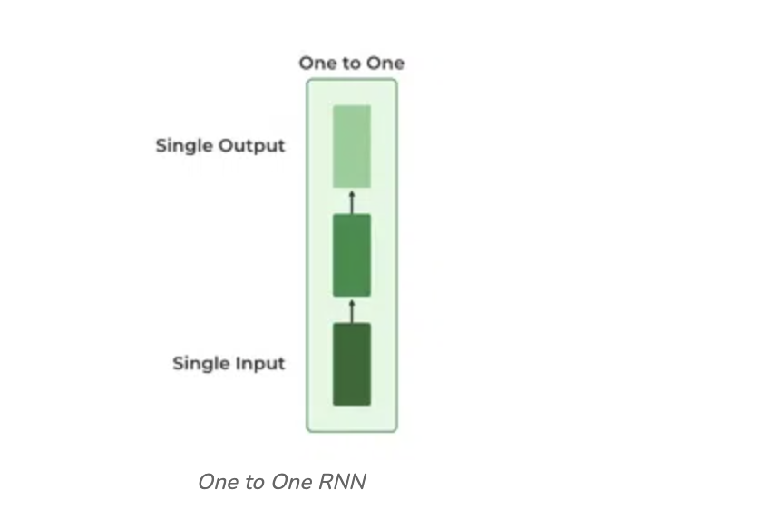


<h3 style="color:blue;">📌2. One-to-Many RNN*</h3>

In a One-to-Many RNN the network processes a single input to produce multiple outputs over time. This is useful in tasks where one input triggers a sequence of predictions (outputs). For example in image captioning a single image can be used as input to generate a sequence of words as a caption.

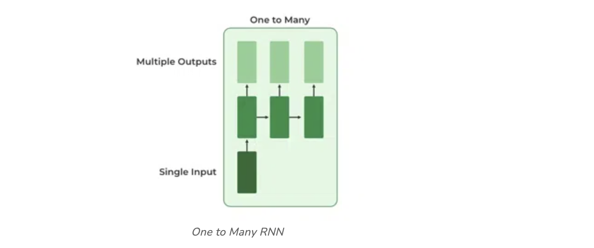

<h3 style="color:blue;">📌3. Many-to-One RNN*</h3>

The Many-to-One RNN receives a sequence of inputs and generates a single output. This type is useful when the overall context of the input sequence is needed to make one prediction. In sentiment analysis the model receives a sequence of words (like a sentence) and produces a single output like positive, negative or neutral.


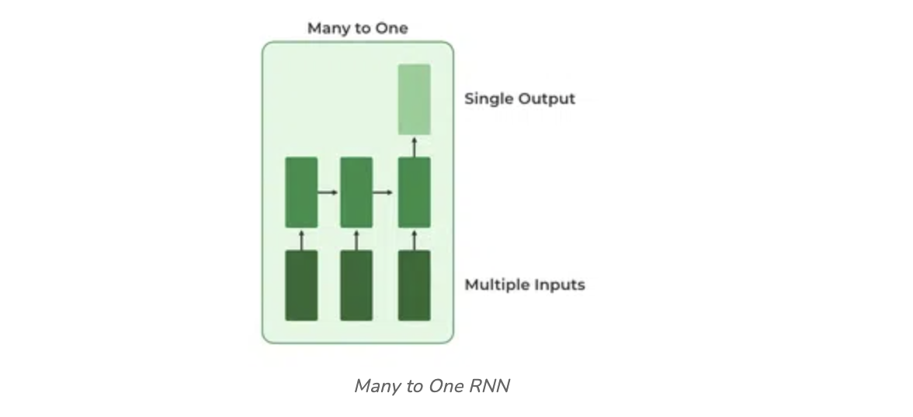


<h3 style="color:blue;">📌4. Many-to-Many RNN*</h3>

The Many-to-Many RNN type processes a sequence of inputs and generates a sequence of outputs. In language translation task a sequence of words in one language is given as input and a corresponding sequence in another language is generated as output.

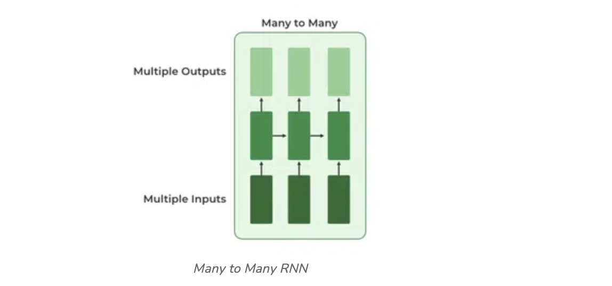


<h3 style="color:blue;">📌Variants of Recurrent Neural Networks (RNNs)*</h3>

There are several variations of RNNs, each designed to address specific challenges or optimize for certain tasks:


**1. Vanilla RNN**

This simplest form of RNN consists of a single hidden layer where weights are shared across time steps. Vanilla RNNs are suitable for learning short-term dependencies but are limited by the vanishing gradient problem, which hampers long-sequence learning.


**2. Bidirectional RNNs**

Bidirectional RNNs process inputs in both forward and backward directions, capturing both past and future context for each time step. This architecture is ideal for tasks where the entire sequence is available, such as named entity recognition and question answering.


**3. Long Short-Term Memory Networks (LSTMs)**

Long Short-Term Memory Networks (LSTMs) introduce a memory mechanism to overcome the vanishing gradient problem. Each LSTM cell has three gates:

- **Input Gate:** Controls how much new information should be added to the cell state.

- **Forget Gate:** Decides what past information should be discarded.

- **Output Gate:** Regulates what information should be output at the current step. This selective memory enables LSTMs to handle long-term dependencies, making them ideal for tasks where earlier context is critical.


**4. Gated Recurrent Units (GRUs)**

Gated Recurrent Units (GRUs) simplify LSTMs by combining the input and forget gates into a single update gate and streamlining the output mechanism. This design is computationally efficient, often performing similarly to LSTMs and is useful in tasks where simplicity and faster training are beneficial.

<h3 style="color:blue;">📌How RNN Differs from Feedforward Neural Networks?*</h3>

Feedforward Neural Networks (FNNs) process data in one direction from input to output without retaining information from previous inputs. This makes them suitable for tasks with independent inputs like image classification. However FNNs struggle with sequential data since they lack memory.

Recurrent Neural Networks (RNNs) solve this by incorporating loops that allow information from previous steps to be fed back into the network. This feedback enables RNNs to remember prior inputs making them ideal for tasks where context is important.


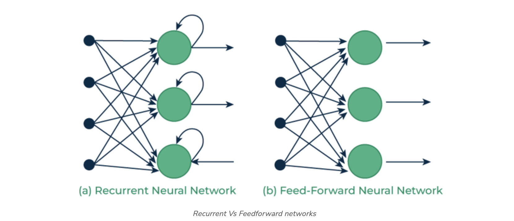


<h3 style="color:blue;">📌Implementing a Text Generator Using Recurrent Neural Networks (RNNs)*</h3>

We will create a character-based text generator using Recurrent Neural Network (RNN) in TensorFlow and Keras. We'll implement an RNN that learns patterns from a text sequence to generate new text character-by-character.


## Example:

## 1. Importing Necessary Libraries

```
import numpy as np
import tensorflow as tf
from tensorflow.keras.models import Sequential
from tensorflow.keras.layers import SimpleRNN, Dense
```

- ```numpy``` for array manipulation, ```tensorflow / keras``` for the model.

- ```Sequential``` builds a stack of layers. ```SimpleRNN``` = vanilla RNN layer. ```Dense``` = fully connected output layer.

## 2. Defining the Input Text and Prepare Character Set

We define the input text and identify unique characters in the text which we’ll encode for our model.

```
text = "Kurudusonnehalli Main Rd, Sonnenahalli Colony, Krishnarajapuram, Bengaluru, Karnataka 560049"
chars = sorted(list(set(text)))
char_to_index = {char: i for i, char in enumerate(chars)}
index_to_char = {i: char for i, char in enumerate(chars)}
```

- You build a **vocabulary** of all distinct characters in ```text```.

- ```chars``` is the sorted list of unique characters (spaces, commas, digits, letters, etc.).

- ```char_to_index``` / ```index_to_char``` convert between character ↔ integer index (one-hot indexing).

In this specific string:

- ```len(text) = 92``` characters total.

- ```len(chars) = 31``` distinct characters (so vocabulary size = 31).

## 3. Creating Sequences and Labels

To train the RNN, we need sequences of fixed length (seq_length) and the character following each sequence as the label.

```
seq_length = 3
sequences = []
labels = []

for i in range(len(text) - seq_length):
    seq = text[i:i + seq_length]
    label = text[i + seq_length]
    sequences.append([char_to_index[char] for char in seq])
    labels.append(char_to_index[label])

X = np.array(sequences)
y = np.array(labels)
```

- You create sliding windows of length ```seq_length=3```.

- For each window seq = ```text[i:i+3]```, the label is the next character ```text[i+3]```.

- Example: if ```text = "abcdef..."``` and ```seq_length=3```, samples are ```("abc" -> "d"), ("bcd" -> "e"), ....```

- Number of training samples = ```len(text) - seq_length = 89.```

So after this:

- ```X``` (as indices) shape: ```(89, 3)``` — 89 sequences, each 3 indices long.

- ```y``` (as indices) shape: ```(89,)``` — 1 label per sequence.

## 4. Converting Sequences and Labels to One-Hot Encoding

For training we convert X and y into one-hot encoded tensors.

```
X_one_hot = tf.one_hot(X, len(chars))
y_one_hot = tf.one_hot(y, len(chars))
```

- ```tf.one_hot(X, len(chars))``` converts each index to a one-hot vector of length 31.

- Final training tensors:
   
   - ```X_one_hot```: shape ```(num_samples, timesteps, input_dim) = (89, 3, 31)```.

   - ```y_one_hot```: shape ```(num_samples, num_classes) = (89, 31)```.


**Notes:**

- ```X_one_hot``` dtype is ```float32``` by default. Keras accepts ```tf.Tensor``` inputs.

- For large vocabularies, one-hot is memory-inefficient — embeddings are preferred.

## 5. Building the RNN Model

We create a simple RNN model with a hidden layer of 50 units and a Dense output layer with softmax activation.

```
model = Sequential()
model.add(SimpleRNN(50, input_shape=(seq_length, len(chars)), activation='relu'))
model.add(Dense(len(chars), activation='softmax'))
```

**Two layers:**

1. ```SimpleRNN(50, input_shape=(3, 31), activation='relu')```

- Units = 50 → hidden state vector size = 50.

- Input shape = ```(timesteps, features) = (3, 31)```.

- Default ```return_sequences=False``` so the layer outputs the **final hidden state** ```h_T``` for the whole sequence (shape (```batch_size, 50)```).

- Math (per time step t):
  
  - pre-activation: ```z_t = x_t @ W_xh + h_{t-1} @ W_hh + b_h```

  - ``W_xh``: shape ```(input_dim, units) = (31, 50)```

  - ```W_hh```: shape ```(units, units) = (50, 50)```

  - ```b_h```: shape ```(50,)```

- hidden update: ```h_t = relu(z_t)``` (here ReLU used instead of tanh)

- Initial hidden state ```h_0``` defaults to zeros.

2. ```Dense(len(chars), activation='softmax')```

  - Fully connected layer from 50 → 31 output logits.

  - ```softmax``` turns logits into a probability distribution over the 31 characters:

     - logits: ```logits = h_T @ W_hy + b_y (W_hy``` shape ```(50, 31))```

     - ```y_pred = softmax(logits)```

## 6. Compiling and Training the Model

We compile the model using the categorical_crossentropy loss and train it for 100 epochs.

```
model.compile(optimizer='adam', loss='categorical_crossentropy', metrics=['accuracy'])
model.fit(X_one_hot, y_one_hot, epochs=100)
```

- ```optimizer='adam'```: adaptive optimizer (default lr=0.001).

- ```loss='categorical_crossentropy'```: appropriate for multi-class one-hot labels:

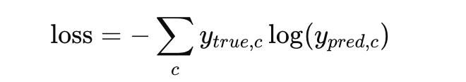

- ```metrics=['accuracy']```: computes fraction where ```argmax(y_pred) == argmax(y_true)```.

- ```model.fit(...)```:

   - Default ```batch_size=32```. With 89 samples you get 3 batches per epoch: 32 + 32 + 25.

   - ```epochs=100``` — small dataset; 100 epochs likely causes overfitting.

## 7. Generating New Text Using the Trained Model

After training we use a starting sequence to generate new text character by character.

```
start_seq = "Kurudusonnehalli"
generated_text = start_seq

for i in range(40):
    x = np.array([[char_to_index[char] for char in generated_text[-seq_length:]]])
    x_one_hot = tf.one_hot(x, len(chars))
    prediction = model.predict(x_one_hot)
    next_index = np.argmax(prediction)
    next_char = index_to_char[next_index]
    generated_text += next_char

print("Generated Text:")
print(generated_text)
```


- ```start_seq = "Kurudusonnehalli"``` seeds generation (must be characters that exist in ```char_to_index```).

- Each iteration:

 1. Take last ```seq_length``` characters of ```generated_text```.

 2. Convert to indices → shape ```(1, 3)``` (a batch of 1).

 3. One-hot → ```(1, 3, 31)```.

 4. ```model.predict``` returns probabilities shape ```(1, 31)```.

 5. ```np.argmax``` picks the highest-probability character (greedy).`

 6. Append predicted char to ```generated_text``` and repeat.

 - After 40 iterations you have 43 characters (initial 3 + 40 predicted).

**Greedy vs sampling**

- ```argmax``` = greedy; produces deterministic and often boring/repetitive text.

## 8. Under-the-hood: gradients & BPTT

- Training uses **Backpropagation Through Time (BPTT)** unrolled for 3 time steps (because seq_length=3).

- Gradients flow from ```loss``` → ```softmax``` → ```Dense``` → ```h_T → back through RNN time steps via W_hh and activation derivatives.

- Using ```relu``` inside RNN can lead to “dying ReLU” (zero gradients) for some weights — ```tanh``` is more common for SimpleRNN.
