<h2 style="color:red;">✅ Transformer</h2>

<h3 style="color:blue;">📌 What is Transformer?</h3>

The Transformer is a neural network architecture that relies entirely on a mechanism called self-attention to process sequential data, like text. Unlike previous models such as Recurrent Neural Networks (RNNs) that process data word-by-word in order, the Transformer processes the entire input sequence at once. This design allows for massive parallelization, dramatically speeding up training time and enabling it to learn long-range dependencies in data more effectively.


<h3 style="color:blue;">📌 A High-Level Look</h3>

Let’s begin by looking at the model as a single black box. In a machine translation application, it would take a sentence in one language, and output its translation in another.

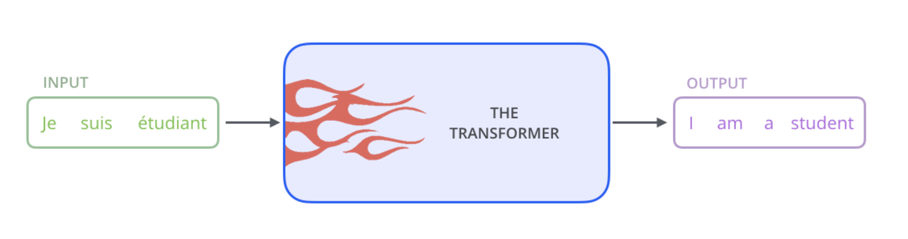

A Transformer is typically composed of two main parts:

1. **The Encoder:** This part processes the input sentence (e.g., "Je suis étudiant"). It reads the entire sentence at once and builds a rich numerical representation (a set of vectors) for each word that captures its meaning in the context of the full sentence.

2. **The Decoder:** This part generates the output sentence (e.g., "I am a student") word by word. At each step, it looks at the representations created by the encoder and the words it has already generated to decide which word to produce next.

The encoder's job is to read and understand the input sentence in its entirety.

Think of it as a specialist reader. It takes the input sentence, "Je suis étudiant," and looks at all the words at once. Using a mechanism called self-attention, it figures out how each word in the sentence relates to all the other words in that same sentence. It learns that "Je" is the subject and "suis" is the verb connected to it, for example.

The final output of the encoder isn't another sentence; it's a set of numerical representations (vectors). You can think of these as rich, context-aware "notes" that capture the meaning of the input sentence.


## The Decoder: The Writer ✍️

The decoder's job is to generate the output sentence word by word.

It's a generative process. To start, it might be given a special "start" token. Then, to generate the first word ("I"), it relies on two key sources of information:

1. **What it has already written:** In the beginning, this is just the "start" token. Later, when generating "am," it will look back at "I." This is a form of self-attention, but it's "masked" so the decoder can't cheat by looking ahead at words it hasn't generated yet.

2. **The Encoder's Notes:** This is the critical connection you mentioned! The decoder pays attention to the numerical representations created by the encoder. When it's trying to generate the English translation, it looks across the encoded French sentence to find the most relevant information. As it generates "student," it will pay strong attention to the encoder's notes for the word "étudiant." This is often called encoder-decoder attention or cross-attention.

This process repeats—generating one word at a time, looking at the encoder's notes and its own previous output—until it produces a special "end of sentence" token.


```we see an encoding component, a decoding component, and connections between them.```

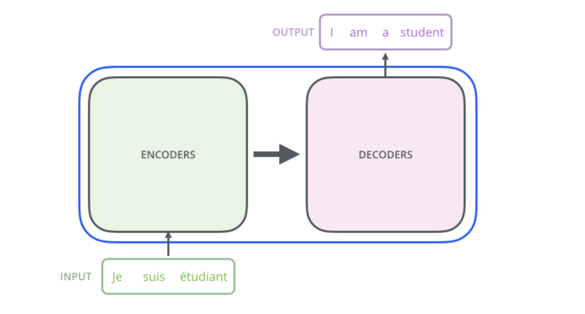


The encoding component is a stack of encoders (the paper stacks six of them on top of each other – there’s nothing magical about the number six, one can definitely experiment with other arrangements). The decoding component is a stack of decoders of the same number.

**The Encoder Stack: Deepening the Understanding**

When the input "Je suis étudiant" enters the first encoder, the model might learn some basic relationships. As the output of that encoder is passed to the second, and then the third, and so on, the model builds a more sophisticated understanding.

 - **Layer 1:** Might learn simple grammatical connections.

 - **Layers 2-4:** Could start to understand the semantic meaning and disambiguate words.

 - **Layers 5-6:** Can capture long-range dependencies and subtle contextual nuances across the entire sentence.

By the time the data emerges from the top of the sixth encoder, the model has a very rich, multi-layered representation of the source sentence's meaning.


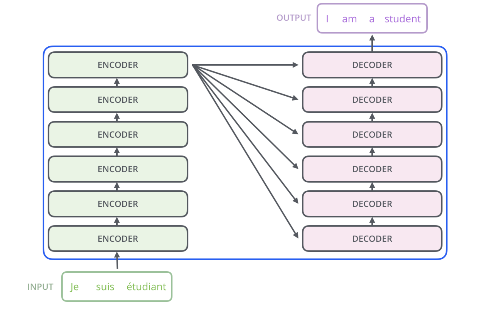


The encoders are all identical in structure (yet they do not share weights). Each one is broken down into two sub-layers:

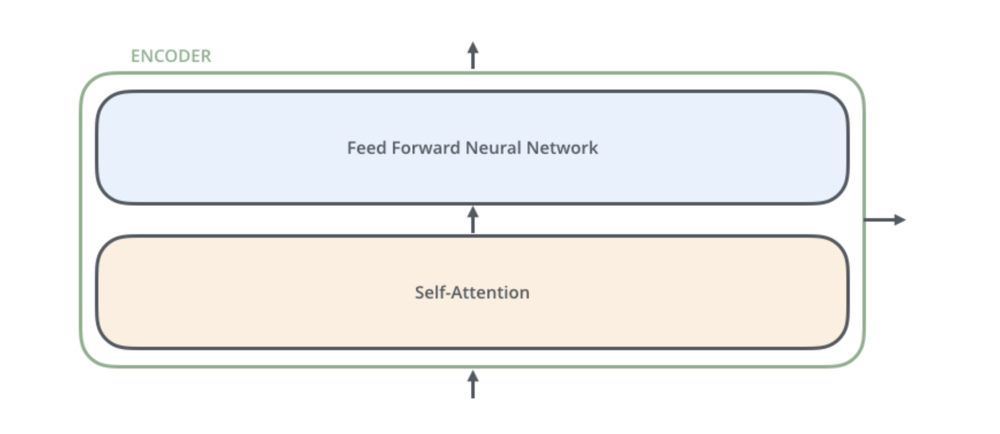


**1. The Self-Attention Layer: The Contextualizer**

For every single word, the self-attention mechanism generates a score against every other word in the sentence. A high score means the words are highly relevant to each other. It effectively asks, "To understand the meaning of this specific word in this context, which other words should I pay the most attention to?"

**2. The Feed-Forward Network: The Processor**

After the self-attention layer has gathered and blended the contextual information, the output is passed to a simple but crucial Feed-Forward Neural Network (FFN)

This is a standard, fully connected neural network. Importantly, it processes the representation for each word independently. While the self-attention layer was all about inter-word communication, the FFN allows for a deeper, more complex transformation of each word's individual representation.

The final output of the encoder layer, which is then passed up to the next encoder in the stack.

**Identical in Structure, but No Shared Weights**

- **Identical Structure:** Every encoder in the stack has this same Attention-FFN setup. This makes the architecture neat and consistent.

- **No Shared Weights:** Each of the six encoder layers learns its own unique set of parameters (weights). This is what allows for the hierarchical learning we discussed. If they all had the same weights, stacking them would be redundant. Because they are independent, Encoder Layer 1 can learn to focus on syntactic relationships, while Encoder Layer 6 can learn to capture more abstract semantic meaning.


The encoder’s inputs first flow through a self-attention layer – a layer that helps the encoder look at other words in the input sentence as it encodes a specific word.

The outputs of the self-attention layer are fed to a feed-forward neural network. The exact same feed-forward network is independently applied to each position.

The decoder has both those layers, but between them is an attention layer that helps the decoder focus on relevant parts of the input sentence


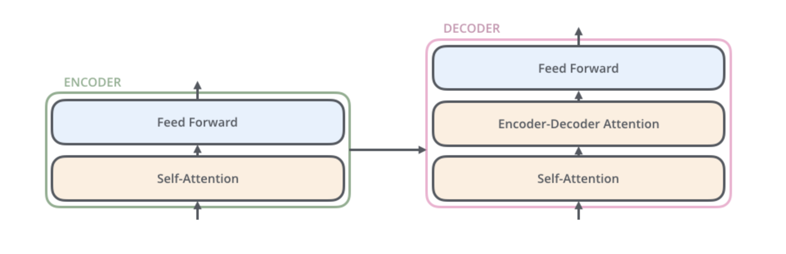

**Bringing The Tensors Into The Picture**

Now that we’ve seen the major components of the model, let’s start to look at the various vectors/tensors and how they flow between these components to turn the input of a trained model into an output.

As is the case in NLP applications in general, we begin by turning each input word into a vector using an embedding algorithm.

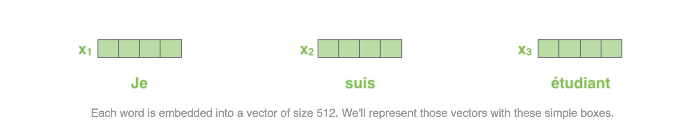

The embedding only happens in the bottom-most encoder. The abstraction that is common to all the encoders is that they receive a list of vectors each of the size 512 – In the bottom encoder that would be the word embeddings, but in other encoders, it would be the output of the encoder that’s directly below. The size of this list is hyperparameter we can set – basically it would be the length of the longest sentence in our training dataset.

After embedding the words in our input sequence, each of them flows through each of the two layers of the encoder.

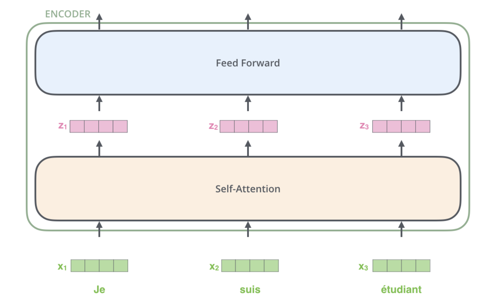


Here we begin to see one key property of the Transformer, which is that the word in each position flows through its own path in the encoder. There are dependencies between these paths in the self-attention layer. The feed-forward layer does not have those dependencies, however, and thus the various paths can be executed in parallel while flowing through the feed-forward layer.

Next, we’ll switch up the example to a shorter sentence and we’ll look at what happens in each sub-layer of the encoder.

## Now We’re Encoding!

As we’ve mentioned already, an encoder receives a list of vectors as input. It processes this list by passing these vectors into a ‘self-attention’ layer, then into a feed-forward neural network, then sends out the output upwards to the next encoder.

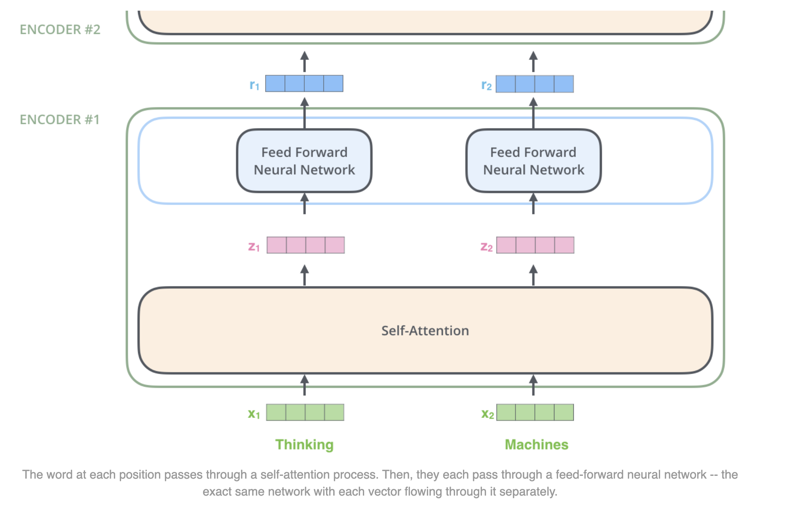


## Self-Attention at a High Level

Don’t be fooled by me throwing around the word “self-attention” like it’s a concept everyone should be familiar with. I had personally never came across the concept until reading the Attention is All You Need paper. Let us distill how it works.

Say the following sentence is an input sentence we want to translate:


```The animal didn't cross the street because it was too tired```

What does “it” in this sentence refer to? Is it referring to the street or to the animal? It’s a simple question to a human, but not as simple to an algorithm.

When the model is processing the word “it”, self-attention allows it to associate “it” with “animal”.

As the model processes each word (each position in the input sequence), self attention allows it to look at other positions in the input sequence for clues that can help lead to a better encoding for this word.

If you’re familiar with RNNs, think of how maintaining a hidden state allows an RNN to incorporate its representation of previous words/vectors it has processed with the current one it’s processing. Self-attention is the method the Transformer uses to bake the “understanding” of other relevant words into the one we’re currently processing.

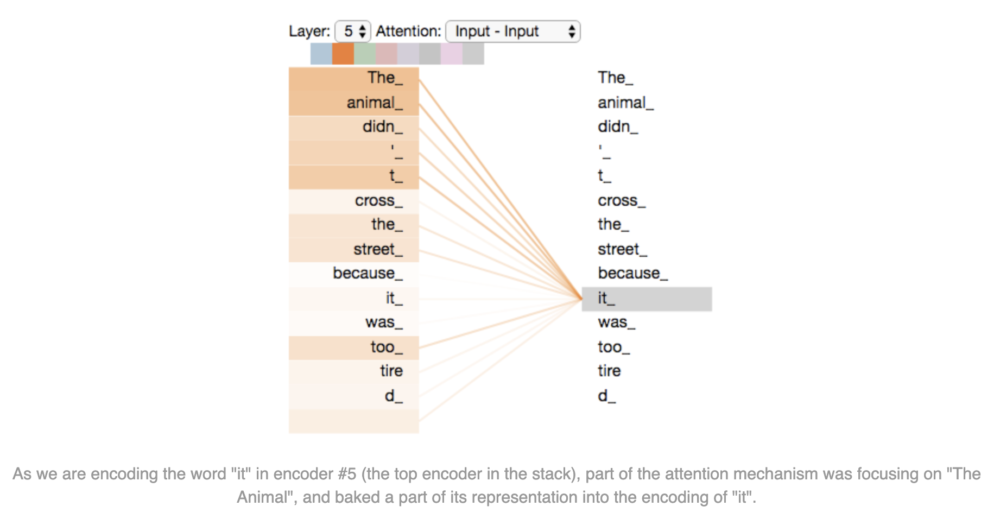


**Self-Attention in Detail**

Let’s first look at how to calculate self-attention using vectors, then proceed to look at how it’s actually implemented – using matrices.

The first step in calculating self-attention is to create three vectors from each of the encoder’s input vectors (in this case, the embedding of each word). So for each word, we create a 

1. **Query** vector

2. **Key** vector

3. **Value** vector.

These vectors are created by multiplying the embedding by three matrices that we trained during the training process.

# Transformer Attention Vector Dimensions

## 1. Context

In the Transformer architecture, **embedding vectors** and **encoder input/output vectors** typically have a dimensionality of **512**.  
However, the vectors used **inside multi-head attention** (query, key, and value vectors) often have a **smaller dimensionality** — in this example, **64**.

---

## 2. Why Smaller Dimensions for Attention?

- **Design Choice**: The reduced dimensionality is **not mandatory**, but is chosen to make the computation of multi-head attention more **efficient**.
- **Computation Cost**: Multi-head attention involves matrix multiplications for multiple attention heads.  
  By reducing the vector size, the computation for each head remains **(mostly) constant** regardless of the total embedding size.

---

## 3. Example: Multi-Head Attention Dimension Split

### Given:
- **Embedding size** = 512
- **Number of heads** = 8
- **Dimension per head** = 512 ÷ 8 = **64**

### Process:
1. The input embedding (512-d) is projected into:
   - **Query vectors** (Q) → 64 dimensions per head
   - **Key vectors** (K) → 64 dimensions per head
   - **Value vectors** (V) → 64 dimensions per head

2. Each attention head operates **independently** on its 64-dimensional vectors.

3. The outputs from all heads are concatenated back to **512 dimensions**.

---

## 4. Benefits of This Design

- **Efficiency**: Reduces the matrix multiplication cost per head.
- **Parallelization**: Multiple heads run in parallel without exploding computational requirements.
- **Flexibility**: The per-head dimension (64 here) can be tuned based on memory and compute budgets.

---

## 5. Visual Representation

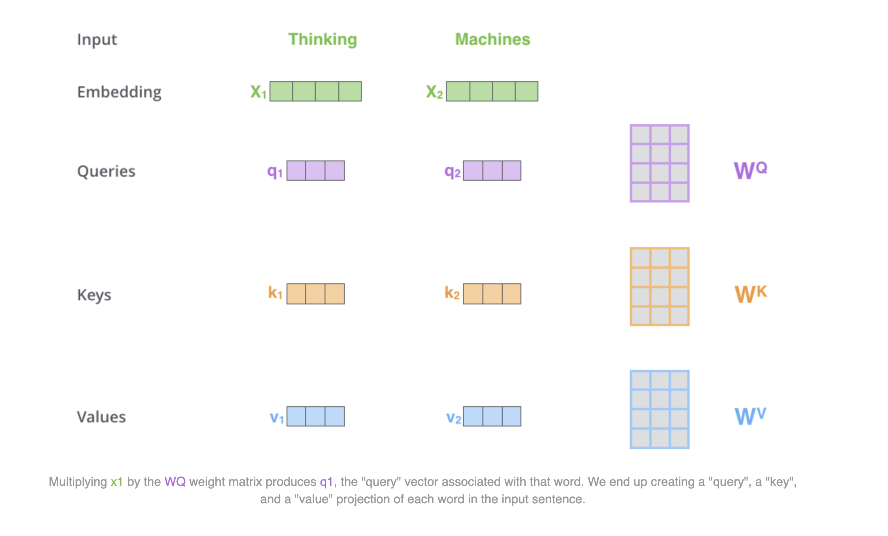


What are the “query”, “key”, and “value” vectors?

# Query, Key, and Value Vectors in Attention

## 1. What Are Q, K, and V?

In the **attention mechanism** (used in Transformers), each input token is represented by **three vectors**:

- **Query (Q)** → What am I looking for?
- **Key (K)** → What do I contain?
- **Value (V)** → The actual content I can offer.

They are **learned projections** of the same input embedding.

---

## 2. How Are They Created?

For each token embedding **x** (e.g., 512-dimensional), we compute:


Q = x × W_Q
K = x × W_K
V = x × W_V


Where:
- `W_Q`, `W_K`, `W_V` are **learnable weight matrices**.
- The resulting Q, K, and V vectors are usually **smaller in dimension** (e.g., 64 for each head).

---

## 3. Analogy

Imagine a **library**:

- **Query**: Your search request (e.g., "books about AI").
- **Key**: The labels on each book in the library (metadata).
- **Value**: The full text/content of the book.

The attention mechanism matches **Query** with **Keys** to decide which **Values** to retrieve.

---

## 4. How They Work in Attention

1. **Similarity Calculation**  
   Compare each Query with all Keys using a **dot product**:


score = Q · K^T

This produces a measure of how relevant each key is to the query.

2. **Scaling and Softmax**  
Scale scores by `√d_k` (dimension of key) and apply **softmax** to get attention weights:

attention_weights = softmax(score / √d_k)


3. **Weighted Sum of Values**  
Multiply each Value vector by its corresponding attention weight and sum:


output = Σ (attention_weight × V)


This output is a **context vector** — a blend of relevant values based on the query.

---

## 5. Formula

The scaled dot-product attention formula is:


---

## 6. Example

Sentence: `"The cat sat on the mat"`

- The word **"cat"** (as a query) might have high similarity to **"sat"** and **"mat"** in the key space,  
  so the context vector for "cat" will focus more on values from those words.

---

## 7. Visual Diagram (Conceptual)


Embedding → Linear(W_Q) → Query (Q)
→ Linear(W_K) → Key (K)
→ Linear(W_V) → Value (V)

Q × K^T → Scale → Softmax → Weights × V → Context Vector


---

## 8. Key Takeaway

- **Query**: What information this token is looking for.  
- **Key**: What information this token contains.  
- **Value**: The actual information content to pass forward.  
- Attention finds matches between **Q** and **K** to decide which **V** matters most.


They’re abstractions that are useful for calculating and thinking about attention. Once you proceed with reading how attention is calculated below, you’ll know pretty much all you need to know about the role each of these vectors plays.

The second step in calculating self-attention is to calculate a score. Say we’re calculating the self-attention for the first word in this example, “Thinking”. We need to score each word of the input sentence against this word. The score determines how much focus to place on other parts of the input sentence as we encode a word at a certain position.

The score is calculated by taking the dot product of the query vector with the key vector of the respective word we’re scoring. So if we’re processing the self-attention for the word in position #1, the first score would be the dot product of q1 and k1. The second score would be the dot product of q1 and k2.

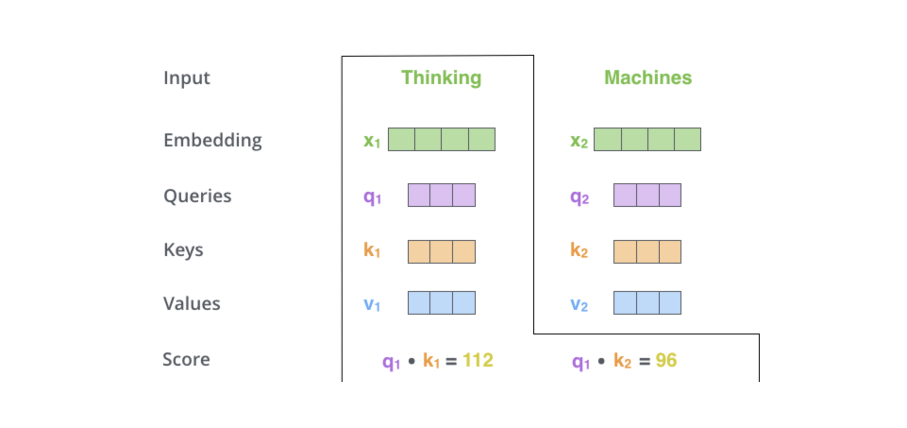


The **third and fourth steps** are to divide the scores by 8 (the square root of the dimension of the key vectors used in the paper – 64. This leads to having more stable gradients. There could be other possible values here, but this is the default), then pass the result through a softmax operation. Softmax normalizes the scores so they’re all positive and add up to 1.


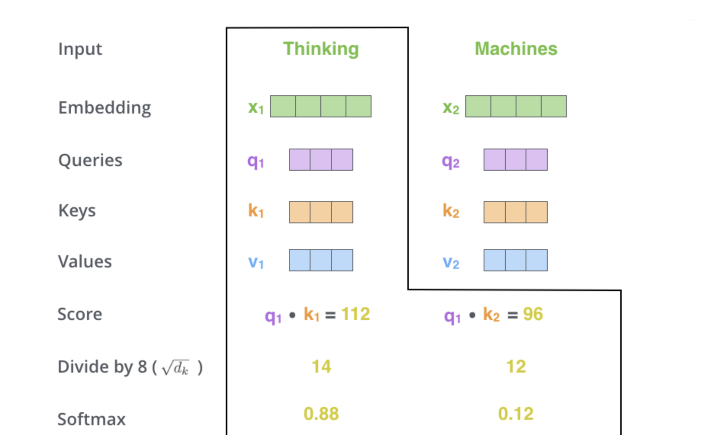

This softmax score determines how much each word will be expressed at this position. Clearly the word at this position will have the highest softmax score, but sometimes it’s useful to attend to another word that is relevant to the current word.


The fifth step is to multiply each value vector by the softmax score (in preparation to sum them up). The intuition here is to keep intact the values of the word(s) we want to focus on, and drown-out irrelevant words (by multiplying them by tiny numbers like 0.001, for example).

The sixth step is to sum up the weighted value vectors. This produces the output of the self-attention layer at this position (for the first word).


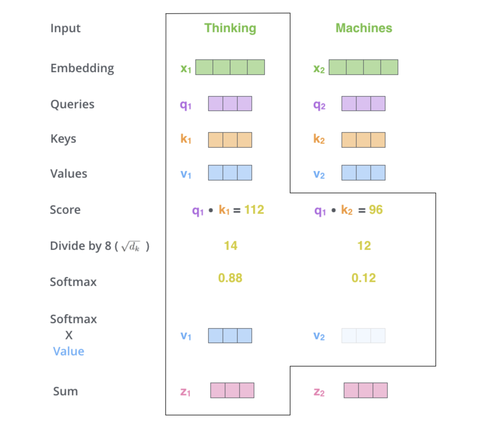

That concludes the self-attention calculation. The resulting vector is one we can send along to the feed-forward neural network. In the actual implementation, however, this calculation is done in matrix form for faster processing. So let’s look at that now that we’ve seen the intuition of the calculation on the word level.

## Matrix Calculation of Self-Attention

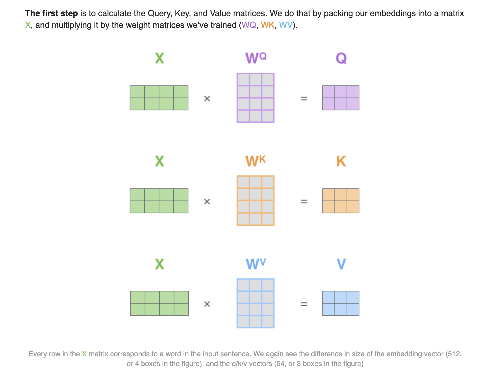

**Finally**, since we’re dealing with matrices, we can condense steps two through six in one formula to calculate the outputs of the self-attention layer.

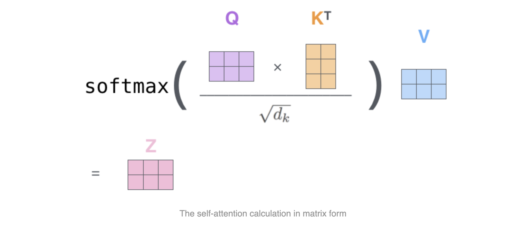


## The Beast With Many Heads

The paper further refined the self-attention layer by adding a mechanism called “multi-headed” attention. This improves the performance of the attention layer in two ways:

1. It expands the model’s ability to focus on different positions. Yes, in the example above, z1 contains a little bit of every other encoding, but it could be dominated by the actual word itself. If we’re translating a sentence like “The animal didn’t cross the street because it was too tired”, it would be useful to know which word “it” refers to.

2. It gives the attention layer multiple “representation subspaces”. As we’ll see next, with multi-headed attention we have not only one, but multiple sets of Query/Key/Value weight matrices (the Transformer uses eight attention heads, so we end up with eight sets for each encoder/decoder). Each of these sets is randomly initialized. Then, after training, each set is used to project the input embeddings (or vectors from lower encoders/decoders) into a different representation subspace.

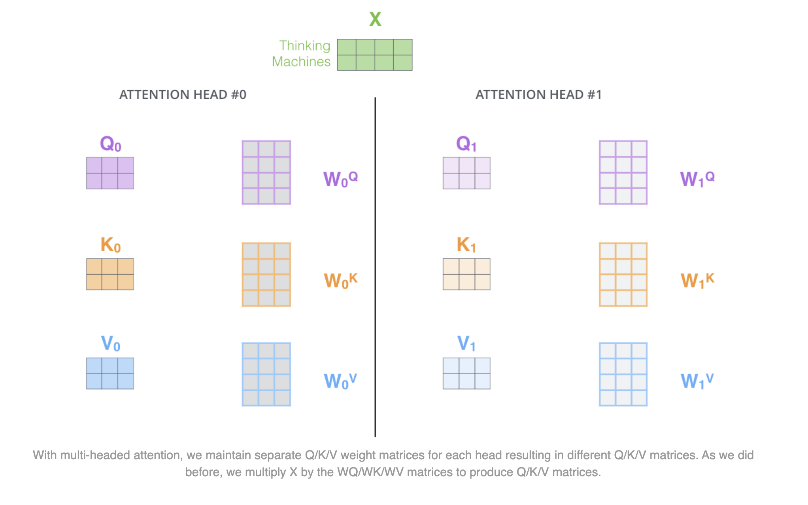


If we do the same self-attention calculation we outlined above, just eight different times with different weight matrices, we end up with eight different Z matrices

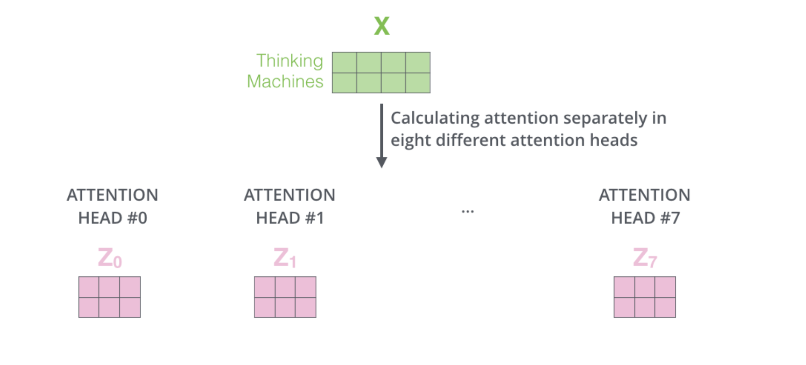


This leaves us with a bit of a challenge. The feed-forward layer is not expecting eight matrices – it’s expecting a single matrix (a vector for each word). So we need a way to condense these eight down into a single matrix.

How do we do that? We concat the matrices then multiply them by an additional weights matrix WO.

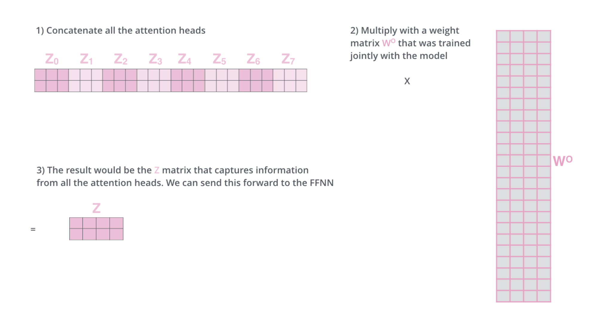


That’s pretty much all there is to multi-headed self-attention. It’s quite a handful of matrices, I realize. Let me try to put them all in one visual so we can look at them in one place

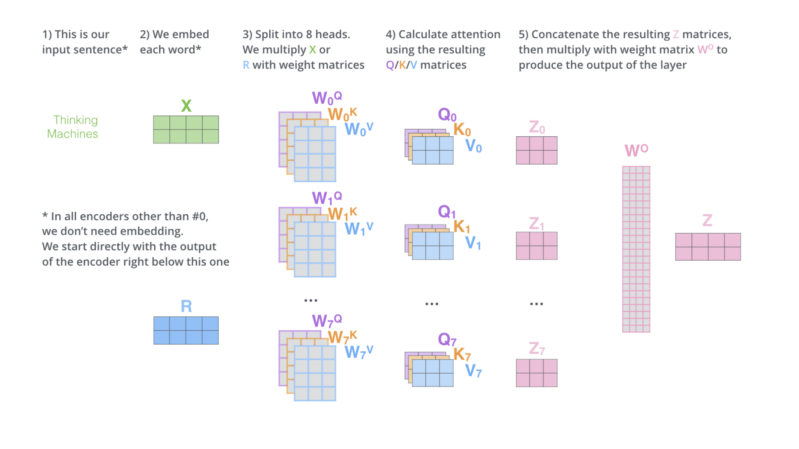

Now that we have touched upon attention heads, let’s revisit our example from before to see where the different attention heads are focusing as we encode the word “it” in our example sentence:

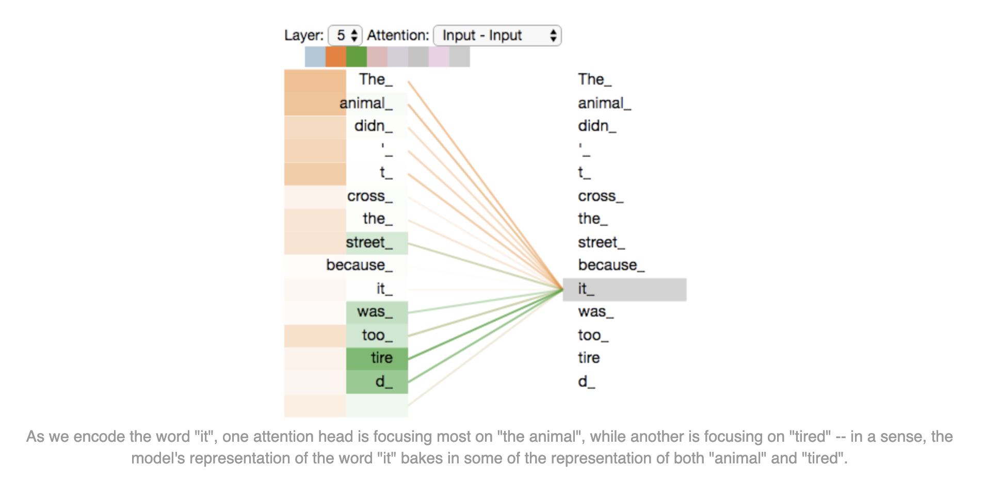


If we add all the attention heads to the picture, however, things can be harder to interpret:

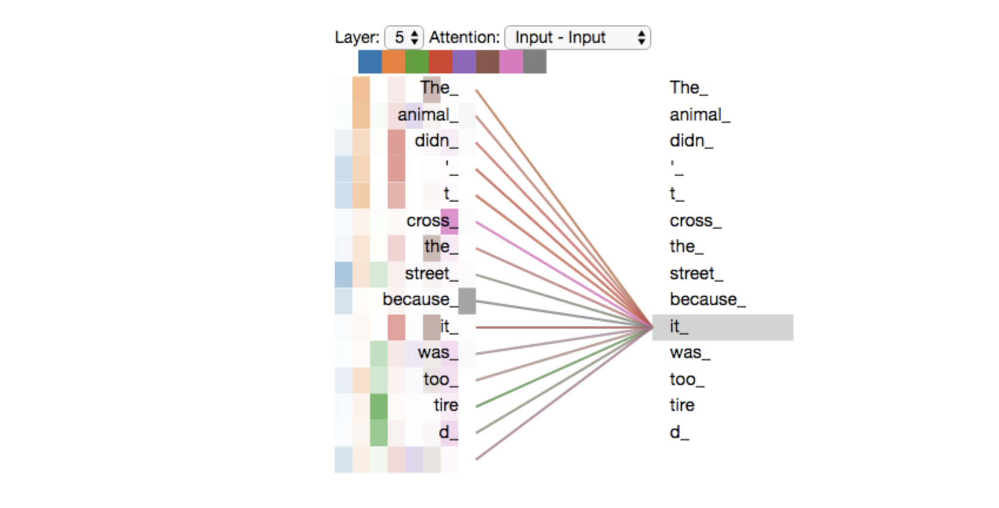

## Representing The Order of The Sequence Using Positional Encoding

One thing that’s missing from the model as we have described it so far is a way to account for the order of the words in the input sequence.

To address this, the transformer adds a vector to each input embedding. These vectors follow a specific pattern that the model learns, which helps it determine the position of each word, or the distance between different words in the sequence. The intuition here is that adding these values to the embeddings provides meaningful distances between the embedding vectors once they’re projected into Q/K/V vectors and during dot-product attention.

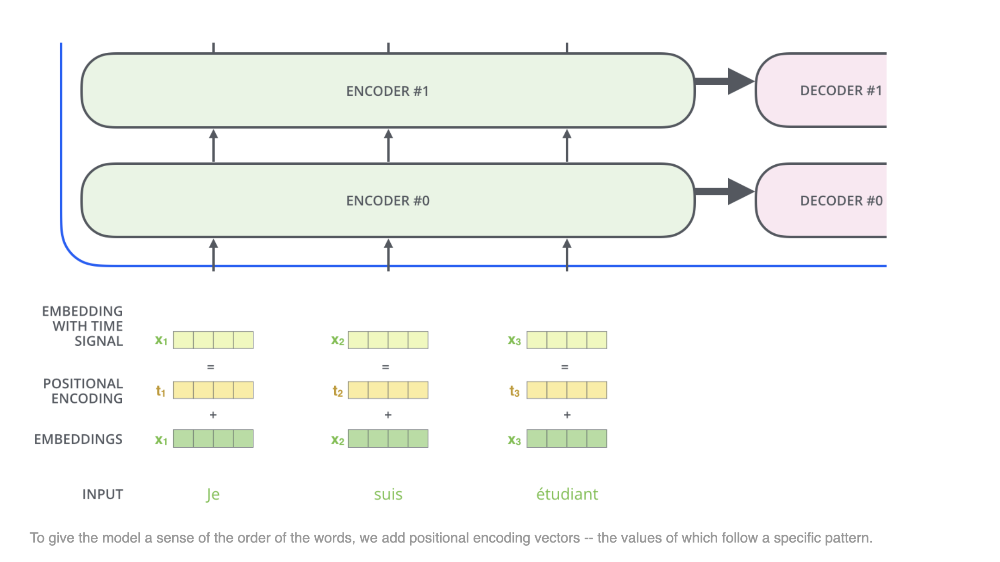


If we assumed the embedding has a dimensionality of 4, the actual positional encodings would look like this:

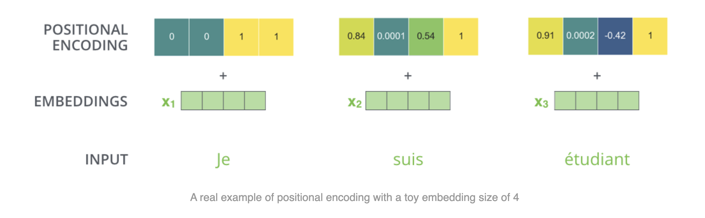


## The Residuals

One detail in the architecture of the encoder that we need to mention before moving on, is that each sub-layer (self-attention, ffnn) in each encoder has a residual connection around it, and is followed by a layer-normalization step.


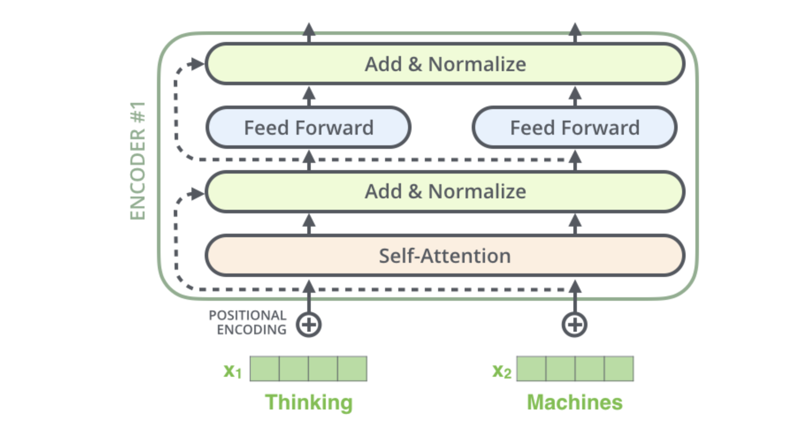


If we’re to visualize the vectors and the layer-norm operation associated with self attention, it would look like this:

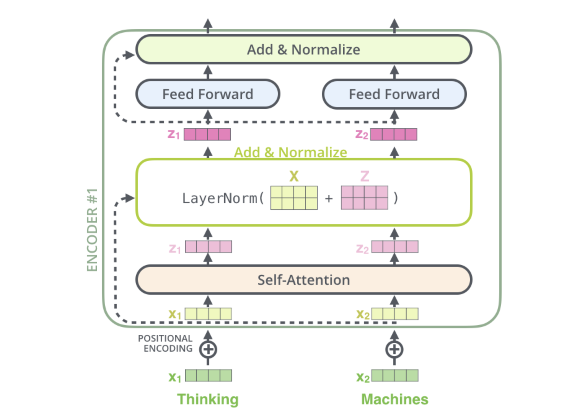

This goes for the sub-layers of the decoder as well. If we’re to think of a Transformer of 2 stacked encoders and decoders, it would look something like this:

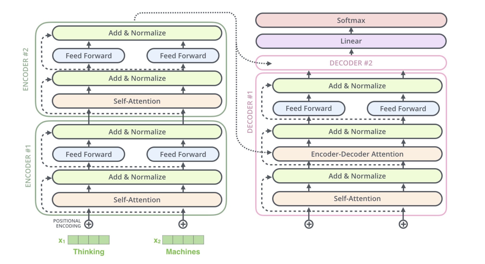

## The Decoder Side

Now that we’ve covered most of the concepts on the encoder side, we basically know how the components of decoders work as well. But let’s take a look at how they work together.

The encoder start by processing the input sequence. The output of the top encoder is then transformed into a set of attention vectors K and V. These are to be used by each decoder in its “encoder-decoder attention” layer which helps the decoder focus on appropriate places in the input sequence:

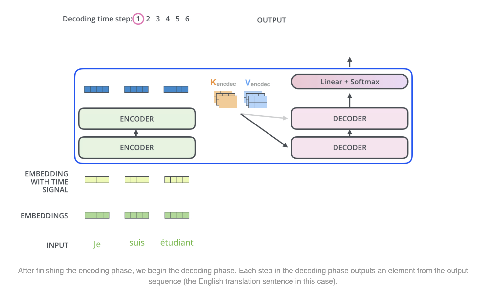


The following steps repeat the process until a special symbol is reached indicating the transformer decoder has completed its output. The output of each step is fed to the bottom decoder in the next time step, and the decoders bubble up their decoding results just like the encoders did. And just like we did with the encoder inputs, we embed and add positional encoding to those decoder inputs to indicate the position of each word.


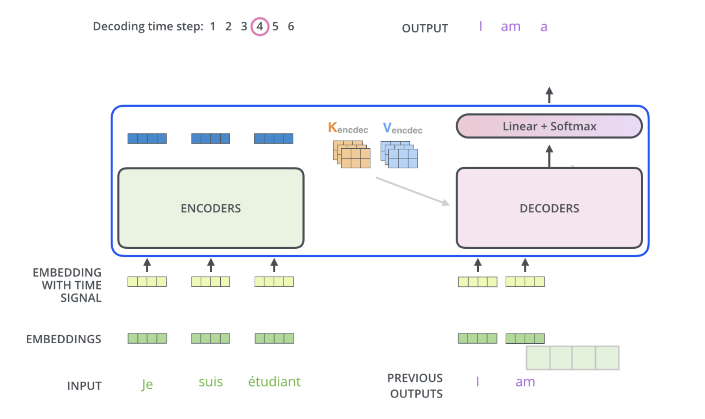


The self attention layers in the decoder operate in a slightly different way than the one in the encoder:

In the decoder, the self-attention layer is only allowed to attend to earlier positions in the output sequence. This is done by masking future positions (setting them to -inf) before the softmax step in the self-attention calculation.

The “Encoder-Decoder Attention” layer works just like multiheaded self-attention, except it creates its Queries matrix from the layer below it, and takes the Keys and Values matrix from the output of the encoder stack.


## The Final Linear and Softmax Layer

The decoder stack outputs a vector of floats. How do we turn that into a word? That’s the job of the final Linear layer which is followed by a Softmax Layer.

The Linear layer is a simple fully connected neural network that projects the vector produced by the stack of decoders, into a much, much larger vector called a logits vector.

Let’s assume that our model knows 10,000 unique English words (our model’s “output vocabulary”) that it’s learned from its training dataset. This would make the logits vector 10,000 cells wide – each cell corresponding to the score of a unique word. That is how we interpret the output of the model followed by the Linear layer.

The softmax layer then turns those scores into probabilities (all positive, all add up to 1.0). The cell with the highest probability is chosen, and the word associated with it is produced as the output for this time step.


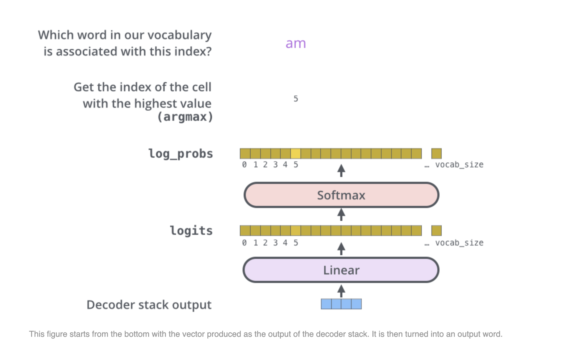

## Recap Of Training

Now that we’ve covered the entire forward-pass process through a trained Transformer, it would be useful to glance at the intuition of training the model.

During training, an untrained model would go through the exact same forward pass. But since we are training it on a labeled training dataset, we can compare its output with the actual correct output.

To visualize this, let’s assume our output vocabulary only contains six words(“a”, “am”, “i”, “thanks”, “student”, and “<eos>” (short for ‘end of sentence’)).

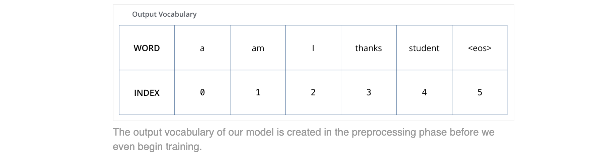

Once we define our output vocabulary, we can use a vector of the same width to indicate each word in our vocabulary. This also known as one-hot encoding. So for example, we can indicate the word “am” using the following vector:


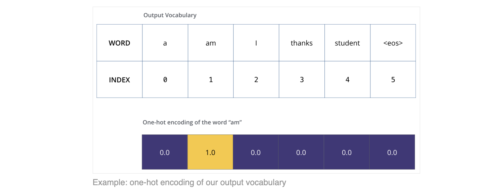


Following this recap, let’s discuss the model’s loss function – the metric we are optimizing during the training phase to lead up to a trained and hopefully amazingly accurate model.

## The Loss Function

Say we are training our model. Say it’s our first step in the training phase, and we’re training it on a simple example – translating “merci” into “thanks”.

What this means, is that we want the output to be a probability distribution indicating the word “thanks”. But since this model is not yet trained, that’s unlikely to happen just yet.


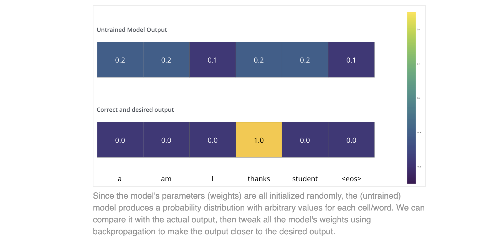

How do you compare two probability distributions? We simply subtract one from the other.

But note that this is an oversimplified example. More realistically, we’ll use a sentence longer than one word. For example – input: “je suis étudiant” and expected output: “i am a student”. What this really means, is that we want our model to successively output probability distributions where:

Each probability distribution is represented by a vector of width vocab_size (6 in our toy example, but more realistically a number like 30,000 or 50,000)
The first probability distribution has the highest probability at the cell associated with the word “i”
The second probability distribution has the highest probability at the cell associated with the word “am”
And so on, until the fifth output distribution indicates ‘<end of sentence>’ symbol, which also has a cell associated with it from the 10,000 element vocabulary.


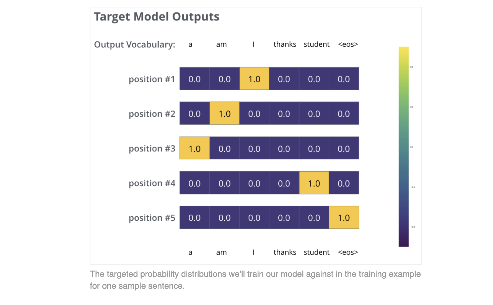

After training the model for enough time on a large enough dataset, we would hope the produced probability distributions would look like this:


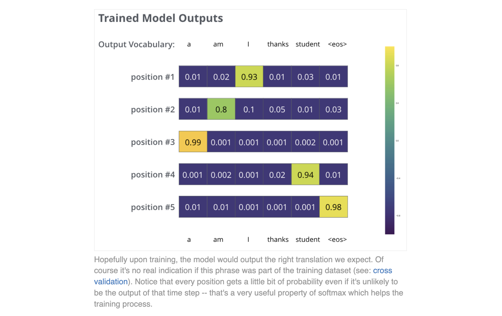


## Hugginface

Of course. That's an extensive list of models, many of which belong to the same architectural families.

Creating a unique entry for every single model would be extremely long and repetitive. Instead, I've created a table that groups them by their core architecture or family. This approach provides a clearer understanding of what each model type is designed for.

Here is the requested format, summarizing the major model families and prominent examples from your list.

Of course. That's an extensive list of models, many of which belong to the same architectural families.

Creating a unique entry for every single model would be extremely long and repetitive. Instead, I've created a table that groups them by their core architecture or family. This approach provides a clearer understanding of what each model type is designed for.

Here is the requested format, summarizing the major model families and prominent examples from your list.

| Model / Family | Short Description | Primary Use Cases |
| :--- | :--- | :--- |
| **BERT Family** | **Encoder-only models.** They read an entire text sequence at once to build a deep bidirectional understanding of context. They are excellent "understanding" models. | • Text Classification<br>• Sentiment Analysis<br>• Named Entity Recognition (NER)<br>• Extractive Question Answering |
| `BERT`, `RoBERTa`, `ALBERT`, `DistilBERT`, `ELECTRA`, `CamemBERT`, `FlauBERT` | Variations on the original BERT, often optimized for size, speed, training efficiency, or pre-trained on specific languages (e.g., CamemBERT for French). | Same as the family's general use cases. |
| **GPT Family** | **Decoder-only models.** Autoregressive models that generate text one word at a time, based on the preceding words. They are excellent "generation" models. | • Content Generation (stories, articles)<br>• Chatbots & Conversational AI<br>• Summarization<br>• General-purpose instruction following |
| `GPT-2`, `GPT-J`, `GPT-Neo`, `LLaMA`, `Llama2/3`, `Gemma`, `Mistral`, `Falcon`, `Phi-3`, `OPT` | These are foundational large language models (LLMs) that power most modern generative AI applications. They vary in size, training data, and performance. | Same as the family's general use cases. |
| **T5 / BART Family** | **Encoder-Decoder models.** A versatile sequence-to-sequence (seq2seq) framework that treats every NLP task as a "text-to-text" problem. | • Machine Translation<br>• Text Summarization<br>• Generative Question Answering<br>• Code Generation & Data-to-Text tasks |
| `T5`, `BART`, `FLAN-T5`, `PEGASUS`, `MarianMT`, `MBart` | T5 is a canonical text-to-text model. BART is optimized for denoising. PEGASUS is specialized for abstractive summarization. MarianMT is focused on translation. | Same as the family's general use cases. |
| **Mixture-of-Experts (MoE)** | **Sparse models.** A variation of other architectures (usually decoder-only) that uses multiple "expert" sub-networks. Only a fraction of the model is used for any given input, making them very efficient to run for their size. | • High-performance, scalable generation<br>• Efficiently serving very large models<br>• Multi-task, multi-domain capabilities |
| `Mixtral`, `Qwen2MoE`, `NLLB-MoE`, `SwitchTransformers` | Implementations of the MoE architecture. For example, Mixtral is a GPT-family model with MoE layers. NLLB-MoE is an Encoder-Decoder model for translation. | Use cases align with their base architecture (e.g., Mixtral for generation, NLLB-MoE for translation). |
| **Alternative Architectures** | **Non-Transformer or Hybrid models.** These models aim to solve some of the Transformer's inefficiencies, especially its quadratic complexity with long sequences. | • Long-context document analysis<br>• Processing DNA or time-series data<br>• Computationally efficient generation |
| `Mamba`, `RWKV`, `Zamba`, `Jamba`, `RecurrentGemma` | These use State Space Models (SSMs) or linear RNN approaches to offer faster inference and handle extremely long contexts better than standard attention mechanisms. Jamba is a hybrid of Mamba and Transformer blocks. | Same as the family's general use cases. |
| **Specialized Models** | **Models fine-tuned or pre-trained for a specific domain.** While based on the architectures above, their training data gives them expert-level capabilities in a niche. | • **Code:** Generation, completion, debugging<br>• **Biology:** Protein folding, sequence analysis<br>• **Vision:** Image captioning, VQA |
| `CodeGen`, `CodeLlama`, `Starcoder2` (Code) `BioGpt` (Biomedical) | Code models are trained on billions of lines of code. Biomedical models are trained on scientific literature and medical texts. | Domain-specific tasks as listed. |
| **Long Context Models** | **Transformer variants optimized for long sequences.** These models use modified attention mechanisms to handle inputs of many thousands or even millions of tokens. | • Summarizing entire books or reports<br>• Question answering over large document sets<br>• "Retrieval Augmented Generation" (RAG) over long chat histories |
| `Longformer`, `BigBird`, `Transformer-XL` | Use sparse, sliding window, or global attention patterns to reduce the computational cost of the self-attention mechanism, enabling it to process much longer inputs. | Same as the family's general use cases. |


| Model Name      | Availability                  | Hugging Face Hosted? | Notes (License / Access)                                           |
|-----------------|-------------------------------|----------------------|--------------------------------------------------------------------|
| **BERT**         | Open-source (Free)             | ✅ Yes               | Apache 2.0 license, released by Google; base model on HF.         |
| **ALBERT**       | Open-source (Free)             | ✅ Yes               | Apache 2.0 license, Google; multiple variants on HF.              |
| **DistilBERT**   | Open-source (Free)             | ✅ Yes               | Hugging Face compressed BERT variant, Apache 2.0.                 |
| **RoBERTa**      | Open-source (Free)             | ✅ Yes               | Meta AI; HF hosts base & large versions.                          |
| **ELECTRA**      | Open-source (Free)             | ✅ Yes               | Google; HF hosts small, base, large variants.                     |
| **DeBERTaV3**    | Open-source (Free)             | ✅ Yes               | Microsoft; HF hosts pretrained checkpoints.                       |
| **BioGPT**       | Open-source (Free)             | ✅ Yes               | Microsoft biomedical GPT; HF hosts weights.                       |
| **CodeGen**      | Open-source (Free)             | ✅ Yes               | Salesforce code LLM; HF models available.                         |
| **LLaMA**        | Open-source (Free for research)| ✅ Yes (restricted)  | Meta; HF gated repo requires approval.                            |
| **GPT-J**        | Open-source (Free)             | ✅ Yes               | EleutherAI; full model weights on HF.                              |
| **GPT-Neo**      | Open-source (Free)             | ✅ Yes               | EleutherAI; HF hosts multiple sizes.                              |
| **GPT-NeoX-20B** | Open-source (Free)             | ✅ Yes               | EleutherAI; HF hosts full weights.                                |
| **GPT-2**        | Open-source (Free)             | ✅ Yes               | OpenAI; HF hosts small to XL variants.                            |
| **XLNet**        | Open-source (Free)             | ✅ Yes               | Google/CMU; HF hosts pretrained checkpoints.                      |
| **GLM-130B**     | Open-source (Free)             | ✅ Yes               | THUDM; large bilingual model, hosted on HF.                       |
| **DeepSeek-V3**  | Open-source (Free)             | ❌ No                | MIT license; currently distributed outside HF.                    |
| **Qwen2.5**      | Open-source (Free)             | ✅ Yes               | Alibaba; HF hosts multiple versions incl. MoE.                    |
| **GPT-4.5**      | Paid / Proprietary             | ❌ No                | OpenAI; API-only access, no HF hosting.                           |
| **Claude 3**     | Paid / Proprietary             | ❌ No                | Anthropic; API-only, no open weights.                             |
| **Gemini 1.5**   | Paid / Proprietary             | ❌ No                | Google DeepMind; API-only, no HF hosting.                         |


## Referance Link

[Transformer](https://jalammar.github.io/illustrated-transformer/)


[Transformer huggingface](https://huggingface.co/docs/transformers/en/index)